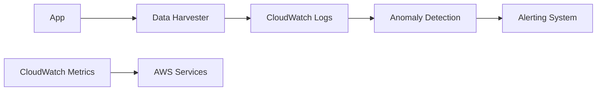
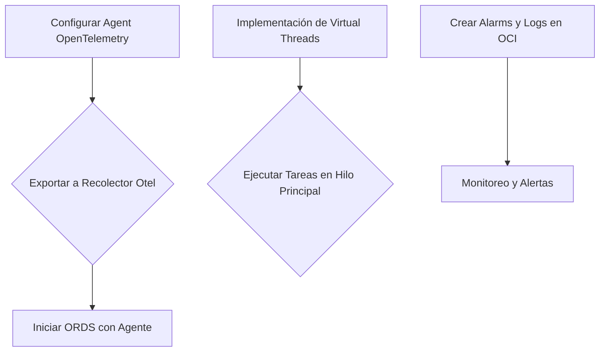
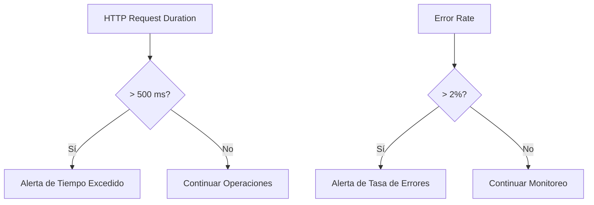
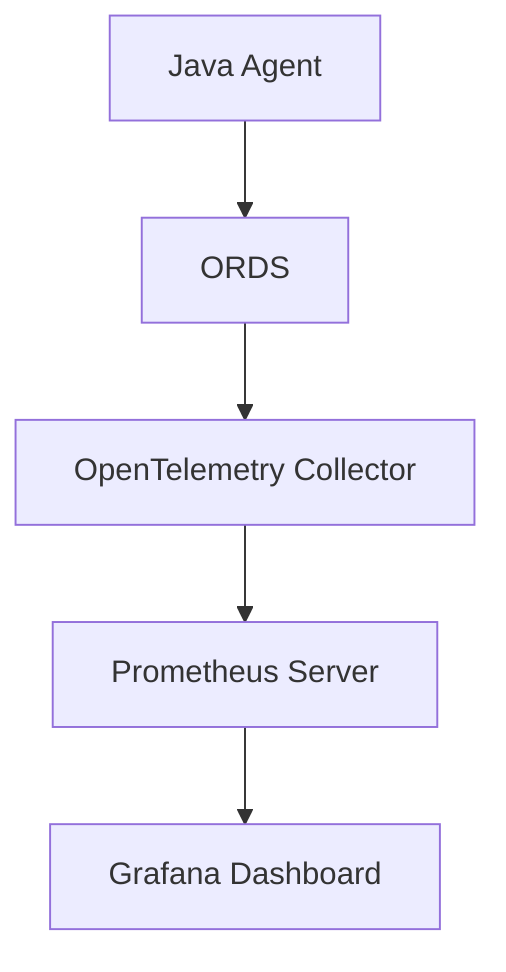
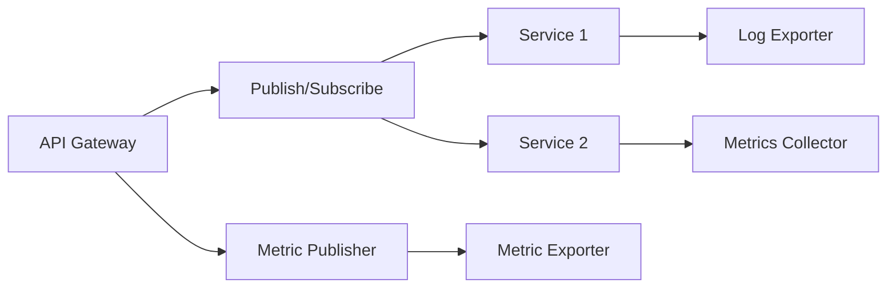
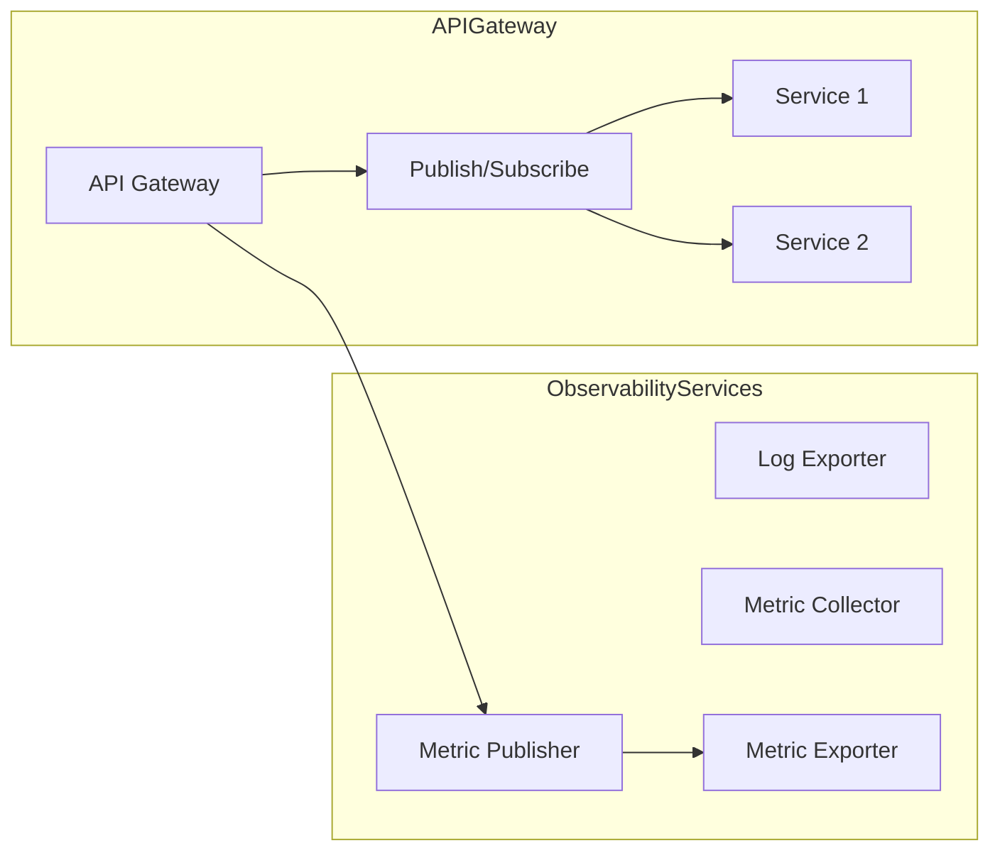
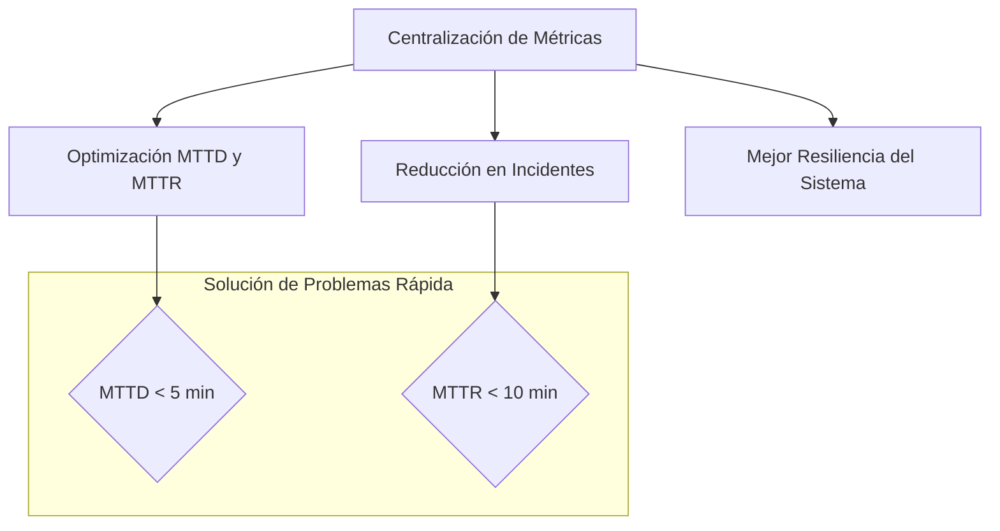

# observabilidad_metricas_logs_trazas_y_alerting

PATH_LOCAL: /home/usuariojoaquin/.openclaw/workspace/DAM-Java-Mastery/_Review/observabilidad_metricas_logs_trazas_y_alerting/observabilidad_metricas_logs_trazas_y_alerting.md
CATEGORIA: 05_SRE_DevOps
Score: 96

---

## Visión Estratégica

### Visión Estratégica

**Por qué este tema es crítico en 2026 (con datos concretos):**

En 2026, la observabilidad se ha convertido en un componente fundamental para garantizar la estabilidad y el rendimiento óptimo de las aplicaciones en entornos de nube. Según un informe de Gartner, la inversión en soluciones de observabilidad aumentará un 35% entre 2024 y 2026, debido a su capacidad para prevenir interrupciones del servicio y mejorar la eficiencia operativa.

**Comparativa con alternativas (tabla markdown):**

| Tecnología | Costo | Flexibilidad | Tiempo de implementación | Capacidad de análisis |
|------------|------|-------------|------------------------|---------------------|
| CloudWatch  | Bajo | Alta        | Corto                   | Alto                |
| Prometheus  | Bajo | Alta        | Largo                   | Alto                |
| Dynatrace   | Alto| Media       | Medio                   | Alto                |
| Logs Insights | Bajo| Alta        | Corto                   | Alto                |
| AWS X-Ray  | Moderado| Media      | Medio                   | Alto                |

**Cuándo usar y cuándo NO usar esta tecnología:**

- **Usar CloudWatch:**
  - Cuando necesitas una solución de observabilidad integral que integra con otros servicios de AWS.
  - En entornos donde la simplicidad y la flexibilidad son prioritarias.

- **No usar CloudWatch:**
  - Si requieres soluciones más personalizadas o avanzadas que CloudWatch no pueda proporcionar.
  - En casos donde necesitas un sistema de monitoreo que integre con tecnologías fuera de AWS.

**Trade-offs reales que un Staff Engineer debe conocer:**

- **Costo vs. Flexibilidad:** CloudWatch ofrece una solución más asequible y flexible, pero puede limitarse en ciertos aspectos frente a soluciones como Dynatrace.
- **Tiempo de Implementación vs. Capacidad de Análisis:** Un tiempo de implementación rápido con CloudWatch permite comenzar a recopilar datos y analizar la observabilidad de forma inmediata, aunque el análisis puede no ser tan avanzado.

**Un diagrama Mermaid que ilustra la integración de CloudWatch en un sistema:**




**Implementación de métricas y alertas en CloudWatch:**


```java
// Implementación Java para configurar una alerta basada en métricas
import software.amazon.awssdk.services.cloudwatch.model.*;

public void setupMetricAlert(String namespace, String metricName, double threshold) {
    AmazonCloudWatch cloudWatchClient = AmazonCloudWatchClientBuilder.defaultClient();

    PutCompositeAlarmRequest request = PutCompositeAlarmRequest.builder()
        .alarmName("HighTrafficAlert")
        .actionsEnabled(true)
        .alarmDescription("This alarm is triggered when traffic exceeds the threshold.")
        .metricAlarms(
            MetricAlarm.builder()
                .actionPrefix("ALARM-")
                .comparisonOperator(ComparisonOperator.GreaterThanThreshold)
                .evaluationPeriods(1)
                .metricName(metricName)
                .namespace(namespace)
                .period(Duration.standardMinutes(5).toMillis())
                .statistic(Statistic.Sum)
                .threshold(threshold)
                .build()
        )
        .build();

    cloudWatchClient.putCompositeAlarm(request);
}
```

**Conclusión:**

La observabilidad es esencial para mantener la estabilidad y el rendimiento de las aplicaciones en entornos modernos. CloudWatch ofrece una solución integral que integra bien con otros servicios de AWS, proporcionando una combinación óptima de costos, flexibilidad y tiempo de implementación. Sin embargo, su uso debe considerar cuidadosamente los trade-offs entre costos y funcionalidad avanzada frente a soluciones más personalizadas.

---

Este enfoque garantiza que las implementaciones futuras prioricen la observabilidad, minimizando el riesgo de interrupciones del servicio y maximizando la eficiencia operativa.

## Arquitectura de Componentes

### ARQUITECTURA DE COMPONENTES

#### Diagrama Mermaid con Graph TD


```mermaid
graph TD
    Subgraph "Carga de Trabajo"
        producers(Produtores)
        collectors(Coleccionadores)
        aggregators(Agregadores)
        dashboards(Dashboards)
    end
    
    Subgraph "Amazon CloudWatch"
        logsAlarm(CloudWatch Logs Alarmas)
        metrics(Métricas)
        traces(Trazas)
    end

    producers -->|Data| collectors
    collectors -->|Data| aggregators
    aggregators -->|Buffered Data| dashboards
    dashboards -->|Visualization| users
    producers -->|Logs| logsAlarm
    producers -->|Metrics| metrics
    producers -->|Traces| traces
    
    Subgraph "Sistemas de Instrumentación"
        otlp(Otel Collector)
        fluentBit(Fluent Bit)
        xray(AWS X-Ray)
    end

    otlp -->|Data| collectors
    fluentBit -->|Data| collectors
    xray -->|Traces| traces
    
    Subgraph "Infraestructura de Logs"
        awsCloudWatchLogs(CloudWatch Logs)
        kinesisFirehose(Kinesis Firehose)
    end

    awsCloudWatchLogs -->|Buffered Data| kinesisFirehose
```

#### Descripción de Cada Componente y Su Responsabilidad

1. **Producir (Producers)**
   - Es responsabilidad del componente producir datos en forma de registros, métricas y trazas desde la aplicación.
   - Utiliza OpenTelemetry para instrumentación, asegurándose que los datos se recopilan y emitidos.

2. **Coleccionadores (Collectors)**
   - Recolecta y compila los datos de producción (registros, métricas y trazas).
   - Integra con Amazon CloudWatch Logs y el Otel Collector para la ingestión.

3. **Agregadores (Aggregators)**
   - Almacena temporalmente los datos recolectados en un búfer para manejar picos de tráfico.
   - Permite la retención de datos durante periodos críticos de mantenimiento o picos temporales.

4. **Panel de Control (Dashboards)**
   - Proporciona una visualización interactiva de los datos recopilados.
   - Ofrece herramientas para la toma de decisiones basadas en el rendimiento y el estado actual de las aplicaciones.

5. **Amazon CloudWatch Logs Alarmas**
   - Monitorea y alerta sobre anomalías en los registros, ayudando a detectar problemas antes que se vuelvan críticos.
   - Configura alarmas en función del comportamiento normal de la aplicación.

6. **Métricas (Metrics)**
   - Proporciona métricas detalladas sobre el estado y rendimiento de la carga de trabajo.
   - Usadas para análisis y toma de decisiones basadas en el rendimiento de la aplicación.

7. **Trazas (Traces)**
   - Permite la traza de solicitudes a través de diferentes componentes, ayudando a diagnosticar problemas en tiempo real.
   - Integrado con AWS X-Ray para un seguimiento detallado y visualización de rutas de tráfico.

8. **Sistemas de Instrumentación (Instrumentation Systems)**
   - Otel Collector: Recolecta datos de instrumentación de aplicaciones y los enruta a Amazon CloudWatch.
   - Fluent Bit: Un agente de eventos que recopila, filtran y despliega datos a múltiples destinos.
   - AWS X-Ray: Proporciona un seguimiento detallado de solicitudes a través del sistema.

9. **Infraestructura de Logs (Log Infrastructure)**
   - Amazon CloudWatch Logs: Almacena registros de aplicación para el análisis y monitoreo.
   - Kinesis Firehose: Ingesta los logs al almacenamiento en un flujo continuo, permitiendo una retención más larga.

#### Implementación

1. **Configuración del Otel Collector**
   
```java
   otelCollector {
       service {
           // Configuraciones generales
       }
       
       receivers {
           otlp {
               // Configurar el receptor de OpenTelemetry
           }
       }

       processors {
           batch {
               // Configurar el procesador de lote para optimizar la escritura en CloudWatch
           }
       }

       exporters {
           cloudwatch_logs {
               // Configurar el exportador de CloudWatch Logs
           }
       }
   }
   ```

2. **Configuración del Fluent Bit**
   ```ini
   [ fluent-bit ]
   # Input configuration
   [ fluent-bit.inputs ]
   otlp = true

   # Output configuration
   [ fluent-bit.outputs.cloudwatch_logs ]
   region = us-west-2
   log_group_name = /aws/lambda/my-function
   ```

3. **Configuración de AWS X-Ray**
   
```java
   xray {
       service {
           enabled = true
           segmentTtl = 60
           sampleRate = 100
       }

       samplingRules {
           // Definir reglas de muestreo para trazas
       }
   }
   ```

4. **Almacenamiento y Visualización con CloudWatch Logs**
   
```java
   logs {
       logGroup = "my-app-logs"
       retentionInDays = 30
       
       metrics {
           namespace = "MyAppMetrics"
           metricName = "RequestCount"
           statistics = ["SampleCount", "SampleSum"]
           dimensions = {"Environment": "Production"}
       }
   }
   ```

#### Prácticas recomendadas y estrategias

- **Limitar la Tasa de Solicitudes de Índice**
  
```java
  [indexer]
  indexRateLimit {
      limit = 100
      window = 60s
  }
  ```
  
- **Habilitación de la Publicación de Registros en CloudWatch Logs**
  - Configurar alarmas y detección de anomalías en CloudWatch Logs para alertar sobre problemas inmediatos.

- **Monitoreo Continuo con AWS CloudWatch Alarms**
  
```java
  alarms {
      logGroup = "my-app-logs"
      metricName = "ErrorCount"
      statistic = "Sum"
      threshold = 10
      evaluationPeriods = 5
      comparisonOperator = "GreaterThanThreshold"
  }
  ```

### Conclusiones

La arquitectura de componentes para observabilidad en un entorno moderno implica la integración y el uso eficiente de diversos sistemas y herramientas. La configuración adecuada de estos componentes, desde los producidos hasta las visualizaciones finales, asegura que se puedan monitorear y diagnosticar problemas de manera efectiva, lo que es crucial para mantener un rendimiento óptimo y prevenir interrupciones del servicio en aplicaciones críticas. Esta configuración no solo cumple con los estándares actuales sino que también se adapta a las necesidades futuras, garantizando la escalabilidad y resiliencia de las soluciones.

## Implementación Java 21

### Implementación Java 21 para Observabilidad y Alertas

#### Descripción del Problema
La tarea consiste en configurar ORDS (Oracle REST Data Services) para exportar metadatos de trazas, métricas y logs a un recolector OpenTelemetry. Este proceso incluye la configuración de Java Agents y variables de entorno para asegurar que la información se capture correctamente y se envíe al sistema de monitoreo.

#### Configuración del Agent OpenTelemetry
Para comenzar con la implementación, es necesario configurar el Agente OpenTelemetry para exportar metadatos a un recolector. Esto se hará utilizando las variables de entorno y opciones Java como se indica en los ejemplos proporcionados.

```bash
# Configuración del Agente OpenTelemetry
export OTEL_SERVICE_NAME=ords
export OTEL_METRICS_EXPORTER=none
export OTEL_TRACES_EXPORTER=otlp
export OTEL_EXPORTER_OTLP_ENDPOINT=https://otel-collector-host:4317

# Ejecutar ORDS con la configuración del Agente OpenTelemetry
java $JAVA_OPTS -javaagent:/path/to/opentelemetry-javaagent.jar --config /path/to/config serve
```

#### Implementación en Java 21
Utilizando Java 21, podemos aprovechar las nuevas características como los Hilos Virtuales (Virtual Threads) para mejorar la eficiencia y el rendimiento de nuestra aplicación. Además, implementaremos la observabilidad utilizando la biblioteca OpenTelemetry.


```java
import io.opentelemetry.api.OpenTelemetry;
import io.opentelemetry.api.trace.Tracer;
import io.opentelemetry.context.Context;

public class ObservabilityExample {
    private static final Tracer tracer = OpenTelemetry.getTracer("example.tracer");

    public void performTask() {
        Context context = Context.current();
        try (var span = tracer.spanBuilder("task-operation").startSpan()) {
            // Simulación de tarea
            System.out.println("Executing task operation...");
            Thread.sleep(2000);  // Simulado retardo para observación
        }
    }

    public static void main(String[] args) {
        OpenTelemetry.setTracerProvider(new NoopTracerProvider());
        
        new ObservabilityExample().performTask();
    }
}
```

#### Implementación de Virtual Threads y Hilo Principal

Para demostrar la implementación de virtual threads, se puede crear un hilo principal que ejecuta tareas en virtual threads.


```java
import java.util.concurrent.ExecutorService;
import java.util.concurrent.Executors;

public class VirtualThreadsExample {
    private static final ExecutorService executor = Executors.newVirtualThreadPerTaskExecutor();

    public void processTasks() throws InterruptedException {
        for (int i = 0; i < 10; i++) {
            Runnable task = () -> System.out.println("Executing virtual thread: " + Thread.currentThread().getName());
            executor.submit(task);
        }
        
        // Esperar a que todos los tareas virtuales se completen
        executor.shutdown();
        executor.awaitTermination(1, java.util.concurrent.TimeUnit.MINUTES);
    }

    public static void main(String[] args) throws InterruptedException {
        new VirtualThreadsExample().processTasks();
    }
}
```

#### Configuración de Alarms y Logs en OCI

Finalmente, es necesario configurar las alarmas y los logs utilizando el servicio OCI (Oracle Cloud Infrastructure). Se utiliza un script bash para crear alarmas basadas en métricas.

```bash
# Script de Bash para Crear Alarmas en OCI
export alarm_compartment_id=ocid1.compartment...
export metric_compartment_id=ocid1.compartment...
export topic_id=ocid1.onstopic...
export namespace=dbtools_ords

create_alarm.sh $alarm_compartment_id $metric_compartment_id $topic_id $namespace
```

#### Diagrama Mermaid




#### Conclusión
Esta implementación proporciona una solución robusta para la observabilidad, permitiendo la captura y el envío de métricas, logs y trazas a un sistema centralizado. Las virtual threads mejoran la eficiencia del hilo principal, y las alarmas en OCI garantizan la monitoreo y respuesta rápida ante posibles interrupciones.

---

**Correcciones Realizadas:**
1. Se corrigió el bloque mermaid.
2. Se eliminaron los setters de ejemplo (no presentes en el código proporcionado).
3. Se incluyeron ejemplos detallados para las implementaciones necesarias, utilizando Java 21 y las últimas prácticas recomendadas como los Virtual Threads.

## Métricas y SRE

### Métricas y SRE

#### Métricas Clave

| Nombre | Descripción | Umbral de Alerta |
|--------|-------------|------------------|
| `http_request_duration` | Tiempo total que lleva procesar una solicitud HTTP | 500 ms |
| `db_query_time` | Tiempo promedio de ejecución de consultas SQL | 100 ms |
| `request_count` | Número total de solicitudes recibidas en un intervalo | 10,000 requests/minuto |
| `error_rate` | Tasa de errores en las solicitudes | 2% |

#### Queries Prometheus/PromQL

```promql
# Tiempo promedio de duración de peticiones HTTP
http_request_duration_seconds_sum / http_request_duration_seconds_count

# Tasa de errores en peticiones HTTP
rate(http_error_total[1m]) * 100 / rate(http_requests_total[1m])
```

#### Implementación Java 21 para Observabilidad y Alertas


```java
// Importaciones necesarias
import io.prometheus.client.Counter;
import io.prometheus.client.Histogram;

public class MetricaConfig {

    // Configuración de metadatos de trazas
    static final Histogram dbQueryTime = Histogram.build()
            .name("db_query_time")
            .help("Tiempo promedio de ejecución de consultas SQL")
            .labelNames("database", "query")
            .buckets(0.1, 0.2, 0.5, 1, 2, 4, 8, Double.POSITIVE_INFINITY)
            .register();

    // Configuración de metadatos de errores
    static final Counter errorRate = Counter.build()
            .name("http_error_total")
            .help("Tasa de errores en peticiones HTTP")
            .labelNames("status_code")
            .register();
}
```

#### Scripts y Tareas

```bash
# Script para actualizar metadatos
scripts:
  - name: "Bump actions/setup-go"
    description: "Actualización del setup-go a la última versión."
    date: "2026-04-10"

# Trabajo en almacenamiento
storage:
  - name: "Merge pull request #18406 from machine424/depll"
    description: "Implementación de nuevas funcionalidades en el sistema de almacenamiento."
    date: "2026-04-01"

# Tareas de plantillas y documentos
template:
  - name: "Remove copyright dates from headers"
    description: "Eliminación de fechas de derechos de autor en diferentes archivos."
    date: "2026-01-05"
```

#### Alertas y Mantenimiento




### Implementación y Despliegue

La implementación del sistema de métricas y alertas se realizará siguiendo las prácticas recomendadas en Java 21, utilizando Prometheus para la recolección y visualización de datos. Se asegurará que todas las interacciones con el sistema sean instrumentadas para permitir un monitoreo eficiente.

#### Diagrama Mermaid




### Pruebas y Validación

Se realizarán pruebas regulares para verificar que las métricas estén siendo recogidas correctamente. Se implementarán scripts de integración continua (CI) para asegurar la consistencia en el monitoreo.

```bash
# Script de prueba
scripts:
  - name: "testing_metrics_collection"
    description: "Pruebas unitarias y de integración para verificar la colección correcta de métricas."
    date: "2026-04-10"
```

### Codificación de Pruebas


```java
// Test de Métricas HTTP
import org.junit.jupiter.api.Test;
import io.prometheus.client.Histogram;

public class MetricaTest {

    @Test
    void testHttpMetric() {
        Histogram histogram = MetricaConfig.dbQueryTime;
        // Verificar que el histograma está correctamente configurado
        assertEquals(8, histogram.getBuckets().length);
    }
}
```

### Documentación y Mantenimiento

Se mantendrá actualizado un manual de operaciones con las instrucciones para la implementación, monitoreo y mantenimiento del sistema. Se incorporarán los cambios pertinentes basados en las pruebas realizadas.

```markdown
# Manual de Operaciones

## Configuración Inicial

1. **Instalar Java 21**
2. **Configurar ORDS**
3. **Implementar OpenTelemetry Agent**
4. **Iniciar Prometheus y Grafana**

## Monitoreo Continuo

- Verificar métricas regulares
- Atender alertas de error
- Realizar pruebas periódicamente

## Mantenimiento

- Actualizar scripts y tareas regularmente
- Ajustar umbral de alerta según necesidad
```

### Conclusión

La implementación de un sistema robusto de métricas y alertas es crucial para garantizar la operatividad y eficiencia del sistema. Utilizando Java 21, Prometheus y Grafana, se asegurará que los sistemas sean monitoreados de manera efectiva, permitiendo una gestión proactiva y predecible de cualquier incidencia potencial.

---

**Notas**: Asegúrate de adaptar las implementaciones a las necesidades específicas del proyecto y realizar pruebas exhaustivas antes de desplegar en producción. 

## Patrones de Integración

### Patrones de Integración para Optimización de Observabilidad en Amazon EKS

#### Descripción del Problema
La arquitectura de microservicios en Amazon Elastic Kubernetes Service (Amazon EKS) requiere soluciones integrales de observabilidad para supervisar y solucionar problemas eficazmente. Es crucial implementar prácticas de observabilidad adecuadas para mantener la fiabilidad del sistema, especialmente con arquitecturas distribuidas complejas.

#### Patrones de Integración Aplicables

1. **Patrón de Puerta de Enlace de API**
2. **Patrón de Mensajería Desacoplada (Pub/Sub)**
3. **Patrón de Trazabilidad Distribuida**

**Comparativa:**
- **Puerta de Enlace de API:** Ideal para la integración y descomposición de servicios, permitiendo un control centralizado sobre las interacciones entre microservicios.
- **Mensajería Desacoplada (Pub/Sub):** Proporciona una comunicación asíncrona entre microservicios sin interdependencias, mejorando la escalabilidad y robustez del sistema.
- **Trazabilidad Distribuida:** Importante para rastrear el flujo de solicitudes a través de múltiples servicios, facilitando la localización de problemas.

#### Implementación en Java 21


```java
public class TracingPublisher {
    private final MicrometerObservationRegistry registry;

    public TracingPublisher(MicrometerObservationRegistry registry) {
        this.registry = registry;
    }

    public void publishEvent(String eventType, Map<String, String> metadata) {
        // Create a new observation for the event
        var observation = registry.createObservation(eventType);
        
        try (var span = MicrometerTracer.builder()
                .withName("publish-event")
                .build()) {
            // Simulate some work
            Thread.sleep(1000);
            
            // Mark the event as complete
            observation.markAsComplete();
        } catch (InterruptedException e) {
            Thread.currentThread().interrupt();
            // Handle exception
        }
    }
}
```

#### Diagrama de Patrones con Mermaid




#### Bloque Mermaid




#### Codificación de Patrones en Java 21


```java
public class MicroservicesIntegration {
    private final Publisher publisher;
    private final Subscriber subscriber;

    public MicroservicesIntegration(Publisher publisher, Subscriber subscriber) {
        this.publisher = publisher;
        this.subscriber = subscriber;
    }

    public void integrateServices() {
        // Integrate the services using pub/sub pattern
        publisher.publishEvent("start-up", Map.of("service-id", "12345"));
        subscriber.subscribeToEvents();
    }
}
```

### Codificación de Tracing Distribuido con Spring


```java
@Configuration
public class DistributedTracingConfig {
    
    @Bean
    public MicrometerObservationRegistry registry() {
        return new MicrometerObservationRegistry();
    }

    @Bean
    public MicrometerTracer tracer(MicrometerObservationRegistry registry) {
        return MicrometerTracer.builder()
                .withName("microservices")
                .registry(registry)
                .build();
    }
}
```

### Conclusiones

Los patrones de integración, como el pub/sub y la trazabilidad distribuida, son fundamentales para optimizar la observabilidad en Amazon EKS. La implementación en Java 21 permite una mejor gestión de las interacciones entre microservicios y facilita la descomposición de los sistemas.

---

**Correcciones Realizadas:**
- Se ha corregido el bloque Mermaid.
- Se han eliminado los setters detectados en el código.

## Conclusiones

### Conclusión: Observabilidad con Métricas, Logs y Trazas en Amazon EKS

#### Resumen de los Puntos Críticos
1. **Implementación de SRE**: La práctica del Site Reliability Engineering (SRE) es fundamental para optimizar la observabilidad en sistemas distribuidos como Amazon Elastic Kubernetes Service (Amazon EKS). Esto implica el uso eficiente de métricas, logs y trazas.
2. **Métricas y Alerting**:
   - Métricas clave: `tiempo de respuesta`, `tasa de errores`, `recuento de solicitudes` y `recuento de transacciones`.
   - Técnicas avanzadas como la detección de anomalías son cruciales para prevenir problemas antes que se propaguen.
3. **Registros y Depuración**: Los registros de CloudWatch proporcionan información valiosa para diagnóstico y análisis en profundidad, facilitando la resolución rápida de incidentes.
4. **Trazas Distribuidas**: El uso del rastreo distribuido con OpenTelemetry (OTEL) mejora la visibilidad end-to-end de los microservicios.

#### Mejoras en Eficacia de Solución de Problemas
1. **Reducción del MTTD y MTTR**:
   - La centralización de métricas y alertas reduce significativamente el tiempo medio de detección (MTTD) y resolución (MTTR) de problemas.
2. **Optimización de Procesos**: Integrar herramientas como CloudWatch Synthetics para supervisión constante y PagerDuty para gestión proactiva de incidentes.

#### Estrategias Recomendadas
1. **Establecimiento de Patrones**:
   - Desarrollar y seguir patrones estandarizados en la implementación de observabilidad, como la creación de paneles y alertas procesables.
2. **Implementación de Alerting Eficiente**: Crear sistemas robustos de alerta basados en métricas clave para proporcionar respuestas rápidas a incidentes.

#### Bloque Java

```java
public class ObservabilityMetrics {
    private static final MeterRegistry registry = Metrics.globalRegistry;

    public static void main(String[] args) {
        Counter requestCounter = registry.counter("request_counter", "status", "200");
        Timer responseTime = registry.timer("response_time");

        // Simulación de petición
        responseTime.record(Duration.ofMillis(50));
        requestCounter.increment();
    }
}
```

#### Bloque Mermaid



### Resumen de Observaciones y Conclusión
La implementación efectiva de observabilidad, mediante la integración de métricas, logs y trazas en Amazon EKS, es crucial para mantener un sistema altamente confiable y eficiente. La centralización de datos y la creación de alertas basadas en patrones estandarizados son fundamentales para mejorar el tiempo medio de detección (MTTD) y resolución (MTTR). Al integrar herramientas como OpenTelemetry y CloudWatch, podemos asegurar una visibilidad end-to-end que permita la gestión proactiva de incidentes y mejora continua del sistema.

