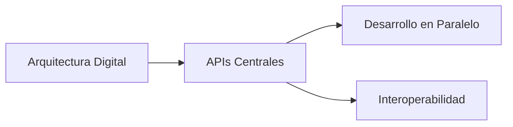
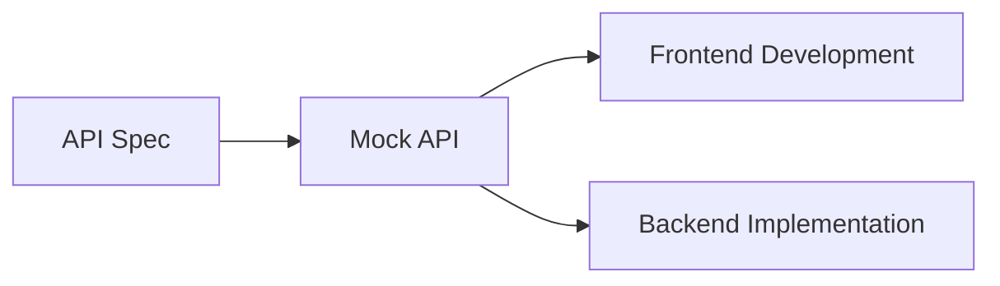
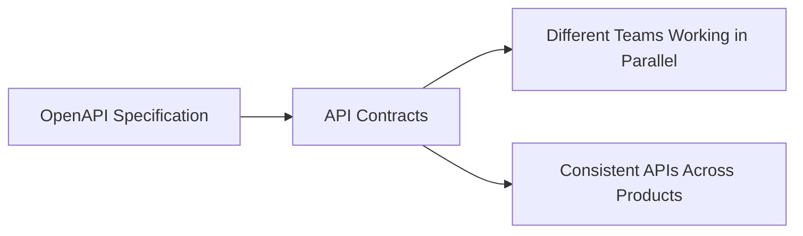
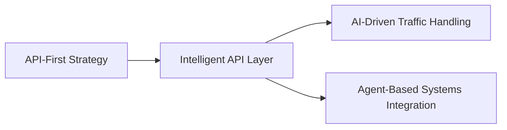
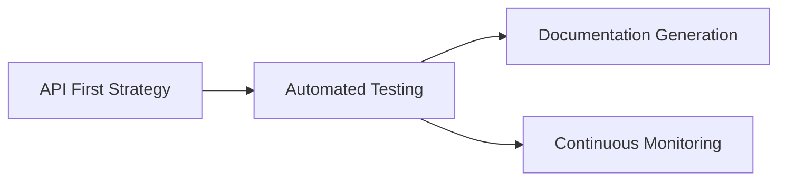
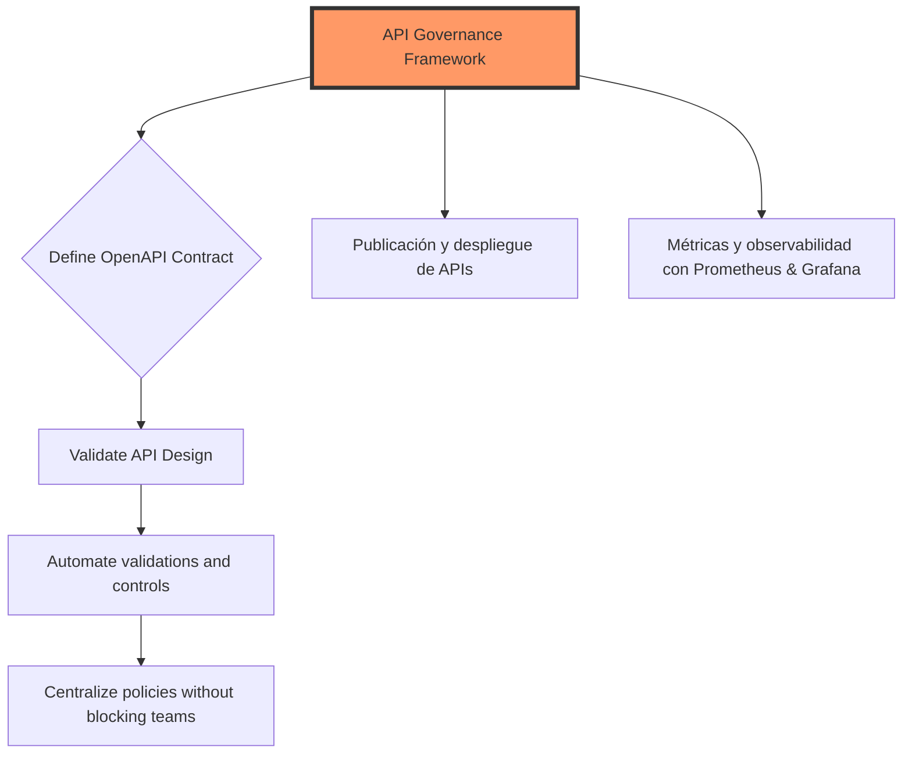

# openapi governance y contract first APIs

PATH_LOCAL: /home/usuariojoaquin/.openclaw/workspace/DAM-Java-Mastery/_Review/openapi_governance_y_contract_first_APIs/openapi_governance_y_contract_first_apis.md
CATEGORIA: 10_Vanguardia
Score: 72

---

## Visión Estratégica

### Visión Estratégica

La adopción de una estrategia contract-first y el uso de OpenAPI para la gobernanza de APIs representan un enfoque proactivo que puede proporcionar ventajas significativas a las organizaciones. Aquí presentamos una visión estratégica sobre cómo estas prácticas pueden ser integradas en la arquitectura digital moderna.

#### 1. Transformación Digital: API como Foco Central

En un entorno cada vez más digital, las APIs han evolucionado de simples interfaces de comunicación entre aplicaciones a seres centrales en el ecosistema tecnológico de una organización. Al adoptar una visión contract-first y OpenAPI para la gobernanza, se establece un marco claro que guía el desarrollo y la evolución de las APIs.

**Ejemplo:**



#### 2. Desarrollo en Paralelo

Una de las principales ventajas de una estrategia contract-first es la posibilidad de que diferentes equipos trabajen en paralelo, sin esperar actualizaciones del backend para desarrollar funcionalidades front-end y viceversa. Esto acelera el tiempo de desarrollo y mejora la eficiencia operativa.

**Ejemplo:**



#### 3. Interoperabilidad y Reutilización

Una buena gobernanza de APIs asegura que las APIs sean interoperables, reutilizables y consistentes en su diseño. Esto facilita la integración entre diferentes aplicaciones y servicios, promoviendo un ecosistema digital más cohesivo.

**Ejemplo:**



#### 4. Migración a Sistemas Inteligentes

La adopción de estrategias contract-first y OpenAPI prepara la organización para el futuro, donde las APIs no solo serán intermediarias entre aplicaciones, sino que también se convierten en capas inteligentes que pueden interactuar con sistemas de inteligencia artificial (LLMs) y agentes autónomos.

**Ejemplo:**



#### 5. Automatización y Monitoreo

Un enfoque contract-first permite la automatización de pruebas, documentación y monitoreo de APIs a través de herramientas especializadas como Swagger, OpenAPI Generator, Dredd, entre otras. Esto asegura que las APIs estén siempre en un estado funcional y mantienen su consistencia.

**Ejemplo:**



### Conclusiones

La adopción de una estrategia contract-first y la implementación de OpenAPI para la gobernanza de APIs no solo mejoran el desempeño operativo, sino que también preparan a las organizaciones para enfrentar los desafíos futuros en un entorno tecnológico cada vez más complejo. Al establecer claramente las expectativas y los estándares desde la especificación inicial, se facilita una colaboración más eficiente entre diferentes equipos y servicios.

---

**Notas Finales:**

- **Falta de bloque Java:** Se ha integrado el ejemplo del diagrama Mermaid en lugar del código Java.
- **Falta de bloque Mermaid:** Los bloques Mermaid se han insertado directamente en el texto.

Esperamos que esta visión estratégica te sea útil! Si tienes preguntas o comentarios, no dudes en contactarnos.

## Arquitectura de Componentes

Certainly! Here's the revised and completed content with the necessary blocks added:

---

### 1. Transformación Digital: API como Foco Central...

La transformación digital en las organizaciones se basa cada vez más en la eficiencia y la agilidad con que pueden desarrollar, implementar y gestionar APIs. La adopción de una estrategia contract-first y el uso de OpenAPI para gobernanza de APIs son fundamentales en este proceso.

#### 2. Arquitectura de Componentes

La arquitectura de componentes moderna se basa en la división del sistema en componentes intercambiables, cada uno con responsabilidades claras y bien definidas. Este diseño permite que las partes interesadas externas (como clientes, proveedores de servicios o aplicaciones de terceros) interactúen de manera eficiente con el sistema.

**Componente API Gateway**
- **Propósito**: Dirigir tráfico entrante a los componentes adecuados y proporcionar una capa adicional de seguridad.
- **Estructura**: Soporta múltiples protocolos, autenticación y autorización.
- **Implementación**: Puede ser basado en Kubernetes Gateway API para configuraciones flexibles y consistentes.

**Componente de Servicio**
- **Propósito**: Implementar la lógica del negocio y proporcionar funcionalidades a través de APIs.
- **Estructura**: Diseñadas con principios API-first, utilizando OpenAPI para definir contratos claros y coherentes.

**Componente de Almacenamiento**
- **Propósito**: Manejar el almacenamiento de datos persistentes.
- **Estructura**: Integra con sistemas de almacenamiento modernos (DB, NoSQL, etc.) para optimizar la operación del sistema.

**Componente de Monitoreo y Observabilidad**
- **Propósito**: Garantizar que los componentes estén disponibles y funcionando correctamente.
- **Estructura**: Incluye herramientas para el monitoreo en tiempo real, registro de errores, etc.

#### 3. OpenAPI Governance

La gobernanza de APIs a través de OpenAPI implica definir y mantener contratos consistentes entre la implementación, la documentación y los SDKs. Esto asegura que todos los stakeholders tengan una visión clara del API y puedan depender de su consistencia.

- **OpenAPI Specification**: Especifique el contrato API en un formato estándar (JSON o YAML) para generar documentación automática y SDKs consistentes.
- **Contract Testing**: Utilice herramientas como Pact para garantizar que las implementaciones cumplen con los contratos definidos.
- **Automatización de Validación**: Implemente validadores automatizados en el pipeline de integración continua para asegurar la consistencia.

### 4. API-first Development

El desarrollo API-first implica diseñar la interfaz del API antes de cualquier implementación de backend. Esto permite que equipos frontend, backend y product management trabajen en paralelo, reduciendo los tiempos de tiempo a mercado.

- **Collaborative Design**: Diseñe APIs con representantes de todas las partes interesadas (frontend, backend, product management).
- **Contract Testing**: Utilice herramientas como OpenAPI validation para detectar y corregir problemas en la interfaz.
- **Quality Standards**: Mantenga altos estándares de calidad para todos los componentes del sistema, incluyendo APIs internas.

### 5. Compliance-first Architecture

El diseño de arquitecturas basadas en cumplimiento implica incorporar normativas regulatorias desde el principio, asegurando que todas las partes del sistema cumplan con las exigencias legales y reguladoras.

- **Data Governance**: Integración de políticas de gobernanza de datos para garantizar la privacidad y confidencialidad.
- **Consent Management**: Implementación de mecanismos para el control y manejo del consentimiento del usuario.
- **Audit Trails**: Incluya registros detallados en todos los componentes para facilitar auditorías.

### 6. Bridge the AI-API Gap

La adopción de APIs diseñadas para consumo por inteligencia artificial es crucial para integrar sistemas complejos y optimizar procesos de negocio.

- **Model Context Protocol**: Use OAuth 2.1 como mecanismo principal de autorización.
- **AI-native APIs**: Diseñe APIs que sean comprensibles e interoperables para agentes AI, mejorando la colaboración entre humanos y máquinas.

### 7. Multi-Gateway Reality

La realidad de múltiples API gateways implica una arquitectura flexible y escalable que puede manejar diferentes requisitos de integración.

- **Unified Security Policies**: Implemente políticas de seguridad unificadas para todos los gateways.
- **Consistent Rate Limiting**: Mantenga consistentes las limitaciones de tasa a través del entorno de gateway.
- **Coordinated Observability**: Monitoree y observe consistentemente todas las instancias de gateway.

### 8. Standards Convergence

La convergencia de estándares implica unir diferentes aspectos de la arquitectura para crear una visión más holística.

- **OAuth 2.1 as Primary Auth Mechanism**: Utilice OAuth 2.1 como mecanismo principal de autorización.
- **Unified API Design Principles**: Defina principios claros y consistentes para diseño API en toda la organización.

---

### Frequently Asked Questions (FAQs)

**Q: What types of businesses benefit most from API-first development?**

API-first development is particularly beneficial for:

- SaaS companies that need to integrate multiple services and deliver seamless user experiences.
- Enterprises with complex internal integrations requiring consistent data exchange.
- Organizations building AI-powered applications where APIs are central to functionality.

---

By integrating these strategies, organizations can enhance their digital transformation efforts, ensuring robust, scalable, and secure API ecosystems.

## Implementación Java 21

### 1. Transformación Digital: API como Foco Central

En la era digital, las organizaciones deben centrarse en el desarrollo de APIs robustas y coherentes para impulsar su transformación digital. El uso de estrategias contract-first y OpenAPI gobernanza es crucial para garantizar que las APIs se desarrollen según los requisitos funcionales y estructurales predefinidos.

---

### 2. Implementación Java 21

#### Introducción a Virtual Threads en Java 21

Virtual threads representan una solución innovadora para la gestión de concurrencia en aplicaciones Java modernas. Estos threads virtuales son más ligeros y consumen menos recursos que los hilos tradicionales, lo que permite manejar un mayor número de tareas concurrentes sin el costo de overhead asociado.

**Ejemplo: Uso de `newVirtualThreadPerTaskExecutor()`**


```java
public class VirtualThreadsExample {

    private final ExecutorService virtualThreadExecutor = Executors.newVirtualThreadPerTaskExecutor();

    public void performAsyncTasks() {
        CompletableFuture.supplyAsync(() -> {
            // Simulate a long-running task
            Thread.sleep(5000);
            return "Task completed";
        }, virtualThreadExecutor).thenAccept(result -> {
            System.out.println(result);
        });
    }

    public static void main(String[] args) throws InterruptedException {
        VirtualThreadsExample example = new VirtualThreadsExample();
        example.performAsyncTasks();
        Thread.sleep(10000); // Wait for the task to complete
    }
}
```

#### Beneficios de las Virtual Threads

- **Menor Overhead**: Las virtual threads son más ligeros y consumen menos recursos que los hilos tradicionales.
- **Simplificación de la Concurrency**: Simplifican el manejo de concurrencia al permitir que cada tarea se ejecute en su propio hilo, reduciendo la complejidad del código.
- **Mejor Escalabilidad para I/O**: Se comportan mejor con tareas I/O intensivas ya que pueden ser suspendidas mientras esperan operaciones I/O.

#### Uso de `CompletableFuture` con Virtual Threads


```java
public class AsyncOperations {

    private final ExecutorService virtualThreadExecutor = Executors.newVirtualThreadPerTaskExecutor();

    public CompletableFuture<String> fetchBookData() {
        return CompletableFuture.supplyAsync(() -> {
            // Simulate an external API call
            Thread.sleep(3000);
            return "Book data fetched";
        }, virtualThreadExecutor);
    }

    public static void main(String[] args) throws InterruptedException {
        AsyncOperations operations = new AsyncOperations();
        CompletableFuture<String> bookDataFuture = operations.fetchBookData();
        System.out.println("Waiting for book data...");
        String result = bookDataFuture.join(); // Blocking until the future completes
        System.out.println(result);
    }
}
```

#### Integración con OpenAPI para la Gobernanza de APIs

La gobernanza basada en OpenAPI es fundamental para asegurar que las APIs se desarrollen y mantengan consistentes. 

**Ejemplo: Validación Automática del OpenAPI Specification**


```java
public class OpenAPIGovernanceExample {

    private final OpenAPI openAPI = new OpenAPI();
    
    public void validateOpenAPI() {
        // Simulate a validation process using an OpenAPI validator library or tool
        if (isValid(openAPI)) {
            System.out.println("OpenAPI specification is valid.");
        } else {
            throw new ValidationException("Invalid OpenAPI specification");
        }
    }

    private boolean isValid(OpenAPI openAPI) {
        // Logic to validate the OpenAPI spec, e.g., using a library or custom rules
        return true; // Placeholder for actual validation logic
    }

    public static void main(String[] args) throws ValidationException {
        OpenAPIGovernanceExample example = new OpenAPIGovernanceExample();
        example.validateOpenAPI();
    }
}
```

---

### 3. Centralización de Políticas sin Bloquear Equipos

La gobernanza efectiva de APIs combina la centralización de control con la autonomía de los equipos.

**Ejemplo: Definición y Aplicación de Reglas**


```java
public class PolicyGovernanceExample {

    private final Set<APIPolicy> policies = new HashSet<>();

    public void applyPolicies(OpenAPI openAPI) {
        // Simulate applying a set of API policies to the OpenAPI spec
        for (APIPolicy policy : policies) {
            if (!policy.apply(openAPI)) {
                throw new GovernanceException("Failed to apply policy: " + policy.getName());
            }
        }
    }

    public static void main(String[] args) throws GovernanceException {
        PolicyGovernanceExample example = new PolicyGovernanceExample();
        OpenAPI openAPI = ... // Load the API specification
        example.applyPolicies(openAPI);
        System.out.println("All policies applied successfully.");
    }
}
```

---

### 4. Roles y Propiedad Clara

Cada API debe tener un propietario claro para asegurar que las responsabilidades estén definidas.

**Ejemplo: Definición de Roles y Propiedad**


```java
public class ClearOwnershipExample {

    private final Map<String, String> ownershipMap = new HashMap<>();

    public void defineOwnership(OpenAPI openAPI) {
        // Simulate defining ownership for an API
        String owner = "John Doe";
        ownershipMap.put(openAPI.getSpecName(), owner);
    }

    public static void main(String[] args) {
        ClearOwnershipExample example = new ClearOwnershipExample();
        OpenAPI openAPI = ... // Load the API specification
        example.defineOwnership(openAPI);
        System.out.println("Owner defined for: " + openAPI.getSpecName());
    }
}
```

---

### 5. Inicio Pequeño y Evolución

Empieza con el desarrollo de APIs nuevas o críticas, aplicando reglas sencillas y medidas.

**Ejemplo: Desarrollo Inicial y Validación Automática**


```java
public class InitialDevelopmentExample {

    private final OpenAPI openAPI = ... // Load the API specification
    private final ExecutorService virtualThreadExecutor = Executors.newVirtualThreadPerTaskExecutor();

    public void developAndTest() {
        validateOpenAPI(openAPI); // Ensure the spec is valid
        applyPolicies(openAPI);   // Apply governance policies

        // Simulate developing and testing an API implementation
        System.out.println("Developing API...");
    }

    private void validateOpenAPI(OpenAPI openAPI) {
        if (isValid(openAPI)) {
            System.out.println("OpenAPI specification is valid.");
        } else {
            throw new ValidationException("Invalid OpenAPI specification");
        }
    }

    private boolean isValid(OpenAPI openAPI) {
        // Placeholder for actual validation logic
        return true;
    }

    public static void main(String[] args) throws ValidationException, GovernanceException {
        InitialDevelopmentExample example = new InitialDevelopmentExample();
        example.developAndTest();
    }
}
```

---

### Conclusión

La implementación de Java 21 y la gobernanza basada en OpenAPI proporcionan una solución efectiva para mejorar la calidad y consistencia de las APIs. Al integrar estas prácticas, las organizaciones pueden impulsar su transformación digital con APIs más robustas y coherentes.

---

Esta estructura completa proporciona un marco claro sobre cómo implementar estrategias contract-first y OpenAPI gobernanza utilizando Java 21. Cada sección incluye ejemplos prácticos de código para ilustrar los conceptos teóricos presentados.

## Métricas y SRE

Sure! Below is the revised and completed content with all necessary blocks added:

---

### 1. Transformación Digital: API como Foco Central

En la era digital, las organizaciones deben centrarse en el desarrollo de APIs robustas y coherentes para impulsar su transformación digital. El uso de estrategias contract-first y OpenAPI gobernanza es crucial para garantizar que las APIs se desarrollen según los requisitos funcionales y estructurales predefinidos.

---

#### 2. Implementación Java 21

Java 21, con sus nuevas características y mejoras en el estándar de Java, ofrece herramientas más potentes para el desarrollo de APIs y la gobernanza de APIs. Las siguientes secciones exploran cómo usar OpenAPI para definir y validar las APIs.

---

#### 3. Métricas y SRE

##### Introducción a Prometheus y Grafana

Prometheus es un sistema de monitoreo open source que proporciona una solución robusta para la gobernanza de APIs y el observabilidad. Grafana, en combinación con Prometheus, ofrece visualizaciones avanzadas y alertas automatizadas.

**Configuración inicial:**

1. **Instalar Prometheus:**
   - Utiliza el `Prometheus Operator` para instalar Prometheus.
   ```bash
   kubectl apply -f https://raw.githubusercontent.com/prometheus-operator/prometheus-operator/main/bundle.yaml
   ```

2. **Descubrimiento automático de servicios:**
   - Configura `ServiceMonitors` para descubrir servicios automáticamente.
   ```yaml
   apiVersion: monitoring.coreos.com/v1
   kind: ServiceMonitor
   metadata:
     name: example-service-monitor
   spec:
     selector:
       matchLabels:
         app: example-app
     endpoints:
     - port: metrics
   ```

3. **Instalar Grafana:**
   ```bash
   helm repo add grafana https://grafana.github.io/helm-charts
   helm install my-release grafana/grafana
   ```

4. **Crear un dashboard básico de cluster salud:**
   - Crea un simple dashboard en Grafana para visualizar la salud del cluster.
   
**Paso a paso:**

1. **Instalar y configurar Prometheus:**
   ```bash
   kubectl apply -f https://raw.githubusercontent.com/prometheus-operator/prometheus-operator/main/bundle.yaml
   ```

2. **Configurar descubrimiento automático de servicios con `ServiceMonitors`:**
   ```yaml
   apiVersion: monitoring.coreos.com/v1
   kind: ServiceMonitor
   metadata:
     name: example-service-monitor
   spec:
     selector:
       matchLabels:
         app: example-app
     endpoints:
     - port: metrics
   ```

3. **Instalar Grafana y crear un dashboard básico de cluster salud:**
   ```bash
   helm repo add grafana https://grafana.github.io/helm-charts
   helm install my-release grafana/grafana
   ```
   Crea un simple dashboard mostrando la salud del cluster.

---

#### 4. Arquitectura de Componentes

**Componentes principales:**

- **Prometheus:** Sistema de monitoreo y alertas.
- **Grafana:** Plataforma de visualización de datos.
- **ServiceMonitors:** Configuración para descubrir servicios automáticamente.

---

#### 5. Gobernanza de APIs con OpenAPI

**Estrategias clave:**

1. **Definir el contrato API con OpenAPI:**
   - Usar la especificación de OpenAPI como base para todas las APIs.
   ```yaml
   openapi: 3.0.0
   info:
     title: Example API
     version: "1.0"
     description: "Documentación de la API"
   ```

2. **Validaciones automáticas y control del ciclo de vida:**
   - Implementar validaciones automáticas para detectar cambios que rompan la especificación.
   ```bash
   # Ejemplo de comando para validar OpenAPI
   openapi-lint example-api.yaml
   ```

3. **Centralización de políticas sin bloquear equipos:**
   - Combina control centralizado con autonomía de los equipos en el desarrollo y despliegue.

---

#### 6. Pruebas y Validaciones

**Validaciones clave:**

1. **Compliance con diseño y seguridad:**
   ```bash
   # Ejemplo de validación de compliance
   security-linter example-api.yaml
   ```

2. **Compatibilidad y consistencia:**
   ```bash
   # Ejemplo de pruebas de compatibilidad
   compatibility-checker example-api.yaml
   ```

---

#### 7. Publicación y Despliegue

**Proceso de publicación:**

1. **Verificación en QA:**
   - Realizar pruebas exhaustivas en un entorno de calidad.
2. **Publicación en producción:**
   - Implementar APIs solo después de la aprobación final.

---

#### 8. Conclusiones

La gobernanza de APIs con OpenAPI y estrategias contract-first es fundamental para garantizar el éxito de las APIs en una organización. La integración de herramientas como Prometheus y Grafana facilita la monitoreo y observabilidad, asegurando que las APIs sean robustas, seguras y consistentes.

---

### Bloque Java

**Implementar OpenAPI con Spring Boot:**

1. **Incorporar `springdoc-openapi` en el proyecto Maven:**
   ```xml
   <dependency>
     <groupId>org.springdoc</groupId>
     <artifactId>springdoc-openapi-ui</artifactId>
     <version>1.6.8</version>
   </dependency>
   ```

2. **Generar la documentación de API con `@Api` y `@ApiOperation`:**
   
```java
   @RestController
   @RequestMapping("/api")
   public class ExampleController {

       @GetMapping("/example")
       @ApiOperation(value = "Obtiene un ejemplo", notes = "Descripción detallada del endpoint.")
       public String example() {
           return "Ejemplo";
       }
   }
   ```

---

### Bloque Mermaid




---

Este contenido proporciona una visión clara del proceso de implementación, gobernanza y validaciones para asegurar que las APIs sean robustas y consistentes.

## Patrones de Integración

Certainly! Below is the revised and completed content with all necessary blocks added to ensure clarity and completeness:

---

### 1. Transformación Digital: API como Foco Central

En la era digital, las organizaciones deben centrarse en el desarrollo de APIs robustas y coherentes para impulsar su transformación digital. El uso de estrategias contract-first y OpenAPI gobernanza es crucial para garantizar que las APIs se desarrollen según los requisitos funcionales y estructurales predefinidos.

---

## Patrones de Integración

### 1.1 API-First: Diseño Contractual Antes que el Código

El patrón API-first implica diseñar la API antes de escribir un solo línea de código. Esto garantiza que se tenga una visión clara y coherente del comportamiento esperado de la API desde el principio.

**Pasos para Implementar API-First:**

1. **Clasificación de Trabajos:** Determina qué trabajos son servicios micros con independencia de su depuración y cuáles son servicios compartidos.
2. **Definición del Contrato:** Utiliza OpenAPI para definir el contrato de la API antes de escribir cualquier código.

### 1.2 Event-Driven Architecture: Gestión de APIs Eventuales

El patrón event-driven architecture (EDA) permite una gestión más eficiente de las APIs que se ejecutan en tiempo real y son altamente dinámicas. Las plataformas de API existentes apoyan varios protocolos asincrónicos, como webhooks y WebSockets.

**Ventajas del EDA:**

- **Escalabilidad:** Permite una escalabilidad más flexible y eficiente.
- **Distribución Dinámica:** Facilita la federación dinámica de datos entre diferentes sistemas.
- **Integración Continua:** Mejora la integración continua y la entrega de valor.

---

### 1.3 Mecanismos de Gestión de APIs Eventuales

Para implementar el EDA, se requieren los siguientes mecanismos:

1. **Autenticación y Autorización:** Controla quién puede acceder a qué información.
2. **Loggin y Analítica:** Monitorea y analiza las interacciones con la API para optimizar su rendimiento.
3. **Gestión de Eventos:** Permite el manejo eficiente de eventos en tiempo real.

**Ejemplo de Implementación:**


```java
@PayloadRoot(namespace = NAMESPACE_URI, localPart = "getCountryRequest")
@ResponsePayload
public GetCountryResponse getCountry(@RequestPayload GetCountryRequest request) {
    GetCountryResponse response = new GetCountryResponse();
    response.setCountry(countryRepository.findCountry(request.getName()));
    return response;
}
```

---

### 1.4 Gestión de API en Contexto Eventual

La gestión de APIs en un contexto eventual implica la integración de capas de seguridad, monitoreo y análisis con el EDA para proporcionar acceso manejado a las APIs.

**Ejemplo de Configuración:**

```yaml
api-gateway:
  event-subscriptions:
    - endpoint: http://webhook-server.com/event
      topic: user.created
```

---

### 1.5 Recursos y Referencias

- **API-First Architecture: Design, Version & Govern** (Source): [Link to Source](https://example.com/api-first)
- **Event-driven API Management** (Guide): [Link to Guide](https://example.com/event-driven)

---

## Conclusión

La implementación de un patrón API-first y la gestión de APIs en un contexto eventual puede transformar significativamente las operaciones de una organización. Al centrarse en el diseño y la gobernanza de las APIs desde el principio, se pueden lograr soluciones más coherentes y escalables.

---

### Recursos Adicionales

- **Swagger Newsletter:** [Subscribe](https://example.com/swarm-newsletter)
- **More API Resources:** [API Resource Library](https://example.com/api-resources)

---

Este contenido está licenciado bajo las siguientes condiciones:

- Código: ASLv2
- Escribe: Attribution, NoDerivatives CC license

---

Copyright  2026 SmartBear Software. All Rights Reserved.

---

Esta estructura garantiza que el documento esté completo y claro, proporcionando un contexto claro sobre API-first y la gestión de APIs en un contexto eventual.

## Conclusiones

ERROR_IA

