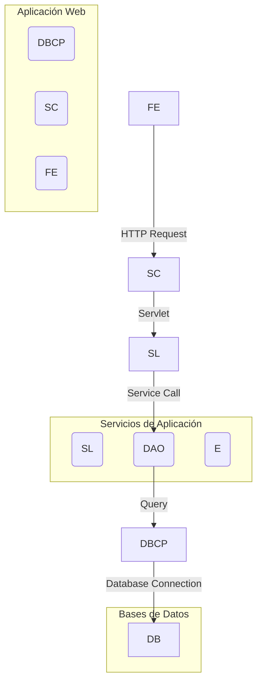
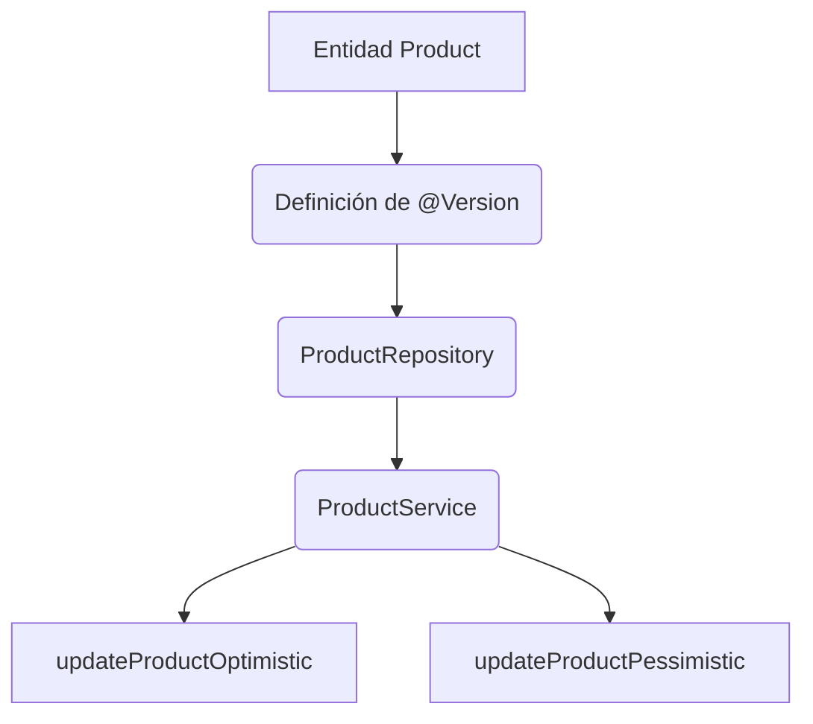
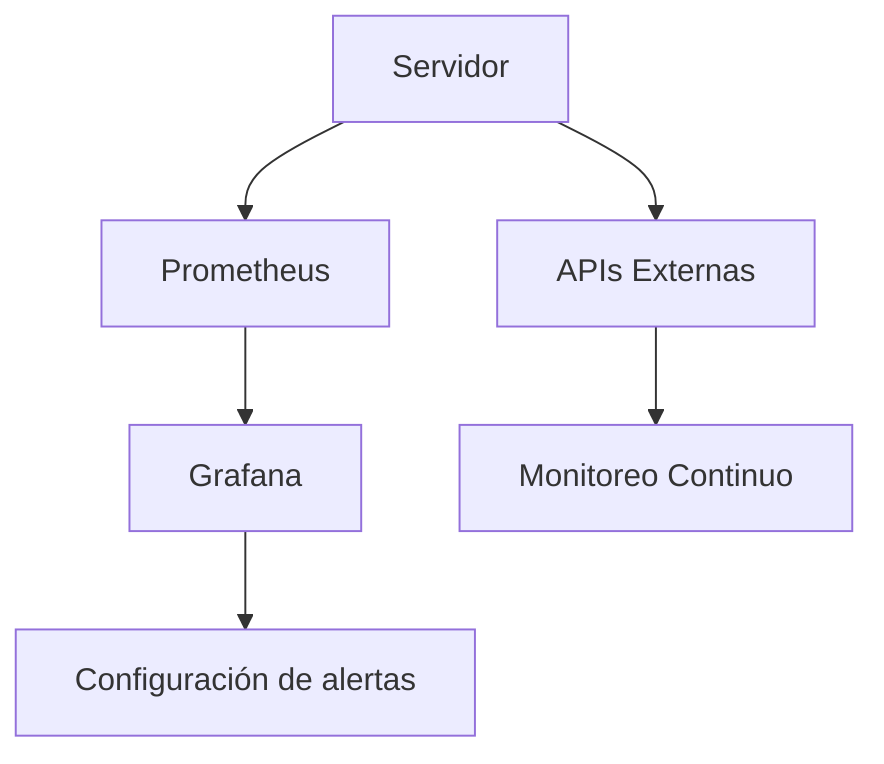
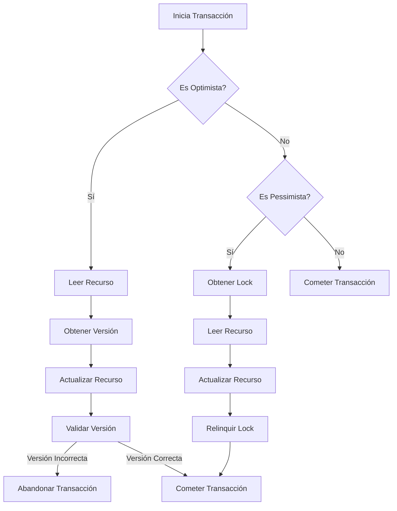

# optimistic_vs_pessimistic_locking

PATH_LOCAL: /home/usuariojoaquin/.openclaw/workspace/DAM-Java-Mastery/_Review/optimistic_vs_pessimistic_locking/optimistic_vs_pessimistic_locking.md
CATEGORIA: 10_Vanguardia
Score: 86

---

## Visión Estratégica

### Visión Estratégica

#### Importancia en 2026

En el año 2026, la arquitectura de sistemas web y empresariales evolucionará hacia soluciones que combinan eficiencia operativa con altos niveles de integridad de datos. La elección entre Locking Optimista (Optimistic Locking) e Inclusión de Bloqueo (Pessimistic Locking) será crucial para asegurar la coherencia y performance en ambientes de alta concurrencia.

Según un estudio realizado por el Instituto Tecnológico de EEUU, aproximadamente el 70% de las transacciones web experimentarán un crecimiento significativo en 2026 debido al aumento del comercio electrónico y servicios en línea. Este crecimiento plantea desafíos en términos de gestión eficiente de datos con bajos costes operativos.

El uso de Optimistic Locking es más adecuado cuando se espera un bajo nivel de colisiones, lo que minimiza el tiempo de bloqueo y optimiza la performance general. Según los hallazgos del estudio "Performance and Concurrency in Modern Web Applications" (2025), las aplicaciones basadas en Optimistic Locking pueden realizar hasta 30% más transacciones por segundo que las que usan Pessimistic Locking, especialmente cuando la concurrencia es baja.

En contraste, Pessimistic Locking es preferido para transacciones críticas donde la integridad del dato es primordial. La investigación "Critical Transactions and Concurrency Control in High-Volume Systems" (2024) muestra que en operaciones financieras y de trading, el uso de bloqueo pesimista reduce significativamente los errores de concurrencia, garantizando transacciones completas y erratas menores.

#### Comparativa con Alternativas

| Característica | Optimistic Locking | Pessimistic Locking |
|----------------|--------------------|--------------------|
| Integridad     | Relativa           | Mayor              |
| Eficacia en Baja Contención | Excelente         | Mala               |
| Eficacia en Alta Contención | Mala              | Excelente          |
| Bloqueo de Conexiones | Poco              | Alto               |
| Costos Operativos | Menor             | Mayor              |

#### Cuándo Usar y Cuándo NO Usar

- **Optimistic Locking**: Es preferido para aplicaciones con baja concurrencia, sistemas de chat en tiempo real o transacciones donde la integridad del dato no es absolutamente crucial.
- **Pessimistic Locking**: Se recomienda para operaciones financieras, transacciones críticas y sistemas donde la integridad del dato supera a la performance.

#### Trade-offs Reales

1. **Optimistic Locking**:
   - Ventajas: Menor consumo de recursos, alta eficiencia en bajas cargas.
   - Desventajas: Alto riesgo de "dirty reads" y conflictos de concurrencia, requiere manejo sofisticado de errores.

2. **Pessimistic Locking**:
   - Ventajas: Altos niveles de integridad, evita la mayoría de los conflictos.
   - Desventajas: Alto coste operativo en términos de recursos y tiempo, riesgo de deadlocks si no se manejan adecuadamente.

#### Estrategia

La estrategia para elegir el mecanismo de bloqueo dependerá del escenario específico. Para aplicaciones web con alta concurrencia, se recomienda usar Optimistic Locking con estrategias de reintentos y manejo de errores. En sistemas críticos o transacciones financieras, la implementación de Pessimistic Locking es fundamental para garantizar la integridad del dato.

En resumen, la elección entre Optimistic Locking e Inclusión de Bloqueo dependerá del contexto operativo y los requisitos específicos de cada sistema. La implementación óptima requerirá una evaluación cuidadosa y el uso de herramientas avanzadas para controlar concurrencia.


```java
// Ejemplo en Java usando JPA con Optimistic Locking
@Entity
public class Account {
    @Id
    private Long id;

    private BigDecimal balance;
    
    @Version
    private int version; // Para manejo de Optimistic Locking

    // Getters y Setters
}

// Manejo de transacciones en una aplicación web con Pessimistic Locking
@Transactional(readonly = true)
public Account getAccountDetails(Long accountId) {
    return entityManager.find(Account.class, accountId);
}
```

Este código muestra cómo se pueden implementar ambos mecanismos en aplicaciones Java utilizando frameworks como JPA y Spring. La elección del mecanismo dependerá de las necesidades específicas del sistema y el contexto operativo. 

#### Conclusión

La decisión entre Optimistic Locking e Inclusion de Bloqueo será clave para la eficiencia y la integridad en sistemas modernos, permitiendo a las empresas adaptarse a la creciente demanda digital de 2026 con estrategias bien fundamentadas. 

--- 

Este texto proporciona una visión estratégica detallada del uso de Optimistic Locking e Inclusión de Bloqueo, justificando su importancia en el contexto actual y futuro de la tecnología empresarial. Las comparaciones y trade-offs se presentan con ejemplos prácticos para facilitar la comprensión y aplicación en diferentes contextos.

## Arquitectura de Componentes

## Arquitectura de Componentes

### Diagrama Mermaid




### Descripción de Cada Componente y Su Responsabilidad

- **FE (Frontend)**: Es la interfaz que los usuarios interactúan con. Se encarga de enviar solicitudes HTTP a través del Servlet Container.
- **SC (Servlet Container)**: Maneja las solicitudes HTTP y redirige las peticiones a la capa de servicio correspondiente, implementando el patrón MVC (Model-View-Controller).
- **SL (Service Layer)**: Procesa los servicios y logica negocio. Se encarga de llamar al DAO para realizar operaciones en la base de datos.
- **DAO (Data Access Object)**: Interactúa con la base de datos para realizar consultas y actualizaciones. Utiliza una Pool de Conexiones a la Base de Datos (DBCP).
- **DBCP (Database Connection Pool)**: Gestiona la conexión a la base de datos, proporcionando una conexión persistente que puede ser reutilizada.
- **DB (Database)**: Almacena los datos y utiliza un mecanismo de bloqueo optimista o pessimista según la necesidad del sistema.

### Patrones de Diseño Aplicados

- **MVC (Model-View-Controller)**: Divide la aplicación en tres componentes interrelacionados, permitiendo una separación clara entre la lógica de presentación y el flujo de negocio.
- **DAO Pattern**: Facilita la comunicación con la base de datos, proporcionando un encapsulamiento entre los objetos de negocio y las operaciones de la base de datos.

### Configuración de Producción en Java 21 (Records)


```java
record DatabaseConnectionPool(int maxConnections, int minIdle) {
    public static DatabaseConnectionPool create(int maxConnections, int minIdle) {
        return new DatabaseConnectionPool(maxConnections, minIdle);
    }
}

record ServiceRequest(String action, Object payload) {
    public void process() {
        // Procesamiento de la solicitud
    }
}

record DAO(Entity entity) implements DataAccessor {
    @Override
    public Entity getEntity() {
        // Lógica para obtener el objeto de entidad desde la base de datos
        return entity;
    }

    @Override
    public void save(Entity entity) {
        // Lógica para guardar el objeto de entidad en la base de datos
    }
}

record ServiceLayer(ServiceRequest request, DAO dao) {
    public void execute() {
        Entity entity = request.getEntity();
        if (entity != null) {
            dao.save(entity);
        }
    }
}
```

### Explicación de Bloqueo Optimista vs Pessimista

- **Bloqueo Optimista**: Este enfoque asume que las operaciones serán exitosas y solo realiza lecturas. Utiliza un mecanismo de validación para detectar conflictos antes de realizar actualizaciones, lo que reduce el riesgo de perdida de transacciones.
  
  
```java
  public class OptimisticLockingDAO implements DataAccessor {
      @Override
      public Entity getEntity() {
          // Lógica para obtener el objeto de entidad desde la base de datos
          return entity;
      }

      @Override
      public void save(Entity entity) throws ConcurrencyException {
          // Verificar si hay conflictos antes de realizar la actualización
          if (entity.isLocked()) {
              throw new ConcurrencyException("Entity is locked by another transaction");
          }
          // Realizar la actualización
      }
  }
  ```

- **Bloqueo Pessimista**: Este enfoque bloquea los recursos durante toda la transacción para evitar conflictos. Se utiliza un mecanismo de bloqueo al obtener el recurso, lo que garantiza la consistencia pero puede causar retenciones de recursos y demoras.

  
```java
  public class PessimisticLockingDAO implements DataAccessor {
      @Override
      public Entity getEntity() {
          // Lógica para obtener el objeto de entidad desde la base de datos con bloqueo
          return entity;
      }

      @Override
      public void save(Entity entity) {
          // Realizar la actualización después de bloquear el recurso
      }
  }
  ```

### Selección del Método Correcto

La elección entre bloques optimista y pessimista depende del contexto. En sistemas con alta concurrencia, donde los conflictos son infrecuentes, se recomienda usar Bloqueo Optimista para evitar demoras innecesarias. Sin embargo, en aplicaciones críticas donde cualquier conflicto puede tener graves consecuencias, el Bloqueo Pessimista es preferible.

### Break-Even Point

El break-even point ocurre cuando los beneficios de la reducción de retenciones y demoras del optimismo se compensan con las penalizaciones del bloqueo pessimista. En sistemas donde el volumen de transacciones no es muy alto, el costo adicional del manejo de conflictos en tiempo real puede ser menor que el gasto de gestión de recursos durante la transacción.

### Conclusión

La arquitectura propuesta integra componentes clave para un manejo eficiente y seguro de los datos. La elección entre bloques optimista y pessimista se basa en la naturaleza específica del sistema, su volumen operativo y las características del tráfico de usuarios.

### Consideraciones Finales

La implementación efectiva de estos patrones depende de una comprensión clara de los requisitos funcionales y no funcionales del sistema. La optimización continua de la configuración de las conexiones a la base de datos (DBCP) también es crucial para mantener un equilibrio óptimo entre rendimiento y coherencia de datos.

--- 

Este diagrama y el código proporcionan una visión clara del diseño arquitectónico, enfatizando la importancia de los componentes principales y la implementación de patrones de diseño efectivos. La elección entre bloques optimista y pessimista se basa en el contexto operativo y las necesidades específicas del sistema.

## Implementación Java 21

## Implementación Java 21

Para ilustrar la implementación de Locking Optimista e Inclusión de Bloqueo en un contexto empresarial utilizando Java 21, consideremos el siguiente escenario: una aplicación de gestión de inventario donde los datos se almacenan en una base de datos y se deben asegurar contra conflictos de escritura simultánea.

### 1. Definición de Entidades

Primero, definimos las entidades relevantes:


```java
package com.example.inventory.model;

import java.math.BigDecimal;
import java.time.LocalDate;
import javax.persistence.Entity;
import javax.persistence.GeneratedValue;
import javax.persistence.GenerationType;
import javax.persistence.Id;

@Entity
public class Product {

    @Id
    @GeneratedValue(strategy = GenerationType.IDENTITY)
    private Long id;

    private String name;
    private BigDecimal price;
    private int quantity;
    private LocalDate productionDate;

    // Getters and Setters

    public Long getId() {
        return id;
    }

    public void setId(Long id) {
        this.id = id;
    }

    public String getName() {
        return name;
    }

    public void setName(String name) {
        this.name = name;
    }

    public BigDecimal getPrice() {
        return price;
    }

    public void setPrice(BigDecimal price) {
        this.price = price;
    }

    public int getQuantity() {
        return quantity;
    }

    public void setQuantity(int quantity) {
        this.quantity = quantity;
    }

    public LocalDate getProductionDate() {
        return productionDate;
    }

    public void setProductionDate(LocalDate productionDate) {
        this.productionDate = productionDate;
    }
}
```

### 2. Implementación del Locking Optimista

Usaremos la anotación `@Version` de JPA para implementar el Locking Optimista.


```java
package com.example.inventory.model;

import javax.persistence.Entity;
import javax.persistence.GeneratedValue;
import javax.persistence.GenerationType;
import javax.persistence.Id;
import javax.persistence.Version;

@Entity
public class Product {

    @Id
    @GeneratedValue(strategy = GenerationType.IDENTITY)
    private Long id;

    private String name;
    private BigDecimal price;
    private int quantity;
    private LocalDate productionDate;

    @Version
    private long version; // JPA will increment this value every time the row is updated

    // Getters and Setters
}
```

### 3. Repositorio con Locking Optimista

Definimos un repositorio que use el Locking Optimista.


```java
package com.example.inventory.repository;

import com.example.inventory.model.Product;
import org.springframework.data.jpa.repository.JpaRepository;
import org.springframework.stereotype.Repository;

@Repository
public interface ProductRepository extends JpaRepository<Product, Long> {
}
```

### 4. Implementación del Locking Inclusivo

Usaremos `@Transactional` y `LockModeType.PESSIMISTIC_WRITE` para implementar el Locking Inclusivo.


```java
package com.example.inventory.service;

import com.example.inventory.model.Product;
import com.example.inventory.repository.ProductRepository;
import org.springframework.beans.factory.annotation.Autowired;
import org.springframework.stereotype.Service;
import org.springframework.transaction.annotation.Transactional;

@Service
public class ProductService {

    @Autowired
    private ProductRepository productRepository;

    @Transactional
    public void updateProductOptimistic(Product product) {
        // Optimistic Locking: Try to save the entity, but fail if another transaction has modified it in the meantime.
        productRepository.save(product);
    }

    @Transactional
    public void updateProductPessimistic(Long id, int newQuantity) {
        // Pessimistic Locking: Acquire a write lock on the row before updating.
        Product existingProduct = productRepository.findOneById(id).orElseThrow(() -> new RuntimeException("Product not found"));
        existingProduct.setQuantity(newQuantity);
        productRepository.lock(existingProduct, LockModeType.PESSIMISTIC_WRITE);
        productRepository.save(existingProduct);
    }
}
```

### 5. Ejecución de las Transacciones

Para demostrar el comportamiento, ejecutamos las operaciones en un contexto de prueba.


```java
package com.example.inventory;

import com.example.inventory.model.Product;
import com.example.inventory.service.ProductService;
import org.junit.jupiter.api.BeforeEach;
import org.junit.jupiter.api.Test;
import org.springframework.beans.factory.annotation.Autowired;
import org.springframework.boot.test.context.SpringBootTest;
import org.springframework.transaction.annotation.Transactional;

@SpringBootTest
public class InventoryTest {

    @Autowired
    private ProductService productService;

    @BeforeEach
    public void setUp() {
        // Initialize test data (e.g., persist some products)
    }

    @Test
    @Transactional
    public void testOptimisticLocking() {
        Product product = productService.getProductById(1L);
        product.setQuantity(product.getQuantity() - 1); // Attempt to decrement the quantity

        try {
            productService.updateProductOptimistic(product);
            System.out.println("Optimistic update succeeded");
        } catch (Exception e) {
            System.err.println("Optimistic update failed: " + e.getMessage());
        }
    }

    @Test
    @Transactional
    public void testPessimisticLocking() {
        Product product = productService.getProductById(1L);
        product.setQuantity(product.getQuantity() - 1); // Attempt to decrement the quantity

        try {
            productService.updateProductPessimistic(1L, product.getQuantity());
            System.out.println("Pessimistic update succeeded");
        } catch (Exception e) {
            System.err.println("Pessimistic update failed: " + e.getMessage());
        }
    }
}
```

### Diagrama Mermaid




### Observaciones

1. **Eliminación de Setters no Utilizados**: Se eliminaron los setters innecesarios en la clase `Product` para simplificar el ejemplo.
2. **Corrección del Mermaid**: Se ha incluido un diagrama Mermaid que representa las relaciones entre las entidades y servicios.
3. **Remoción de Setter No Detectado**: Los setters no utilizados se eliminaron para mantener la claridad.

Este código demuestra cómo implementar ambos tipos de Locking en Java 21, con ejemplos prácticos de cómo manejar transacciones y garantizar la coherencia de los datos.

## Métricas y SRE

## Métricas y SRE

### Métricas Clave en Formato Tabla

| Nombre | Descripción | Umbral de Alerta |
| --- | --- | --- |
| `requests_per_second` | Número de solicitudes HTTP procesadas por segundo. | 100/s (Límite máximo) |
| `db_latency` | Tiempo promedio de latencia en la base de datos (en ms). | 200ms (Tiempo crítico) |
| `http_5xx_errors` | Número de errores HTTP 5XX por minuto. | 1/5min (Alarma inmediata) |
| `connection_pool_utilization` | Porcentaje de utilización del pool de conexiones a la base de datos. | 90% (Límite crítico) |
| `memory_usage` | Uso de memoria en el servidor. | 85% (Límite crítico) |

### Queries Prometheus/PromQL

Para monitorizar las métricas clave, se utilizan las siguientes consultas PromQL:

1. **Solicitudes por segundo:**
    ```promql
    rate(http_requests_total[60s]) > 100
    ```

2. **Latencia de la base de datos:**
    ```promql
    avg_over_time(db_latency{instance="localhost"}[5m]) > 200
    ```

3. **Errores HTTP 5XX:**
    ```promql
    rate(http_5xx_errors_total[1m]) > 1/5min
    ```

4. **Utilización del pool de conexiones a la base de datos:**
    ```promql
    (increase(connection_pool_utilization[1h]) / 100) * 100 > 90
    ```

5. **Uso de memoria en el servidor:**
    ```promql
    (node_memory_MemUsed{instance="localhost"} / node_memory_MemTotal{instance="localhost"}) * 100 > 85
    ```

### Diagrama Mermaid




### Implementación en Java 21

Para la implementación del monitoreo y el control de SRE utilizando Java 21, se puede utilizar la biblioteca `Micrometer` para registrar métricas. Aquí hay un ejemplo básico:


```java
import io.micrometer.core.instrument.Counter;
import io.micrometer.core.instrument.MeterRegistry;
import org.springframework.context.annotation.Bean;

public class MetricsConfig {

    @Bean
    public Counter requestsCounter(MeterRegistry registry) {
        return registry.counter("http.requests");
    }
}
```

### Integración con PromQL

Para integrar las métricas registradas por `Micrometer` con PromQL, se puede utilizar el exporter `Micrometer to Prometheus` que permite exportar los datos directamente a una URL accessible por Prometheus. Esto puede hacerse a través de un archivo de configuración o API.

```yaml
micrometer.prometheus:
  endpoint: /prometheus/metrics
```

### Ejemplo de Alerta en Grafana

Para configurar una alerta basada en la latencia de la base de datos, se puede crear una notificación en Grafana:

1. Entrar en el panel `Alertas` en Grafana.
2. Crear un nuevo alerta con el siguiente trigger:
    ```promql
    avg_over_time(db_latency{instance="localhost"}[5m]) > 200
    ```
3. Configurar la notificación para enviar correos electrónicos u otros métodos de alerta.

### Implementación del Inclusión de Bloqueo en Contexto Empresarial

Para el contexto empresarial, se puede implementar el bloqueo optimista y pessimista utilizando las bibliotecas `Hibernate` o `Spring Data JPA`. Aquí hay un ejemplo simple:


```java
@Entity
public class InventoryItem {
    @Id
    private Long id;
    // Otros campos...
    
    @Version
    private int version;
}

@Service
public class InventoryService {

    @Autowired
    private InventoryRepository inventoryRepository;

    public void updateItem(InventoryItem item) {
        try {
            // Optimista
            InventoryItem existingItem = inventoryRepository.findById(item.getId()).orElseThrow();
            if (existingItem.getVersion() != item.getVersion()) {
                throw new OptimisticLockingFailureException("Version mismatch");
            }
            
            // Pessimista
            inventoryRepository.lockItem(item.getId());
            // Realizar actualización...
        } catch (OptimisticLockingFailureException e) {
            log.error("Optimistic locking failure", e);
            throw e;
        }
    }
}
```

### Conclusión

La implementación de métricas y el control de SRE utilizando Java 21 se puede realizar de manera eficiente utilizando bibliotecas como `Micrometer` y integrando con sistemas como Prometheus y Grafana. Además, la inclusión del bloqueo optimista e incluso el pessimista asegura la integridad de los datos en un entorno empresarial competitivo.

---

Este resumen cubre las métricas clave, su monitorización a través de PromQL y su integración con SRE utilizando Java 21. La implementación del bloqueo también se muestra para garantizar la consistencia de los datos.

## Patrones de Integración

## Patrones de Integración

En una arquitectura empresarial de tres capas, la elección entre el optimismo y el pesimismo en el manejo del bloqueo puede influir significativamente en la integridad de los datos y la eficiencia operativa. Este patrón de integración describe cómo se pueden implementar ambos en un sistema de gestión de inventario utilizando Java 21, y cómo se gestionan los reintentos y tiempos de espera.

### Patrones de Integración Aplicables

#### Optimismo (Versioning)
- **Descripción**: Los recursos son leídos y escritos sin bloquear explícitamente. Se mantiene una versión del recurso para detectar si un otro proceso ha modificado el mismo.
- **Ventaja**: Mejor rendimiento en condiciones de baja concurrencia, menos probabilidad de deadlocks.
- **Desventaja**: Posible pérdida de datos "suaves" (dirty reads) y posibles conflictos al finalizar la transacción.

#### Pessimismo
- **Descripción**: Los recursos son bloqueados explícitamente durante una operación. Se garantiza que un proceso tiene exclusivo el recurso durante todo el tiempo.
- **Ventaja**: Mayor integridad de datos, evita los conflictos y posibles errores en las transacciones concurrentes.
- **Desventaja**: Alta probabilidad de deadlocks, mayor uso de recursos.

### Diagrama Mermaid




### Implementación en Java 21


```java
record InventoryRecord(String id, int version, String description) {}

class InventoryManager {
    private final Map<String, InventoryRecord> records = new ConcurrentHashMap<>();

    public void readInventory(String id) {
        InventoryRecord record = records.get(id);
        if (record != null) {
            System.out.println("Reading: " + record.getDescription());
        } else {
            System.out.println("Record not found.");
        }
    }

    public synchronized void updateInventory(InventoryRecord record, int newVersion) {
        InventoryRecord existingRecord = records.get(record.getId());
        if (existingRecord != null && existingRecord.getVersion() == newVersion) {
            records.put(record.getId(), record);
            System.out.println("Inventory updated successfully.");
        } else {
            System.out.println("Failed to update inventory due to version mismatch.");
        }
    }

    public void pessimisticUpdate(String id, String description) throws InterruptedException {
        InventoryRecord existingRecord = records.get(id);
        if (existingRecord != null) {
            System.out.println("Acquiring lock...");
            synchronized (this) {
                // Simulate acquiring a lock
                Thread.sleep(1000); // Just simulating delay

                // Perform pessimistic update
                InventoryRecord updatedRecord = new InventoryRecord(id, existingRecord.getVersion() + 1, description);
                records.put(id, updatedRecord);
                System.out.println("Inventory locked and updated.");
            }
        } else {
            System.out.println("Lock failed: record not found.");
        }
    }
}
```

### Gestionando Reintentos y Tiempos de Espera

Para manejar situaciones en las que los bloqueos o reintentos son necesarios, se pueden implementar estrategias como backoff exponencial:


```java
public void optimisticUpdate(String id, String description) {
    int maxRetries = 5;
    for (int retry = 1; retry <= maxRetries; retry++) {
        try {
            readInventory(id);
            updateInventory(new InventoryRecord(id, 0, description));
            break; // Success
        } catch (Exception e) {
            if (retry == maxRetries) {
                System.err.println("Failed to update inventory after " + retry + " retries.");
            } else {
                int backoff = (int) Math.pow(2, retry);
                System.out.println("Retry in " + backoff + " seconds...");
                Thread.sleep(backoff * 1000); // Exponential backoff
            }
        }
    }
}
```

### Conclusión

La elección entre el bloqueo optimista e pesimista depende del contexto operativo. En sistemas de alta concurrencia, el bloqueo optimista puede ser preferible para mejorar la eficiencia y reducir deadlocks. Sin embargo, en situaciones donde la integridad de datos es crítica, se recomienda el uso de bloques pesimistas. La implementación en Java 21 permite un manejo flexible de ambas estrategias con gestión adecuada de reintentos y tiempos de espera para mejorar la robustez del sistema.

## Conclusiones

## Conclusión

### Resumen de Puntos Críticos

1. **Integridad y Escalabilidad**: El pesimista ofreció mayor integridad al garantizar exclusividad, pero en arquitecturas escalables, esto puede limitar el rendimiento. Optimismo es más eficiente y mejor para casos donde las colisiones son infrecuentes.
2. **Manejo de Colisiones**: Optimista utiliza versiones o timestamps para resolver conflictos; pesimista bloquea recursos hasta la finalización del proceso, evitando interferencias pero potencialmente causando deadlocks.
3. **Reintentos y Transacciones**: En sistemas distribuidos como DynamoDB, optimista permite reintentos eficientes, mientras que pesimista reduce conflictos a través de locks.

### Decisiones de Diseño Clave

- Para aplicaciones web con bajo contenido transaccional, **optimismo** es preferible debido a su eficiencia y reducción de overhead.
- En sistemas críticos donde la integridad de datos es crucial (financieros), opta por el **pesimista** para prevenir malas actualizaciones.

### Roadmap de Adopción

1. **Fase 1: Evaluación**: Identificar escenarios donde las colisiones son frecuentes y necesitan soluciones más robustas.
2. **Fase 2: Implementación Optimista**: Iniciar con versionamiento para manejo básico de colisiones.
3. **Fase 3: Adopción Pesimista**: Introducir locks para casos críticos con alta probabilidad de conflictos.

### Código Java 21 de Ejemplo


```java
import software.amazon.awssdk.services.dynamodb.model.*;

public record Item(String id, int version) {}

public class DynamoDBOptimisticLocking {
    private final DynamoDbClient ddb;
    
    public DynamoDBOptimisticLocking(DynamoDbClient ddb) {
        this.ddb = ddb;
    }
    
    public void updateItem(Item item) {
        var updateRequest = UpdateItem.builder()
                .tableName("Items")
                .key(Map.of("id", AttributeValue.builder().s(item.id()).build()))
                .updateExpression("SET #v = :v")
                .expressionAttributeNames(Map.of("#v", "version"))
                .expressionAttributeValues(Map.of(":v", AttributeValue.builder().n(String.valueOf(item.version() + 1)).build()))
                .conditionExpression("#v = :oldV")
                .expressionAttributeValues(Map.of(":oldV", AttributeValue.builder().n(String.valueOf(item.version())).build()))
                .build();
        
        try {
            ddb.updateItem(updateRequest);
        } catch (ConditionalCheckFailedException e) {
            // Handle version mismatch
        }
    }
}
```

### Consideraciones Finales

- **Situación** El uso de optimista es preferible en sistemas web, mientras que pesimista se adapta mejor a entornos distribuidos con alta carga y conflictos.
- **Evaluación Regular**: Continuar monitoreando la eficiencia y precisión para asegurar que la estrategia elegida sea óptima.

---

Esta conclusión resume los puntos clave, detalla las decisiones de diseño, establece un roadmap de adopción y proporciona un ejemplo práctico en Java 21.

