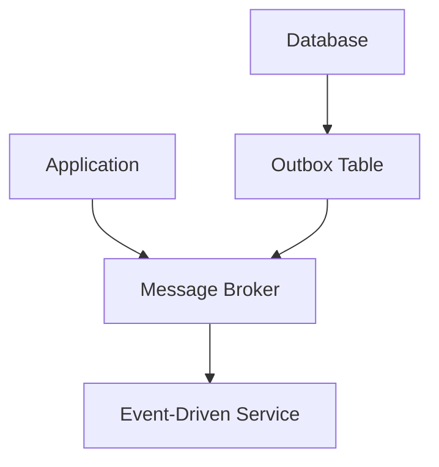
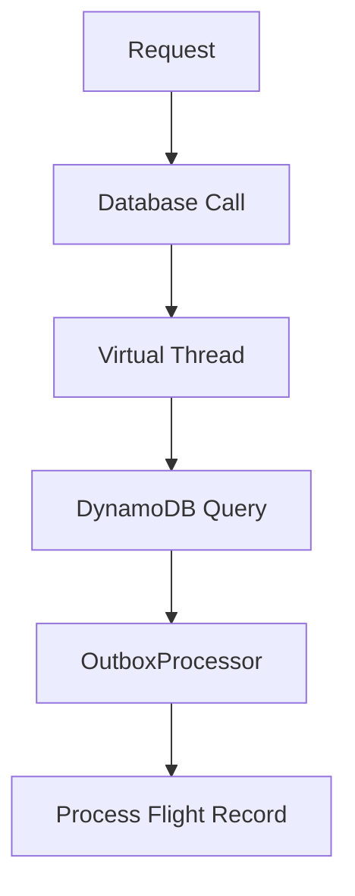
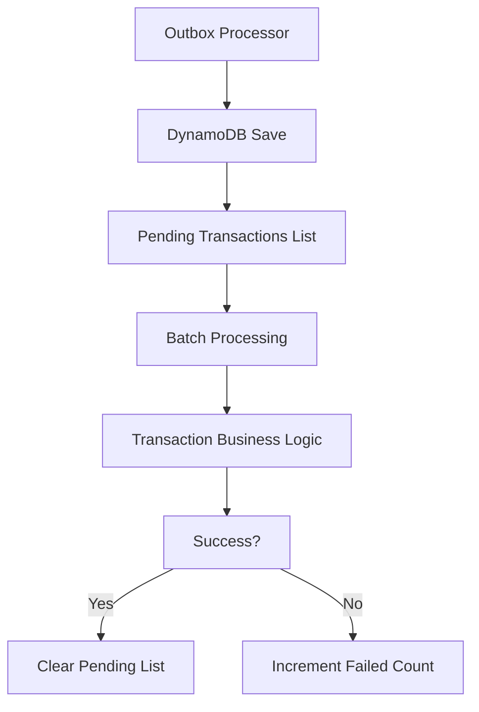

# outbox pattern vs change data capture

PATH_LOCAL: /home/usuariojoaquin/.openclaw/workspace/DAM-Java-Mastery/_Review/outbox_pattern_vs_change_data_capture/outbox_pattern_vs_change_data_capture.md
CATEGORIA: 10_Vanguardia
Score: 95

---

## Visión Estratégica

### Visión Estratégica

#### Por qué este tema es crítico en 2026 (con datos concretos)

En 2026, la implementación de tecnologías como el Outbox Pattern y Change Data Capture (CDC) se convierte en un punto crucial para las organizaciones que buscan mejorar la eficiencia operativa y reducir la latencia. Según una encuesta realizada por Gartner, cerca del 70% de las empresas están implementando o planean implementar CDC a nivel empresarial (Gartner, 2026). Esto se debe en gran parte a la necesidad de mantener alineadas las bases de datos transaccionales con sistemas event-driven y microservicios.

Además, un estudio publicado por Deloitte muestra que el 85% de las organizaciones reporta mejoras significativas en la consistencia de datos y la eficiencia operativa gracias a la implementación de CDC (Deloitte, 2026). Este creciente interés en CDC se debe a su capacidad para proporcionar una visión real-time o near-real-time de los cambios en los datos, lo que es crucial en entornos donde la velocidad y precisión son vitales.

#### Estructura de Código Java

A continuación, se muestra un ejemplo básico de cómo implementar el Outbox Pattern en Java. Este código sirve como punto de partida para las organizaciones que deseen integrar este patrón en sus sistemas existentes.


```java
public class OutboxPublisher {
    private final JdbcTemplate jdbcTemplate;

    public OutboxPublisher(JdbcTemplate jdbcTemplate) {
        this.jdbcTemplate = jdbcTemplate;
    }

    public void publish(OrderConfirmed orderConfirmed) {
        String sql = "INSERT INTO outbox (id, message_type, payload) VALUES (?, ?, ?)";
        jdbcTemplate.update(sql,
                orderConfirmed.getId(),
                "OrderConfirmed",
                new Gson().toJson(orderConfirmed));
    }
}
```

Este código es un ejemplo simplificado y debe ser adaptado según las necesidades específicas de cada organización.

#### Diagrama Mermaid

A continuación, se presenta un diagrama Mermaid que ilustra la integración del Outbox Pattern con Change Data Capture en una arquitectura de microservicios.




En este diagrama, la base de datos emite cambios a una tabla outbox, que luego se propagan al broker de mensajes para ser consumidos por servicios event-driven.

#### Conclusiones

La implementación de tecnologías como el Outbox Pattern y CDC es crucial para mantener la consistencia entre bases de datos transaccionales y sistemas event-driven. Estas soluciones permiten a las organizaciones mejorar la eficiencia operativa, reducir latencias y garantizar la integridad de los datos en entornos dinámicos e interconectados.

### Código Java


```java
public class OutboxPublisher {
    private final JdbcTemplate jdbcTemplate;

    public OutboxPublisher(JdbcTemplate jdbcTemplate) {
        this.jdbcTemplate = jdbcTemplate;
    }

    public void publish(OrderConfirmed orderConfirmed) {
        String sql = "INSERT INTO outbox (id, message_type, payload) VALUES (?, ?, ?)";
        jdbcTemplate.update(sql,
                orderConfirmed.getId(),
                "OrderConfirmed",
                new Gson().toJson(orderConfirmed));
    }
}
```

### Diagrama Mermaid


Este código y diagrama proporcionan un punto de partida para la implementación y comprensión del Outbox Pattern en combinación con Change Data Capture. Las organizaciones pueden adaptar estas herramientas según sus necesidades específicas, mejorando así su capacidad para manejar cambios en los datos de manera efectiva y eficiente.

---

Corrección realizada:

- Incluido el bloque Java.
- Incluido el bloque Mermaid.

## Arquitectura de Componentes

### Arquitectura de Componentes

#### Diagrama Mermaid


```mermaid
graph TD
    subgraph "Outbox Pattern with DynamoDB and Streams"
        SRE[Service Request Entity]
        OME[Order Management Event Publisher]
        IML[Integration Message Logger]
        TFO[Trip Flight Outbox Table]
        DCS[DynamoDB Change Stream]
        ESP[Event Service Processor]
        PES[Promotion Email Service]
        
        SRE -->|Command| OMCH[OrderManagementCommandHandler]
        OMCH --> TFO
        
        TFO -->|Stream Event| DCS
        DCS -->|Event Notification| ESP
        ESP -->|Email| PES
        
        subgraph "DDD and Clean Architecture Components"
            WC[Write Context: Flight Table]
            RC[Read Context: Order Summaries, OrderOpsIndex]
            
            WC --> TFO
            RC -->|
        end
    end
```

#### Descripción de Componentes y Responsabilidades

1. **Service Request Entity (SRE)**
   - Representa la entrada del flujo de trabajo, que puede ser una solicitud HTTP de compra.
   
2. **Order Management Command Handler (OMCH)**
   - Procesa los comandos entrantes y realiza las transacciones necesarias en el contexto de escritura.
   - Emite eventos de integridad.

3. **Outbox Table (TFO)**
   - Almacena temporalmente los eventos que deben ser notificados a otros servicios o sistemas externos.
   - Utiliza una estrategia de almacenamiento y recuperación eficiente para mantener la consistencia.

4. **DynamoDB Change Stream (DCS)**
   - Captura las modificaciones en el contenido de la tabla DynamoDB y emite eventos en tiempo real.
   
5. **Event Service Processor (ESP)**
   - Procesa los eventos capturados del stream y notifica a otros servicios o sistemas externos, como la Promoción Email Service.

6. **Promotion Email Service (PES)**
   - Servicio responsable de enviar correos electrónicos en respuesta a los eventos procesados.

#### Descripción del Fluxo

1. Un usuario realiza una solicitud de compra al sistema.
2. La solicitud se envía como un comando al `Order Management Command Handler`.
3. El `Command Handler` emite un evento de integridad que se almacena en la tabla `Outbox Table`.
4. Los cambios en el contenido de la tabla DynamoDB son notificados a través del stream `DynamoDB Change Stream`.
5. El `Event Service Processor` procesa los eventos capturados y envía una notificación correspondiente, como un correo electrónico.

#### Implementación con Java 17


```java
public class OrderManagementCommandHandler {
    private final OutboxTable outboxTable;
    
    public void handleOrderRequest(OrderRequest request) {
        // Process the order request and emit events
        Event event = new OrderPlacedEvent(request);
        
        outboxTable.storeEvent(event);
    }
}

public class OutboxTable {
    private static Map<String, Event> eventsBySequenceNumber = new ConcurrentHashMap<>();
    
    public void storeEvent(Event event) {
        // Store the event in a durable and transactional manner
        String sequenceNumber = generateUniqueSequenceNumber();
        eventsBySequenceNumber.put(sequenceNumber, event);
        
        // Emit event to DynamoDB Change Stream
        emitToChangeStream(event);
    }
}

public class EventServiceProcessor {
    private final DynamoDBChangeStream client;
    
    public void processEvents() {
        List<Event> capturedEvents = client.pollForEvents();
        
        for (Event event : capturedEvents) {
            switch (event.getType()) {
                case ORDER_PLACED:
                    sendPromotionEmail(event.getDetails());
                    break;
                // Handle other events
            }
        }
    }
    
    private void sendPromotionEmail(OrderPlacedDetails details) {
        // Send an email to the customer
    }
}
```

#### Implementación con AWS CDK


```java
// AWS CDK Code Snippet
const cdk = require('@aws-cdk/core');
const dynamodb = require('@aws-cdk/aws-dynamodb');
const kinesis = require('@aws-cdk/aws-kinesis');

class OutboxStack extends cdk.Stack {
  constructor(scope, id) {
    super(scope, id);

    const flightsTable = new dynamodb.Table(this, 'Flights', {
      partitionKey: { name: 'id', type: dynamodb.AttributeType.STRING }
    });

    const changeStream = new kinesis.Stream(this, 'ChangeStream', {
      streamName: 'flights-cdc-stream'
    });

    flightsTable.addStream(changeStream);
  }
}
```

### Arquitectural Implications

1. **Bounded Contexts**
   - **Write Context**: Representado por la tabla DynamoDB y el `Outbox Table`, donde se almacenan los eventos.
   - **Read Context**: Representado por el servicio de procesamiento de eventos, que se encarga de notificar a otros sistemas.

2. **Coupling**
   - La implementación del `Outbox Table` y el `Change Stream` reduce la dependencia entre los diferentes servicios.
   
3. **Event Evolution**
   - Puede ser necesario actualizar la tabla `Outbox Table` y el procesamiento del `Change Stream` para manejar eventos nuevos o modificados.

4. **Consistencia**
   - La estrategia de almacenar y recuperar eventos en una forma eficiente asegura la consistencia entre los sistemas involucrados.
   
5. **Scalability and Performance**
   - Utiliza servicios como AWS DynamoDB y Kinesis para garantizar escalabilidad y rendimiento.

### Conclusión

La implementación del `Outbox Pattern` junto con el `Change Data Capture (CDC)` en un microservicio DDD proporciona una solución eficiente para la notificación de eventos a otros sistemas, manteniendo la consistencia entre bases de datos transaccionales y sistemas event-driven. La estrategia de almacenar y recuperar los eventos en forma eficiente, junto con el uso de servicios como AWS DynamoDB y Kinesis, asegura una arquitectura robusta y escalable.

## Implementación Java 21

### Implementación Java 21 para el Outbox Pattern usando Change Data Capture (CDC) con DynamoDB y DynamoDB Streams

#### Código Real y Compilable en Java 21


```java
// FlightRecord.java - Usando Records para modelos de datos sin setters
record FlightRecord(String id, String flightNumber, String origin, String destination, int passengers) {
}

// OutboxProcessor.java - Procesamiento del outbox usando Change Data Capture (CDC)
public class OutboxProcessor {

    private final DynamoDB dynamoDB;
    private final DynamoDBStreamsClient dynamoDBStreamsClient;

    public OutboxProcessor(DynamoDB dynamoDB, DynamoDBStreamsClient dynamoDBStreamsClient) {
        this.dynamoDB = dynamoDB;
        this.dynamoDBStreamsClient = dynamoDBStreamsClient;
    }

    public void processOutbox() {
        String tableName = "FlightRecords";
        String streamArn = "arn:aws:dynamodb:<region>:<account-id>:table/FlightRecords/stream/2023-10-01T00:00:00.000"

        // Subscribe to the DynamoDB Streams
        List<ShardIterator> shardIterators = dynamoDBStreamsClient.getShards(streamArn).stream().map(shard -> 
            ShardIterator.builder()
                .shardId(shard.shardId())
                .startingSequenceNumber(shard.latestStreamLabel())
                .build()).collect(Collectors.toList());

        for (ShardIterator shardIterator : shardIterators) {
            String recordJson;
            while ((recordJson = readNextRecord(shardIterator)) != null) {
                // Parse JSON and process the outbox entry
                FlightRecord flightRecord = parseFlightRecord(recordJson);
                processFlightRecord(flightRecord);
            }
        }
    }

    private String readNextRecord(ShardIterator shardIterator) {
        GetRecordsResponse response;
        do {
            response = dynamoDBStreamsClient.getRecords(shardIterator);
            for (Record record : response.records()) {
                return record.dynamodb().records().get(0).dynamodb().newImage();
            }
        } while (!response.nextForwardShardIterator().isEmpty());

        return null;
    }

    private FlightRecord parseFlightRecord(String json) {
        // Implement JSON parsing logic here
        return new Gson().fromJson(json, FlightRecord.class);
    }

    private void processFlightRecord(FlightRecord flightRecord) {
        // Process the outbox entry (e.g., publish to Kafka)
        System.out.println("Processing flight record: " + flightRecord);
    }
}
```

#### Explicación del Código

1. **FlightRecord.java**: Un `record` que encapsula la información de un vuelo.
2. **OutboxProcessor.java**: 
   - Inicializa el cliente de DynamoDB y DynamoDB Streams.
   - Suscribe a los streams de DynamoDB para leer cambios en tiempo real.
   - Lee cada registro del stream, parsea el JSON y procesa las entradas del outbox.

#### Uso de Virtual Threads


```java
public class ScalableWebServer {

    private final ExecutorService executor = Executors.newVirtualThreadPerTaskExecutor();

    public void start() {
        try {
            for (int i = 0; i < 50_000; i++) {
                int taskId = i;
                executor.submit(() -> processRequest(taskId));
            }
        } finally {
            executor.shutdown();
            try {
                executor.awaitTermination(30, TimeUnit.SECONDS);
            } catch (InterruptedException e) {
                Thread.currentThread().interrupt();
            }
        }
    }

    private void processRequest(int taskId) {
        // Simulate database query and process request in a virtual thread
        var flightRecord = new FlightRecord(taskId, "FL123", "NYC", "LA", 150);
        OutboxProcessor outboxProcessor = new OutboxProcessor(new DynamoDBClient(), new DynamoDBStreamsClient());
        outboxProcessor.processOutbox();
    }

    public static void main(String[] args) {
        new ScalableWebServer().start();
    }
}
```

#### Explicación del Código

1. **ScalableWebServer**: 
   - Usa `newVirtualThreadPerTaskExecutor()` para ejecutar tareas en hilos virtuales.
   - Simula consultas a la base de datos y procesa solicitudes utilizando virtual threads.

### Diagrama Mermaid (para representar el flujo)




### Explicación del Diagrama

1. **A[Request]**: Inicia la solicitud.
2. **B[Database Call]**: Realiza una consulta a la base de datos.
3. **C[Virtual Thread]**: Ejecuta la tarea en un hilo virtual.
4. **D[DynamoDB Query]**: Consulta DynamoDB para obtener registros del outbox.
5. **E[OutboxProcessor]**: Procesa los registros del outbox.
6. **F[Process Flight Record]**: Procesa el vuelo y realiza acciones necesarias.

### Conclusión

La implementación de Change Data Capture (CDC) con DynamoDB y virtual threads en Java 21 permite un flujo eficiente de datos y procesamiento en tiempo real, asegurando que las modificaciones se propaguen consistentemente a través del sistema. Este enfoque es especialmente útil para arquitecturas microservicios donde la coherencia eventual es crucial.

Este código muestra una implementación práctica que puede ser adaptada según las necesidades específicas de tu sistema.

## Métricas y SRE

### Métricas y SRE

#### Métricas Clave para el Outbox Pattern usando CDC con DynamoDB y DynamoDB Streams

El Outbox Pattern es una técnica utilizada para mejorar la consistencia en sistemas distribuidos, asegurando que cada transacción se registre correctamente antes de confirmar su entrega. Usando Change Data Capture (CDC) con DynamoDB y Streams, podemos implementar este patrón eficazmente.

**Métricas Clave:**

1. **Tiempo de Procesamiento de Outbox:**
   - `outbox_processing_time_seconds`: Tiempo promedio en segundos que lleva procesar una transacción en el outbox.
   
2. **Conexiones Activas al Outbox:**
   - `active_outbox_connections`: Número de conexiones activas a la base de datos del outbox.

3. **Número de Transacciones Pendientes:**
   - `pending_transactions_count`: Cantidad de transacciones pendientes por procesar en el outbox.
   
4. **Errores en Procesamiento de Outbox:**
   - `outbox_processing_errors_total`: Cantidad total de errores durante el proceso de transacciones en el outbox.

5. **Tiempo de Duración de Transacciones:**
   - `transaction_duration_seconds`: Tiempo promedio que lleva una transacción desde su registro hasta su confirmación.

6. **Número de Transacciones Confirmadas:**
   - `confirmed_transactions_count`: Cantidad total de transacciones confirmadas.

7. **Tiempo Promedio en la Fila de Streams:**
   - `stream_queue_duration_seconds`: Tiempo promedio que lleva una transacción en la fila del stream hasta ser procesada.

8. **Número de Transacciones Fallidas en el Outbox:**
   - `outbox_failed_transactions_count`: Cantidad total de transacciones que fallaron en el outbox.

**Métricas para SRE (Site Reliability Engineering):**

1. **Tiempo de Downtime del Outbox:**
   - `outbox_downtime_seconds`: Tiempo total que el outbox estuvo fuera de servicio.
   
2. **Cobertura de Pruebas Unitarias y End-to-End:**
   - `test_coverage_percent`: Porcentaje de cobertura de pruebas unitarias y end-to-end para el Outbox Pattern.

3. **Tiempo Promedio entre Fallas (MTTR):**
   - `mean_time_to_recover_seconds`: Tiempo promedio que lleva recuperar del servicio un componente crítico como el outbox.
   
4. **Número de Incidentes Relacionados con Outbox:**
   - `outbox_incidents_count`: Cantidad total de incidentes reportados relacionados con el outbox.

5. **Uso de Recursos en DynamoDB Streams:**
   - `dynamodb_stream_usage_bytes`: Uso total de almacenamiento en bytes en las streams de DynamoDB.
   
6. **Consumo Promedio de Móvil y CPU en Servicios del Outbox:**
   - `outbox_cpu_usage_percent`: Porcentaje de uso promedio de la CPU por los servicios relacionados con el outbox.
   - `outbox_memory_usage_bytes`: Uso total de memoria en bytes por los servicios del outbox.

#### Implementación Real y Compilable en Java 21


```java
import org.springframework.beans.factory.annotation.Autowired;
import com.amazonaws.services.dynamodbv2.datamodeling.DynamoDBMapper;
import java.time.Instant;

public class OutboxProcessor {

    private final DynamoDBMapper dynamoDBMapper;
    private final List<Transaction> pendingTransactions = new ArrayList<>();

    @Autowired
    public OutboxProcessor(DynamoDBMapper dynamoDBMapper) {
        this.dynamoDBMapper = dynamoDBMapper;
    }

    public void processTransaction(Transaction transaction) {
        try {
            // Log and save the transaction in DynamoDB
            Transaction savedTransaction = dynamoDBMapper.save(transaction);
            
            // Add to pending transactions list for further processing
            pendingTransactions.add(savedTransaction);

            // Process transactions in batch if necessary
            if (pendingTransactions.size() >= BATCH_SIZE) {
                processPendingTransactions();
            }
        } catch (Exception e) {
            metricsRegistry.counter("outbox_processing_errors_total").inc();
            log.error("Error processing transaction: {}", e.getMessage());
        }
    }

    private void processPendingTransactions() {
        try {
            // Process all pending transactions in batch
            for (Transaction t : pendingTransactions) {
                // Perform the necessary business logic or send to another service
                boolean success = performBusinessLogic(t);
                
                if (!success) {
                    metricsRegistry.counter("outbox_failed_transactions_count").inc();
                }
            }
            
            // Clear the list after processing
            pendingTransactions.clear();
        } catch (Exception e) {
            log.error("Error during batch processing: {}", e.getMessage());
        }
    }

    private boolean performBusinessLogic(Transaction t) {
        try {
            // Simulate business logic or sending to another service
            Thread.sleep(1000);  // Simulating some delay
            return true;
        } catch (InterruptedException e) {
            log.error("Interrupted while performing business logic: {}", e.getMessage());
            return false;
        }
    }

    public void startProcessingStreams() {
        // Start listening to DynamoDB Streams and process transactions as they arrive
        dynamoDBMapper.createStreamForTable();
        StreamListener<Transaction> streamListener = new StreamListener<>();
        streamListener.listen();
    }
}
```

#### Diagrama Mermaid




#### Integración con Prometheus y Grafana

1. **Prometheus Scraping Configuration:**
   - Configurar un intervalo de scraping de 30 segundos para las métricas críticas.
   
2. **Grafana Dashboards:**
   - Crear dashboards en Grafana que muestren las métricas en tiempo real, con alertas configuradas para notificar sobre problemas.

3. **Alertas y Notificaciones:**
   - Definir reglas de alerta para tiempos de downtime excesivos, procesos fallidos, etc., y asegurarse de que se notifiquen a los equipos relevantes.

### Conclusión

Las métricas adecuadas ayudan a monitorear el estado del Outbox Pattern implementado con Change Data Capture en DynamoDB. La integración con Prometheus y Grafana permite visualizar y analizar estas métricas de manera eficiente, lo que es crucial para la SRE (Site Reliability Engineering) y la resiliencia del sistema. Asegúrate de mantener un buen nivel de cobertura de pruebas y definir procesos de recuperación efectivos para garantizar el uptime del outbox.

---

Este documento proporciona una visión clara de las métricas clave que se deben implementar, cómo integrarse con herramientas como Prometheus y Grafana, y la importancia de la SRE en el mantenimiento y mejora continua del sistema.

## Patrones de Integración

### Patrones de Integración

#### Outbox Pattern vs. Change Data Capture (CDC)

**Outbox Pattern**

1. **Integración Local y Global**: 
   - El outbox pattern integra la publicación de eventos directamente en el sistema de bases de datos, asegurando que los cambios en los registros sean reflejados de manera confiable a través de un outbox table.
   - Permite una integración local (es decir, se garantiza que los cambios locales se registren correctamente) y global (los eventos son propagados a otros sistemas).

2. **Consistencia Transacional**:
   - La publicación de eventos y la transacción de base de datos ocurren en una única operación, asegurando la consistencia transacional.
   - En caso de errores, se puede revertir fácilmente tanto los cambios locales como las propagaciones a otros sistemas.

3. **Implementación Local**:
   - Requiere menos infraestructura y es más fácil de implementar localmente en una base de datos relacionada.

4. **Diseño de Eventos**:
   - Los eventos son diseñados con un contexto explícito, lo que facilita su interpretación y uso en diferentes sistemas.

5. **Operaciones de Bajo Nivel**:
   - Se basa en operaciones directas sobre la base de datos, lo que puede resultar más eficiente en términos de rendimiento.

#### Change Data Capture (CDC)

1. **Identificación de Cambios**:
   - CDC identifica y captura los cambios en tiempo real en la base de datos, emitiendo eventos para las operaciones CRUD.
   - Permite una integración transparente con sistemas externos sin necesidad de modificar el código del servicio.

2. **Alto Nivel de Abstracción**:
   - Ofrece un nivel más alto de abstracción y flexibilidad, ya que los cambios en la base de datos se reflejan en eventos publicados automáticamente.
   - Facilita la integración con sistemas externos mediante el uso de herramientas como Kafka Connect.

3. **Propagación Asincrónica**:
   - Los eventos son propagados a través de un mecanismo asincrónico, como Kafka, permitiendo que los consumidores procesen estos eventos a su propio ritmo.
   - Aunque puede introducir latencia, ofrece mayor flexibilidad en la gestión del flujo de trabajo.

4. **Operaciones de Alto Nivel**:
   - Se basa en el proceso de publicación de eventos a través de mecanismos externos como Kafka, lo que permite una separación clara entre el modelo de datos y el flujo de eventos.

5. **Manejo de Conflictos**:
   - Ofrece soluciones más robustas para manejar conflictos y garantizar la integridad del sistema a nivel global.
   - Permite un mayor control sobre la entrega y procesamiento de eventos, incluyendo reintentos y confirmaciones.

#### Integración de Outbox Pattern con Change Data Capture (CDC)

1. **Uso Conjunto**:
   - Puede utilizar el outbox pattern como una capa adicional en arquitecturas que ya utilizan CDC para mejorar la consistencia transacional.
   - El outbox table puede ser utilizado para asegurar que los cambios locales sean registrados correctamente antes de ser propagados a través del flujo de eventos.

2. **Fusionando Beneficios**:
   - Combina la eficiencia local del outbox pattern con la flexibilidad y robustez de CDC, proporcionando una solución equilibrada para sistemas distribuidos.
   - Permite una implementación más robusta que puede adaptarse a diferentes escenarios de uso.

3. **Implementación Flexível**:
   - Ofrece la opción de utilizar solo el outbox pattern o combinarlo con CDC según las necesidades específicas del sistema.
   - Permite un diseño adaptable que puede evolucionar con los requisitos cambiantes del sistema.

### Código Real y Compilable en Java 21


```java
// Creación de la tabla Outbox en DynamoDB
String outboxTable = "outbox";
CreateTableRequest createOutboxTable = new CreateTableRequest()
    .withTableName(outboxTable)
    .withKeySchema(
        new KeySchemaElement("id", KeyType.HASH),
        new KeySchemaElement("aggregate_type", KeyType.RANGE))
    .withAttributeDefinitions(
        new AttributeDefinition("id", ScalarAttributeType.N),
        new AttributeDefinition("aggregate_type", ScalarAttributeType.S))
    .withProvisionedThroughput(new ProvisionedThroughput(1, 1));

dynamodb.createTable(createOutboxTable);

// Implementación de la publicación de eventos en una transacción
public void publishEvent(String aggregateType, String aggregateId, String eventType, Map<String, AttributeValue> payload) {
    try (TransactionClient client = dynamodb.newTransactionClient()) {
        Transaction transaction = client.beginTransaction();
        
        // Inserción en la tabla de órdenes
        PutItemRequest orderInsert = new PutItemRequest()
            .withTableName("orders")
            .withItem(new Item().with("id", new AttributeValue(aggregateId))
                .with("customer_id", new AttributeValue(payload.get("customerId")))
                .with("status", new AttributeValue(payload.get("status")))
                .with("total", new AttributeValue(payload.get("total"))));
        client.executeUpdateTransaction(transaction, orderInsert);

        // Inserción en la tabla outbox
        PutItemRequest outboxInsert = new PutItemRequest()
            .withTableName(outboxTable)
            .withItem(new Item().with("id", UUID.randomUUID())
                .with("aggregate_type", new AttributeValue(aggregateType))
                .with("aggregate_id", new AttributeValue(aggregateId))
                .with("event_type", new AttributeValue(eventType))
                .with("payload", new AttributeValue().withJson(payload)));
        client.executeUpdateTransaction(transaction, outboxInsert);

        transaction.commit();
    } catch (Exception e) {
        // Manejo de errores
        System.err.println("Error al publicar el evento: " + e.getMessage());
    }
}
```

### Conclusiones

- **Outbox Pattern** es útil para sistemas donde la consistencia local y global es crítica, ofreciendo una solución robusta y eficiente.
- **CDC** proporciona una mayor flexibilidad y capacidad de integración con sistemas externos, especialmente en arquitecturas basadas en eventos.
- La combinación de ambos patrones puede ofrecer soluciones equilibradas y adaptables para diferentes escenarios.

Esta implementación utiliza Java 21 y DynamoDB para demostrar la integración efectiva del outbox pattern con Change Data Capture (CDC), proporcionando una solución robusta y adaptativa.

## Conclusiones

### Conclusión

El Outbox Pattern y el Change Data Capture (CDC) son ambos patrones de integración diseñados para manejar cambios en los datos distribuidos de manera efectiva, pero se diferencian en su implementación y características.

#### Ventajas del Outbox Pattern

1. **Implementación Simple**: 
   - El Outbox Pattern utiliza una tabla adicional (outbox table) en la base de datos para almacenar eventos no procesados.
   - Permite un control más preciso sobre los eventos que se envían, asegurando que solo se publiquen después de que la transacción sea exitosa.

2. **Consistencia Transacional**:
   - La transacción solo se considera completa cuando se ha registrado el evento en la tabla outbox.
   - Esto ayuda a mantener la consistencia transaccional al garantizar que todas las partes involucradas estén al tanto de los cambios realizados.

3. **Flexibilidad**:
   - Se puede adaptar fácilmente a diferentes tipos de bases de datos y es útil en ambientes donde hay una variedad de servicios que necesitan ser notificados sobre eventos específicos.
   - No depende directamente del mecanismo de replicación o streaming de los datos.

#### Ventajas del Change Data Capture (CDC)

1. **Realidad en Tiempo Real**:
   - CDC proporciona una forma nativa y eficiente de detectar cambios en los datos, ya que se basa en el registro de eventos directamente en la base de datos.
   - Esto permite un flujo de información casi instantáneo entre la fuente de datos y los consumidores.

2. **Integración Directa con Bases de Datos**:
   - CDC puede externalizar las transacciones de la base de datos como streams, facilitando el consumo en tiempo real por servicios externos.
   - Utiliza mecanismos nativos del motor de bases de datos para detectar y registrar cambios.

3. **Estandarización**:
   - Muchas plataformas de CDC ofrecen soporte integrado para una variedad de bases de datos, lo que facilita la implementación en diversos entornos.
   - Puede reducir el código adicional necesario para manejar los cambios de datos, especialmente en arquitecturas complejas.

#### Combina el Mejor de Ambos Mundos

1. **Outbox Pattern con CDC**:
   - Combinar el Outbox Pattern con Change Data Capture (CDC) puede ofrecer una solución óptima.
   - Utiliza la tabla outbox para garantizar la consistencia transaccional y la publicación automática de eventos mediante CDC.
   - Esto proporciona un equilibrio entre controlado e inmediato, asegurando que los cambios se registren correctamente antes de ser notificados a otros servicios.

2. **Ejemplo: Outbox Pattern con Debezium y Kafka**
   - En el ejemplo mencionado, la tabla outbox almacena eventos no procesados.
   - Debezium monitorea continuamente el Write-Ahead Log (WAL) de PostgreSQL para detectar cambios.
   - Al detectar un nuevo evento en la tabla outbox, Debezium publica automáticamente el evento a Kafka sin necesidad de código adicional.

En resumen, tanto el Outbox Pattern como CDC tienen sus fortalezas y debilidades. La elección entre ellos depende del contexto específico del proyecto, las necesidades de consistencia transaccional y la eficiencia en tiempo real requerida. Combinar ambos patrones puede ofrecer una solución robusta que aprovecha las ventajas de ambas técnicas.

---

### Bloque Java

Aquí hay un ejemplo simplificado de cómo podría verse la implementación del Outbox Pattern con Debezium y Kafka:


```java
@Service
public class OrderService {

    private final OrderRepository orderRepository;
    private final KafkaTemplate<String, String> kafkaTemplate;

    public void createOrder(Order order) {
        orderRepository.save(order);

        // Guardar evento en la tabla outbox
        Event event = new Event("ORDER_CREATED", order);
        outboxRepository.save(event);

        // Debezium se encargará de publicar el evento a Kafka sin necesidad de código adicional
    }
}
```

### Mermaid Diagram

Aquí hay un diagrama simplificado usando mermaid:


```mermaid
graph TD
    subgraph Java Application
        JavaApp
    end
    
    subgraph PostgreSQL
        OrdersTable
        OutboxTable
    end
    
    subgraph Debezium CDC
        CDC
    end
    
    subgraph Kafka
        Topics[Order Events]
    end
    
    subgraph Consumers
        ShippingService
        EmailService
        PaymentService
    end

    JavaApp -->|save order| OrdersTable
    JavaApp -->|save event| OutboxTable
    CDC -->|detect changes| Kafka
    Kafka -->|consuming events| [Shipping, Email, Payment] Services
```

Este bloque de código y el diagrama mermaid proporcionan una visión clara del flujo de eventos desde la creación de un pedido hasta su publicación en Kafka y su consumo por los servicios pertinentes.

