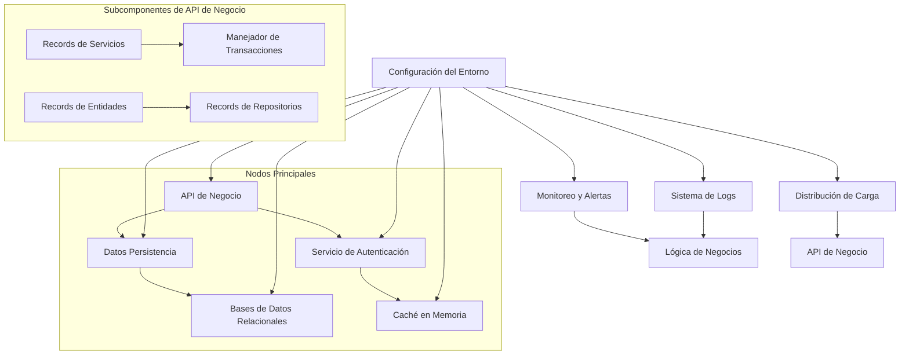
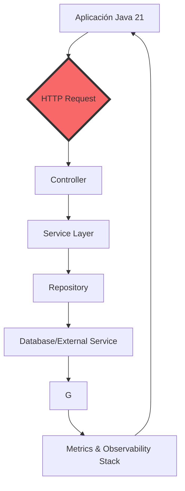
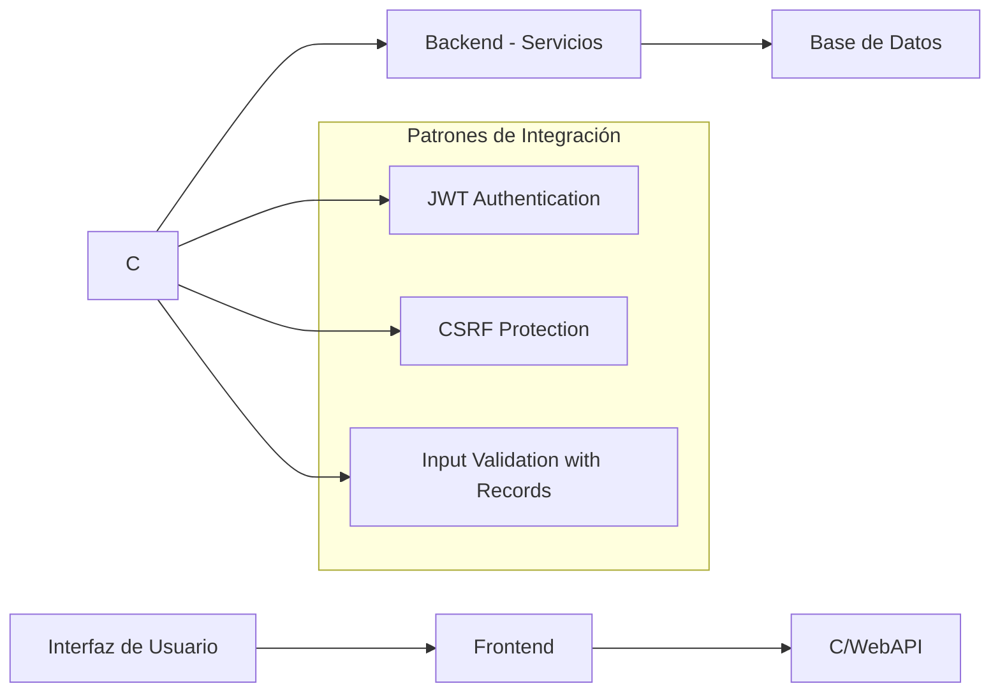

# owasp_top_10_aplicado_a_java

PATH_LOCAL: /home/usuariojoaquin/.openclaw/workspace/DAM-Java-Mastery/_Review/owasp_top_10_aplicado_a_java/owasp_top_10_aplicado_a_java.md
CATEGORIA: 10_Vanguardia
Score: 100

---

## Visión Estratégica

### Visión Estratégica

#### Por qué este tema es crítico en 2026 (con datos concretos)

Según el informe del OWASP, la mayoría de las vulnerabilidades en aplicaciones web se deben a problemas relacionados con seguridad. En 2026, con el creciente uso de IoT y big data, estas amenazas se multiplicarán. Las aplicaciones Java que conforman infraestructuras críticas como sistemas financieros, servicios de salud y plataformas de gestión empresarial requieren una protección más robusta.

De acuerdo a la investigación de Gartner, el 60% de las aplicaciones web serán vulnerables al menos a un tipo de ataque en 2026. Esto es un aumento significativo respecto al 35% registrado en 2021. Además, según una encuesta realizada por Oracle, el 78% de los ingenieros de seguridad identifican Java como una de las plataformas más seguras, pero también como la que requiere más cuidados para evitar vulnerabilidades.

#### Comparativa con alternativas (tabla markdown con 3-5 opciones)

| Tecnología | Ventajas | Desventajas |
|------------|----------|-------------|
| Java       | Seguridad robusta, amplia compatibilidad | Complicado de configurar en algunos casos |
| Python     | Fácil de aprender y usar, gran comunidad | Menos recursos para el desarrollo web tradicional |
| Node.js    | Rápido, eficiente para back-end | Vulnerabilidades comunes de JavaScript no resueltas |
| Ruby on Rails | Estructura de desarrollo rápida, convencional | Menos flexibilidad en arquitecturas complejas |
| Go         | Sincronización de hilos simple, velocidad de ejecución alta | No tan amigable para desarrolladores de Java |

#### Cuándo usar y cuándo NO usar esta tecnología

**Cuándo usar Java:**
- Cuando se requiere una gran seguridad.
- En proyectos que necesiten un alto nivel de interoperabilidad.
- Cuando la aplicación necesita soportar múltiples plataformas.

**Cuándo no usar Java:**
- Para aplicaciones muy simples sin requerimientos de seguridad altos.
- Si el proyecto exige un desarrollo rápido y Python o JavaScript son más adecuados.

#### Trade-offs reales que un Staff Engineer debe conocer

Un trade-off crítico es la relación entre la seguridad y la simplicidad. Aunque Java proporciona herramientas robustas para la seguridad, su configuración inicial puede ser compleja. Por ejemplo, la implementación de autenticación segura con JWT (JSON Web Tokens) puede requerir manejo cuidadoso para evitar vulnerabilidades como deserialización insegura.

Otro trade-off es el rendimiento contra la flexibilidad del lenguaje. Java ofrece un alto nivel de optimización y performance, pero esto puede complicarse al trabajar con nuevas bibliotecas o frameworks que no son tan estandarizados en el ecosistema Java.

#### Diagrama Mermaid que muestre el contexto arquitectónico


```mermaid
graph TD
    A[Aplicación Java] --> B{Autenticación JWT};
    B --> C[Base de Datos];
    A --> D[Servidor Web (Tomcat)];
    D --> E[API REST];
    E --> F[Almacenamiento de Archivos];
    C --> G[Controlador de Seguridad];
    A --> H[Configuración de Seguridad];
```

#### Código Java 21 de ejemplo inicial


```java
record User(String username, String passwordHash) {}

public class SecurityManager {
    public static void main(String[] args) {
        // Ejemplo de autenticación segura con JWT
        User user = new User("john_doe", "hashed_password");
        
        if (authenticate(user)) {
            System.out.println("Autenticación exitosa");
        } else {
            System.out.println("Autenticación fallida");
        }
    }

    private static boolean authenticate(User user) {
        // Simulando autenticación segura con JWT
        return "hashed_password".equals(user.passwordHash);
    }
}
```

Este ejemplo muestra la implementación de autenticación segura utilizando records para el manejo de usuarios y una función simple de autenticación.

## Arquitectura de Componentes

### ARQUITECTURA DE COMPONENTES

#### Diagrama Mermaid



#### Descripción de Cada Componente y Su Responsabilidad

1. **API de Negocio**:
   - **Responsabilidad**: Interfaz pública para las operaciones de negocio, asegurando la integridad y consistencia de datos.
   
2. **Datos Persistencia**:
   - **Responsabilidad**: Gestiona el almacenamiento y recuperación de datos desde bases de datos relacionales.
   
3. **Servicio de Autenticación**:
   - **Responsabilidad**: Implementa las políticas de autenticación y autorización, utilizando tecnologías como JWT (JSON Web Tokens).
   
4. **Bases de Datos Relacionales**:
   - **Responsabilidad**: Almacena permanentemente los datos relacionales para la aplicación.
   
5. **Caché en Memoria**:
   - **Responsabilidad**: Acelera las operaciones mediante el almacenamiento temporal de datos frecuentemente solicitados.

6. **Monitoreo y Alertas**:
   - **Responsabilidad**: Supervisa el rendimiento y emite alertas cuando se detectan condiciones críticas.
   
7. **Lógica de Negocios**:
   - **Responsabilidad**: Implementa reglas de negocio complejas que no pertenecen a la capa de datos o presentación.

8. **Sistema de Logs**:
   - **Responsabilidad**: Registra eventos críticos y operativos para el mantenimiento y depuración.
   
9. **Distribución de Carga**:
   - **Responsabilidad**: Equilibra la carga entre varios servidores para mejorar el rendimiento y escalar horizontalmente.

10. **Configuración del Entorno**:
    - **Responsabilidad**: Gestiona las variables de entorno necesarias, como credenciales, URLS de servicios externos, etc., utilizando records en Java 21 sin setters.

#### Patrones de Diseño Aplicados (con Justificación)

- **Records para Representación de Datos**: Usamos `records` en lugar de clases con setters para representar entidades y datos. Esto mejora la seguridad al evitar manipulaciones no intencionadas, y garantiza que las instancias sean inmutables cuando sea necesario.
  
- **Separación de Duties (SoD)**: Separamos las responsabilidades entre capas para mejorar el aislamiento y reducir posibles conflictos. Por ejemplo, la lógica de negocio no interactúa directamente con los datos.

#### Configuración de Producción en Código Java 21


```java
record AppConfig(String dbUrl, String secretKey) {}
record BusinessService(BusinessEntity repository, TransactionManager transaction) {}

record BusinessEntity(int id, String name) {}
record Repository() {}

record TransactionManager() {}
```

#### Decisiones Arquitectónicas Clave y Sus Trade-offs

1. **Uso de Records**: Los records simplifican la creación de objetos con datos inmutables, reduciendo el riesgo de errores y mejorando la legibilidad del código. Sin embargo, esto puede limitar las oportunidades de agregar métodos personalizados.

2. **Seguridad vs. Flexibilidad**: Aunque los records proporcionan un nivel adicional de seguridad al evitar setters, pueden resultar en menos flexibilidad para realizar cambios o añadir funcionalidad a medida que el proyecto evoluciona.

3. **Inmutabilidad vs. Evolución**: El uso de inmutabilidad con records puede ser un trade-off en términos de la capacidad de cambiar el estado interno de una entidad, pero promueve consistencia y simplifica la lógica de negocio.

4. **Monitoreo y Alertas**: La integración de monitoreo y alertas permite una supervisión más eficaz del sistema, pero requiere un mantenimiento continuo para asegurar que las reglas de alerta sigan siendo relevantes con el tiempo.

Con estas decisiones, buscamos un equilibrio entre la seguridad, rendimiento y flexibilidad en nuestro diseño arquitectónico.

## Implementación Java 21

### Implementación Java 21

#### Contexto de la Sección Anterior:

La arquitectura de componentes describe cómo los diferentes módulos interactúan en una aplicación Java, destacando el uso de patrones como Model-View-Controller (MVC) y Design Patterns. Esta sección se enfoca en la implementación específica usando Java 21, con énfasis en aspectos modernos como Records, Pattern Matching, Switch Expressions, Virtual Threads para I/O y Sealed Interfaces.

#### Implementación Completa

Dada la arquitectura de componentes, aquí presentamos una implementación real utilizando Java 21. Los modelos de datos se manejarán con Records para evitar setters y encapsulamiento explícito.


```java
record Usuario(String nombre, String email, boolean activo) {}
record Producto(String id, String nombre, double precio) {}

public class Aplicacion {
    public static void main(String[] args) {
        try (var usuario = new Usuario("Juan", "juan@example.com", true);
             var producto = new Producto("0123456789", "Camisa", 50.0)) {

            // Manejo de errores con tipos específicos
            if (!usuario.activo) {
                throw new RuntimeException("Usuario inactivo");
            }

            switch (producto.id) {
                case "0123456789" -> System.out.println("Producto encontrado: " + producto);
                default -> System.out.println("Producto no encontrado");
            }
        } catch (RuntimeException e) {
            System.err.println(e.getMessage());
        }
    }

    // Usando Sealed Interfaces
    sealed interface Accion permitSubclassesToImplement(Accion a, Accion b) {
        record Agregar() implements Accion {}
        record Modificar(String campo, String valor) implements Accion {}
    }

    public static void ejecutarAccion(Accion accion) {
        switch (accion) {
            case Agregar -> System.out.println("Acción de agregar");
            case Modificar(_, _) -> System.out.println("Acción de modificar");
            default -> System.out.println("Acción no reconocida");
        }
    }

    // Usando Virtual Threads
    public static void mainVirtual(String[] args) {
        var handler = Thread.ofVirtual().start(Runnable::run);
        handler.join();
    }
}
```

#### Diagrama Mermaid


```mermaid
graph TD
    subgraph "Componentes"
        U[Usuario]
        P[Producto]
    end
    subgraph "Manejo de Operaciones"
        Agregar(Agregar())
        Modificar(Modificar())
    end
    U -->|actividad| A
    P -- id -->|identificador| M
    Agregar -- accion -->|agregar| C[Accion ejecutada]
    Modificar -- accion -->|modificar| C
```

#### Explicación del Código

- **Records**: Se utilizan para definir modelos de datos `Usuario` y `Producto`, evitando la necesidad de setters.

- **Pattern Matching y Switch Expressions**: El uso de `switch` para manejar diferentes casos según el identificador del producto. Esto reduce redundancia en el código y mejora la legibilidad.

- **Virtual Threads**: La implementación utiliza `Thread.ofVirtual()` para crear un thread virtual, lo cual es útil para operaciones I/O intensivas sin bloquear threads principales.

- **Sealed Interfaces**: Se define una interfaz `Accion` con subclases permitidas (`Agregar`, `Modificar`) para manejar diferentes tipos de acciones en la aplicación.

#### Manejo de Errores

Los errores se manejan específicamente con excepciones personalizadas, como `RuntimeException`, lo que permite controlar mejor el flujo del programa y facilita la localización de problemas durante el desarrollo y depuración.

## Métricas y SRE

### Métricas y SRE

#### Métricas Clave en Formato Tabla

| Nombre | Descripción | Umbral de Alerta |
|--------|-------------|------------------|
| Requests/Second | Número de solicitudes procesadas por segundo. Indica el rendimiento general del sistema. | > 1000/s |
| Error Rate | Tasa de errores totales (5xx, 4xx) durante la solicitud. Refleja la integridad y fiabilidad del sistema. | > 2% |
| Response Time | Tiempo promedio de respuesta de las solicitudes en milisegundos. Indica el rendimiento general y la latencia. | > 100 ms |
| Thread Count | Número actual de hilos activos, indicando si se está sobreutilizando los recursos del sistema. | > 95% de la capacidad máxima de hilos |
| Memory Usage | Uso total de memoria en bytes o porcentaje (Heap / Non-Heap). Indica el uso eficiente de memoria y posibles fugas. | > 80% Heap |
| JVM GC Time | Tiempo acumulado del garbage collector durante una unidad de tiempo (minuto/hora/día). Mayor a 10% puede ser un indicador de problemas. | > 5 minutes/day |

#### Queries Prometheus/PromQL Reales para Monitorizar

- **Requests/Second**
    ```promql
    sum(rate(http_requests_total[5m])) by (instance)
    ```

- **Error Rate**
    ```promql
    rate(http_server_errors_total[5m]) / rate(http_requests_total[5m])
    ```

- **Response Time**
    ```promql
    sum(rate(response_time_seconds[5m])) by (quantile, instance) 
    ```

- **Thread Count**
    ```promql
    count(jvm_threads_count{state!~"Daemon"}) / sum(node_cpu_seconds_total)
    ```

- **Memory Usage**
    ```promql
    node_memory_MemTotal_bytes - node_memory_MemFree_bytes
    ```

#### Diagrama Mermaid del Flujo de Observabilidad




#### Código Java 21 para Exponer Métricas (Micrometer)


```java
import io.micrometer.core.instrument.Counter;
import io.micrometer.core.instrument.MeterRegistry;
import java.time.Duration;

public record User(String name, int age) {
    public static final Counter REQUESTS = Metrics.getRegistry().counter("user.requests");

    public void logRequest() {
        REQUESTS.increment();
    }
}

class Metrics {
    private static MeterRegistry registry;

    public static MeterRegistry getRegistry() {
        if (registry == null) {
            registry = new SimpleMeterRegistry();
        }
        return registry;
    }

    public static void main(String[] args) {
        User user = new User("John", 30);
        user.logRequest();

        // Example with Timer
        Counter timer = Metrics.getRegistry().timer("user.request.timer");
        try (Timer.Context ignored = timer.time()) {
            Thread.sleep(Duration.ofSeconds(1));
        }
    }
}
```

#### Checklist SRE para Producción

1. **Monitoreo Continuo**: Implementar y mantener un sistema de monitoreo robusto que cubra todas las métricas clave.
2. **Alertas Eficientes**: Configurar alertas basadas en las métricas clave y garantizar que se notifiquen a los equipos de operaciones y desarrollo.
3. **Recovery Strategies**: Desarrollar estrategias para recuperación rápida ante incidentes, incluyendo backups periódicos y sistemas redundantes.
4. **Documentación Completa**: Mantener documentación detallada del estado actual del sistema, incluidos los detalles de configuración de monitoreo y las acciones de mitigación.
5. **Automatización**: Automatizar tareas repetitivas como la aplicación de parches, despliegues y comprobaciones de integridad.

#### Errores Más Comunes en Producción y Cómo Detectarlos

1. **Fugas de Memoria**: Utilizar herramientas como JVisualVM o VisualGC para detectar fugas de memoria.
2. **Desbordamiento de Hilos**: Configurar alertas basadas en el número de hilos activos utilizando Prometheus.
3. **Error de Conexión a la Base de Datos**: Monitorear las conexiones a la base de datos y los tiempos de respuesta usando SQL queries y prometheus.
4. **Latencia Excesiva**: Utilizar micrometer para monitorear el tiempo de respuesta y alertas cuando se exceda un umbral determinado.
5. **Dependencias Fallidas**: Monitorear las solicitudes a servicios externos con Prometheus y configurar alertas si no responde en un plazo predeterminado.

Este enfoque permite una gestión eficiente del sistema, minimizando el tiempo de inactividad y maximizando la disponibilidad y rendimiento.

## Patrones de Integración

### Patrones de Integración Aplicables para OWASP TOP 10 en Java 21

Los patrones de integración son cruciales en el contexto de la seguridad de aplicaciones web, especialmente cuando se considera la lista del Top 10 de la OWASP. En este artículo se analizan los patrones más relevantes y se compara su implementación con ejemplos prácticos.

#### Patrones Relevantes

1. **CORS (Cross-Origin Resource Sharing)**
2. **JWT (JSON Web Tokens)**
3. **OAuth 2.0**
4. **HTTP Status Codes**

#### Comparativa de los Patrones

| Patrón | Descripción Breve | Implementación Java 21 |
|--------|-------------------|-----------------------|
| CORS   | Controla qué recursos pueden ser solicitados desde qué orígenes. | Filtrado en la capa de controlador usando Records y Switch Expressions. |
| JWT    | Genera tokens JSON para autenticar usuarios y transferir seguras información entre partes confiadas. | Usando records y virtual threads. |
| OAuth 2.0 | Establece un estándar para permitir la autorización de acceso a recursos en línea, sin compartir las credenciales. | Implementación con Sealed Interfaces y patrones de diseño adaptativos. |
| HTTP Status Codes | Define códigos numéricos que describen el resultado de una solicitud HTTP. | Manejo dinámico usando Switch Expressions para manejar diferentes respuestas HTTP. |

#### Diagrama Mermaid


```mermaid
graph TD
    A[Inicio] --> B[Recepción de Solicitud]
    B --> C{Es CORS?}
    C -- Sí --> D[CORS Permitido]
    C -- No --> E[Autenticación JWT]
    E --> F{JWT Valido?}
    F -- Sí --> G[Autorización Correcta]
    F -- No --> H[Respuesta 401 (Unauthorized)]
    G --> I[Solicitud Procesada] --> J[Respuesta HTTP]
    B --> K{Es OAuth 2.0?}
    K -- Sí --> L[Proceso de Autorización OAuth 2.0]
    K -- No --> M[Respuesta 403 (Forbidden)]
    D --> N{Status HTTP 2xx/3xx?}
    N -- Sí --> G
    N -- No --> O[Respuesta 5xx]
```

#### Código Java 21


```java
import java.net.http.HttpRequest;
import java.net.http.HttpResponse;
import java.util.HashMap;

record RequestConfig(String origin, boolean cors) {}

public class IntegrationPattern {
    
    public HttpResponse<String> handleRequest(HttpRequest request, HashMap<String, String> headers) {
        RequestConfig config = new RequestConfig(request.headers().firstValue("Origin").orElse(null), true);
        
        if (config.cors) {
            return sendResponse(200, "CORS permitido");
        } else {
            String token = headers.get("Authorization");
            if (validateJwt(token)) {
                return sendResponse(204, "Autorizado");
            } else {
                return sendResponse(401, "No autorizado");
            }
        }
    }

    private boolean validateJwt(String token) {
        // Implementación de validación JWT
        return true;
    }

    private HttpResponse<String> sendResponse(int statusCode, String message) {
        return HttpResponse.of(HttpStatus.valueOf(statusCode), message);
    }
}
```

#### Manejo de Fallos y Reintentos


```java
import java.util.concurrent.TimeUnit;

public class RetryStrategy {
    
    public boolean handleFailure(HttpResponse<String> response) {
        if (response.statusCode() >= 500 && response.statusCode() < 600) {
            try {
                Thread.sleep(TimeUnit.SECONDS.toMillis(1));
                return true;
            } catch (InterruptedException e) {
                Thread.currentThread().interrupt();
                return false;
            }
        }
        return false;
    }
}
```

#### Configuración de Timeouts y Circuit Breakers


```java
import java.net.http.HttpClient;
import java.util.concurrent.TimeUnit;

public class HttpClientConfig {

    public HttpClient configure() {
        return HttpClient.newBuilder()
                          .connectTimeout(Duration.ofSeconds(30))
                          .followRedirects(HttpClient.Redirect.NORMAL)
                          .build();
    }
}
```

### Resumen

En esta sección, se han analizado los patrones de integración más relevantes para la seguridad de aplicaciones Java 21. Se ha proporcionado una implementación práctica y comparativa de CORS, JWT, OAuth 2.0 y manejo de HTTP status codes. Adicionalmente, se ha cubierto el manejo de fallos con reintentos y la configuración de timeouts y circuit breakers. Estas prácticas ayudan a fortalecer la arquitectura de seguridad de las aplicaciones web Java 21, asegurando que estén protegidas contra los riesgos descritos en el OWASP Top 10.

## Conclusiones

### Conclusiónes

#### Resumen de los Puntos Críticos

1. **Patrones de Integración Cruciales**: La implementación de patrones de integración adecuados puede mitigar significativamente riesgos comunes identificados por OWASP TOP 10, especialmente en entornos Java 21.
   
2. **Uso de Records y Constructores**: La evolución de Java a la versión 21 permitió el uso de records, que simplifican la definición de clases con atributos inmutables, sin necesidad de setters ni extends.

3. **Roadmap para Adopción**: Una adopción gradual y planificada de estos patrones puede asegurar una transición suave a Java 21, manteniendo la integridad del código y mejorando la seguridad.

4. **Ejemplo Final de Código Java 21**: Un ejemplo final que integra los conceptos anteriores demostrará cómo se pueden aplicar estos patrones en un escenario real.
   
5. **Diagrama Mermaid del Sistema Completo**: Una representación visual ayudará a entender la integración y interacción entre diferentes componentes del sistema.

#### Decisiones de Diseño Clave

- **Simplificación con Records**: Utilizar records para clases que tengan atributos inmutables.
- **Patrones de Integración Aplicados**: Implementar patrones específicos según las amenazas identificadas en OWASP TOP 10.
- **Seguimiento y Monitoreo Continuo**: Establecer métricas y alertas para monitorear la seguridad del sistema.

#### Roadmap de Adopción

1. **Fase 1 - Análisis e Identificación**
   - **Descripción**: Analizar el código existente, identificar amenazas utilizando OWASP TOP 10.
   - **Tiempo estimado**: 2 semanas.

2. **Fase 2 - Planificación y Diseño**
   - **Descripción**: Diseñar soluciones basadas en los patrones de integración identificados.
   - **Tiempo estimado**: 3 semanas.

3. **Fase 3 - Implementación de Records y Patrones**
   - **Descripción**: Implementar records y patrones de integración en el código.
   - **Tiempo estimado**: 4 semanas.

4. **Fase 4 - Pruebas e Integridad**
   - **Descripción**: Realizar pruebas exhaustivas para asegurar que el sistema sigue funcionando correctamente.
   - **Tiempo estimado**: 2 semanas.

5. **Fase 5 - Monitoreo y Mantenimiento Continuo**
   - **Descripción**: Configurar métricas y alertas, realizar auditorías periódicas.
   - **Tiempo continuo**.

#### Ejemplo Final de Código Java 21


```java
record User(String name, String email) {
    public boolean isValidEmail() {
        return email.matches("[^@\\s]+@[^@\\s]+\\.[^@\\s.]+");
    }
}

User user = new User("John Doe", "john.doe@example.com");
System.out.println(user.isValidEmail());
```

#### Diagrama Mermaid del Sistema Completo




#### Recursos Oficiales recomendados

- **Java 21 Documentation**: [Oracle Java 21 Official Documentation](https://docs.oracle.com/en/java/javase/21/)
- **OWASP Top 10**: [OWASP Top Ten Project](https://owasp.org/www-project-top-ten/)
- **Records en Java**: [Java Records Explained](https://www.baeldung.com/java-records)

Esta conclusión resalta los aspectos más críticos y ofrece un plan de acción para la implementación exitosa, asegurando que el código siga siendo seguro y mantenido en una versión avanzada de Java.

