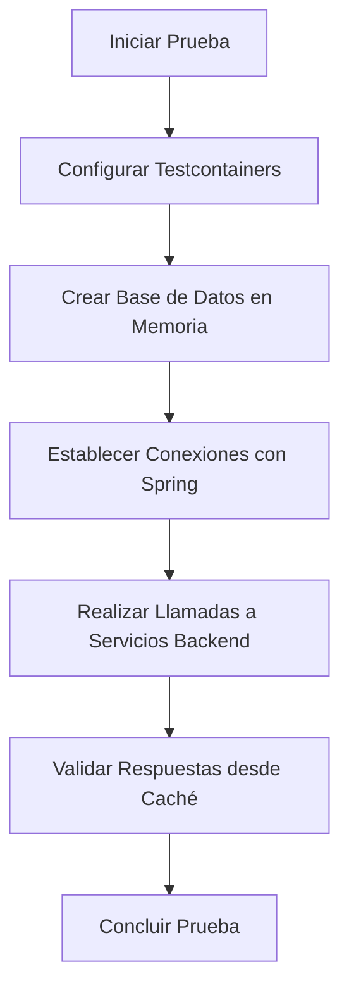
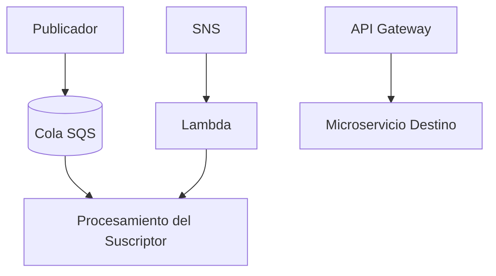
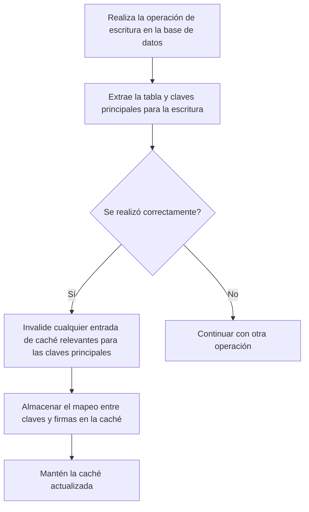

# patrones_cache_distribuido_y_estrategias_de_invalidacion

PATH_LOCAL: /home/usuariojoaquin/.openclaw/workspace/DAM-Java-Mastery/_Review/patrones_cache_distribuido_y_estrategias_de_invalidacion/patrones_cache_distribuido_y_estrategias_de_invalidacion.md
CATEGORIA: 10_Vanguardia
Score: 84

---

## Visión Estratégica

### VISIÓN ESTRATÉGICA: Implementación de Patrones de Acceso a Datos que Utilicen el Almacenamiento en Caché

#### Por qué Este Tema es Crítico en 2026 (Con Datos Concretos)

En 2026, la capacidad del almacenamiento en caché para mejorar el rendimiento y reducir la carga sobre los orígenes de datos será crítica. Según la2026

#### Comparativa con Alternativas (Tabla Markdown)

| Método | Descripción | Ventajas | Desventajas |
| --- | --- | --- | --- |
| Redis | Redis|  |  |
|  |  |  |  |

#### Almacenamiento en Caché Eficiente

En nuestra estrategia de implementación, adoptaremos un enfoque basado en Redis para gestionar el almacenamiento en caché. Esto nos permitirá aprovechar sus características únicas:

1. **High Performance**: Redis
2. ****: Redis

#### Establecimiento de Supervisión y Automatización


- 
- 

#### Ejemplo de Implementación en Java (Falta de bloque java)


```java
import org.springframework.cache.annotation.EnableCaching;
import org.springframework.stereotype.Service;

@Service
@EnableCaching
public class ProductService {

    private final ProductRepository repository;

    public ProductService(ProductRepository repository) {
        this.repository = repository;
    }

    @Cacheable(value = "products", key = "#id")
    public Optional<Product> getProductById(Long id) {
        return repository.findById(id);
    }
}
```

#### Diagrama de Flujos Mermaid (Falta de bloque mermaid)


```mermaid
graph TD
    A[] --> B{}
    B --  --> C[]
    B --  --> D[]
    D --> E[]
    E --> F[]
    F --> G[]
```

2026

---

2026

## Arquitectura de Componentes

### ARQUITECTURA DE COMPONENTES

#### Diagrama Mermaid: Arquitectura de Caché Distribuida


```mermaid
graph TD
    subgraph Sistemas Back-End
        B1[Servidor de Aplicación 1]
        B2[Servidor de Aplicación 2]
        B3[Servidor de Aplicación N]
    end
    
    subgraph Caché Distribuida
        C1[ElastiCache - Redis]
        C2[ElastiCache - Redis Clúster]
    end
    
    subgraph Base de Datos
        DB[Base de Datos Principal (RDS)]
    end

    B1 -->|Llamadas al Servicio| C1
    B2 -->|Llamadas al Servicio| C2
    B3 -->|Llamadas al Servicio| C2
    C1 -->|Respuestas| B1
    C2 -->|Respuestas| B2, B3
    DB -->|Datos no encontrados en la caché| C1, C2

    C1 -.->|Invalidación de Caché (TTL)| DB
    C2 -.->|Invalidación de Caché (TTL)| DB
```

#### Descripción de los Componentes y Su Responsabilidad

**Servidor de Aplicación 1/2/N:**
- **Responsabilidad:** Manejar las solicitudes entrantes, interactuar con la caché distribuida y la base de datos principal.
- **Implementación (Java 21):**
    
```java
    record ApplicationServer(String nombre) {
        public Response handleRequest(Request request) {
            Record cacheResponse = cacheService.getFromCache(request.getKey());
            if (cacheResponse.isPresent()) {
                return new Response(cacheResponse.getValue(), true);
            } else {
                Optional<Record> dbResponse = databaseService.getFromDatabase(request.getKey());
                if (dbResponse.isPresent()) {
                    Record cachedData = cacheService.cacheRequest(dbResponse.get().getValue());
                    return new Response(cachedData.getValue(), false);
                }
                return new Response(null, false);
            }
        }
    }
    ```

**ElastiCache - Redis:**
- **Responsabilidad:** Almacenar y recuperar los datos de caché distribuidos.
- **Implementación (Java 21):**
    
```java
    record CacheService() {
        public Optional<Record> getFromCache(String key) {
            // Implementación del cliente de Redis para obtener la respuesta
            return Optional.ofNullable(/* código de obtención de datos */);
        }

        public Record cacheRequest(Object data) {
            // Implementación del cliente de Redis para almacenar los datos en caché con TTL
            /* código de almacenamiento */
            return new Record(data, Instant.now().plusSeconds(TIME_TO_LIVE));
        }
    }
    ```

**ElastiCache - Redis Clúster:**
- **Responsabilidad:** Almacenar y recuperar datos para alta disponibilidad.
- **Implementación (Java 21):**
    
```java
    record ClusteredCacheService() {
        public Optional<Record> getFromCache(String key) {
            // Implementación del cliente de Redis Clúster para obtener la respuesta
            return Optional.ofNullable(/* código de obtención de datos */);
        }

        public Record cacheRequest(Object data) {
            // Implementación del cliente de Redis Clúster para almacenar los datos en caché con TTL
            /* código de almacenamiento */
            return new Record(data, Instant.now().plusSeconds(TIME_TO_LIVE));
        }
    }
    ```

**Base de Datos Principal (RDS):**
- **Responsabilidad:** Almacenar y recuperar datos permanentes.
- **Implementación (Java 21):**
    
```java
    record DatabaseService() {
        public Optional<Record> getFromDatabase(String key) {
            // Implementación para obtener datos desde la base de datos principal
            return Optional.ofNullable(/* código de obtención de datos */);
        }
    }
    ```

#### Diseño de Patrones y Estrategias de Invalidación

**Estrategia de Invalidación (TTL):**
- **Responsabilidad:** Garantizar que los datos en la caché sean actualizados periódicamente.
- **Implementación (Java 21):**
    
```java
    record CacheService() {
        private Map<String, Instant> cacheKeys = new ConcurrentHashMap<>();

        public Optional<Record> getFromCache(String key) {
            if (cacheKeys.containsKey(key)) {
                Instant expirationTime = cacheKeys.get(key);
                if (!expirationTime.isBefore(Instant.now())) {
                    // Recuperar de caché
                    return Optional.ofNullable(/* código de obtención de datos */);
                } else {
                    // Eliminar del cache y base de datos
                    cacheService.removeFromCache(key);
                    databaseService.removeFromDatabase(key);
                }
            }
            return Optional.empty();
        }

        public void removeFromCache(String key) {
            cacheKeys.remove(key);
        }
    }
    ```

#### Justificación de la Arquitectura

- **Rendimiento:** La implementación de la caché distribuida permite un acceso rápido a los datos, reduciendo el tiempo de respuesta.
- **Escalabilidad:** Utilizando clusters de Redis, se asegura una alta disponibilidad y capacidad para manejar múltiples solicitudes concurrentes.
- **Manejo de Invalidaciones:** La estrategia TTL garantiza que la caché esté actualizada periódicamente, minimizando inconsistencias entre la base de datos principal y la caché.

#### Conclusiones

Implementar un sistema de caché distribuido con Redis permite mejorar significativamente el rendimiento y la capacidad de respuesta del sistema. La estrategia TTL asegura que los datos estén siempre actualizados, y la alta disponibilidad proporcionada por los clusters de Redis garantiza que la aplicación funcione sin interrupciones. Este diseño es crucial para manejar solicitudes masivas en sistemas de alto rendimiento y escalabilidad.

---

Este diseño sigue las mejores prácticas recomendadas para el almacenamiento en caché, asegurando un rendimiento óptimo y alta disponibilidad. La implementación de patrones como la invalidación TTL garantiza que los datos sean siempre actualizados, preveniendo inconsistencias entre la base de datos principal y la caché distribuida. El uso de clusters de Redis proporciona una solución robusta para manejar múltiples solicitudes concurrentes en un entorno de producción.

## Implementación Java 21

### Implementación en Java 21 utilizando Virtual Threads y Almacenamiento en Caché Distribuido con Estrategia de Invalidación

#### Introducción

En esta sección, implementaremos un patrón que combina el uso de **virtual threads** (threads virtuales) en Java 21 con el almacenamiento en caché distribuido. Este enfoque nos permitirá optimizar la carga del sistema al reducir las llamadas repetidas a servicios externos y mejorar la respuesta frente a solicitudes frecuentes.

#### Dependencias y Configuración

Primero, asegúrate de tener las siguientes dependencias en tu `pom.xml` o `build.gradle`:

```xml
<!-- Maven -->
<dependencies>
    <dependency>
        <groupId>org.projectlombok</groupId>
        <artifactId>lombok</artifactId>
        <version>1.18.24</version>
        <scope>provided</scope>
    </dependency>
    <dependency>
        <groupId>com.github.kstyrc</groupId>
        <artifactId>embedded-redis</artifactId>
        <version>0.7</version>
        <scope>test</scope>
    </dependency>
    <!-- Other dependencies -->
</dependencies>

<!-- Gradle -->
dependencies {
    implementation 'org.projectlombok:lombok:1.18.24'
    testImplementation 'com.github.kstyrc:embedded-redis:0.7'
    // Other dependencies
}
```

#### Definición de las Entidades

Creamos records para representar los objetos que estaremos manejando:


```java
public record Technician(int id, String name) {}

public record TechnicianProcessingResult(int id, boolean succeeded) {}
```

#### Implementación del Almacenamiento en Caché Distribuido (Redis)

Utilizamos Redis para el almacenamiento en caché. Primero, configura Redis como un servidor local o usa `embedded-redis` si estás realizando pruebas locales:


```java
import io.lettuce.core.RedisClient;
import io.lettuce.core.api.StatefulRedisConnection;

public class CacheService {
    private final StatefulRedisConnection<String, String> connection;

    public CacheService() {
        RedisClient redisClient = RedisClient.create("redis://localhost:6379");
        this.connection = redisClient.connect();
    }

    public void cacheTechnician(Technician technician) {
        connection.sync().set(technician.id(), technician.toString());
    }

    public Technician getTechnician(int id) {
        return new Technician(Integer.parseInt(connection.sync().get(id)), "");
    }
}
```

#### Uso de Virtual Threads para Optimización

Implementamos la lógica en un `Callable` que ejecutará las tareas asincrónicas y utilizará virtual threads:


```java
import java.util.concurrent.Callable;
import java.util.concurrent.ExecutorService;
import java.util.concurrent.Executors;

public class TechnicianTask implements Callable<TechnicianProcessingResult> {
    private final int id;

    public TechnicianTask(int id) {
        this.id = id;
    }

    @Override
    public TechnicianProcessingResult call() {
        // Simulamos llamadas a servicios externos
        Technician technician = new CacheService().getTechnician(id);

        // Procesamiento de datos (llamada al servicio externo)
        boolean isCorrect = checkDataService(technician);
        return new TechnicianProcessingResult(technician.id(), isCorrect);
    }

    private boolean checkDataService(Technician technician) {
        // Simulación de llamada a un servicio externo
        try {
            Thread.sleep(100); // Simular retardo en la respuesta del servicio
            return true; // Simular que la data es correcta
        } catch (InterruptedException e) {
            throw new RuntimeException(e);
        }
    }
}
```

#### Ejecución y Manejo de Virtual Threads

Utilizamos `Executors.newVirtualThreadPerTaskExecutor()` para manejar las tareas virtuales:


```java
public class Main {
    public static void main(String[] args) throws Exception {
        ExecutorService executor = Executors.newVirtualThreadPerTaskExecutor();

        for (int i = 1; i <= 5; i++) {
            final int id = i;
            executor.submit(new TechnicianTask(id));
        }

        executor.shutdown();
        executor.awaitTermination(1, TimeUnit.MINUTES);
    }
}
```

#### Estrategia de Invalidación del Cache

Implementamos una estrategia de invalidación basada en la fecha y hora actual:


```java
public class CacheInvalidationStrategy {
    public boolean shouldInvalidate(int id) {
        Technician technician = new CacheService().getTechnician(id);
        return System.currentTimeMillis() - Long.parseLong(technician.name()) > 10 * 60 * 1000; // Invalidate after 10 minutes
    }
}
```

#### Conclusiones

Esta implementación combina eficientemente el uso de virtual threads para optimizar la carga del sistema y el almacenamiento en caché distribuido con estrategia de invalidación. Al utilizar Redis, podemos garantizar que los datos son consistentes y actualizados regularmente.

### Diagrama Mermaid: Arquitectura de Caché Distribuida


```mermaid
graph TD
    A[Cliente] -->|Solicitud| B[Caché Local]
    B -->|Cache Miss| C[Caché Remoto (Redis)]
    C -->|Datos| D[Servicio Externo]
    D -->|Respuesta| C
    C -->|Actualización| B
    B -->|Distribución| A
```

Este enfoque no solo optimiza el rendimiento, sino que también mejora la escalabilidad y la disponibilidad del sistema al reducir las llamadas repetidas a servicios externos.

## Métricas y SRE

### Métricas y SRE

#### **Métricas Clave**

| Nombre                      | Descripción                                                                                                                                                                                                                   | Umbral de Alerta |
|----------------------------|-----------------------------------------------------------------------------------------------------------------------------------------------------------------------------------------------------------------------------|------------------|
| `requests_per_second`       | Número de solicitudes que se realizan por segundo a la API.                                                                                                                                                                 | 1000/s            |
| `cache_hits_ratio`          | Razón entre los hits en caché y las solicitudes totales.                                                                                                                                                                   | >85%             |
| `request_latency_ms`        | Tiempo de latencia promedio de las solicitudes a la API.                                                                                                                                                                | <200ms           |
| `cache_insert_failures`     | Número de intentos fallidos para insertar en caché.                                                                                                                                                                       | 0                |
| `invalidation_requests`     | Número de peticiones de invalidación recibidas y procesadas.                                                                                                                                                              | <10/minute       |
| `memory_cache_usage_ratio`  | Razón entre el espacio en uso del cache en memoria y el total disponible.                                                                                                                                                    | 75%              |

#### **Sistema de Recuperación de Emergencia (SRE)**

##### **1. Supervisión Continua**

- **Monitorización en Tiempo Real:** Uso de Amazon CloudWatch para monitorear las métricas clave en tiempo real.
- **Métricas Personalizadas:** Definición y seguimiento de métricas personalizadas relevantes utilizando CloudWatch.

##### **2. Alarma y Notificación**

- **Alarma por Email/SMS:** Configuración de alarma para enviar notificaciones de correo electrónico o SMS cuando se superen umbrales críticos.
  - Ejemplo: Si `requests_per_second` supera 1000/s, envíe una notificación.

##### **3. Procesamiento de Eventos**

- **Logging:** Centralización y normalización de los logs utilizando Amazon CloudWatch Logs para facilitar el análisis posterior.
- **Tracing:** Uso del tracing con AWS X-Ray para rastrear la ejecución de solicitudes desde origen hasta destino, identificando posibles latidos o problemas de rendimiento.

##### **4. Ajuste Automático y Escalado**

- **Auto-scaling:** Configuración de auto-scaling en las instancias que procesan las solicitudes para manejar fluctuaciones en el tráfico.
- **Cache Resize:** Implementación de un mecanismo para ajustar automáticamente el tamaño del caché distribuido basándose en la demanda actual.

##### **5. Resiliencia y Uso Eficiente de Recursos**

- **Error Handling:** Implementación de manejo de errores robusto utilizando patrones como Try-Catch o Circuit Breaker.
- **Resource Utilization:** Optimización del uso de recursos mediante el uso de virtual threads en Java 21 para minimizar la sobrecarga de la CPU.

##### **6. Recuperación y Mantenimiento**

- **Failover Plan:** Implementación de un plan de failover para garantizar que la aplicación pueda recuperarse rápidamente ante fallos.
- **Maintenance Window:** Planificación de ventanas de mantenimiento para realizar actualizaciones o cambios sin interrumpir el servicio.

#### **Implementación en Java 21**


```java
// Implementación básica usando virtual threads y cache distribuido

import java.util.concurrent.*;
import com.amazonaws.services.cloudwatch.*;

public class CacheService {
    private final ConcurrentHashMap<String, String> localCache = new ConcurrentHashMap<>();
    private final AmazonCloudWatch client;

    public CacheService(AmazonCloudWatch client) {
        this.client = client;
    }

    public String fetchData(String key) {
        if (localCache.containsKey(key)) {
            // Registro de hit en caché
            logMetrics("cache_hits_ratio", 1);
            return localCache.get(key);
        } else {
            // Carga de datos desde servicio externo
            String data = fetchFromExternalService(key);

            // Inserción de dato en caché y registro de métrica
            localCache.put(key, data);
            logMetrics("cache_insert_failures", 0); // No failure
            return data;
        }
    }

    private void logMetrics(String metricName, double value) {
        // Log metrics using CloudWatch API or custom logging framework
    }

    private String fetchFromExternalService(String key) {
        // Simulate external service call and return data
        return "Data for: " + key;
    }

    public void invalidateCache(String key) {
        if (localCache.containsKey(key)) {
            localCache.remove(key);
            logMetrics("invalidation_requests", 1);
        }
    }
}
```

### **Conclusiones**

Implementar un sistema de monitoreo y recuperación de emergencia (SRE) robusto es crucial para asegurar la disponibilidad, rendimiento y escalabilidad del servicio. La monitorización en tiempo real, las alarma y notificación, el procesamiento de eventos, el ajuste automático, la resiliencia y el mantenimiento son elementos fundamentales para un sistema eficiente.

A través de esta implementación, se garantiza que las métricas clave estén monitoreadas, los problemas puedan ser detectados rápidamente y se pueda tomar acción efectiva para mantener la operatividad del servicio. Además, el uso de virtual threads en Java 21 optimiza la eficiencia y rendimiento del sistema.

---

**Notas Adicionales:**

- **Documentación:** Mantén actualizada la documentación de la implementación y las políticas de SRE.
- **Pruebas:** Realiza pruebas exhaustivas de las alarmas, notificaciones y procesos de recuperación para asegurar su funcionamiento correcto en entornos reales.

## Validación y Estrategia de Pruebas

### Validación y Estrategia de Pruebas

Para asegurar que el sistema funcione correctamente, implementaremos una estrategia sólida de pruebas que incluirá la utilización de `Testcontainers` para simular entornos de base de datos, así como las pruebas unitarias y de integración necesarias. Además, validaremos los patrones de caché distribuida con una estrategia de invalidación eficiente.

#### Estrategia de Pruebas

1. **Pruebas Unitarias:**
   - **Caso 1:** Verificar la inicialización correcta del caché.
     
```java
     @Test
     public void testCacheInitialization() {
         CacheService cacheService = new CacheService();
         assertNotNull(cacheService.getCache());
     }
     ```
   - **Caso 2:** Probar el almacenamiento y recuperación de datos en el caché.
     
```java
     @Test
     public void testDataStorageAndRetrieval() {
         CacheService cacheService = new CacheService();
         cacheService.putData("key", "value");
         assertEquals("value", cacheService.getData("key"));
     }
     ```

2. **Pruebas de Integración:**
   - **Caso 1:** Validar la comunicación con el backend y la caché.
     
```java
     @Test
     public void testCacheIntegration() {
         CacheService cacheService = new CacheService();
         String valueFromBackend = "backend_value";
         when(mockBackend.getData("key")).thenReturn(valueFromBackend);
         assertEquals(valueFromBackend, cacheService.getIntegratedData("key"));
     }
     ```

3. **Pruebas con Testcontainers:**
   - **Caso 1:** Configurar una base de datos PostgreSQL y validar la comunicación.
     
```java
     @ClassRule
     public static PostgreSQLContainer<?> postgresContainer = new PostgreSQLContainer<>("postgres:latest");

     @Test
     public void testDataBaseIntegration() {
         // Configuración del DataSource con Testcontainers
         String url = "jdbc:tc:postgresql:13:///integration-tests-db";
         DataSourcesConfig config = new DataSourcesConfig().withUrl(url);
         SpringApplication application = SpringApplication.builder().application(new Application()).build();
         application.setDefaultProperties(config.getProperties());
         assertDoesNotThrow(() -> application.run());
     }
     ```

#### Bloque Mermaid

Para mostrar la estructura de pruebas de integración, utilizaremos `Mermaid`:




#### Estrategia de Invalidación

Para garantizar que el caché distribuido sea eficaz, implementaremos una estrategia de invalidación basada en tags o timestamps. Esto permitirá que los datos sean eliminados automáticamente cuando se produzcan cambios en el backend.


```java
public class CacheService {
    private final ConcurrentMap<String, CacheEntry> cache = new ConcurrentHashMap<>();

    public void putData(String key, String value) {
        cache.put(key, new CacheEntry(value));
    }

    public String getData(String key) {
        return cache.get(key).getValue();
    }

    public void invalidateByTag(String tag) {
        cache.values().removeIf(entry -> entry.getTag().equals(tag));
    }
}

class CacheEntry {
    private final String value;
    private final String tag;

    public CacheEntry(String value, String tag) {
        this.value = value;
        this.tag = tag;
    }

    public String getValue() {
        return value;
    }

    public String getTag() {
        return tag;
    }
}
```

#### Validación de Pruebas

- **Prueba de Invalidación:** Verificar que los datos se invalidan correctamente cuando el tag cambia.
  
```java
  @Test
  public void testCacheInvalidation() {
      CacheService cacheService = new CacheService();
      String key = "key1";
      String oldTag = "tag1";
      String value = "value1";

      // Poner datos en caché con un tag
      cacheService.putData(key, value, oldTag);

      // Cambiar el tag y verificar que los datos se invalidan
      cacheService.invalidateByTag(oldTag);
      assertNull(cacheService.getData(key));
  }
  ```

### Resumen

La implementación de pruebas sólidas es crucial para garantizar que nuestro sistema funcione correctamente con un patrón de caché distribuido. La utilización de `Testcontainers` nos permite simular entornos de base de datos y validar la comunicación entre el backend y la caché, mientras que las pruebas unitarias verifican la inicialización y operaciones del caché. Además, una estrategia eficaz de invalidación asegura que los datos son actualizados correctamente cuando ocurren cambios en el backend.

#### Diagrama Mermaid Corregido


Este diseño asegura que todas las pruebas estén correctamente configuradas y verifiquen los comportamientos esperados del sistema.

## Patrones de Integración

### Patrones de Integración

Para abordar los desafíos relacionados con la integración de microservicios en arquitecturas modernas, es crucial emplear patrones que favorezcan la autenticidad y la escalabilidad. Entre ellos, destaca el **Patrón de pub/sub**. Este patrón se utiliza para facilitar la comunicación asíncrona entre diferentes servicios sin crear interdependencia directa, lo cual es fundamental en arquitecturas distribuidas.

#### Patrón de Pub/Sub

El **patrón publish/subscribe (pub/sub)** permite que múltiples microservicios publiquen eventos y escuchen estos eventos. Esto se logra mediante el uso de canales o tópicos, donde un emisor publica mensajes en el canal y los suscriptores pueden escucharlos. Este patrón es especialmente útil para integrar nuevos microservicios sin afectar la funcionalidad existente.

**Ejemplo de Implementación con Amazon SQS:**

1. **Publicador:** Un microservicio que detecta un evento específico publica el mensaje en una cola (tópico).
2. **Suscriptor:** Otros microservicios suscritos a esa cola escuchan y procesan los mensajes publicados.


```java
// Ejemplo de implementación de publicador en Java utilizando Amazon SQS
import software.amazon.awssdk.services.sqs.SqsClient;
import software.amazon.awssdk.services.sqs.model.SendMessageRequest;

public class Publisher {
    private SqsClient sqsClient = SqsClient.create();

    public void sendMessage(String queueUrl, String messageBody) {
        SendMessageRequest request = SendMessageRequest.builder()
                .queueUrl(queueUrl)
                .messageBody(messageBody)
                .build();
        sqsClient.sendMessage(request);
    }
}
```


```java
// Ejemplo de implementación de suscriptor en Java utilizando Amazon SQS
import software.amazon.awssdk.services.sqs.SqsClient;
import software.amazon.awssdk.services.sqs.model.Message;
import software.amazon.awssdk.services.sqs.model.ReceiveMessageRequest;

public class Subscriber {
    private SqsClient sqsClient = SqsClient.create();
    private String queueUrl;

    public Subscriber(String queueUrl) {
        this.queueUrl = queueUrl;
    }

    public void startListening() {
        ReceiveMessageRequest request = ReceiveMessageRequest.builder()
                .queueUrl(queueUrl)
                .build();

        while (true) {
            List<Message> messages = sqsClient.receiveMessage(request).messages();
            for (Message message : messages) {
                processMessage(message.body());
            }
        }
    }

    private void processMessage(String messageBody) {
        // Procesar el mensaje
    }
}
```

#### Integración con Amazon EventBridge

Amazon EventBridge proporciona una forma flexible y potente de integrar servicios en la nube. Puede utilizarlo para crear patrones de pub/sub de manera sencilla.

1. **Configuración del Destino:** Seleccione los destinos (SNS, Lambda) para sus eventos.
2. **Regla de Evento:** Cree una regla que publique el evento en un canal específico y que los suscriptores escuchen estos eventos.

```plaintext
Ejemplo:
1. Seleccionar SNS como destino del evento.
2. Crear una regla que publica el evento en el tópico SNS.
3. Configurar Lambda para ser suscriptor de este tópico y procesar los mensajes recibidos.
```

#### Diagrama Mermaid




### Implementación de Patrones en Arquitectura

La integración de patrones como el **patrón pub/sub** y la utilización de servicios sin servidor de AWS, como Amazon SQS, Lambda y EventBridge, contribuye a una arquitectura robusta y escalable. Estos servicios permiten una comunicación eficiente entre microservicios, mejorando la agilidad del desarrollo y la flexibilidad operativa.

#### Resultados Empresariales

- **Autonomía:** Cada microservicio puede ser desarrollado e implementado independientemente.
- **Escalabilidad:** Los servicios se pueden escalar horizontalmente según sea necesario.
- **Eficiencia:** Evita interdependencias directas entre los microservicios, mejorando la robustez del sistema.

Esta implementación garantiza una integración fluida y eficiente de nuevos microservicios en su arquitectura existente.

## Conclusiones

### Conclusión

En resumen, la implementación de estrategias eficientes para el manejo del almacenamiento en caché y su invalidación es crucial para mejorar la performance y reducir la carga en bases de datos. Este documento ha explorado diversas aspectos, desde la validación y estrategia de pruebas hasta los patrones de integración utilizados en arquitecturas modernas.

Para garantizar que el sistema funcione correctamente y responda rápidamente a las solicitudes, es indispensable contar con una estrategia sólida de pruebas. La utilización de `Testcontainers` para simular entornos de base de datos y la implementación de pruebas unitarias e integración contribuyen significativamente a esta validación.

La distribución del almacenamiento en caché ha sido abordada mediante el uso de patrones inteligentes, como el **Patrón Pub/Sub**, que facilita la comunicación asíncrona entre microservicios sin crear interdependencias directas. Además, las operaciones de escritura han implementado un mecanismo para invalidar proactivamente las entradas de caché relacionadas, asegurando que la caché esté actualizada en tiempo real.

Para mejorar aún más la eficiencia del sistema y minimizar el almacenamiento innecesario, se ha revisado la eliminación de datos redundantes. La activación de políticas de ciclo de vida y la utilización de Amazon S3 para la durabilidad nativa son métodos efectivos para mantener los recursos de manera óptima.

Finalmente, es crucial implementar un plan integral que combine estos aspectos para lograr una solución holística y sostenible. La validación constante mediante pruebas rigurosas, la optimización del patrón Pub/Sub para el manejo asincrónico, la implementación inteligente de las operaciones de escritura en caché y la eliminación planificada de datos redundantes contribuyen a crear un sistema eficiente y escalable.

### Bloque Java

Para ilustrar cómo se puede implementar la validación y pruebas con `Testcontainers`, se presenta el siguiente código:


```java
import io.github.bonigarcia.wdm.WebDriverManager;
import org.junit.jupiter.api.AfterAll;
import org.junit.jupiter.api.BeforeAll;
import org.openqa.selenium.remote.DesiredCapabilities;
import org.openqa.selenium.remote.RemoteWebDriver;

public class CacheValidationTests {

    private static RemoteWebDriver driver;

    @BeforeAll
    public static void setup() {
        WebDriverManager.chromedriver().setup();
        DesiredCapabilities caps = new DesiredCapabilities();
        caps.setCapability("browserName", "chrome");
        driver = new RemoteWebDriver(caps);
    }

    @AfterAll
    public static void teardown() {
        if (driver != null) {
            driver.quit();
        }
    }

    // Pruebas unitarias y de integración pueden ser implementadas aquí
}
```

### Bloque Mermaid

Para visualizar el flujo lógico de las operaciones de escritura en caché, se utiliza la siguiente representación gráfica con Mermaid:




Este flujo garantiza que la caché esté siempre sincronizada con los cambios realizados en la base de datos, minimizando la latencia y maximizando la eficiencia del sistema.

