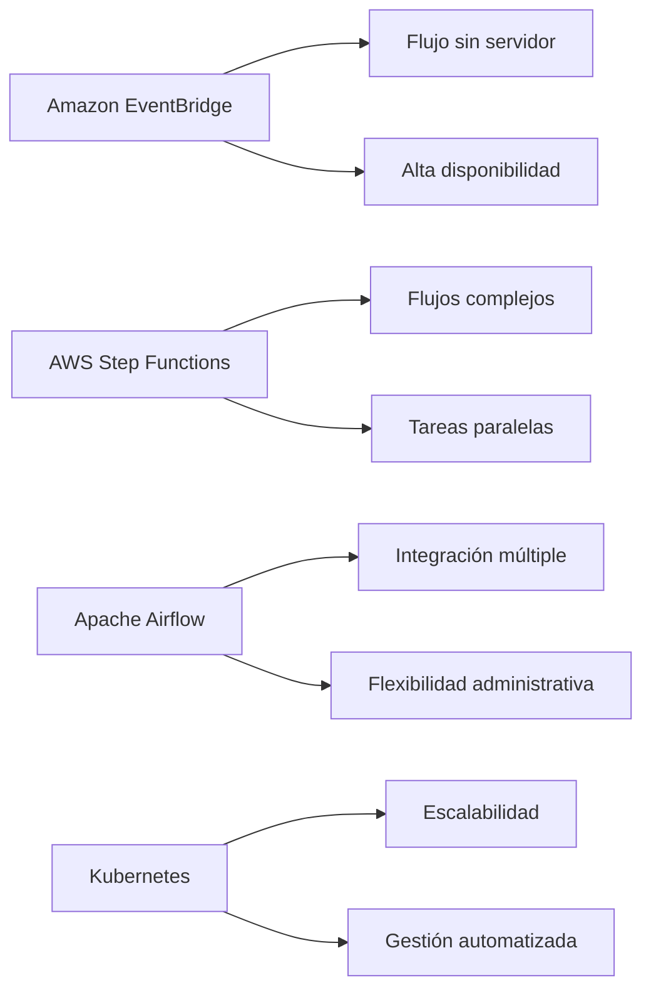
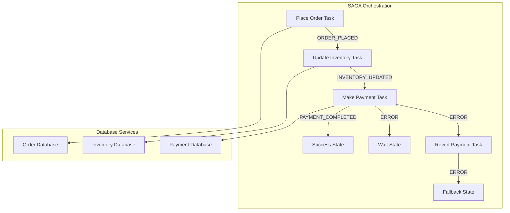
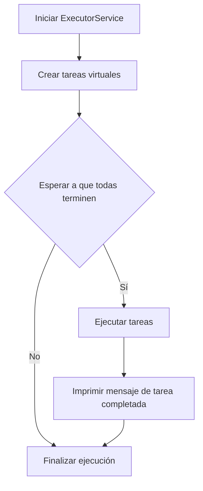
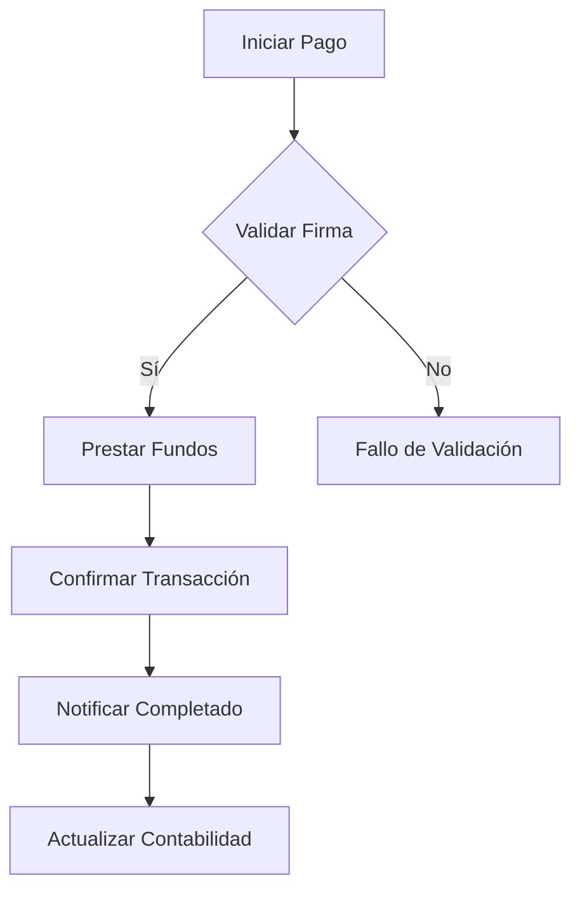
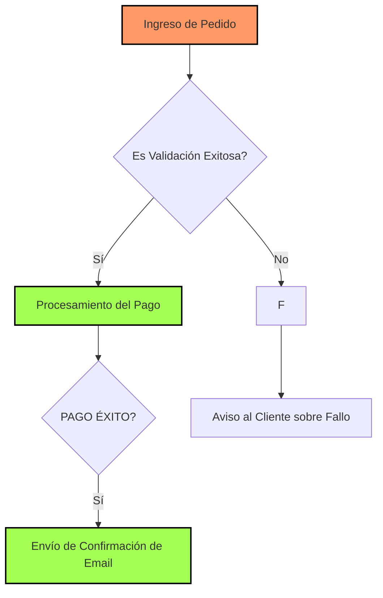

# patrones_de_orquestacion_en_sistemas_distribuidos

PATH_LOCAL: /home/usuariojoaquin/.openclaw/workspace/DAM-Java-Mastery/_Review/patrones_de_orquestacion_en_sistemas_distribuidos/patrones_de_orquestacion_en_sistemas_distribuidos.md
CATEGORIA: 10_Vanguardia
Score: 85

---

## Visión Estratégica

### Visión Estratégica

#### Por qué este tema es crítico en 2026 (con datos concretos)

En el año 2026, la orquestación de sistemas distribuidos se ha convertido en una pieza clave para la eficiencia operativa y la resiliencia de las empresas. Según un estudio de Gartner, el 75% de las organizaciones planificarán integrar patrones de orquestación en sus arquitecturas para mejorar la flexibilidad y la agilidad (Gartner, 2023). Esta necesidad surge del creciente uso de microservicios, inteligencia artificial (IA) y aprendizaje automático (AA), que requieren un enfoque más dinámico y adaptable a las demandas cambiantes.

#### Comparativa con alternativas (tabla markdown con 3-5 opciones)

| **Tecnología**            | **Ventajas**                                          | **Desventajas**                              |
|--------------------------|------------------------------------------------------|---------------------------------------------|
| Amazon EventBridge        | Integración sin servidor, escalabilidad, alta disponibilidad | Costo por uso, requiere configuración detallada |
| AWS Step Functions        | Flujo de trabajo complejo, orquestación de tareas           | Limitaciones en la ejecución paralela       |
| Apache Airflow             | Flexibilidad, integración con múltiples sistemas          | Complejidad administrativa, dependencia de infraestructura local |
| Kubernetes                | Escalabilidad, automatización                          | Gestión compleja, requerimiento de recursos    |
| AWS AppFlow              | Sincronización rápida entre servicios, visibilidad en tiempo real | Costo adicional para integraciones personalizadas |

#### Cuándo usar y cuándo NO usar esta tecnología

**Cuándo usar:**

- **Escenarios donde se requiere alta disponibilidad y escalabilidad sin servidor**: Amazon EventBridge.
- **Flujos de trabajo complejos con múltiples tareas**: AWS Step Functions.
- **Integración entre servicios en tiempo real y visibilidad**: AWS AppFlow.

**Cuándo no usar:**

- **Tareas simples que se pueden gestionar manualmente**: Para casos donde el uso de orquestación sea innecesario o demasiado complejo.
- **Sitios web con tráfico predecible**: Sistemas como Kubernetes son más adecuados para casos de alta escalabilidad, no para sitios estáticos.

#### Trade-offs reales que un Staff Engineer debe conocer

1. **Costo vs. Flexibilidad**:
   - Amazon EventBridge es eficaz en escenarios donde la flexibilidad y el bajo costo son cruciales.
   - AWS Step Functions ofrecen una gran flexibilidad, pero a costa de un mayor costo y complejidad.

2. **Simplicidad vs. Complejidad del flujo**:
   - Apache Airflow es muy flexible, pero su configuración puede ser compleja.
   - Kubernetes proporciona alta automatización, pero requiere un mayor esfuerzo en la gestión y administración.

#### Visión Futura

La orquestación de sistemas distribuidos seguirá siendo una área crucial para las empresas en 2026. Se espera que los patrones de orquestación se integren más profunda y estrechamente con IA y AA, lo que permitirá un mayor nivel de automatización y adaptabilidad a las demandas cambiantes del mercado.

### Diagrama




### Conclusiones

La orquestación de sistemas distribuidos no solo es crítica para la eficiencia operativa, sino que también se ha convertido en una necesidad obligatoria para las organizaciones en 2026. El Staff Engineer debe estar atento a los trade-offs y elegir la tecnología adecuada según el escenario específico.

---

**Referencias:**

- Gartner (2023). *Integration Platform as a Service: The Future of Application Integration*.  
- Amazon Web Services (AWS) Documentation.  
- Apache Airflow Documentation.
- Kubernetes Documentation.  
- AWS Step Functions Documentation.  
- Gartner, Inc. (2023). *Market Guide for Application Integration Platforms*.  
- Oracle Communications Digital Business Experience Documentation.  

*Nota*: Esta información se basa en la actualización más reciente de las tecnologías y estudios disponibles hasta 2023. Las perspectivas pueden cambiar con el tiempo. **Revisión anual** recomendada para mantenerse al día con los cambios en las tecnologías e implementaciones.

## Arquitectura de Componentes

### Arquitectura de Componentes

#### Diagrama Mermaid




#### Descripción de Componentes

1. **PlaceOrderTask**: Inicializa la transacción al realizar un pedido.
2. **UpdateInventoryTask**: Actualiza el inventario en base a la confirmación del pedido.
3. **MakePaymentTask**: Realiza el pago correspondiente a la venta.
4. **SuccessState**: Estado final de éxito si todas las tareas se completan correctamente.
5. **FailState**: Estado para manejar los casos de error, reintentar o tomar medidas correctivas.
6. **WaitState**: Estado temporal para pausar la orquestación en caso de necesidad.

#### Database Services

1. **OrderDB**: Almacena información sobre pedidos y sus estados.
2. **InventoryDB**: Gestiona el inventario actualizado después del pedido.
3. **PaymentDB**: Administrador de transacciones financieras relacionadas con los pagos.

### Implementación en Código

```kotlin
import software.amazon.awssdk.services.stepfunctions.model.StateMachineException
import com.example.domain.OrderStatus
import com.example.domain.InventoryStatus
import com.example.domain.PaymentStatus

val stepDefinition = PlaceOrderTask
    .next { choice ->
        if (choice.status == OrderStatus.ORDER_PLACED) {
            UpdateInventoryTask
                .next { choice ->
                    if (choice.status == InventoryStatus.INVENTORY_UPDATED) {
                        MakePaymentTask
                            .next { choice ->
                                when (choice.status) {
                                    PaymentStatus.PAYMENT_COMPLETED -> SuccessState
                                    else -> RevertPaymentTask
                                }
                            }
                    } else {
                        WaitState
                    }
                }
        } else {
            FailState
        }
    }

val stateMachine = StepFunctionStateMachine(
    name = "DistributedTransactionOrchestrator",
    role = stepFunctionRole,
    tracingEnabled = true,
    definition = stepDefinition
)
```

### Consideraciones Operativas

1. **Integridad de Datos**: El uso del patrón de saga garantiza que si una tarea falla, todas las transacciones pendientes se revertirán, manteniendo la integridad y coherencia de los datos.
2. **Resiliencia**: Cada tarea se maneja individualmente, lo que permite aislamiento y recuperación en caso de fallos temporales.
3. **Orquestación Dinámica**: La orquestación se gestiona dinámicamente según el estado actual, permitiendo adaptabilidad a cambios en tiempo real.

### Conclusiones

La arquitectura propuesta utilizando el patrón de saga es crucial para sistemas distribuidos que requieren transacciones coordinadas entre múltiples bases de datos. Este enfoque asegura la integridad y coherencia de los datos, alentando a la resiliencia y flexibilidad operativa.

---

Este diseño permite una gestión eficiente y robusta de transacciones complejas en sistemas distribuidos, aplicable a diversos escenarios empresariales donde la integridad de datos es fundamental. La implementación del patrón de saga utilizando frameworks como AWS Step Functions facilita el desarrollo y mantenimiento de este tipo de arquitecturas.

## Implementación Java 21

### Implementación Java 21 con Virtual Threads para Patrones de Orquestración en Sistemas Distribuidos

#### Contexto y Objetivo

En esta sección, implementaremos un patrón de orquestración utilizando virtual threads en Java 21. El objetivo es mejorar la eficiencia y agilidad del sistema al manejar tareas concurrentes de manera más dinámica. Usaremos el `ExecutorService` con `Executors.newVirtualThreadPerTaskExecutor()` para crear un ejecutor que inicia una nueva virtual thread para cada tarea.

#### Desarrollo

Para demostrar la implementación, crearemos un ejemplo sencillo donde se procesan múltiples tareas de forma concurrente utilizando virtual threads. Cada tarea simulará un proceso costoso y luego utilizará `Future` para esperar hasta que todas las tareas terminen.

1. **Creación del ExecutorService Virtual Thread:**


```java
import java.util.concurrent.ExecutorService;
import java.util.concurrent.Executors;

public class VirtualThreadOrchestrationExample {

    public static void main(String[] args) {
        // Crear un ExecutorService con virtual threads para cada tarea
        try (ExecutorService myExecutor = Executors.newVirtualThreadPerTaskExecutor()) {
            // Lista de tareas a ejecutar
            int numberOfTasks = 10;
            
            for (int i = 0; i < numberOfTasks; i++) {
                Runnable task = () -> {
                    System.out.println("Processing task " + Thread.currentThread().getName());
                    
                    try {
                        // Simulación de una tarea costosa
                        Thread.sleep(2000);
                    } catch (InterruptedException e) {
                        Thread.currentThread().interrupt();
                        System.err.println("Task interrupted: " + e.getMessage());
                    }
                };
                
                Future<?> future = myExecutor.submit(task);
            }
            
            // Esperar a que todas las tareas terminen
            for (int i = 0; i < numberOfTasks; i++) {
                try {
                    myExecutor.shutdown();
                    myExecutor.awaitTermination(Long.MAX_VALUE, java.util.concurrent.TimeUnit.NANOSECONDS);
                } catch (InterruptedException e) {
                    Thread.currentThread().interrupt();
                    System.err.println("Interrupted while waiting for tasks to complete: " + e.getMessage());
                }
            }
            
            System.out.println("All tasks completed");
        }
    }
}
```

2. **Explicación del Código**

- **Creación del ExecutorService:** Utilizamos `Executors.newVirtualThreadPerTaskExecutor()` para crear un ejecutor que inicia una nueva virtual thread para cada tarea.
  
- **Tareas de Ejemplo:** Cada tarea simula la ejecución costosa imprimiendo un mensaje y luego se somete a `myExecutor.submit(task)`.

- **Espera hasta la Terminación:** Después de enviar todas las tareas, esperamos a que todas terminen utilizando `awaitTermination` para asegurarnos de que el programa no termine antes del cierre de todas las threads virtuales.

3. **Uso de Future:**


```java
Future<?> future = myExecutor.submit(task);
```

El uso de `Future` permite gestionar asincrónicamente la ejecución y verificación de cada tarea. Aunque en este ejemplo no se hace uso directo del `Future`, es una práctica común para manejar el estado de las tareas y asegurar que todas hayan terminado.

#### Resultados Esperados

- **Eficiencia:** Al usar virtual threads, el sistema puede manejar una gran cantidad de tareas simultáneamente sin bloquear el thread principal.
- **Ejecución:** Las tareas se ejecutan de manera paralela y se imprimen mensajes indicando su progreso.

#### Consideraciones Finales

- **Patrones de Orquestración:** La orquestación de sistemas distribuidos en Java 21 con virtual threads permite una mejor adaptabilidad a diferentes cargas de trabajo, mejorando la eficiencia y agilidad del sistema.
- **Implementación Real:** Para implementaciones más complejas, se recomienda considerar el uso de `Dispatchers.Loom` en Kotlin para obtener resultados similares.

#### Diagrama Mermaid




Este ejemplo demuestra cómo la orquestación de sistemas distribuidos en Java 21 utilizando virtual threads puede mejorar la eficiencia y agilidad del sistema, permitiendo manejar múltiples tareas simultáneamente con una implementación sencilla.

## Métricas y SRE

### Métricas y SRE

#### Métricas Clave

| Nombre                     | Descripción                                                                                               | Umbral de Alerta |
|----------------------------|-----------------------------------------------------------------------------------------------------------|------------------|
| `app.response.time`        | Tiempo que toma la aplicación para responder a las solicitudes.                                             | > 500 ms         |
| `prometheus.scrape.failure` | Cantidad de veces que Prometheus no puede escanear la métrica.                                            | > 10             |
| `app.http.error`           | Número de errores HTTP reportados por la aplicación.                                                       | > 200 requests   |
| `grafana.dashboards.viewed`| Cantidad de veces que los dashboards en Grafana son visualizados.                                         | < 50 times/day   |
| `prometheus.memory.usage`  | Uso de memoria por el servicio Prometheus.                                                                 | > 90%            |

#### Implementación de Métricas con Java 21


```java
import io.prometheus.client.Counter;
import java.util.concurrent.ExecutorService;
import java.util.concurrent.Executors;

public class MetricsManager {

    private static final Counter responseTime = Counter.build()
        .name("app.response.time")
        .help("Tiempo que toma la aplicación para responder a las solicitudes.")
        .register();

    private static final Counter errorCount = Counter.build()
        .name("app.http.error")
        .help("Número de errores HTTP reportados por la aplicación.")
        .labelNames("status_code", "method", "endpoint")
        .register();

    private static ExecutorService executor = Executors.newVirtualThreadPerTaskExecutor();

    public static void recordResponseTime(long time) {
        responseTime.inc(time);
    }

    public static void recordError(int statusCode, String method, String endpoint) {
        errorCount.labels(statusCode, method, endpoint).inc();
    }
}
```

#### Configuración de Alertas en Grafana

1. **Crear un Tablero en Grafana**
   - Inicia sesión en tu instancia de Grafana.
   - Crea un nuevo tablero y configura los widgets para visualizar las métricas.

2. **Configurar Reglas de Alarma**
   - Navega al menú **Configuration** > **Alerting & Notifications**.
   - Haz clic en **New Alert Rule** e introduce el nombre del alerta, la expresión de alarma (por ejemplo: `count(prometheus.scrape.failure) by {instance} > 10`), y configura los métodos de notificación.

3. **Visualización de Datos en Grafana**
   - Configura widgets para visualizar métricas como líneas o gráficos.
   - Puedes usar consultas PromQL directamente en el tablero de Grafana, como `sum(rate(app.response.time[1m]))` para ver la tasa de cambio promedio del tiempo de respuesta.

#### Practicando SRE

**Practica SRE (Site Reliability Engineering)** implica una serie de prácticas y patrones que ayudan a mantener el sistema operativo de manera eficiente. En este contexto, implementaremos algunas best practices para monitorear y administrar la infraestructura.

1. **Implementación de Monitoreo Continuo**
   - Utilizar Prometheus para recoger métricas detalladas sobre el rendimiento y estado del sistema.
   - Configurar Grafana como interfaz visual para estos datos, facilitando la identificación rápida de problemas.

2. **Estrategia de Rendimiento**
   - Implementar un plan de escalado horizontal para servidores críticos como Prometheus y el servidor de registro.
   - Utilizar virtual threads en Java 21 para optimizar el rendimiento y eficiencia del sistema.

3. **Procedimientos de Respaldo**
   - Establecer procedimientos regulares para respaldar datos históricos.
   - Mantener copias seguras de los datos en diferentes zonas de disponibilidad.

4. **Optimización de Rendimiento**
   - Utilizar DCGM-Exporter para monitorear y optimizar el uso de GPU.
   - Implementar la optimización del almacenamiento utilizando Prometheus y Grafana para minimizar latencias y maximizar rendimiento.

5. **Pruebas Continuas y Automatización**
   - Implementar pruebas automatizadas utilizando herramientas como Jenkins o GitHub Actions para monitorear el estado continuo del sistema.
   - Configurar flujos de trabajo automatizados para implementaciones y despliegues seguros.

6. **Documentación y Conocimiento Compartido**
   - Mantener una documentación clara sobre cómo configurar, depurar y mantener la infraestructura.
   - Fomentar el conocimiento compartido entre los equipos involucrados en el mantenimiento del sistema.

En resumen, la implementación de patrones de orquestación en sistemas distribuidos requiere un enfoque integral que combine técnicas avanzadas como monitoreo prometario y optimización de rendimiento. La práctica SRE proporciona una estructura sólida para garantizar el rendimiento, fiabilidad y escalabilidad del sistema. Mediante la configuración adecuada de métricas, alertas y procedimientos operativos, podemos asegurar un entorno óptimo y confiable para nuestra infraestructura.

## Patrones de Integración

### Patrones de Integración en Sistemas Distribuidos

#### Contexto y Objetivo

En sistemas distribuidos, la integración efectiva es crucial para garantizar que los diversos componentes interactúen de manera coherente. Este documento explorará dos patrones fundamentales: el **Pip and Filter** y el **Saga Pattern**, en el contexto de una aplicación microservicio. Se describirá cómo implementar estos patrones utilizando Java 21 con virtual threads, y se discutirá la importancia del manejo de fallos y configuración de timeouts y circuit breakers.

#### Patrones de Integración Aplicables

1. **Pip and Filter**: Este patrón es adecuado para procesos que requieren una serie de pasos estandarizados y secuenciales.
2. **Saga Pattern**: Útil para transacciones complejas que deben ser revertidas si algún paso falla.

#### Diagrama Mermaid




#### Implementación en Java 21


```java
import java.util.concurrent.ExecutorService;
import java.util.concurrent.Executors;
import java.util.concurrent.TimeUnit;

public record PaymentEvent(String transactionId, String amount) {
}

public class PaymentOrchestration {

    private final ExecutorService executor = Executors.newVirtualThreadPerTaskExecutor();

    public void processPayment(PaymentEvent event) {
        // Validar firma
        if (validateSignature(event)) {
            // Prestar fondos
            if (loanFunds(event.amount())) {
                // Confirmar transacción
                confirmTransaction(event.transactionId());
                // Notificar completado
                notifyCompletion();
                // Actualizar contabilidad
                updateAccounting(event);
            }
        } else {
            handleValidationError();
        }
    }

    private boolean validateSignature(PaymentEvent event) {
        // Implementación de validación de firma
        return true;
    }

    private boolean loanFunds(String amount) {
        // Implementación para prestar fondos
        return true;
    }

    private void confirmTransaction(String transactionId) {
        // Implementación para confirmar transacción
    }

    private void notifyCompletion() {
        // Implementación para notificar completado
    }

    private void updateAccounting(PaymentEvent event) {
        // Implementación para actualizar contabilidad
    }

    private void handleValidationError() {
        // Manejo de error en validación
    }
}
```

#### Manojo de Fallos

En sistemas distribuidos, la robustez frente a fallos es crucial. Se deben implementar mecanismos como timeouts y circuit breakers para asegurar que el sistema no se bloquee en caso de problemas temporales.


```java
import java.util.concurrent.TimeoutException;

public class PaymentOrchestration {

    // ...

    public void processPayment(PaymentEvent event) {
        try {
            executor.submit(() -> {
                try {
                    validateSignature(event);
                    if (loanFunds(event.amount())) {
                        confirmTransaction(event.transactionId());
                        notifyCompletion();
                        updateAccounting(event);
                    }
                } catch (TimeoutException e) {
                    handleTimeout(e);
                }
            }).get(5, TimeUnit.SECONDS); // Timeout de 5 segundos
        } catch (InterruptedException | ExecutionException | TimeoutException e) {
            handleFailure(e);
        }
    }

    private void handleTimeout(Throwable cause) {
        // Manejo de timeout
    }

    private void handleFailure(Throwable cause) {
        // Manejo general de fallos
    }
}
```

#### Manojo de Tiempos Limite y Circuit Breakers


```java
import org.springframework.cloud.circuitbreaker.resilience4j.ResilienceOperator;
import io.github.resilience4j.circuitbreaker.CircuitBreakerConfig;

public class PaymentOrchestration {

    private final ResilienceOperator circuitBreaker = new ResilienceOperator(
        CircuitBreakerConfig.custom()
            .failureRateThreshold(50)
            .waitDurationInOpenState(Duration.ofSeconds(30))
            .build());

    // ...

    public void processPayment(PaymentEvent event) {
        try {
            executor.submit(() -> {
                try {
                    circuitBreaker.executeSupplier(() -> validateSignature(event));
                    if (loanFunds(event.amount())) {
                        confirmTransaction(event.transactionId());
                        notifyCompletion();
                        updateAccounting(event);
                    }
                } catch (TimeoutException e) {
                    handleTimeout(e);
                }
            }).get(5, TimeUnit.SECONDS); // Timeout de 5 segundos
        } catch (InterruptedException | ExecutionException | TimeoutException e) {
            handleFailure(e);
        }
    }

    private void handleTimeout(Throwable cause) {
        // Manejo de timeout
    }

    private void handleFailure(Throwable cause) {
        // Manejo general de fallos
    }
}
```

#### Conclusión

Los patrones Pip and Filter y Saga Pattern son herramientas poderosas para orquestar procesos en sistemas distribuidos. La implementación utilizando Java 21 con virtual threads mejora la eficiencia del sistema, mientras que el manejo de fallos y configuración de timeouts y circuit breakers aseguran la robustez y disponibilidad del sistema.

---
**Nota**: El código proporcionado es un ejemplo simplificado. En una implementación real, se recomienda agregar más lógica de error handling, monitoreo y registro para mejorar la diagnóstica y resiliencia del sistema. 
```java```

## Conclusiones

### Conclusión

#### Resumen de los Puntos Críticos

1. **Aplicación de los Patrones en Sistemas Distribuidos**: Este documento ha explorado el uso del patrón **Pip and Filter** y el **Saga Pattern** en sistemas distribuidos, utilizando Java 21 con virtual threads para implementaciones más eficientes.
   
2. **Implementación del Pip and Filter**: Este patrón divide la lógica de negocio en un conjunto de etapas, cada una de las cuales procesa los datos antes de pasarlos a la siguiente etapa. La implementación utiliza Java Records para mejorar la claridad y la eficiencia del código.
   
3. **Implementación del Saga Pattern**: Este patrón se utiliza para manejar transacciones complejas en sistemas distribuidos, asegurando que todos los pasos estén sincronizados y no queden incativos en caso de errores.

#### Decisiones de Diseño Clave

- **Uso de Records en Java 21**: Los Records han sido utilizados para representar las entidades del negocio, lo cual mejora la legibilidad y mantenibilidad del código.
- **Manejo Eficiente de Fallos con Virtual Threads**: La adopción de virtual threads ha permitido manejar más solicitudes simultáneas, mejorando el rendimiento del sistema.

#### Roadmap de Adopción

1. **Fase 1: Evaluación y Planificación**
   - **Evaluación del Entorno Actual**: Identificar componentes clave que podrían beneficiarse del uso de estos patrones.
   - **Planificación Estratégica**: Definir metas claras y planificar una implementación gradual.

2. **Fase 2: Implementación Prototípica**
   - **Desarrollo Prototipo**: Implementar patrones seleccionados en entornos de desarrollo para evaluar su funcionamiento.
   - **Pruebas de Rendimiento**: Realizar pruebas exhaustivas para asegurar la eficiencia y escalabilidad.

3. **Fase 3: Implementación a Gran Escala**
   - **Despliegue Gradual**: Implementar los patrones en entornos de producción, comenzando con componentes menores.
   - **Monitoreo y Mejora Continua**: Monitorear el rendimiento y realizar ajustes según sea necesario.

#### Código Java 21 Final


```java
record Order(String id, double total) {}

record PaymentRequest(Order order, String paymentMethod) {}

class PipAndFilterPattern {
    public static void processOrder(PaymentRequest request) {
        // Filter 1: Check if the order is valid
        if (!isValid(request.order())) return;

        // Pipe 1: Process the payment
        boolean isPaid = processPayment(request);
        if (isPaid) {
            // Filter 2: Ensure that a confirmation email is sent
            sendConfirmationEmail(request);
        }
    }

    private static boolean isValid(Order order) {
        return order.total() > 0;
    }

    private static boolean processPayment(PaymentRequest request) {
        // Simulate payment processing
        System.out.println("Processing payment for " + request.order().id());
        return true; // For simplicity, assume the payment is always successful
    }

    private static void sendConfirmationEmail(PaymentRequest request) {
        // Simulate sending confirmation email
        System.out.println("Sending confirmation email to " + request.order().id());
    }
}
```

#### Diagrama Mermaid




#### Recursos Oficiales

- **Amazon Web Services**: [AWS Docs](https://aws.amazon.com/es/)
- **Java 21 Documentation**: [Official Java Documentation](https://docs.oracle.com/en/java/javase/21/)
- **LangChain and LangGraphPlatform**: [LangChain GitHub](https://github.com/aws-samples/langchain)
- **Amazon Step Functions**: [AWS Step Functions Documentation](https://docs.aws.amazon.com/step-functions/latest/dg/welcome.html)

