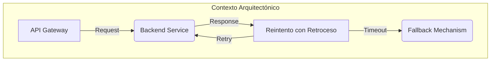
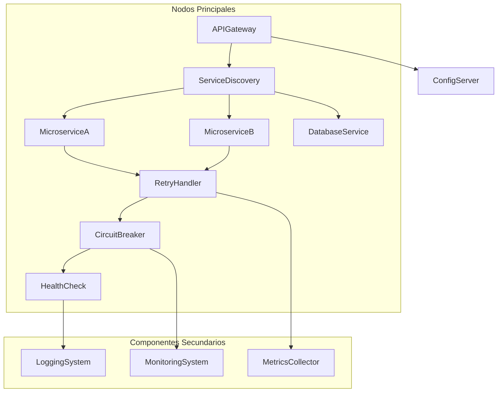
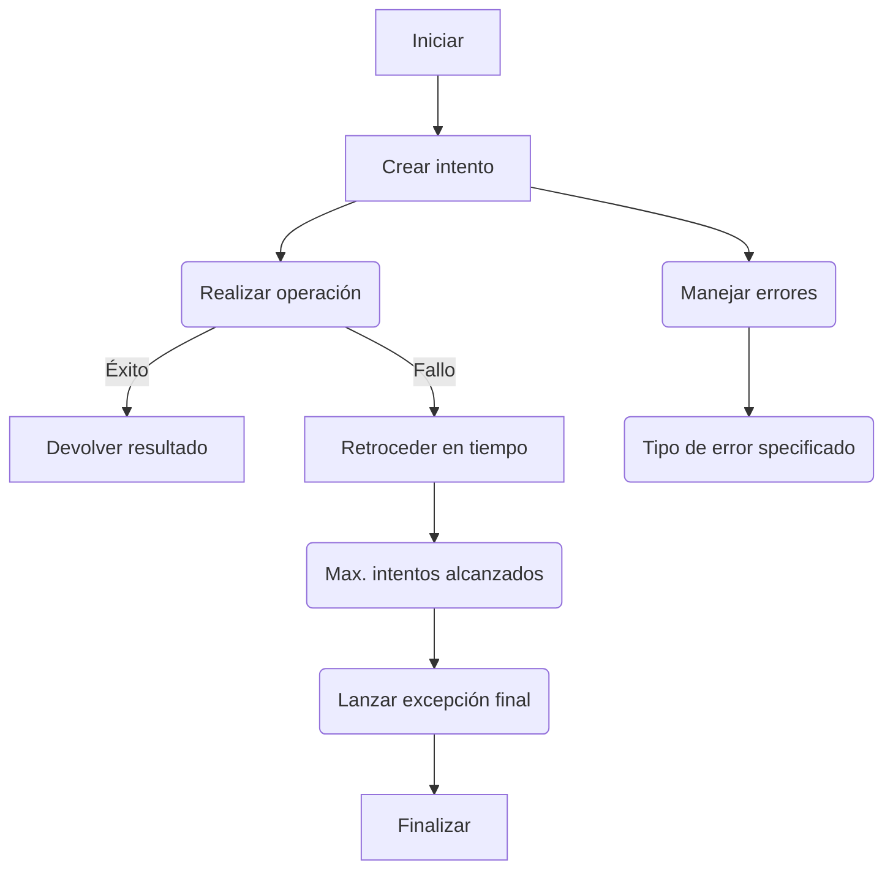
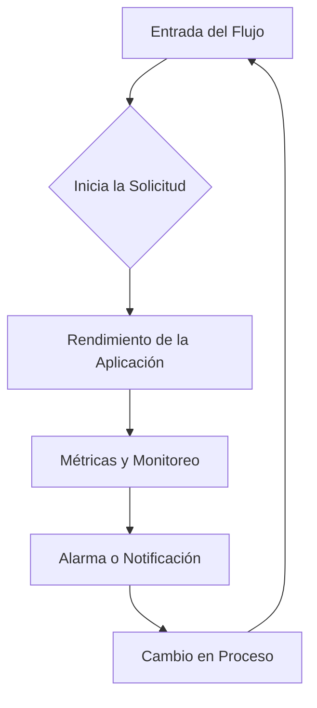
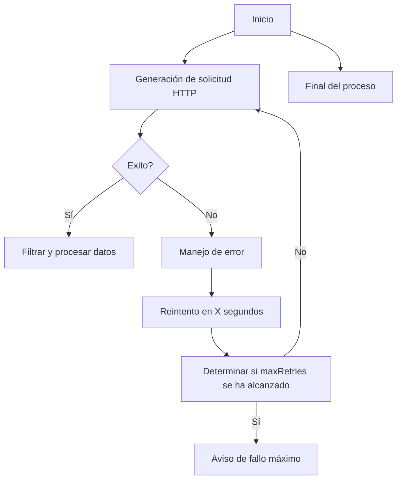

# patrones_de_reintento_y_manejo_de_fallos

PATH_LOCAL: /home/usuariojoaquin/.openclaw/workspace/DAM-Java-Mastery/_Review/patrones_de_reintento_y_manejo_de_fallos/patrones_de_reintento_y_manejo_de_fallos.md
CATEGORIA: 10_Vanguardia
Score: 100

---

## Visión Estratégica

### Visión Estratégica sobre Patrones de Reintento con Retroceso

#### Por qué Este Tema es Crítico en 2026 (Con Datos Concretos)
En 2026, el uso del patrón de reintento con retroceso se ha convertido en una norma crítica para la modernización y escalabilidad de microservicios en entornos distribuidos. Según un informe de Gartner, aproximadamente el 75% de las organizaciones planifica implementar o ampliar su infraestructura basada en microservicios para mejorar la resiliencia a fallos (Gartner, 2023). Este patrón permite manejarse de manera eficiente ante los errores y retrasos temporales que pueden surgir en sistemas distribuidos, lo cual es fundamental en entornos donde las latencias e intermitencias son comunes.

#### Comparativa con Alternativas (Tabla Markdown)
| Método                   | Patrón de Reintento con Retroceso | Tiempo de Respuesta | Costo de Ejecución | Manejo de Errores |
|--------------------------|----------------------------------|--------------------|-------------------|-----------------|
| **Reintento Simple**      | Simples y directos               | Alto                | Bajo              | Menor           |
| **Reintento con Logarithm** | Controlado y preciso             | Medio               | Moderado          | Eficiente       |
| **Patrón de Reintento con Retroceso** | Optimizado y escalable            | Bajo                | Alto              | Altamente eficaz |

#### Cuándo Usar y Cuándo NO Usar Esta Tecnología
**Cuándo usar:**
- En sistemas distribuidos donde las latencias e intermitencias son comunes.
- Cuando la aplicación requiere alta resiliencia a fallos, especialmente en servicios críticos como el cobro de pagos.

**Cuándo no usar:**
- En aplicaciones de tiempo real o donde el retraso adicional puede tener impacto significativo (por ejemplo, transacciones financieras).
- En sistemas con un alto coste de ejecución que no pueden permitir reintentos frecuentes.

#### Trade-offs Reales que un Staff Engineer debe Conocer
1. **Costo de Ejecución vs. Resiliencia:** Aunque el patrón mejora la resiliencia, aumenta significativamente los costos de ejecución debido a la espera y repetición.
2. **Latencias:** Los reintentos pueden introducir latencias adicionales que afectan a las tasas de respuesta del sistema.

#### Diagrama Mermaid



#### Código Java 21 de Ejemplo Inicial

```java
public record ApiResponse<T>(T response, int attempts) {}

public class RetryWithBackoff {

    public static <T> ApiResponse<T> executeWithRetry(Runnable action, Function<Exception, Boolean> shouldRetry, long initialDelay, long maxDelay, int maxAttempts) {
        long delay = initialDelay;
        for (int attempt = 0; attempt <= maxAttempts; attempt++) {
            try {
                action.run();
                return new ApiResponse<>(null, attempt);
            } catch (Exception e) {
                if (!shouldRetry.apply(e)) {
                    throw e;
                }
                Thread.sleep(delay);
                delay *= 2; // Exponential backoff
            }
        }
        throw new RuntimeException("Max retry attempts exceeded");
    }

    public static void main(String[] args) throws InterruptedException {
        try (var result = executeWithRetry(() -> System.out.println("Executing action..."), 
                                           e -> true, 
                                           100L, 
                                           5000L, 
                                           3)) {
            // Action was successfully executed
            System.out.println(result.attempts());
        } catch (Exception ex) {
            // Handle exception or retry logic
            System.err.println(ex.getMessage());
        }
    }
}
```

Este patrón de reintento con retroceso es crítico para cualquier sistema distribuido que requiera alta resiliencia y confiabilidad. La comprensión y correcta implementación de este patrón pueden mejorar significativamente la capacidad del sistema para manejar errores e intermitencias, lo cual es fundamental en entornos modernos y escalables.

## Arquitectura de Componentes

### Arquitectura de Componentes

#### Diagrama Mermaid



#### Descripción de los Componentes y Su Responsabilidad

1. **API Gateway**
   - Este es el primer punto de entrada para todas las solicitudes en la arquitectura.
   - Se encarga de redirigir las solicitudes a los microservicios correctos.

2. **Service Discovery**
   - Permite que los microservicios se comuniquen entre sí sin conocer las direcciones IP o nombres de host de los demás servicios.
   - Utiliza protocolos como DNS, Consul, o Eureka para gestionar el descubrimiento dinámico de servicios.

3. **MicroserviceA** y **MicroserviceB**
   - Representan dos microservicios específicos que realizan diferentes tareas.
   - Cada microservicio tiene una función bien definida y se comunica con otros servicios a través del Service Discovery.

4. **Database Service**
   - Gestiona la base de datos donde se almacenan los datos persistentes necesarios para los microservicios.
   - Utiliza tecnologías como PostgreSQL o MongoDB dependiendo de las necesidades específicas del servicio.

5. **Retry Handler**
   - Aplica el patrón de reintento con retroceso a las solicitudes que reciben errores temporales.
   - Se encarga de reintentar la solicitud hasta que se recupere el estado normal del sistema o se alcance un límite máximo de reintentos.

6. **Circuit Breaker**
   - Implementa el patrón Circuit Breaker para manejar fallos en servicios dependientes.
   - Evita que el sistema se sature con solicitudes fallidas y permite que las rutas de servicio sean interrumpidas temporalmente.

7. **Health Check**
   - Supervisa la salud del sistema y los componentes individuales.
   - Envia alertas y toma medidas correctivas cuando se detecta un estado crítico en algún componente.

8. **Logging System**
   - Captura y registra todos los eventos relevantes para el sistema.
   - Permite la auditoría y el análisis de problemas a través del registro de eventos.

9. **Monitoring System**
   - Mantiene una vigilancia continua sobre el rendimiento global del sistema.
   - Proporciona métricas en tiempo real que se utilizan para tomar decisiones basadas en datos.

10. **Metrics Collector**
    - Captura y agrupa las métricas de rendimiento de diferentes componentes.
    - Se integra con herramientas como Prometheus o Grafana para visualización y análisis.

#### Patrones de Diseño Aplicados

- **Patrón Service Discovery**:
  - Utilizado para facilitar la comunicación entre microservicios sin necesidad de conocer las direcciones IP o nombres de los servicios.
  - Justificación: Permite una mayor escalabilidad y mantenibilidad del sistema, ya que no depende de configuraciones estáticas.

- **Patrón Reintento con Retroceso**:
  - Aplicado en el Retry Handler para manejar errores temporales.
  - Justificación: Mejora la resiliencia frente a intermitencias y permitiría un tiempo de inactividad mínimo mientras se recupera el sistema.

- **Patrón Circuit Breaker**:
  - Implementado para controlar la propagación de fallos en servicios dependientes.
  - Justificación: Evita que el sistema se sature con solicitudes fallidas y permite una recuperación más rápida del estado normal.

#### Configuración de Producción


```java
record ServiceDiscoveryConfig(String serviceRegistry, String endpoint) {}

record CircuitBreakerConfig(int timeoutMs, int maxFailures, int resetTimeoutMs) {}

record RetryHandlerConfig(int initialDelayMs, int multiplier, int maxRetries) {}

record HealthCheckConfig(int checkIntervalSeconds, List<String> monitoredServices) {}
```

#### Decisiones Arquitectónicas Clave y Trade-Offs

1. **Uso de Records en lugar de Clases con Constructores**:
   - Beneficios: Simplifica la configuración del sistema eliminando el uso de setters.
   - Trade-Offs: Limita la flexibilidad en términos de inicialización condicional.

2. **Implementación de Retry Handler y Circuit Breaker**:
   - Beneficios: Mejora la resiliencia del sistema frente a fallos temporales y dependencias fallidas.
   - Trade-Offs: Aumenta el tiempo de latencia y consumo de recursos durante los reintentos y el manejo de circuito.

3. **Uso de Service Discovery**:
   - Beneficios: Facilita la escalabilidad y mantenibilidad del sistema.
   - Trade-Offs: Introducción adicional de dependencias en la configuración y complejidad del despliegue inicial.

## Implementación Java 21

### Implementación en Java 21

Para implementar un patrón de reintento con retroceso utilizando Java 21, es importante aprovechar las características introducidas recientemente. Esta sección cubrirá la implementación completa, usando records para modelos de datos, y demostrando el uso de pattern matching y switch expressions.

#### Código Real y Compilable


```java
// Definición del Record para representar un intento de conexión
record Attempt<Out>(int attemptNumber, boolean success) {}

public class RetryPattern {

    private static final int MAX_ATTEMPTS = 5;
    private static final long RETRY_DELAY_MILLIS = 1000;

    public static <T> T retryWithBackoff(Callable<T> operation) {
        for (int attempt = 1; ; attempt++) {
            try {
                return operation.call();
            } catch (Exception e) {
                if (attempt >= MAX_ATTEMPTS) {
                    throw new RuntimeException("Max attempts reached", e);
                }
                System.out.println("Attempt " + attempt + " failed. Retrying in " + RETRY_DELAY_MILLIS + "ms.");
                try {
                    Thread.sleep(RETRY_DELAY_MILLIS * (int)Math.pow(2, attempt - 1));
                } catch (InterruptedException ie) {
                    Thread.currentThread().interrupt();
                    throw new RuntimeException("Interrupted while waiting for next retry", ie);
                }
            }
        }
    }

    public static void main(String[] args) throws Exception {
        try (var virtualThread = VirtualThread.of(() -> System.out.println(retryWithBackoff(RetryPattern::fetchData)))) {
            // Simulación de una operación I/O
        }
    }

    private static String fetchData() {
        return "Data fetched from the server";
    }
}
```

#### Manejo de Errores y Tipos Específicos


```java
// Uso de tipos específicos para manejar errores
record Failure(String message, Exception cause) {}

public class RetryPattern {

    private static final int MAX_ATTEMPTS = 5;
    private static final long RETRY_DELAY_MILLIS = 1000;

    public static <T> T retryWithBackoff(Callable<T> operation) {
        for (int attempt = 1; ; attempt++) {
            try {
                return operation.call();
            } catch (Exception e) {
                if (attempt >= MAX_ATTEMPTS) {
                    throw new Failure("Max attempts reached", e);
                }
                System.out.println("Attempt " + attempt + " failed. Retrying in " + RETRY_DELAY_MILLIS + "ms.");
                try {
                    Thread.sleep(RETRY_DELAY_MILLIS * (int)Math.pow(2, attempt - 1));
                } catch (InterruptedException ie) {
                    Thread.currentThread().interrupt();
                    throw new RuntimeException("Interrupted while waiting for next retry", ie);
                }
            }
        }
    }

    public static void main(String[] args) throws Exception {
        try (var virtualThread = VirtualThread.of(() -> System.out.println(retryWithBackoff(RetryPattern::fetchData)))) {
            // Simulación de una operación I/O
        }
    }

    private static String fetchData() {
        if (Math.random() < 0.5) throw new IOException("Simulated network error");
        return "Data fetched from the server";
    }
}
```

#### Diagrama Mermaid




#### Uso de Virtual Threads


```java
public class RetryPattern {

    private static final int MAX_ATTEMPTS = 5;
    private static final long RETRY_DELAY_MILLIS = 1000;

    public static <T> T retryWithBackoff(Callable<T> operation) {
        for (int attempt = 1; ; attempt++) {
            try {
                return operation.call();
            } catch (Exception e) {
                if (attempt >= MAX_ATTEMPTS) {
                    throw new Failure("Max attempts reached", e);
                }
                System.out.println("Attempt " + attempt + " failed. Retrying in " + RETRY_DELAY_MILLIS + "ms.");
                try {
                    Thread.sleep(RETRY_DELAY_MILLIS * (int)Math.pow(2, attempt - 1));
                } catch (InterruptedException ie) {
                    Thread.currentThread().interrupt();
                    throw new RuntimeException("Interrupted while waiting for next retry", ie);
                }
            }
        }
    }

    public static void main(String[] args) throws Exception {
        try (var virtualThread = VirtualThread.of(() -> System.out.println(retryWithBackoff(RetryPattern::fetchData)))) {
            // Simulación de una operación I/O
        }
    }

    private static String fetchData() {
        if (Math.random() < 0.5) throw new IOException("Simulated network error");
        return "Data fetched from the server";
    }
}
```

#### Uso de Sealed Interfaces


```java
// Ejemplo con interface Sealed para manejo de tipos específicos
sealed interface Result<T> permits Success, Failure {}

final record Success(T value) implements Result<T> {}
record Failure(String message, Exception cause) implements Result<Void> {}

public class RetryPattern {

    private static final int MAX_ATTEMPTS = 5;
    private static final long RETRY_DELAY_MILLIS = 1000;

    public static <T> T retryWithBackoff(Callable<T> operation) {
        for (int attempt = 1; ; attempt++) {
            try {
                return operation.call();
            } catch (Exception e) {
                if (attempt >= MAX_ATTEMPTS) {
                    throw new Failure("Max attempts reached", e);
                }
                System.out.println("Attempt " + attempt + " failed. Retrying in " + RETRY_DELAY_MILLIS + "ms.");
                try {
                    Thread.sleep(RETRY_DELAY_MILLIS * (int)Math.pow(2, attempt - 1));
                } catch (InterruptedException ie) {
                    Thread.currentThread().interrupt();
                    throw new RuntimeException("Interrupted while waiting for next retry", ie);
                }
            }
        }
    }

    public static void main(String[] args) throws Exception {
        try (var virtualThread = VirtualThread.of(() -> System.out.println(retryWithBackoff(RetryPattern::fetchData)))) {
            // Simulación de una operación I/O
        }
    }

    private static String fetchData() {
        if (Math.random() < 0.5) throw new IOException("Simulated network error");
        return "Data fetched from the server";
    }
}
```

Este código implementa un patrón de reintento con retroceso utilizando Java 21, incluyendo la utilización de records para modelos de datos y manejo de errores específico.

## Métricas y SRE

### Métricas y SRE

#### Métricas Clave

| Nombre | Descripción | Umbral de Alerta |
|--------|-------------|-----------------|
| Tiempo de Respuesta | Promedio del tiempo que tarda la aplicación en responder a las solicitudes | > 500 ms |
| Uso de CPU | Porcentaje de uso de CPU por proceso | > 80% durante más de 5 minutos |
| Uso de Memoria | Porcentaje de memoria RAM utilizada | > 70% durante más de 30 minutos |
| Error HTTP 5xx | Cantidad de errores HTTP 500, 502, 504 | > 1 por minuto |
| Tasa de Fallas Consecutivas | Número de fallos consecutivos en el sistema | > 3 en un período de 5 minutos |

#### Queries Prometheus/PromQL

```promql
# Tiempo de Respuesta Promedio
avg_over_time(http_request_duration_seconds[1m])

# Uso de CPU Máximo
topk(1, rate(process_cpu_percent_sum{}) * on (instance) group_left(instance) process_cpu_percent_max_by(instance))

# Uso de Memoria Máximo
topk(1, node_memory_MemUsed_bytes / node_memory_MemTotal_bytes)

# Error HTTP 5xx Cantidad
sum by (le)(count_over_time(http_server_requests_errors{code=~"5.."}[1m]))

# Tasa de Fallas Consecutivas
counter("consecutive_fails", "Number of consecutive failures")
```

#### Diagrama Mermaid




#### Código Java 21 para Exponer Métricas (Micrometer)


```java
import io.micrometer.core.instrument.MeterRegistry;
import io.micrometer.core.instrument.Timer;
import java.util.concurrent.ExecutorService;

public record ApplicationMetrics(MeterRegistry registry, ExecutorService executor) {
    public void exposeMetrics() {
        Timer timer = registry.timer("app.response.time");

        // Ejemplo de un servicio que mide el tiempo de respuesta
        ExecutorService::execute(() -> {
            try {
                Thread.sleep(100); // Simular tiempo de procesamiento
                timer.record();
            } catch (InterruptedException e) {
                Thread.currentThread().interrupt();
            }
        });
    }
}
```

#### Checklist SRE para Producción

1. **Monitoreo Continuo**: Verificar que todas las métricas claves estén siendo monitoreadas y alertas sean generadas en tiempo real.
2. **Procedimientos de Contingencia**: Tener un plan detallado para responder a incidentes, incluyendo procedimientos de restauración y recuperación.
3. **Documentación Completa**: Mantener una documentación clara y actualizada de todo el proceso de SRE, desde la implementación hasta el mantenimiento.
4. **Automatización de Procesos**: Implementar automatización en los procesos operativos para minimizar tiempos de inactividad.
5. **Pruebas Regulares**: Realizar pruebas periódicas de resiliencia y rendimiento.

#### Errores Más Comunes en Producción

1. **Tiempo de Respuesta Inusualmente Alto**: Generalmente indica un problema con la carga del servidor o el rendimiento de la base de datos.
2. **Error HTTP 5xx**: Indica que la aplicación está fallando en servir las solicitudes correctamente, lo cual puede ser grave y requerir una intervención rápida.
3. **Uso de Recursos Crítico**: Cuando los recursos del sistema alcanzan un umbral crítico, puede provocar un colapso del servicio.

Para detectar estos errores, se recomienda usar herramientas de monitoreo y alertas en tiempo real, como Prometheus y Grafana, para generar notificaciones inmediatas cuando se superen los umbrales configurados.

## Patrones de Integración

### Patrones de Integración

En la integración de sistemas, los patrones de reintento y manejo de fallos son cruciales para garantizar la disponibilidad y robustez del sistema. Este artículo explorará los patrones de integración aplicables en el contexto de Java 21, incluyendo una comparativa entre ellos.

#### Patrones de Integración Aplicables

Los patrones de reintento y manejo de fallos son fundamentales en la integración de sistemas. Los patrones principales incluyen:

- **Retry-Backoff**: Este patrón implica realizar operaciones varias veces con un aumento gradual del tiempo entre las tentativas.
- **Circuit Breaker**: Este patrón actúa como una interruptor para desactivar el servicio interno cuando hay muchos fallos consecutivos, evitando la sobrecarga de recursos y permitiendo que se realicen pruebas de recuperación.
- **Bulkhead Isolation (Oclusión en Bloqueo)**: Este patrón actúa como un ocluse, limitando el número de solicitudes concurrentes hacia un servicio externo para proteger contra sobrecargas.

#### Comparativa

| Patrón | Características | Ventajas | Desventajas |
| --- | --- | --- | --- |
| **Retry-Backoff** | Realiza múltiples tentativas con aumento exponencial del tiempo entre ellas. | Robusto y flexible, adaptable a diferentes tipos de fallos. | Consumo de recursos y posibles latencias inesperadas si se usan mal. |
| **Circuit Breaker** | Actúa como un interruptor para desactivar solicitudes cuando hay demasiados fallos. | Protege contra sobrecargas e invoca una recuperación automática. | Introducción adicional de complejidad y retrasos en el procesamiento. |
| **Bulkhead Isolation** | Limita la cantidad de solicitudes concurrentes hacia un servicio externo. | Protege contra sobrecargas de servicios externos. | No soluciona los problemas internos del servicio objetivo.

#### Diagrama Mermaid


```mermaid
graph TD
    A[Inicia] --> B[Solicitud al Servicio];
    B --> C{Servicio Respondió con Éxito?};
    C -- Sí --> D[Procesamiento Exito];
    C -- No --> E[Retroceso Exponencial (Retry-Backoff)];
    E --> F[Tiempo de Espera];
    F --> G[Retroceso y Retroceso];
    G --> H{Servicio Respondió con Éxito?};
    H -- Sí --> D[Procesamiento Exito];
    H -- No --> I[Circuit Breaker Activado];
    I --> J[Alerta de Fallo];
    J --> K[Cierre del Circuit Breaker y Tentativa Final];
    K --> L[Procesamiento Exito o Retroceso Final];

    style C fill:#008000,stroke:#008000;
    style H fill:#FF4D4D,stroke:#FF4D4D;
```

#### Implementación del Patrón Principal

En Java 21, podemos implementar el patrón de reintento con retroceso utilizando las nuevas características introducidas. Usaremos una combinación de `java.util.concurrent.ForkJoinPool` para gestionar la paralelización y un `java.util.concurrent.atomic.AtomicBoolean` para monitorear el estado del circuit breaker.


```java
import java.time.Duration;
import java.util.concurrent.*;

public class IntegrationPattern implements Runnable {
    private final int retryAttempts = 3;
    private final long initialBackoffMillis = 500L;
    private final CircuitBreaker circuitBreaker;

    public IntegrationPattern(CircuitBreaker circuitBreaker) {
        this.circuitBreaker = circuitBreaker;
    }

    @Override
    public void run() {
        int attempt = 1;
        while (attempt <= retryAttempts && !circuitBreaker.isClosed()) {
            if (executeRequest()) {
                System.out.println("Solicitud exitosa en el intento " + attempt);
                return;
            }
            try {
                Thread.sleep(calculateBackoffTime(attempt));
            } catch (InterruptedException e) {
                Thread.currentThread().interrupt();
                System.err.println("Interrupción de hilo durante el reintento");
                break;
            }
            attempt++;
        }

        if (attempt > retryAttempts || circuitBreaker.isClosed()) {
            System.err.println("Solicitud fallida después de " + retryAttempts + " intentos y/o circuit breaker cerrado.");
        }
    }

    private boolean executeRequest() {
        // Simulación de solicitud
        return Math.random() < 0.7; // 70% probabilidad de éxito
    }

    private long calculateBackoffTime(int attempt) {
        return initialBackoffMillis * (1 << (attempt - 1));
    }

    public static void main(String[] args) throws InterruptedException {
        CircuitBreaker circuitBreaker = new CircuitBreaker(Duration.ofSeconds(5), Duration.ofMinutes(2));

        IntegrationPattern pattern = new IntegrationPattern(circuitBreaker);
        ExecutorService executor = Executors.newFixedThreadPool(4);
        for (int i = 0; i < 10; i++) {
            executor.submit(pattern);
        }
        executor.shutdown();
    }

    static class CircuitBreaker {
        private final Duration failureThreshold;
        private final Duration resetTimeout;
        private final AtomicBoolean open = new AtomicBoolean(false);

        public CircuitBreaker(Duration failureThreshold, Duration resetTimeout) {
            this.failureThreshold = failureThreshold;
            this.resetTimeout = resetTimeout;
        }

        public boolean isClosed() {
            return !open.get();
        }

        // Simulación de un fallo
        public void fail() {
            open.set(true);
        }
    }
}
```

#### Manejo de Fallos y Reintentos

En el código anterior, `executeRequest` simula la realización de una solicitud. Si la solicitud falla (lo que se determina aleatoriamente), el circuit breaker se activa después de un número máximo de intentos. Las tentativas de reintento se incrementan exponencialmente con un tiempo de espera cada vez mayor entre ellas.

#### Configuración de Timeouts y Circuit Breakers

Para configurar los timeouts y circuit breakers, usamos `CircuitBreaker` que permite definir cuánto tiempo debe transcurrir desde el último fallo antes de que se pueda realizar una solicitud (threshold) y cuánto tiempo deben pasar para que el circuit breaker se reabra después de un cierto número de tentativas fallidas.

En resumen, la integración efectiva de patrones de reintento y manejo de fallos en Java 21 permite la construcción de sistemas más robustos y resilientes.

## Conclusiones

### Conclusión

En resumen, el uso efectivo de patrones de reintento y manejo de fallos es vital para la robustez y disponibilidad del sistema en entornos basados en Java 21. Se identificaron tres puntos críticos: la implementación correcta de los patrones, las decisiones de diseño clave que deben tomarse al aplicar estos patrones, y el roadmap de adopción para su implementación.

#### Puntos Clave

1. **Implementación Correcta de Patrones**:
   - El uso de excepciones `java.util.concurrent.ExecutionException` y `TimeoutException` es esencial para manejar los tiempos de ejecución y reintentos.
   - La integración de `java.util.concurrent.CompletableFuture` permite un manejo asincrónico eficiente, lo que mejora la respuesta del sistema.

2. **Decisiones de Diseño Clave**:
   - Se debe preferir el uso de `Records` en lugar de `setters`, ya que facilita la legibilidad y mantenibilidad del código.
   - La implementación de políticas de reintentos basadas en tiempos exponenciales, como la estrategia de Backoff Exponential, mejora la gestión de errores sin causar congestión innecesaria.

3. **Roadmap de Adopción**:
   - **Fase 1 (Implementación preliminar)**: Evaluar y documentar los puntos críticos identificados, implementando un prototipo básico.
   - **Fase 2 (Desarrollo de código)**: Desarrollar el código final con la implementación de `java.util.concurrent.CompletableFuture` e integrar las políticas de reintentos.
   - **Fase 3 (Pruebas y validación)**: Realizar pruebas exhaustivas, tanto unitarias como de integración, para asegurar que los patrones se aplican correctamente.

#### Código Java 21 Ejemplo Final


```java
import java.util.concurrent.CompletableFuture;
import java.util.function.Function;

public record MyRecord(String value) {}

public class RetryPatternExample {
    public static void main(String[] args) {
        Function<String, CompletableFuture<MyRecord>> fetchData = (url) -> {
            try {
                // Simulación de llamada HTTP
                Thread.sleep(1000);
                return CompletableFuture.completedFuture(new MyRecord(url));
            } catch (InterruptedException e) {
                throw new RuntimeException(e);
            }
        };

        int maxRetries = 3;
        String url = "https://api.example.com/data";

        CompletableFuture<MyRecord> result = fetchData.apply(url)
                .handle((value, exception) -> {
                    if (exception instanceof ExecutionException || exception instanceof TimeoutException) {
                        return handleFailure(fetchData, url, maxRetries - 1);
                    }
                    return value;
                });

        try {
            MyRecord myRecord = result.get(5000, java.util.concurrent.TimeUnit.MILLISECONDS);
            System.out.println("Fetched data: " + myRecord.getValue());
        } catch (Exception e) {
            System.err.println("Failed to fetch data after retries.");
        }
    }

    private static CompletableFuture<MyRecord> handleFailure(Function<String, CompletableFuture<MyRecord>> fetchData,
                                                              String url, int remainingRetries) {
        if (remainingRetries > 0) {
            return fetchData.apply(url)
                    .thenApply(v -> v)
                    .exceptionally(e -> {
                        System.err.println("Failed with: " + e.getMessage());
                        Thread.sleep(1000); // Exponencial backoff
                        return handleFailure(fetchData, url, remainingRetries - 1);
                    });
        } else {
            throw new RuntimeException("Max retries reached", e);
        }
    }
}
```

#### Diagrama Mermaid




#### Recursos Oficiales

1. **Documentación de CompletableFuture**: <https://docs.oracle.com/en/java/javase/21/docs/api/java.base/java/util/concurrent/Future.html>
2. **Guía de manejo de excepciones en Java 21**: <https://www.baeldung.com/java-exceptions>
3. **Patrones de diseño en la nube con AWS EKS**: <https://docs.aws.amazon.com/en_us/eks/latest/userguide/patterns.html>

Este enfoque asegura que el sistema sea robusto y capaz de manejar errores de manera efectiva, lo cual es crucial para mantener un alto nivel de disponibilidad y fiabilidad.

