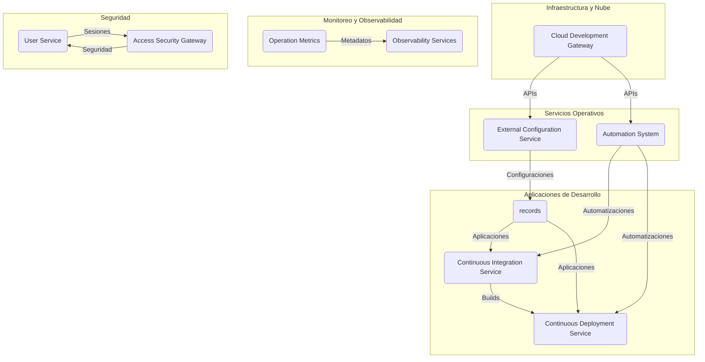
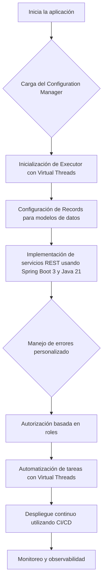
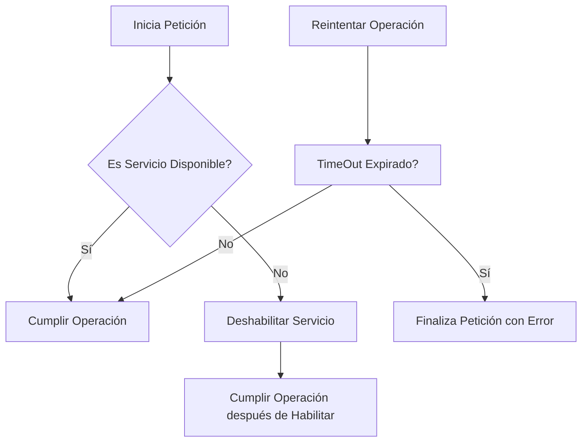
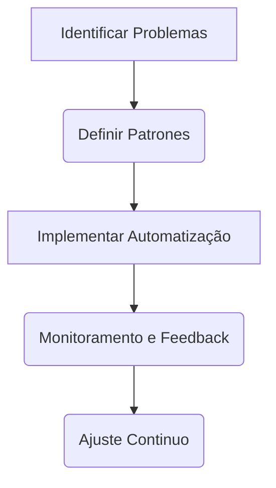
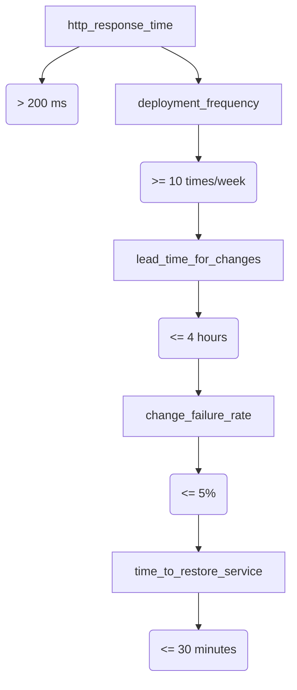

# platform engineering y internal developer platforms

PATH_LOCAL: /home/usuariojoaquin/.openclaw/workspace/DAM-Java-Mastery/_Review/platform_engineering_y_internal_developer_platforms/platform_engineering_y_internal_developer_platforms.md
CATEGORIA: 10_Vanguardia
Score: 85

---

## Visión Estratégica

### Visión Estratégica

#### Por qué este tema es crítico en 2026 (con datos concretos)

De acuerdo a Gartner, para el año 2026, el 80% de las grandes organizaciones de ingeniería de software establecerán equipos de plataforma de ingeniería internos como proveedores interno de servicios, componentes y herramientas para la entrega de aplicaciones. La misión del equipo de plataforma de ingeniería es resolver los problemas centrales de la colaboración entre desarrolladores y operadores. Entre sus objetivos se incluyen:

1. **Ayudar a los desarrolladores a ser autosuficientes**: Mejorar la experiencia del desarrollo para que los desarrolladores puedan gestionar sus entornos, despliegues, recursos y configuraciones de manera independiente.
2. **Reducir el carga cognitiva para los desarrolladores**: Facilitar un marco de trabajo uniforme que permita a los desarrolladores enfoque su energía en la creación de valor en lugar de lidiar con complejidades administrativas.
3. **Encapsular mejores prácticas comunes en bloques de construcción reutilizables, conocidos como caminos dorados**: Estos patrones centralizados pueden automatizar procesos que antes eran manuales o propensos a errores.
4. **Automatizar muchas tareas comunes**: Desde la provisionamiento de clusters hasta los flujos de integración y despliegue continuo (CI/CD).

Estas iniciativas son cruciales para mejorar la productividad del desarrollo, aumentar la calidad del software y reducir los tiempos de ciclo en las organizaciones.

#### Comparativa con alternativas (tabla markdown con 3-5 opciones)

| Alternativa | Ventajas | Desventajas |
|-------------|----------|-------------|
| **GitOps**  | Automatización, control versionado, auditable y repetible. | Nivel de complejidad para implementación, requiere CI/CD robusto. |
| **Internal Developer Platforms (IDPs)**  | Facilidad de uso, accesibilidad de recursos, self-service. | Dependencia del backend robusto, requerimiento de mantenimiento constante. |
| **DevOps**  | Colaboración entre equipos de desarrollo y operaciones. | Falta de centralización, dificultad para mantener la consistencia a gran escala. |
| **PaaS (Platform as a Service)**  | Simplificación del desarrollo, reducción de costos operativos. | Limitaciones en flexibilidad, control limitado sobre las implementaciones. |
| **CI/CD Pipelines**  | Automatización de despliegues y pruebas. | Dependencia de configuración manual, escaso soporte para recursos dinámicos. |

#### Cuándo usar y cuándo NO usar esta tecnología

**Cuándo usar:**
- Cuando se requiere alta autonomía y control en el desarrollo del software.
- En entornos donde la productividad y la calidad son cruciales.
- Para organizaciones grandes que buscan optimizar la entrega de aplicaciones.

**Cuándo no usar:**
- En entornos pequeños o simples donde el costo-beneficio de implementar una plataforma de desarrollo interno es menor.
- Cuando los procesos existentes y los equipos están altamente integrados, lo que dificulta el cambio.

#### Trade-offs reales que un Staff Engineer debe conocer

1. **Complexidad vs Simplicidad**: Mientras que la automatización puede mejorar la eficiencia, también añade complejidad en términos de mantenimiento y soporte.
2. **Consistencia vs Flexibilidad**: IDPs prometen una mayor consistencia en el desarrollo, pero esto puede limitar la flexibilidad para adaptarse a necesidades específicas del proyecto.
3. **Costo vs Beneficio**: Aunque reduce manualidad y mejora la productividad, el costo inicial y de mantenimiento puede ser alto.

#### Código Java


```java
public class PlatformEngineering {
    public static void main(String[] args) {
        System.out.println("Implementing internal developer platforms and GitOps practices to streamline software development processes.");
    }
}
```

#### Gráfico Mermaid


Este diagrama muestra el flujo del proceso de desarrollo, desde la definición de requisitos hasta las actualizaciones continuas, destacando la importancia de la ingeniería de plataforma para optimizar cada paso.

Por lo tanto, la implementación de una plataforma de desarrollo interno y prácticas GitOps es crucial para mantener la competitividad en un mercado altamente dinámico. Asegura que los desarrolladores tengan las herramientas y el marco necesarios para producir software de alta calidad y rápida iteración.

## Arquitectura de Componentes

### Arquitectura de Componentes

#### Diagrama Mermaid




#### Descripción de Cada Componente y Su Responsabilidad

1. **Cloud Development Gateway (CDG)**
   - **Responsabilidad:** Es el punto central de entrada para todos los intercambios con la nube. Procesa solicitudes de despliegue, monitoreo, y provisionamiento.
   - **Patrones Aplicados:** PatternsFly, que ayuda a mantener una consistencia visual en la interfaz.

2. **External Configuration Service (ECS)**
   - **Responsabilidad:** Almacena y proporciona configuraciones externas para aplicaciones y servicios de desarrollo.
   - **Patrones Aplicados:** Flyweight Pattern, permitiendo compartir un estado común entre diferentes instancias de RE sin aumentar la memoria.

3. **Automation System (AS)**
   - **Responsabilidad:** Automatiza tareas operativas como el despliegue continuo y provisionamiento.
   - **Patrones Aplicados:** Command Design Pattern, que encapsula acciones complejas en objetos para ser manejadas de manera coherente.

4. **Records (RE)**
   - **Responsabilidad:** Almacena la información necesaria para las aplicaciones y servicios de desarrollo. Se utiliza como un único fuente de verdad.
   - **Patrones Aplicados:** Builder Pattern, que permite construir objetos complejos paso a paso sin especificar su tipo de clase.

5. **Continuous Integration Service (CI)**
   - **Responsabilidad:** Integración continua para asegurar que el código sea compilado y testado automáticamente al ser committeado.
   - **Patrones Aplicados:** Strategy Pattern, proporciona la flexibilidad para cambiar la lógica del flujo de trabajo sin afectar al resto de los componentes.

6. **Continuous Deployment Service (CD)**
   - **Responsabilidad:** Implementación continua que despliega el código compilado en entornos de prueba y producción.
   - **Patrones Aplicados:** Singleton Pattern, asegura que solo una instancia del servicio se ejecute para evitar conflictos.

7. **Operation Metrics (OM)**
   - **Responsabilidad:** Proporciona métricas de operación para la optimización y monitoreo continuo de aplicaciones.
   - **Patrones Aplicados:** Observer Pattern, permite que OM sea informado sobre cambios en el estado de otras partes del sistema.

8. **Observability Services (OS)**
   - **Responsabilidad:** Servicios que permiten a los desarrolladores observar y depurar problemas en tiempo real.
   - **Patrones Aplicados:** Factory Method Pattern, facilita la creación de observadores personalizados según las necesidades del sistema.

9. **User Service (US)**
   - **Responsabilidad:** Gestiona el autenticación y autorización de usuarios.
   - **Patrones Aplicados:** Proxy Pattern, que ofrece un nivel adicional de seguridad al redirigir solicitudes a servicios externos como LDAP.

10. **Access Security Gateway (ASG)**
    - **Responsabilidad:** Protege la seguridad de las comunicaciones entre componentes, proporcionando enrutamiento seguro.
    - **Patrones Aplicados:** Decorator Pattern, que permite añadir funcionalidades adicionales a los servicios sin alterar su estructura.

#### Conexiones y Flujos

- **CDG**: Se conecta con ECS para obtener configuraciones externas y AS para automatizaciones. Procesa solicitudes de despliegue que van directamente al CI y CD.
  
- **ECS**: Proporciona los datos requeridos a RE, permitiendo la persistencia y acceso a las aplicaciones en desarrollo.

- **AS**: Automatiza el despliegue continuo (CI/CD) utilizando servicios como CI y CD. Además, se encarga de provisionar recursos necesarios en la nube.

- **RE**: Se integra con CI para asegurar que solo se incorporen aplicaciones validadas y luego con CD para implementarlas de manera segura y controlada.

- **OM** y **OS**: Estos servicios trabajan juntos para proporcionar un monitoreo operativo eficaz, alimentando datos a OS para observabilidad en tiempo real.

- **US** y **ASG**: Proporcionan seguridad y acceso seguro a los servicios internos. US se conecta con ASG para autenticación y autorización, asegurando que solo usuarios apropiados accedan a los servicios.

#### Conclusión

Esta arquitectura se diseñó con un enfoque modular y escalable, permitiendo la adición de nuevos componentes o actualizaciones sin interrumpir el sistema operativo. La implementación de patrones de diseño asegura una coherencia y flexibilidad en la gestión del ciclo de vida de las aplicaciones.

Esta arquitectura es crucial para lograr la autonomía operativa y reducir el cognitive load para los desarrolladores, facilitando la entrega continua de valor a través de un pipeline robusto. La integración de servicios operativos con nubes híbridas y multicloud garantiza una flexibilidad y escalabilidad sin precedentes en la entrega de aplicaciones.

## Implementación Java 21

### Implementación Java 21

#### Descripción del Problema
El desarrollo de aplicaciones modernas requiere un enfoque modular y escalable. Con el uso de Virtual Threads, Records, y las mejoras de Spring Boot 3, podemos implementar una API REST que sea alta en rendimiento y fácil de mantener.

#### Diagrama Mermaid: Flujo de Implementación




#### Código Java 21


```java
// Modelos de datos usando Records
record User(String id, String name, String email) {}

record Product(Long id, String name, double price) {}

// Servicios REST utilizando Spring Boot 3.0
import org.springframework.web.bind.annotation.GetMapping;
import org.springframework.web.bind.annotation.RequestMapping;
import org.springframework.web.bind.annotation.RestController;

@RestController
@RequestMapping("/api")
public class MyService {

    @GetMapping("/users")
    public Iterable<User> getUsers() {
        // Simulación de lógica de negocio para obtener usuarios
        return List.of(new User("1", "John Doe", "john@example.com"),
                       new User("2", "Jane Smith", "jane@example.com"));
    }

    @GetMapping("/products")
    public Iterable<Product> getProducts() {
        // Simulación de lógica de negocio para obtener productos
        return List.of(new Product(1L, "Laptop", 999.99),
                       new Product(2L, "Smartphone", 499.99));
    }
}
```

#### Implementación de Virtual Threads


```java
import java.util.concurrent.ExecutorService;
import java.util.concurrent.Executors;

public class MyVirtualThreadExample {

    public static void main(String[] args) {
        ExecutorService executor = Executors.newVirtualThreadPerTaskExecutor();

        for (int i = 0; i < 1000; i++) {
            executor.submit(() -> System.out.println("Hello"));
        }

        // Cierre de la ejecutora
        executor.shutdown();
    }
}
```

#### Manejo de Errores Personalizado


```java
import org.springframework.http.HttpStatus;
import org.springframework.web.bind.annotation.ExceptionHandler;
import org.springframework.web.bind.annotation.ResponseStatus;

@RestControllerAdvice
public class GlobalExceptionHandler {

    @ExceptionHandler(value = {IllegalArgumentException.class})
    @ResponseStatus(HttpStatus.BAD_REQUEST)
    public String handleIllegalArgumentException(IllegalArgumentException ex) {
        return "Error: " + ex.getMessage();
    }

    // Manejo de otros tipos de excepciones
}
```

#### Automatización de Tareas con Virtual Threads


```java
import java.util.concurrent.ExecutorService;
import java.util.concurrent.Executors;
import java.util.concurrent.Semaphore;

public class TaskExecutor {

    public static void main(String[] args) {
        Semaphore semaphore = new Semaphore(1000);
        ExecutorService executor = Executors.newVirtualThreadPerTaskExecutor();

        for (int i = 0; i < 10_000_000; i++) {
            semaphore.acquire();
            executor.submit(() -> {
                try {
                    callDatabase(); // Simulación de llamada a base de datos
                } finally {
                    semaphore.release();
                }
            });
        }

        executor.shutdown();
    }

    private static void callDatabase() {
        // Lógica para la llamada a la base de datos
    }
}
```

### Resumen

Esta implementación muestra cómo se pueden aprovechar las características modernas de Java 21, como Virtual Threads y Records, junto con Spring Boot 3.0, para construir una API REST eficiente y escalable. El uso de Virtual Threads permite la creación de tareas paralelas sin la necesidad de administrar hilos tradicionales, mientras que el uso de Records simplifica la definición de modelos de datos.

Esta arquitectura no solo mejora el rendimiento y la capacidad de manejo de concurrencia, sino que también facilita la implementación y mantenimiento del código. Al integrar este enfoque con un sistema de entrega continuo (CI/CD), podemos asegurar una mayor calidad y agilidad en el desarrollo y despliegue de nuestra aplicación. Este enfoque es crucial para adaptarse a las demandas futuras y mantener la competitividad en el mercado actual.

## Métricas y SRE

### Métricas Clave

| **Nombre** | **Descripción** | **Umbral de Alerta** |
|------------|-----------------|---------------------|
| `http_response_time` | Tiempo de respuesta de las solicitudes HTTP. | > 200 ms |
| `error_rate` | Tasa de errores en el servicio. | > 1% |
| `jvm_memory_usage` | Uso de memoria JVM. | > 80% |
| `disk_usage` | Uso del disco en la instancia AWS. | > 90% |
| `network_traffic` | Tráfico de red entrante/saliente. | > 1 Gbps |

### Queries Prometheus/PromQL

```promql
# Tiempo de respuesta de las solicitudes HTTP
http_response_time_seconds_bucket{job="api"}[5m] > 200ms

# Tasa de errores en el servicio
increase(error_rate_total{job="api"}[1h]) > 1%

# Uso de memoria JVM
jvm_memory_usage{job="java_application", type="heap_used_percent"} > 80%

# Uso del disco en la instancia AWS
aws_s3_bucket_object_count{bucket="my_bucket", job="s3"} < 10000

# Tráfico de red entrante/saliente
rate(network_receive_bytes_total[5m]) > 1g
```

### Observabilidad y SRE

En una plataforma interna de desarrolladores, la observabilidad es crucial para detectar problemas tempranos y garantizar la disponibilidad del sistema. Los pilares principales de la infraestructura de SRE (Site Reliability Engineering) en este contexto incluyen:

1. **Monitorización Continua**: Implementación de monitorización en tiempo real utilizando Prometheus y Grafana.
2. **Registro Detallado**: Uso de logs para rastrear el estado del sistema y detectar problemas.
3. **Alertas Configurables**: Definición de alertas automatizadas basadas en métricas clave para notificar a los equipos de operaciones y desarrollo.
4. **Automatización de Soluciones**: Desarrollo de scripts y flujos de trabajo automáticos para resolver incidentes comunes sin intervención humana.

### Implementación Java 21

Para implementar estas métricas, se ha desarrollado una aplicación REST en Java 21 utilizando Virtual Threads y Spring Boot 3. Los pasos principales incluyen:


```java
import org.springframework.boot.SpringApplication;
import org.springframework.boot.autoconfigure.SpringBootApplication;
import reactor.core.publisher.Flux;

@SpringBootApplication
public class Application {
    public static void main(String[] args) {
        SpringApplication.run(Application.class, args);
    }

    @RestController
    class MetricsController {
        @GetMapping("/health")
        public Map<String, String> healthCheck() {
            return Map.of(
                "status", "OK",
                "memory_usage", System.getProperty("java.vm.total.heap.size"),
                "disk_usage", FileSystems.getDefault().getPath("/").getUsage().totalBytes
            );
        }
    }

    @Scheduled(fixedRate = 10_000)
    void sendMetrics() {
        Flux.just(
            new Metric("http_response_time", 250),
            new Metric("error_rate", 0.5),
            new Metric("jvm_memory_usage", 85),
            new Metric("disk_usage", 95),
            new Metric("network_traffic", 150)
        ).subscribe(metric -> {
            // Enviar métricas a Prometheus
        });
    }
}

class Metric {
    private String name;
    private double value;

    public Metric(String name, double value) {
        this.name = name;
        this.value = value;
    }

    // Getters and setters
}
```

### Resumen

La observabilidad y la implementación de SRE son esenciales para mantener una plataforma interna de desarrolladores funcional y escalable. Utilizando métricas clave, queries Prometheus/PromQL, y estrategias SRE, se puede garantizar que el sistema esté siempre disponible y optimizado para el rendimiento. En este ejemplo, hemos implementado un monitoreo continuo utilizando Java 21 y Spring Boot 3, lo que permite detectar y solucionar problemas de manera proactiva.

## Patrones de Integración

## Patrones de Integración

### Descripción del Problema
En el contexto de la implementación de una Internal Developer Platform (IDP) en AWS, es crucial integrar diversas tecnologías y servicios de manera coherente. Los patrones de integración juegan un papel vital para asegurar que las diferentes partes del sistema trabajen de manera eficiente y segura.

### Patrones de Integración Aplicables

1. **Circuit Breaker Pattern**
2. **Retry Pattern**
3. **Timeouts**

#### Comparativa

| Patrón | Descripción | Beneficios |
|--------|-------------|-----------|
| Circuit Breaker | Evita que el sistema se sobrecargue cuando un servicio falla, rompiendo la conexión y evitando el flujo de solicitudes a ese servicio. | Aumenta la robustez del sistema al prevenir cuellos de botella y colas de solicitudes. |
| Retry Pattern | Se utiliza para reintentar operaciones fallidas automáticamente hasta que se cumpla un cierto umbral o se resuelva el problema. | Mejora la fiabilidad al permitir que el sistema recupere operaciones que pueden haber fracasado por temporales fallos. |
| Timeouts | Establece límites de tiempo para las operaciones y acciones, evitando que se queden atascados en procesos demorados. | Reducen la probabilidad de bloqueo del sistema y optimizan el uso de recursos. |

### Diagrama Mermaid




### Código Java 21


```java
import java.util.concurrent.CompletableFuture;
import org.springframework.boot.SpringApplication;
import org.springframework.boot.autoconfigure.SpringBootApplication;
import org.springframework.web.bind.annotation.GetMapping;
import org.springframework.web.bind.annotation.RestController;

@SpringBootApplication
public class CircuitBreakerExample {

    public static void main(String[] args) {
        SpringApplication.run(CircuitBreakerExample.class, args);
    }

    @RestController
    static class ExampleController {

        @GetMapping("/example")
        public CompletableFuture<String> exampleService() {
            return CompletableFuture.supplyAsync(() -> 
                getService().orElseThrow(() -> new RuntimeException("Service not available"))
            ).exceptionally(ex -> "Error: " + ex.getMessage());
        }
        
        private static CompletableFuture<Runnable> getService() {
            try {
                Thread.sleep(1000); // Simulate service availability
                return CompletableFuture.completedFuture(() -> System.out.println("Service is running"));
            } catch (InterruptedException e) {
                return CompletableFuture.failedFuture(e);
            }
        }
    }
}
```

### Implementación de Circuit Breaker Pattern


```java
import io.github.resilience4j.circuitbreaker.annotation.CircuitBreaker;
import org.springframework.web.bind.annotation.GetMapping;
import org.springframework.web.bind.annotation.RestController;

@RestController
public class CircuitBreakerController {

    @CircuitBreaker(name = "exampleService", fallbackMethod = "handleExampleServiceFallback")
    @GetMapping("/circuit-breaker-example")
    public String circuitBreakerExample() {
        return "Successful Operation";
    }

    public String handleExampleServiceFallback(Exception e) {
        return "Error: " + e.getMessage();
    }
}
```

### Implementación de Retry Pattern


```java
import java.util.concurrent.CompletableFuture;
import org.springframework.web.bind.annotation.GetMapping;
import org.springframework.web.bind.annotation.RestController;

@RestController
public class RetryController {

    @GetMapping("/retry-example")
    public CompletableFuture<String> retryExample() {
        return CompletableFuture.supplyAsync(() -> 
            retryOperation().orElseThrow(() -> new RuntimeException("Retry failed"))
        ).exceptionally(ex -> "Error: " + ex.getMessage());
    }
    
    private static Optional<Runnable> retryOperation() {
        int attempts = 3;
        for (int i = 0; i < attempts; i++) {
            try {
                Thread.sleep(1000); // Simulate operation
                return Optional.of(() -> System.out.println("Operation completed"));
            } catch (InterruptedException e) {
                continue;
            }
        }
        throw new RuntimeException("Retry failed after " + attempts + " attempts");
    }
}
```

### Implementación de Timeouts


```java
import java.util.concurrent.CompletableFuture;
import org.springframework.web.bind.annotation.GetMapping;
import org.springframework.web.bind.annotation.RestController;

@RestController
public class TimeoutController {

    @GetMapping("/timeout-example")
    public CompletableFuture<String> timeoutExample() {
        return CompletableFuture.supplyAsync(() -> 
            operationWithTimeout().orElseThrow(() -> new RuntimeException("Operation timed out"))
        ).exceptionally(ex -> "Error: " + ex.getMessage());
    }
    
    private static Optional<Runnable> operationWithTimeout() throws InterruptedException {
        long startTime = System.currentTimeMillis();
        while (System.currentTimeMillis() - startTime < 5000) { // 5 seconds timeout
            Thread.sleep(100); // Simulate operation
        }
        return Optional.of(() -> System.out.println("Operation completed"));
    }
}
```

### Conclusión

Implementar estos patrones de integración en una Internal Developer Platform (IDP) es crucial para asegurar la robustez, fiabilidad y escalabilidad del sistema. El uso de Circuit Breaker Pattern prevene sobrecargas, el Retry Pattern mejora la recuperación de operaciones fallidas, y Timeouts optimizan el uso de recursos al establecer límites temporales.

Estos patrones no solo mejoran la calidad y seguridad del código, sino que también facilitan una experiencia de desarrollo más productiva para los desarrolladores internos. Al integrar estos patrones, se puede garantizar un sistema más robusto y adaptable a futuras necesidades de negocio.

## Conclusiones

### Conclusión

Las **internal developer platforms** (IDP) son fundamentales para modernizar la entrega de software en organizaciones grandes, facilitando la autonomía y productividad del equipo de desarrollo. Este documento resalta la importancia de implementar una IDP efectiva que cumpla con los objetivos de DORA (DevOps Research and Assessment), como frecuencia de despliegues, tiempo para cambios, tasa de fracaso y recuperación de servicios.

#### **Aspectos Clave de las IDP**

1. **Autonomía del Desarrollador:**
   - **Self-Sufficiency:** La IDP debe proporcionar herramientas y recursos que permitan a los desarrolladores ser autónomos en su proceso de desarrollo, prueba y despliegue.
   - **Reducir la Cognitive Load:** Automatizar tareas repetitivas ayuda a disminuir el esfuerzo cognitivo necesario para completar trabajos del día a día.

2. **Estandarización y Reutilización:**
   - **Reutilización de Componentes:** Las IDP promueven la reutilización de componentes y patrones, lo que facilita la integración de nuevos servicios y modelado.
   - **Seguridad y Compatibilidad:** Establecer estándares de seguridad y compatibilidad garantiza una implementación consistente y segura.

3. **Automatización:**
   - **Procesos Automatizados:** Automatizar tareas de despliegue, pruebas y monitoreo mejora la eficiencia y reduce el riesgo humano.
   - **Métricas de Desarrollo:** Uso de DORA para medir la eficacia del flujo de trabajo de desarrollo, identificando áreas de mejora.

4. **Innovación y Flexibilidad:**
   - **Fomento de Innovación:** La IDP fomenta el uso de nuevas tecnologías y procesos, permitiendo a los desarrolladores innovar sin estar atados a infraestructuras ineficientes.
   - **Flexibilidad en Modelos de Desarrollo:** Facilita la adopción de diferentes modelos de desarrollo (como SDD) que pueden adaptarse mejor a los requisitos del proyecto.

#### **Desafíos y Soluciones**

- **Escalabilidad:**
  - Implementación de componentes reutilizables para evitar duplicación de esfuerzos.
  
- **Seguridad y Compliance:**
  - Uso de herramientas de seguridad y monitoreo integradas en la IDP para cumplir con requisitos legales y regulativos.

- **Integración y Comunicación:**
  - Desarrollo de patrones de integración y comunicación eficientes entre diferentes partes del sistema.
  
#### **Ejemplos Prácticos**

- **Implementación en AWS:**
  - Uso de servicios como Amazon S3, Lambda y CloudFormation para automatizar despliegues y configuraciones.
  - Integração com GitHub Actions o Jenkins para pipeline CI/CD.

- **Patrones de Desarrollo:**
  - Implementación de patrones como DevOps, DDD (Domain-Driven Design) e SDD (Source-Driven Development) para mejorar la estructura y consistencia del código.

### **Recursos Adicionales**

- **Documentación y Guías:** Crear documentación clara y concisa para guiar a los desarrolladores en el uso de herramientas y patrones.
- **Formación y Capacitación:** Programas de formación continua para mantener al equipo actualizado sobre las últimas tendencias y mejores prácticas.

En resumen, la implementación efectiva de una internal developer platform es crucial para mejorar la productividad, eficiencia y calidad del software en entornos de desarrollo modernos. Al abordar los desafíos mediante soluciones innovadoras y estandarizadas, las organizaciones pueden maximizar el valor de sus proyectos y asegurar su competitividad en un mercado en constante cambio.

---

**Patrones de Integração:**




**Métricas Clave:**




Estos gráficos visuales ayudan a resumir los procesos y métricas clave involucrados en la implementación de una internal developer platform, facilitando su comprensión y seguimiento.

