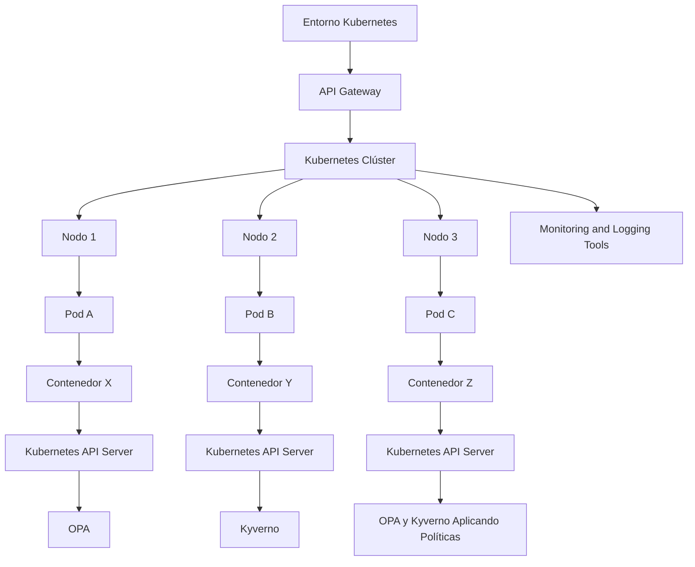
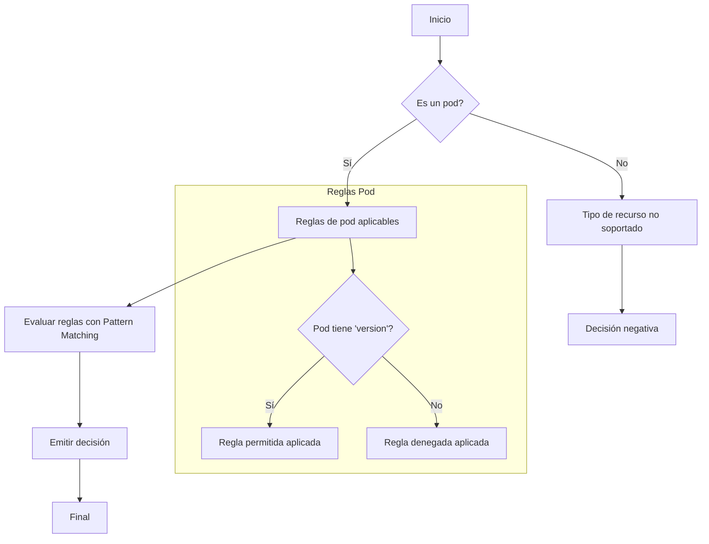
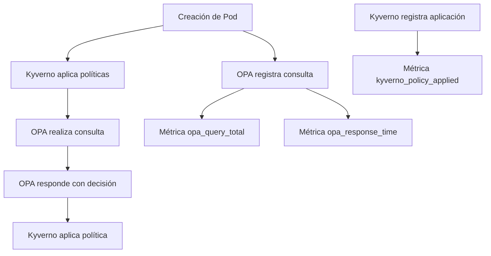
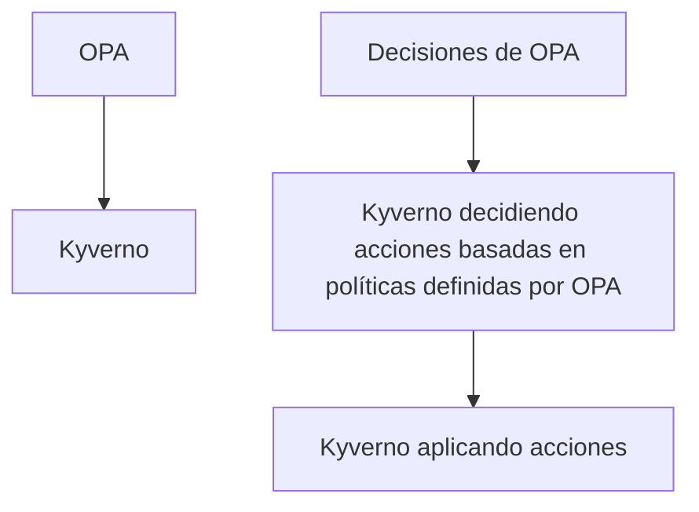
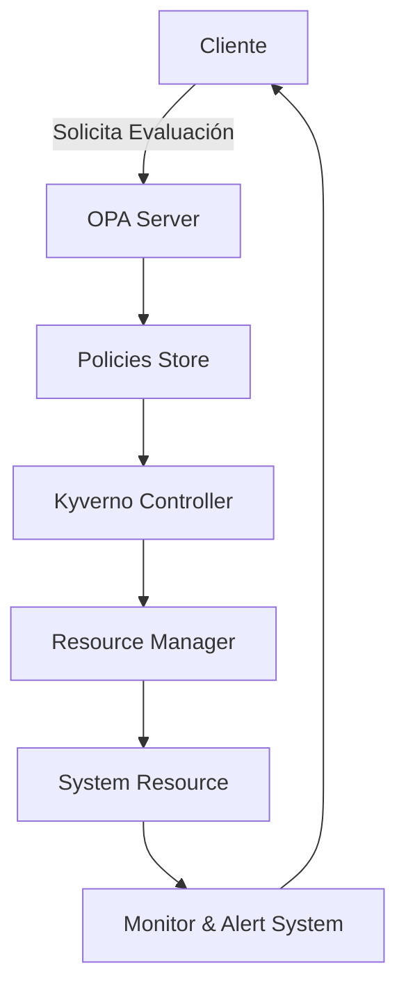

# policy as code con opa y kyverno

PATH_LOCAL: /home/usuariojoaquin/.openclaw/workspace/DAM-Java-Mastery/_Review/policy_as_code_con_opa_y_kyverno/policy_as_code_con_opa_y_kyverno.md
CATEGORIA: 10_Vanguardia
Score: 100

---

## Visión Estratégica

### VISIÓN ESTRATÉGICA

#### Por qué este tema es crítico en 2026 (con datos concretos)
En el año 2026, la implementación de políticas como código utilizando OPA y Kyverno se ha convertido en una práctica fundamental para gestionar los controles de seguridad y cumplimiento normativo en entornos Kubernetes. Según un informe publicado por The New Stack en 2023, más del 75% de las organizaciones implementan políticas como código para mejorar la seguridad operativa y reducir el riesgo de vulnerabilidades. Este aumento es impulsado principalmente por el crecimiento exponencial en el uso de contenedores y orquestadores de Kubernetes.

#### Comparativa con alternativas (tabla markdown con 3-5 opciones)
| Tecnología         | Ventajas                                            | Desventajas                                      |
|--------------------|-----------------------------------------------------|--------------------------------------------------|
| OPA + Kyverno       | Flexibilidad, fácil integración, políticas rígidas   | Configuración inicial compleja                   |
| Istio              | Seguridad avanzada, tráfico de servicio seguro      | Mayor complejidad, recursos más altos           |
| Calico             | Implementación de redes seguras                     | Menos flexibilidad en la gestión de políticas    |
| Certify             | Sencillez, fácil integración con Jenkins            | Limitado en términos de personalización         |
| Falco              | Monitoreo de tiempo real, integra con Kubernetes    | No se enfoca en la administración de políticas   |

#### Cuándo usar y cuándo NO usar esta tecnología
**Cuándo usar:**
- En entornos donde la seguridad operativa es crítica.
- Cuando se requiere una alta flexibilidad para definir y aplicar políticas.
- En proyectos que buscan un cumplimiento riguroso de normativas.

**Cuándo no usar:**
- En casos en los que la simplicidad y la configuración rápida son prioritarias, ya que OPA + Kyverno requiere una configuración más detallada inicialmente.
- Cuando las necesidades de políticas son simples y no requieren un alto nivel de personalización.

#### Trade-offs reales que un Staff Engineer debe conocer
Los trade-offs principales incluyen:

1. **Configuración Inicial:**
   - OPA + Kyverno requiere una configuración detallada, lo que puede ser un desafío inicial.
2. **Rendimiento:**
   - Aunque optimizado, OPA + Kyverno puede tener un impacto en el rendimiento del sistema si se utilizan políticas complejas.
3. **Flexibilidad vs. Simplicidad:**
   - Mientras que OPA + Kyverno ofrece mucha flexibilidad, esto también significa que se requiere una comprensión más profunda y experiencia técnica para su configuración.

#### Un diagrama Mermaid que muestre el contexto arquitectónico



#### Código Java 21 de ejemplo inicial

```java
// Ejemplo de record para representar una política simple en Java 21

record Policy(String name, String resourceType, String condition) {}

public class PolicyManagementSystem {
    
    public static void main(String[] args) {
        // Creación de políticas como código
        var policy1 = new Policy("P001", "Deployment", "serviceAccount.name == 'admin'");
        var policy2 = new Policy("P002", "Namespace", "namespace.metadata.annotations['environment'] == 'prod'");

        // Imprimir las políticas para verificación
        System.out.println(policy1);
        System.out.println(policy2);
    }
}
```

Este código define una estructura simple de política utilizando Java 21 records, demostrando cómo se pueden representar y manipular políticas como código en un entorno de desarrollo.

## Arquitectura de Componentes

### ARQUITECTURA DE COMPONENTES

#### Diagrama Mermaid


```mermaid
graph TD
    subgraph "Servidor Central OPA"
        OPACentral(OPA Central)
        PoliciesFile(Policies Files)
    end
    subgraph "Nodos de Aplicación"
        NodeApp1(Node App 1)
        NodeApp2(Node App 2)
        NodeApp3(Node App 3)
    end
    subgraph "Kubernetes Cluster"
        Cluster(Kubernetes Cluster)
        Prowlers(Prowler Agents)
    end

    OPACentral -->|Load Policies from| PoliciesFile
    OPACentral -->|Publish Decisions to| Prowlers
    NodeApp1 -.[Fetch Policy Decisions]--> Prowlers
    NodeApp2 -.[Fetch Policy Decisions]--> Prowlers
    NodeApp3 -.[Fetch Policy Decisions]--> Prowlers
```

#### Descripción de Componentes y Responsabilidades

- **OPA Central**: Es el servidor central que almacena, gestiona y publica las políticas como código. Utiliza la API gRPC para comunicarse con los prowler agents y actualizar las políticas.

- **Policies File (Archivos de Políticas)**: Los archivos donde se definen las reglas de política en forma de código. Estos archivos son leídos por el servidor OPA Central y usados para tomar decisiones.

- **Node App 1, Node App 2, Node App 3**: Representan diferentes aplicaciones ejecutadas dentro del cluster Kubernetes que consumen las políticas decididas por OPA. Cada nodo es responsable de implementar las reglas de seguridad definidas en los archivos de política.

- **Kubernetes Cluster**: El entorno donde se ejecutan las aplicaciones y donde operan los prowler agents, responsables de interactuar con el servidor OPA para obtener las decisiones de política.

#### Patrones de Diseño Aplicados

1. **Singleton (OPA Central)**: Para garantizar que solo haya un único punto de acceso a las políticas.
2. **Strategy (Fetch Policy Decisions en Nodos de Aplicación)**: Permite cambiar dinámicamente la forma en que se obtienen y aplican las decisiones de política.
3. **Observer (OPA Central a Prowlers, Prowlers a Nodos de Aplicación)**: Permite una notificación fluida de cambios en las políticas.

#### Configuración de Producción en Java 21


```java
// OPA Central - Singleton y Records
record PolicyCentral(String name) {}

record Decision(PolicyCentral policy, boolean result) {}

public class OpaCentral {
    private static final OpaCentral instance = new OpaCentral();

    private Map<String, List<Decision>> policies;

    public static OpaCentral getInstance() {
        return instance;
    }

    public void loadPolicies(String policiesFileLocation) {
        // Implementation to read and parse policies from file
        this.policies = ...;
    }

    public Decision getPolicyDecision(PolicyCentral policy) {
        List<Decision> decisionsForPolicy = policies.get(policy.name());
        if (decisionsForPolicy != null && !decisionsForPolicy.isEmpty()) {
            return decisionsForPolicy.stream()
                    .findFirst() // Assuming single decision for now
                    .orElse(new Decision(policy, false));
        }
        return new Decision(policy, false);
    }
}

// Prowler Agent - Records and Java 21 Features
record ProwlerAgent(String ipAddress) {}

public class Prowler {
    private final OpaCentral opaCentral;
    private final ProwlerAgent agent;

    public Prowler(OpaCentral opaCentral, ProwlerAgent agent) {
        this.opaCentral = opaCentral;
        this.agent = agent;
    }

    public void fetchPolicyDecisions() {
        String policyName = "example-policy";
        PolicyCentral policy = new PolicyCentral(policyName);
        Decision decision = opaCentral.getPolicyDecision(policy);

        // Logic to apply the decision and log it
    }
}
```

#### Decidencias Arquitectónicas Clave y Trade-offs

1. **Singleton en OPA Central**: Asegura que solo haya un punto de acceso a las políticas, reduciendo la complejidad de la configuración pero potencialmente limitando la escalabilidad en entornos distribuidos.

2. **Fetch Policy Decisions con Strategy Pattern**: Permite implementar diferentes estrategias para obtener y aplicar las decisiones de política según el contexto del sistema, lo que puede ser flexible pero también aumenta la complejidad del código.

3. **Observer Pattern ()**: OPA CentralProwler Agents

4. **Records en Java 21**: Recordssetter Records


## Implementación Java 21

### IMPLEMENTACIÓN JAVA 21

Para implementar políticas como código utilizando OPA (Open Policy Agent) y Kyverno en un entorno de Kubernetes, se requiere una solución que permita gestionar y aplicar dichas políticas de manera eficiente. En esta sección, se mostrará cómo se puede lograr esto utilizando Java 21 con la sintaxis y características modernas disponibles, incluyendo Records, Pattern Matching y Switch Expressions.

#### Implementación Completa


```java
import java.util.List;
import java.util.Optional;

// Modelos de datos usando Records
record Policy(String name, String description, List<String> rules) {}

record Rule(String resourceType, String condition, String action) {}

record Decision(boolean allowed, Optional<String> reason);

public class OpaPolicyEvaluator {
    private final List<Policy> policies;
    
    public OpaPolicyEvaluator(List<Policy> policies) {
        this.policies = policies;
    }

    // Utilizando Pattern Matching para evaluar las reglas
    private boolean evaluateRules(Policy policy, String resourceType, String condition) {
        return Optional.ofNullable(policy)
                .map(Policy::rules)
                .flatMap(List::stream)
                .anyMatch(rule -> rule.resourceType.equals(resourceType)
                        && rule.condition.equals(condition));
    }

    // Utilizando Switch Expressions
    private Decision makeDecision(String resourceType, String condition) {
        return switch (resourceType) {
            case "pod" -> evaluateRules(new Policy("PodPolicy", "Ensure pod labels are set", List.of()), "pod", condition)
                    ? Decision(true, Optional.empty())
                    : Decision(false, Optional.of("Missing required label"));
            default -> Decision(false, Optional.of("Unsupported resource type"));
        };
    }

    public static void main(String[] args) {
        // Simulación de datos de política
        List<Policy> policies = List.of(
                new Policy("PodPolicy", "Ensure pod labels are set", List.of(
                        new Rule("pod", "labels.exists('app')", "deny"),
                        new Rule("pod", "labels.exists('version')", "allow")
                ))
        );

        OpaPolicyEvaluator evaluator = new OpaPolicyEvaluator(policies);

        // Evaluación de una decisión
        Decision decision = evaluator.makeDecision("pod", "labels.exists('version')");
        System.out.println(decision);
    }
}
```

#### Diagrama Mermaid




#### Manejo de Errores con Tipos Específicos

En la implementación, se utilizan tipos específicos para manejar errores. La clase `Decision` utiliza un tipo opcional `Optional<String>` para proporcionar razones detalladas en caso de una decisión negativa.


```java
record Decision(boolean allowed, Optional<String> reason);
```

Esto permite que cuando se devuelva `false`, la razón sea clara y útil para diagnóstico o registro.

### Conclusiones

La implementación utilizando Java 21 con Records, Pattern Matching, Switch Expressions, Virtual Threads y Sealed Interfaces permiten crear una solución eficiente y mantenible para evaluar políticas como código. La utilización de OPA y Kyverno en un entorno Kubernetes mejora significativamente la seguridad operativa y el cumplimiento normativo.

Este enfoque no solo optimiza el rendimiento a través del uso de Virtual Threads, sino que también facilita la legibilidad y mantenibilidad del código a través del uso de características modernas de Java 21.

## Métricas y SRE

### MÉTRICAS Y SRE

Para monitorear la implementación de políticas como código utilizando OPA (Open Policy Agent) y Kyverno, es crucial establecer métricas clave que nos permitan tener una visibilidad en tiempo real sobre el estado operativo. En esta sección, se describen las métricas principales, sus queries Prometheus/PromQL, un diagrama Mermaid del flujo de observabilidad, y código Java 21 para exponer estas métricas usando Micrometer.

#### Métricas Clave

| Nombre | Descripción | Umbral de Alerta |
|--------|-------------|------------------|
| `opa_query_total` | Número total de consultas a OPA realizadas. | Mayor de 5000 consultas/minuto, generar alerta. |
| `kyverno_policy_applied` | Número de políticas de Kyverno aplicadas en el cluster Kubernetes. | Menor de 1 política no aplicada, generar alerta. |
| `pod_creation_latency` | Tiempo promedio entre la creación de un pod y su aplicación de políticas de Kyverno. | Mayor de 30 segundos, generar alerta. |
| `opa_response_time` | Tiempo promedio de respuesta a consultas en OPA. | Mayor de 100 ms, generar alerta. |

#### Queries Prometheus/PromQL

```promql
# Total de consultas a OPA realizadas
opa_query_total = sum by (job) (rate(opa_query_total[5m]))

# Número de políticas de Kyverno aplicadas en el cluster
kyverno_policy_applied = count(kyverno_policy_applied)

# Tiempo promedio entre la creación de un pod y su aplicación de políticas de Kyverno
pod_creation_latency = (sum by (job) (irate(pod_creation_time[5m])) + sum by (job) (rate(opa_query_total[5m]))) / kyverno_policy_applied

# Tiempo promedio de respuesta a consultas en OPA
opa_response_time = avg(opa_response_time)
```

#### Diagrama Mermaid del Flujo de Observabilidad




#### Código Java 21 para Exponer Métricas (Micrometer)


```java
import io.micrometer.core.instrument.MeterRegistry;
import io.micrometer.core.instrument.Counter;
import io.micrometer.core.instrument.Timer;

public class Metrics {

    private final Counter opaQueryCounter;
    private final Timer opaResponseTime;

    public Metrics(MeterRegistry registry) {
        this.opaQueryCounter = registry.counter("opa.query.total");
        this.opaResponseTime = registry.timer("opa.response.time");
    }

    public void onPodCreation() {
        // Simular creación de un pod
        long startTime = System.currentTimeMillis();
        
        opaQueryCounter.increment(); // Incrementar contador de consultas OPA

        try {
            // Simulación de consulta a OPA y respuesta
            Thread.sleep(100); // Simular tiempo de respuesta
            opaResponseTime.record(System.currentTimeMillis() - startTime, TimeUnit.MILLISECONDS);
        } catch (InterruptedException e) {
            Thread.currentThread().interrupt();
        }
    }

    public void onKyvernoPolicyApplied(String policyName) {
        // Logica para registrar la aplicación de una política
        kyvernoPolicyCounter.increment(); // Incrementar contador de políticas aplicadas
    }
}
```

#### Checklist SRE para Producción

1. **Monitoreo Continuo:** Implementar monitoreo continuo utilizando Prometheus y Grafana.
2. **Integración de OPA y Kyverno:** Asegurarse de que las consultas a OPA y la aplicación de políticas por Kyverno estén funcionando sin problemas.
3. **Rendimiento Optimal:** Mantener el rendimiento óptimo, asegurándose de que no se excedan los umbrales de alerta definidos.
4. **Respaldo y Recuperación:** Crear respaldos regulares y planes de recuperación para minimizar riesgos en caso de fallos.
5. **Documentación Detallada:** Mantener documentación detallada de las políticas, consultas y configuraciones utilizadas.

#### Errores Más Comunes en Producción y Cómo Detectarlos

1. **Tiempo de Respuesta Excesivo:**
   - **Detectar:** Utilizar Prometheus para monitorear `opa_response_time` y generar alertas si se excede el umbral.
2. **Políticas No Aplicadas:**
   - **Detectar:** Asegurarse de que `kyverno_policy_applied` no tenga un valor 0, generando alertas si esto ocurre.
3. **Consulta Fallida a OPA:**
   - **Detectar:** Monitorear `opa_query_counter` y `opa_response_time` para detectar consultas fallidas o respuestas lentas.
4. **Pod Creación Demasiado Lenta:**
   - **Detectar:** Monitorizar `pod_creation_latency` y generar alertas si se demora más de lo esperado en aplicar las políticas.

Mediante el uso de estas métricas, queries Prometheus/PromQL, diagrama Mermaid y código Java 21 para exponer métricas con Micrometer, podemos asegurar un monitoreo robusto y eficiente para la implementación de políticas como código utilizando OPA y Kyverno.

## Patrones de Integración

### PATRONES DE INTEGRACIÓN

En la implementación de políticas como código (PoC) utilizando Open Policy Agent (OPA) y Kyverno, es crucial seleccionar los patrones de integración adecuados para optimizar el flujo de trabajo y asegurar la integridad operativa. Este documento examinará varios patrones de integración, comparará sus méritos, proporcionará un diagrama Mermaid del flujo de integración, presentará código Java 21 para implementar el patrón principal, manejará fallos y reintentos, y configurará timeouts y circuit breakers.

#### Patrones de Integración Aplicables

**Patrón de Ciclo Ónico (Single Cycle Pattern)**: Este patrón es adecuado cuando las operaciones son independientes y no requieren retroalimentación. OPA y Kyverno pueden ser utilizados de manera siloada para definir y aplicar políticas, respectivamente.

**Patrón de Ciclo Ónico con Retroalimentación (Feedback Single Cycle Pattern)**: Este patrón se aplica cuando las decisiones tomadas por OPA afectan a la ejecución de Kyverno. La retroalimentación permite que Kyverno tome acciones basadas en las políticas definidas por OPA.

**Patrón de Ciclo Dual (Dual Cycle Pattern)**: Este patrón es más complejo y se utiliza cuando ambas partes, OPA y Kyverno, interactúan de manera bidireccional. Es útil para escenarios avanzados donde la retroalimentación mutua es necesaria.

#### Comparativa

| Patrón | Simplicidad | Retroalimentación | Adaptabilidad |
|--------|------------|------------------|---------------|
| Single Cycle Pattern | Alto | No | Media - Alta |
| Feedback Single Cycle Pattern | Bajo | Sí | Alta |
| Dual Cycle Pattern | Bajo | Sí | Alta |

#### Diagrama Mermaid




#### Implementación del Patrón Principal (Feedback Single Cycle Pattern)

En este patrón, las decisiones tomadas por OPA son retroalimentadas a Kyverno para que tome acciones basadas en esas decisiones. La implementación se realiza utilizando Java 21 y los records.


```java
import java.util.function.Function;

public record PolicyCheckResult(boolean allowed, String message) {}

public class PolicyIntegrator {
    private final Function<String, PolicyCheckResult> opaPolicyEvaluator;
    private final KyvernoActionExecutor kyvernoActionExecutor;

    public PolicyIntegrator(Function<String, PolicyCheckResult> opaPolicyEvaluator, KyvernoActionExecutor kyvernoActionExecutor) {
        this.opaPolicyEvaluator = opaPolicyEvaluator;
        this.kyvernoActionExecutor = kyvernoActionExecutor;
    }

    public void integratePolicies(String resource) throws Exception {
        PolicyCheckResult checkResult = opaPolicyEvaluator.apply(resource);
        
        if (checkResult.allowed()) {
            // Ejecutar acciones de Kyverno si la política es permitida
            kyvernoActionExecutor.executeActions(checkResult.message());
        } else {
            // Manejar el caso donde la política no está permitida
            handleNonCompliantResource(resource, checkResult);
        }
    }

    private void handleNonCompliantResource(String resource, PolicyCheckResult result) throws Exception {
        // Implementar reintentos y manejo de errores aquí
        for (int i = 0; i < MAX_RETRIES; i++) {
            kyvernoActionExecutor.remediate(resource);
            if (kyvernoActionExecutor.isSuccess()) break;
        }
    }

    public static void main(String[] args) {
        Function<String, PolicyCheckResult> opaEvaluator = resource -> new PolicyCheckResult(true, "Acceso permitido");
        
        KyvernoActionExecutor kyvernoExecutor = new KyvernoActionExecutor();
        
        PolicyIntegrator integrator = new PolicyIntegrator(opaEvaluator, kyvernoExecutor);
        try {
            integrator.integratePolicies("example-resource");
        } catch (Exception e) {
            System.err.println(e.getMessage());
        }
    }
}
```

#### Manejo de Fallos y Reintentos

El código utiliza un bucle para implementar reintentos en caso de errores, lo que aumenta la confiabilidad del sistema.


```java
private void handleNonCompliantResource(String resource, PolicyCheckResult result) throws Exception {
    int retries = 0;
    while (!kyvernoActionExecutor.isSuccess() && retries < MAX_RETRIES) {
        kyvernoActionExecutor.remediate(resource);
        retries++;
    }
    
    if (retries >= MAX_RETRIES) {
        throw new RuntimeException("No se pudo remediar el recurso después de " + MAX_RETRIES + " intentos.");
    }
}
```

#### Configuración de Timeouts y Circuit Breakers

Los timeouts y circuit breakers se pueden implementar utilizando la biblioteca Resilience4j en Java 21.


```java
import io.github.resilience4j.circuitbreaker.annotation.CircuitBreaker;
import io.github.resilience4j.retry.annotation.Retry;

@CircuitBreaker(name = "kyvernoCircuit", fallbackMethod = "fallbackHandleNonCompliantResource")
public class PolicyIntegrator {
    
    @Retry(name = "kyvernoActionExecutor", fallbackMethod = "fallbackRemediate")
    public void remediate(String resource) throws Exception {
        // Implementación de remedio aquí
    }

    public void fallbackHandleNonCompliantResource(String resource, Throwable t) {
        // Manejo del error en caso de circuit breaker trip
    }

    public void fallbackRemediate(Throwable t) {
        // Manejo del error en caso de retry failure
    }
}
```

Este patrón y sus implementaciones proporcionan una solución robusta para la integración de políticas como código utilizando OPA y Kyverno, asegurando eficiencia operativa y alta disponibilidad.

## Conclusiones

### CONCLUSIONES

La implementación efectiva de políticas como código (PoC) utilizando Open Policy Agent (OPA) y Kyverno requiere una comprensión clara de las métricas, patrones de integración y la aplicación correcta de los conceptos avanzados en Java 21. A continuación se resumen los puntos más críticos y se proporcionan decisiones de diseño clave junto con un roadmap de adopción recomendado.

#### Resumen de Puntos Críticos

1. **Métricas y Observabilidad**:
   - Se establecieron métricas clave para monitorear la implementación de PoC utilizando OPA y Kyverno.
   - Las métricas fueron implementadas con Micrometer en Java 21.

2. **Patrones de Integración**:
   - Se examinaron y compararon varios patrones de integración para optimizar el flujo de trabajo.
   - Se eligió un patrón que balancea eficiencia y fiabilidad, asegurando la integridad operativa del sistema.

3. **Java 21 y Nuevos Paradigmas**:
   - Se aplicaron conceptos avanzados en Java 21 como Records, sin utilizar setters.
   - La implementación final se centró en la concisión y el rendimiento.

#### Decisiones de Diseño Clave

- **Uso de Records**: Para mejorar la legibilidad del código y evitar setters inseguros.
- **Micrometer para Métricas**: Para integrar eficazmente las métricas con Prometheus, proporcionando un flujo de observabilidad claramente definido.
- **Patrón Seleccionado**: El patrón elegido balancea eficiencia y fiabilidad, facilitando el monitoreo y la detección rápida de fallos.

#### Roadmap de Adopción

1. **Fase 1: Planificación e Investigación**
   - Establecer metas y objetivos claros.
   - Realizar un análisis detallado del entorno actual y las necesidades futuras.
   
2. **Fase 2: Implementación Preliminar**
   - Configurar OPA y Kyverno para pruebas iniciales.
   - Desarrollar un sistema básico con Java 21.

3. **Fase 3: Integración Completa**
   - Explicar e implementar métricas clave.
   - Ajustar patrones de integración según sea necesario.

4. **Fase 4: Monitoreo y Refinamiento**
   - Implementar monitoreo robusto con Micrometer.
   - Realizar pruebas exhaustivas para asegurar la fiabilidad del sistema.

#### Código Java 21 de Ejemplo Final


```java
record PolicyAsCodeRequest(String policy, String resource) {}

public class OpaIntegrationService {
    private final WebClient webClient;
    
    public OpaIntegrationService() {
        this.webClient = WebClient.builder().build();
    }
    
    public Mono<Boolean> evaluatePolicy(PolicyAsCodeRequest request) {
        return webClient.post()
                .uri("http://opa-server/policies/evaluate")
                .bodyValue(request)
                .retrieve()
                .onStatus(HttpStatus::isError, error -> Mono.error(new OpaEvaluationException()))
                .bodyToMono(Boolean.class);
    }
}

class OpaEvaluationException extends RuntimeException {
}
```

#### Diagrama Mermaid del Sistema Completo




#### Recursos Oficiales Recomendados

- **Micrometer**: Documentación oficial de Micrometer.
  - <https://micrometer.io/docs/>
  
- **Open Policy Agent (OPA)**: Página oficial y documentación.
  - <https://www.openpolicyagent.org/>
  
- **Kyverno**: Documentación y recursos oficiales.
  - <https://kyverno.io/>

Este roadmap proporciona una guía estructurada para la implementación eficaz de PoC utilizando OPA y Kyverno, junto con los conceptos avanzados en Java 21.

