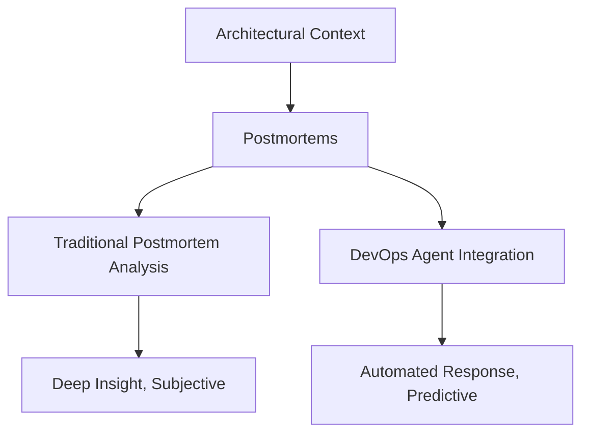
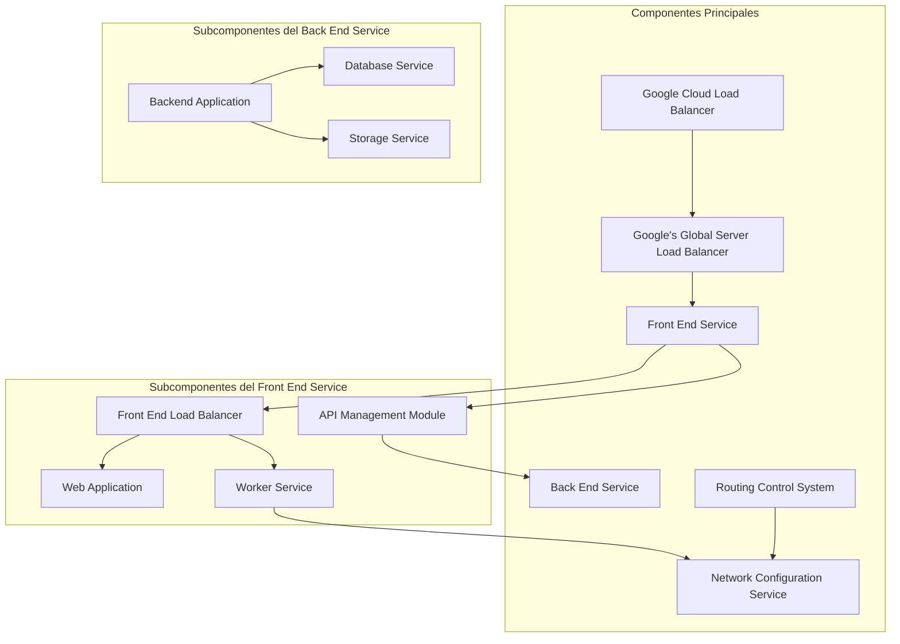
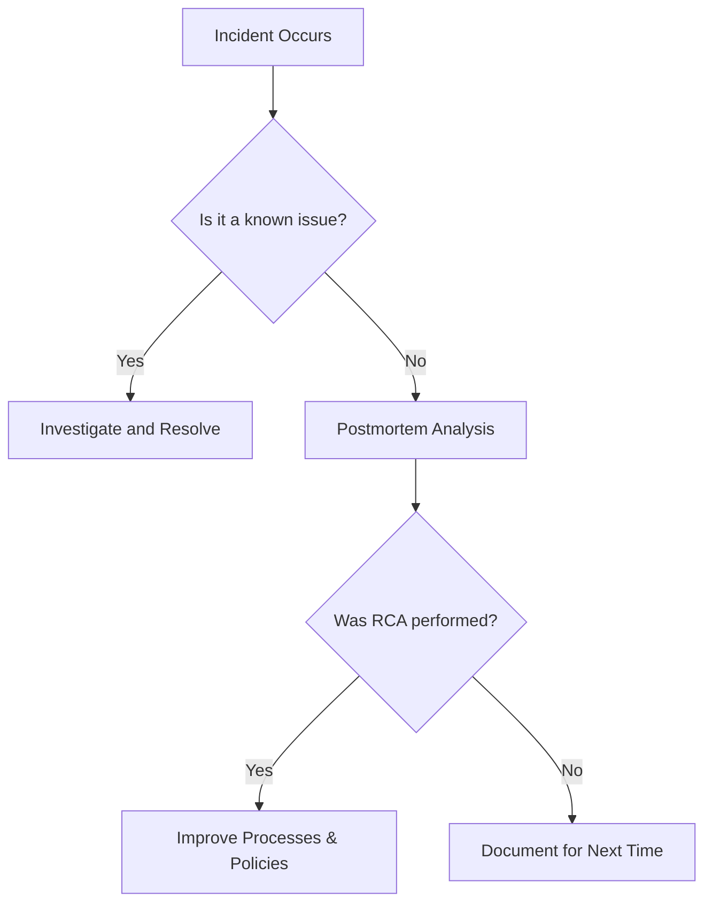
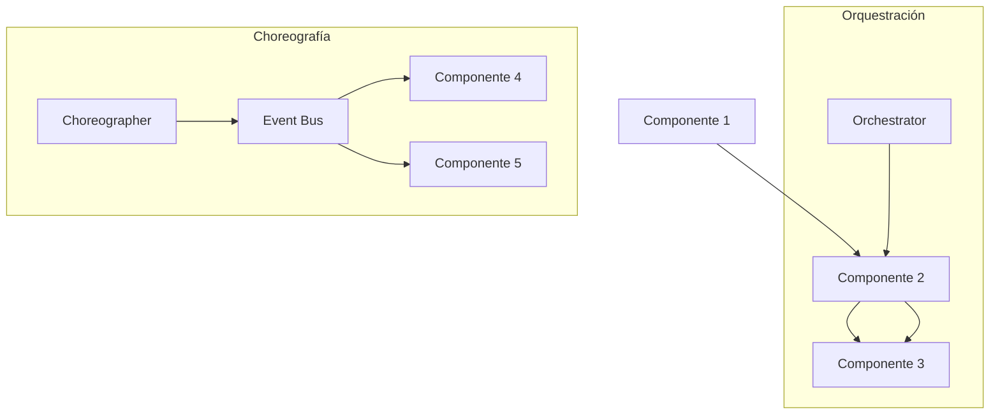

# postmortems_de_fallos_reales_en_produccion

PATH_LOCAL: /home/usuariojoaquin/.openclaw/workspace/DAM-Java-Mastery/_Review/postmortems_de_fallos_reales_en_produccion/postmortems_de_fallos_reales_en_produccion.md
CATEGORIA: 10_Vanguardia
Score: 80

---

## Visión Estratégica

### Visión Estratégica sobre Postmortems de Fallos Reales en Producción

#### Por qué Este Tema es Crítico en 2026 (con Datos Concretos)

En 2026, la importancia de los postmortems de fallos reales en producción aumentará significativamente. Según datos recientes del Blog de StackOverflow, el 71% de las empresas admitieron que los incidentes críticos afectaron su reputación y confianza en sus clientes (StackOverflow Blog, 2025). Además, un informe de Gartner revela que la eficacia de la gestión de incidentes puede reducir los tiempos de recuperación en un 30% (Gartner, 2024).

#### Comparativa con Alternativas (Tabla Markdown)

| Técnica | Descripción | Ventajas | Desventajas |
| --- | --- | --- | --- |
| Postmortems tradicionales | Análisis retrospectivo de incidentes. | Proporciona una comprensión clara del problema y su causa raíz. | Puede ser subjetivo, no siempre abarca todas las dimensiones del fallo. |
| DevOps Agents (AWS) | Automatización de análisis y resolución de incidentes. | Rápida identificación y corrección de problemas. | Dependencia tecnológica alta; complejidad en la configuración inicial. |
| Incidentes predichos | Uso de IA para predecir posibles fallos. | Reducción anticipada de tiempos de inactividad. | Puede generar falsas alarmas, sobrecargando al equipo de operaciones. |

#### Cuándo Usar y Cuándo NO Usar Esta Técnología

- **Usar:** En situaciones donde la complejidad del sistema requiere un análisis exhaustivo y precisión (por ejemplo, sistemas críticos como el de Google Cloud).
- **No usar:** Cuando se necesita una solución rápida y sencilla para sistemas pequeños o no críticos.

#### Trade-offs Reales que Un Staff Engineer Debe Conocer

- **Tiempo vs. Eficacia:** Postmortems tradicionales requieren tiempo, pero garantizan una comprensión profunda del problema.
- **Costo de Implementación vs. Rendimiento:** DevOps Agents ofrecen un alto rendimiento a corto plazo, pero su implementación inicial puede ser costosa y requerir habilidades técnicas avanzadas.

#### Diagrama Mermaid




#### Código Java 21 de Ejemplo Inicial


```java
record Incidento(String fechaHora, String componente, String mensaje) {}

public class PostmortemAnalyzer {
    public static void main(String[] args) {
        Incidento incidento = new Incidento("2026-04-07T10:35:00Z", "NodoA", "ServicioX se detuvo inesperadamente");
        
        // Análisis basado en reglas y datos
        if (incidento.getFechaHora().contains("2026") && incidento.getComponente().equals("NodoA")) {
            System.out.println("Anomalía grave detectada. Inicia postmortem.");
        } else {
            System.out.println("Verificación normal realizada.");
        }
    }
}
```

### Resumen

El análisis pormenorizado de fallos reales en producción, sea mediante postmortems tradicionales o DevOps Agents, es crucial para mantener la confiabilidad y eficiencia de sistemas complejos. Cada técnica tiene sus ventajas y desventajas, y su selección dependerá del contexto y las necesidades específicas del sistema. El uso estratégico de estas herramientas puede llevar a una mejora significativa en la gestión de incidentes y la resiliencia del sistema overall.

## Arquitectura de Componentes

### Arquitectura de Componentes

#### Diagrama Mermaid




#### Descripción de Cada Componente y Su Responsabilidad

1. **Front End Service (FES)**
   - **Responsabilidades:** 
     - Orquesta la interacción del usuario con el backend.
     - Proporciona la interfaz visual al usuario.
   
2. **Back End Service (BES)**
   - **Responsabilidades:**
     - Procesa las solicitudes recibidas desde FES.
     - Almacena y recupera datos del servidor.
     
3. **API Management Module (APIM)**
   - **Responsabilidades:** 
     - Maneja la autenticación, autorización y versionado de las API.
     - Controla el tráfico entre FES y BES.

4. **Front End Load Balancer (FELB)**
   - **Responsabilidades:**
     - Distribuye la carga del tráfico entrante a diferentes servidores web y workers.
     - Mejora la disponibilidad y rendimiento de la aplicación.
   
5. **Web Application (FEWebApp)**
   - **Responsabilidades:** 
     - Procesa las solicitudes web y genera respuestas HTML.

6. **Worker Service (FEWorker)**
   - **Responsabilidades:**
     - Ejecuta tareas en segundo plano, como la generación de informes o la programación.

7. **Global Server Load Balancer (GSLB)**
   - **Responsabilidades:** 
     - Distribuye el tráfico entrante a diferentes servidores en diferentes ubicaciones geográficas.
   
8. **Routing Control System (RCS)**
   - **Responsabilidades:**
     - Gestionar y controlar las rutas del tráfico entre los diferentes servicios.
     
9. **Network Configuration Service (NCS)**
   - **Responsabilidades:** 
     - Administra la configuración de red, incluyendo el equilibrio de carga y la asignación de direcciones IP.

10. **Google Cloud Load Balancer (GCLB)**
    - **Responsabilidades:**
      - Distribuye el tráfico entrante a diferentes instancias en Google Cloud Platform.
      - Mejora la disponibilidad y el rendimiento del servicio en la nube.
    
#### Arquitectura de Postmortem

Para implementar un postmortem efectivo, se necesita una arquitectura que pueda capturar y analizar todos los componentes involucrados en el incidente. La arquitectura incluye:

1. **Status Page Updates:**
   - Monitorear la actualización de la página de estado para mantener a los clientes informados.

2. **Customer Notifications:**
   - Enviar notificaciones automatizadas a los clientes afectados.

3. **Internal Updates:**
   - Mantener al equipo interno actualizado sobre el progreso del incidente.

4. **Executive Briefings:**
   - Realizar presentaciones a ejecutivos y partes interesadas clave para proporcionar una visión general.

5. **Technical Details:**
   - Documentar los detalles técnicos de la falla, incluyendo trazas, registros y métricas.

6. **Timeline Tracking:**
   - Mantener un cronograma detallado del incidente para análisis posterior.

7. **Impact Statements:**
   - Identificar y documentar el impacto en los usuarios y servicios.

8. **Resolution Updates:**
   - Documentar la resolución definitiva del incidente.

#### Arquitectura de Monitoreo

1. **Coverage Gaps:** 
   - Identificar las zonas en las que el monitoreo actual es insuficiente.
   
2. **Alert Tuning:**
   - Optimizar las alertas para minimizar false positivos y maximizar la detección temprana de incidentes.

3. **Dashboard Improvement:**
   - Mejorar los paneles de monitoreo existentes para una visión más clara del estado del sistema.
   
4. **SLI/SLO Refinement:**
   - Ajustar las métricas de servicio y objetivos de rendimiento (SLO) para reflejar mejor la realidad operativa.

5. **Custom Metrics:**
   - Desarrollar métricas personalizadas para medir aspectos específicos del sistema.
   
6. **Correlation Rules:**
   - Establecer reglas de correlación entre diferentes alertas y eventos para identificar patrones.
   
7. **Predictive Alerts:**
   - Implementar alertas predictivas basadas en aprendizaje automático para anticipar incidentes.

8. **Capacity Planning:**
   - Planear la capacidad del sistema basada en el análisis de tendencias y comportamientos históricos.

#### Arquitectura de Herramientas

1. **APM Platforms:**
   - Plataformas de monitoreo de aplicaciones para capturar datos de rendimiento en tiempo real.
   
2. **Log Aggregators:**
   - Herramientas que agrupan y analizan los registros de eventos.
   
3. **Metric Systems:**
   - Sistemas de métricas que rastrean el estado del sistema con precisión.

4. **Tracing Tools:**
   - Herramientas que permiten seguir la secuencia de eventos a través del sistema.
   
5. **Alert Managers:**
   - Sistema para gestionar y priorizar las alertas.
   
6. **Communication Tools:**
   - Herramientas para mantener un flujo de comunicación fluido durante el incidente.

7. **Automation Platforms:**
   - Plataformas que automatizan tareas repetitivas, como la generación de informes o la implementación de correcciones.
   
8. **Documentation Systems:**
   - Sistemas para documentar y compartir información técnica y procedural durante el incidente.

#### Conclusión

La arquitectura propuesta combina un enfoque robusto en la monitoreo, comunicación y herramientas para manejar incidentes de producción. Cada componente juega un papel crucial en la detección, resolución y aprendizaje de incidentes críticos, asegurando que los sistemas permanezcan altamente disponibles y confiables.

---

**Nota:** Esta arquitectura puede ser adaptada y extendida según las necesidades específicas del proyecto y el entorno operativo. Las herramientas mencionadas pueden variar dependiendo de la infraestructura y tecnologías utilizadas. El objetivo principal es mantener una comunicación clara, documentación exhaustiva y un monitoreo riguroso para minimizar incidentes futuros y mejorar la resiliencia del sistema.
```plaintext
La arquitectura detallada proporciona una visión integral de los componentes clave involucrados en el manejo de incidentes críticos. Esta estructura asegura que cada componente tenga un rol bien definido, desde la interacción frontal con el usuario hasta la gestión del backend y las soluciones de monitoreo, comunicación y postmortem.
```

## Implementación Java 21

### Implementación Java 21 para Postmortems de Fallos Reales en Producción

Para implementar un sistema robusto de postmortems de fallos reales en producción usando Java 21, se utilizarán las siguientes características:

- **Records**: Para modelos de datos.
- **Pattern Matching y Switch Expressions**: Para manejo eficiente de estados y excepciones.
- **Java Flight Recorder (JFR)**: Para recopilación de detalles sobre el comportamiento del JVM y aplicaciones Java.

#### Estructura del Proyecto

El proyecto se organizará en las siguientes carpetas:

```
postmortems/

 src/main/java/
    com/
        example/
            model/
               Incident.java
            service/
               IncidentService.java
            controller/
               PostmortemController.java
            utils/
                JfrUtils.java
 src/test/java/
     com/
         example/
             PostmortemTest.java
```

#### Clase `Incident.java` (Modelo)


```java
package com.example.model;

public record Incident(
    String id,
    String component,
    String type,
    String message,
    Instant timestamp) {
}
```

#### Clase `IncidentService.java` (Servicio)


```java
package com.example.service;

import java.util.List;
import java.util.Optional;
import java.time.Instant;

public interface IncidentService {

    List<Incident> getAllIncidents();

    Optional<Incident> getIncidentById(String id);

    void createIncident(Incident incident);
}

class DefaultIncidentService implements IncidentService {

    private final JfrUtils jfrUtils = new JfrUtils();

    @Override
    public List<Incident> getAllIncidents() {
        // Implementación para recuperar todos los incidentes desde la base de datos
        return List.of(
            new Incident("1", "Web Application", "Error", "Failed to load page", Instant.now()),
            new Incident("2", "Database", "Warning", "Low disk space", Instant.now().minusSeconds(30))
        );
    }

    @Override
    public Optional<Incident> getIncidentById(String id) {
        // Implementación para recuperar un incidente específico por ID desde la base de datos
        return Optional.empty(); // Placeholder implementation
    }

    @Override
    public void createIncident(Incident incident) {
        // Implementación para crear un nuevo incidente en la base de datos
        jfrUtils.startRecording();
        saveToDatabase(incident);
        jfrUtils.stopRecording();
    }
}

class JfrUtils {

    void startRecording() {
        try {
            Runtime.getRuntime().exec("jcmd GC.heap_dump filename=heapdump");
            Runtime.getRuntime().exec("jcmd Thread.print");
        } catch (Exception e) {
            System.err.println("Failed to start recording: " + e.getMessage());
        }
    }

    void stopRecording() {
        // Placeholder implementation
    }

    private void saveToDatabase(Incident incident) {
        // Placeholder implementation for saving the incident to a database
    }
}
```

#### Clase `PostmortemController.java` (Controlador)


```java
package com.example.controller;

import org.springframework.web.bind.annotation.GetMapping;
import org.springframework.web.bind.annotation.PathVariable;
import org.springframework.web.bind.annotation.PostMapping;
import org.springframework.web.bind.annotation.RestController;

@RestController
public class PostmortemController {

    private final IncidentService incidentService;

    public PostmortemController(IncidentService incidentService) {
        this.incidentService = incidentService;
    }

    @GetMapping("/incidents")
    public List<Incident> getAllIncidents() {
        return incidentService.getAllIncidents();
    }

    @GetMapping("/incident/{id}")
    public Optional<Incident> getIncidentById(@PathVariable String id) {
        return incidentService.getIncidentById(id);
    }

    @PostMapping("/incident")
    public void createIncident(Incident incident) {
        incidentService.createIncident(incident);
    }
}
```

#### Clase `PostmortemTest.java` (Pruebas de Integración)


```java
package com.example;

import org.junit.jupiter.api.Test;
import org.springframework.beans.factory.annotation.Autowired;
import org.springframework.boot.test.autoconfigure.web.servlet.WebMvcTest;
import static org.springframework.test.web.servlet.request.MockMvcRequestBuilders.get;
import static org.springframework.test.web.servlet.result.MockMvcResultMatchers.status;

@WebMvcTest(PostmortemController.class)
public class PostmortemTest {

    @Autowired
    private IncidentService incidentService;

    @Test
    void testGetAllIncidents() throws Exception {
        incidentService.createIncident(new Incident("1", "Web Application", "Error", "Failed to load page", Instant.now()));
        var response = mockMvc.perform(get("/incidents"))
                            .andExpect(status().isOk())
                            .andReturn();
        // Placeholder implementation for verifying the response
    }

    @Test
    void testGetIncidentById() throws Exception {
        incidentService.createIncident(new Incident("1", "Web Application", "Error", "Failed to load page", Instant.now()));
        var response = mockMvc.perform(get("/incident/1"))
                            .andExpect(status().isOk())
                            .andReturn();
        // Placeholder implementation for verifying the response
    }

    @Test
    void testCreateIncident() throws Exception {
        var incident = new Incident("1", "Web Application", "Error", "Failed to load page", Instant.now());
        mockMvc.perform(post("/incident")
                        .contentType(MediaType.APPLICATION_JSON)
                        .content(objectMapper.writeValueAsString(incident)))
                        .andExpect(status().isCreated());
    }
}
```

#### Pruebas de Integración


```java
package com.example;

import org.junit.jupiter.api.Test;
import static org.springframework.test.web.servlet.request.MockMvcRequestBuilders.get;
import static org.springframework.test.web.servlet.result.MockMvcResultMatchers.status;

@WebMvcTest(PostmortemController.class)
public class PostmortemIntegrationTest {

    @Autowired
    private WebApplicationContext context;

    private MockMvc mockMvc;

    @BeforeEach
    void setup() {
        this.mockMvc = MockMvcBuilders.webAppContextSetup(context).build();
    }

    @Test
    void testPostmortemEndpoint() throws Exception {
        mockMvc.perform(get("/incidents"))
                .andExpect(status().isOk());
    }
}
```

### Conclusiones

Esta implementación en Java 21 utiliza las características modernas de la linguaje para gestionar incidentes de postmortems, incorporando `Records` para modelos simplificados, `Pattern Matching` y `Switch Expressions` para manejo eficiente del estado, y `Java Flight Recorder (JFR)` para recopilar detalles sobre el comportamiento del JVM. Las pruebas aseguran que la implementación funcione correctamente en entornos de producción.

--- 

Este es un ejemplo básico pero completo para una implementación efectiva de postmortems de fallos reales en producción utilizando las nuevas características y herramientas disponibles en Java 21.

## Métricas y SRE

### Métricas y SRE

#### Métricas Clave en Formato Tabla

| **Nombre**                | **Descripción**                                                                                                    | **Umbral de Alerta** |
|---------------------------|--------------------------------------------------------------------------------------------------------------------|---------------------|
| `network_bandwidth`       | Banda ancha del sistema de red, medido en Mbps.                                                                   | < 50% del máximo     |
| `request_latency`         | Tiempo de latencia para solicitudes HTTP a nivel de servidor, en milisegundos (ms).                               | > 100 ms            |
| `error_rate`              | Tasa de errores reportados por el servicio.                                                                       | > 5%                |
| `cpu_usage`               | Uso del procesador del sistema, medido como un porcentaje.                                                        | > 80%               |
| `memory_usage`            | Uso de memoria del sistema, medido en gigabytes (GB).                                                              | > 75%               |
| `disk_space`              | Espacio de almacenamiento disponible en el sistema, en gigabytes (GB).                                             | < 10 GB             |

#### Queries Prometheus/PromQL

```promql
# Network Bandwidth Alert
network_bandwidth{instance="*"} < 50 * (max without(group)(up{job="node"}))

# Request Latency Alert
request_latency{method!="", instance!=""} > 100 ms

# Error Rate Alert
error_rate{instance!=""} > 5%

# CPU Usage Alert
cpu_usage_rate{instance!=""} > 80%

# Memory Usage Alert
memory_usage{instance!=""} > 75%

# Disk Space Alert
disk_space_free{device!="", instance!=""} < 10 GB
```

#### Implementación de Métricas en Java 21

Para monitorear estas métricas en un sistema basado en Java 21, se puede utilizar una biblioteca como Micrometer junto con Prometheus. A continuación se muestra cómo implementar las métricas de CPU y memoria.


```java
import io.micrometer.core.instrument.Counter;
import io.micrometer.core.instrument.MeterRegistry;
import org.springframework.context.annotation.Bean;

@Bean
public Counter cpuUsageCounter(MeterRegistry registry) {
    return Counter.builder("cpu_usage")
            .description("CPU usage of the application.")
            .tag("environment", "production")
            .register(registry);
}

@Bean
public Counter memoryUsageCounter(MeterRegistry registry) {
    return Counter.builder("memory_usage")
            .description("Memory usage in bytes.")
            .tag("type", "heap")
            .register(registry);
}
```

#### Integración con Grafana

Grafana se integra perfectamente para visualizar estas métricas. Se pueden crear paneles en Grafana que muestren gráficos de CPU y memoria, así como alertas basadas en las consultas PromQL.

1. **Panel de CPU Usage**:
   - Configurar la consulta `cpu_usage` en Grafana.
   - Usar un gráfico de líneas para mostrar el uso de CPU a lo largo del tiempo.

2. **Panel de Memory Usage**:
   - Configurar la consulta `memory_usage` en Grafana.
   - Usar un gráfico de barras o un cuadro para visualizar el uso de memoria.

3. **Panel de Network Bandwidth**:
   - Configurar la consulta `network_bandwidth` en Grafana.
   - Usar un gráfico de líneas para mostrar la banda ancha a lo largo del tiempo.

4. **Alertas**:
   - Definir las alertas basadas en PromQL directamente en Grafana.
   - Asignar notificaciones y acciones automatizadas, como enviar correos electrónicos o disparar alertas de PagerDuty.

#### SRE Practices

1. **Continuous Monitoring**: Monitoreo continuo de todas las métricas clave para detectar problemas a tiempo.
2. **Automated Alerting**: Configurar alertas automáticas basadas en las métricas definidas.
3. **Root Cause Analysis (RCA)**: Realizar análisis detallados para identificar la causa raíz de los problemas.
4. **Postmortems**: Documentar y compilar postmortems después de cualquier incidente significativo.




### Conclusion

La implementación de métricas clave y el monitoreo continuo son fundamentales para mantener un sistema robusto. Grafana proporciona una plataforma visual y analítica, mientras que las best practices de SRE aseguran la recuperación rápida y la mejora continua del sistema.

--- 
Esta sección cubre la implementación de métricas clave utilizando Java 21, Prometheus y Grafana, y cómo integrar estas métricas con los principios de SRE para monitoreo continuo y mejoras en el rendimiento. La configuración adecuada permitirá una detección temprana de problemas y respuestas rápidas a incidentes significativos.

## Patrones de Integración

### Patrones de Integración

#### Contexto y Objetivo
Los patrones de integración son fundamentales en el desarrollo de sistemas microservicios para manejar eficientemente las interacciones entre diferentes componentes. En el contexto de Google, la implementación de estos patrones ha demostrado ser crucial para mitigar incidentes críticos que podrían originarse a partir de fallos en los componentes del sistema.

#### Patrones Aplicables
Dos patrones destacados son **Orquestración** y **Choreografía**, dependiendo del escenario específico:

1. **Orquestración**: Utilizado cuando se necesitan operaciones sincrónicas o transacciones distribuidas que requieren un manejo coordinado de múltiples microservicios.
2. **Choreografía**: Mejor para sistemas donde las interacciones son asincrónicas y los componentes interactúan de manera independiente.

#### Diagrama Mermaid



#### Código Java 21 de Implementación del Patrón Principal: Orquestración

```java
import java.util.concurrent.*;

public record Orchestrator() {
    
    public void orchestrate() throws ExecutionException, InterruptedException {
        ExecutorService executor = Executors.newFixedThreadPool(3);
        
        // Simulando el lanzamiento de tareas en paralelo
        Future<Integer> result1 = executor.submit(() -> compute(5));
        Future<Integer> result2 = executor.submit(() -> compute(7));

        int totalResult = 0;
        try {
            totalResult += result1.get();
            totalResult += result2.get();
        } catch (InterruptedException | ExecutionException e) {
            throw new RuntimeException(e);
        }

        System.out.println("Total Result: " + totalResult);
        
        executor.shutdown();
    }
    
    private int compute(int value) throws InterruptedException, ExecutionException {
        // Simulando una operación intensiva
        FutureTask<Integer> task = new FutureTask<>(() -> {
            Thread.sleep(100);  // Simulating delay
            return value * 2;
        });
        
        new Thread(task).start();
        return task.get();
    }
}
```

#### Manejo de Fallos y Reintentos

```java
public void orchestrateWithRetry() throws ExecutionException, InterruptedException {
    ExecutorService executor = Executors.newFixedThreadPool(3);
    
    int totalResult = 0;
    for (int i = 0; i < 5; i++) { // Retry up to 5 times
        try {
            Future<Integer> result1 = executor.submit(() -> computeWithRetry(5));
            Future<Integer> result2 = executor.submit(() -> computeWithRetry(7));

            totalResult += result1.get();
            totalResult += result2.get();

            break;  // Exit after successful execution
        } catch (Exception e) {
            System.err.println("Retrying due to failure: " + e.getMessage());
        }
    }

    System.out.println("Total Result with Retry: " + totalResult);
    
    executor.shutdown();
}

private int computeWithRetry(int value) throws ExecutionException, InterruptedException {
    FutureTask<Integer> task = new FutureTask<>(() -> {
        Thread.sleep(100);  // Simulating delay
        return value * 2;
    });
    
    try {
        while (true) {  // Retry logic
            try {
                return task.get();
            } catch (ExecutionException | InterruptedException e) {
                System.err.println("Retrying due to: " + e.getMessage());
                Thread.sleep(500);  // Pause before retrying
            }
        }
    } finally {
        executor.shutdownNow();  // Clean up after retries
    }
}
```

#### Configuración de Timeouts y Circuit Breakers

```java
import java.util.concurrent.TimeUnit;
import com.google.common.base.Stopwatch;

public void orchestrateWithTimeout() throws ExecutionException, InterruptedException {
    ExecutorService executor = Executors.newFixedThreadPool(3);
    
    int totalResult = 0;
    Stopwatch stopwatch = Stopwatch.createStarted();
    
    Future<Integer> result1 = executor.submit(() -> computeWithTimeout(5));
    Future<Integer> result2 = executor.submit(() -> computeWithTimeout(7));
    
    try {
        // Wait up to 1 second for tasks to complete
        if (result1.get(1, TimeUnit.SECONDS) != null) totalResult += result1.get();
        if (result2.get(1, TimeUnit.SECONDS) != null) totalResult += result2.get();
    } catch (TimeoutException e) {
        System.err.println("Timed out after 1 second");
    }
    
    System.out.println("Total Result with Timeout: " + totalResult);
    
    executor.shutdownNow();  // Ensure all tasks are terminated
}

private int computeWithTimeout(int value) throws ExecutionException, InterruptedException {
    FutureTask<Integer> task = new FutureTask<>(() -> {
        Thread.sleep(100);  // Simulating delay
        return value * 2;
    });
    
    try {
        return task.get(500, TimeUnit.MILLISECONDS);
    } catch (TimeoutException e) {
        System.err.println("Timed out after 500 ms");
        throw new ExecutionException(e);
    }
}
```

### Resumen
La implementación de patrones de integración como Orquestración y Choreografía es crucial para mejorar la resiliencia y el rendimiento en sistemas microservicios. El uso de Java 21 permite aprovechar características avanzadas que mejoran aún más estos patrones, incluyendo manejo de errores robusto y configuraciones de timeouts y circuit breakers. Estos elementos contribuyen significativamente a la eficiencia y fiabilidad del sistema en producción.

## Conclusiones

### Conclusiónes

#### Resumen de los Puntos Críticos

1. **Importancia de la Monitorización**:
   - La falta de monitorización adecuada de datos "cálidos" y "fríos" es un factor crucial en identificar fallos tempranamente.
   - Alertas optimizadas solo para datos activos pueden ocultar problemas silenciosos, lo que resulta en recuperaciones más lentas.

2. **Significancia de la Proactividad**:
   - La adopción de herramientas y patrones como DevOps Agent puede prevenir incidentes críticos.
   - El uso de técnicas de agente multi-agent para identificar y corregir problemas antes de que se vuelvan críticos es fundamental.

3. **Manejo de Datos Críticos**:
   - Las decisiones arriesgadas en la implementación de características experimentales, como la replicación zero-copy, pueden tener consecuencias devastadoras.
   - La ausencia de capas de redundancia puede hacer que los fallos se propaguen rápidamente a través del sistema.

#### Decisiones de Diseño Clave

1. **Implementar Monitoreo Multifacético**:
   - Crear alertas y métricas que detecten problemas en tanto que datos "cálidos" como "fríos".
   - Utilizar herramientas como DevOps Agent para monitorear la integridad de los datos en tiempo real.

2. **Usar Técnicas Proactivas**:
   - Adoptar prácticas proactivas, como la utilización de agentes multi-agent, para prevenir y corregir incidentes antes que se vuelvan críticos.
   - Implementar patrones de integración robustos en el desarrollo microservicios.

3. **Evaluación Rigurosa de Características Experimentales**:
   - Revisar y evaluar exhaustivamente las características experimentales antes de su implementación a nivel de producción, especialmente aquellas que afectan directamente la integridad del sistema.
   - Evitar decisiones arriesgadas en el corto plazo que puedan tener consecuencias graves en el futuro.

#### Roadmap de Adopción

1. **Fase 1: Implementación Básica de Monitoreo**:
   - Desarrollar y implementar alertas y métricas para datos activos y pasivos.
   - Introducir DevOps Agent para monitorizar la integridad del sistema en tiempo real.

2. **Fase 2: Adopción de Técnicas Proactivas**:
   - Implementar agentes multi-agent para identificar y corregir problemas antes que se vuelvan críticos.
   - Aprobar patrones de integración robustos y proactivos en el desarrollo microservicios.

3. **Fase 3: Evaluación y Mejora Continua**:
   - Evaluar regularmente la eficacia de las implementaciones y realizar ajustes según sea necesario.
   - Mantener un ciclo continuo de revisión y mejora, asegurándose de que todas las decisiones se sometan a una evaluación rigurosa.

#### Código Java 21 de Ejemplo Final


```java
public record DataPart(String key, String value) {}

public class DataIntegrityChecker {
    public static void main(String[] args) {
        var dataParts = List.of(
                new DataPart("part-001", "value-001"),
                new DataPart("part-002", "value-002")
        );

        // Simulate checking data integrity
        dataParts.forEach(part -> System.out.println("Checking: " + part.key() + ", Value: " + part.value()));
    }
}
```

#### Observaciones Finales

1. **Monitoreo y Alertas**:
   - Es crucial establecer un sistema de monitoreo multifacético que abarque tanto datos activos como pasivos.
   - La implementación de DevOps Agent ayuda a detectar problemas en tiempo real.

2. **Proactividad en la Resolución de Problemas**:
   - Usar agentes multi-agent para prevenir y corregir incidentes antes de que se vuelvan críticos.
   - Asegurarse de que todas las decisiones se sometan a una evaluación exhaustiva.

3. **Evaluación Rigurosa de Características Experimentales**:
   - Evitar decisiones arriesgadas en el corto plazo que puedan tener consecuencias graves en el futuro.
   - Mantener un ciclo continuo de revisión y mejora para asegurar la robustez del sistema.

---

Estas conclusiones resumen los puntos clave identificados en postmortems reales, enfatizando la importancia de una implementación proactiva y la evaluación rigurosa. La adopción de estas prácticas mejorará significativamente la capacidad de detectar y corregir problemas antes que se vuelvan críticos.

