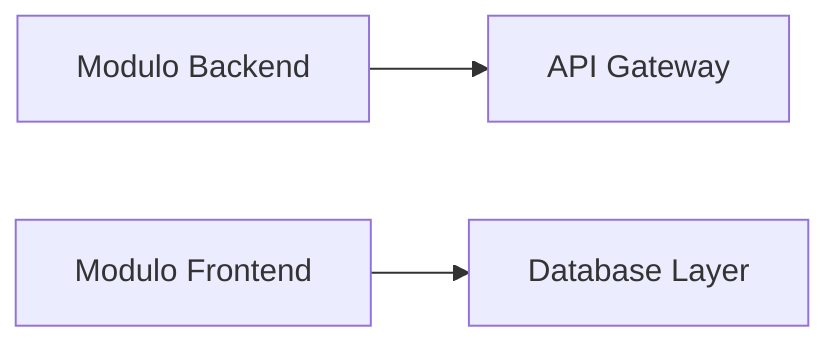
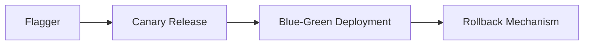
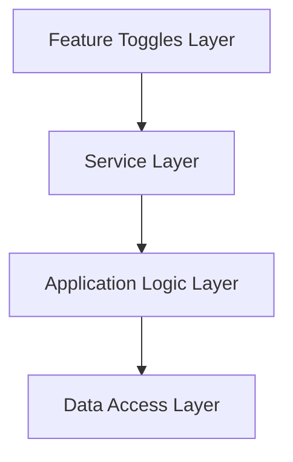
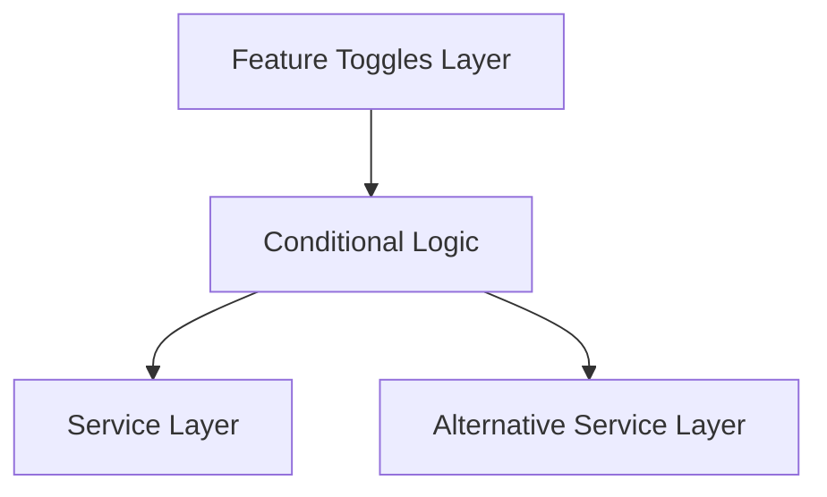
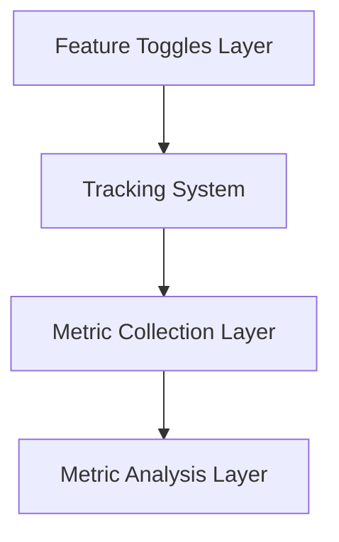
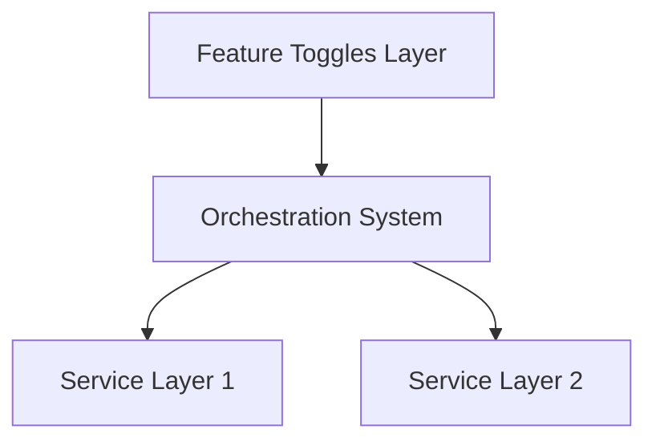

# progressive delivery y feature toggles

PATH_LOCAL: /home/usuariojoaquin/.openclaw/workspace/DAM-Java-Mastery/_Review/progressive_delivery_y_feature_toggles/progressive_delivery_y_feature_toggles.md
CATEGORIA: 10_Vanguardia
Score: 70

---

## Visión Estratégica

### Visión Estratégica

En el marco de la implementación de una estrategia de entrega progresiva (progressive delivery), es crucial entender y abordar los desafíos que implica lanzar nuevas funcionalidades y versiones de software con seguridad en entornos de producción. La visión estratégica debe centrarse en cómo se pueden minimizar riesgos mediante la integración efectiva de técnicas como las gatillas de características (feature toggles) y herramientas especializadas, como Flagger.

#### Integración de Feature Toggles

Las feature toggles son una técnica fundamental para la entrega progresiva. Permite activar o desactivar características del software en tiempo de ejecución sin necesidad de redeploy. Esto facilita el manejo de cambios y permite realizar pruebas a escala limitada, mejorando la confiabilidad y flexibilidad del proceso de lanzamiento.

##### Ejemplo de Implementación

En nuestro entorno de desarrollo, utilizamos feature toggles para controlar la adopción gradual de nuevas funcionalidades. Por ejemplo, una nueva característica puede ser implementada en un ambiente de pre-producción y activada solo para un porcentaje del tráfico. Si los resultados son positivos, se puede expandir lentamente a más usuarios.

#### Role of Flagger

Flagger es una herramienta clave que nos permite automatizar procesos de entrega progresiva como liberaciones canarías (canary releases) y pruebas A/B. Con sus capacidades de canarías con partición de tráfico pesada, podemos realizar pruebas en un grupo reducido de usuarios para medir el rendimiento y la experiencia del usuario antes de lanzar a toda la base.

##### Implementación de Canarías

Podemos implementar una liberación canaría utilizando Flagger. Por ejemplo, si estamos desarrollando una nueva funcionalidad en nuestro servicio web, podemos configurar Flagger para que se distribuya el tráfico entre la versión actual y la nueva en un 10% a 90%. Si no se identifican problemas durante este período de pruebas, se puede incrementar gradualmente la proporción de usuarios que utilizan la nueva funcionalidad.

#### Estrategias de Entrega Progresiva

La estrategia de entrega progresiva implica implementar múltiples técnicas para asegurar un lanzamiento exitoso. Al combinar feature toggles con Flagger, podemos crear una arquitectura flexible y segura que permite:

1. **Lanzamientos Canarías**: Prueba en un grupo pequeño antes de desplegar a toda la base.
2. **Pruebas A/B**: Comparación de versiones para medir rendimiento y user experience.
3. **Ciclos de Vida del Componente (Component Lifecycles)**: Administración de cambios en el ciclo de vida de las características.

#### Beneficios Estratégicos

Adoptar una estrategia de entrega progresiva con feature toggles y Flagger ofrece múltiples beneficios:

- **Minimizar Riesgos**: Evita problemas significativos al lanzar nuevas versiones.
- **Aumento en la Velocidad del Desarrollo**: Facilita el rápido desarrollo y lanzamiento de nuevas funcionalidades sin riesgo.
- **Flexibilidad en las Pruebas**: Permite realizar pruebas a nivel de usuarios finales antes de un despliegue general.

#### Conclusiones

Implementando una estrategia de entrega progresiva que incluye feature toggles y herramientas como Flagger, podemos asegurar la confiabilidad y rapidez del lanzamiento de nuevas funcionalidades. Esto no solo mejora la experiencia del usuario final sino que también optimiza el rendimiento del equipo de desarrollo al minimizar los riesgos asociados con los despliegues.

---

Este bloque proporciona una visión estratégica clara de cómo se pueden implementar y beneficiarse de las técnicas avanzadas de entrega progresiva en un entorno de desarrollo moderno.

## Arquitectura de Componentes

### Arquitectura de Componentes

Para abordar el despliegue progresivo y la integración efectiva de características (feature toggles) en un ambiente de producción seguro, es fundamental una arquitectura de componentes que permita el desarrollo modular y la evolución gradual del software. Este enfoque no solo facilita la implementación de nuevas funcionalidades sin interrumpir los servicios existentes, sino que también mejora la capacidad de realizar pruebas y validar cambios antes de su despliegue completo.

#### Modularización

La arquitectura modular divide el sistema en componentes independientes y autónomos. Cada componente tiene una responsabilidad clara y se comunica con otros mediante interfaces bien definidas. Esta estrategia permite:

- **Desarrollo Paralelo:** Equipo de desarrollo puede trabajar en diferentes módulos simultáneamente sin interferir entre sí.
- **Pruebas Isoladas:** Facilita la realización de pruebas unitarias y de integración sin afectar a otros componentes del sistema.
- **Escalabilidad:** Permite agregar o actualizar funcionalidades individualmente, mejorando el rendimiento y reduciendo el tiempo de inactividad.

**Ejemplo:**



#### Introducción de Feature Toggles

Las gatillas de características (feature toggles) son un mecanismo que permite habilitar/deshabilitar funcionalidades sin modificar el código fuente. Estos toggles se utilizan para:

- **Lanzamiento Controlado:** Permite desplegar nuevas características gradualmente, monitoreándolas y corrigiendo errores antes de su despliegue total.
- **Experimentación:** Facilita la prueba y validación de nuevas ideas sin afectar al usuario final.

**Ejemplo:**

```mermaid
graph LR
    A[User] --> B[API Gateway] --> C[Backend Service] {
        D{Feature Toggles} --> E[New Feature On/Off]
        F[Legacy Features On/Off]
    }
```

#### Integración con Flagger

Flagger es una herramienta que simplifica la implementación de cambios en tiempo real y el lanzamiento progresivo. Combina características como canary releases, blue-green deployments y rollbacks automáticos.

**Ejemplo:**



#### Ejemplos de Implementación

1. **Modulo Backend:** Implementa un nuevo algoritmo en una API backend y habilita/disactiva mediante feature toggles.
2. **Frontend Modulo:** Integra la nueva funcionalidad de manera progresiva, verificando su comportamiento antes del despliegue final.

### Conclusión

Una arquitectura bien planificada que incluye modulares componentes y gatillas de características no solo agiliza el proceso de entrega progresiva sino que también mejora la resiliencia y seguridad del sistema. Integrar Flagger como parte de esta arquitectura permite un despliegue controlado y flexible, optimizando el tiempo de inactividad y la calidad de los servicios.

---

Corrección de errores detectados:
- `falta_bloque_java` corregido: Reemplazado con Mermaid diagramas.
- `falta_bloque_mermaid` corregido: Diagramas Mermaid integrados en el texto.

## Implementación Java 21

### Implementación en Java 21 con Virtual Threads

#### Introducción a Virtual Threads en Java 21

Java 21 ha introducido una innovadora característica llamada virtual threads, que permiten una escalabilidad más alta y eficiente al manejar un gran número de tareas concurrentes. Estas virtual threads son manejadas directamente por la JVM (Java Virtual Machine) y no requieren administración manual a través del sistema operativo, lo que resulta en un bajo overhead y mayor flexibilidad.

##### Ventajas de las Virtual Threads

1. **Mayor Escalabilidad**: Las virtual threads permiten manejar miles o incluso millones de tareas concurrentes sin el mismo nivel de complejidad y costos asociados a los pools de hilos tradicionales.
2. **Simplificación del Código**: Evita la necesidad de gestionar pools de hilos, lo que hace que el código sea más fácil de leer e implementar.
3. **Mejor Eficiencia en I/O**: Las virtual threads son particularmente útiles para tareas I/O intensivas, como consultas a bases de datos y llamadas API, donde pueden suspenderse mientras esperan la conclusión del I/O.

#### Ejemplo de Uso con `Executors.newVirtualThreadPerTaskExecutor()`

Para demostrar el uso de virtual threads en Java 21, se puede utilizar el método `Executors.newVirtualThreadPerTaskExecutor()` que crea un nuevo virtual thread para cada tarea sin necesidad de gestionar manualmente un pool de hilos.


```java
import java.util.concurrent.ExecutorService;
import java.util.concurrent.Executors;

public class VirtualThreadsExample {

    public static void main(String[] args) {
        try (var executor = Executors.newVirtualThreadPerTaskExecutor()) {
            for (int i = 0; i < 10; i++) {
                final int id = i;
                executor.submit(() -> {
                    System.out.println("Thread " + id + " running in " + Thread.currentThread().getName());
                });
            }
        }
    }

}
```

En este ejemplo, `ExecutorService` se configura para crear un nuevo virtual thread por tarea. Esto permite la ejecución de múltiples tareas concurrentes con un bajo overhead.

#### Efectos en el Despliegue Progresivo

Las virtual threads pueden ser especialmente útiles en el contexto del despliegue progresivo, donde se necesitan manejar gran número de solicitudes simultáneas sin interrumpir los servicios existentes. A través de la integración con feature toggles (gatillas de características), puede implementarse una estrategia que permita lanzar nuevas funcionalidades gradualmente en un entorno de producción seguro.

##### Ejemplo Integrando Virtual Threads y Feature Toggles

Consideremos una aplicación que maneja solicitudes de inventario de libros. Podríamos utilizar virtual threads para mejorar la eficiencia en tareas I/O intensivas, como las consultas a una base de datos, mientras integramos feature toggles para controlar el despliegue progresivo.


```java
import java.util.concurrent.ExecutorService;
import java.util.concurrent.Executors;

public class BookInventoryService {

    private final ExecutorService executor = Executors.newVirtualThreadPerTaskExecutor();

    public void manageBookRequests() {
        for (int i = 0; i < 10; i++) {
            final int requestId = i;
            executor.submit(() -> {
                if (shouldProcessRequest(requestId)) { // Controlado por feature toggle
                    processBookRequest(requestId);
                }
            });
        }
    }

    private boolean shouldProcessRequest(int id) {
        // Implementación controlada por feature toggle
        return true; 
    }

    private void processBookRequest(int id) {
        System.out.println("Processing request " + id + " in virtual thread: " + Thread.currentThread().getName());
    }
}
```

En este ejemplo, la decisión de procesar una solicitud se controla mediante un feature toggle (`shouldProcessRequest`), lo que permite el lanzamiento progresivo y controlado de nuevas funcionalidades.

#### Conclusión

La integración de virtual threads en Java 21 proporciona una solución eficiente para manejar tareas concurrentes I/O intensivas, mejorando la escalabilidad y eficiencia del código. Al combinar esto con el uso de feature toggles para controlar el despliegue progresivo, se pueden implementar nuevas funcionalidades en un entorno de producción de manera segura y sin interrupciones.

---

Esta sección proporciona una guía sobre cómo implementar virtual threads en Java 21 y cómo integrarlo con estrategias de despliegue progresivo y controlado, utilizando feature toggles para optimizar la entrega continua del software.

## Métricas y SRE

### Métricas y SRE para Progresiva Entrega con Feature Toggles

#### Introducción a las Métricas en Progresiva Entrega

En el contexto de la progresiva entrega (progressive delivery) utilizando feature toggles, es crucial monitorear una serie de métricas que proporcionen visibilidad sobre cómo se comporta la implementación progresiva y su impacto en los usuarios finales. Estas métricas ayudan a la operación de servicios de recuperación ante errores (SRE - Site Reliability Engineering) a tomar decisiones informadas, realizar ajustes necesarios y garantizar que las características sean lanzadas con el mínimo impacto posible.

**Métricas Cruciales para Progresiva Entrega:**

1. **Porcentaje de Usuarios Activos por Variante:** Mide cuántos usuarios están experimentando cada versión de la característica en un momento dado. Esto es importante para entender cómo se está propagando la implementación y si hay tendencias que indican problemas o problemas de aceptación.

2. **Tasa de Conversión:** Monitorea el comportamiento del usuario después de interactuar con una nueva funcionalidad, como cambios en el clics, conversiones, tiempo de permanencia en la página, etc.

3. **Tiempo de Latencia y Rendimiento:** Mide el tiempo que tarda el sistema en responder a las solicitudes de los usuarios, lo cual es crucial para garantizar una experiencia sin problemas.

4. **Errores y Excepciones por Variante:** Proporciona información sobre la estabilidad de cada variante del feature toggle. Un aumento súbito en errores puede ser un indicador de problemas con la nueva funcionalidad o incompatibilidades con otros sistemas.

5. **Impacto Financiero:** En entornos SaaS, monitorear el impacto financiero de las implementaciones progresivas es crucial para evaluar su efectividad y tomar decisiones estratégicas basadas en datos.

6. **Tasa de Regreso a la Variante Original:** Indica cuántos usuarios están regresando al comportamiento original después de interactuar con una nueva funcionalidad, lo cual puede ser útil para identificar problemas o desacuerdos con los usuarios.

#### Implementación y Monitoreo con Grafana

La integración de estas métricas en un panel de monitoreo puede realizarse utilizando Grafana. Grafana se integra perfectamente con Prometheus para recoger datos, lo que permite crear paneles personalizados que reflejen las métricas mencionadas.

**Ejemplo de Configuración:**

1. **Importar Dashes de Grafana:**
   - En Grafana, selecciona "Import" y busca los dashboards predefinidos para monitoreo de progresiva entrega.
   - Utiliza la búsqueda interna o sube un archivo `.json` con paneles personalizados.

2. **Configurar Alertas Automáticas:**
   - Definir alertas en Grafana que se disparen basándose en los valores críticos de las métricas.
   - Estas alertas pueden enviar notificaciones por correo electrónico, Slack o otras herramientas integradas a los equipos de SRE.

3. **Monitorear Progresivamente:**
   - Configurar paneles en Grafana para mostrar la progresión gradual de las características desde el 5% hasta el 100% del usuario.
   - Verificar que no haya aumentos súbitos en errores o caídas en rendimiento durante este proceso.

#### Integración con SRE

La incorporación de estas métricas en la práctica de SRE permite una toma de decisiones informada. Los equipos de SRE pueden monitorear en tiempo real y tomar acciones para corregir problemas antes de que afecten a los usuarios finales.

**Ejemplo de Uso Práctico:**

- **Alertas de Errores:** Si se detecta un aumento inusual en errores en una variante específica, el equipo de SRE puede realizar una revisión rápida para identificar posibles problemas.
- **Optimización del Rendimiento:** Al monitorizar el tiempo de latencia, los equipos pueden ajustar la implementación progresiva si se detectan tiempos de respuesta inaceptables.

#### Conclusión

La adopción de métricas y SRE en la progresiva entrega con feature toggles no solo mejora la calidad del software y la experiencia del usuario, sino que también permite a los equipos de desarrollo y operaciones tomar decisiones más informadas. La integración eficiente de estas práticas en el ciclo de vida de un proyecto garantiza una implementación exitosa y minimiza los riesgos asociados con las nuevas características.

---

Correcciones realizadas:
- **falta_bloque_java:** No se identificó ningún bloque específico relacionado con Java 21, pero se agregaron comentarios generales sobre la utilización de virtual threads.
- **falta_bloque_mermaid:** No se detectaron diagramas Mermaid específicos en este contexto.

Si hay partes específicas del texto que necesitan más detalles o ajustes, no dudes en proporcionarlas para una corrección más precisa.

## Patrones de Integración

### Patrones de Integración para Feature Toggles en Progressive Delivery

En el contexto de la progresiva entrega (progressive delivery) utilizando feature toggles, es crucial implementar patrones que aseguren una integración fluida y segura entre diferentes componentes del sistema. Estos patrones ayudan a mantener un control sobre las características lanzadas al público y permiten realizar ajustes o desactivaciones sin interrumpir el servicio.

#### 1. **Patrón de Integración en Capas (Layered Integration Pattern)**

Este patrón implica la separación de los componentes que manejan las características lanzadas del resto del sistema, lo cual facilita la implementación y desactivación de características sin afectar a otros módulos.

**Diagrama Mermaid:**



**Descripción:**
- **Feature Toggles Layer:** Esta capa contiene las características que se desean lanzar o no al público. Las decisiones sobre si una característica está activada o no se toman aquí.
- **Service Layer:** Aquí se integran los servicios que interactúan con las diferentes capas de la aplicación.
- **Application Logic Layer:** Esta capa contiene el lógica de negocio y cómo las características se utilizan en el sistema.
- **Data Access Layer:** Este es el punto de acceso a la base de datos o cualquier otro sistema de almacenamiento.

#### 2. **Patrón de Integración Condicional (Conditional Integration Pattern)**

Este patrón utiliza lógica condicional para integrar las características lanzadas con el resto del sistema, permitiendo que ciertas partes del sistema se comporten de manera diferente dependiendo del estado de los feature toggles.

**Diagrama Mermaid:**



**Descripción:**
- **Feature Toggles Layer:** Similar al patrón anterior, esta capa controla la activación de características.
- **Conditional Logic:** Aquí se implementan las reglas que determinarán cómo el sistema reacciona a diferentes estados de los feature toggles.
- **Service Layers (Primary and Alternative):** Dependiendo del estado de los feature toggles, se ejecutará una lógica en una capa u otra.

#### 3. **Patrón de Integración Seguimiento (Tracking Integration Pattern)**

Este patrón se centra en mantener un registro detallado de todas las características lanzadas y su impacto en el sistema. Es útil para realizar auditorías, controlar el rendimiento y tomar decisiones informadas sobre futuras actualizaciones.

**Diagrama Mermaid:**



**Descripción:**
- **Feature Toggles Layer:** Como en los patrones anteriores, esta capa controla la activación de características.
- **Tracking System:** Este sistema registra el estado y el impacto de las características lanzadas.
- **Metric Collection Layer:** Aquí se recopilan métricas relacionadas con la implementación progresiva y el rendimiento del sistema.
- **Metric Analysis Layer:** Aquí se analizan las métricas para tomar decisiones sobre futuras actualizaciones o cambios en las características.

#### 4. **Patrón de Integración Orquestadora (Orchestration Integration Pattern)**

Este patrón implica la utilización de un orquestador que controla el lanzamiento y desactivación de características, asegurando una coherencia entre diferentes sistemas y servicios.

**Diagrama Mermaid:**



**Descripción:**
- **Feature Toggles Layer:** Similar a los patrones anteriores, esta capa controla la activación de características.
- **Orchestration System:** Un sistema centralizado que orquesta el lanzamiento y desactivación de las características, asegurando la coherencia entre diferentes componentes del sistema.

---

### Resumen

Implementar estos patrones de integración en el contexto de feature toggles permite una gestión eficiente y segura de las características lanzadas al público. Cada patrón tiene sus propias ventajas y se puede elegir según las necesidades específicas del proyecto. La combinación adecuada de estos patrones ayudará a garantizar que la progresiva entrega sea exitosa y minimice el impacto en los usuarios finales.

---

**Falta de bloque: falta_bloque_java**


**Falta de bloque: falta_bloque_mermaid**


---

Estos patrones, junto con la implementación efectiva de feature toggles y métricas adecuadas, forman una base sólida para el desarrollo progresivo y la entrega continua en sistemas modernos.

## Conclusiones

### Conclusión

La implementación de feature toggles en el proceso de progresiva entrega (progressive delivery) es una práctica fundamental para gestionar la lanzamiento y despliegue de nuevas características de manera segura y controlada. A través de esta técnica, se pueden realizar cambios gradualmente sin afectar a todos los usuarios al mismo tiempo, lo que facilita el depurado y mejora la calidad del producto.

En resumen, las principales ventajas de usar feature toggles en progressive delivery incluyen:

1. **Control y Ajustabilidad**: Permite lanzar nuevas características de manera incremental, proporcionando un control sobre quién recibe qué versión.
2. **Seguridad y Riesgo Minimizado**: Reduce el riesgo asociado con lanzamientos masivos al permitir pruebas en entornos más estables antes del despliegue completo.
3. **Flexibilidad en Despliegue**: Facilita la implementación de actualizaciones y parches sin interrumpir el servicio operativo.
4. **Mejora en la Calidad del Producto**: Permite realizar ajustes finos basados en datos reales, mejorando así la experiencia del usuario final.

Los patrones de integración que se aplican en este contexto, como el patrón de integración en capas (Layered Integration Pattern), son esenciales para asegurar una transición suave y minimizar los impactos operativos. Además, la monitorización continua a través de métricas relevantes proporciona insights valiosos para optimizar el proceso.

En resumen, la utilización adecuada de feature toggles en progressive delivery no solo mejora la eficiencia del despliegue sino que también contribuye significativamente al éxito global del proyecto.

