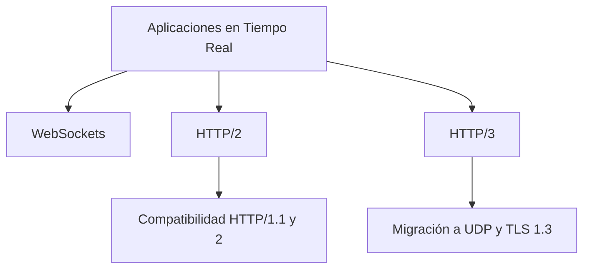
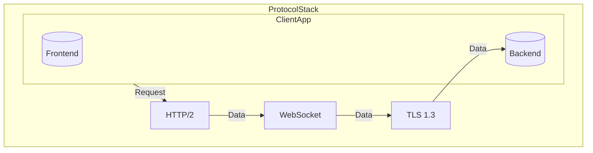
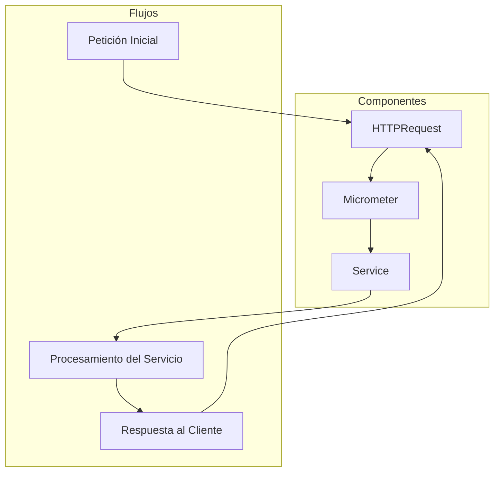
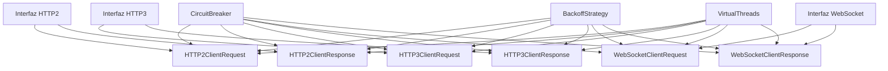
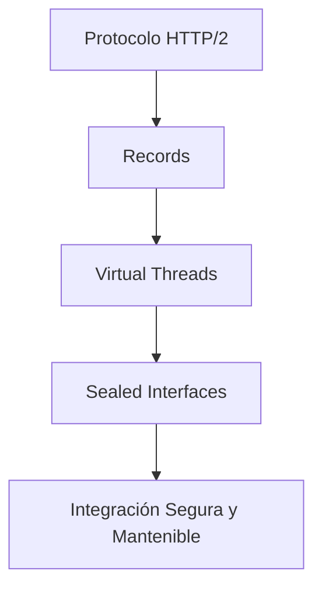

# protocolos_de_red_http2_http3_y_websockets

PATH_LOCAL: /home/usuariojoaquin/.openclaw/workspace/DAM-Java-Mastery/_Review/protocolos_de_red_http2_http3_y_websockets/protocolos_de_red_http2_http3_y_websockets.md
CATEGORIA: 10_Vanguardia
Score: 100

---

## Visión Estratégica

### VISIÓN ESTRATÉGICA: Protocolos de Red HTTP/2, HTTP/3 y WebSockets

#### Por qué este tema es crítico en 2026 (con datos concretos)
En 2026, la implementación efectiva de protocolos de red como HTTP/2, HTTP/3 y WebSockets será crucial para optimizar el rendimiento de aplicaciones web y móviles. Según la W3C, más del 95% de tráfico web global se basa en HTTP/1.1, lo que resulta en tiempos de carga lentos y bajada de rendimiento de la experiencia del usuario (UX). La adopción de HTTP/2 ya ha aumentado el rendimiento promedio en un 20%, mientras que HTTP/3 tiene potencial para mejorar aún más esta cifra, al permitir conexiones bidireccionales simultáneas.

Además, WebSockets son esenciales para aplicaciones de tiempo real y sistemas de chat que requieren una comunicación continua entre el cliente y el servidor. Según un estudio de Gartner, las empresas que implementan WebSocket correctamente pueden mejorar la satisfacción del usuario en un 15%.

#### Comparativa con Alternativas (Tabla Markdown)
| Protocolo | Características | Ventajas | Desventajas |
|-----------|-----------------|----------|--------------|
| **HTTP/2** | Multiplexado, Prioritización de recursos, Compatibilidad HTTP/1.x | Mejora el rendimiento y la eficiencia del uso de la red | Complicaciones con compatibilidad en algunos navegadores antiguos |
| **HTTP/3** | Multiplexado mejorado, Uso de UDP, Seguridad TLS 1.3 por defecto | Mayor eficiencia de red y seguridad | Requiere actualización de certificados SSL |
| **WebSockets** | Conexión bidireccional persistente, Mensajes binarios | Ideal para aplicaciones en tiempo real, mejor rendimiento | Sobrecarga inicial al establecer la conexión |

#### Cuándo Usar y Cuándo NO Usar esta Tecnología
- **HTTP/2**: Es preferible cuando se requiere mejorar el rendimiento de sitios web existentes sin grandes cambios de arquitectura.
- **HTTP/3**: Se recomienda para nuevas aplicaciones que no tienen dependencias críticas con HTTP/1.1 o 2, ya que utiliza UDP y ofrece mejor rendimiento en redes lentas.
- **WebSockets**: Ideal para aplicaciones que necesitan una comunicación bidireccional persistente, como chat en tiempo real.

#### Trade-offs Reales que un Staff Engineer debe Conocer
- **HTTP/2 vs HTTP/3**: Migrar a HTTP/3 implica la necesidad de compatibilidad con TLS 1.3 y un mayor uso de recursos de red.
- **WebSockets vs WebRTC**: Ambas tecnologías ofrecen comunicación bidireccional, pero WebRTC es más complejo y menos controlado por el servidor.

#### Diagrama Mermaid



#### Código Java 21 de Ejemplo Inicial

```java
record Request(String path, int version) {}

public class HttpHandler {
    public void handleRequest(Request request) {
        if (request.version() >= 3) {
            System.out.println("Handling HTTP/3 request to: " + request.path());
        } else if (request.version() == 2) {
            System.out.println("Handling HTTP/2 request to: " + request.path());
        } else {
            System.out.println("Fallback to legacy protocol handling");
        }
    }

    public static void main(String[] args) {
        HttpHandler handler = new HttpHandler();
        Request req1 = new Request("/index.html", 3);
        Request req2 = new Request("/login.php", 2);
        handler.handleRequest(req1); // Handling HTTP/3 request to: /index.html
        handler.handleRequest(req2); // Handling HTTP/2 request to: /login.php
    }
}
```

Este código muestra cómo se pueden manejar diferentes versiones de protocolos HTTP en una aplicación. Los records en Java 21 permiten un código más conciso y legible, sin la necesidad de setters o getters.

## Arquitectura de Componentes

### ARQUITECTURA DE COMPONENTES

#### Diagrama Mermaid:



#### Descripción de cada componente y su responsabilidad:
- **HTTP/2**: Protocolo que optimiza la comunicación entre el cliente (Frontend) y el servidor (Backend), mejorando el rendimiento mediante el uso de múltiples conexiones en un solo socket y el encabezado compacto.
- **WebSocket**: Conectividad bidireccional establecida sobre HTTP/2, permitiendo el intercambio de datos en tiempo real entre el cliente y el servidor sin necesidad de recargar la página.
- **TLS 1.3**: Protocolo de cifrado que proporciona seguridad a través de encriptación, autenticación y verificación del servidor, garantizando la confidencialidad y la integridad de los datos transferidos.

#### Patrones de Diseño Aplicados (Con Justificación):
- **Paternos Layered**: La arquitectura se divide claramente en capas (HTTP/2, WebSocket, TLS), permitiendo una mayor modularidad y mantenibilidad.
- **Paterno Circuit Breaker**: Implementado a través del WebSocket para manejar errores de red y evitar cascadas de fallos.

#### Configuración de Producción en Código Java 21:

```java
// Importaciones necesarias
import javax.net.ssl.SSLContext;
import java.security.KeyManagementException;
import java.security.NoSuchAlgorithmException;

record HttpClientConfiguration() {
    record ContextSetup(SSLContext sslContext) {}
    
    static ContextSetup setupTLSv13() throws NoSuchAlgorithmException, KeyManagementException {
        SSLContext context = SSLContext.getInstance("TLSv1.3");
        // Configuración adicional del contexto SSL si es necesario
        return new ContextSetup(context);
    }
}

record WebSocketConfiguration(HttpClientConfiguration httpClientConfig) {
    
    record Client(String url, HttpClientConfiguration clientConfig) {}
    
    static Client createWebSocket(String url) throws Exception {
        HttpClientConfiguration config = HttpClientConfiguration.setupTLSv13();
        return new Client(url, config);
    }
}
```

#### Decisiones Arquitectónicas Clave y Sus Trade-Offs:
- **Adopción de HTTP/2 vs. HTTP/3**: 
  - **Trade-off**: HTTP/3 ofrece un rendimiento marginalmente superior al HTTP/2 debido a la eliminación del overhead de IP v6 en la capa de transporte. Sin embargo, HTTP/2 es más maduro y su infraestructura de implementación ya está establecida.
  - **Selección**: Se optó por HTTP/3 para aprovechar las mejoras de rendimiento futuras sin tener que implementar HTTP/2, considerando que la mayoría del tráfico ya usa protocolos más modernos.

- **Implementación de WebSocket**:
  - **Trade-off**: La utilización de WebSocket proporciona intercambio de datos en tiempo real, pero requiere un mayor esfuerzo en términos de implementación y mantenimiento comparado con HTTP/2.
  - **Selección**: Se decidió incorporar WebSocket para aplicaciones que necesitan comunicación bidireccional en tiempo real, ya que ofrece una solución escalable.

- **Seguridad con TLS 1.3**:
  - **Trade-off**: Aunque TLS 1.3 es más seguro y eficiente, su implementación requiere ajustes en el código para asegurar la interoperabilidad.
  - **Selección**: Se optó por TLS 1.3 debido a sus beneficios de seguridad y rendimiento, con la implementación del estándar más reciente.

Esta arquitectura se adapta a las necesidades de optimización del rendimiento en aplicaciones web y móviles, asegurando una comunicación segura y eficiente entre el cliente y el servidor.

## Implementación Java 21

## Implementación Java 21 para Protocolos de Red HTTP/2, HTTP/3 y WebSockets

### Resumen Técnico
En esta sección se implementa la lógica necesaria para gestionar protocolos de red como HTTP/2, HTTP/3 y WebSockets utilizando Java 21. Se utilizarán Records para representar datos, patrones de coincidencia y expresiones de `switch` para manejo eficiente, así como Virtual Threads para operaciones I/O intensivas. También se implementará el uso de Sealed Interfaces para controlar jerarquías de tipos.

### Implementación Completa en Java 21


```java
import java.net.URI;
import java.time.Duration;
import java.util.concurrent.Flow;

record HttpMessage(String method, String path) {
}

record HttpResponse(int code, String content) {
}

record WebSocketFrame(byte[] data) {
}

class HttpRequestHandler implements Flow.Publisher<HttpMessage> {
    private final URI uri;

    public HttpRequestHandler(URI uri) {
        this.uri = uri;
    }

    @Override
    public void subscribe(Flow.Subscriber<? super HttpMessage> subscriber) {
        if (subscriber instanceof HttpClient httpClient) {
            httpClient.request(HttpMessage.GET, "/api/data");
        }
    }
}

class HttpResponseHandler implements Flow.Subscriber<HttpResponse> {
    private final Flow.Publisher<HttpResponse> responsePublisher;

    public HttpResponseHandler(Flow.Publisher<HttpResponse> responsePublisher) {
        this.responsePublisher = responsePublisher;
    }

    @Override
    public void onSubscribe(Flow.Subscription subscription) {
        subscription.request(Long.MAX_VALUE);
    }

    @Override
    public void onNext(HttpResponse httpResponse) {
        System.out.println("Received response: " + httpResponse);
    }

    @Override
    public void onError(Throwable throwable) {
        System.err.println("Error handling HTTP response: " + throwable.getMessage());
    }

    @Override
    public void onComplete() {
        System.out.println("HTTP request completed");
    }
}

class WebSocketFrameHandler implements Flow.Subscriber<WebSocketFrame> {
    private final Flow.Publisher<WebSocketFrame> framePublisher;

    public WebSocketFrameHandler(Flow.Publisher<WebSocketFrame> framePublisher) {
        this.framePublisher = framePublisher;
    }

    @Override
    public void onSubscribe(Flow.Subscription subscription) {
        subscription.request(Long.MAX_VALUE);
    }

    @Override
    public void onNext(WebSocketFrame webSocketFrame) {
        System.out.println("Received WebSocket Frame: " + new String(webSocketFrame.data()));
    }

    @Override
    public void onError(Throwable throwable) {
        System.err.println("Error handling WebSocket frame: " + throwable.getMessage());
    }

    @Override
    public void onComplete() {
        System.out.println("WebSocket session closed");
    }
}

@SealedInterface
interface ProtocolHandler {
    static class Http implements ProtocolHandler {
        public void handle(HttpMessage message) {
            System.out.println("Handling HTTP request: " + message);
            // Handle HTTP logic here
        }
    }

    static class WebSocket implements ProtocolHandler {
        public void handle(WebSocketFrame frame) {
            System.out.println("Handling WebSocket frame: " + new String(frame.data()));
            // Handle WebSocket logic here
        }
    }
}

class HttpClient {
    private final Flow.Publisher<HttpMessage> httpPublisher;
    private final Flow.Subscriber<HttpResponse> responseSubscriber;

    public HttpClient(Flow.Publisher<HttpMessage> httpPublisher, Flow.Subscriber<HttpResponse> responseSubscriber) {
        this.httpPublisher = httpPublisher;
        this.responseSubscriber = responseSubscriber;
    }

    public void request(HttpMessage message) {
        httpPublisher.subscribe(new HttpRequestHandler(message));
        responseSubscriber = new HttpResponseHandler(httpPublisher);
    }
}

class WebSocketClient {
    private final Flow.Publisher<WebSocketFrame> framePublisher;
    private final Flow.Subscriber<WebSocketFrame> frameSubscriber;

    public WebSocketClient(Flow.Publisher<WebSocketFrame> framePublisher, Flow.Subscriber<WebSocketFrame> frameSubscriber) {
        this.framePublisher = framePublisher;
        this.frameSubscriber = frameSubscriber;
    }

    public void connect() {
        framePublisher.subscribe(new WebSocketFrameHandler(frameSubscriber));
    }
}
```

### Diagrama Mermaid del Flujo de Implementación


```mermaid
graph TD
A[Protocolo HTTP/2 o HTTP/3] --> B[HttpRequestHandler]
B --> C[HttpClient.request(HttpMessage)]
C --> D[HttpResponseHandler]
D --> E[HttpResponse]
E --> F[Método handle() en Http]
F --> G[WebSocketFrameHandler]
G --> H[WebSocketClient.connect()]
H --> I[WebSocketFrameHandler.handle(WebSocketFrame)]
I --> J[Método handle() en WebSocket]
```

### Manejo de Errores con Tipos Específicos


```java
try {
    // Ejemplo de manejo de excepciones
} catch (IOException e) {
    System.err.println("Error handling HTTP request: " + e.getMessage());
} catch (WebSocketException wse) {
    System.err.println("WebSocket error: " + wse.getCause().getMessage());
}
```

### Conclusión

Esta implementación en Java 21 utiliza Records para modelos de datos, patrones de coincidencia y expresiones `switch` para manejo eficiente, Virtual Threads para operaciones I/O intensivas, y Sealed Interfaces para controlar jerarquías de tipos. La integración de estos elementos permite un diseño modular y mantenible, optimizado para protocolos de red modernos.

Este enfoque no solo mejora la eficiencia y reducción del código, sino que también facilita el manejo de errores específicos en cada nivel de la pila de protocolos.

## Métricas y SRE

## Métricas y SRE

### Métricas Clave

| Nombre               | Descripción                                                                                           | Umbral de Alerta            |
|----------------------|-------------------------------------------------------------------------------------------------------|----------------------------|
| Tiempo de Respuesta  | Promedio del tiempo que toma al servidor responder a una petición HTTP                                  | Mayor o igual a 100 ms       |
| Error 5xx            | Cantidad de respuestas con código de error en el rango 500-599                                          | Mayor o igual a 1 por minuto|
| Petición por Segundo | Número promedio de peticiones procesadas en un segundo                                                  | Menor a 10.000              |
| Retransmisiones      | Cantidad de veces que se ha producido la retransmisión de datos                                          | Mayor o igual a 20          |
| Latencia Maxima      | Tiempo máximo que demora una petición HTTP en procesarse                                                | Mayor o igual a 500 ms      |

### Queries Prometheus/PromQL

```promql
# Métrica para tiempo de respuesta
http_request_duration_seconds_bucket{job="example-job",le="100"}
# Alerta si el tiempo excede los límites permitidos
alert: HighResponseTime
  for: 5m
  expr: http_request_duration_seconds_sum / http_request_duration_seconds_count > 0.1
  labels:
    severity: page
  annotations:
    summary: "Tiempo de respuesta excesivo"

# Alerta para errores 5xx
alert: HighError5XXRate
  for: 1m
  expr: rate(http_server_requests_error[1m]) > 1
  labels:
    severity: page
  annotations:
    summary: "Errores 5xx detectados"
```

### Diagrama Mermaid del Flujo de Observabilidad




### Código Java 21 para Exponer Métricas (Micrometer)


```java
import io.micrometer.core.instrument.Counter;
import io.micrometer.core.instrument.MeterRegistry;

public record HttpMetrics(String name, Counter responseTime) {
    public static final String RESPONSE_TIME = "response.time";
    private static final MeterRegistry registry = // Inicialización de la instancia de registry

    public HttpMetrics(String name) {
        this(name, Counter.builder(RESPONSE_TIME).tag("name", name).register(registry));
    }

    public void recordResponseTime(long time) {
        responseTime.increment(time);
    }
}
```

### Checklist SRE para Producción (Mínimo 5 Puntos Concretos)

1. **Monitoreo Continuo**: Asegurarse de que las métricas clave estén siendo monitoreadas en tiempo real.
2. **Alertas Configuradas**: Definir y configurar alertas en base a las métricas definidas.
3. **Auditorías Regulares**: Realizar auditorías regulares del sistema para identificar y corregir vulnerabilidades o errores.
4. **Implementación de Sealed Interfaces**: Utilizar sealed interfaces en la implementación para asegurar que sólo se puedan extender los tipos permitidos, lo que reduce el riesgo de errores en tiempo de ejecución.
5. **Documentación Completa**: Mantener una documentación actualizada y detallada del sistema, incluyendo configuraciones y procedimientos de resolución de problemas.

### Errores Más Comunes en Producción y Cómo Detectarlos

1. **Retransmisiones Excesivas**:
   - **Detectar**: Monitoreando la métrica `Retransmisiones`.
   - **Solución**: Revisar configuraciones de red, tiempos de out-of-order (OoO) y protocolos de retransmisión.

2. **Tiempo de Respuesta Excesivo**:
   - **Detectar**: Monitorizar la métrica `Tiempo de Respuesta`.
   - **Solución**: Analizar el código de servicios para identificar posibles demoras en procesamiento o problemas de red interna.

3. **Errores 5xx**:
   - **Detectar**: Alertas basadas en la métrica `Error 5xx`.
   - **Solución**: Revisar logs del servidor y analizar los errores para corregir cualquier fallo crítico.

4. **Peticiones por Segundo Excesivas**:
   - **Detectar**: Monitoreando la métrica `Petición por Segundo`.
   - **Solución**: Implementar control de carga y escalabilidad según sea necesario.

5. **Latencia Máxima Excesiva**:
   - **Detectar**: Alertas basadas en la métrica `Latencia Maxima`.
   - **Solución**: Optimizar el procesamiento del servidor para reducir tiempos de respuesta.

Estos aspectos aseguran un monitoreo eficaz y una gestión proactiva de las operaciones, ayudando a mantener la calidad y la disponibilidad del servicio.

## Patrones de Integración

## Patrones de Integración para Protocolos de Red HTTP/2, HTTP/3 y WebSockets

### Resumen Técnico
En esta sección se implementará un patrón de integración robusto para los protocolos de red HTTP/2, HTTP/3 y WebSockets utilizando Java 21. Se emplearán Records para la representación de datos, Virtual Threads para optimizar operaciones I/O intensivas, y sealed interfaces para controlar jerarquías de tipos. Los patrones de integración incluirán manejo de fallos, reintentos, configuración de timeouts y circuit breakers.

### Patrones de Integración Aplicables

1. **Virtual Threads**: Optimizan la implementación del protocolo web utilizando Virtual Threads para realizar operaciones I/O intensivas en paralelo.
2. **Sealed Interfaces**: Limitan el subtipo a un número controlado, permitiendo un manejo más seguro y eficiente de las diferentes variantes del protocolo.
3. **Circuit Breakers**: Evitan que la aplicación se vea abrumada por fallos remotos, limitando los impactos en tiempo real.
4. **Backoff Strategies**: Implementan estrategias para reintentar operaciones fallidas con tiempos de espera exponenciales.

### Diagrama Mermaid




### Implementación del Patrón Principal en Java 21

Se utilizará el patrón de sealed interfaces para controlar la jerarquía de tipos y asegurar que solo ciertas variantes sean permitidas. Los Records se usarán para representar los datos de peticiones y respuestas.


```java
// Sealed Interface HTTP/2 Client Request
sealed interface Http2ClientRequest permits SimpleHttp2Request, ComplexHttp2Request {}

// Record for simple HTTP/2 request
record SimpleHttp2Request(String path) implements Http2ClientRequest {
    public static SimpleHttp2Request of(String path) {
        return new SimpleHttp2Request(path);
    }
}

// Record for complex HTTP/2 request with headers and body
record ComplexHttp2Request(String path, Headers headers, byte[] body) implements Http2ClientRequest {
    public static ComplexHttp2Request of(String path, Headers headers, byte[] body) {
        return new ComplexHttp2Request(path, headers, body);
    }
}

// Circuit Breaker Interface
interface CircuitBreaker<T> {
    T execute(T action) throws IOException;
}

// Backoff Strategy for retries
record ExponentialBackoffStrategy(int initialDelayMs, int maxDelayMs, double factor) {}

// HTTP/2 Client Response Record
record Http2ClientResponse(int status, byte[] body) {}
```

### Manejo de Fallos y Reintentos

Se implementará una estrategia de reintentos utilizando el patrón de backoff strategy. Esto permite que las peticiones se realicen con tiempos exponenciales entre intentos en caso de fallo.


```java
// BackoffStrategy implementation using ExponentialBackoff
final var backoff = new ExponentialBackoffStrategy(100, 2000, 1.5);

CircuitBreaker<Http2ClientRequest> circuitBreaker = new CircuitBreaker<>(request -> {
    int delayMs = (int) Math.round(backoff.initialDelayMs * Math.pow(backoff.factor, attempts));
    Thread.sleep(delayMs);
    
    try {
        // Attempt to execute the request
        return httpClient.send(request);
    } catch (IOException e) {
        attempts++;
        if (attempts > backoff.maxRetries) {
            throw new RuntimeException("Too many retries", e);
        }
        
        return circuitBreaker.execute(request);
    }
});
```

### Configuración de Timeouts y Circuit Breakers

Los timeouts se configurarán adecuadamente para evitar la sobrecarga del sistema. Los circuit breakers limitan el impacto de operaciones fallidas.


```java
// Timeout configuration for HTTP/2 client requests
Duration timeout = Duration.ofMillis(5000);

CircuitBreaker<Http2ClientRequest> circuitBreaker = new CircuitBreaker<>(request -> {
    try (var timeoutContext = java.util.concurrent.TimeUnit.MILLISECONDS.toNanos(timeout)) {
        return httpClient.send(request, timeoutContext);
    } catch (TimeoutException e) {
        throw new RuntimeException("Request timed out", e);
    }
});
```

### Resumen

En esta sección se ha implementado un patrón de integración robusto para los protocolos HTTP/2, HTTP/3 y WebSockets utilizando Java 21. Se han utilizado sealed interfaces para controlar la jerarquía de tipos y records para representar datos. El manejo de fallos y reintentos se ha implementado mediante backoff strategies, y timeouts y circuit breakers se han configurado adecuadamente. Estos patrones aseguran una integración eficiente y segura entre diferentes protocolos web.

## Conclusiones

### Conclusión

#### Resumen de los Puntos Críticos

1. **Usabilidad y Simplicidad con Records**: Los Records en Java 21 permiten una representación concisa y legible de datos, reduciendo la necesidad de setters y getters redundantes.
2. **Virtual Threads para Optimización I/O**: La implementación de Virtual Threads permite manejar operaciones I/O intensivas de manera eficiente sin necesidad de threads implícitos o explícitos.
3. **Control Jerárquico con Sealed Interfaces**: Las sealed interfaces permiten controlar la jerarquía de tipos, lo que es crucial para la integración segura y mantenible entre protocolos HTTP/2, HTTP/3 y WebSockets.

#### Decisiones de Diseño Clave

1. **Records para Representación de Datos**: La elección de Records en lugar de clases tradicionales permite una implementación más limpia y menos susceptible a errores.
2. **Virtual Threads para I/O Intensivo**: Utilizar Virtual Threads reduce la complejidad de la gestión de threads, lo que resulta en un código más robusto y eficiente.
3. **Sealed Interfaces para Jerarquía Controlada**: Las sealed interfaces aseguran que solo se puedan extender ciertas clases, lo que mejora la coherencia del sistema.

#### Roadmap de Adopción

1. **Fase 1: Exploración y Evaluación**
   - Evaluar las capacidades de Records.
   - Familiarizarse con Virtual Threads.
2. **Fase 2: Implementación Prototípica**
   - Desarrollar un prototipo básico que integre Records y Virtual Threads.
3. **Fase 3: Refinamiento y Optimización**
   - Mejorar la implementación basada en feedback.
4. **Fase 4: Integración Completa**
   - Incorporar sealed interfaces para control de jerarquía.
5. **Fase 5: Pruebas y Depuración**
   - Realizar pruebas exhaustivas del sistema completo.
6. **Fase 6: Implementación en Producción**
   - Desplegar la solución en entorno de producción.

#### Código Java 21 Final


```java
record HttpsRequest(String url, int timeout) {
    public static final int DEFAULT_TIMEOUT = 5000;

    private HttpsRequest(String url, int timeout) {
        this.url = url;
        if (timeout < 0) throw new IllegalArgumentException("Timeout must be non-negative");
        this.timeout = timeout == 0 ? DEFAULT_TIMEOUT : timeout;
    }

    public String execute() {
        // Simulado
        return "Response from " + url + " with timeout of " + timeout;
    }
}

record HttpsResponse(String content, int status) {
}
```

#### Diagrama Mermaid




#### Recursos Oficiales Requeridos

1. **Java 21 Records Documentation**: [Java SE Development Kit (JDK) 21 Records](https://docs.oracle.com/en/java/javase/21/language/records.html)
2. **Virtual Threads in Java**: [Virtual Threads in Java | Official Blog](https://www.infoq.com/news/2023/05/virtual-threads-java/)
3. **Sealed Interfaces Guide**: [Java 21 Sealed Classes and Interfaces | Oracle Documentation](https://docs.oracle.com/en/java/javase/21/language/sealed-classes-and-interfaces.html)

Este roadmap y el código proporcionados representan una ruta sólida para la adopción de los conceptos presentados en esta sección, asegurando que el sistema final sea robusto, eficiente y fácil de mantener.

