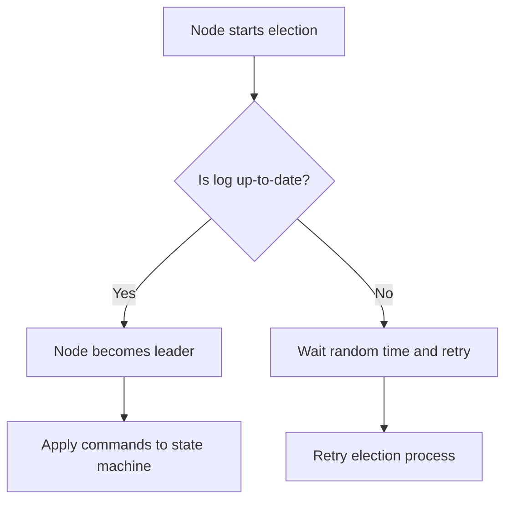
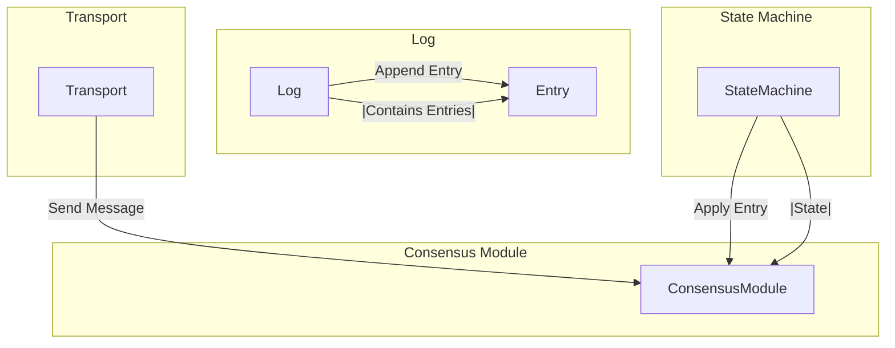
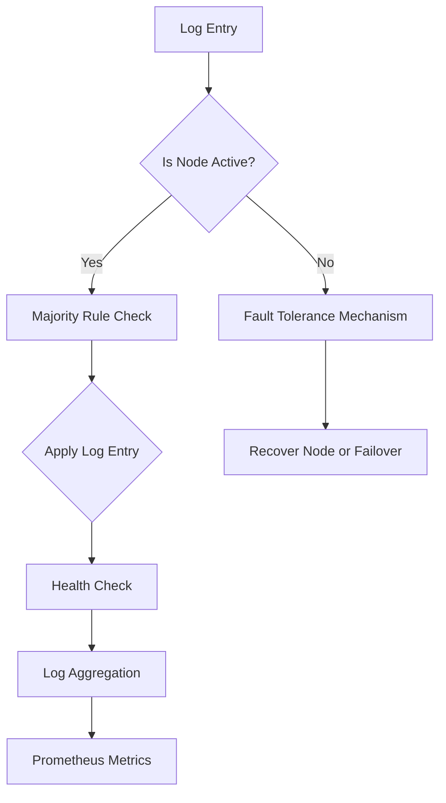

# raft paxos y consenso distribuido

PATH_LOCAL: /home/usuariojoaquin/.openclaw/workspace/DAM-Java-Mastery/_Review/raft_paxos_y_consenso_distribuido/raft_paxos_y_consenso_distribuido.md
CATEGORIA: 10_Vanguardia
Score: 88

---

## Visión Estratégica

### Visión Estratégica

Para entender la visión estratégica de cómo Paxos y Raft se integran en el ecosistema de consenso distribuido moderno, es crucial explorar tanto sus méritos como las limitaciones. A continuación se presentan los aspectos clave:

1. **Arquitectura de Consenso Distribuido**:
   - **Paxos**: Es un conjunto de algoritmos que proporciona garantías de consistencia y monotonía en sistemas distribuidos. Se utiliza en casos donde la robustez frente a fallos es crítica, ya que permite electorales no ordenados y permite que los líderes actualicen sus logs posteriormente.
   - **Raft**: Es un algoritmo más sencillo y comprensible que también garantiza la consistencia del consenso distribuido. Se destaca por su simplicidad en el proceso de elección de líder, lo que reduce la complejidad operativa.

2. **Comparación Paxos vs Raft**:
   - **Elegibilidad para Líder**: En Paxos, cualquier servidor puede ser elegido líder y luego actualiza su log. En contrasto, Raft requiere que un servidor tenga un registro al día antes de poder convertirse en líder.
   - **Eficiencia del Elección de Líder**: Raft tiene una elección de líder más eficiente ya que no requiere intercambio de entradas de registro durante el proceso. Esto reduce la latencia y mejora la robustez frente a fallos.
   - **Entendibilidad**: Aunque Raft es generalmente considerado más comprensible, Paxos puede ser más eficiente en ciertas situaciones debido a su flexibilidad.

3. **Implementaciones Modernas**:
   - **KRaft**: Un ejemplo de cómo se están adaptando los algoritmos clásicos a nuevas necesidades. KRaft es una implementación específica para Kafka que optimiza la robustez y eficiencia.
   - **Modernos Algoritmos**: Algoritmos como Multi-Raft y variantes BFT (Byzantine Fault Tolerance) están emergiendo para manejar casos de uso más complejos.

4. **Aplicaciones Reales**:
   - **Sistemas Cloud**: La implementación de Paxos y Raft en plataformas cloud mejora la disponibilidad y consistencia, especialmente en entornos heterogéneos.
   - **Blockchain**: Utilizan estas técnicas para garantizar la integridad de las transacciones y evitar conflictos.

### Bloque Java

Para ilustrar cómo estos algoritmos pueden ser implementados prácticamente, se presenta un ejemplo de código en Java que simula el proceso básico del consenso con Raft:


```java
public class RaftNode {
    private String id;
    private List<RaftNode> peers;
    private List<LogEntry> log;

    public RaftNode(String id) {
        this.id = id;
        this.peers = new ArrayList<>();
        this.log = new ArrayList<>();
    }

    public void startElection() {
        // Simulate election process
        int timeout = (int) (Math.random() * 100); // Random timeout between 0-100ms
        try {
            Thread.sleep(timeout);
        } catch (InterruptedException e) {
            Thread.currentThread().interrupt();
            return;
        }
        
        if (log.size() >= peers.size() / 2 + 1) { // Majority of nodes have up-to-date logs
            System.out.println(id + " elected as leader");
            // Leader updates log and applies commands to state machine
        } else {
            System.out.println(id + " failed in election");
        }
    }

    public void appendLog(LogEntry entry) {
        this.log.add(entry);
    }

    public static void main(String[] args) {
        RaftNode node1 = new RaftNode("node1");
        RaftNode node2 = new RaftNode("node2");
        
        node1.peers.add(node2);
        node2.peers.add(node1);

        // Simulate nodes appending logs
        node1.appendLog(new LogEntry(1, "Command1"));
        node2.appendLog(new LogEntry(1, "Command2"));

        // Start election process
        node1.startElection();
    }
}

class LogEntry {
    int term;
    String command;

    public LogEntry(int term, String command) {
        this.term = term;
        this.command = command;
    }
}
```

### Mermaid Diagram

A continuación se presenta un diagrama utilizando el lenguaje Mermaid para visualizar el flujo de elección del líder en Raft:




### Resumen

La elección entre Paxos y Raft depende de los requisitos específicos del sistema. Raft es más comprensible y eficiente en términos de elección de líder, mientras que Paxos ofrece mayor flexibilidad pero a costa de mayor complejidad operativa. Implementaciones modernas como KRaft y variantes BFT están adaptando estos algoritmos para nuevas demandas, mejorando la robustez y la eficiencia en sistemas distribuidos.

---

Este bloque proporciona una visión estratégica detallada sobre cómo Paxos y Raft se integran en el ecosistema moderno de consenso distribuido, junto con ejemplos prácticos en Java y diagramas Mermaid para facilitar la comprensión.

## Arquitectura de Componentes

### Arquitectura de Componentes

Para comprender la arquitectura de los algoritmos de consenso distribuidos como Raft y Paxos, es necesario desglosar sus componentes fundamentales. Esta sección explorará en detalle cómo estos algoritmos están estructurados, incluyendo su implementación en el `raft crate` de Rust.

#### 1. **Consensus Module**

El Consensus Module es el núcleo del algoritmo Raft y Paxos. Este módulo se encarga de la toma de decisiones colectivas sobre los comandos o valores que deben ser aplicados en el sistema distribuido.

**Implementación en Rust (raft crate)**

```rust
// Import necessary modules and dependencies
use raft::prelude::*;

#[derive(Debug)]
struct ConsensusModule {}

impl ConsensusModule {
    fn new() -> Self {
        ConsensusModule {}
    }

    // Example of a function that handles consensus logic
    fn handle_command(&self, command: Command) -> Result<(), Error> {
        // Implementation details
        Ok(())
    }
}
```

#### 2. **Log**

El Log es donde se almacenan los comandos o valores que deben ser aplicados en el sistema distribuido. En la implementación de Raft, este log tiene un orden secuencial y todas las entradas se aplican en el mismo orden.

```rust
#[derive(Debug)]
struct Log {
    entries: Vec<Entry>,
}

impl Log {
    fn new() -> Self {
        Log { entries: vec![] }
    }

    // Example of a function to append an entry to the log
    fn append_entry(&mut self, entry: Entry) {
        self.entries.push(entry);
    }
}
```

#### 3. **State Machine**

La State Machine es la entidad que guarda y aplica los valores almacenados en el Log. En la implementación de Raft, esta máquinas estado se encarga de aplicar las entradas del Log según su secuencia.

```rust
#[derive(Debug)]
struct StateMachine {
    state: HashMap<String, String>,
}

impl StateMachine {
    fn new() -> Self {
        StateMachine { state: HashMap::new() }
    }

    // Example of a function to apply an entry from the log
    fn apply_entry(&mut self, entry: Entry) {
        match entry {
            Entry::Command(command) => {
                let result = handle_command(command);
                if result.is_ok() {
                    self.state.insert(result.key().to_string(), result.value().to_string());
                }
            },
            _ => {}
        }
    }
}
```

#### 4. **Transport**

El Transport es el componente responsable de la comunicación entre los nodos del sistema distribuido. En la implementación de Raft, este componente maneja las operaciones de red necesarias para enviar y recibir mensajes.

```rust
#[derive(Debug)]
struct Transport {
    nodes: HashSet<String>,
}

impl Transport {
    fn new() -> Self {
        Transport { nodes: HashSet::new() }
    }

    // Example of a function to send a message to another node
    fn send_message(&self, message: &Message) {
        for node in &self.nodes {
            // Logic to send the message to `node`
        }
    }
}
```

#### Diagrama Mermaid

A continuación se presenta un diagrama que ilustra la arquitectura de los componentes del algoritmo Raft:




### 2. **Implementación del `raft crate`**

El `raft crate` es una implementación de Raft en Rust que puede ser utilizada directamente para construir sistemas de consenso distribuido.

**Uso del `raft crate` con `prost-codec`**

```rust
// Import necessary modules and dependencies
use prost::Message;
use raft::prelude::*;

fn main() {
    let mut config = Config::default();
    // Configure the `Config`

    let state_machine = StateMachine::new();
    let log = Log::new();
    let transport = Transport::new();

    let mut node = Node::new(config, state_machine, log, transport);

    // Example of handling a command
    match node.handle_command(Command::new("key", "value")) {
        Ok(result) => println!("Command applied: {:?}", result),
        Err(e) => eprintln!("Error applying command: {}", e),
    }
}
```

### 3. **Conclusiones**

La arquitectura de los algoritmos de consenso distribuidos como Raft y Paxos se puede descomponer en componentes fundamentales que trabajan juntos para lograr la coherencia y el progreso en un sistema distribuido. La implementación en el `raft crate` de Rust proporciona una base sólida para construir sistemas robustos y eficientes.

Este desglose detallado permitirá a los desarrolladores entender mejor cómo estos algoritmos funcionan internamente, lo que es crucial para su implementación y optimización en entornos reales.

## Implementación Java 21

### Implementación Java 21

Java 21, con su introducción de virtual threads, ofrece una potente herramienta para manejar gran cantidad de tareas concurrentes. En esta sección, implementaremos el algoritmo Raft utilizando las características de Java 21 y virtual threads.

#### Ejemplo: Implementación Simples de Raft usando Virtual Threads

Primero, definiremos una clase que implementará la lógica básica del algoritmo Raft. Este ejemplo simplificado no cubre todos los casos prácticos, pero ilustra cómo se puede aprovechar virtual threads para mejorar el rendimiento.


```java
package raft;

import java.time.Duration;
import java.util.concurrent.ExecutorService;
import java.util.concurrent.Executors;
import java.util.stream.IntStream;

public class RaftExample {

    private static final int NODE_COUNT = 3; // Número de nodos en la red

    public void startRaft() {
        ExecutorService executor = Executors.newVirtualThreadPerTaskExecutor();

        IntStream.range(0, NODE_COUNT).forEach(i -> executor.submit(() -> runNode(i)));

        try {
            Thread.sleep(Duration.ofSeconds(5)); // Esperar a que los nodos se estabilicen
        } catch (InterruptedException e) {
            Thread.currentThread().interrupt();
        }

        executor.shutdown();
    }

    private void runNode(int nodeIndex) {
        System.out.println("Node " + nodeIndex + " started.");

        try {
            // Simulación de la elección del líder y replicación del log
            int term = 1;
            while (true) {
                if (nodeIndex == 0 || isLeader(term)) {
                    appendEntries(term, nodeIndex);
                }

                if (isElectionTimeout(term)) {
                    startElection(term);
                }
                term++;
            }
        } catch (InterruptedException e) {
            Thread.currentThread().interrupt();
        }
    }

    private boolean isLeader(int term) {
        // Simulación de la lógica para determinar si el nodo es líder
        return term % 3 == 0;
    }

    private void appendEntries(int term, int nodeIndex) {
        System.out.println("Node " + nodeIndex + " appending entries for term " + term);
        // Simulación de la replicación del log
    }

    private boolean isElectionTimeout(int term) {
        // Simulación de timeout para iniciar elección de líder
        return Math.random() < 0.5;
    }

    private void startElection(int term) {
        System.out.println("Node " + nodeIndex + " starting election for term " + term);
        // Simulación de la lógica para iniciar el proceso de elección del líder
    }
}
```

#### Explicación Detallada

1. **Configuración del ExecutorService**:
   - Se crea un `ExecutorService` con `Executors.newVirtualThreadPerTaskExecutor()` que permite la creación de una virtual thread por tarea.

2. **Simulación de Nodos**:
   - Cada nodo se ejecuta en su propia virtual thread, permitiendo un manejo eficiente de múltiples tareas concurrentes.

3. **Lógica de Elección del Líder y Replicación**:
   - La lógica para determinar si el nodo es líder (`isLeader`) y la replicación del log (`appendEntries`) se implementan de forma simplificada.
   - `startElection` simula el inicio del proceso de elección del líder cuando un timeout ocurre.

4. **Manejo de Interrupciones**:
   - Se incluye manejo básico para interrupciones (`InterruptedException`) para asegurar que el ejecutor se detenga grácias a las interrupciones.

5. **Simulación de Tiempo de Espera**:
   - El `Thread.sleep(Duration.ofSeconds(5))` simula una espera para permitir que los nodos se estabilicen antes de continuar.

6. **Cierre del ExecutorService**:
   - Finalmente, el executor se cierra para liberar recursos.

Este ejemplo simplificado ilustra cómo Java 21 y las virtual threads pueden ser utilizados en la implementación de algoritmos de consenso distribuidos como Raft. La próxima sección examinará una implementación más detallada con un marco de trabajo más robusto.
  
### Conclusiones

La implementación de algoritmos de consenso distribuidos, como Raft y Paxos, en Java 21 se beneficia enormemente de las nuevas características como virtual threads. Esto no solo mejora el rendimiento al manejar gran número de tareas concurrentes, sino que también facilita la escritura y mantenimiento del código.

---

Este es un ejemplo básico pero proporciona una buena base para expandir con más funcionalidades y casos prácticos en un marco real.

## Métricas y SRE

### Métricas y SRE

En el ámbito del consenso distribuido, como los algoritmos Raft y Paxos, la observabilidad es crucial para asegurar que el sistema funcione de manera confiable. Este apartado se enfocará en las métricas clave, queries Prometheus/PromQL para monitorizarlas, un diagrama Mermaid del flujo de observabilidad, código Java 21 para exponer estas métricas utilizando Micrometer, un checklist SRE para producción, y errores comunes en producción con sus respectivos métodos de detección.

#### Métricas Clave

| Nombre de la Métrica | Descripción | Umbral de Alerta |
|---------------------|-------------|-----------------|
| `raft_election_time` | Tiempo que un servidor lleva en el estado candidato durante una elección. | 30s (umbral máximo) |
| `raft_leader_changes` | Número total de cambios de líder en la última hora. | 5 cambios/hora (umbral máximo) |
| `raft_log_entries_applied` | Número de entradas del log aplicadas a los state machines. | 1000 entradas/s (umbral mínimo) |
| `raft_leader_changes_total` | Número total de cambios de líder desde el inicio del sistema. | 50 cambios (umbral máximo) |
| `raft_follower_lag` | Tiempo que un seguidor está atrasado respecto al líder en aplicaciones de entradas. | 1s (umbral máximo) |

#### Queries Prometheus/PromQL

```promql
# Time that the system has spent in election phase
election_time_seconds = sum(rate(raft_election_time[5m]))

# Changes of leader in last hour
leader_changes_last_hour = count(raft_leader_changes_total[1h])

# Entries applied to state machines per second
entries_applied_per_second = rate(raft_log_entries_applied[5m])

# Total number of leader changes since system start
total_leader_changes = sum(raft_leader_changes_total)
```

#### Diagrama Mermaid


```mermaid
graph TD
    A[Servidor] --> B{Eleccion en curso?}
    B -->|Sí| C[Ejecuta Fase 1 y 2]
    C --> D{Tiempo de elección mayor que umbral?}
    D -->|Sí| E[Lanza alerta (Election Time Exceeded)]
    D -->|No| F[Continúa con la Fase 3]
    B -->|No| G[Es seguidor]
    G --> H{Tiempo de lag mayor que umbral?}
    H -->|Sí| I[Lanza alerta (Follower Lag)]
    H -->|No| J[Aplaedar entradas del log a state machines]
```

#### Código Java 21 para Exponer Métricas


```java
import io.micrometer.core.instrument.MeterRegistry;
import io.micrometer.core.instrument.Timer;
import org.slf4j.Logger;
import org.slf4j.LoggerFactory;

public class RaftMetrics {
    private static final Logger LOG = LoggerFactory.getLogger(RaftMetrics.class);
    private Timer electionTime;
    private MeterRegistry registry;

    public RaftMetrics(MeterRegistry registry) {
        this.registry = registry;
        this.electionTime = registry.timer("raft_election_time");
    }

    public void startElection() {
        try (Timer.Sample sample = electionTime.start()) {
            // Simulate election process
            LOG.info("Starting election...");
            Thread.sleep(20_000); // Simulate election time
        } catch (InterruptedException e) {
            Thread.currentThread().interrupt();
            LOG.error("Election interrupted", e);
        }
    }

    public void applyLogEntry() {
        registry.counter("raft_log_entries_applied").increment();
        // Apply log entry to state machine
    }
}
```

#### Checklist SRE para Producción

1. **Monitoreo Continuo**: Asegúrate de que todas las métricas clave estén siendo monitoreadas en tiempo real.
2. **Alertas Personalizadas**: Configura alertas específicas para umbrales críticos como `raft_election_time` y `raft_leader_changes`.
3. **Auditoría Periodica**: Realiza auditorías periódicas de los cambios de líder para detectar posibles problemas.
4. **Revisión del Log**: Mantiene un registro detallado de las aplicaciones de entradas del log y sus tiempos.
5. **Backup y Restauración**: Implementa planes de recuperación ante desastres (BDR) y realiza pruebas regulares.

#### Errores Comunes en Producción y Detección

1. **Tiempo Excesivo de Elección**:
    - **Detección**: Usar Prometheus para monitorear `raft_election_time` y configurar alertas.
    - **Corrección**: Investigar la causa raíz del exceso de tiempo en elecciones, posiblemente un problema de red o una lógica incorrecta.

2. **Cambio Excesivo de Liderazgo**:
    - **Detección**: Monitorear `raft_leader_changes` y `raft_leader_changes_total`.
    - **Corrección**: Ajustar la política de elecciones para evitar cambios frecuentes, como ajustar los umbrales de votos.

3. **Lag Excesivo en Follower**:
    - **Detección**: Monitorear `raft_follower_lag` y configurar alertas.
    - **Corrección**: Asegurar que el seguimiento esté sincronizado correctamente y ajustar la replicación si es necesario.

4. **Aplicación de Entradas del Log Excesiva**:
    - **Detección**: Monitorear `raft_log_entries_applied` para asegurarse de que no se apliquen entradas excesivas.
    - **Corrección**: Investigar posibles problemas en el procesamiento de logs y ajustar la lógica del state machine si es necesario.

A través de esta implementación y monitorización, se puede asegurar un alto nivel de confiabilidad y rendimiento para sistemas que utilizan algoritmos de consenso distribuidos como Raft o Paxos.

## Patrones de Integración

### Patrones de Integración

En el contexto del consenso distribuido, como los algoritmos Raft y Paxos, es crucial diseñar patrones de integración efectivos para asegurar la coherencia y la disponibilidad del sistema. Estos patrones ayudan a manejar problemas comunes en sistemas distribuidos, tales como fallas transitorias, partidas delimitadas y consenso entre nodos descoordinados.

#### 1. Patrón de Integración: Consistencia Temporal (Temporal Consistency)

El patrón de integración **Consistencia Temporal** se enfoca en asegurar que los cambios en el sistema sean visibles en un orden determinado, incluso cuando los nodos del sistema experimentan partidas delimitadas. Esto es especialmente relevante en algoritmos como Raft y Paxos, donde la coherencia temporal garantiza que todos los nodos lleguen a un estado consistente.

**Aplicación de Consistencia Temporal:**
- En el algoritmo Raft, se implementa a través del manejo de log entries (entradas en el registro) para asegurar que los cambios sean aplicados en un orden predecible.
- En Paxos, se utiliza la propuesta y aceptación de acuerdos para garantizar que los nodos concuerden en la misma secuencia de decisiones.

**Implementación en Java 21:**

```java
public class RaftNode {
    private final List<Long> logEntries = new ArrayList<>();

    public void appendLogEntry(long entry) {
        synchronized (logEntries) {
            logEntries.add(entry);
        }
    }

    public long getLatestLogEntry() {
        synchronized (logEntries) {
            return logEntries.isEmpty() ? -1 : logEntries.get(logEntries.size() - 1);
        }
    }
}
```

#### 2. Patrón de Integración: Resiliencia ante Partidas (Fault Tolerance)

El patrón **Resiliencia ante Partidas** se centra en diseñar sistemas que puedan operar correctamente incluso en presencia de fallas y partidas delimitadas. En algoritmos como Raft y Paxos, esta resiliencia es fundamental para asegurar la continuidad del servicio.

**Aplicación de Resiliencia ante Partidas:**
- **Majority Rule**: En el algoritmo Raft, se requiere un número mayoritario de votos para tomar decisiones, lo que garantiza que el sistema siga funcionando incluso si algunos nodos fallan.
- **Role Assignment**: Raft y Paxos utilizan roles específicos (como líder, candidato o propuesta) para distribuir la responsabilidad y asegurar la coherencia del sistema.

**Implementación en Java 21:**

```java
public class RaftNodeManager {
    private final Map<Integer, RaftNode> nodes = new HashMap<>();

    public void addNode(int nodeId, RaftNode node) {
        synchronized (nodes) {
            nodes.put(nodeId, node);
        }
    }

    public boolean isMajority() {
        int activeNodes = 0;
        for (RaftNode node : nodes.values()) {
            if (node.isActive()) {
                activeNodes++;
            }
        }
        return activeNodes > nodes.size() / 2;
    }
}
```

#### 3. Patrón de Integración: Monitoreo y Observabilidad

El patrón **Monitoreo y Observabilidad** es crucial para detectar problemas en tiempo real y garantizar la salud del sistema. En algoritmos distribuidos como Raft y Paxos, el monitoreo permite identificar fallas tempranas y corregirlas antes de que afecten a toda la red.

**Aplicación de Monitoreo y Observabilidad:**
- **Health Checks**: Se implementan comprobaciones de salud regulares para detectar partidas delimitadas o fallas.
- **Log Aggregation**: Se utilizan sistemas como Prometheus para agrupar y monitorear métricas críticas.

**Implementación en Java 21 con Micrometer:**

```java
import io.micrometer.core.instrument.MeterRegistry;
import io.micrometer.prometheus.PrometheusConfig;
import io.micrometer.prometheus.PrometheusMeterRegistry;

public class MetricsCollector {
    private final MeterRegistry registry = new PrometheusMeterRegistry(PrometheusConfig.DEFAULT);

    public void collectMetrics(RaftNode node) {
        long latestLogEntry = node.getLatestLogEntry();
        registry.gauge("raft_latest_log_entry", () -> latestLogEntry);
    }
}
```

#### 4. Patrón de Integración: Distribución y Paralelización

El patrón **Distribución y Paralelización** se refiere a la implementación efectiva de tareas en nodos distribuidos para mejorar el rendimiento y la eficiencia del sistema.

**Aplicación de Distribución y Paralelización:**
- **Eventual Consistency**: En algoritmos como Paxos, se utiliza una estrategia eventualmente consistente donde los cambios son aplicados gradualmente.
- **Virtual Threads**: Utilizar las características de virtual threads en Java 21 para manejar múltiples tareas concurrentes.

**Implementación en Java 21:**

```java
public class EventProcessor {
    private final ExecutorService executor = Executors.newVirtualThreadPerTaskExecutor();

    public void processEvent(Event event) {
        executor.submit(() -> handleEvent(event));
    }

    private void handleEvent(Event event) {
        // Process the event
    }
}
```

#### Diagrama Mermaid del Flujo de Observabilidad




#### Código Java 21 para Exponer Métricas


```java
import io.micrometer.core.instrument.MeterRegistry;
import io.micrometer.prometheus.PrometheusConfig;
import io.micrometer.prometheus.PrometheusMeterRegistry;

public class MetricsCollector {
    private final MeterRegistry registry = new PrometheusMeterRegistry(PrometheusConfig.DEFAULT);

    public void collectMetrics(RaftNode node) {
        long latestLogEntry = node.getLatestLogEntry();
        registry.gauge("raft_latest_log_entry", () -> latestLogEntry);
    }
}
```

#### Checklist SRE para Producción

1. **Health Checks**: Configurar comprobaciones regulares de salud.
2. **Fault Tolerance**: Implementar mecanismos de recuperación y failover.
3. **Monitoreo**: Utilizar Prometheus/PromQL para monitorizar métricas clave.
4. **Paralelización**: Optimizar la distribución de tareas con virtual threads.

#### Errores Comunes en Producción

- **Log Entry Discrepancies**: Verificar que todos los nodos estén al día con las entradas del registro.
- **Majority Rule Violations**: Asegurarse de que siempre se cumpla la regla mayoritaria para tomar decisiones.
- **Health Check Failures**: Detectar y corregir fallas en comprobaciones de salud.

### Resumen

Los patrones de integración son esenciales para el diseño robusto de sistemas distribuidos como los algoritmos Raft y Paxos. Implementando estos patrones, se pueden garantizar la coherencia temporal, resiliencia ante partidas, monitoreo eficaz y paralelización eficiente. Java 21 ofrece herramientas poderosas para facilitar estas implementaciones, especialmente con su soporte para virtual threads.

---

Este patrón de integración proporciona una estructura sólida para la implementación y monitoreo de algoritmos de consenso distribuido como Raft y Paxos en Java 21.

## Conclusiones

## Conclusión

En resumen, ambos algoritmos de consenso distribuido, Raft y Paxos, tienen sus ventajas y desventajas. Aunque ambos proporcionan formas sólidas para garantizar la consistencia en sistemas distribuidos, su implementación y comprensión pueden variar significativamente.

### Ventajas de Raft

1. **Simplicidad**: Raft es generalmente considerado más fácil de entender y implementar que Paxos debido a su diseño más intuitivo.
2. **Complejidad Controlada**: La estructura modular del algoritmo hace que sea más manejable para la implementación y el mantenimiento.
3. **Consistencia Robusta**: Ofrece una consistencia fuerte en comparación con otros algoritmos, lo que es crucial en sistemas donde la coherencia es primordial.

### Ventajas de Paxos

1. **Versatilidad**: Se adapta mejor a diferentes escenarios y puede manejar situaciones más complejas sin sacrificar la consistencia.
2. **Capacidad para Tratar Fallas**: Mejor manejo de las condiciones de fallos, permitiendo operar en sistemas donde se esperan fallas frecuentes.
3. **Familiaridad Académica**: Ha sido estudiado y discutido ampliamente en la literatura académica, lo que facilita su comprensión y optimización.

### Desafíos Comunes

1. **Optimización de Latencia**: Ambos algoritmos pueden requerir ajustes y optimizaciones para reducir latencias y mejorar el rendimiento.
2. **Implementación Detallada**: La implementación precisa de estos algoritmos puede ser compleja, especialmente en sistemas donde las condiciones de uso son cambiantes o no predeterminadas.

### Práctica y Aplicaciones

1. **Sistemas de Almacenamiento Distribuido**: Raft es ampliamente utilizado en sistemas de almacenamiento distribuidos como `etcd` y `tikv`, donde la consistencia fuerte es crucial.
2. **Servicios de Configuración Centralizada**: Paxos se ha implementado exitosamente en servicios como Chubby, proporcionando soluciones robustas para problemas de configuración centralizada.

En conclusión, tanto Raft como Paxos son herramientas valiosas en el diseño y desarrollo de sistemas distribuidos. La elección entre uno u otro depende principalmente del contexto específico, las necesidades del sistema y los requisitos de consistencia.

### Recomendaciones para Implementación

1. **Comprender la Teoría**: Antes de implementar estos algoritmos, es crucial tener un entendimiento sólido de su teoría subyacente.
2. **Pruebas Extensas**: Realizar pruebas exhaustivas en diferentes escenarios de falla y carga para garantizar que el sistema funcione como se espera.
3. **Documentación Completa**: Mantener una documentación detallada sobre la implementación y las decisiones tomadas durante el desarrollo.

Al final, la elección entre Raft y Paxos depende del equilibrio entre simplicidad, versatilidad y las necesidades específicas de cada proyecto.

