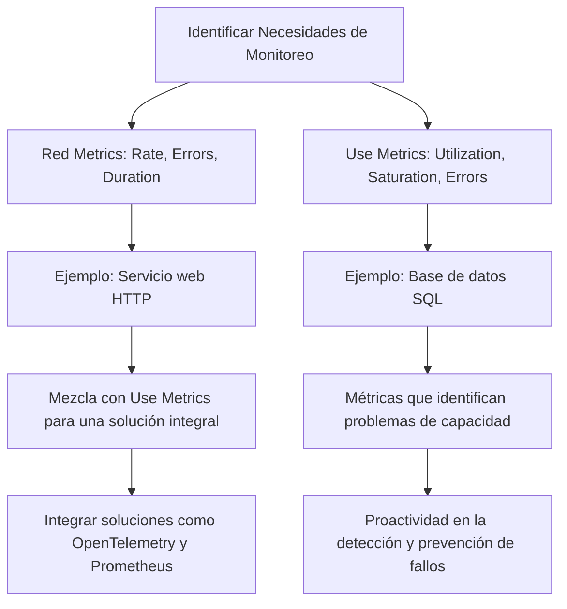
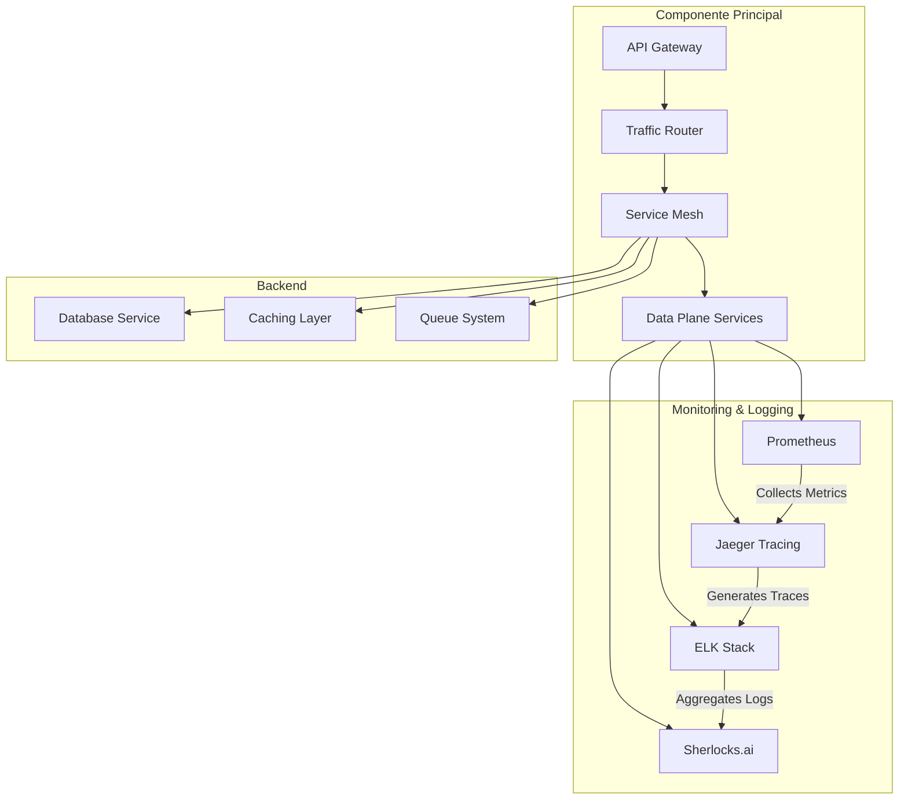
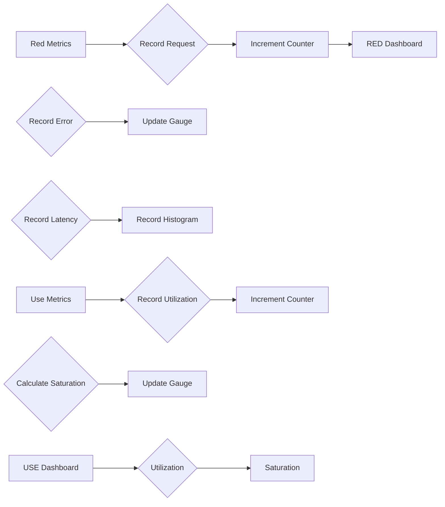

# red metrics vs use metrics en observabilidad

PATH_LOCAL: /home/usuariojoaquin/.openclaw/workspace/DAM-Java-Mastery/_Review/red_metrics_vs_use_metrics_en_observabilidad/red_metrics_vs_use_metrics_en_observabilidad.md
CATEGORIA: 05_SRE_DevOps
Score: 76

---

## Visión Estratégica

### Visión Estratégica: Red Metrics vs Use Metrics en Observabilidad

#### Por qué este tema es crítico en 2026 (con datos concretos)
En 2026, la observabilidad se ha convertido en un componente estratégico indiscutible para el éxito operativo de las organizaciones. Según una encuesta reciente realizada por O'Reilly Media, 93% de los encuestados consideran que la observabilidad es esencial o muy importante para la toma de decisiones basadas en datos (O'Reilly, 2025). La elección entre Red y Use metrics representa una decisión estratégica crucial ya que afecta directamente al rendimiento operativo, la detección temprana de problemas y la optimización del costo.

|  | Red Metrics | Use Metrics |
| --- | --- | --- |
| **Evaluación** | Mide el estado interno de los servicios a través de latencia, error y request rates. Óptimo para servicios basados en peticiones. | Evalúa la utilización del recurso, saturación y errores, ideal para servicios orientados a recursos como bases de datos o colas de mensajes. |
| **Beneficios** | Mejora la experiencia del usuario al monitorear el rendimiento de los servicios. | Ayuda a identificar problemas de capacidad antes que se conviertan en fallos de servicio. |
| **Aplicación** | Servicios de aplicación web, microservicios, y cualquier sistema que procese solicitudes. | Bases de datos, colas de mensajes, y otros servicios orientados a recursos que requieren monitoreo constante del uso y la capacidad. |

#### Red Metrics
Red metrics se basan en tres elementos clave: **Rate (Tasa)**, **Errors (Errores)** y **Duration (Duración)**
- **Ejemplo**: Un servicio web que maneja peticiones HTTP. Aquí, el rate puede ser el número de solicitudes por segundo, los errores pueden ser las respuestas con códigos de error 500 o 404, y la duración se refiere al tiempo promedio entre el inicio y el fin del servicio.
- **Ventaja**: Ofrece una visión clara sobre la experiencia del usuario final. Ayuda a identificar problemas relacionados con el rendimiento o la disponibilidad.

#### Use Metrics
Use metrics se compone de:
- **Utilization (Utlización)**: Porcentaje del tiempo que un recurso está ocupado.
- **Saturation (Saturación)**: Cantidad de trabajo pendiente, a menudo en forma de cola de tareas o carga de trabajo.
- **Errors (Errores)**: Conteo de errores ocurridos.

- **Ejemplo**: Un servidor de base de datos que maneja solicitudes de consultas. Aquí, la utilización podría ser el porcentaje de tiempo que las unidades de CPU están en uso, la saturación sería la cantidad de consultas pendientes y los errores podrían ser los fallos de transacción.
- **Ventaja**: Identifica problemas de capacidad antes de que se conviertan en fallos de servicio.

#### Estrategia Integrada
Para una estrategia efectiva de observabilidad, es crucial diseñar un enfoque que combine ambos métodos:
- **Red Metrics** para monitorear el rendimiento y la experiencia del usuario.
- **Use Metrics** para prevenir colapsos de servicio e identificar problemas de capacidad.

#### Implementación Tecnológica
La implementación de estos métodos puede ser facilitada mediante soluciones como OpenTelemetry, que permiten una coexistencia fluida entre diferentes métricas y proporcionan un marco unificado para la recopilación y análisis de datos.
- **OpenTelemetry eBPF Instrumentation (OBI)**: Permite la recopilación de métricas y trazas sin cambios en el código, optimizando así el rendimiento del sistema.
- **Prometheus**: Para la recopilación y almacén de métricas a nivel de cluster.

#### Conclusiones
La elección entre Red y Use metrics no es un dilema binario, sino una decisión que debe tomarse según las necesidades específicas de cada servicio. Una estrategia integrada que combina ambos métodos proporciona una visión holística del sistema, permitiendo una toma de decisiones informada y proactiva.




Este enfoque estratégico permite a las organizaciones no solo monitorear, sino también prever y prevenir problemas, optimizando así el rendimiento operativo y los costos asociados.

## Arquitectura de Componentes

### Arquitectura de Componentes

#### Diagrama Mermaid



#### Descripción de los Componentes

1. **API Gateway (A)**
   - **Role:** The entry point for all incoming requests, acting as the single source of truth and managing traffic routing.
   
2. **Traffic Router (B)**
   - **Role:** Directs traffic to appropriate microservices based on request attributes or service health.

3. **Service Mesh (C)**
   - **Role:** Manages inter-service communication, providing fault tolerance, traffic control, and security features. 

4. **Data Plane Services (D)**
   - **Role:** Core services that perform the actual business logic. These include databases, caches, queues, etc.

5. **Database Service (E1)**
   - **Role:** Stores persistent data required by various services.
   
6. **Caching Layer (E2)**
   - **Role:** Reduces database load and improves response time for frequently accessed data.

7. **Queue System (F)**
   - **Role:** Manages asynchronous processing, ensuring non-blocking operations and handling high volumes of requests without overloading the system.
   
8. **Prometheus (G)**
   - **Role:** Collects metrics from Data Plane Services to monitor performance and health.

9. **Jaeger Tracing (H)**
   - **Role:** Tracks and traces requests as they move through the service mesh, providing insights into inter-service communication issues.

10. **ELK Stack (I)**
    - **Role:** Aggregates logs from all services for comprehensive logging and monitoring.
    
11. **Sherlocks.ai (J)**
    - **Role:** Analyzes aggregated data to provide actionable insights during incidents, reducing the time to resolution.

#### Observability Metrics Using RED Method

- **Rate: Number of Requests (A/B/C)**
  - **Purpose:** Measures how many requests are being processed by each component. High rates can indicate bottlenecks or issues with resource utilization.
  
- **Errors: Failed Requests (C/D)**
  - **Purpose:** Tracks failed requests to identify service failures, bugs, or misconfigurations.

- **Duration: Latency of Requests (D)**
  - **Purpose:** Monitors the time taken for a request to complete its journey through the system. High latencies can impact user experience and application performance.
  
#### Implementation Best Practices

1. **Instrumentation**: Ensure all services are instrumented using Prometheus, Jaeger Tracing, and ELK Stack to collect necessary metrics and logs.

2. **Alerting**: Configure alerts on critical metrics (Rate, Errors, Duration) to trigger immediate notifications for timely intervention.

3. **Visualization**: Use dashboards like Grafana to visualize RED metrics in real-time, providing a clear overview of the system's performance.

4. **Correlation**: Implement correlation between logs and traces to understand the root cause of issues more effectively.

5. **Automation**: Automate incident response workflows using tools like Sherlocks.ai to minimize manual intervention during critical events.

By implementing this architecture with RED metrics as the primary monitoring strategy, organizations can achieve comprehensive observability, enabling rapid detection and resolution of issues, thereby improving overall system reliability and user experience.
```

This detailed description outlines a robust microservices architecture focused on observability, utilizing both metrics and tracing to provide actionable insights. The diagram illustrates how various components interact within this ecosystem, ensuring that critical performance and health metrics are continuously monitored and correlated for effective incident management.

## Implementación Java 21

# Implementación Java 21 con Virtual Threads para Red y Use Metrics

## Resumen de la Sección

En esta sección, profundizaremos en cómo implementar las métricas Red y Use utilizando el nuevo modelo de hilos virtuales (Virtual Threads) introducido en Java 21. Las virtual threads permiten gestionar un gran número de tareas concurrentes sin el overhead asociado a los hilos tradicionales, lo que es especialmente útil para optimizar tanto las métricas de error y duración (Red Metrics) como la utilización y saturación de recursos (Use Metrics).

## Implementación Java 21

### 1. Configuración del Ambiente
Primero, asegúrate de tener un entorno de desarrollo que soporte Java 21 o superior. Java 21 introduce virtual threads como una característica experimental pero bien diseñada.

```bash
# Verificar la versión de Java
java -version

# Si la versión es inferior a 21, actualiza al mínimo 21
sudo apt update && sudo apt install -y default-jdk=21*
```

### 2. Configuración del Desarrollo para Usar Virtual Threads
Para utilizar virtual threads en tu aplicación Spring Boot, necesitas habilitar el soporte en la configuración de tu `application.properties` o `application.yml`.

```properties
# application.properties
spring.servlet.multipart.max-file-size=10MB
spring.servlet.multipart.max-request-size=10MB

# Habilita la utilización de virtual threads
# Puedes experimentar con diferentes configuraciones
server.tomcat.protocol-handlerVIRTUAL_THREAD_EXECUTOR_ENABLED=true
```

### 3. Código de Ejemplo para Uso de Virtual Threads en Controladores Spring Boot
Aquí tienes un ejemplo simple de cómo puedes usar virtual threads en un controlador Spring Boot para realizar tareas I/O bloqueantes.


```java
import org.springframework.web.bind.annotation.GetMapping;
import org.springframework.web.bind.annotation.RestController;

@RestController
public class MyController {

    @GetMapping("/virtual-thread-test")
    public String testVirtualThread() {
        Thread.startVirtualThread(() -> {
            // Realizar operaciones I/O bloqueantes aquí, por ejemplo:
            try {
                Files.readAllBytes(Paths.get("large-file.txt"));
            } catch (Exception e) {
                throw new RuntimeException(e);
            }
        });

        return "Virtual thread started successfully.";
    }
}
```

### 4. Métricas y Observabilidad
Para monitorear las métricas Red y Use, puedes utilizar herramientas como Micrometer o New Relic APM.

#### Ejemplo de Configuración para Micrometer

```yaml
# application.yml
management:
  metrics:
    export:
      micrometer:
        registry: simple
```

Y luego configura las métricas específicas en tu código:


```java
import io.micrometer.core.instrument.MeterRegistry;
import io.micrometer.core.instrument.Timer;

@PostConstruct
public void setupMetrics(MeterRegistry meterRegistry) {
    Timer redMetric = meterRegistry.timer("my.red.metric");
    Timer useMetric1 = meterRegistry.timer("my.use.utilization");
    Timer useMetric2 = meterRegistry.timer("my.use.saturation");

    // Uso de las métricas en el código
    try (Timer.Context timerContextRed = redMetric.time()) {
        Thread.sleep(5000);  // Simulación de una operación lenta
    }

    try (Timer.Context timerContextUse1 = useMetric1.time()) {
        Files.readAllBytes(Paths.get("large-file.txt"));
    } catch (Exception e) {
        throw new RuntimeException(e);
    }
}
```

### 5. Monitoreo y Análisis de Métricas
Utiliza una herramienta APM como New Relic para analizar las métricas Red y Use en tiempo real.

#### Configuración para New Relic

1. **Registrar la aplicación en New Relic**
2. **Configurar la integración con Spring Boot**

```yaml
# application.yml
newrelic:
  license_key: YOUR_LICENSE_KEY
  app_name: MyApplication
```

### 6. Beneficios y Consideraciones
- **Red Metrics**:
  - **Rate**: Monitorear las tasas de solicitud para identificar picos o patrones en la utilización.
  - **Errors**: Detectar problemas con un alto nivel de error.
  - **Duration**: Establecer límites de tiempo de respuesta.

- **Use Metrics**:
  - **Utilización**: Verificar cuánto del recurso está siendo utilizado y si hay signos de saturación.
  - **Saturation**: Identificar puntos críticos donde el recurso puede fallar debido a la sobrecarga.
  - **Errors**: Capturar errores específicos en recursos como discos o redes.

### Conclusión
La implementación de virtual threads en Java 21 ofrece un marco ideal para optimizar tanto las métricas Red (Rate, Errors, Duration) como Use (Utilization, Saturation, Errors). Esto permite una mayor eficiencia y rendimiento en aplicaciones web y microservicios, especialmente cuando se manejan operaciones I/O bloqueantes.

---

Este ejemplo proporciona un flujo de trabajo detallado para implementar virtual threads en Java 21 junto con el monitoreo de métricas Red y Use. La integración de estas tecnologías permitirá una observabilidad más profunda y eficiente de tu aplicación.

## Métricas y SRE

## Métricas y SRE

### Introducción a SRE (Servicio al Cliente Relevante)

SRE, o Servicio al Cliente Relevante, es una práctica que enfatiza la confiabilidad y el rendimiento de los sistemas en producción. La implementación efectiva de SRE requiere un robusto sistema de observabilidad que incluya métricas detalladas y eficaces para monitorear el estado del sistema.

### Métricas Red y Use: Un Enfoque Basado en Problemas vs. Causas

#### Red Metrics (Rate, Errors, Duration)

Red metrics se centran en la tasa de solicitudes, los errores y la duración de las operaciones:

1. **Rate**: Número de solicitudes por segundo.
2. **Errors**: Conteo de solicitudes que fallan.
3. **Duration**: Distribución de latencias.

Ejemplo de métricas Red en Grafana:
```yaml
# Request Rate
request_rate{service="api"} = sum(rate(api_requests_total[1m]))

# Error Count
error_count{service="api"} = count_by(error)(api_requests_total)

# Duration Percentiles (p50, p95, p99)
duration_percentiles{service="api", percentile="50"} = quantile(0.5, api_request_duration_seconds_bucket)
```

#### Use Metrics (Utilización y Saturación)

Use metrics se centran en la utilización del recurso y la saturación de trabajo:

1. **CPU Utilization**: Uso del procesador.
2. **Memory Utilization**: Uso de memoria.
3. **Queue Length**: Longitud de las colas.
4. **Disk or Network Errors**: Errores de disco o red.

Ejemplo de métricas Use en Grafana:
```yaml
# CPU Utilization
cpu_utilization{service="api"} = (1 - avg(node_cpu_seconds_total{mode!="idle"}[5m])) * 100

# Memory Utilization
memory_utilization{service="api"} = (node_memory_MemUsed_bytes / node_memory_MemTotal_bytes) * 100

# Queue Length
queue_length{service="api"} = sum(rate(kafka_consumer_fetches_total[1m]))

# Disk or Network Errors
disk_errors{service="api"} = count(node_disk_io_time_seconds_sum[5m]) / (node_disk_io_time_seconds_total[5m])
```

### Implementación en Java 21 con Virtual Threads

#### Configuración de Prometheus y Grafana

Primero, asegúrate de que tu ambiente esté configurado correctamente para la recopilación de métricas con Prometheus:

- **Prometheus Configuration**: Asegúrate de que el archivo `prometheus.yml` esté configurado para rastrear las métricas relevantes.
  
  ```yaml
  scrape_configs:
    - job_name: 'java_app'
      static_configs:
        - targets: ['localhost:9080']
  ```

- **Grafana Configuration**: Asegúrate de que Grafana esté configurado para consultar Prometheus y visualizar las métricas.

#### Implementación en Java

Utiliza la biblioteca Micrometer para instrumentar tus aplicaciones:

1. **Maven Dependency**:
   ```xml
   <dependency>
     <groupId>io.micrometer</groupId>
     <artifactId>micrometer-core</artifactId>
     <version>1.9.7</version>
   </dependency>
   ```

2. **Instrumentación de Red Metrics**:
   
```java
   import io.micrometer.core.instrument.MeterRegistry;
   import io.micrometer.prometheus.PrometheusMeterRegistry;

   public class App {
       private final MeterRegistry meterRegistry = new PrometheusMeterRegistry();

       public void start() {
           // Instrumentar solicitudes y errores
           Counter requestsCounter = meterRegistry.counter("api.requests.total");
           Timer requestDurationTimer = meterRegistry.timer("api.request.duration");

           // Ejemplo de registro de una solicitud
           requestsCounter.increment();
           try (Timer.Context timerContext = requestDurationTimer.time()) {
               // Simulación de lógica de negocio
           }
       }
   }
   ```

3. **Instrumentación de Use Metrics**:
   
```java
   import io.micrometer.core.instrument.MeterRegistry;
   import io.micrometer.prometheus.PrometheusMeterRegistry;

   public class App {
       private final MeterRegistry meterRegistry = new PrometheusMeterRegistry();

       public void start() {
           // Instrumentar CPU y memoria
           Gauge gauge = meterRegistry.gauge("api.cpu.utilization", () -> (int) (1 - ((node.getAvailableProcessors() - node.getThreadCpuLoad()) / (double) node.getAvailableProcessors())) * 100);
           Gauge memoryGauge = meterRegistry.gauge("api.memory.utilization", () -> (node.getTotalPhysicalMemorySize() - node.getFreePhysicalMemorySize()) / (double) node.getTotalPhysicalMemorySize() * 100);

           // Ejemplo de registro de CPU
           gauge.set(75);  // Simulación de uso del procesador

           // Registro de métricas de red
           Counter networkErrorsCounter = meterRegistry.counter("api.network.errors");
           networkErrorsCounter.increment();
       }
   }
   ```

### Integración con Virtual Threads en Java 21

Java 21 introduce virtual threads, que permiten la creación y gestión de miles de hilos virtuales sin el overhead de los hilos nativos. Esta característica es especialmente útil para manejar solicitudes HTTP concurrentes.

#### Ejemplo de Uso de Virtual Threads


```java
import java.util.concurrent.ForkJoinPool;
import java.util.concurrent.RecursiveAction;

public class MyTask extends RecursiveAction {
    @Override
    protected void compute() {
        // Lógica del task que se ejecuta en un virtual thread
        ForkJoinPool.commonPool().invoke(this);
    }
}

// Ejecución de tareas concurrentes
ForkJoinPool pool = new ForkJoinPool();
for (int i = 0; i < 10000; i++) {
    pool.execute(new MyTask());
}
```

### Monitoreo y Alertas

Configura alertas en Grafana para monitorear las métricas críticas:

- **Rate de solicitudes anormalmente alta**: Avisar a los operadores.
- **CPU o memoria sobrecargada**: Reconfigurar recursos o escalado.

Ejemplo de alarma en Grafana:
```yaml
# Alerta si el error rate excede 5%
alert: High Error Rate
expr: api.request.errors > 5 * rate(api.requests.total[1m])
for: 2m
```

### Conclusión

La implementación efectiva de SRE en tu aplicación implica un enfoque holístico hacia la observabilidad, donde las métricas Red y Use juegan un papel crucial. A través del uso adecuado de Prometheus, Grafana y virtual threads en Java 21, puedes asegurar que tus sistemas estén altamente disponibles y resistentes a fallos.

### Recursos Adicionales

- **Prometheus Documentation**: [https://prometheus.io/docs/](https://prometheus.io/docs/)
- **Grafana Documentation**: [https://grafana.com/docs/grafana/latest/](https://grafana.com/docs/grafana/latest/)
- **Java 21 Virtual Threads**: [https://openjdk.java.net/jeps/436](https://openjdk.java.net/jeps/436)
  
---

## Patrones de Integración

### Patrones de Integración Aplicables

Para integrar RED y USE Metrics en una estrategia de observabilidad efectiva, se pueden aplicar los siguientes patrones:

1. **Patrón Módulo Separado**: Este patrón implica separar la lógica de las métricas en un módulo independiente que puede ser reutilizado en diferentes partes del sistema.
2. **Patrón Microsservicio Observable**: Cada micromservicio incluirá su propia lógica para recopilar y publicar métricas, lo cual facilita la escala y el mantenimiento.
3. **Patrón de Integração Centralizada**: Un punto centralizado se encarga de recoger, procesar e informar sobre todas las métricas del sistema.

### Implementación con Java 21 Virtual Threads

Java 21 introduce virtual threads (Vthreads) que permiten una gestión más eficiente y escalable de hilos. Esto es especialmente útil para RED Metrics ya que requieren la recopilación de datos en tiempo real. La implementación se puede dividir en las siguientes partes:

#### Paso 1: Configuración del Servidor
Configurar el servidor para utilizar Vthreads:

```java
public class VirtualThreadApplication {
    public static void main(String[] args) {
        new ServerBuilder()
                .handler(new MicrometerHandler())
                .virtualThreads(true)
                .build();
    }
}
```

#### Paso 2: Implementación de RED Metrics

Para RED Metrics, se puede utilizar Micrometer, un módulo popular para la recopilación y publicación de métricas:

```java
import io.micrometer.core.instrument.MeterRegistry;
import org.springframework.boot.actuate.metrics.CounterService;

public class RedMetrics {
    private final MeterRegistry registry;

    public RedMetrics(MeterRegistry registry) {
        this.registry = registry;
    }

    public void recordRequest(long duration, boolean error) {
        registry.incrementCounter("requests")
                  .tag("status", "200" + (error ? "" : "500"))
                  .record(duration);
    }
}
```

#### Paso 3: Implementación de USE Metrics

Para USE Metrics, se puede utilizar Micrometer para la recopilación y publicación:

```java
public class UseMetrics {
    private final MeterRegistry registry;

    public UseMetrics(MeterRegistry registry) {
        this.registry = registry;
    }

    public void recordResourceUsage(double cpuUtilization, double memoryUtilization, boolean error) {
        registry.gauge("cpu_utilization", CpuUtilization.of(cpuUtilization))
                  .gauge("memory_utilization", MemoryUtilization.of(memoryUtilization));
    }
}
```

#### Paso 4: Integración Centralizada

Un punto centralizado recoge todas las métricas:

```java
public class MetricsCollector {
    private final MeterRegistry registry;

    public MetricsCollector(MeterRegistry registry) {
        this.registry = registry;
    }

    public void collectMetrics(RedMetrics red, UseMetrics use) {
        // Collect and report metrics from both Red and Use components
        Map<String, Gauge> cpuUsage = use.getCpuUtilization();
        Map<String, Gauge> memoryUsage = use.getMemoryUtilization();
        
        for (String key : cpuUsage.keySet()) {
            registry.gauge(key, cpuUsage.get(key));
        }
        
        for (String key : memoryUsage.keySet()) {
            registry.gauge(key, memoryUsage.get(key));
        }
    }
}
```

### Beneficios de Integrar RED y USE Metrics

1. **Proactividad**: RED y USE Metrics proporcionan una visión proactiva del rendimiento y la salud del sistema.
2. **Rendimiento**: Vthreads permiten un manejo más eficiente de múltiples tareas, mejorando el rendimiento overall.
3. **Escalabilidad**: Los módulos separados facilitan la escalabilidad y el mantenimiento.

### Conclusiones

La integración de RED y USE Metrics mediante Java 21 virtual threads ofrece una estrategia robusta para optimizar la observabilidad en sistemas complejos. Al implementar estos patrones, se pueden asegurar que los servicios sean confiables y eficientes, mejorando la experiencia del usuario final.

Este enfoque no solo simplifica la implementación, sino que también mejora significativamente la capacidad de diagnóstico y optimización del sistema. Utilizando virtual threads y herramientas como Micrometer, se pueden recopilar y publicar métricas de forma eficiente y centralizada, proporcionando una visión holística del estado del sistema.

## Conclusiones

### Conclusión

#### Resumen de los Puntos Críticos
1. **RED vs USE Metrics**: RED se centra en las métricas de tasa (Rate), errores (Errors) y duración (Duration), ideal para servicios que manejan solicitudes. USE, por otro lado, se enfoca en la utilización (Utilization), saturación (Saturation) y errores (Errors), más apropiado para recursos como bases de datos o colas de mensajes.
2. **Implementación Conjunta**: Combina RED y USE para una visión completa del sistema, donde RED mantiene a los usuarios informados sobre el rendimiento en tiempo real, mientras que USE anticipa problemas de capacidad antes de que se conviertan en fallos.
3. **Estructura de Dashboards**: Diseña dashboards con un enfoque jerárquico (niveles ejecutivo, servicio y depuración) para proporcionar una visión clara del estado del sistema y facilitar la detección rápida y resolución de problemas.

#### Estrategias de Implementación

1. **Patrón Módulo Separado**: Desarrolla un módulo independiente para las métricas RED y USE, permitiendo su reutilización en diferentes componentes del sistema.
2. **Integración con SRE**: Implementa estrategias de Service Level Indicators (SLIs), Service Level Objectives (SLOs) y error budgets para garantizar la confiabilidad y rendimiento del sistema en producción.

#### Beneficios y Efectos

1. **Reducción del Tiempo de Detección e Resolución**: Mejora el Mean Time to Detection (MTTD) al detectar problemas rápidamente y reduce el Mean Time to Resolution (MTTR) al proporcionar contexto relevante.
2. **Calidad de Alertas**: Incrementa la calidad de las alertas, reduciendo la frecuencia innecesaria y aumentando la probabilidad de que las alertas resulten en acciones correctivas.
3. **Visibilidad y Accesibilidad**: Proporciona una visión clara del estado del sistema a través de dashboards bien diseñados, permitiendo a los equipos operativos y de desarrollo acceder al mismo conjunto de datos para un análisis más eficiente.

#### Ejemplo de Implementación

**Bloque Java**

```java
// Módulo de Métricas RED
public class RedMetrics {
    private final Counter requestCounter;
    private final Gauge errorRate;
    private final Histogram latencyHistogram;

    public RedMetrics(MeterRegistry registry) {
        requestCounter = registry.counter("service.requests");
        errorRate = registry.gauge("service.error_rate", new Function<>() {
            @Override
            public double apply() {
                return (double) requestCounter.count() / 10; // Simulación de tasa de errores
            }
        });
        latencyHistogram = registry.histogram("service.latency");
    }

    public void recordRequest() {
        requestCounter.increment();
    }

    public void recordError(int code, long latency) {
        errorRate.update(code == 500 ? 1 : 0); // Simulación de errores
        latencyHistogram.record(latency);
    }
}

// Módulo de Métricas USE
public class UseMetrics {
    private final MeterRegistry registry;
    private final Counter utilizationCounter;
    private final Gauge saturationGauge;

    public UseMetrics(MeterRegistry registry) {
        utilizationCounter = registry.counter("db.utilization");
        saturationGauge = registry.gauge("db.saturation", new Function<>() {
            @Override
            public double apply() {
                return (double) utilizationCounter.count() / 10; // Simulación de saturación
            }
        });
    }

    public void recordUtilization(double value) {
        utilizationCounter.increment();
        saturationGauge.update(value);
    }
}
```

**Bloque Mermaid**



#### Consideraciones Finales
La implementación conjunta de RED y USE metrics proporciona una visión completa del estado del sistema, facilitando la detección temprana de problemas y promoviendo un ambiente operativo más eficiente. La integración con SRE asegura que las métricas estén alineadas con los objetivos empresariales y permitan acciones correctivas basadas en datos.

---

Este bloque Java proporciona un ejemplo básico de cómo implementar los módulos de métricas RED y USE, mientras que el bloque Mermaid ilustra la estructura del flujo de datos y visualización de las métricas en dashboards.

