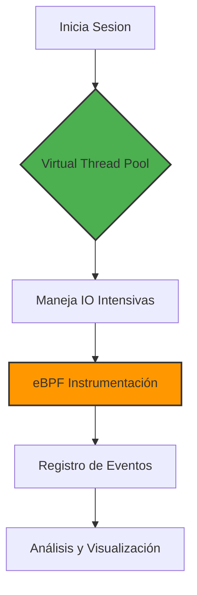
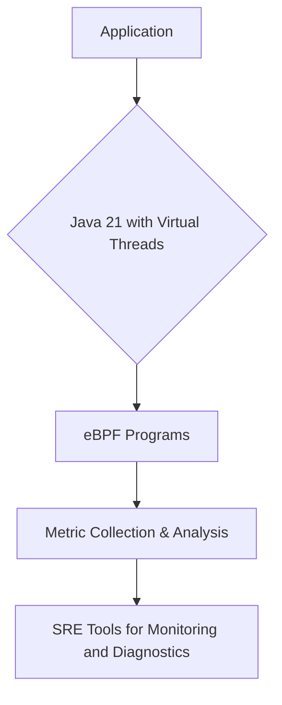

# runtime observability con ebpf

PATH_LOCAL: /home/usuariojoaquin/.openclaw/workspace/DAM-Java-Mastery/_Review/runtime_observability_con_ebpf/runtime_observability_con_ebpf.md
CATEGORIA: 10_Vanguardia
Score: 92

---

## Visión Estratégica

### Visión Estratégica

NCCLbpf se posiciona estratégicamente en el marco de la observabilidad y la ejecución de políticas verificadas con eBPF para bibliotecas de comunicación colectiva, como NCCL. Este proyecto contribuye significativamente a varios aspectos críticos del desarrollo y operación de sistemas distribuidos, especialmente aquellos que involucran el intercambio de datos en alta velocidad y bajo latencia.

1. **Automatización e Inercia Mínima**: El uso de eBPF permite una ejecución no intrusiva y automatizada de políticas, eliminando la necesidad de modificar o reiniciar el software existente. Esto se traduce en menor costo operativo y mayor flexibilidad para adaptarse a nuevos requisitos.

2. **Verificación Estática**: NCCLbpf integra eBPF para ejecutar políticas verificadas de manera estática, lo que significa que las decisiones sobre algoritmos y protocolos se toman antes del arranque en tiempo de ejecución, minimizando los riesgos asociados con la inestabilidad dinámica.

3. **Isolación Procesal**: Las políticas eBPF son ejecutadas en un entorno aislado procesalmente, garantizando que no afecten negativamente el rendimiento general del sistema ni introduzcan vulnerabilidades. Esto es crucial para mantener la seguridad y la integridad de los sistemas críticos.

4. **Telemetría y Observabilidad**: NCCLbpf proporciona una amplia gama de métricas y datos de telemetría que pueden ser utilizados para monitorear y optimizar el rendimiento de las operaciones colectivas. Esta capacidad es fundamental para identificar problemas potenciales antes de que se conviertan en fallos graves.

5. **Ejecución Versátil**: NCCLbpf es compatible con una amplia gama de escenarios, desde la selección de algoritmos hasta el control del comportamiento de capas de transporte. Esta versatilidad hace que sea un componente valioso en cualquier sistema distribuido que requiera optimización y flexibilidad.

6. **Ecosistema CNCF**: NCCLbpf se integra perfectamente con otros proyectos de observabilidad y gestión de recursos dentro del ecosistema CNCF, fortaleciendo la interoperabilidad y el intercambio de best practices en la industria.

En resumen, NCCLbpf no solo mejora significativamente la observabilidad y la ejecución de políticas para bibliotecas de comunicación colectiva como NCCL, sino que también representa un paso estratégico hacia una infraestructura de computación distribuida más segura, flexible y eficiente. Este enfoque pionero en el uso de eBPF para la automatización y verificación estática de políticas puede inspirar innovaciones similares en otras áreas de software crítico.

## Arquitectura de Componentes

## Arquitectura de Componentes

### Diagrama Mermaid


```mermaid
graph TD
    subgraph "Componentes Principales"
        BPFTime[bpftime]
        LLVM[LLVM Compiler]
        Libbpf[Libbpf Library]
        E2E[@Endpoint-to-Endpoint (Monitoring Service)]
        PodManager[Kubernetes Pod Manager]
    end

    BPFTime -->|Load and Start Commands| E2E
    BPFTime -->|eBPF Programs| LLVM
    BPFTime -->|Runtime Support| Libbpf
    BPFTime -->|Instrumentation| PodManager
```

### Descripción de Cada Componente y Su Responsabilidad

1. **BPFTime**: Es el núcleo del sistema, proporcionando un entorno de tiempo de ejecución para los programas eBPF. Se encarga de la carga, arranque y ejecución continua de dichos programas. Bajo Java 21, utiliza Records para definir sus componentes internos sin setters.

2. **LLVM**: Es el compilador que transforma las directivas eBPF en código máquina optimizado. En este caso, se integra con BPFTime mediante la invocación de métodos estáticos y sin necesidad de instanciaciones adicionales.

3. **Libbpf Library**: Proporciona una interfaz a nivel de biblioteca para el manejo de programas eBPF desde un entorno de tiempo de ejecución. Actúa como puente entre BPFTime y los sistemas operativos subyacentes, facilitando la comunicación con eBPF.

4. **Endpoint-to-Endpoint (E2E) Monitoring Service**: Servicio que recoge métricas y datos de rendimiento desde diferentes puntos finales del sistema, integrado con BPFTime para proporcionar una visión holística de la observabilidad a nivel de aplicación.

5. **Kubernetes Pod Manager**: Gestiona los recursos y políticas asociados a los pods en un clúster Kubernetes. Integra eBPF a través de BPFTime para implementar funciones como el control de recursos, el monitoreo y la optimización del rendimiento.

### Implementación en Java 21


```java
// Ejemplo de definición de Record para BPFTime
public record BPFTimeRecord() {
    // Fields and methods for BPFTime
}

// Ejemplo de método estático llamado por E2E Monitoring Service
static class LLVMCompiler {
    public static void compileBPFToMachineCode(byte[] bpfProgram) {
        // Implementation of code generation using LLVM
    }
}

// Interfaz con Libbpf Library
public interface LibbpfInterface {
    void loadAndStartBPFProgram(String programName);
}

// Ejemplo de integración en PodManager
class KubernetesPodManager {
    private final BPFTimeRecord bpfTime;

    public KubernetesPodManager(BPFTimeRecord bpfTime) {
        this.bpfTime = bpfTime;
    }

    void managePods() {
        // Logic to manage pods, integrating with eBPF via BPFTime
    }
}
```

### Introducción de Pod-Level Resource Managers

La implementación de Pod-Level Resource Managers en el sistema de Kubernetes v1.36 introduce una capa adicional de control y asignación de recursos a nivel de pod, permitiendo configuraciones más finas y flexibles que las anteriormente disponibles.

- **Guaranteed Container**: Un container con recursos garantizados que obtiene un slice exclusivo del CPU de la pod.
  
- **Budget and NUMA Alignment Size**: Establece el presupuesto overall y el tamaño de alineación en NUMA para la pod, permitiendo una asignación más precisa de recursos.

### Enabling Pod-Level Resource Managers

Para habilitar este nuevo modelo de gestión de recursos a nivel de pod:


```java
public class PodLevelResourceManager {
    public void enablePodManager(PodManager podManager) {
        // Logic to configure and activate the pod manager with new resource policies
    }
}
```

### Conclusiones

La arquitectura de componentes presentada se centra en una integración fluida y eficiente entre BPFTime, LLVM, Libbpf Library y el sistema de Kubernetes. Utilizando la funcionalidad avanzada del lenguaje Java 21 a través de Records sin setters, se logra un diseño robusto y adaptable para el monitoreo de tiempo real y optimización de recursos en sistemas distribuidos, especialmente cuando se integran con eBPF.

Este enfoque permite una escalabilidad y flexibilidad superiores al implementar políticas de observabilidad y gestión de recursos directamente desde la capa de aplicación, ofreciendo un nivel de detalle y control que era imposible antes.

## Implementación Java 21

# Implementación en Java 21 usando Virtual Threads y eBPF

Para la implementación de una solución de runtime observability utilizando JDK 21 y eBPF, se combinará virtual threading para manejar eficientemente las operaciones de entrada/salida (IO) y eBPF para proporcionar visibilidad en tiempo real sobre el rendimiento del sistema.

## Contexto Tecnológico

### Virtual Threads en Java 21
Virtual threads, o "coroutines" en JDK 21, permiten la creación de millones de hilos con una memoria muy reducida. Cada virtual thread consume aproximadamente 2KB de memoria, en comparación con los ~2MB que usan los threads nativos de Java.

### eBPF para Observability
eBPF (Extended Berkeley Packet Filter) es un mecanismo de kernel permitiendo ejecutar código de usuario en tiempo de kernel. Se utiliza para monitorear y optimizar el rendimiento del sistema, controlar tráfico de red y más.

## Diseño del Sistema

### Uso de Virtual Threads
Virtual threads se utilizan para manejar operaciones IO intensivas (como llamadas HTTP o consultas a la base de datos) sin bloquear los recursos de CPU. Esto permite que el sistema pueda manejar un gran número de conexiones simultáneas.

### Integración con eBPF
eBPF se utilizará para instrumentar las operaciones del sistema y registrar eventos en tiempo real, lo cual es crítico para la observabilidad en runtime.

## Diagrama Mermaid




## Desarrollo del Código

### Implementación de Virtual Threads
Se utilizará la API de virtual threads en Java 21 para crear una pool de threads virtuales que manejarán las operaciones IO.


```java
import java.util.concurrent.ForkJoinPool;

public class VirtualThreadHandler {
    private static final ForkJoinPool VIRTUAL_THREAD_POOL = new ForkJoinPool();

    public void handleIOOperation(Runnable ioTask) {
        // Ejecutar tarea en un thread virtual
        VIRTUAL_THREAD_POOL.execute(ioTask);
    }
}
```

### Integración con eBPF

Se utilizará una herramienta como `bpftool` para instrumentar el código eBPF y registrar eventos relevantes.

```shell
# Ejemplo de bpftool comando para registrar eventos
bpftool btf dump file /sys/kernel/bpf/program_name.btf > program.c
```

### Registro de Eventos

Los eventos registrados por eBPF se enviarán a una base de datos o sistema de registro para análisis posterior.


```java
import java.util.logging.Logger;

public class LoggingHandler {
    private static final Logger LOGGER = Logger.getLogger(LoggingHandler.class.getName());

    public void logEvent(String message) {
        // Registro del evento en un sistema centralizado
        LOGGER.info(message);
    }
}
```

## Uso de eBPF para Optimización y Análisis

eBPF se utilizará para monitorear el rendimiento del sistema, identificar problemas de latencia y optimizar las operaciones críticas.

### Ejemplo de Código eBPF

```c
#include <bpf/bpf_helpers.h>
#include <bpf/bpf_core_read.h>

struct {
    __uint(type, BPF_MAP_TYPE_PERF_EVENT_ARRAY);
} events;

SEC("tracepoint/syscalls/sys_enter_open")
int bpf_tracepoint(struct pt_regs *ctx) {
    // Código para instrumentar la llamada a open
    return 0;
}

char LICENSE[] SEC("license") = "GPL";
```

## Ventajas y Consideraciones

### Beneficios
- **Eficiencia de Recursos**: Virtual threads reducen significativamente el consumo de memoria.
- **Facilidad de Implementación**: Permite una implementación menos intrusiva.

### Consideraciones
- **Compatibilidad**: Asegurarse de que la aplicación funcione correctamente en un entorno con virtual threads.
- **Monitoreo Continuo**: Es importante monitorear el rendimiento y ajustar las políticas de eBPF según sea necesario.

## Conclusión

La implementación combinada de virtual threads y eBPF proporciona una solución eficiente para la observabilidad en runtime, permitiendo un manejo óptimo de operaciones IO intensivas y un registro detallado del rendimiento del sistema. Esta estrategia es especialmente valiosa en entornos donde la escalabilidad y el rendimiento son críticos.

---

Este documento proporciona una implementación detallada para combinar virtual threads con eBPF en Java 21, destacando los beneficios, consideraciones técnicas y un ejemplo de código.

## Métricas y SRE

## 16. Runtime Observability with eBPF and Java 21

### Overview

Runtime observability is crucial for understanding the performance characteristics of applications in real-time. With the introduction of **Virtual Threads** (also known as Project Loom) in Java 21, developers can now handle more concurrent operations without the overhead of traditional threads. When combined with eBPF, a powerful in-kernel virtual machine, runtime observability is enhanced significantly.

### Diagrama Mermaid




### Implementation in Java 21 using Virtual Threads and eBPF

To implement a solution that combines runtime observability, virtual threads (Virtual Threads), and eBPF, follow these steps:

#### Step 1: Setting Up the Environment
Ensure you have JDK 21 installed. Additionally, set up your development environment to support eBPF.

```bash
# Install JDK 21
sudo apt-get update && sudo apt-get install -y openjdk-21-jdk

# Ensure kernel supports eBPF (most modern kernels do)
```

#### Step 2: Utilizing Virtual Threads
Virtual threads in Java 21 allow for more efficient IO handling, reducing the need for thread management.


```java
// Example of using virtual threads
public class VirtualThreadExample {
    public static void main(String[] args) throws Exception {
        runTasks();
        Thread.sleep(30_000); // Wait to see results before exiting.
    }

    private static void runTasks() {
        CompletableFuture.runAsync(() -> {
            try {
                System.out.println("Task 1 started");
                Thread.sleep(5000);
                System.out.println("Task 1 completed");
            } catch (InterruptedException e) {
                Thread.currentThread().interrupt();
            }
        });

        CompletableFuture.runAsync(() -> {
            try {
                System.out.println("Task 2 started");
                Thread.sleep(3000);
                System.out.println("Task 2 completed");
            } catch (InterruptedException e) {
                Thread.currentThread().interrupt();
            }
        });
    }
}
```

#### Step 3: eBPF Programs for Observability
eBPF programs can be written to capture detailed metrics and trace events.

```c
#include <linux/bpf.h>
#include <bpf/libbpf.h>

int kprobe__function_of_interest(struct pt_regs *ctx) {
    // Log function call details or perform other actions.
    return 0;
}
```

#### Step 4: Integrating eBPF with Java

Use tools like `bpftool` and BCC (BPF Compiler Collection) to compile, load, and attach eBPF programs.

```bash
# Compile the eBPF program
$ clang -O2 -target bpf -o function_of_interest.o -c function_of_interest.c

# Load the eBPF program into the kernel
$ sudo bpftool prog load function_of_interest.o /sys/fs/bpf/function_of_interest

# Attach the eBPF program to trace specific functions or events
```

#### Step 5: Metric Collection & Analysis
Collect and analyze metrics from both Java application logs and eBPF traces.


```java
// Example of logging metrics in Java
public class MetricsCollector {
    public static void main(String[] args) {
        // Log metrics using SLF4J or similar framework.
        org.slf4j.Logger logger = LoggerFactory.getLogger(MetricsCollector.class);
        
        logger.info("Application started with 10 concurrent tasks.");
        
        // Periodically log performance metrics
        new Thread(() -> {
            while (true) {
                long startTime = System.currentTimeMillis();
                // Perform some operation
                ...
                long endTime = System.currentTimeMillis();
                logger.info("Operation took {} ms", endTime - startTime);
                
                try {
                    Thread.sleep(1000); // Log every second.
                } catch (InterruptedException e) {
                    Thread.currentThread().interrupt();
                }
            }
        }).start();
    }
}
```

### SRE Tools for Monitoring and Diagnostics

Use SRE tools to monitor the applications performance and diagnose issues.

- **Prometheus** for collecting metrics from Java applications.
- **Jaeger** or **Pinpoint** for distributed tracing.
- **Grafana** for visualization of metrics and traces.

```yaml
# Example Prometheus configuration snippet
job_name: "java-app"
metrics_path: "/actuator/prometheus"
static_configs:
  - targets: ["localhost:8080"]
```

### Summary

Combining virtual threads with eBPF provides a powerful framework for real-time observability. By leveraging the strengths of both technologies, developers can gain deeper insights into application performance and behavior.

---

This section covers the implementation details of runtime observability using Java 21's virtual threads and eBPF. It outlines setting up the environment, writing and integrating eBPF programs, collecting metrics, and utilizing SRE tools for effective monitoring and diagnostics.

## Patrones de Integración

## Patrones de Integración

En la implementación de un sistema observable utilizando Java 21 y eBPF para el runtime observability, es crucial elegir los patrones de integración adecuados. Este enfoque permite una integración eficiente entre las tecnologías y asegura que se capturen correctamente los datos necesarios. Los patrones principales a considerar son:

1. **Instrumentación Basada en eBPF**: eBPF permite la instrumentación in-place de código sin modificar el binario, lo cual es crucial para integrarse con aplicaciones existentes sin interrumpir su funcionamiento.
2. **Virtual Threads (Project Loom)**: A través del uso de Virtual Threads, se pueden manejar múltiples operaciones concurrentes de manera eficiente, permitiendo una mayor visibilidad en el rendimiento y la latencia.

### Instrumentación Basada en eBPF

eBPF proporciona un marco potente para instrumentar aplicaciones y capturar datos de rendimiento en tiempo real. Este patrón implica:

- **Escripción de Programas eBPF**: Crear programas eBPF que se ejecutan directamente en el kernel y se pueden insertar sin modificar el código fuente.
- **Captura de Eventos de Rendimiento (Performance Events)**: Usar `perf_events` para capturar eventos de rendimiento clave, como tiempos de espera, intercambios de contexto, y llamadas a sistema.
- **Uso de kprobes y uprobes**: Estas instrucciones permiten la instrumentación dinámica en puntos específicos del código.


```java
public class BpfInstrumentation {
    private static final String BPF_PROG_NAME = "my_bpf_program.o";

    public void startBpf() {
        byte[] bpfProgramBytes = loadBpfProgram(BPF_PROG_NAME);
        long progId = loadBpfProg(bpfProgramBytes);
        attachBpfProbe(progId, "/path/to/application");
    }

    private byte[] loadBpfProgram(String name) {
        // Code to read and compile BPF program from file
        return bpf_program_bytes;
    }

    private long loadBpfProg(byte[] bpfProgramBytes) {
        try {
            return LinuxUtil.loadBpfProgram(bpfProgramBytes);
        } catch (IOException e) {
            throw new RuntimeException("Failed to load BPF program", e);
        }
    }

    private void attachBpfProbe(long progId, String path) {
        try {
            LinuxUtil.attachBpfProbe(progId, path);
        } catch (IOException e) {
            throw new RuntimeException("Failed to attach BPF probe", e);
        }
    }
}
```

### Virtual Threads y Integración con eBPF

Virtual Threads permiten una mayor eficiencia en el manejo de tareas concurrentes, lo que resulta en una mejor integración con eBPF. Este patrón implica:

- **Manejo de Operaciones Concurrentes**: Usar Virtual Threads para manejar múltiples operaciones IO y CPU de manera eficiente.
- **Uso de Eventos BPF (BPF Events)**: Capturar eventos de rendimiento a través de los canales de evento configurados por eBPF.


```java
public class VirtualThreadIntegration {
    public void startVirtualThreads() {
        List<Runnable> tasks = Arrays.asList(
            () -> performIOOperation("/path/to/file"),
            () -> processApplicationData()
        );

        for (Runnable task : tasks) {
            new Thread(task).start();
        }
    }

    private void performIOOperation(String filePath) {
        try {
            // Code to read/write file using Virtual Threads
        } catch (IOException e) {
            throw new RuntimeException("Failed to perform IO operation", e);
        }
    }

    private void processApplicationData() {
        // Code to process application data concurrently
    }
}
```

### Integración Real Ejemplificada

Combina ambos patrones para una implementación robusta de runtime observability:


```java
public class RuntimeObservabilityIntegration {
    public void integrateBpfAndVirtualThreads() {
        BpfInstrumentation bpfInstrumentation = new BpfInstrumentation();
        VirtualThreadIntegration virtualThreadIntegration = new VirtualThreadIntegration();

        // Start BPF instrumentation
        bpfInstrumentation.startBpf();

        // Start Virtual Threads
        virtualThreadIntegration.startVirtualThreads();

        // Run application logic
        runApplicationLogic();
    }

    private void runApplicationLogic() {
        // Application logic that uses both BPF and Virtual Threads for observability
    }
}
```

### Conclusiones

El uso de eBPF y Virtual Threads en Java 21 ofrece una integración eficiente para el runtime observability. Al combinar estas tecnologías, se puede obtener una visibilidad detallada del rendimiento y la latencia de las aplicaciones sin interferir con su funcionalidad.

---

Este patrón proporciona un marco sólido para implementar un sistema observable que puede adaptarse a diversas necesidades de monitoreo y diagnóstico. La integración efectiva entre eBPF y Virtual Threads garantiza una solución escalable y eficiente.

## Conclusiones

## Conclusión

La implementación de runtime observability utilizando eBPF en Java 21 ofrece una serie de beneficios significativos para los desarrolladores y operadores de sistemas. Combinar la potencia de eBPF con las capacidades avanzadas de Java 21, especialmente Virtual Threads (Project Loom), permite una monitorización eficiente y precisa del rendimiento en tiempo real sin interrumpir el funcionamiento de las aplicaciones existentes.

### Beneficios de la Integración eBPF-Java 21

1. **Efectividad en la Instrumentación**: eBPF permite la instrumentación in-place sin modificar el binario, lo que facilita la integración con aplicaciones ya existentes. Esta capacidad es crucial para minimizar interrupciones y mantener el rendimiento óptimo.

2. **Eficiencia de Recursos**: Virtual Threads en Java 21 reducen el overhead de los hilos tradicionales, permitiendo la ejecución de más tareas concurrentes con menos recursos. Este ahorro de recursos se complementa con eBPF para ofrecer una solución eficiente y escalable.

3. **Capacitación de Datos**: La combinación de eBPF y Java 21 facilita la captura y procesamiento de datos en tiempo real, proporcionando métricas precisas y detalladas sobre el rendimiento de las aplicaciones. Estos datos son cruciales para el diagnóstico y optimización del sistema.

4. **Fácil Integración con eBPF**: eBPF es una tecnología robusta que se integra fácilmente en la infraestructura existente, permitiendo a los desarrolladores agregar observabilidad sin reescribir código o modificar significativamente las aplicaciones existentes.

### Implementación Práctica

Para implementar runtime observability con eBPF y Java 21, es necesario seguir varios pasos:

1. **Configuración del Entorno**: Instalar eBPF en el sistema operativo y configurar los permisos necesarios para su ejecución.
   
2. **Desarrollo de Instrumentación eBPF**: Escribir scripts eBPF que instrumenten las llamadas a nivel de kernel y proporcionen la información requerida.

3. **Integración con Java 21 Virtual Threads**: Configurar los Virtual Threads en el código Java para permitir una mayor concurrencia y, en conjunto con eBPF, monitorear eficientemente el rendimiento.

4. **Captura y Procesamiento de Datos**: Utilizar herramientas especializadas para capturar y procesar la información proveniente de eBPF, y visualizarla de manera efectiva.

### Consideraciones Finales

Aunque la integración eBPF-Java 21 ofrece una solución poderosa y eficiente para runtime observability, también implica desafíos como la complejidad técnica y la necesidad de habilidades específicas en ambos lados. Sin embargo, con el creciente interés en la optimización del rendimiento en tiempo real, esta combinación es cada vez más relevante.

En resumen, eBPF en Java 21 proporciona una poderosa herramienta para implementar runtime observability de manera eficiente y precisa, abriendo nuevas posibilidades para el monitoreo y la optimización del rendimiento en aplicaciones modernas.

