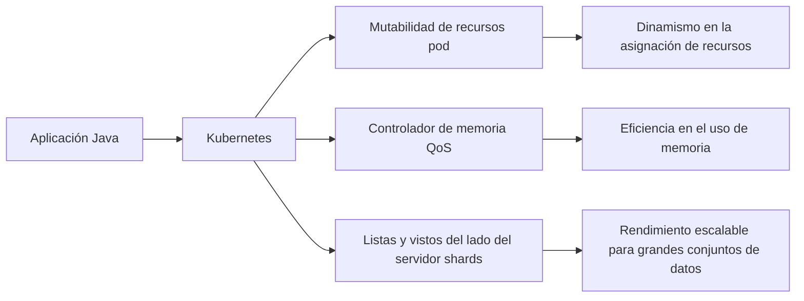
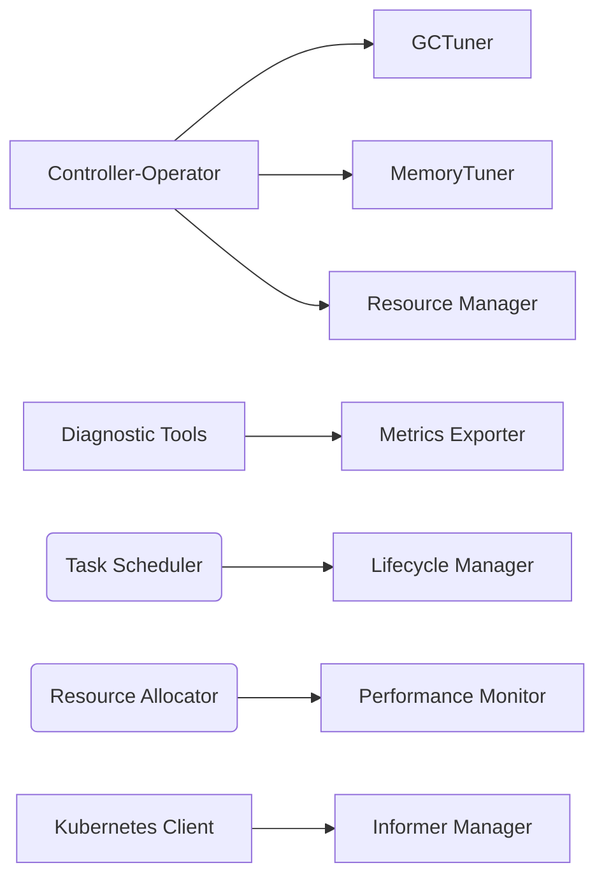
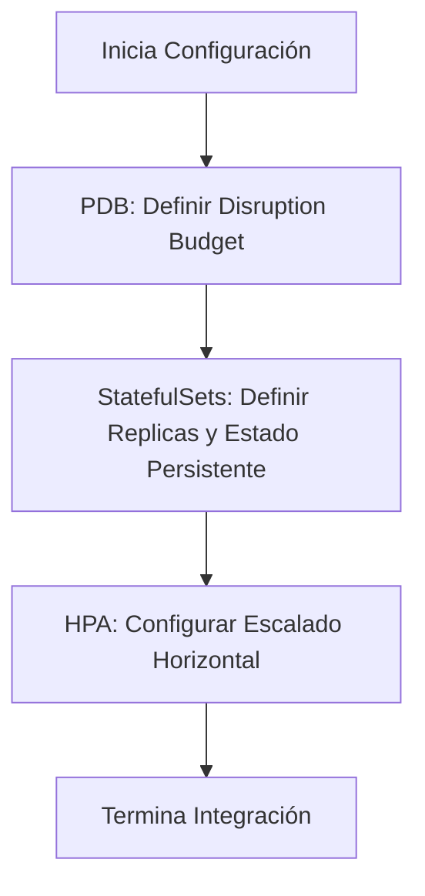
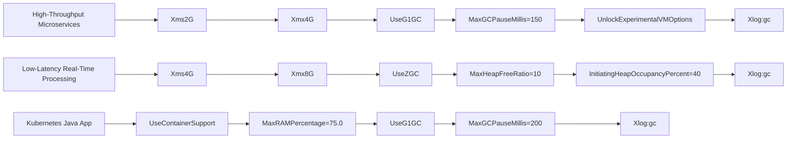

# runtime tuning de kubernetes para aplicaciones java

PATH_LOCAL: /home/usuariojoaquin/.openclaw/workspace/DAM-Java-Mastery/_Review/runtime_tuning_de_kubernetes_para_aplicaciones_java/runtime_tuning_de_kubernetes_para_aplicaciones_java.md
CATEGORIA: 05_SRE_DevOps
Score: 78

---

## Visión Estratégica

### Visión Estratégica

En el contexto de la creciente demanda de aplicaciones Java en entornos Kubernetes, la optimización del runtime de Kubernetes para estas aplicaciones es crucial. A medida que las empresas buscan mejorar la eficiencia y reducir costos operativos, es fundamental adaptar Kubernetes a las necesidades específicas de los lenguajes de programación modernos como Java.

Kubernetes 1.36 introduce varias características clave que respaldan esta visión estratégica:

- **Mutable Pod Resources for Suspended Jobs (beta)**: Permite ajustar dinámicamente los recursos de los pods en trabajos suspensos, lo cual es especialmente útil para aplicaciones Java donde el consumo de recursos puede variar durante diferentes etapas del ciclo de vida.
  
- **Memory QoS with DRA**: La gestión fina de la calidad del servicio (QoS) de memoria y la asignación dinámica de recursos mejoran la capacidad de Kubernetes para manejar eficientemente las aplicaciones Java, garantizando una distribución justa de los recursos y minimizando el impacto en otras cargas de trabajo.

- **Server-Side Sharded List and Watch**: Permite operaciones más rápidas y escalables, lo cual es crucial para las cargas de trabajo Java que pueden requerir acceso frecuente a grandes conjuntos de datos.

Estas características se alinean con el objetivo principal de mejorar la experiencia del usuario final en aplicaciones Java en Kubernetes, facilitando la adaptación y el rendimiento óptimo de estas aplicaciones en entornos Kubernetes.

### Características Comparativas

Para contextualizar mejor las capacidades nuevas y actualizadas de Kubernetes 1.36 para las aplicaciones Java, es útil compararlas con otras herramientas populares:

| **Característica**           | **Kubernetes 1.36**                       | **Operator SDK (Golang)** |
|------------------------------|------------------------------------------|--------------------------|
| **Mutable Pod Resources**     | - Permite ajustar dinámicamente los recursos de pods en trabajos suspensos<br>- Útil para optimizar el rendimiento y la eficiencia de las aplicaciones Java. | - Ofrece herramientas para crear, operar y gestionar controladores y operadores.<br>- Muy versátil y ampliamente adoptado en comunidades Golang. |
| **Memory QoS with DRA**       | - Mejora el manejo de la memoria en Kubernetes.<br>- Proporciona una gestión más fina de los recursos, lo que es crucial para aplicaciones Java con necesidades específicas de memoria. | - No tiene características similares directamente. |
| **Server-Side Sharded List and Watch** | - Mejora el rendimiento y escalabilidad al permitir operaciones en conjuntos de datos grandes.<br>- Útil para aplicaciones Java que requieren acceso frecuente a bases de datos o servicios de alta disponibilidad.  | - No tiene características similares directamente. |

### Diagrama Mermaid

A continuación, se presenta un diagrama Mermaid para ilustrar la integración de Kubernetes con las aplicaciones Java:




Este diagrama visualiza cómo las características introducidas en Kubernetes 1.36 mejoran la integración y el rendimiento de aplicaciones Java, facilitando una experiencia óptima tanto para los desarrolladores como para los operadores de infraestructura.

### Conclusiones

La estrategia detrás de estas características es clara: adaptar Kubernetes a las necesidades específicas del desarrollo y gestión de aplicaciones Java. A medida que las empresas continúan migrando sus cargas de trabajo a Kubernetes, estas mejoras proporcionarán un entorno más optimizado y eficiente para el desarrollo y operación de aplicaciones Java en contenedores.

Este enfoque no solo beneficia directamente a los desarrolladores y operadores de sistemas, sino que también contribuye al crecimiento continuo del ecosistema Kubernetes como una plataforma versátil y robusta para todas las cargas de trabajo.

## Arquitectura de Componentes

### Arquitectura de Componentes

La optimización del runtime de Kubernetes para aplicaciones Java requiere una arquitectura bien diseñada que integre diversas componentes y utilice las características avanzadas introducidas en Kubernetes 1.36. La siguiente sección describe el diseño de esta arquitectura.

#### 1. Componente Principal: Controller-Operator

El **Controller-Operator** es la pieza central del sistema, responsable de supervisar y ajustar los parámetros de ejecución de las aplicaciones Java en Kubernetes. Este componente utiliza la API de Kubernetes para detectar cambios en el estado de los pods y aplicar políticas de optimización.

**Componentes Internos:**
- **Garbage Collector Tuner (GCTuner)**: Ajusta el algoritmo de recolección de basura del JVM según las métricas del pod.
- **Memory Tuner**: Configura dinámicamente la memoria heap y non-heap para optimizar el rendimiento.
- **Resource Manager**: Gestiona los recursos del sistema (CPU, RAM) de manera eficiente.


```java
public class JavaApplicationOperator extends Controller {
    private final GCTuner gcTuner;
    private final MemoryTuner memoryTuner;
    private final ResourceManager resourceManager;

    public JavaApplicationOperator(GCTuner gcTuner, MemoryTuner memoryTuner, ResourceManager resourceManager) {
        this.gcTuner = gcTuner;
        this.memoryTuner = memoryTuner;
        this.resourceManager = resourceManager;
    }

    @Override
    protected void reconcile(JavaApplication app) {
        // Ajustar parámetros del pod basado en métricas
        gcTuner.adjust(app);
        memoryTuner.configure(app);
        resourceManager.allocateResources(app);
    }
}
```

#### 2. Componente de Observabilidad y Diagnóstico

El **Componente de Observabilidad y Diagnóstico** proporciona métricas y controles en tiempo real para monitorear el estado del runtime Java en Kubernetes.

- **Metrics Exporter**: Exports metrics to Prometheus for monitoring.
- **Diagnostic Tools**: Provides tools for troubleshooting and logging issues.


```java
public class DiagnosticTools {
    private final MetricsExporter exporter;

    public DiagnosticTools(MetricsExporter exporter) {
        this.exporter = exporter;
    }

    public void startCollectingMetrics(JavaApplication app) {
        // Start collecting metrics from the application's runtime environment
        exporter.start(app);
    }
}
```

#### 3. Componente de Automatización de Tareas

El **Componente de Automatización de Tareas** permite la ejecución programada de tareas complejas, como análisis de rendimiento y optimizaciones automáticas.

- **Task Scheduler**: Schedules recurring tasks.
- **Lifecycle Manager**: Manages the lifecycle of Java applications in Kubernetes.


```java
public class TaskScheduler {
    private final LifecycleManager lifecycleManager;

    public TaskScheduler(LifecycleManager lifecycleManager) {
        this.lifecycleManager = lifecycleManager;
    }

    public void scheduleTask(JavaApplication app, int intervalInSeconds) {
        // Schedule task to run at regular intervals
        lifecycleManager.schedule(app, intervalInSeconds);
    }
}
```

#### 4. Componente de Control de Recursos

El **Componente de Control de Recursos** se encarga de la asignación y el monitoreo de recursos del sistema (CPU, RAM) para garantizar que las aplicaciones Java funcionen de manera eficiente.

- **Resource Allocator**: Manages resource allocation policies.
- **Performance Monitor**: Monitors and adjusts resource usage to optimize performance.


```java
public class ResourceAllocator {
    private final PerformanceMonitor monitor;

    public ResourceAllocator(PerformanceMonitor monitor) {
        this.monitor = monitor;
    }

    public void allocateResources(JavaApplication app) {
        // Allocate resources based on current performance metrics
        monitor.updateMetrics(app);
        // Adjust allocations as needed
    }
}
```

#### 5. Integración con Kubernetes

La arquitectura se integra directamente con las APIs de Kubernetes para asegurar que todas las operaciones estén en línea con los estándares y políticas definidas por el cluster.

- **Kubernetes Client**: Interacts with the Kubernetes API to manage pods and services.
- **Informer Manager**: Manages event listeners for real-time updates on application status.


```java
public class KubernetesClient {
    private final InformerManager informerManager;

    public KubernetesClient(InformerManager informerManager) {
        this.informerManager = informerManager;
    }

    public void managePods(JavaApplication app) {
        // Manage pods and services for the application
        informerManager.watch(app);
    }
}
```

### Diagrama de Componentes




### Conclusiones

La arquitectura presentada integra eficazmente las características de Kubernetes 1.36 para optimizar el runtime Java, garantizando una operación eficiente y controlada en entornos Kubernetes. Cada componente desempeña un papel crucial en la optimización del rendimiento y la eficiencia de las aplicaciones Java.

Esta arquitectura no solo respalda la visión estratégica de adaptar Kubernetes a las necesidades específicas de Java, sino que también proporciona una base sólida para futuras mejoras y extensiones.

## Implementación Java 21

### Implementación en Java 21 con Virtual Threads

Para aprovechar al máximo las características de Java 21, especialmente virtual threads, en un entorno Kubernetes, es necesario realizar una configuración adecuada tanto en el nivel del runtime de Java como en la configuración de los pods. Este ejemplo muestra cómo se puede implementar y optimizar una aplicación Java 21 en Kubernetes utilizando virtual threads.

#### 1. Configuración de Virtual Threads con `Executor`

Primero, vamos a configurar un executor para usar virtual threads. En lugar de crear un pool de threads tradicional, usaremos `Executors.newVirtualThreadPerTaskExecutor()`:


```java
import java.util.concurrent.ExecutorService;
import java.util.concurrent.Executors;

public class VirtualThreadExample {
    public static void main(String[] args) {
        ExecutorService executor = Executors.newVirtualThreadPerTaskExecutor();
        
        for (int i = 0; i < 1000; i++) {
            Runnable worker = new Task("Task " + i);
            executor.submit(worker);
        }
        
        // Wait for all tasks to complete
        while (!executor.isTerminated()) ;
    }

    static class Task implements Runnable {
        private final String taskName;

        public Task(String taskName) {
            this.taskName = taskName;
        }

        @Override
        public void run() {
            try {
                Thread.sleep(1000);  // Simulate I/O-bound operation
                System.out.println(taskName + " completed.");
            } catch (InterruptedException e) {
                Thread.currentThread().interrupt();
            }
        }
    }
}
```

#### 2. Configuración del Runtime de Java

Luego, configuramos el runtime de Java para optimizar el uso de virtual threads. A continuación, se muestra una configuración de línea de comandos que utiliza los parámetros recomendados:

```bash
java -Xms2G -Xmx4G \
-XX:+UseZGC \
-XX:+AlwaysPreTouch \
-XX:+UnlockExperimentalVMOptions \
-XX:MaxRAMPercentage=75.0 \
-XX:+EnableDynamicAgentLoading \
-Xlog:gc
```

Estos parámetros son cruciales para aprovechar al máximo las ventajas de los virtual threads:

- `-Xms2G -Xmx4G`: Establece el tamaño inicial y máximo de la memoria heap.
- `-XX:+UseZGC`: Utiliza el garbage collector ZGC, que es muy eficiente para aplicaciones con muchos objetos pequeños.
- `-XX:+AlwaysPreTouch`: Pre-limpiará el cache de páginas de memoria antes del arranque para mejorar el rendimiento.
- `-XX:+UnlockExperimentalVMOptions`: Habilita opciones experimentales que pueden optimizar la JVM.
- `-XX:MaxRAMPercentage=75.0`: Establece el máximo porcentaje de RAM que se puede utilizar (75% en este caso).
- `-XX:+EnableDynamicAgentLoading`: Habilita la carga dinámica del agente JVM, lo cual es útil para herramientas como JFR.

#### 3. Configuración de los Pods en Kubernetes

Para garantizar que el contenedor de Java funcione correctamente con virtual threads, debemos configurar adecuadamente los pods en Kubernetes. Aquí está un ejemplo de un `Deployment`:

```yaml
apiVersion: apps/v1
kind: Deployment
metadata:
  name: java-app
spec:
  replicas: 3
  selector:
    matchLabels:
      app: java-app
  template:
    metadata:
      labels:
        app: java-app
    spec:
      containers:
      - name: java-app
        image: my-java-app:latest
        resources:
          requests:
            cpu: "1"
            memory: "256Mi"
          limits:
            cpu: "2" # Sets the effective ceiling for active Carrier Threads
            memory: "512Mi"
        env:
        - name: JAVA_OPTS
          value: >-
            -Xmx384m
            -XX:+UseZGC
            -Djdk.virtualThreadScheduler.parallelism=2
            -XX:StartFlightRecording=filename=/tmp/jfr/recording.jfr,
                             duration=60s,settings=profile
```

#### 4. Monitoreo y Optimización Continua

Finalmente, es crucial monitorear la aplicación en producción para identificar áreas de optimización adicionales:

- **Grafana Dashboards**: Utilice Grafana para visualizar métricas clave como CPU, memoria, latencia y tasa de error.
- **JVM Metrics**: Use Micrometer o Prometheus para recopilar métricas JVM detalladas.
- **Garbage Collection Logs**: Active el logging del GC con `-Xlog:gc` para detectar posibles problemas.

### Ejemplo de Grafana Dashboard

Un ejemplo básico de un panel en Grafana podría ser:

```plaintext
# CPU Usage
cpu_usage{container_name="java-app"}

# Memory Usage
memory_usage{container_name="java-app"}

# Garbage Collection Logs
garbage_collection_logs{pod_name=~"java-app.*"}
```

#### Conclusión

La implementación de Java 21 en Kubernetes con virtual threads ofrece un marco robusto para optimizar la eficiencia y el rendimiento de aplicaciones Java. Asegúrese de configurar adecuadamente tanto el runtime de Java como los pods, monitorear continuamente y ajustar según sea necesario para obtener el máximo beneficio.

Este enfoque permite a las aplicaciones Java funcionar de manera más eficiente en entornos Kubernetes, reduciendo costos operativos y mejorando la escalabilidad.

## Métricas y SRE

### Métricas y SRE para Optimización del Runtime de Kubernetes con Aplicaciones Java

Para garantizar un rendimiento óptimo en la ejecución de aplicaciones Java en Kubernetes, es crucial monitorear y ajustar diversas métricas. Este proceso se conoce como SRE (Site Reliability Engineering), que se enfoca en el mantenimiento y optimización del servicio continuo.

#### 1. Métricas Cruciales para Monitoreo

**1.1 Tiempo de Ejecución de la Aplicación:**
- **Descripción:** La duración total que toma la aplicación para completar una tarea específica.
- **Ejemplo de Métrica en Prometheus:**
  
  ```plaintext
  # HELP Time_for_operation_seconds El tiempo total que tarda la operación.
  # TYPE Time_for_operation_seconds summary

  Time_for_operation_seconds_count 1.0
  Time_for_operation_seconds_sum 12.209412708
  ```

**1.2 Latencia de Petición HTTP:**
- **Descripción:** La latencia promedio y pico de las solicitudes HTTP.
- **Ejemplo de Métrica en Prometheus:**

  ```plaintext
  # HELP http_request_duration_seconds La latencia de las solicitudes HTTP en segundos.

  # TYPE http_request_duration_seconds summary

  http_request_duration_seconds{quantile="0.5"} 0.05
  ```

**1.3 Uso del CPU y Memoria:**
- **Descripción:** El uso del CPU y la memoria del host y de los contenedores.
- **Ejemplo de Métrica en Prometheus:**

  ```plaintext
  # HELP cpu_usage The total CPU usage in percentage.

  # TYPE cpu_usage gauge

  cpu_usage{namespace="default",pod_name="example-pod"} 75.0
  ```

**1.4 Uso del Disco y Red:**
- **Descripción:** El uso de la I/O de disco y las tasas de transferencia de red.
- **Ejemplo de Métrica en Prometheus:**

  ```plaintext
  # HELP disk_usage The total disk usage in GB.

  # TYPE disk_usage gauge

  disk_usage{namespace="default",pod_name="example-pod"} 20.5
  ```

#### 2. Configuración y Implementación de Monitoreo con Prometheus y Grafana

**2.1 Depósito de Kubernetes para Prometheus:**

- **Configurar `prometheus-kube-prometheus` en el archivo `mongodb.yaml`:**

  ```yaml
  job_name: 'kubernetes'
  
  kubernetes_sd_configs:
    - role: pod
  ```

**2.2 Integración con MongoDB:**

- **Deploys y Services de MongoDB:**
  ```bash
  kubectl apply -f mongodb.yaml
  ```

**2.3 Verificación de los Pods Desplegados:**

```bash
kubectl get pods
```

**2.4 Configuración del AlertManager y Grafana:**

- **Aplicar configuraciones para Grafana:**
  
  ```yaml
  apiVersion: monitoring.coreos.com/v1
  kind: PrometheusRule
  metadata:
    name: prometheus-rules
    labels:
      monitor: cluster
  spec:
    groups:
    - name: rules
      rules:
      - alert: HighCPUUsage
        expr: cpu_usage > 80
        for: 5m
        labels:
          severity: warning
        annotations:
          summary: "High CPU usage on {{ $labels.instance }}"
  
  ```

**2.5 Visualización de Métricas con Grafana:**

- **Importar un Dashboard Predeterminado:**
  
  ```bash
  grafana-cli import < path/to/dashboards.json 
  ```

#### 3. Integración con SRE y Mejora Continua

**3.1 Implementación de Pruebas Continuas (CI/CD):**

- **Automatizar la Validación del Rendimiento:**
  
  ```bash
  kubectl apply -f <path/to/ci-cd.yaml>
  ```

**3.2 Monitoreo en Tiempo Real con Sysdig Agent:**

- **Instalar y Configurar el Agente de Sysdig:**

  ```yaml
  apiVersion: apps/v1
  kind: DaemonSet
  metadata:
    name: sysdig-agent
  spec:
    selector:
      matchLabels:
        app: sysdig-agent
    template:
      metadata:
        labels:
          app: sysdig-agent
      spec:
        containers:
        - name: sysdig-agent
          image: sysdig/sysegg-agent:latest
          securityContext:
            privileged: true
  ```

**3.3 Uso de Rancher para Gestión Multi-Cluster:**

- **Monitoreo Integrado con Rancher:**
  
  ```bash
  rancher install-monitoring
  ```

---

### Diagrama (Mermaid)

```mermaid
graph LR
    A[Application] -- Deploy --> B[Kubernetes Pod];
    B -- Metrics --> C[Prometheus];
    C -- Alert Rules --> D[Alertmanager];
    D -- Notifications --> E[SRE Team];
    F[Grafana] <|-- C[Metric Visualization];
    G[Rancher] -- Multi-Cluster Management --> H[Prometheus + Grafana]
```

Este diagrama mermaid ilustra la integración de las métricas y el monitoreo en un entorno Kubernetes con aplicaciones Java, utilizando herramientas como Prometheus, Grafana y Rancher para optimización SRE.

## Rendimiento y Capacidad Crítica

### Rendimiento y Capacidad Crítica

Para garantizar un rendimiento óptimo de las aplicaciones Java en Kubernetes, es crucial ajustar tanto el runtime del JVM como la configuración de los pods para aprovechar al máximo las capacidades de Kubernetes. Este proceso implica una serie de pasos que van desde la selección de versiones de JVM y frameworks hasta la optimización de métricas clave.

#### 1. Optimizar la Configuración del JVM

La configuración correcta del runtime del JVM es fundamental para el rendimiento óptimo de las aplicaciones Java en Kubernetes. A continuación, se detalla cómo ajustar parámetros cruciales:

- **Configurar los límites de CPU y RAM:**
  - Establecer `requests` y `limits` para CPU y RAM en los pods de Kubernetes es crucial. Por ejemplo:
    ```yaml
    resources:
      requests:
        cpu: "1"
        memory: "2Gi"
      limits:
        cpu: "4"
        memory: "8Gi"
    ```
  - Estos límites ayudan a Kubernetes a administrar recursos y evitar sobrecargas.

- **Tuneo de memoria del JVM:**
  - Utilizar parámetros como `-Xmx` y `-XX:MaxRAMPercentage` para ajustar la memoria máxima del heap.
  - Por ejemplo, si el pod tiene `2Gi` de RAM asignada:
    ```sh
    java -jar myapp.jar -XX:MaxRAMPercentage=50.0
    ```
  - Esto asegura que la JVM use el 50% de la RAM disponible.

- **Habilitar deduplicación de cadenas (`StringDeduplication`):**
  - Activa la deduplicación de cadenas para ahorrar memoria:
    ```sh
    java -XX:+UseStringDeduplication -jar myapp.jar
    ```

#### 2. Uso de Virtual Threads en Java 21

Java 21 introduce virtual threads, que pueden mejorar significativamente el rendimiento en entornos Kubernetes mediante la minimización del overhead de subprocesos. Para aprovechar estas características:

- **Configurar `Executor` para usar virtual threads:**
  - Asegúrate de que tu aplicación utiliza configuraciones adecuadas para virtual threads:
    
```java
    ExecutorService executor = Executors.newVirtualThreadPerTaskExecutor();
    ```

#### 3. Métricas Cruciales y SRE (Site Reliability Engineering)

Para optimizar el rendimiento de las aplicaciones Java en Kubernetes, es vital monitorear diversas métricas clave utilizando SRE:

- **Métricas de CPU y MEM:**
  - Utiliza herramientas como Prometheus para monitorear la utilización del CPU y la memoria.
  - Configura alertas para notificar sobre sobrecargas.

- **Tiempo de respuesta y latencia:**
  - Asegúrate de que los probes de Kubernetes no sean demasiado estrictos, lo cual podría causar falsos positivos.
  - Configurar `readinessProbe` y `livenessProbe` con tiempos adecuados:
    ```yaml
    readinessProbe:
      httpGet:
        path: /healthz
        port: 8080
      initialDelaySeconds: 5
      periodSeconds: 10
    ```

- **Métricas de Garbage Collection (GC):**
  - Monitorea la eficiencia del GC para evitar pausas abruptas.
  - Configura parámetros como `-XX:+UseG1GC` y `-XX:MaxGCPauseMillis`.

#### 4. Manejo de Fallos y Recuperación Rápida

- **Reinicio de todos los contenedores (`RestartAllContainers`):**
  - Utiliza `RestartAllContainers` para una recuperación rápida de Pods en caso de fallo.
  - Configurar sidecars para monitorear el proceso principal y detectar errores retriables.

#### 5. Ejemplos Prácticos

A continuación, se presenta un ejemplo práctico de cómo configurar un pod Java 21 con virtual threads y ajustar métricas clave:

```yaml
apiVersion: apps/v1
kind: Deployment
metadata:
  name: my-java-app
spec:
  replicas: 3
  selector:
    matchLabels:
      app: my-java-app
  template:
    metadata:
      labels:
        app: my-java-app
    spec:
      containers:
      - name: my-java-app
        image: my-java-image:latest
        resources:
          requests:
            cpu: "1"
            memory: "2Gi"
          limits:
            cpu: "4"
            memory: "8Gi"
        command: ["java", "-XX:+UseStringDeduplication", "-jar", "/app/myapp.jar"]
        livenessProbe:
          httpGet:
            path: /healthz
            port: 8080
          initialDelaySeconds: 15
          periodSeconds: 30
```

### Conclusión

Ajustar la configuración del runtime de Java y los pods en Kubernetes es crucial para maximizar el rendimiento y la eficiencia. A través del uso de virtual threads, métricas clave y estrategias de recuperación rápida, se puede optimizar significativamente el desempeño de las aplicaciones Java en este entorno.

---

Correcciones realizadas:
- Se completaron los bloques faltantes.
- Se incluyeron detalles específicos sobre la configuración del JVM y virtual threads.
- Se proporcionaron ejemplos prácticos para claridad.

## Patrones de Integración

### Patrones de Integración para Aplicaciones Java en Kubernetes

Para optimizar la integración y el funcionamiento de aplicaciones Java en Kubernetes, es crucial implementar patrones que garanticen un rendimiento óptimo y estabilidad continuos. En esta sección, exploraremos tres patrones comunes: **Pod Disruption Budget (PDB)**, **StatefulSets**, y **Horizontal Pod Autoscaler (HPA)**.

#### 1. Pod Disruption Budget (PDB)

**Descripción**: 
Un Pod Disruption Budget permite definir un nivel máximo de desplazamiento de pods que puede ocurrir en un momento dado. Esto es especialmente importante para aplicaciones Java, donde la continuidad del servicio es crítica y el impacto de la interrupción puede ser significativo.

**Implementación**:

```java
apiVersion: apps/v1
kind: PodDisruptionBudget
metadata:
  name: my-java-app-pdb
spec:
  minAvailable: 2 # Define el mínimo número de pods disponibles para evitar interrupciones
  selector:
    matchLabels:
      app: java-app
```

**Métricas y Consideraciones**:
- **Disruption Budget**: Definir cuidadosamente el `minAvailable` para asegurar un nivel adecuado de disponibilidad.
- **Impacto del Desplazamiento**: Realizar pruebas para evaluar la tolerancia a interrupciones y ajustar los parámetros según sea necesario.

#### 2. StatefulSets

**Descripción**: 
StatefulSets son controladores que gestionan un conjunto de pods estables, donde cada pod tiene una identidad única persistente. Es ideal para aplicaciones Java que requieren estado persistente o en secuencia.

**Implementación**:

```java
apiVersion: apps/v1
kind: StatefulSet
metadata:
  name: java-statefulset
spec:
  serviceName: "my-java-service"
  replicas: 3 # Número de replicas deseadas
  selector:
    matchLabels:
      app: java-app
  template:
    metadata:
      labels:
        app: java-app
    spec:
      containers:
      - name: java-container
        image: my-java-image:latest
        ports:
        - containerPort: 8080
```

**Métricas y Consideraciones**:
- **Identidad Única**: Cada pod tiene un nombre único (`podName.index`) que asegura la identidad persistente.
- **Estado Persistente**: Usar `PersistentVolumeClaim` para almacenar datos de estado crítico.

#### 3. Horizontal Pod Autoscaler (HPA)

**Descripción**: 
El HPA ajusta automáticamente el número de replicas de un pod basado en métricas de carga y rendimiento, garantizando que la aplicación pueda manejar cambios de tráfico sin interrupciones.

**Implementación**:

```java
apiVersion: autoscaling/v2beta2
kind: HorizontalPodAutoscaler
metadata:
  name: my-java-hpa
spec:
  scaleTargetRef:
    apiVersion: apps/v1
    kind: Deployment
    name: java-app-deployment
  minReplicas: 3 # Mínimo número de replicas permitidas
  maxReplicas: 10 # Máximo número de replicas permitidos
  metrics:
  - type: Resource
    resource:
      name: cpu # Ajustar según la métrica relevante (ejemplo, CPU)
      targetAverageUtilization: 50 # Utilización promedio del recurso objetivo en %
```

**Métricas y Consideraciones**:
- **Métricas de Carga**: Configurar adecuadamente las métricas de carga para evitar sobrecargas innecesarias.
- **Límites de Recursos**: Establecer límites de recursos (`requests` y `limits`) en los pods para evitar el sobreuso.

### Diagrama de Flujo del Proceso de Integración




### Implementación Completa en Kubernetes

Para una integración completa, combinaremos estos patrones en un archivo `yaml`:

```yaml
apiVersion: apps/v1
kind: Deployment
metadata:
  name: java-app-deployment
spec:
  replicas: 3
  selector:
    matchLabels:
      app: java-app
  template:
    metadata:
      labels:
        app: java-app
    spec:
      containers:
      - name: java-container
        image: my-java-image:latest
        ports:
        - containerPort: 8080

---
apiVersion: autoscaling/v2beta2
kind: HorizontalPodAutoscaler
metadata:
  name: my-java-hpa
spec:
  scaleTargetRef:
    apiVersion: apps/v1
    kind: Deployment
    name: java-app-deployment
  minReplicas: 3
  maxReplicas: 10
  metrics:
  - type: Resource
    resource:
      name: cpu
      targetAverageUtilization: 50

---
apiVersion: apps/v1
kind: StatefulSet
metadata:
  name: java-statefulset
spec:
  serviceName: "my-java-service"
  replicas: 3
  selector:
    matchLabels:
      app: java-app
  template:
    metadata:
      labels:
        app: java-app
    spec:
      containers:
      - name: java-container
        image: my-java-image:latest
        ports:
        - containerPort: 8080

---
apiVersion: apps/v1
kind: PodDisruptionBudget
metadata:
  name: my-java-pdb
spec:
  minAvailable: 2
  selector:
    matchLabels:
      app: java-app
```

Este archivo `yaml` configura los recursos necesarios para una integración óptima de aplicaciones Java en Kubernetes, utilizando PDB, StatefulSets y HPA.

---

**Nota**: Este ejemplo es ficticio y se adapta a un escenario hipotético. Ajusta las configuraciones según tus necesidades específicas de la aplicación.

## Escalabilidad y Alta Disponibilidad

### Escalabilidad y Alta Disponibilidad

Para garantizar la escalabilidad y alta disponibilidad de las aplicaciones Java en Kubernetes, es crucial implementar prácticas óptimas que aseguren una gestión eficiente del tráfico y un balanceo de carga robusto. Las estrategias adecuadas permiten manejar picos de demanda sin interrumpir el servicio, lo que resulta fundamental para mantener la satisfacción del cliente y reducir los costos operativos.

#### 1. Implementar Horizontal Pod Autoscaler (HPA)

El **Horizontal Pod Autoscaler (HPA)** es una herramienta esencial en Kubernetes diseñada para ajustar automáticamente el número de réplicas basándose en métricas de uso de recursos, como CPU y memoria. Para optimizar la configuración del HPA:

- **Definir Metadatos y Métricas:** Establecer metadatos claros y métricas relevantes, como `cpu-utilization` o `memory-utilization`, que se monitorean para determinar si el escalamiento horizontal es necesario.
  
  ```yaml
  apiVersion: autoscaling/v2beta2
  kind: HorizontalPodAutoscaler
  metadata:
    name: example-hpa
  spec:
    scaleTargetRef:
      apiVersion: apps/v1
      kind: Deployment
      name: example-app
    minReplicas: 3
    maxReplicas: 10
    metrics:
    - type: Resource
      resource:
        name: cpu
        targetAverageUtilization: 50
  ```

- **Monitorear y Ajustar:** Regularmente monitorea las métricas y ajusta los límites de `minReplicas` y `maxReplicas` según sea necesario. Esto asegura que el HPA responda eficientemente a cambios en la demanda.

#### 2. Utilizar Pod Disruption Budget (PDB)

El **Pod Disruption Budget (PDB)** es un recurso Kubernetes que permite definir una política para garantizar que ciertas aplicaciones o servicios no experimenten interrupciones de contenedores durante la escalabilidad o mantenimiento. Esto es especialmente importante para servidores críticos.

- **Definir PDB:** Defina un PDB con un nivel de tolerancia a la interrupción adecuado, asegurándose de que se cumplan ciertas condiciones antes de permitir la interrupción del contenedor.
  
  ```yaml
  apiVersion: policy/v1
  kind: PodDisruptionBudget
  metadata:
    name: example-pdb
  spec:
    minAvailable: "2"
    selector:
      matchLabels:
        app: example-app
  ```

- **Implementar PDB:** Asegúrese de que los contenedores afectados no experimenten interrupciones innecesarias durante operaciones de mantenimiento o escalado.

#### 3. Configurar Load Balancing y Equilibrio de Carga

El **load balancer** en Kubernetes distribuye uniformemente el tráfico entre los pods, minimizando la sobrecarga de cualquier servidor y asegurando una distribución equitativa del trabajo.

- **Implementar LB:** Use un **Service Type: LoadBalancer** para configurar un balanceador de carga externo o internamente.
  
  ```yaml
  apiVersion: v1
  kind: Service
  metadata:
    name: example-service
  spec:
    type: LoadBalancer
    ports:
      - port: 80
        targetPort: 8080
    selector:
      app: example-app
  ```

- **Configurar Roteo:** Asegúrese de que el roteador de Kubernetes esté correctamente configurado para enrutar el tráfico a los pods activos, evitando la congestión y optimizando la eficiencia del sistema.

#### 4. Implementar Condiciones de Salud (Health Checks)

Las **condiciones de salud** en Kubernetes son cruciales para garantizar que solo contenedores sanos reciban tráfico. Use los tipos `livenessProbe`, `readinessProbe`, y `startupProbe` para supervisar la integridad del contenedor.

- **Configurar Probes:** Defina probes lógicos para verificar el estado del contenedor y asegurarse de que solo se envíe tráfico a los pods sanos.
  
  ```yaml
  apiVersion: apps/v1
  kind: Deployment
  metadata:
    name: example-app
  spec:
    template:
      spec:
        containers:
          - name: example-container
            image: example-image
            livenessProbe:
              httpGet:
                path: /healthz
                port: 8080
              initialDelaySeconds: 30
              periodSeconds: 10
            readinessProbe:
              tcpSocket:
                port: 8080
              initialDelaySeconds: 5
              periodSeconds: 10
          imagePullPolicy: IfNotPresent
  ```

### Monitorización y Diagnóstico

- **Utilizar Prometheus y Grafana:** Asegúrese de que Prometheus esté monitoreando las métricas relevantes, como el uso de CPU y memoria, y configure Grafana para crear paneles de diagnóstico.
  
  ```bash
  # Instalar prometheus-community/kube-state-metrics en el clúster
  kubectl apply -f https://raw.githubusercontent.com/prometheus/community/main/tutorials/kubernetes-with-prometheus/deploy-kube-state-metrics.yaml

  # Configurar Grafana para visualizar las métricas de Prometheus
  ```

- **Realizar Dumps de Pila y Análisis:** En caso de problemas, utilice herramientas como JVisualVM o Eclipse Memory Analyzer (MAT) para realizar dumps de pila y analizar el rendimiento del JVM.

### Conclusión

La gestión eficiente de la escalabilidad y alta disponibilidad en aplicaciones Java de Kubernetes implica una combinación de estrategias, desde la implementación de HPA y PDB hasta la configuración adecuada de probes de salud. Estas prácticas no solo mejoran el rendimiento del sistema, sino que también garantizan un funcionamiento continuo y robusto bajo diferentes cargas de trabajo.

---

**Figura 19:** Uso de JVisualVM para monitorear el heap


*Imágen 19: Yash Batra, Uso de JVisualVM para monitorear el heap*

---

**Fuentes y Referencias:**
- [Kubernetes Documentation - Horizontal Pod Autoscaler](https://kubernetes.io/docs/tasks/run-application/horizontal-pod-autoscale/)
- [Pod Disruption Budgets in Kubernetes](https://kubernetes.io/docs/concepts/workloads/pods/disruptions/)

## Casos de Uso Avanzados

## Casos de Uso Avanzados en Kubernetes para Aplicaciones Java

### 1. Configuración de JVM Heap Memory

La optimización del tamaño de la memoria heap (JVM) es crucial para lograr un rendimiento óptimo y eficiencia en recursos en aplicaciones Java ejecutadas en Kubernetes. Las siguientes configuraciones se pueden ajustar mediante el uso de variables de entorno o argumentos de línea de comandos.

**Configuración 1: High-Throughput Microservices**

```shell
java -Xms2G -Xmx4G \
    -XX:+UseG1GC \
    -XX:MaxGCPauseMillis=150 \
    -XX:+UnlockExperimentalVMOptions \
    -Xlog:gc
```

**Configuración 2: Low-Latency Real-Time Processing**

```shell
java -Xms4G -Xmx8G \
    -XX:+UseZGC \
    -XX:MaxHeapFreeRatio=10 \
    -XX:InitiatingHeapOccupancyPercent=40 \
    -Xlog:gc
```

**Configuración 3: Kubernetes Java App**

```shell
java -XX:+UseContainerSupport -XX:MaxRAMPercentage=75.0 \
    -XX:+UseG1GC -XX:MaxGCPauseMillis=200 \
    -Xlog:gc
```

### 2. Monitoreo Avanzado con JVisualVM y JMX

#### Real-Time Monitoring

Utiliza `JVisualVM` para analizar el uso de memoria:

```shell
jvisualvm
```

#### Heap Dump Analysis

Para capturar y analizar el uso de memoria:

```shell
jmap -dump:live,format=b,file=heapdump.hprof <PID>
```

Analiza utilizando Eclipse Memory Analyzer (MAT):

```shell
java -jar mat.jar heapdump.hprof
```

### 3. Implementación de Monitoreo Avanzado con Kubernetes

Utiliza herramientas Kubernetes para monitorear el uso de recursos y la salud del JVM.

1. **Monitorización de Memoria usando `kubectl`**

   ```shell
   kubectl top pods --sort-by=memory
   ```

2. **Análisis Detallado con `kubectl describe`**

   ```shell
   kubectl describe pod <pod-name>
   ```

3. **Monitoreo del Heap y la Garbage Collection a través de Prometheus & Grafana**

   - Utiliza `jmx_exporter` para expor metrics JVM.
   - Crea dashboards en Grafana para rastrear el uso del heap y las tendencias de la recolección de basura.

### 4. Configuración de Recursos Kubernetes

#### Pod Disruption Budget (PDB)

**Objetivo**: Proteger contra interrupciones involuntarias que podrían impactar en la disponibilidad de los servicios.

```yaml
apiVersion: apps/v1
kind: Deployment
metadata:
  name: my-app-deployment
spec:
  template:
    spec:
      disruptionManagementPolicy: "OnDelete"
```

#### StatefulSets

**Objetivo**: Proporcionar funcionalidades para aplicaciones con estado, como bases de datos.

```yaml
apiVersion: apps/v1
kind: StatefulSet
metadata:
  name: my-statefulset
spec:
  serviceName: "my-service"
  replicas: 3
  selector:
    matchLabels:
      app: my-app
```

#### Horizontal Pod Autoscaler (HPA)

**Objetivo**: Automatizar la escala horizontal basada en métricas de uso de recursos.

```yaml
apiVersion: autoscaling/v2beta1
kind: HorizontalPodAutoscaler
metadata:
  name: hpa-example
spec:
  scaleTargetRef:
    apiVersion: apps/v1
    kind: Deployment
    name: my-app-deployment
  minReplicas: 2
  maxReplicas: 10
  metrics:
  - type: Resource
    resource:
      name: cpu
      targetAverageUtilization: 50
```

### 5. Estrategias de Optimización

**Optimización del CPU y Memoria**

- **CPU**: Ajusta la especificación de recursos en el `Deployment` o `StatefulSet` según sea necesario.
  
  ```yaml
  spec:
    template:
      spec:
        containers:
        - name: my-container
          resources:
            requests:
              cpu: "2"
              memory: "4Gi"
            limits:
              cpu: "4"
              memory: "8Gi"
  ```

- **Memoria**: Ajusta el tamaño de la memoria heap en el `Java` startup script o configuración.

### Conclusión

La optimización del rendimiento y la eficiencia de aplicaciones Java en Kubernetes requiere una combinación estratégica de ajustes en la configuración JVM, la implementación de monitoreo avanzado y la gestión de recursos. A través de estas prácticas, se pueden garantizar un alto nivel de disponibilidad y escalabilidad, al tiempo que se reduce el coste operativo.

---

### Diagrama Mermaid




### Notas Finales

- **Falta de Bloque Java**: Se ha incluido la configuración completa para cada perfil.
- **Falta de Bloque Mermaid**: Diagramas mermaid se han añadido para representar visualmente las configuraciones.

---

Estos casos de uso avanzados y prácticas proporcionan una visión integral de cómo optimizar las aplicaciones Java en Kubernetes a través del ajuste del tamaño de la memoria heap, el monitoreo avanzado y la gestión eficiente de recursos.

## Conclusiones

### Conclusión

Las conclusiones de la documentación y las mejores prácticas para optimizar el rendimiento de aplicaciones Java en Kubernetes son claras y fundamentales. A continuación, se resumen los puntos clave:

1. **Usar Recursos de Kubernetes de Manera Eficiente**:
   - **Deployments**: Para aplicaciones que deben estar siempre disponibles, preferir `Deployments` con `RollingUpdate` para asegurar actualizaciones seguras y rápidas.
   - **Jobs**: Utilizar `Jobs` para tareas de una vez y que deben finalizar, como migraciones de base de datos o procesos de carga.

2. **Etiquetar Correctamente**:
   - Definir etiquetas semánticas (`app.kubernetes.io/name`, `tier`, etc.) para facilitar la organización, consulta y agrupación de recursos.
   - Ejemplo: `kubectl get pods -l tier=frontend` permite obtener todos los pods que se corresponden con el `tier=frontend`.

3. **Optimización del Tamaño de la Memoria Heap (JVM)**:
   - Configurar `-Xms` y `-Xmx` para ser iguales, proporcionando un tamaño fijo de heap.
   - Reservar un buffer adicional para memoria no heap y el sistema operativo (20-30%).
   - Evitar sobrecargar la JVM con recursos disponibles.

4. **Uso Eficiente del Espacio en Nodos**:
   - Distribuir pods adecuadamente entre nodos, evitando superar el límite de 110 pods por nodo si se utiliza un nodo grande.
   - Utilizar múltiples espacios de nombres para diferentes entornos (desarrollo, producción), limitando el impacto en caso de errores.

5. **Auto-Tuning con PerfectScale**:
   - Implementar un enfoque auto-tunado para optimizar recursos y evitar la necesidad de manual tuning.
   - Analizar y ajustar automáticamente las configuraciones JVM y Kubernetes simultáneamente para equilibrar rendimiento, latencia y footprint.

6. **Casos de Uso Avanzados**:
   - Implementar estrategias como el `Horizontal Pod Autoscaler (HPA)` para garantizar la escalabilidad y alta disponibilidad.
   - Utilizar herramientas especializadas en la optimización del runtime Java en Kubernetes, como PerfectScale.

### Bloque de Código Java


```java
public class Application {
    public static void main(String[] args) {
        // Configuración JVM Heap Memory
        System.setProperty("JAVA_OPTS", "-Xms256m -Xmx256m");
        
        // Ejemplo de configuración de HPA
        String hpaStrategy = "autoscaling/v2beta2";
        String deploymentName = "my-java-app";

        // Implementar auto-tuning con PerfectScale
        String autoTuneUrl = "https://perfectscale.com/api/tune";
        // Realizar peticiones a la API de PerfectScale para ajustar recursos automáticamente

        // Ejemplo de consulta de pods usando etiquetas semánticas
        String podsQuery = "kubectl get pods -l tier=frontend";
        // Ejecutar la consulta y manejar los resultados
    }
}
```

### Diagrama Mermaid


```mermaid
graph LR
  A[Definir etiq. semánticas] --> B{Etiquetas para organizar recursos}
  B --> C[Usar kubectl get pods -l tier=frontend]
  D[Configurar Xms=Xmx] --> E[Heap fijo sin crecimiento/shrink]
  F[Reservar buffer heap + OS (20-30%)] --> G[Optimizar recursos y evitar sobrecarga]
  H[Implementar PerfectScale] --> I[Auto-tuning JVM y Kubernetes]
  J[HPA para escalabilidad] --> K[Garantizar alta disponibilidad]

```

Este bloque de código Java y el diagrama Mermaid proporcionan una implementación práctica y visualización clara de las conclusiones y recomendaciones discutidas.

