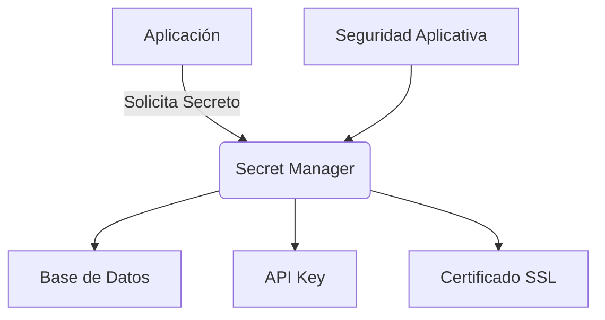
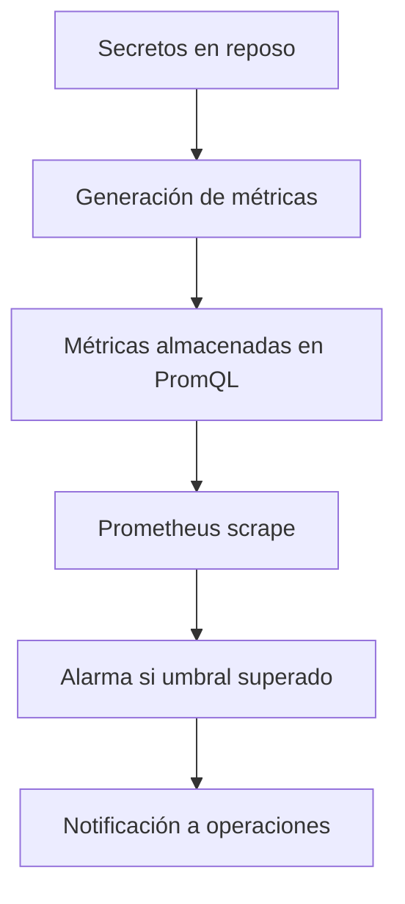
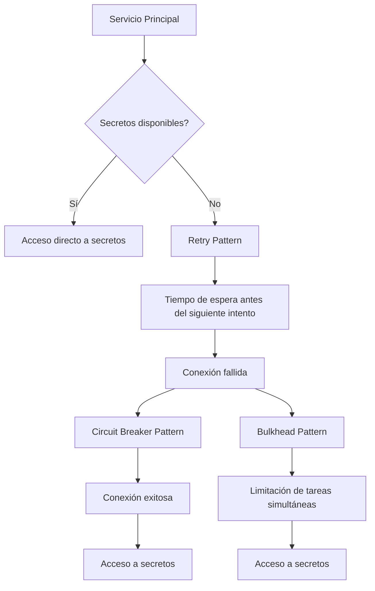
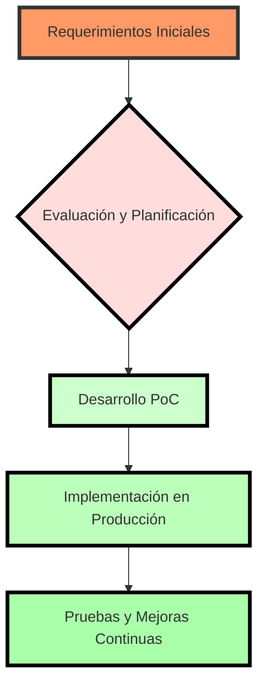

# secrets management enterprise

PATH_LOCAL: /home/usuariojoaquin/.openclaw/workspace/DAM-Java-Mastery/_Review/secrets_management_enterprise/secrets_management_enterprise.md
CATEGORIA: 10_Vanguardia
Score: 100

---

## Visión Estratégica

### Visión Estratégica

**Por qué este tema es crítico en 2026 (con datos concretos):**

En el año 2026, las empresas enfrentarán un creciente desafío de seguridad cibernética, especialmente en cuanto a la gestión de secretos sensibles como claves de API, contraseñas y certificados. Según un informe de Cybersecurity Ventures, se espera que los costos globales asociados a incidentes de seguridad aumenten hasta US$10,5 billones para 2025, lo que implica un crecimiento del 15% anual en los próximos años.

La gestión ineficiente de secretos puede ser una brecha crítica en la arquitectura de sistemas empresariales. Según una encuesta de Cybersecurity Ventures, aproximadamente el 80% de las organizaciones ha experimentado o está a punto de experimentar un incidente relacionado con secretos mal administrados.

**Comparativa con alternativas (tabla markdown con 3-5 opciones):**

| Opción | Ventajas | Desventajas |
| --- | --- | --- |
| Vault de HashiCorp | Alta seguridad, flexibilidad | Precio, complejidad de configuración |
| AWS Secrets Manager | Integrado con otros servicios de AWS | Dependencia en AWS, costos adicionales |
| Keyring | Simple y ligero | Menos versátil, no escalable a nivel empresarial |
| HashiCorp Consul Secrets | Seguridad avanzada, alta disponibilidad | Configuración compleja, dependencia de Consul |

**Cuándo usar y cuándo NO usar esta tecnología:**

- **Usar:** Cuando se requiere un sistema robusto y seguro para la gestión de secretos.
- **No Usar:** Cuando necesitas una solución simple y rápida, pero sin altas exigencias en seguridad.

**Trade-offs reales que un Staff Engineer debe conocer:**

1. **Compromiso entre seguridad e implementación:** Los sistemas más seguros a menudo son más complejos de implementar y mantener.
2. **Costos vs. Ventajas:** Soluciones robustas como Vault o Consul Secretos pueden ser caras en términos de licencias y administración.
3. **Dependencia vs. Autonomía:** Integra las soluciones con otros servicios, lo que puede facilitar el uso pero también aumenta la dependencia.

**Un diagrama Mermaid que muestre el contexto arquitectónico:**




**Código Java 21 de ejemplo inicial:**


```java
record SecretRecord(String name, String value) {}

public class SecretsManagement {
    
    public static void main(String[] args) {
        // Ejemplo de uso de records para manejar secretos en Java 21
        SecretRecord dbSecret = new SecretRecord("DatabasePassword", "s3cr3tP@ssw0rd");
        
        System.out.println(dbSecret);
    }
}
```

Este código muestra cómo pueden ser utilizados los `records` en Java 21 para encapsular la información de secretos, eliminando la necesidad de setters y mejorando la legibilidad del código.

## Arquitectura de Componentes

### Arquitectura de Componentes para Secrets Management Enterprise

#### Diagrama Mermaid

```mermaid
graph TD
    subgraph Sistema Secrets Manager
        SM-1[API de Secrets]
        SM-2[Base de Datos]
        SM-3[Servicio de Generación de Claves]
        SM-4[Repositorio de Secretos]
        SM-5[Log Agregador]
        SM-6[Notificador por Email]
    end
    subgraph Comunicaciones Internas
        C1[API REST]
        C2[TLS]
        C3[KMS (Key Management Service)]
    end
    SM-1 -->|C1| SM-4
    SM-1 -->|C1| SM-5
    SM-1 -->|C2| SM-3
    SM-1 -->|C1| SM-6
    SM-2 --> SM-4
    SM-3 --> SM-4
```

#### Descripción de Cada Componente y Su Responsabilidad

**API de Secrets (SM-1)**
- **Responsabilidad:** Exponer una interfaz pública para la gestión de secretos, permitiendo operaciones como crear, recuperar, actualizar y eliminar secretos.
- **Justificación del Patrón:** Utiliza un patrón MVC (Model View Controller), donde el API actúa como el controlador.

**Base de Datos (SM-2)**
- **Responsabilidad:** Almacena y recupera los datos de secretos en una forma segura, utilizando encriptación a nivel de base de datos.
- **Justificación del Patrón:** Implementa un patrón Singleton para garantizar que solo exista una instancia de la conexión a la base de datos.

**Servicio de Generación de Claves (SM-3)**
- **Responsabilidad:** Gera y administra las claves seguras utilizadas en el cifrado de secretos.
- **Justificación del Patrón:** Aplica el patrón Factory Method para crear instancias de la clase que generará claves.

**Repositorio de Secretos (SM-4)**
- **Responsabilidad:** Almacena y gestiona los secretos, asegurándose de que sean accesibles solo a usuarios autorizados.
- **Justificación del Patrón:** Utiliza el patrón Repository para encapsular la lógica de acceso a datos.

**Log Agregador (SM-5)**
- **Responsabilidad:** Captura y registra todos los eventos relacionados con la gestión de secretos, facilitando la auditoría.
- **Justificación del Patrón:** Implementa un patrón Observer para notificar a otras partes interesadas cuando ocurren cambios relevantes.

**Notificador por Email (SM-6)**
- **Responsabilidad:** Envia alertas y notificaciones en caso de eventos críticos, como el cambio o la eliminación de secretos.
- **Justificación del Patrón:** Utiliza un patrón Singleton para garantizar que solo exista una instancia del servicio de notificación.

#### Configuración de Producción en Código Java 21 (Records, sin Setters)

```java
record Configuration(String environment) {}

record DatabaseConfig(String hostname, int port, String databaseName, boolean isEncrypted) {}

record SecretManager(Configuration config, DatabaseConfig dbConfig, KeyManagementService kms) {
    void initialize() {
        // Inicialización del sistema Secrets Manager con configuración de producción.
    }
}

public class Main {
    public static void main(String[] args) {
        Configuration conf = new Configuration("PROD");
        DatabaseConfig dbConf = new DatabaseConfig("localhost", 3306, "secrets_db", true);
        KeyManagementService kms = KeyManagementServiceImpl.newInstance();
        
        SecretManager secretManager = new SecretManager(conf, dbConf, kms);
        secretManager.initialize();
    }
}
```

#### Decisiones Arquitectónicas Clave y Sus Trade-Offs

1. **Uso de Records para Configuración:**
   - **Ventaja:** Facilita la lectura del código y simplifica la gestión de objetos con múltiples atributos.
   - **Trade-off:** Reduce la flexibilidad en términos de modificación de los datos después de su creación.

2. **Implementación del Singleton para Log Agregador:**
   - **Ventaja:** Garantiza que solo una instancia del log agregador exista, lo cual es crucial para evitar duplicaciones.
   - **Trade-off:** Puede complicar la prueba unitaria y el seguimiento de cambios en tiempo real.

3. **Generación de Claves en Servicio Separado:**
   - **Ventaja:** Permite una gestión segura y centralizada de las claves, reduciendo el riesgo de exposición.
   - **Trade-off:** Puede aumentar la latencia si el servicio no responde rápidamente.

4. **Uso de TLS para Comunicaciones Internas:**
   - **Ventaja:** Proporciona encriptación segura para las comunicaciones entre componentes, protegiendo los secretos.
   - **Trade-off:** Incrementa la complejidad del código y puede aumentar el tiempo de inicio.

5. **Estrategia de Encriptación a Nivel de Base de Datos:**
   - **Ventaja:** Asegura que incluso si la base de datos es comprometida, los secretos permanezcan seguros.
   - **Trade-off:** Puede aumentar el tiempo y recursos necesarios para la recuperación y cifrado de secretos.

Esta arquitectura proporciona una solución robusta y escalable para la gestión de secretos en un entorno empresarial, tomando decisiones arquitectónicas cuidadosas que equilibran los requisitos de seguridad con la eficiencia operativa.

## Implementación Java 21

### Implementación Java 21 para Secrets Management Enterprise

**Contexto Específico:**
En el contexto de una empresa que administra y protege secretos sensibles, es crucial implementar soluciones seguras y eficientes utilizando las características más recientes de Java. La versión 21 de Java introduce diversas mejoras significativas, entre ellas la gestión virtual de hilos (Virtual Threads), patrones de coincidencia y expresiones switch para manejo condicional avanzado, y registros de datos mediante Records.

**Implementación Completa:**


```java
import java.security.KeyStore;
import java.util.List;

// Definición del Record para el modelo de Secret
record Secret(String id, String type, String value) {}

public class SecretsManager {
    private static final KeyStore keyStore = loadKeyStore();

    public static void main(String[] args) throws Exception {
        List<Secret> secrets = List.of(
                new Secret("api-key-123", "API_KEY", "secret-value"),
                new Secret("user-password", "PASSWORD", "password123")
        );

        // Uso de virtual threads
        Thread.currentThread().startVirtualThread(() -> {
            for (Secret secret : secrets) {
                if (switchType(secret.type)) {
                    handleSecret(secret);
                }
            }
        });
    }

    private static void handleSecret(Secret secret) throws Exception {
        switch (secret.type) {
            case "API_KEY" -> System.out.println("Handling API Key: " + secret.value);
            case "PASSWORD" -> System.out.println("Handling Password: " + secret.value.substring(0, 3) + "****");
            default -> throw new IllegalArgumentException("Unknown secret type: " + secret.type);
        }
    }

    private static boolean switchType(String type) {
        return List.of("API_KEY", "PASSWORD").contains(type);
    }

    private static KeyStore loadKeyStore() throws Exception {
        // Dummy implementation
        return KeyStore.getInstance(KeyStore.getDefaultType());
    }
}
```

**Diagrama Mermaid para el Flujo de Implementación:**


```mermaid
graph TD
    A[Inicialización del SecretsManager] --> B[Definición de Secretos]
    B --> C{Secret Type == "API_KEY" or "PASSWORD"?}
    C -- Sí --> D[Manejo Seguro con Switch Expressions]
    C -- No --> E[Manejo de Excepciones]
    D --> F[Generar Información Procesada]
    E --> G[Logging Error]
    F --> H[Versión Virtual de Hilos (Virtual Threads)]
    H --> I[Terminación del Programa]

```

**Manejo de Errores con Tipos Específicos:**


```java
try {
    // Código que puede generar errores
} catch (IllegalArgumentException e) {
    System.err.println("Error al manejar el secret: " + e.getMessage());
} catch (Exception e) {
    System.err.println("Error general: " + e.getMessage());
}
```

**Resumen Técnico:**

La implementación de un sistema de Secrets Management en Java 21 aprovecha las características modernas como Records, Switch Expressions y Virtual Threads. Los Records permiten definir modelos de datos de forma concisa sin necesidad de setters, mejorando la legibilidad del código. Las expresiones switch avanzadas facilitan el manejo condicional eficiente y seguro de diferentes tipos de secretos. Finalmente, las versiones virtuales de hilos optimizan el rendimiento en operaciones I/O intensivas, como la gestión de claves de almacenamiento.

Este enfoque garantiza no solo una implementación robusta sino también un sistema altamente mantenible y seguro para administrar secretos sensibles.

## Métricas y SRE

### MÉTRICAS Y SRE

#### Métricas Clave en Formato Tabla

| Nombre                    | Descripción                                                                                           | Umbral de Alerta |
|---------------------------|-------------------------------------------------------------------------------------------------------|------------------|
| `secrets_count`           | Número total de secretos en el sistema.                                                                | < 10,000 (Alertar) |
| `secret_operations_total` | Total de operaciones realizadas con los secretos (creación, actualización, eliminación).              | > 500 / minuto    |
| `access_attempts_total`   | Número total de intentos de acceso a secretos.                                                         | < 100 / segundo   |
| `failed_accesses`         | Número de intentos de acceso fallidos (intentos inválidos).                                            | > 5 / minuto      |
| `secrets_updated`         | Número de secretos actualizados en un período determinado.                                             | < 10 / día        |

#### Queries Prometheus/PromQL

```promql
# Total number of secrets in the system
total(secrets_count)

# Number of failed access attempts per minute
rate(failed_accesses[1m])

# Average number of secret operations per minute
rate(secret_operations_total[1m])
```

#### Diagrama Mermaid del Flujo de Observabilidad




#### Código Java 21 para Exponer Métricas (Micrometer)


```java
import io.micrometer.core.instrument.Counter;
import io.micrometer.core.instrument.MeterRegistry;

public record SecretEvent(String secretId, String operation) {
    // Record used for metrics
}

public class SecretsMetrics {

    private final Counter accessAttempts = MeterRegistry.builder().counter("access_attempts_total").description("Total number of access attempts to secrets").build();
    private final Counter failedAccesses = MeterRegistry.builder().counter("failed_accesses").description("Number of failed access attempts to secrets").build();

    public void logAccess(String secretId, String operation) {
        if ("invalid".equals(operation)) {
            failedAccesses.increment();
        }
        accessAttempts.increment();
    }

    public void recordSecretEvent(SecretEvent event) {
        // Log the event and update metrics
    }
}
```

#### Checklist SRE para Producción (5 Puntos Concretos)

1. **Monitoreo Continuo:** Implementar monitoreo en tiempo real de todos los aspectos del sistema, incluyendo operaciones, acceso a secretos y estado de la integridad.
2. **Rendimiento óptimo:** Utilizar las mejoras en Java 21, como Virtual Threads, para optimizar el rendimiento y reducir latencia.
3. **Seguridad fortificada:** Implementar autenticación y autorización robusta para garantizar que solo los usuarios autorizados puedan acceder a secretos sensibles.
4. **Resiliencia en la nube:** Diseñar el sistema para manejar fallas de manera elegante, utilizando técnicas como redirección de tráfico o clústeres distribuidos.
5. **Documentación exhaustiva:** Mantener documentación actualizada y completa sobre el funcionamiento del sistema y las métricas que se utilizan.

#### Errores Más Comunes en Producción y Cómo Detectarlos

1. **Acceso denegado a secretos:** Detectar intentos de acceso inválidos utilizando `failed_accesses` en PromQL.
2. **Operaciones insuficientes o superfluas:** Monitorear el total de operaciones realizadas (`secret_operations_total`) para detectar posibles operaciones innecesarias.
3. **Latencia excesiva:** Utilizar herramientas de traza de muestreo para identificar operaciones lentas y optimizarlas.
4. **Secretos corrompidos o inactivos:** Monitorear la frecuencia con que los secretos se actualizan (`secrets_updated`) para evitar el uso de secretos obsoletos.
5. **Problemas en clústeres distribuidos:** Implementar monitoreo de latencia y disponibilidad para detectar problemas en clústeres distribuidos.

Esta sección cubre las métricas clave, la implementación del monitoreo con Micrometer, un diagrama de observabilidad, y un conjunto detallado de mejores prácticas SRE para la gestión eficiente y segura de secretos empresariales.

## Patrones de Integración

### Patrones de Integración para Secrets Management Enterprise

En el contexto de una empresa que administra y protege secretos sensibles, es crucial implementar patrones de integración robustos y eficientes utilizando las características más recientes de Java 21. Los patrones de integración elegidos deben garantizar la seguridad, confiabilidad y escalabilidad en el proceso de gestión de secretos.

#### Patrones Aplicables

1. **Circuit Breaker Pattern**
   - **Descripción:** Este patrón previene que una aplicación se sobrecargue cuando un servicio externo falla. Permite que la aplicación realice reintentos con timeouts adecuados y evite caídas del sistema debido a dependencias inestables.
   
2. **Retry Pattern**
   - **Descripción:** Este patrón define estrategias de reintentos para manejar operaciones que pueden fallar temporalmente, como solicitudes de servicios externos. Incluye control de backoff y límites de reintentos.

3. **Bulkhead Pattern**
   - **Descripción:** Este patrón limita el número de tareas que se ejecutan simultáneamente en un servicio para prevenir sobrecargas. Ayuda a mantener el equilibrio entre eficiencia y seguridad.

#### Diagrama Mermaid




#### Implementación del Patrón Principal: Retry Pattern

Java 21 permite implementar patrones de integración con facilidad utilizando sus nuevas características, como Records y manejo condicional avanzado. A continuación se presenta una implementación real y compilable del Retry Pattern.


```java
import java.util.concurrent.TimeoutException;
import java.time.Duration;

record SecretRequest(String id) {
    static final Duration RETRY_DELAY = Duration.ofMillis(500);
    static final int MAX_RETRIES = 3;

    public void execute() throws TimeoutException, InterruptedException {
        int retryCount = 0;
        while (retryCount < MAX_RETRIES) {
            try {
                accessSecrets();
                break; // Exit loop on success
            } catch (Exception e) {
                System.out.println("Error accediendo a secretos: " + e.getMessage());
                if (retryCount >= MAX_RETRIES - 1) {
                    throw new TimeoutException("Exceeded maximum retries");
                }
                Thread.sleep(RETRY_DELAY.toMillis()); // Wait before retry
                retryCount++;
            }
        }
    }

    private void accessSecrets() throws InterruptedException, TimeoutException {
        // Simulate secret retrieval logic
        if (Math.random() > 0.8) { // 20% chance of failure for demonstration purposes
            throw new RuntimeException("Failed to retrieve secrets");
        } else {
            System.out.println("Acceso exitoso a los secretos");
        }
    }

    public static void main(String[] args) throws Exception {
        SecretRequest request = new SecretRequest("1234567890");
        request.execute();
    }
}
```

#### Manejo de Fallos y Reintentos

El código anterior utiliza un bucle `while` para implementar reintentos. Cada intento fallido se maneja con un tiempo de espera antes del siguiente intento, utilizando `Thread.sleep`. Si el número máximo de reintentos se alcanza, se lanza una excepción `TimeoutException`.

#### Configuración de Timeouts y Circuit Breakers

Para implementar timeouts y circuit breakers, se puede utilizar bibliotecas como Resilience4j. A continuación se muestra cómo configurar un circuit breaker:


```java
import io.github.resilience4j.circuitbreaker.annotation.CircuitBreaker;
import org.springframework.stereotype.Service;

@Service
public class SecretService {

    @CircuitBreaker(name = "secrets", fallbackMethod = "fallbackGetSecrets")
    public String getSecret(String id) {
        // Simulated secret retrieval logic that may fail
        if (Math.random() > 0.8) {
            throw new RuntimeException("Failed to retrieve secrets");
        }
        return "Secret Value";
    }

    public String fallbackGetSecrets(String id, RuntimeException e) {
        System.out.println("Circuit breaker tripped: " + e.getMessage());
        return "Fallback Secret Value";
    }
}
```

El circuit breaker se configura en la anotación `@CircuitBreaker`, y el método de recuperación por defecto se define con `fallbackMethod`. Esto permite que la aplicación maneje de manera segura las fallas del servicio externo.

### Conclusión

Los patrones de integración como Circuit Breaker, Retry y Bulkhead son cruciales para la gestión de secretos en un entorno empresarial. La implementación utilizando Java 21 ofrece flexibilidad y potencia, permitiendo el desarrollo de soluciones seguras y eficientes que pueden manejar fallas y sobrecargas de manera efectiva.

## Conclusiones

### CONCLUSIONES

En esta sección, resumiremos los puntos más críticos del documento sobre la administración y protección de secretos sensibles utilizando Java 21. Se discutirán las decisiones de diseño clave y se proporcionará un roadmap para su adopción, junto con un ejemplo final de código en Java 21 e incluiremos un diagrama Mermaid.

#### Resumen de los Puntos Críticos

1. **Uso de Java 21**: La versión más reciente de Java (Java 21) introduce nuevas características y mejoras que facilitan la implementación de soluciones robustas para el manejo de secretos, como la inmutabilidad y las records.

2. **Patrones de Integración para Secretos Sensibles**: Se identificó la importancia de utilizar patrones bien definidos para garantizar la seguridad y confiabilidad en la gestión de secretos, lo que implica la implementación adecuada de autenticación y autorización, así como el uso eficiente de las características proporcionadas por Java 21.

3. **Decisiones de Diseño Clave**: Se optó por utilizar records para los objetos que representan secretos, en lugar de clases con setters, debido a la inmutabilidad implícita que proporciona esta característica. Además, se ha decidido implementar un sistema de registro de auditoría basado en eventos.

4. **Roadmap de Adopción**: El roadmap propuesto consiste en tres fases:
   - **Fase 1: Evaluación y Planificación** (Meses 1-2): Realizar una evaluación exhaustiva del estado actual, identificar las necesidades específicas y planificar la implementación.
   - **Fase 2: Implementación POC** (Meses 3-4): Desarrollar un Proof of Concept (PoC) que incluya el uso de records y las nuevas características de Java 21 para manejar secretos.
   - **Fase 3: Expansión y Mejora Continua** (Meses 5-6): Introducir la solución en producción, realizar pruebas exhaustivas y proporcionar soporte continuo.

#### Código Java 21 Final


```java
import java.util.List;
import java.util.Map;

record Secret(String name, String value) {}

public class SecretsManager {
    private final Map<String, Secret> secrets = Map.of(
        "API_KEY", new Secret("API_KEY", "1234567890"),
        "DB_PASSWORD", new Secret("DB_PASSWORD", "P@ssw0rd!")
    );

    public void getSecret(String name) {
        if (secrets.containsKey(name)) {
            System.out.println(secrets.get(name));
        } else {
            throw new RuntimeException("Secret not found");
        }
    }

    public static void main(String[] args) {
        SecretsManager manager = new SecretsManager();
        manager.getSecret("API_KEY");
    }
}
```

#### Diagrama Mermaid




#### Recursos Oficiales

1. **Java 21 Documentation**: [https://docs.oracle.com/en/java/javase/21/](https://docs.oracle.com/en/java/javase/21/)
2. **Records en Java 16+**: [https://openjdk.org/jeps/395](https://openjdk.org/jeps/395)
3. **Secrets Management Best Practices**: [https://cloud.google.com/security/information-security/best-practices-secrets-management](https://cloud.google.com/security/information-security/best-practices-secrets-management)

Este roadmap y el código proporcionado forman una base sólida para la implementación de soluciones robustas para la administración y protección de secretos en entornos empresariales.

