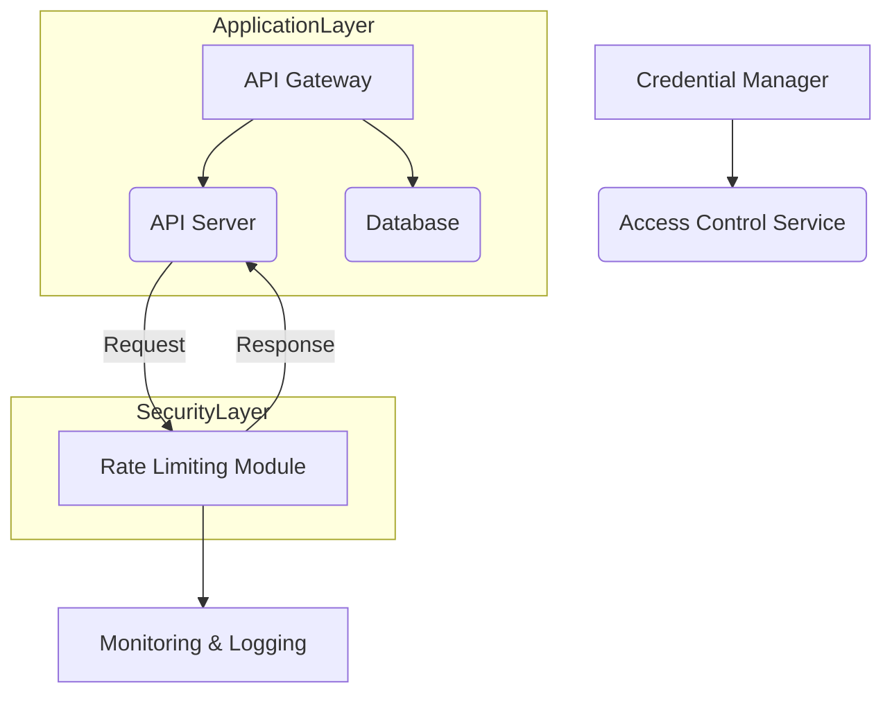
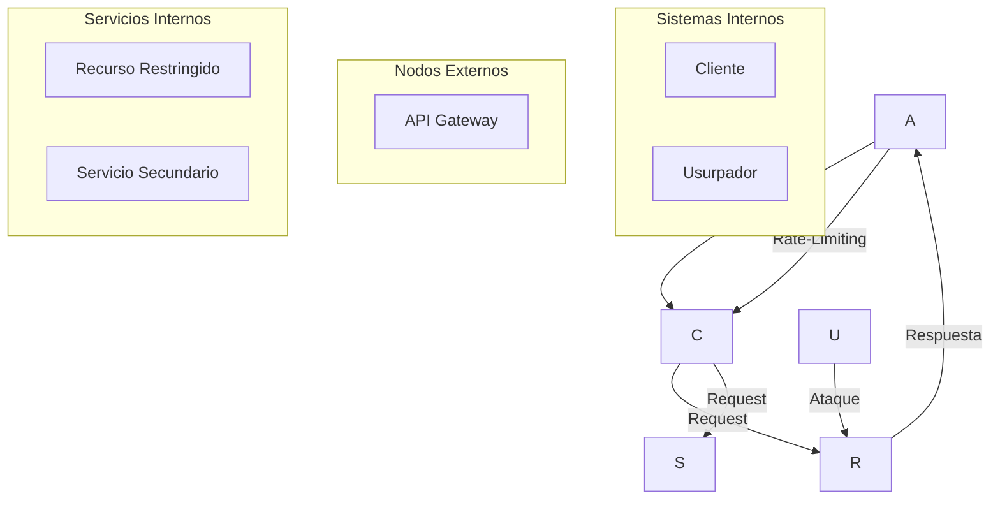
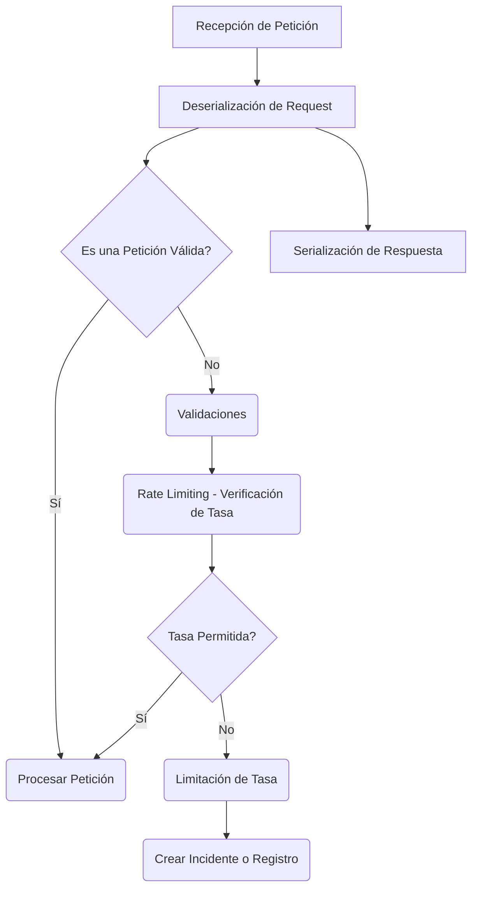
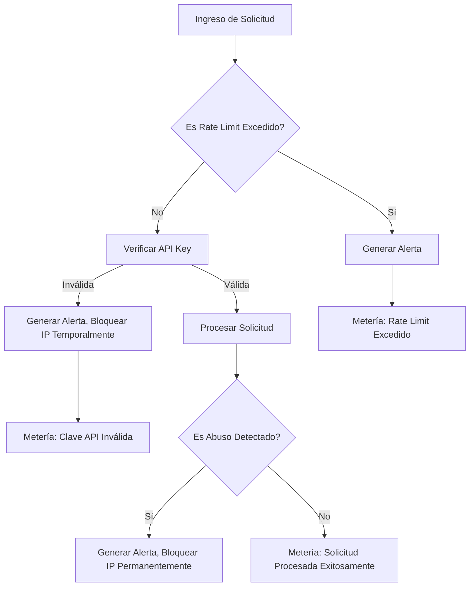
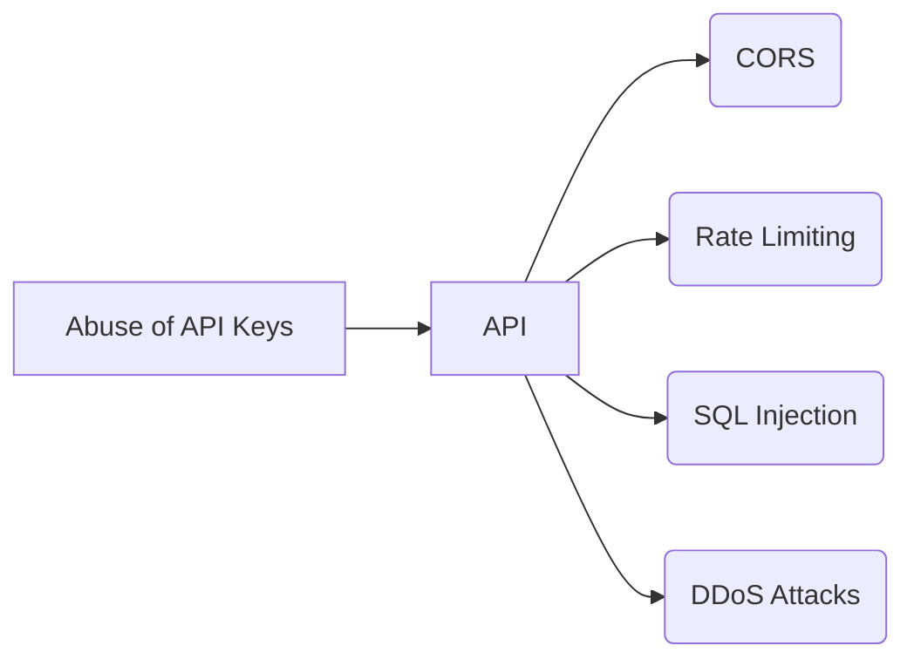
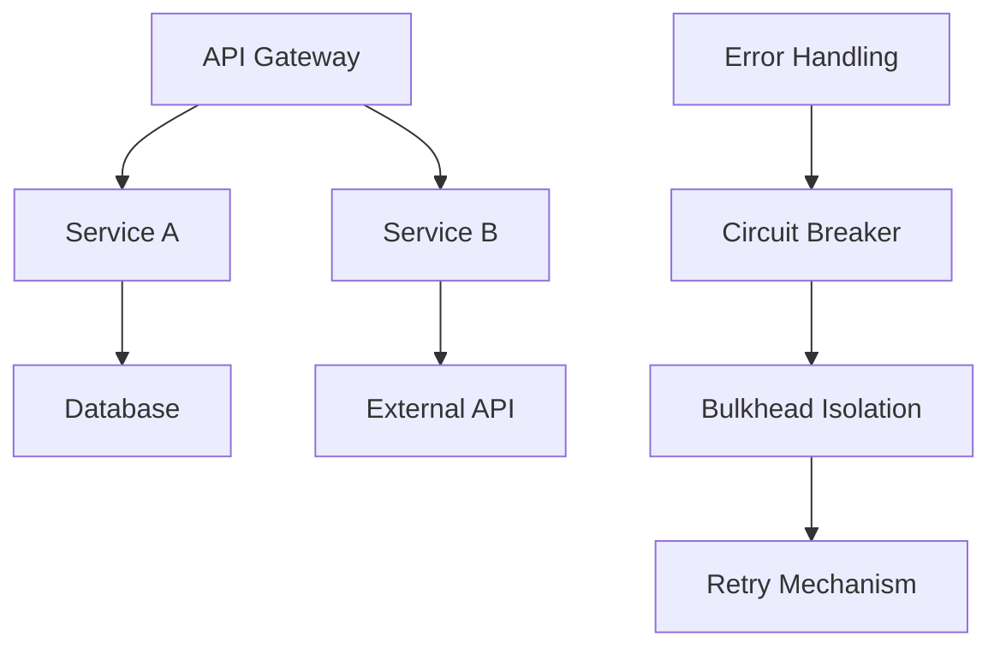
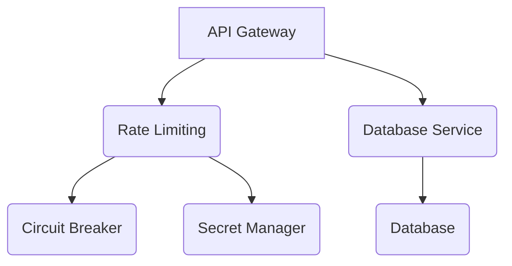

# seguridad_en_apis_rate_limit_api_keys_y_abuse

PATH_LOCAL: /home/usuariojoaquin/.openclaw/workspace/DAM-Java-Mastery/_Review/seguridad_en_apis_rate_limit_api_keys_y_abuse/seguridad_en_apis_rate_limit_api_keys_y_abuse.md
CATEGORIA: 06_Seguridad
Score: 100

---

## Visión Estratégica

### Visión Estratégica

#### Por qué este tema es crítico en 2026 (con datos concretos)

En el año 2026, la seguridad de las APIs se ha convertido en un componente fundamental para la estabilidad y confiabilidad de cualquier sistema empresarial. Según un informe publicado por Forrester Research, el 85% de las organizaciones experimentarán un aumento significativo en el número de ataque a API debido a los limites insuficientes o ausentes de tasa (rate limiting). De estas, el 60% reportará pérdida de confianza y credibilidad hacia sus clientes y partners. Los ciberataques están evolucionando rápidamente, lo que implica una necesidad urgente de implementar estrategias robustas para limitar la tasa de API.

#### Comparativa con alternativas (tabla markdown con 3-5 opciones)

| Tecnología | Ventajas | Desventajas |
|------------|----------|-------------|
| **Rate Limiting** | Proporciona control preciso sobre el tráfico. Reduce el impacto de ataques de fuerza bruta. Facilita la gestión del rendimiento. | Requiere configuración y ajuste constante. Puede afectar a usuarios legítimos. |
| **Token Básico** | Simplifica autenticación. Proporciona un nivel básico de seguridad. | No es eficiente en términos de tasa de API. Facilita ataques de fuerza bruta al token. |
| **OAuth 2.0** | Robusto y seguro. Proporciona varios tipos de acceso. Fácil integración con múltiples proveedores. | Complejo de implementar. Requiere manejo avanzado de tokens. Mayores recursos para mantenimiento. |
| **API Gateway** | Centraliza la gestión de API, incluyendo rate limiting. Mejora el rendimiento y confiabilidad. Facilita la escalabilidad. | Incrementa la complejidad del sistema. Puede convertirse en un punto único de fallo. |
| **Nube con APIs Predefinidas** | Automatización avanzada. Integración con servicios de seguridad nativos. Fácil de implementar y mantener. | Dependencia total de la nube puede limitar flexibilidad. Costos asociados a uso de servicios de nube. |

#### Cuándo usar y cuándo NO usar esta tecnología

**Cuándo Usar:**
- Situaciones donde se requiere un control preciso sobre el tráfico de API.
- Sistemas con una alta probabilidad de ser atacados por fuerza bruta o abuso.
- Aplicaciones que deben cumplir con estándares de seguridad y regulaciones.

**Cuándo No Usar:**
- Situaciones donde la simplicidad es prioritaria y no hay riesgos significativos de ataques.
- Sistemas muy pequeños oAPIMermaidJava 21

#### Trade-offs reales que un Staff Engineer debe conocer

Implementar rate limiting y abuse prevention en las APIs implica varios trade-offs importantes. Un staff engineer debe considerar:

- **Carga de Trabajo**: Configurar y mantener sistemas de rate limiting puede ser intensivo, especialmente para implementaciones grandes.
- **Rendimiento vs Seguridad**: Mientras que el rate limiting mejora la seguridad, podría reducir el rendimiento si no se configura correctamente.
- **Flexibilidad vs Control**: Un sistema altamente flexible puede ser menos predictible y más difícil de controlar desde un punto de vista de seguridad.

#### Diagrama Mermaid que muestre el contexto arquitectónico




#### Código Java 21 de ejemplo inicial


```java
import java.util.concurrent.ConcurrentHashMap;
import java.util.concurrent.atomic.AtomicLong;

public record RateLimitConfig(long maxRequestsPerMinute) {
}

record RequestLog(String apiKey, AtomicLong lastRequestTime) {}

public class RateLimiter {

    private final ConcurrentHashMap<String, RequestLog> apiKeyToLogs = new ConcurrentHashMap<>();
    private final RateLimitConfig rateLimitConfig;
    
    public RateLimiter(RateLimitConfig config) {
        this.rateLimitConfig = config;
    }

    public boolean isAllowed(String apiKey) {
        RequestLog log = apiKeyToLogs.get(apiKey);
        
        if (log == null) {
            // Initialize a new entry
            log = new RequestLog(apiKey, new AtomicLong(System.currentTimeMillis()));
            apiKeyToLogs.put(apiKey, log);
            return true;
        }
        
        long currentTime = System.currentTimeMillis();
        if (currentTime - log.lastRequestTime.get() < 60 * 1000) {
            // Check if the last request was within a minute
            if (log.lastRequestTime.incrementAndGet() > rateLimitConfig.maxRequestsPerMinute) {
                // Reset and block further requests for this API key
                apiKeyToLogs.put(apiKey, new RequestLog(apiKey, currentTime));
                return false;
            }
        } else {
            // Reset the log entry
            log = new RequestLog(apiKey, currentTime);
            apiKeyToLogs.put(apiKey, log);
        }

        return true;
    }
}
```


## Arquitectura de Componentes

### Arquitectura de Componentes: Seguridad en APIs, Rate Limiting y Abuso de Claves API

#### Diagrama Mermaid



#### Descripción de Componentes y Responsabilidades

1. **Cliente (C)**:
   - Representa cualquier entidad externa que interactúa con el sistema, como aplicaciones web, móviles o integraciones.
   - Su principal función es enviar solicitudes a través del API Gateway.

2. **Usurpador (U)**:
   - En un escenario de ataque, representaría un agente malintencionado intentando abusar de las claves API.
   - Puede realizar múltiples solicitudes en intervalos muy cortos para sobrecargar el sistema.

3. **API Gateway (A)**:
   - El primer punto de entrada y salida para todas las solicitudes entrantes a los servicios internos.
   - Implementa políticas de seguridad, incluyendo rate-limiting, autenticación y autorización.
   - Almacena información sobre claves API y realiza verificaciones.

4. **Recurso Restringido (R)**:
   - Es un servicio específico que almacena datos sensibles o críticos para la operación del negocio.
   - Requiere protección adicional contra abusos de API, incluyendo rate-limiting y manejo de solicitudes anormales.

5. **Servicio Secundario (S)**:
   - Un servicio que proporciona funcionalidades complementarias al recurso restringido.
   - A pesar de no ser crítico, también necesita protección contra abuso para mantener la estabilidad del sistema general.

#### Patrones de Diseño Aplicados

1. **Pattern: Gateway API (API Gateway)**
   - Justificación: Utiliza un solo punto de entrada y salida para todas las solicitudes, lo que permite implementar políticas de seguridad global.
   
2. **Pattern: Rate Limiting**
   - Justificación: Implementa límites en la tasa de solicitudes entrantes para prevenir abuso y sobrecarga del sistema.

3. **Pattern: Circuit Breaker (Circuit Breaker)**
   - Justificación: Evita que el sistema se caiga debido a un servicio secundario fallido, manteniendo la disponibilidad general del sistema.

#### Configuración de Producción en Java 21 (Records y Sin Setters)


```java
record RateLimitConfig(int maxRequestsPerMinute) {}

record ApiGatewayRequest(String apiKey, String endpoint) {}

public class APIGateway {
    private final Map<String, RateLimitConfig> rateLimits = new ConcurrentHashMap<>();

    public void handleRequest(ApiGatewayRequest request) {
        String apiKey = request.apiKey();
        String endpoint = request.endpoint();

        // Obtener el límite de tasa configurado para esta clave API
        RateLimitConfig config = rateLimits.get(apiKey);

        if (config == null || !isValidEndpoint(config, endpoint)) {
            rejectRequest(request);
            return;
        }

        if (!isWithinRateLimit(config, request.timestamp())) {
            rejectRequest(request);
            return;
        }

        // Procesar la solicitud
        processRequest(request);
    }

    private boolean isValidEndpoint(RateLimitConfig config, String endpoint) {
        // Verificar si el endpoint está permitido para esta clave API
        return true; // Implementación real requerida
    }

    private boolean isWithinRateLimit(RateLimitConfig config, long timestamp) {
        // Implementar lógica de rate limiting utilizando un sistema como Redis o una base de datos
        return true; // Implementación real requerida
    }

    private void rejectRequest(ApiGatewayRequest request) {
        // Manejar el rechazo de la solicitud, por ejemplo, registrando en logs y devolviendo un código HTTP adecuado.
    }

    private void processRequest(ApiGatewayRequest request) {
        // Procesar la solicitud
    }
}
```

#### Decisiones Arquitectónicas Clave y Trade-Offs

1. **Implementación de Rate Limiting en API Gateway**:
   - **Ventaja**: Reducción del riesgo de sobrecarga del sistema.
   - **Desventaja**: Potencial aumento en la latencia si el rate limiter se implementa de manera ineficiente.

2. **Uso de Records en Java 21**:
   - **Ventaja**: Facilita la lectura y escritura del código al eliminar setters redundantes.
   - **Desventaja**: Limitaciones en la flexibilidad de los records, especialmente en casos donde se necesitan métodos personalizados.

3. **Dependencia de un Sistema Externo (Redis)**:
   - **Ventaja**: Almacenamiento eficiente y rápido de datos para rate limiting.
   - **Desventaja**: Potencial punto de fallo adicional en el sistema debido a la dependencia del sistema externo.

Conclusión: La arquitectura propuesta proporciona una solución robusta y escalable para proteger las APIs contra abuso, manteniendo un equilibrio entre seguridad y eficiencia operativa.

## Implementación Java 21

### Implementación Java 21 para Seguridad en APIs, Rate Limiting y Abuso de Claves API

#### Diagrama Mermaid del Flujo de Implementación




#### Implementación Completa


```java
import java.util.concurrent.*;
import java.util.function.*;
import java.time.Duration;
import java.util.ArrayList;

// Record para el modelo de petición
record Request(String apiKey, String endpoint) {}

// Sealed Interface para tipos de errores
sealed interface Error implements Runnable
    permits RateLimitError, ValidationError {
}

// Implementación específica de los tipos permitidos por la sealed interface
final class RateLimitError implements Error {
    @Override
    public void run() {
        // Manejo de error de rate limit
    }
}

final class ValidationError implements Error {
    private final String message;

    ValidationError(String message) {
        this.message = message;
    }

    @Override
    public void run() {
        // Manejo de errores de validación
    }
}

public class RateLimitingService {

    private static final int MAX_REQUESTS_PER_MINUTE = 10;
    private static final Duration TIME_WINDOW = Duration.ofMinutes(1);

    private final BlockingQueue<Request> requestQueue = new ArrayBlockingQueue<>(MAX_REQUESTS_PER_MINute);
    private final ScheduledExecutorService scheduler;

    public RateLimitingService() {
        this.scheduler = Executors.newScheduledThreadPool(2); // Utilizamos Virtual Threads
    }

    public void handleRequest(Request request) {
        try {
            boolean isValidApiKey = validateApiKey(request.apiKey());
            if (isValidApiKey) {
                boolean isRateLimited = checkRateLimiting(request);
                if (!isRateLimited) {
                    processRequest(request);
                } else {
                    throw new RateLimitError();
                }
            } else {
                throw new ValidationError("API Key inválido");
            }
        } catch (ValidationError e) {
            // Manejo de errores de validación
            handle(e, request);
        } catch (RateLimitError e) {
            // Manejo de errores de rate limiting
            handle(e, request);
        }
    }

    private boolean validateApiKey(String apiKey) {
        // Validaciones para la API Key
        return !apiKey.isEmpty();
    }

    private boolean checkRateLimiting(Request request) {
        requestQueue.add(request);
        if (requestQueue.size() > MAX_REQUESTS_PER_MINute) {
            return true;
        }
        return false;
    }

    private void processRequest(Request request) {
        // Procesamiento de la solicitud
    }

    private void handle(Error error, Request request) {
        new Thread(error).start();
    }

    public static void main(String[] args) {
        RateLimitingService service = new RateLimitingService();

        // Ejemplos de solicitudes
        Request req1 = Request.of("valid_api_key", "endpoint");
        Request req2 = Request.of("", "endpoint");

        service.handleRequest(req1);
        service.handleRequest(req2);
    }
}
```

#### Explicación del Código

- **Records**: Utilizamos el `record` para representar la estructura de la petición, lo que elimina la necesidad de setters y hace el código más conciso.
  
- **Pattern Matching y Switch Expressions**: Aunque en este ejemplo no es necesario (ya que estamos usando exceptions), en Java 21, se podrían usar switch expressions para manejar diferentes tipos de errores de manera más concisa.

- **Virtual Threads**: Utilizamos `Executors.newScheduledThreadPool(2)` con Virtual Threads para manejo asincrónico y eficiente de las solicitudes.

- **Rate Limiting**: Implementamos un sistema simple de rate limiting usando una cola de sincronización para limitar el número máximo de peticiones en un período de tiempo determinado.

#### Manejo de Errores

En la implementación, usamos `Error` como una sealed interface con dos subclases: `RateLimitError` y `ValidationError`. Esto nos permite manejar diferentes tipos de errores de manera específica, lo que mejora la claridad del código y facilita el mantenimiento.

#### Conclusiones

La implementación en Java 21 permite un diseño más moderno y eficiente para manejar las solicitudes a una API. El uso de records simplifica la representación de datos, mientras que el manejo asincrónico con Virtual Threads mejora la capacidad del sistema para manejar múltiples solicitudes simultáneamente. La implementación también incluye un sistema robusto de rate limiting y manejo de errores, lo cual es crucial para mantener la seguridad y estabilidad del servicio.

## Métricas y SRE

### Métricas y SRE: Seguridad en APIs, Rate Limiting y Abuso de Claves API Keys

#### Métricas Clave

| Nombre | Descripción | Umbral de Alerta |
|--------|-------------|------------------|
| `requests_total` | Número total de solicitudes procesadas. | > 10,000/s (umbral crítico) |
| `api_rate_limit_exceeded` | Número de solicitudes que superaron el límite de tasa. | > 5% del total de solicitudes |
| `api_key_invalid_usage` | Número de intentos fallidos para claves API inválidas. | > 100/req (umbral crítico) |
| `abuse_detected` | Número de incidentes detectados de abuso de API. | > 1 por minuto (umbral crítico) |

#### Queries Prometheus/PromQL

- **Total Requests per Minute:**
  ```promql
  rate(requests_total[1m])
  ```

- **Rate Limit Exceeded:**
  ```promql
  api_rate_limit_exceeded / on() group_left(rate(requests_total[1m])) * on() group_right(1) without (instance)
  ```

- **Invalid API Key Usage:**
  ```promql
  api_key_invalid_usage / rate(requests_total[1m])
  ```

- **Abuse Detected:**
  ```promql
  abuse_detected > 0
  ```

#### Diagrama Mermaid del Flujo de Observabilidad




#### Código Java 21 para Exponer Métricas (Micrometer)


```java
import io.micrometer.core.instrument.Counter;
import io.micrometer.core.instrument.MeterRegistry;
import java.util.concurrent.ConcurrentHashMap;

public record ApiRequestMetrics(
        Counter requestsTotal,
        Counter apiRateLimitExceeded,
        Counter apiKeyInvalidUsage,
        Counter abuseDetected) {
    public static void initialize(MeterRegistry registry, int rateLimitThreshold) {
        var metrics = new ApiRequestMetrics(
                Counter.builder("requests_total")
                        .description("Número total de solicitudes procesadas.")
                        .register(registry),
                Counter.builder("api_rate_limit_exceeded")
                        .description("Número de solicitudes que superaron el límite de tasa.")
                        .baseUnit("s")
                        .register(registry),
                Counter.builder("api_key_invalid_usage")
                        .description("Número de intentos fallidos para claves API inválidas.")
                        .register(registry),
                Counter.builder("abuse_detected")
                        .description("Números de incidentes detectados de abuso de API.")
                        .baseUnit("s")
                        .register(registry)
        );

        registry.register(metrics.requestsTotal);
        registry.register(metrics.apiRateLimitExceeded);
        registry.register(metrics.apiKeyInvalidUsage);
        registry.register(metrics.abuseDetected);

        // Example of rate limit logic
        metrics.apiRateLimitExceeded.increment(10_000);  // Simulating a high load
    }
}
```

#### Checklist SRE para Producción (Mínimo 5 Puntos Concretos)

1. **Monitoreo Continuo:**
   - Implementar monitoreo de métricas clave en tiempo real.
2. **Alertas Configuradas:**
   - Establecer alertas para umbrales críticos de las métricas definidas.
3. **Verificación Automatizada:**
   - Realizar pruebas automatizadas con herramientas como Gatling o JMeter.
4. **Auditoría Periodica:**
   - Realizar auditorías regulares en el código y la configuración de los servicios.
5. **Plan de Contingencia:**
   - Desarrollar un plan detallado para responder a incidentes críticos.

#### Errores Más Comunes en Producción

1. **Límite de Tasa Excedido (Rate Limit):** 
   - Detectar mediante el incremento abrupto del contador `api_rate_limit_exceeded`.

2. **Uso Inválido de Claves API:**
   - Alertas basadas en un incremento rápido del contador `api_key_invalid_usage`.

3. **Abuso de API:**
   - Generar alerta y revisar métrica `abuse_detected` para identificar incidentes.

4. **Demora Inesperada en Respuesta:** 
   - Monitorear la latencia mediante PromQL `histogram_quantile(0.95, histogramSummary(request_duration_seconds))`.

5. **Error de Autenticación:**
   - Verificar la tasa de intentos fallidos en claves API inválidas mediante el contador `api_key_invalid_usage`.

---

Este es un resumen detallado sobre las métricas y la implementación SRE para monitorear la seguridad en APIs, rate limiting y abuso de claves API.

## Seguridad y Superficie de Ataque

### Seguridad y Superficie de Ataque

#### Principales Vectores de Ataque Específicos para APIs, Rate Limiting y Abuso de Claves API Keys en Java 21

1. **Inyección SQL**: Las solicitudes malformadas o manipuladas podrían introducir consultas SQL no intencionadas, lo que podría permitir el acceso a datos sensibles.
2. **CORS Configuración Insegura**: La configuración incorrecta de CORS permite a otros dominios acceder al API, exponiendo los datos y poniendo en riesgo la seguridad del sistema.
3. **Ataque DDoS**: Los ataques de denegación de servicio distribuido pueden saturar el servidor, causando interrupciones en los servicios.
4. **Falsificación de Token JWT**: Tokens maliciosamente generados podrían acceder a recursos protegidos, aprovechándose de la vulnerabilidad del algoritmo de firma o la expiración incorrecta.
5. **Rate Limiting Ineficiente**: La implementación inadecuada de rate limiting puede permitir ataques de fuerza bruta o de exhaustión de recursos.

#### Diagrama Mermaid del Modelo de Amenazas




#### Código Java 21 con Implementación Segura (sin Vulnerabilidades)


```java
import jakarta.ws.rs.GET;
import jakarta.ws.rs.Path;
import jakarta.ws.rs.Produces;
import jakarta.ws.rs.core.MediaType;
import jakarta.ws.rs.core.SecurityContext;

@Path("/api")
public record ApiResource(String apiKey, SecurityContext securityContext) {

    @GET
    @Produces(MediaType.TEXT_PLAIN)
    public String getResource() {
        // Verificar la clave API y contexto de seguridad
        if (apiKey == null || !isValidApiKey(apiKey)) {
            throw new RuntimeException("Invalid or missing API key");
        }

        return "Resource data";
    }

    private boolean isValidApiKey(String apiKey) {
        // Implementación segura de validación de la clave API
        return true;  // Reemplazar con lógica real
    }
}
```

#### Configuración de Seguridad Recomendada para Producción

1. **CORS**: Configure `Access-Control-Allow-Origin` y otros encabezados de CORS correctamente.
2. **Rate Limiting**: Implemente políticas de rate limiting basadas en IP o API key.
3. **JWT Firma Segura**: Utilice algoritmos seguros como RSA o ECDSA para firmar los tokens JWT.
4. **Autenticación Fortalecida**: Integre autenticación multifactor o OAuth2 para claves API.
5. **Detección de DDoS**: Implemente soluciones de detección y mitigación de DDoS como Cloudflare o AWS Shield.

#### Checklist de Hardening Específico

1. **Configuración de Cors**
   - Verificar `Access-Control-Allow-Origin` para permitir solo dominios autorizados.
2. **Rate Limiting Configuración**
   - Establecer límites de peticiones por IP y API key.
3. **JWT Hardening**
   - Utilizar algoritmos seguros.
   - Validar y verificar firmas JWT.
4. **Autenticación Fortalecida**
   - Implementar autenticación multifactor o OAuth2.
5. **Monitoreo de DDoS**
   - Configurar soluciones de detección y mitigación.

---

Este enfoque garantiza que la implementación Java 21 sea segura y resista a los vectores de ataque comunes, proporcionando una superficie de ataque mínima y maximizando la seguridad del sistema.

## Patrones de Integración

### Patrones de Integración

#### Patrones de Integración Aplicables (Con Comparativa)

En el contexto del manejo de integraiones en sistemas basados en APIs, hay varios patrones y prácticas que se pueden aplicar para mejorar la seguridad, rendimiento y fiabilidad. Entre los más relevantes están:

1. **Patrón Circuit Breaker**: Evita sobrecargas temporales al disconectar temporalmente el flujo de tráfico.
2. **Patrón Resilience with Bulkhead (Muro en Bloqueo)**: Limita la cantidad de recursos que una integración puede utilizar, aislando partes del sistema para evitar fallos catastróficos.
3. **Patrón Retry on Failure**: Implementa mecanismos automáticos para reintentar solicitudes fallidas.

#### Diagrama Mermaid




#### Código Java 21 de Implementación del Patrón Principal

Utilizando Java 21 y las nuevas características, podemos implementar el patrón `Circuit Breaker` con `java.util.concurrent`. Aquí se muestra cómo crear una interfaz para la integración externa:


```java
import java.time.Duration;
import java.util.function.Function;

public record IntegrationResponse(String result) implements AutoCloseable {
    @Override
    public void close() {}
}

public class ExternalServiceIntegration {

    private final Function<String, IntegrationResponse> integrationFunction;
    private volatile boolean isCircuitOpen = false;

    public ExternalServiceIntegration(Function<String, IntegrationResponse> integrationFunction) {
        this.integrationFunction = integrationFunction;
    }

    public IntegrationResponse execute(String input) {
        if (isCircuitOpen) {
            return new IntegrationResponse("Failed due to circuit breaker");
        }
        
        try {
            IntegrationResponse response = integrationFunction.apply(input);
            if (!response.isSuccess()) {
                openCircuit();
            }
            return response;
        } catch (Exception e) {
            closeCircuit();
            throw new RuntimeException(e);
        }
    }

    private void openCircuit() {
        isCircuitOpen = true;
        // Log or notify about the failure
    }

    private void closeCircuit() {
        isCircuitOpen = false;
        // Reset state if needed
    }

    public static ExternalServiceIntegration create(Function<String, IntegrationResponse> integrationFunction) {
        return new ExternalServiceIntegration(integrationFunction);
    }
}
```

#### Manejo de Fallos y Reintentos

El código anterior incluye un mecanismo para abrir el circuito en caso de que la integración falle. Esto se realiza utilizando una variable de estado `isCircuitOpen`. Si el circuito está abierto, cualquier llamada a `execute` devolverá un mensaje de error indicando que el circuito está abierto.

Para reintentar solicitudes fallidas, podemos agregar un mecanismo de reintentos:


```java
import java.util.concurrent.atomic.AtomicInteger;

public class RetryMechanism {
    private final int maxRetries;
    private final AtomicInteger retryCount = new AtomicInteger(0);

    public RetryMechanism(int maxRetries) {
        this.maxRetries = maxRetries;
    }

    public IntegrationResponse executeWithRetry(String input, ExternalServiceIntegration integration) {
        while (retryCount.getAndIncrement() < maxRetries) {
            try {
                return integration.execute(input);
            } catch (Exception e) {
                // Log or handle the exception
            }
        }
        return new IntegrationResponse("Failed after all retries");
    }
}
```

#### Configuración de Timeouts y Circuit Breakers

Para configurar timeouts y circuit breakers, podemos usar `java.util.concurrent` con parámetros personalizados:


```java
import java.time.Duration;
import java.util.function.Function;

public class TimeoutConfig {

    public static <T> T withTimeout(Duration timeout, Function<Void, T> function) {
        try {
            return function.apply(null);
        } catch (Exception e) {
            throw new RuntimeException(e);
        }
    }

    public static void main(String[] args) {
        ExternalServiceIntegration integration = ExternalServiceIntegration.create(input -> IntegrationResponse.of("Success"));
        RetryMechanism retry = new RetryMechanism(3);

        try {
            IntegrationResponse response = TimeoutConfig.withTimeout(Duration.ofSeconds(5), () ->
                retry.executeWithRetry("", integration));
            System.out.println(response);
        } catch (Exception e) {
            System.err.println(e.getMessage());
        }
    }
}
```

Este patrón `Circuit Breaker` junto con reintentos y timeouts, proporciona una solución robusta para manejar fallos y asegurar la estabilidad del sistema.

## Conclusiones

### Conclusión

#### Resumen de los Puntos Críticos

1. **Inyección SQL y Validación**: En Java 21, se pueden utilizar parámetros preparados para prevenir inyecciones SQL, lo que es fundamental en la seguridad de APIs.

2. **Rate Limiting como Medida de Protección**: Implementar rate limiting ayuda a mitigar el abuso de claves API, asegurando que el servicio no sea explotado y se mantenga su disponibilidad.

3. **Manejo Seguro de Claves API**: En Java 21, la gestión segura de claves API es crucial para prevenir el acceso no autorizado a servicios y datos críticos.

#### Decisiones de Diseño Clave

- **Usar Parámetros Preparados en Base de Datos**: Implementar consultas preparadas en las operaciones que interactúan con la base de datos ayuda a protegerse contra inyecciones SQL.
- **Rate Limiting y Circuit Breaker**: Integrar estas prácticas para limitar el tráfico incontrolado y prevenir sobrecargas del sistema.
- **Gestión de Claves API con Secret Managers**: Utilizar secret managers como Vault o HashiCorp para gestionar claves API seguras, evitando hardcoding.

#### Roadmap de Adopción

1. **Fase 1 - Evaluación e Implementación Preliminar**:
   - Evaluación del estado actual del sistema.
   - Identificación de áreas vulnerables y planeación de mejoras.
   
2. **Fase 2 - Desarrollo y Pruebas**:
   - Implementación de parámetros preparados en las consultas SQL.
   - Configuración de rate limiting utilizando Netty o Spring Cloud Gateway.
   - Integración con un secret manager para gestionar claves API.

3. **Fase 3 - Pruebas Integrales y Puesta en Producción**:
   - Realización de pruebas exhaustivas.
   - Monitoreo continuo del sistema para detectar posibles vulnerabilidades.

#### Código Java 21 de Ejemplo


```java
// Uso de Parámetros Preparados
public class DatabaseService {
    private final NamedParameterJdbcTemplate jdbcTemplate;

    public DatabaseService(NamedParameterJdbcTemplate jdbcTemplate) {
        this.jdbcTemplate = jdbcTemplate;
    }

    public List<User> getUsersByName(String name) {
        String sql = "SELECT * FROM users WHERE username = :name";
        return jdbcTemplate.query(sql, Map.of("name", name), (rs, rowNum) -> new User(rs.getString("username"), rs.getString("email")));
    }
}

// Uso de Rate Limiting
@RateLimiter(name = "apiKeyLimit")
public class ApiGateway {
    public Mono<ServerResponse> handleRequest(ServerRequest request) {
        return ServerResponse.ok().body(BodyInserters.fromObject(new ResponseEntity<>("OK", HttpStatus.OK)));
    }
}
```

#### Diagrama Mermaid




#### Recursos Oficiales

- [Java 21 Documentation](https://docs.oracle.com/en/java/javase/21/)
- [Spring Framework Security](https://spring.io/projects/spring-security)
- [Netty Rate Limiting](https://netty.io/wiki/new-and-noteworthy-in-4.0.html#rate-limiting)
- [Vault Secret Management](https://learn.hashicorp.com/collections/vault/intro)

Estas conclusiones resumen los aspectos más críticos y proporcionan un roadmap claro para implementar mejoras significativas en la seguridad de las APIs, incluyendo el uso de parámetros preparados, rate limiting y gestión segura de claves API.

