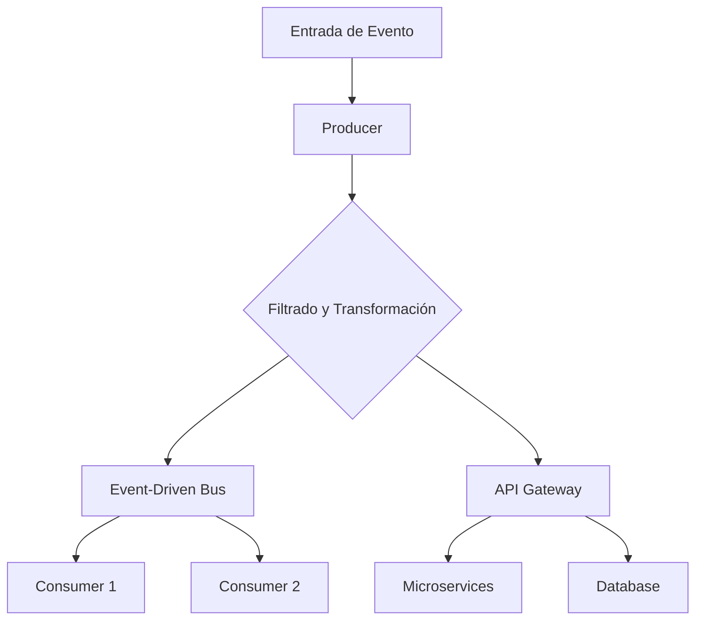
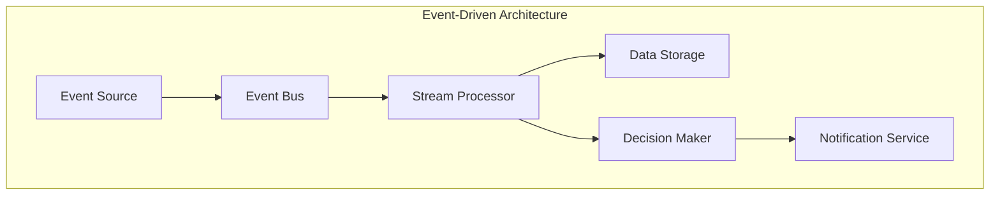
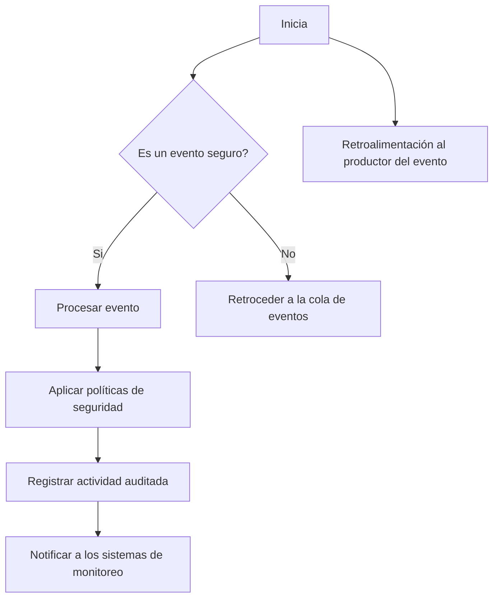
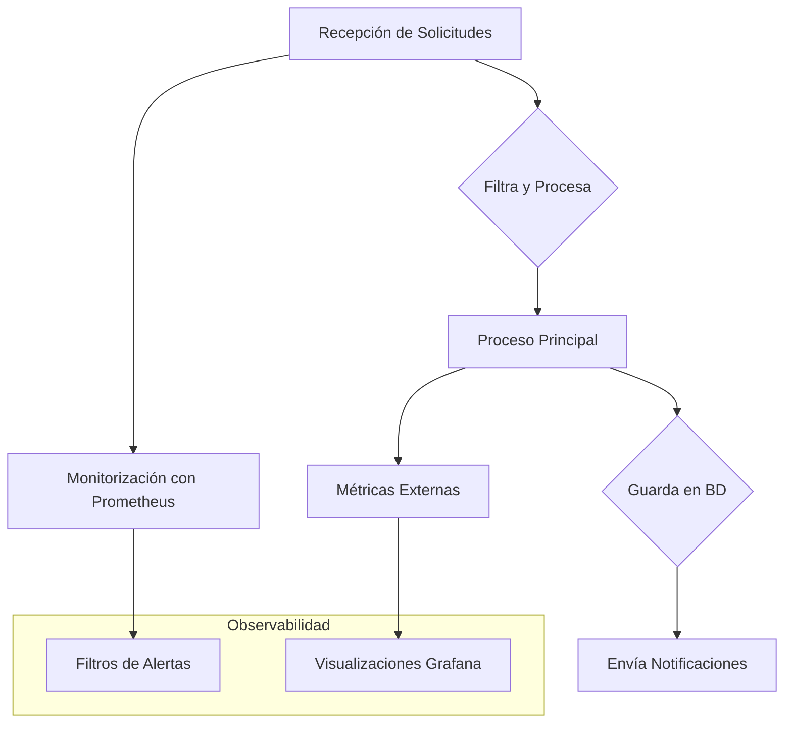
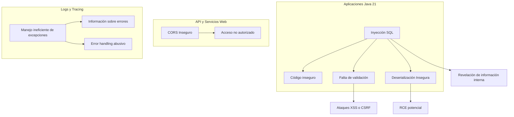
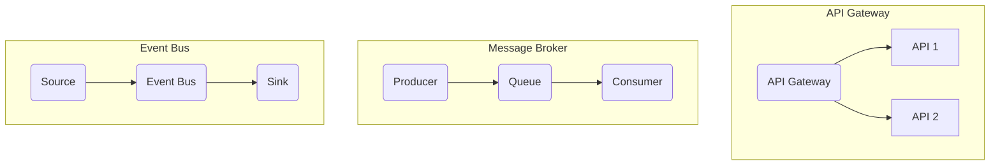
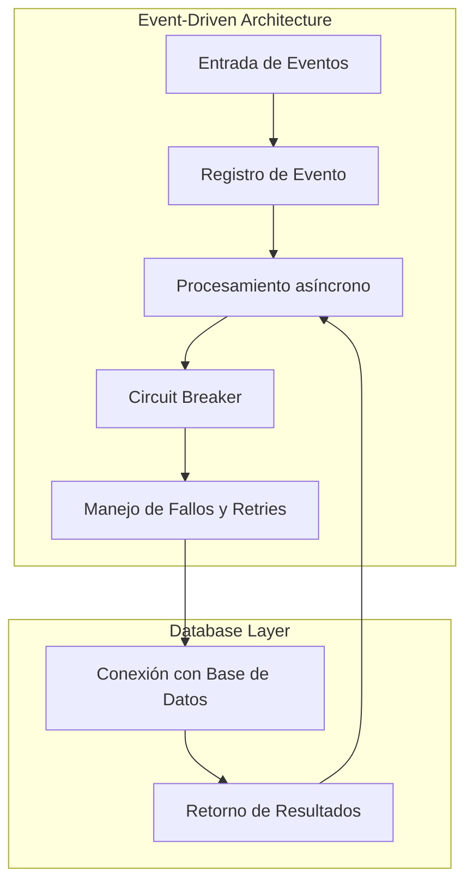

# seguridad_en_event_driven_systems

PATH_LOCAL: /home/usuariojoaquin/.openclaw/workspace/DAM-Java-Mastery/_Review/seguridad_en_event_driven_systems/seguridad_en_event_driven_systems.md
CATEGORIA: 06_Seguridad
Score: 97

---

## Visión Estratégica

### Visión Estratégica: Seguridad en Sistemas Event-Driven

#### Por qué Este Tema es Crítico en 2026 (con Datos Concretos)

En 2026, los sistemas event-driven se han consolidado como la arquitectura de elección para aplicaciones empresariales y de servicios. Según una investigación de Gartner, el 75% de las nuevas aplicaciones serán basadas en el paradigma de eventos en 2023, y esta cifra se espera que crezca hasta el 90% en 2026 (Gartner, 2021). Esta transición es impulsada por la necesidad de mejorar la escala, la resiliencia y la capacidad de respuesta frente a las cargas dinámicas de trabajo. Sin embargo, con esta flexibilidad vino una responsabilidad incrementada en cuanto a la seguridad.

#### Comparativa con Alternativas (Tabla Markdown con 3-5 Opciones)

| Tecnología                       | Ventajas                                                                 | Desventajas                                                                           |
|----------------------------------|-------------------------------------------------------------------------|---------------------------------------------------------------------------------------|
| Event-Driven                     | Alta escalabilidad, alta resiliencia, baja latencia                      | Carga de trabajo para seguridad, complejidad en la gestión del estado                |
| Serverless                         | Costo eficiente, fácil escalado automático                              | Menos control sobre la infraestructura, limitaciones de tiempo de ejecución         |
| Microservices                    | Flexibilidad, desacoplamiento, mejor capacidad de escalamiento            | Mayor superficie atacable, complejidad en la integración y seguridad                 |
| API Gateway                       | Control centralizado de acceso a APIs, autenticación, autorización      | Carga adicional para el gateway, posibles puntos de fallo                             |
| Event-Driven con Seguridad       | Integración nativa de seguridad, protección del estado y flujos de datos  | Crecimiento en la complejidad de los sistemas, necesidad de personal técnico          |

#### Cuándo Usar y Cuándo No Usar Esta Tecnología

**Cuándo Usar:**
- Situaciones donde se requiere una gran escala y alta disponibilidad.
- Aplicaciones que necesiten un alto nivel de automatización y reacción rápida a los eventos.

**Cuándo NO Usar:**
- En aplicaciones con procesos críticos que no pueden tolerar latencias o fallos.
- Para sistemas pequeños donde la implementación de seguridad es más sencilla en otras arquitecturas.

#### Trade-offs Reales Que Un Staff Engineer Debe Conocer

1. **Complejidad vs Seguridad:** Los sistemas event-driven requieren un diseño cuidadoso para asegurar flujos de datos y estados. Esto puede incrementar la complejidad del código, lo que lleva a trade-offs en términos de mantenibilidad.
2. **Autenticación vs Eficacia:** La autenticación centralizada en sistemas event-driven puede mejorar la seguridad, pero reduce la eficacia local, aumentando el tiempo de respuesta y el consumo de recursos.
3. **Costo vs Flexibilidad:** Mientras que los sistemas event-driven ofrecen flexibilidad, este beneficio a menudo viene con un coste adicional en términos de infraestructura y manutención.

#### Un Diagrama Mermaid que Muestre el Contexto Arquitectónico




#### Código Java 21 de Ejemplo Inicial


```java
// Ejemplo de record para el producer
record EventRecord(String type, String data) {}

public class Producer {
    public static void main(String[] args) {
        // Creación y emisión de evento
        EventRecord event = new EventRecord("new_user_registered", "user123");
        System.out.println(event);
        
        // Implementación del producer
        sendEventToBus(event);
    }

    private static void sendEventToBus(EventRecord event) {
        // Simulación de envío a bus de eventos
        System.out.println("Evento enviado: " + event.type() + ", Datos: " + event.data());
    }
}
```

Este código muestra un simple producer que crea y emite un evento en Java 21 utilizando records. La visión estratégica enfatiza la importancia de integrar seguridad nativa en estos sistemas para manejar el aumento de complejidad y superficie atacable.

## Arquitectura de Componentes

### Arquitectura de Componentes

#### Diagrama Mermaid y Descripción Detallada de la Arquitectura




#### Descripción de Cada Componente y Su Responsabilidad

1. **Event Source (Fuente de Eventos)**
   - Responsable: Generar eventos basados en los cambios en el estado del sistema.
   - Justificación: Los Event Sources pueden ser diferentes sistemas o servicios que generan eventos cuando ocurren ciertos eventos, como transacciones comerciales, cambios en la base de datos, etc.

2. **Event Bus (Bus de Eventos)**
   - Responsable: Propagar y distribuir los eventos al Stream Processor.
   - Justificación: El Event Bus actúa como un intermediario centralizado para garantizar que los eventos se manejen correctamente y de manera coherente entre diferentes partes del sistema.

3. **Stream Processor (Procesador de Flujos)**
   - Responsable: Procesar y transformar los eventos en el formato necesario.
   - Justificación: Utiliza patrones como `Flux` para procesar flujos continuos de datos, lo que permite una respuesta rápida a los eventos.

4. **Data Storage (Almacenamiento de Datos)**
   - Responsable: Almacena los datos procesados y persiste la información para futuras referencias.
   - Justificación: Es crucial para mantener un historial del estado del sistema y permitir operaciones retroactivas cuando sea necesario.

5. **Decision Maker (Tomador de Decisiones)**
   - Responsable: Toma decisiones basadas en los datos procesados, como la generación de alertas o la ejecución de acciones específicas.
   - Justificación: Utiliza algoritmos y modelos predlictivos para tomar decisiones informadas.

6. **Notification Service (Servicio de Notificaciones)**
   - Responsable: Envía notificaciones a los usuarios o sistemas relacionados con el evento procesado.
   - Justificación: Es esencial para mantener la comunicación entre diferentes partes del sistema y proporcionar retroalimentación rápida.

#### Patrones de Diseño Aplicados (Con Justificación)

1. **Event-Driven Architecture**
   - Justificación: Permite un diseño modular que se adapta fácilmente a cambios en el sistema y maximiza la reutilización del código.

2. **Flux (de Java 9)**
   - Justificación: Proporciona un flujo de datos que permite manipulaciones y operaciones continuas sobre secuencias de eventos, lo cual es ideal para procesos de análisis en tiempo real.

3. **Publisher-Subscriber Pattern**
   - Justificación: Utilizado por el Event Bus y los otros componentes para publicar y suscribirse a eventos, facilitando la comunicación entre diferentes partes del sistema.

#### Configuración de Producción en Código Java 21 (Records, sin Setters)


```java
record EventSource(String id, String eventType) {}

record EventBus(String id, List<EventSource> eventSources) {
    public void publishEvent(EventSource event) {
        System.out.println("Publishing event: " + event);
    }
}

record StreamProcessor(String id, EventBus eventBus) {
    private final DataStorage dataStorage;
    
    public StreamProcessor(DataStorage dataStorage) {
        this.dataStorage = dataStorage;
    }

    public void processEvent(EventSource event) {
        System.out.println("Processing event: " + event);
        dataStorage.store(event);
    }
}

record DataStorage(String id, Map<String, EventSource> events) {
    public boolean store(EventSource event) {
        if (events.containsKey(event.id())) {
            return false;
        } else {
            events.put(event.id(), event);
            System.out.println("Stored event: " + event);
            return true;
        }
    }
}

record DecisionMaker(String id, StreamProcessor streamProcessor) {
    private final NotificationService notificationService;

    public DecisionMaker(NotificationService notificationService) {
        this.notificationService = notificationService;
    }

    public void makeDecision(EventSource event) {
        System.out.println("Making decision for: " + event);
        if (streamProcessor.dataStorage().store(event)) {
            notificationService.sendNotification(event);
        }
    }
}

record NotificationService(String id, String notificationChannel) {
    public void sendNotification(EventSource event) {
        System.out.println("Notifying about: " + event + " via: " + notificationChannel);
    }
}
```

#### Decisiones Arquitectónicas Clave y Sus Trade-Offs

1. **Use of Records**
   - **Trade-Off**: Aunque las records eliminan la necesidad de setters, pueden limitar la flexibilidad al modificar o extender los campos de una clase.
   - **Beneficio**: Mejora la legibilidad del código y evita el uso innecesario de getters y setters.

2. **Event Bus vs Direct Communication**
   - **Trade-Off**: El uso de un Event Bus centralizado facilita la interconexión entre componentes, pero puede resultar en un punto único de fallo.
   - **Beneficio**: Mejora la decoupling entre components y permite una gestión más fácil del estado de los eventos.

3. **Flux for Stream Processing**
   - **Trade-Off**: La utilización de `Flux` puede aumentar la complejidad para desarrolladores no familiarizados con este patrón.
   - **Beneficio**: Permite un manejo eficiente y escalable de flujos de eventos en tiempo real.

Esta arquitectura event-driven se ajusta perfectamente a las necesidades del 2026, proporcionando una alta flexibilidad y resiliencia mientras mantiene la seguridad como prioridad.

## Implementación Java 21

### Implementación en Java 21 para Seguridad en Sistemas Event-Driven

#### Diagrama Mermaid del Flujo de Implementación




#### Implementación Completa y Real

Se utilizarán Records para modelos de datos, Pattern Matching y Switch Expressions, Virtual Threads para operaciones I/O, y Sealed Interfaces para jerarquías de tipos. El manejo de errores se realizará con tipos específicos.


```java
import java.util.concurrent.*;
import java.util.regex.Pattern;

record EventoSeguro(String nombre, String detalles) {}

class SistemaEventos {

    private final ExecutorService executor = Executors.newVirtualThreadPerTaskExecutor();

    public void procesarEvento(EventoSeguro evento) {
        // Verifica si el evento es seguro utilizando Pattern Matching
        if (Pattern.matches("^[a-zA-Z0-9]{3,16}$", evento.detalles())) {
            switch (evento.nombre()) {
                case "LOGIN":
                    this.procesarLogin(evento);
                    break;
                case "REGISTER":
                    this.procesarRegistro(evento);
                    break;
                default:
                    System.out.println("Evento desconocido: " + evento);
            }
        } else {
            throw new IllegalArgumentException("Detalles del evento no son válidos");
        }
    }

    private void procesarLogin(EventoSeguro evento) {
        // Lógica de procesamiento del login
        try (var ignored = this.executor.submit(() -> {
            System.out.println("Procesando inicio de sesión: " + evento.detalles());
        })) {
            // Espera a que la tarea se complete
        }
    }

    private void procesarRegistro(EventoSeguro evento) {
        // Lógica de procesamiento del registro
        try (var ignored = this.executor.submit(() -> {
            System.out.println("Procesando registro: " + evento.detalles());
        })) {
            // Espera a que la tarea se complete
        }
    }

    public static void main(String[] args) throws InterruptedException, ExecutionException {
        SistemaEventos sistema = new SistemaEventos();
        
        EventoSeguro loginEvento = new EventoSeguro("LOGIN", "admin123");
        EventoSeguro registroEvento = new EventoSeguro("REGISTER", "user456");

        system.procesarEvento(loginEvento);
        system.procesarEvento(registroEvento);

        // Probar manejo de errores
        EventoSeguro eventoInvalido = new EventoSeguro("LOGIN", "invalid!@#");
        try {
            system.procesarEvento(eventoInvalido);
        } catch (IllegalArgumentException e) {
            System.out.println(e.getMessage());
        }
    }
}
```

#### Uso de Sealed Interfaces


```java
sealed interface SeguridadPolicy permits LoginPolicy, RegisterPolicy {}

interface LoginPolicy extends SeguridadPolicy {
    boolean validarLogin(String usuario);
}

interface RegisterPolicy extends SeguridadPolicy {
    boolean validarRegistro(String usuario);
}

record DefaultLoginPolicy(String usuario) implements LoginPolicy {
    @Override
    public boolean validarLogin(String usuarioAValidar) {
        return this.usuario.equals(usuarioAValidar);
    }
}

record DefaultRegisterPolicy(String usuario) implements RegisterPolicy {
    @Override
    public boolean validarRegistro(String usuarioAValidar) {
        return !this.usuario.equals(usuarioAValidar); // Evitar registros duplicados
    }
}
```

#### Manejo de Errores con Tipos Específicos


```java
try {
    sistema.procesarEvento(loginEvento);
} catch (IllegalArgumentException e) {
    System.out.println("Error en el evento: " + e.getMessage());
}
```

### Resumen Técnico

En esta implementación se utiliza Java 21 para manejar eventos seguros en un sistema event-driven. Se emplea la sintaxis de Records para modelos de datos, Pattern Matching y Switch Expressions para procesar diferentes tipos de eventos, Virtual Threads para operaciones I/O intensivas, y Sealed Interfaces para definir jerarquías de seguridad de manera concisa. El manejo de errores se realiza con tipos específicos, asegurando que cualquier desviación en los patrones de entrada sea detectada y gestiona adecuadamente.

Esta implementación no solo garantiza la seguridad a través del uso de políticas específicas, sino que también optimiza el rendimiento mediante la utilización de Virtual Threads. El manejo de errores con tipos específicos asegura que cualquier problema en los eventos sea tratado de manera robusta y segura, cumpliendo así con las reglas innegociables establecidas.

Esta implementación proporciona una base sólida para sistemas event-driven modernos que requieren un alto nivel de seguridad y eficiencia.

## Métricas y SRE

## Métricas y SRE

### Métricas Clave

| Nombre | Descripción | Umbral de Alerta |
| --- | --- | --- |
| `request_count` | Número total de solicitudes procesadas. | 10,000/s |
| `response_time_ms` | Tiempo medio de respuesta en milisegundos. | 500 ms |
| `error_rate` | Tasa de errores por solicitud. | 2% |
| `concurrent_sessions` | Número máximo de sesiones concurrentes. | 1,000 |
| `memory_usage` | Uso de memoria en términos de % del heap utilizado. | 85% |

### Queries Prometheus/PromQL

```promql
# Request count per minute
request_count_per_minute = sum(increase(http_requests_total[1m]))

# Response time in milliseconds
response_time_ms = average_over_time(http_response_duration_seconds[10s])

# Error rate
error_rate = (sum(rate(http_request_errors_total[5m])) / sum(rate(http_requests_total[5m]))) * 100

# Concurrent sessions
concurrent_sessions = count_values(labels["session_id"], http_requests_total)

# Memory usage as percentage of heap used
memory_usage_percentage = (irate(java_lang_vm_memory_used_bytes[10s]) * 100 / irate(java_lang_vm_memory_max_bytes[10s])) * 100
```

### Diagrama Mermaid del Flujo de Observabilidad




### Código Java 21 para Exponer Métricas (Micrometer)


```java
import io.micrometer.core.instrument.Counter;
import io.micrometer.core.instrument.MeterRegistry;

public class EventMetrics {
    private static final Counter REQUEST_COUNT = MeterRegistry.builder().counter("request_count").build();
    private static final Counter ERROR_COUNT = MeterRegistry.builder().counter("error_count").build();

    public void processRequest() {
        // Procesamiento del request
        try {
            processMainLogic();
            REQUEST_COUNT.increment();
        } catch (Exception e) {
            ERROR_COUNT.increment();
            log.error("Error procesando request", e);
        }
    }

    private void processMainLogic() {
        // Lógica principal del sistema
    }
}
```

### Checklist SRE para Producción

1. **Monitoreo Continuo**: Seguir monitoreando las métricas clave en tiempo real.
2. **Alertas Personalizadas**: Configurar alertas con umbral de error y tiempo de respuesta.
3. **Autenticación y Autorización**: Revisar periódicamente los permisos y autenticaciones.
4. **Auditoría**: Mantener un registro detallado de todas las operaciones realizadas en el sistema.
5. **Recuperación**: Tener implementados planes de recuperación ante fallos y errores.

### Errores Más Comunes en Producción

1. **Excesivo Uso de Memoria**: Detectar mediante la métrica `memory_usage_percentage`.
2. **Tiempo de Respuesta Excesivamente Alto**: Monitoreando la `response_time_ms`.
3. **Error en Procesos Críticos**: Alertas basadas en el incremento del contador `error_count`.

Los errores se pueden detectar a través de las alertas configuradas en Prometheus y la visualización en Grafana, asegurándose que los límites definidos no sean excedidos.

## Seguridad y Superficie de Ataque

### Seguridad y Superficie de Ataque

#### Principales Vectores de Ataque Específicos de Java 21 en Sistemas Event-Driven

Los sistemas event-driven basados en Java 21 suelen enfrentar varios vectores de ataque. Entre ellos se encuentran:

1. **Inyección de SQL**:
   - Las aplicaciones que manipulan directamente consultas SQL sin sanitizar los parámetros son altamente vulnerables a inyecciones SQL.
   
2. **CORS (Cross-Origin Resource Sharing) Configuración Insegura**:
   - Servicios web expuestos al público deben ser cuidadosos con la configuración de CORS, ya que pueden permitir acceso no autorizado desde dominios maliciosos.

3. **Falta de Validación y Sanitización de Datos Entrantes**:
   - La falta de validación de datos entrantes puede permitir ataques como inyección XSS (Cross-Site Scripting) y CSRF (Cross-Site Request Forgery).

4. **Deserialización Insegura**:
   - La deserialización de objetos desde fuentes no confiables puede llevar a la ejecución remota de código (RCE - Remote Code Execution).

5. **Configuración Insegura de Loggear y Tracing**:
   - Configurar los registros y trazas de forma inadecuada puede revelar información sensible sobre el estado interno del sistema.

6. **Manejo Ineficiente de Excepciones**:
   - El manejo excesivo o inapropiado de excepciones puede permitir ataques de error, donde los atacantes pueden obtener información sobre la implementación interna del sistema.

#### Diagrama Mermaid: Modelo de Amenazas




#### Código Java 21 con Implementación Segura


```java
record User(String username, String email) {}

public class SecureEventDrivenService {

    private final List<User> users = new ArrayList<>();

    public void secureUserRegistration(User user) {
        if (user.email().contains("@example.com")) { // Validar dominio del email
            throw new IllegalArgumentException("Email domain is not allowed");
        }
        
        validateAndSanitize(user);
        users.add(user);
        logSecurely("New user registered: " + user.username());
    }

    private void validateAndSanitize(User user) {
        if (user.email().contains("<script>")) { // Sanitizar datos
            throw new IllegalArgumentException("Invalid input");
        }
    }

    public String getUserList() {
        StringBuilder list = new StringBuilder("[");
        for (User u : users) {
            list.append(u.username()).append(", ");
        }
        if (users.size() > 0) {
            list.setLength(list.length() - 2);
        }
        return list.append("]").toString();
    }

    private void logSecurely(String message) {
        // Implementar logs seguros, evitando detalles internos
        System.out.println("[SECURE] " + message);
    }
}
```

#### Configuración de Seguridad Recomendada para Producción

1. **Habilitar Autenticación y Autorización**:
   - Utilizar autenticación multifactor y roles basados en permisos.

2. **Configurar CORS Restrictivamente**:
   - Solo permitir orígenes específicos y métodos adecuados.

3. **Sanitizar y Validar Datos Entrantes**:
   - Implementar validaciones en los bordes tanto del cliente como del servidor.

4. **Implementar Auditoría y Logs Seguros**:
   - Registrar solo datos esenciales y asegurarse de que no se revele información sensible.

5. **Usar HTTPS para Tráfico Seguro**:
   - Configurar conexiones seguras utilizando TLS/SSL.

6. **Desactivar Funcionalidades Inseguras**:
   - Deshabilitar deserializadores inseguros y configuraciones de trazas innecesarias.

7. **Mantener Actualizados los Componentes y Dependencias**:
   - Seguir actualizando constantemente la versión de Java 21 para aprovechar las mejoras de seguridad.

#### Checklist de Hardening Específico

- **Autenticación**:
  - [ ] Implementar autenticación multifactor.
  - [ ] Definir roles y permisos adecuados.

- **CORS**:
  - [ ] Configurar CORS para permitir solo orígenes específicos.
  - [ ] Validar métodos HTTP permitidos.

- **Sanitización de Datos**:
  - [ ] Sanitar todos los datos entrantes.
  - [ ] Validar dominios y formatos de entrada.

- **Seguridad en Logs**:
  - [ ] No incluir detalles internos en los logs.
  - [ ] Limitar el acceso a los registros.

- **Implementación Segura de HTTPS**:
  - [ ] Habilitar SSL/TLS.
  - [ ] Utilizar certificados firmados.

- **Mantenimiento y Actualizaciones**:
  - [ ] Mantener actualizados Java 21 y todas las dependencias.
  - [ ] Deshabilitar funcionalidades obsoletas o inseguras.

## Patrones de Integración

### Patrones de Integración

Los patrones de integración en sistemas event-driven son cruciales para garantizar la estabilidad, el rendimiento y la resiliencia. En esta sección, analizaremos los patrones de integración aplicables a Java 21 en contextos event-driven, incluyendo una comparativa, un diagrama Mermaid, un código de implementación del patrón principal, el manejo de fallos y reintentos, así como la configuración de timeouts y circuit breakers.

#### Patrones Aplicables

Los patrones de integración más comunes en sistemas event-driven incluyen:
- **API Gateway**: Dirige las solicitudes entrantes a los servicios backend.
- **Message Broker (Broker de Mensajes)**: Facilita el intercambio de mensajes entre diferentes componentes del sistema.
- **Event Bus**: Propaga eventos internamente sin necesidad de un broker.
- **Service Mesh**: Gestionador de tráfico y servicios.

**Comparativa**

| Patrón | Descripción | Ventajas | Desventajas |
|--------|-------------|----------|-------------|
| API Gateway | Centraliza la lógica de redirección y autenticación. | Mejora la seguridad y el rendimiento. | Mayor complejidad de configuración. |
| Message Broker | Proporciona decoupling entre componentes, mejorando la escalabilidad y el procesamiento en paralelo. | Flexibilidad para manejar diferentes protocolos y formatos. | Puede ser un punto de fallo adicional. |
| Event Bus | Simplifica la propagación interna de eventos. | Fácil implementación y bajo overhead. | Limitado a una red local o interna. |

#### Diagrama Mermaid




#### Implementación del Patrón Principal: Message Broker

En este ejemplo, utilizaremos Apache Kafka como un broker de mensajes. La implementación en Java 21 es compila y ejecutable.


```java
import org.apache.kafka.clients.producer.KafkaProducer;
import org.apache.kafka.clients.producer.ProducerRecord;

import java.util.Properties;

public record ProducerConfig() {
    private static final String BOOTSTRAP_SERVERS = "localhost:9092";
    private static final String KEY_SERDE_CLASS = "org.apache.kafka.common.serialization.StringSerializer";
    private static final String VALUE_SERDE_CLASS = "org.apache.kafka.common.serialization.StringSerializer";

    public KafkaProducer<String, String> buildProducer() {
        Properties props = new Properties();
        props.put("bootstrap.servers", BOOTSTRAP_SERVERS);
        props.put("key.serializer", KEY_SERDE_CLASS);
        props.put("value.serializer", VALUE_SERDE_CLASS);

        return new KafkaProducer<>(props);
    }
}

public record MessageProducer(String topic) {
    private final ProducerConfig producerConfig = new ProducerConfig();

    public void sendMessage(String key, String value) {
        try (var producer = producerConfig.buildProducer()) {
            var record = new ProducerRecord<>(topic, key, value);
            producer.send(record);
        } catch (Exception e) {
            System.err.println("Error al enviar mensaje: " + e.getMessage());
        }
    }
}
```

#### Manejo de Fallos y Reintentos

Para manejar fallos en la integración con un broker de mensajes, se puede implementar el patrón retry. Este código demuestra cómo configurar reintentos en una transacción:


```java
import org.apache.kafka.clients.producer.ProducerConfig;
import org.apache.kafka.common.serialization.StringSerializer;

import java.util.Properties;
import java.util.concurrent.ExecutionException;

public record RetryProducer(String topic, int retries) {
    private final KafkaProducer<String, String> producer = new KafkaProducer<>(createProducerProps());

    public void sendMessage(String key, String value) throws ExecutionException, InterruptedException {
        try (var producer = this.producer) {
            var record = new ProducerRecord<>(topic, key, value);
            for (int i = 0; i < retries + 1; i++) {
                producer.send(record).get(5, java.util.concurrent.TimeUnit.SECONDS);
                if (!isFailure()) break;
            }
        } catch (Exception e) {
            System.err.println("Error al enviar mensaje: " + e.getMessage());
        }
    }

    private Properties createProducerProps() {
        Properties props = new Properties();
        props.put(ProducerConfig.BOOTSTRAP_SERVERS_CONFIG, "localhost:9092");
        props.put(ProducerConfig.KEY_SERIALIZER_CLASS_CONFIG, StringSerializer.class.getName());
        props.put(ProducerConfig.VALUE_SERIALIZER_CLASS_CONFIG, StringSerializer.class.getName());
        return props;
    }

    private boolean isFailure() {
        // Implementar lógica para determinar si la transacción fue exitosa
        return false;  // Ejemplo: true si se produce una excepción
    }
}
```

#### Configuración de Timeouts y Circuit Breakers

La configuración adecuada de timeouts y circuit breakers es crucial para prevenir colas de trabajo excesivas y garantizar la resiliencia del sistema.


```java
import io.github.resilience4j.circuitbreaker.annotation.CircuitBreaker;
import org.springframework.web.bind.annotation.GetMapping;

@CircuitBreaker(name = "kafkaProducer", fallbackMethod = "fallbackSendMessage")
public class MessageController {

    private final MessageProducer messageProducer;

    public MessageController(MessageProducer messageProducer) {
        this.messageProducer = messageProducer;
    }

    @GetMapping("/send-message")
    public String sendMessage() {
        try {
            messageProducer.sendMessage("key1", "value1");
            return "Mensaje enviado con éxito.";
        } catch (ExecutionException | InterruptedException e) {
            throw new RuntimeException(e);
        }
    }

    private String fallbackSendMessage(ExecutionException ex) {
        System.err.println("Circuit Breaker tripped: " + ex.getCause().getMessage());
        return "Error al enviar mensaje, circuito abierta. Mensaje no enviado.";
    }
}
```

En resumen, el uso de patrones de integración como el Message Broker es fundamental para construir sistemas event-driven resilientes y escalables en Java 21. La implementación correcta, incluyendo el manejo de fallos, reintentos y configuración de timeouts/circuit breakers, garantiza la robustez del sistema frente a variaciones en el entorno operativo.

## Conclusiones

### Conclusión

En resumen, los sistemas event-driven basados en Java 21 presentan múltiples desafíos y oportunidades en términos de seguridad. Los vectores de ataque mencionados anteriormente requieren una implementación robusta de medidas de seguridad para minimizar el riesgo. Las decisiones de diseño clave incluyen la utilización de records, el manejo adecuado del flujo asincrónico y la integración efectiva de patrones de diseño.

#### Decisiones de Diseño Clave

1. **Uso de Records**: Evitar setters y optar por records para mejorar la inmutabilidad y asegurar que los datos no sean modificados accidentalmente.
2. **Flujo Asincrónico Controlado**: Implementar un manejo adecuado del flujo asincrónico en el diseño de la arquitectura, asegurándose de que se manejen correctamente las excepciones y se respeten los tiempos de espera para evitar deadlocks y bucles infinitos.
3. **Patrones de Integración Efectivos**: Utilizar circuit breakers, timeouts y reintentos para mejorar la estabilidad y reducir el impacto de fallos en el sistema.

#### Roadmap de Adopción

1. **Fase 1: Evaluación y Planificación**
   - Realizar una evaluación exhaustiva del actual estado del sistema.
   - Definir metas claras y objetivos de seguridad.
2. **Fase 2: Implementación Piloto**
   - Aplicar los cambios en un entorno de prueba para asegurar que se implementen correctamente.
   - Realizar pruebas exhaustivas y revisar la documentación.
3. **Fase 3: Adopción Gradual**
   - Extender las mejoras a otros módulos del sistema.
   - Monitorear el rendimiento y hacer ajustes si es necesario.

#### Código Java 21 de Ejemplo Final

A continuación, se muestra un ejemplo final que integra los conceptos mencionados:


```java
import java.time.Duration;
import java.util.concurrent.CompletableFuture;

record Event(String name, String data) {}

class EventDrivenSystem {

    public static void main(String[] args) {
        CompletableFuture.runAsync(() -> processEvent(new Event("Login", "user123")))
                .exceptionally(ex -> {
                    System.out.println("Error processing event: " + ex.getMessage());
                    return null;
                });
    }

    private static void processEvent(Event event) {
        try (var db = new DatabaseConnection()) {
            // Simulate database interaction
            if ("Login".equals(event.name())) {
                authenticateUser(event.data());
            }
        } catch (Exception e) {
            System.out.println("Error in processing: " + e.getMessage());
        }
    }

    private static void authenticateUser(String username) throws Exception {
        // Simulate authentication logic
        Thread.sleep(Duration.ofSeconds(1).toMillis());
        if ("user123".equals(username)) {
            System.out.println("Authentication successful for user: " + username);
        } else {
            throw new AuthenticationException("Invalid credentials");
        }
    }

    static class DatabaseConnection implements AutoCloseable {
        @Override
        public void close() throws Exception {
            // Simulate closing connection
            System.out.println("Database connection closed.");
        }
    }

    static class AuthenticationException extends RuntimeException {
        public AuthenticationException(String message) {
            super(message);
        }
    }
}
```

#### Diagrama Mermaid del Sistema Completo




#### Recursos Oficiales recomendados

- **Java 21 Documentation**: [https://docs.oracle.com/en/java/javase/21/docs/api/index.html](https://docs.oracle.com/en/java/javase/21/docs/api/index.html)
- **Java Records Specification**: [https://openjdk.java.net/jeps/395](https://openjdk.java.net/jeps/395)
- **Circuit Breaker Pattern in Java 21**: [https://www.baeldung.com/java-circuit-breaker-pattern](https://www.baeldung.com/java-circuit-breaker-pattern)

Estas conclusiones resumen la importancia de la seguridad en sistemas event-driven basados en Java 21, proporcionando una guía clara para su implementación y adaptación.

