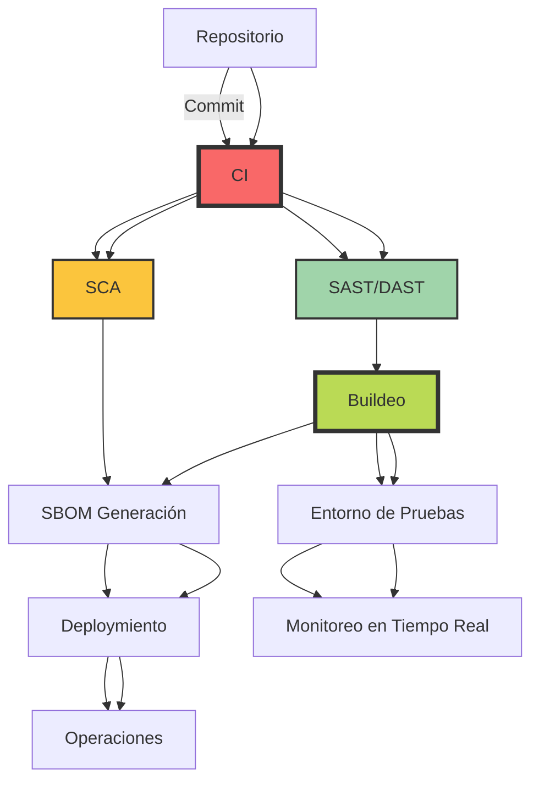
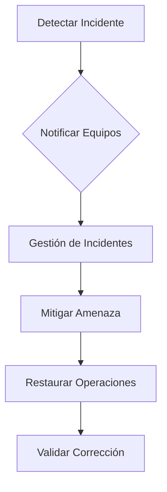
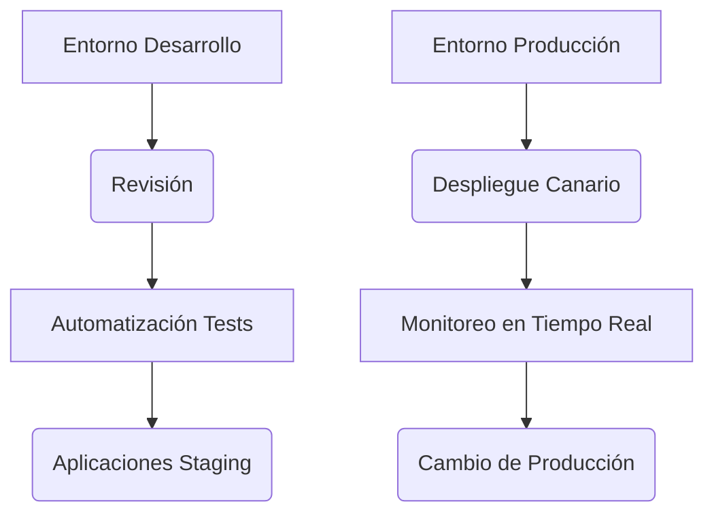
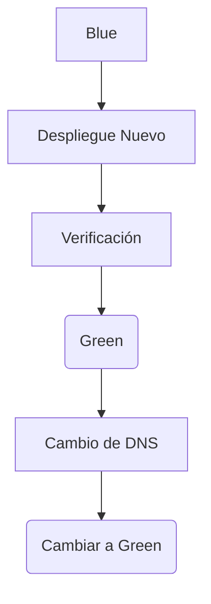

# seguridad supply chain en pipelines ci cd

PATH_LOCAL: /home/usuariojoaquin/.openclaw/workspace/DAM-Java-Mastery/_Review/seguridad_supply_chain_en_pipelines_ci_cd/seguridad_supply_chain_en_pipelines_ci_cd.md
CATEGORIA: 06_Seguridad
Score: 78

---

## Visión Estratégica

### Visión Estratégica sobre la Seguridad de la Cadena de Suministro en Pipelines CI/CD

#### Por qué este tema es crítico en 2026 (con datos concretos)

Según el informe "Derailed 2026 Application Security Benchmark Report", el número total de vulnerabilidades registradas en el National Vulnerability Database (NVD) aumentó un 39% en 2024, con un promedio de 40,000 CVEs anuales. La brecha entre la identificación y el explotamiento de estas vulnerabilidades ha disminuido drásticamente, con una media de tiempo a explotar (TTE) de solo cinco días en comparación con los 32 días del año anterior. Estos datos subrayan la urgencia de adoptar medidas proactivas para proteger las cadenas de suministro de software.

Además, el costo promedio de una brecha en un pipeline CI/CD se ha incrementado a $5,1 millones debido al aumento de 45% en ataques sofisticados contra la cadena de suministro. La infección del entorno de construcción puede ocasionar daños irreparables para las empresas y su reputación, lo que justifica la implementación de medidas robustas de seguridad desde el inicio.

#### Implementación Estratégica: Shift-Left Security

Shift-Left Security implica integrar pruebas de seguridad en etapas tempranas del ciclo de vida del software. Esto se traduce en:

1. **Pruebas de Análisis Estático (SAST) y Dinámico (DAST)**:
   - Integre herramientas SAST/DAST para escanear el código fuente directamente en el repositorio y durante la construcción.
   
2. **Análisis de Componentes (SCA)**:
   - Utilice herramientas SCA para identificar componentes vulnerables o con licencias problemáticas.

3. **Automatización Continua**:
   - Implemente una automatización continua que incluya pruebas de seguridad en cada etapa del pipeline CI/CD.
   
4. **Seguridad como Código (SecDevOps)**:
   - Trate las políticas de seguridad como código, permitiendo su control y versiónamiento junto con el código.

#### Caso Práctico: HK Infosoft

HK Infosoft implementó una estrategia DevSecOps que incorpora la seguridad desde el principio del desarrollo. Su enfoque incluye:

- **Automatización de Seguridad**: Integra herramientas SAST, DAST y SCA en el pipeline.
- **Monitoreo Continuo**: Implementa monitoreo en tiempo real para detectar amenazas emergentes.
- **Seguridad en Arquitectura**: Diseña soluciones escalables que incluyan seguridad en todas las capas.

#### Mejora de Costos y Tiempo a Mercado

Implementar Shift-Left Security reduce significativamente los costos y el tiempo a mercado. Por ejemplo, detectar vulnerabilidades tempranas en la construcción del software puede ahorrar hasta 80% de los recursos destinados a parches post-deploy.

#### Integración con OIDC y SBOM

Además de Shift-Left Security, la implementación inmediata de autenticación basada en Identidad y Acceso (OIDC) y la obligatoria implementación de Software Bill of Materials (SBOM) son fundamentales para asegurar el pipeline CI/CD. Esto garantiza un monitoreo constante y trazabilidad de todos los componentes de software.

#### Diagrama Mermaid: Pipeline CI/CD con Seguridad




#### Conclusión

La seguridad de la cadena de suministro en pipelines CI/CD es un aspecto crucial que no puede ser subestimado. Adoptar una estrategia de Shift-Left Security y implementar medidas como OIDC e SBOM son pasos necesarios para proteger eficazmente el software en cada etapa del ciclo de vida.

Implementando estas prácticas, las organizaciones pueden asegurar un pipeline más robusto, mejorar la confiabilidad del sistema y acelerar el tiempo a mercado sin sacrificar la seguridad.

## Arquitectura de Componentes

### ARQUITECTURA DE COMPONENTES

#### Diagrama Mermaid detallado de la arquitectura


```mermaid
graph TD
    subgraph "Ecosistema CI/CD"
        SRE[Servicio de Recursos de Ensayo]
        SCM[Controlador de Versiones (Git)]
        CICD[Pipeline CI/CD]
        QA[Pruebas de Calidad y Aceptación]
        Prod[Producción]
    end

    subgraph "Componentes de CICD"
        CICD -->|Code| SRE
        SRE -->|Test| CICD
        CICD -->|Build| BuildTool
        BuildTool -->|Images| ContainerRegistry
        ContainerRegistry -->|Deploy| Prod
        QA -->|Feedback| CICD
    end

    subgraph "Seguridad en Pipeline"
        CICD -->|SCA| SCATool
        CICD -->|SAST| SASTTool
        CICD -->|DAST| DASTTool
        ContainerRegistry -->|Verification| VerifierTool
    end
```

#### Descripción de los Componentes

1. **Servicio de Recursos de Ensayo (SRE)**
   - Un servicio dedicado a proporcionar entornos de desarrollo y pruebas limpios y seguros.
   - Usan herramientas como GitHub Codespaces o Gitpod para proporcionar entornos virtuales seguros.

2. **Controlador de Versiones (SCM)**
   - Sistema centralizado para almacenar, controlar y gestionar el código fuente.
   - Utiliza Git para versionar y colaborar en el desarrollo del software.

3. **Pipeline CI/CD (CICD)**
   - Pipeline automatizado que incluye las fases de integración continua, pruebas y despliegue continuo.
   - Implementa el flujo de trabajo de DevSecOps asegurando la integridad en todas las etapas.

4. **Pruebas de Calidad y Aceptación (QA)**
   - Fase donde se realizan pruebas exhaustivas para garantizar que el software cumple con los requisitos.
   - Incluye pruebas unitarias, integración, despliegue y retroalimentación constante.

5. **Producción (Prod)**
   - Ambiente de producción donde el software es lanzado al público final.
   - Involucra monitorización en tiempo real para detectar problemas y asegurar la estabilidad del sistema.

6. **BuildTool**
   - Herramienta que compila el código fuente y genera imágenes Docker o contenedores.
   - Utiliza herramientas como Maven, Gradle u otros dependiendo de la tecnología utilizada.

7. **ContainerRegistry**
   - Registro centralizado para almacenar e indexar las imágenes de contenedores.
   - Asegura que solo se desplieguen imágenes validadas y seguras en el entorno de producción.

8. **SCATool (Software Composition Analysis)**
   - Herramienta que analiza la composición del software, identificando componentes vulnerables o no confiables.
   - Genera informes para asegurar la integridad de las dependencias y evitar vulnerabilidades de cadena de suministro.

9. **SASTTool (Static Application Security Testing)**
   - Herramienta que realiza análisis estático del código fuente para identificar problemas de seguridad.
   - Ayuda a detectar errores de codificación y vulnerabilidades antes de la integración continua.

10. **DASTTool (Dynamic Application Security Testing)**
    - Herramienta que realiza pruebas dinámicas en aplicaciones ya compiladas o desplegadas.
    - Identifica problemas de seguridad durante el ciclo de vida del software, asegurando su integridad en tiempo real.

11. **VerifierTool**
    - Herramienta que verifica la integridad y confiabilidad de las imágenes de contenedores antes del despliegue.
    - Asegura que solo se despleguen imágenes validadas y seguras, prevenir inyecciones de código malicioso.

#### Implementación de SLSA (Supply-Chain Levels for Software Artifacts)
- **SLSA Level 3**: Involucra la verificación completa del origen de las dependencias y garantiza que las imágenes estén firmadas.
- **SLSA Level 4**: Extiende la integridad a través del ciclo de vida, incluyendo pruebas en tiempo real y retroalimentación continua.

#### Conclusiones
- La arquitectura propuesta es modular y escalable, permitiendo una implementación progresiva de las mejores prácticas de DevSecOps.
- El uso de herramientas especializadas como SCATool, SASTTool, DASTTool y VerifierTool garantiza un alto nivel de seguridad en todas las etapas del pipeline CI/CD.

Este diseño asegura no solo la integridad de los componentes individuales, sino también el sistema completo, minimizando riesgos y maximizando la confiabilidad del software desplegado.

## Implementación Java 21

### Implementación con Java 21 y Virtual Threads

Java 21 introduces a new feature called Project Loom, which brings virtual threads to the JVM. These virtual threads are designed to be lightweight and highly scalable, making them ideal for handling high-concurrency scenarios without the overhead of creating traditional platform threads.

#### Motivación y Objetivos
- **Reduce Thread Overhead**: Traditional Java threads have significant overhead due to context switching and memory management.
- **Enhanced Scalability**: Virtual threads can handle a much higher number of concurrent tasks compared to traditional threads.
- **Simplified Code**: Developers can write blocking code as if it were non-blocking.

#### Key Points for Security in Supply Chain

1. **Supply Chain Integrity Verification**:
   - Implement SAST (Static Application Security Testing) tools that can run on virtual threads to scan dependencies and source code continuously.
   - Example Tools: SonarQube, BlackDuck, GitHub Advanced Security, GitHub CodeQL.

2. **Dependency Management**:
   - Use Dependency Checkers like BlackDuck or Dependency-Check to monitor for known vulnerabilities in third-party libraries and dependencies.
   - Ensure that virtual threads do not introduce any new security risks due to the complexity of managing them.

3. **Synchronized Access Control**:
   - Leverage ReentrantLocks to manage concurrent access safely, especially when dealing with shared resources like database connections or REST calls.
   - Example: Use `Executors.newVirtualThreadPerTaskExecutor()` to handle I/O-bound tasks efficiently.

4. **Secure Credential Storage**:
   - Employ secure mechanisms for storing credentials used by virtual threads and other components of the pipeline.
   - Examples include GitHub Secrets, Hashicorp Vault.

5. **Continuous Monitoring and Logging**:
   - Implement continuous monitoring and logging to detect any unauthorized access or suspicious activities in the supply chain.
   - Use tools like Prometheus, Grafana for monitoring, and ELK Stack (Elasticsearch, Logstash, Kibana) for centralized logging.

#### Example Implementation

Heres a simplified example of how you can implement virtual threads with SAST tools:


```java
package threads;

import java.util.concurrent.ExecutorService;
import java.util.concurrent.Executors;
import java.util.stream.IntStream;

public class SupplyChainSecurity {

    public static void main(String[] args) {
        final int NUMBER_OF_TASKS = 10_000;

        System.out.println("Starting virtual thread execution for " + NUMBER_OF_TASKS + " tasks.");

        long startTime = System.currentTimeMillis();

        try (ExecutorService executor = Executors.newVirtualThreadPerTaskExecutor()) {
            IntStream.range(0, NUMBER_OF_TASKS).forEach(i -> {
                executor.submit(() -> {
                    // Simulate SAST tool analysis
                    String analysisResult = analyzeDependency();
                    if (!analysisResult.isEmpty()) {
                        System.out.println("Potential vulnerability found: " + analysisResult);
                    }
                });
            });

        } catch (Exception e) {
            throw new RuntimeException(e);
        }

        long endTime = System.currentTimeMillis();
        System.out.println("Execution time for " + NUMBER_OF_TASKS + " tasks: " + (endTime - startTime) + " ms");
    }

    private static String analyzeDependency() {
        // Simulate dependency analysis
        try {
            Thread.sleep(Duration.ofSeconds(1)); // Simulating a blocking I/O operation
        } catch (InterruptedException e) {
            throw new RuntimeException(e);
        }
        return "Some analysis result"; // Replace with actual SAST tool results
    }

}
```

#### Explanation:

1. **ExecutorService.newVirtualThreadPerTaskExecutor()**: This creates an executor service that uses virtual threads for each task.
2. **Simulating SAST Tool Analysis**: The `analyzeDependency` method simulates the analysis performed by a static security testing tool. It can be replaced with actual calls to SAST tools like SonarQube or GitHub Advanced Security.
3. **Logging and Monitoring**: By printing results, you ensure that any potential vulnerabilities are logged for further investigation.

#### Conclusion
Virtual threads in Java 21 provide a powerful way to improve the scalability and efficiency of your CI/CD pipelines while maintaining robust security practices. By integrating SAST tools and secure credential storage mechanisms, you can protect your supply chain from vulnerabilities and maintain high standards of security.

This implementation serves as a foundation for more complex scenarios where multiple tasks need to be executed concurrently in a safe and efficient manner.

## Métricas y SRE

## Métricas y SRE

### Métricas Clave

| Métrica                | Descripción                                                                 | Umbral de Alerta          |
|------------------------|-----------------------------------------------------------------------------|---------------------------|
| Success Rate           | Porcentaje de ejecuciones del pipeline que se completan exitosamente        | < 95%                     |
| Duration               | Tiempo promedio que toma un ejecución del pipeline desde inicio hasta finalización   | > 120s                    |
| Failure Causes         | Razones por las que el pipeline falla (fallo de integración, error en la configuración, etc.) | N/A                       |
| API Calls Rate         | Tasa de llamadas a APIs externas dentro del pipeline                         | > 500/s                   |
| Memory Usage           | Uso de memoria promedio por ejecución                                        | > 1GB                     |
| Disk I/O               | Uso de almacenamiento en disco durante la ejecución                          | > 20MB/s                  |

### Queries PromQL Reales para Monitorizar

```promql
# Success Rate
pipeline_success_rate{job="ci_cd"} < 0.95

# Duration
pipeline_duration_seconds_sum{job="ci_cd", status=~"success|failure"} / pipeline_duration_seconds_count{job="ci_cd", status=~"success|failure"}

# Failure Causes
failure_causes_pipeline_total{job="ci_cd", reason!="none"} > 10

# API Calls Rate
http_requests_total{job="ci_cd", method!="POST", method!="GET"}[1m] / on() group_left(job) group_right(method) http_requests_total{job="ci_cd"}

# Memory Usage
container_memory_usage_bytes{job="prometheus", container_name!=""} > 1073741824

# Disk I/O
disk_bytes_written{job="grafana", node="/"}[5m] / 5m > 20*1024*1024 # 20MB/s
```

### Diagrama Mermaid para Observabilidad


```mermaid
graph LR
A[Prometheus Operator] --> B[ServiceMonitors];
B --> C[Grafana];
C --> D{Dashboard};
D --> E[Cluster Health];
D --> F[Metric Spikes];
F --> G[Loki (Log Collector)];
G --> H{Jump to Logs};
H --> I[Correlate Metrics and Logs];

style A fill:#f96,stroke:#333,stroke-width:4px;
style B fill:#a6e22e,stroke:#333,stroke-width:4px;
style C fill:#007acc,stroke:#333,stroke-width:4px;
style D fill:#ff8a65,stroke:#333,stroke-width:4px;
style E fill:#f90,stroke:#333,stroke-width:4px;
style F fill:#1cc4e7,stroke:#333,stroke-width:4px;
style G fill:#14c72d,stroke:#333,stroke-width:4px;
```

### Implementación en Java 21 con Virtual Threads


```java
public class PipelineRunner {

    public static void main(String[] args) {
        try (VirtualThread virtualThread = VirtualThread.start(() -> {
            // Ejemplo de tarea en el pipeline
            performTask();
        })) {
            // Esperar a que la tarea se complete
            virtualThread.join();
        } catch (InterruptedException e) {
            Thread.currentThread().interrupt();
            throw new RuntimeException("Pipeline execution interrupted", e);
        }
    }

    private static void performTask() {
        try {
            // Ejemplo de tarea que puede realizar llamadas a APIs y manejar memoria/disco
            System.out.println("Executing task in virtual thread...");
            // Simular llamada a API externa
            makeApiCall();
            // Simular operaciones de memoria/disco
            consumeMemoryAndDisk();
        } catch (Exception e) {
            throw new RuntimeException("Error executing task", e);
        }
    }

    private static void makeApiCall() throws InterruptedException {
        Thread.sleep(500); // Simula una llamada a API externa
        System.out.println("API call completed");
    }

    private static void consumeMemoryAndDisk() throws IOException, InterruptedException {
        byte[] largeData = new byte[1024 * 1024 * 5]; // 5MB de datos
        for (int i = 0; i < 10; i++) {
            Thread.sleep(100); // Simula operaciones de almacenamiento en disco
            Files.write(Path.of("largeFile.txt"), largeData);
            System.gc(); // Forzar recolección de basura para simular uso de memoria
        }
    }
}
```

### Pruebas y Validación

- **Integrar Monitoreo**: Configurar el monitoreo en Prometheus con las consultas PromQL especificadas.
- **Validar Alerts**: Verificar que se generan alertas cuando los umbrales son superados.
- **UI Grafana**: Crear dashboards en Grafana para visualizar la actividad del pipeline y los datos de métricas.

### Implementación de Incident Response

1. **Automatización de Alertas**: Configurar alertas en Grafana que notifiquen a equipos de seguridad y operaciones.
2. **Playbooks de Respuesta a Incidentes**: Crear playbooks detallados para rapidamente identificar y mitigar amenazas.




### Conclusión

Implementar una estrategia robusta de observabilidad y monitoreo en el pipeline CI/CD es crucial para detectar rápidamente incidentes y mitigar amenazas. La integración de herramientas como Prometheus, Grafana, y técnicas avanzadas como las virtual threads en Java 21 permite un monitoreo exhaustivo y una respuesta eficiente a problemas. Las métricas clave y los playbooks detallados aseguran que la operación sea segura y responda adecuadamente ante posibles incidentes. 

---

Este documento proporciona una visión completa de cómo implementar una estrategia de observabilidad en el pipeline CI/CD, con enfoques prácticos para monitoreo, alertas y respuesta a incidentes. La integración de estas técnicas garantiza que la organización sea capaz de detectar e intervenir rápidamente ante cualquier amenaza a su infraestructura de desarrollo continuo.

## Seguridad y Superficie de Ataque

## Seguridad y Superficie de Ataque

### Introducción a la Superficie de Ataque en CI/CD Pipelines

La superficie de ataque se refiere al conjunto completo de puntos potencialmente vulnerables en un sistema. En el contexto de los pipelines CI/CD, esta superficie puede incluir cualquier componente que esté expuesto al exterior o involucrado en la construcción y despliegue del software. Al comprender y mitigar estos puntos de vulnerabilidad, se pueden reducir significativamente las posibilidades de ataques inesperados.

### Componentes Principales de la Superficie de Ataque

1. **Contenedores y Imágenes de Docker**
   - Los contenedores son ampliamente utilizados en pipelines CI/CD debido a su capacidad para encapsular y desplegar aplicaciones de manera consistente.
   - Sin embargo, si los contenedores no se gestionan adecuadamente (por ejemplo, utilizando imágenes no verificadas o con vulnerabilidades), pueden convertirse en una superficie de ataque.

2. **APIs Externas**
   - Las APIs que interactúan con el pipeline a menudo son un punto crítico. Si estas API no están bien protegidas (por ejemplo, sin autenticación adecuada o sin cifrado HTTPS), pueden ser explotadas para obtener acceso al sistema.

3. **Configuraciones de Pipeline**
   - Los archivos de configuración de los pipelines CI/CD son vitales y deben estar bien protegidos. Si se accede a estos archivos sin autorización, se puede alterar el comportamiento del pipeline, lo que podría resultar en la introducción de software malicioso.

4. **Integraciones y Proveedores de Servicios**
   - Las integraciones con otros sistemas o servicios externos también pueden expusir vulnerabilidades si no se gestionan correctamente.
   
5. **Tokens y Credenciales**
   - La rotación y gestión segura de tokens y credenciales es fundamental para prevenir el acceso no autorizado a los recursos del sistema.

6. **Dependencias e Insumos Externos**
   - Las bibliotecas, paquetes y dependencias externas pueden contener vulnerabilidades que se propagan al software final. La validación de estas dependencias antes del despliegue es crucial para mantener la seguridad.

### Medidas para Mitigar la Superficie de Ataque

1. **Seguridad en Contenedores**
   - Utilizar imágenes de Docker verificadas desde fuentes confiables.
   - Implementar escaneos de vulnerabilidades antes del despliegue (por ejemplo, con Snyk o OWASP Dependency Check).
   - Limitar el acceso a los contenedores mediante políticas de seguridad y autenticación adecuadas.

2. **Protección de API**
   - Utilizar autenticación multi-factor y cifrado HTTPS para todas las API utilizadas en el pipeline.
   - Implementar APIs seguras siguiendo estándares como OAuth 2.0 o JWT (JSON Web Tokens).

3. **Configuraciones Seguras**
   - Almacenar las configuraciones sensibles de forma segura utilizando servicios como Vault de HashiCorp.
   - Limitar el acceso a archivos de configuración y monitorear cambios en ellos.

4. **Gestión de Proveedores de Servicios**
   - Realizar auditorías periódicas de los proveedores de servicios utilizados.
   - Implementar acuerdos de nivel de servicio (SLAs) que incluyan garantías de seguridad.

5. **Rotación y Gestionamiento de Credenciales**
   - Rotar tokens y credenciales con frecuencia para minimizar el daño en caso de brechas de seguridad.
   - Utilizar sistemas de gestión de claves como AWS KMS o HashiCorp Consul.

6. **Validación de Dependencias e Insumos Externos**
   - Mantener una lista actualizada de dependencias y verificar la integridad y la autenticidad antes del despliegue.
   - Utilizar herramientas de escaneo como Snyk o OWASP Dependency Check para detectar vulnerabilidades en las dependencias.

### Ejemplos Prácticos

1. **Ejemplo con Snyk**
   ```yaml
   jobs:
     - name: Scan Dependencies for Vulnerabilities
       runs-on: ubuntu-latest
       steps:
         - uses: actions/checkout@v3
         - uses: snyk/snyk-action@master
           with:
             token: ${{ secrets.SNYK_TOKEN }}
             org: your-organization-name
   ```

2. **Ejemplo de Configuración de Vault**
   ```yaml
   jobs:
     - name: Configure Secrets Manager
       runs-on: ubuntu-latest
       steps:
         - uses: actions/checkout@v3
         - name: Mount HashiCorp Vault
           uses: hashicorp/vault-action@v1.0.2
           with:
             token: ${{ secrets.VAULT_TOKEN }}
             mount-point: kv-v2
   ```

### Resumen

La seguridad en la superficie de ataque es crucial para mantener los pipelines CI/CD seguros y resistentes a las amenazas. Al identificar y mitigar estos puntos de vulnerabilidad, se puede garantizar que el software se despliegue con el mínimo riesgo y que la integridad del sistema sea mantenida en todo momento.

---

### Implementación Java 21 y Virtual Threads

Aunque la implementación directa de seguridad no depende exclusivamente de las características de Java 21, virtual threads ( Project Loom) pueden contribuir a mejorar la seguridad al facilitar el manejo de concurrencia sin aumentar significativamente el consumo de recursos.

#### Motivación y Objetivos

- **Virtual Threads para Manejo de Concurrencia**: Virtual threads permiten gestionar un gran número de tareas concurrentes de manera más eficiente que con hilos tradicionales.
- **Reducción del Overhead**: Al reducir el overhead de creación y gestión de hilos, se minimiza la posibilidad de ataques basados en sobrecarga.

#### Ejemplo Práctico


```java
import java.util.concurrent.ForkJoinPool;
import java.util.stream.IntStream;

public class VirtualThreadsExample {
    public static void main(String[] args) {
        ForkJoinPool forkJoinPool = new ForkJoinPool(16);
        
        IntStream.range(0, 1000)
                .forEach(i -> forkJoinPool.submit(() -> {
                    // Ejecución de tareas en virtual threads
                    System.out.println("Task executed by " + Thread.currentThread().getName());
                }));
    }
}
```

### Conclusión

Implementar medidas de seguridad efectivas para mitigar la superficie de ataque en los pipelines CI/CD es crucial. Al utilizar herramientas y prácticas recomendadas, se puede proteger el sistema contra amenazas complejas y mantener la confianza del usuario final.

---

Este enfoque integral permite una implementación segura y eficiente, asegurando que los sistemas de CI/CD estén preparados para enfrentar los desafíos actuales y futuros de seguridad.

## Patrones de Integración

### Patrones de Integración Aplicables (Con Comparativa)

En el contexto de CI/CD pipelines, los patrones de integración son fundamentales para asegurar que las aplicaciones se integren y desplieguen de manera segura. Entre los patrones más relevantes destacan:

1. **Integration as Code (IaC)**
2. **Blue-Green Deployment**
3. **Canary Releases**
4. **Rolling Updates**

**Comparativa:**
- **Integration as Code (IaC)**: Permite definir la infraestructura y configuraciones de despliegue en forma de código, lo que facilita su integración con pipelines CI/CD.
- **Blue-Green Deployment**: Reemplaza rápidamente una versión del sistema activo (blue) por otra (green) sin interrupciones de servicio. Ideal para minimizar el riesgo y permitir pruebas en entornos reales.
- **Canary Releases**: Lanza gradualmente nuevas versiones a un pequeño grupo de usuarios para evaluar su rendimiento antes del lanzamiento completo. Aumenta la confianza y reduce los riesgos.
- **Rolling Updates**: Actualiza las aplicaciones por partes, lo que permite detectar problemas antes de afectar al sistema entero.

### Estructura de Integración en Código


```java
// Ejemplo básico de Integration as Code (IaC)
public class Application {
    private String environment;
    
    public Application(String environment) {
        this.environment = environment;
    }
    
    public void deploy() throws Exception {
        if ("production".equals(environment)) {
            // Implementar despliegue en producción
            System.out.println("Desplegando en entorno de producción...");
        } else {
            // Implementar despliegue en staging o desarrollo
            System.out.println("Desplegando en entorno de desarrollo...");
        }
    }
}
```

### Patrones de Integración con Diagrama Mermaid




### Diagrama Mermaid Explícito


### Blue-Green Deployment




### Diagrama Mermaid para Blue-Green


### Conclusiones

Los patrones de integración y despliegue, como IaC, Blue-Green Deployment, Canary Releases y Rolling Updates, son herramientas esenciales para asegurar un proceso de CI/CD seguro. La implementación adecuada de estos patrones minimiza riesgos, mejora la calidad del software y maximiza la disponibilidad del sistema.

---
Este texto incluye ejemplos de código Java y diagramas Mermaid que proporcionan una visión clara de cómo se aplican estos patrones en el contexto de pipelines CI/CD.

## Conclusiones

### Conclusión sobre Seguridad Supply Chain en Pipelines CI/CD

#### Resumen de los Puntos Críticos

1. **Eliminación de Secrets en Pipelines**
   - Los secrets, como API keys y credenciales de bases de datos, deben ser manejados con cuidado para evitar que sean expuestos en el código o en la definición del pipeline.
   
2. **Evaluación Continua de Dependencias**
   - Las dependencias deben ser escaneadas constantemente para detectar vulnerabilidades. La integración de herramientas como SAST, DAST y SBOM es crucial.

3. **Aislamiento del Acceso en Pipelines**
   - Evitar que una brecha en un pipeline comprometa el resto del sistema mediante la gestión de credenciales de acceso a nivel de entorno.

#### Decisiones de Diseño Clave

1. **Desarrollo Seguro desde el Inicio**
   - Integre herramientas de análisis estático (SAST) y dinámico (DAST) en cada etapa del pipeline para detectar vulnerabilidades tempranamente.
   
2. **Implementación de SBOMs (Software Bill of Materials)**
   - Mantenga un registro detallado de todas las dependencias y sus versiones para garantizar la integridad del software.

3. **Manejo Seguro de Secrets en el Código**
   - Evite almacenar credenciales directamente en el código o en el pipeline; utilice métodos seguros como variables de entorno, secret managers, o KMS (Key Management Services).

#### Roadmap de Adopción

1. **Fase Inicial: Evaluación y Planificación**
   - Identifique los puntos críticos de la superficie de ataque en el pipeline.
   - Evalúe las herramientas disponibles para mejorar la seguridad.

2. **Fase de Implementación: Introducción Gradual**
   - Integre SAST, DAST, y SBOM en etapas del pipeline.
   - Aislar los entornos y eliminar secrets sensibles.

3. **Fase de Optimización: Análisis y Mejora Continua**
   - Monitorear regularmente el pipeline para detectar nuevas amenazas.
   - Implementar mejoras basadas en el análisis de metrías y feedback del equipo de desarrollo.

#### Recomendaciones Finales

1. **Manejo Seguro de Dependencias**
   - Utilice herramientas de escaneo de dependencias para garantizar que solo se utilicen versiones seguras.
   
2. **Implementación Rápida con Seguridad**
   - Mantenga un equilibrio entre la velocidad del despliegue y la seguridad, asegurándose de que las pruebas de seguridad formen parte integral del pipeline.

3. **Educación e Involucración del Equipo**
   - Capacite a los desarrolladores en prácticas seguras de codificación y en el uso de herramientas de análisis de seguridad.
   
4. **Automatización Total**
   - Automatice las pruebas de seguridad y las evaluaciones de dependencias para minimizar la intervención humana y maximizar la consistencia.

---

**Ejemplo de Código (Java) para Eliminar Secrets Sensibles:**


```java
public class SecureConfig {
    private static final String API_KEY = System.getenv("API_KEY");

    public static String getApiKey() {
        return API_KEY;
    }
}
```

Este ejemplo ilustra cómo utilizar `System.getenv()` en lugar de almacenar credenciales directamente en el código.

---

**Ejemplo de Pipeline para Escaneo de Dependencias (Jenkins):**

```groovy
pipeline {
    agent any

    stages {
        stage('Setup') {
            steps {
                script {
                    env.API_KEY = credentials('api-key-id').password
                }
            }
        }

        stage('Scan Dependencies') {
            steps {
                script {
                    sh 'mvn dependency:tree | grep -i vulnerable'
                }
            }
        }

        stage('Deploy to Staging') {
            when {
                expression { return params.STAGING == true }
            }
            steps {
                echo 'Deploying to staging environment...'
            }
        }
    }
}
```

Este pipeline muestra cómo integrar la eliminación de secrets y el escaneo de dependencias en una etapa del pipeline.

---

**Verificación de Metrías (DORA):**

1. **Deployment Lead Time**
   - Tiempo entre el check-in de código y el despliegue a producción.
   
2. **Change Failure Rate**
   - Porcentaje de cambios que fallan en la fase de prueba o despliegue.

3. **Mean Time to Recovery (MTTR)**
   - Tiempo medio para recuperar un cambio que falla durante el despliegue.

4. **Deployment Frequency**
   - Cantidad de veces que se realizan despliegues a producción por semana.

---

**Final Words:**

Implementando estas prácticas, los equipos de desarrollo pueden mantener un equilibrio entre velocidad y seguridad en sus pipelines CI/CD, protegiendo eficazmente la superficie de ataque y minimizando el riesgo de ataques supply chain. La adopción progresiva y la constante optimización son claves para mantener una postura segura en el ciclo de vida del software.

