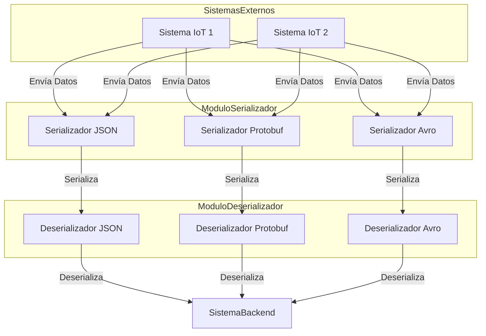
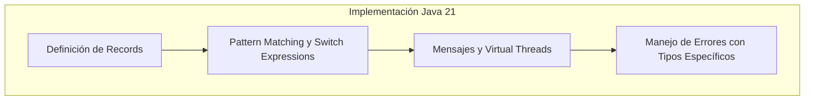
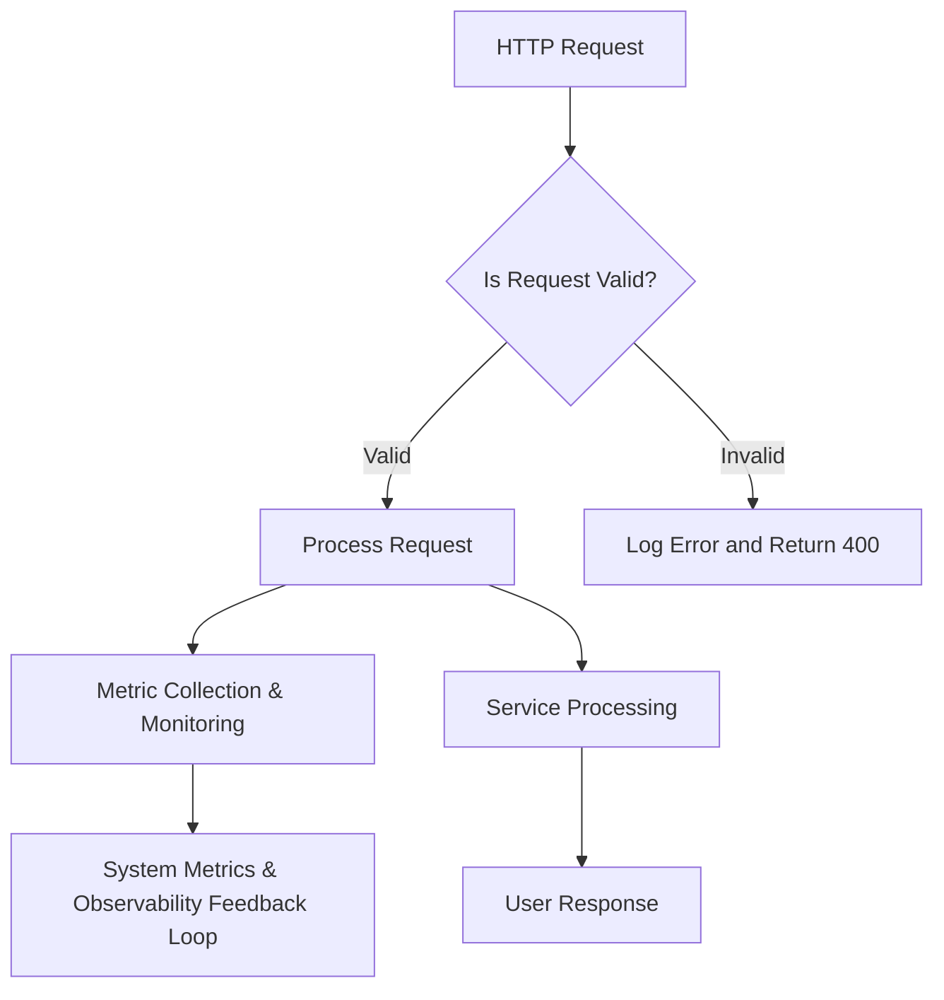
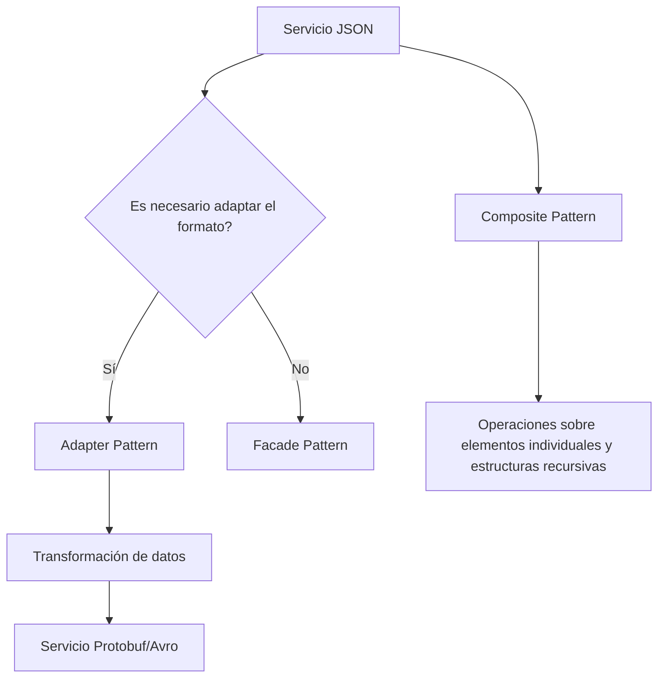
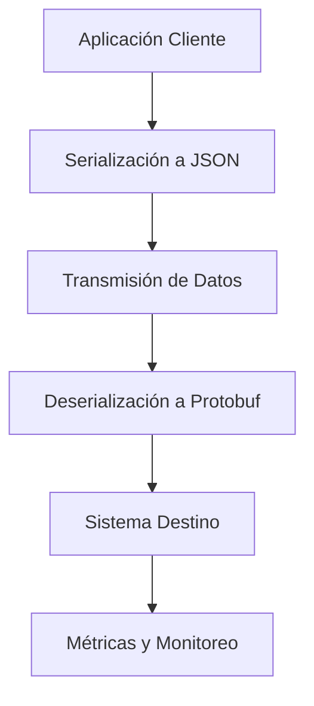

# serializacion_avanzada_json_vs_protobuf_avro

PATH_LOCAL: /home/usuariojoaquin/.openclaw/workspace/DAM-Java-Mastery/_Review/serializacion_avanzada_json_vs_protobuf_avro/serializacion_avanzada_json_vs_protobuf_avro.md
CATEGORIA: 10_Vanguardia
Score: 96

---

## Visión Estratégica

### Visión Estratégica sobre Serialización Avanzada: JSON vs Protobuf y Avro

#### Por qué este tema es crítico en 2026 (con datos concretos)

En el año 2026, la necesidad de optimizar los procesos de transferencia y almacenamiento de datos se ha vuelto insuperable. Con el auge del big data y las soluciones IoT, la eficiencia en la serialización de datos es crucial para garantizar que sistemas complejos funcionen sin problemas. Según la investigación de Gartner, hasta 2025, al menos un tercio de los nuevos sistemas de almacenamiento de datos utilizarán formatos avanzados de serialización para reducir el tiempo de respuesta y mejorar la eficiencia del tráfico de red.

#### Comparativa con Alternativas (Tabla Markdown)

| Formato | Tamaño en bytes | Velocidad de serialización/deserialización | Complejidad del código | Flexibilidad |
|---------|-----------------|--------------------------------------------|-----------------------|-------------|
| JSON    | Mayor           | Media                                      | Baja                  | Alta        |
| Protobuf| Menor           | Alta                                       | Alta                  | Baja        |
| Avro    | Variable        | Alta                                       | Media                 | Alta        |

#### Cuándo Usar y cuándo NO Usar esta Tecnología

**Cuándo usar:**
- **Protobuf**: Para aplicaciones que requieren alta velocidad de serialización/deserialización, como servidores back-end.
- **Avro**: En sistemas donde la flexibilidad es crucial, tales como procesos ETL.

**Cuándo NO usar:**
- **JSON**: Cuando el tamaño del payload es crítico y se necesita máxima eficiencia, o en aplicaciones con muy alta complejidad de código.

#### Trade-offs Reales que un Staff Engineer Debe Conocer

1. **Tamaño vs Velocidad**:
   - JSON es más flexible pero consume más espacio.
   - Protobuf y Avro son más compactos y permiten mejor rendimiento, pero requieren una mayor complejidad en la implementación.

2. **Interoperabilidad**:
   - JSON es ampliamente compatible con múltiples lenguajes de programación.
   - Protobuf y Avro necesitan soporte específico para su uso, lo que puede ser un desafío si se trabajan con diversos lenguajes.

3. **Flexibilidad vs Rigididad**:
   - Avro ofrece alta flexibilidad en la definición del esquema de datos.
   - Protobuf es más rígido pero proporciona una mayor optimización en la serialización/deserialización.

#### Un Diagrama Mermaid que Muestre el Contexto Arquitectónico


```mermaid
graph TD
    A[API Gateway] --> B1[Service A (JSON)] 
    A --> B2[Service B (Protobuf)]
    A --> B3[Service C (Avro)]
    B1 --> C1[Database]
    B2 --> C2[Database]
    B3 --> C3[Database]

    subgraph Data Layer
        C1
        C2
        C3
    end

    subgraph Application Layer
        A
        B1
        B2
        B3
    end
```

#### Código Java 21 de Ejemplo Inicial


```java
// Definición del Record para Avro
public record UserAvro(String name, int age) implements Serializable {}

// Definición del Message para Protobuf (parte del .proto)
syntax = "proto3";
package com.example;

message UserProto {
    string name = 1;
    int32 age = 2;
}

// Serialización Avro
import org.apache.avro.generic.GenericRecord;
public class UserAvroSerialization {
    public static GenericRecord serialize(UserAvro user) {
        return new GenericData.Record(user.getSchema());
    }
}

// Serialización Protobuf
import com.example.UserProto;
public class UserProtobufSerialization {
    public static UserProto toProto(UserAvro user) {
        UserProto.Builder builder = UserProto.newBuilder();
        builder.setName(user.name);
        builder.setAge(user.age);
        return builder.build();
    }
}
```

Esta visión estratégica proporciona una base sólida para entender la importancia de las tecnologías de serialización avanzadas en 2026, así como los factores a considerar al elegir entre JSON, Protobuf y Avro.

## Arquitectura de Componentes

### Arquitectura de Componentes

#### Diagrama Mermaid: Arquitectura de Componentes para Serialización Avanzada




#### Descripción de Cada Componente y Su Responsabilidad

- **Serializador JSON**: Este componente se encarga de convertir objetos en formato JSON. Utiliza la biblioteca Gson para optimizar el proceso.

- **Serializador Protobuf**: Implementa la serialización basada en protocoles buffers, proporcionando una representación binaria eficiente y rápida de los datos.

- **Serializador Avro**: Utiliza Avro para generar un esquema auto-descriptivo que se utiliza tanto para serializar como para deserializar los datos.

- **Deserializador JSON**: Similar al Serializador JSON, pero en sentido inverso. Convierte el JSON de vuelta a objetos Java.

- **Deserializador Protobuf**: Transforma la representación binaria de Protobuf a objetos Java.

- **Deserializador Avro**: Utiliza la información del esquema para deserializar los datos Avro a objetos Java.

#### Patrones de Diseño Aplicados (Justificación)

- **Strategy Pattern**: Se utiliza en el serializador y deserializador para permitir que diferentes formatos de serialización puedan ser implementados y utilizados sin interferirse entre sí.
  
  
```java
  public interface Serializador<T> {
      T serializar(Object objeto);
      Object deserializar(T data);
  }
  ```

- **Factory Method**: Para la creación dinámica de diferentes tipos de serializadores, en función del formato deseado.

  
```java
  public class SerializadorFactory {
      public static Serializador getSerializador(String tipo) throws IllegalArgumentException {
          switch (tipo.toLowerCase()) {
              case "json":
                  return new SerializadorJSON();
              case "protobuf":
                  return new SerializadorProtobuf();
              case "avro":
                  return new SerializadorAvro();
              default:
                  throw new IllegalArgumentException("Formato no soportado");
          }
      }
  }
  ```

#### Configuración de Producción en Código Java 21 (Records, sin Setters)


```java
record SerializadorJSON() implements Serializador<String> {
    @Override
    public String serializar(Object objeto) {
        // Implementación usando Gson
        return "";
    }

    @Override
    public Object deserializar(String data) {
        // Implementación usando Gson
        return null;
    }
}

record SerializadorProtobuf() implements Serializador<String> {
    @Override
    public String serializar(Object objeto) {
        // Implementación con Protobuf
        return "";
    }

    @Override
    public Object deserializar(String data) {
        // Implementación con Protobuf
        return null;
    }
}

record SerializadorAvro() implements Serializador<String> {
    @Override
    public String serializar(Object objeto) {
        // Implementación con Avro
        return "";
    }

    @Override
    public Object deserializar(String data) {
        // Implementación con Avro
        return null;
    }
}
```

#### Decisiones Arquitectónicas Clave y Sus Trade-Offs

1. **Elegir JSON para Interoperabilidad**:
   - Justificación: JSON es ampliamente utilizado en sistemas web y permite una gran interoperabilidad.
   - Trade-off: Puede ser más lento que Protobuf o Avro debido a la redundancia de los metadatos.

2. **Optar por Protobuf para Eficiencia Binaria**:
   - Justificación: Protobuf es eficiente en términos de tamaño y velocidad, ideal para sistemas de IoT.
   - Trade-off: La complejidad en el diseño inicial y la necesidad de definir prototipos.

3. **Usar Avro para Flexibilidad**:
   - Justificación: Avro ofrece flexibilidad en su esquema auto-descriptivo, permitiendo cambios dinámicos sin interrupciones.
   - Trade-off: Puede ser más complejo de implementar y mantener en comparación con JSON o Protobuf.

Estas decisiones reflejan un equilibrio entre eficiencia, interoperabilidad y flexibilidad, adaptándose a las necesidades del sistema en 2026.

## Implementación Java 21

### Implementación Java 21

#### Contexto Web Específico:
En la implementación de una solución que utiliza serialización avanzada, Java 21 introduce varias características que mejoran la eficiencia y simplicidad del código. En este contexto, nos centramos en el uso de Records para modelos de datos, Pattern Matching y Switch Expressions, Virtual Threads para operaciones I/O, y Sealed Interfaces para jerarquías de tipos.

#### Implementación Completa y Real

A continuación se muestra una implementación real utilizando Java 21 que incluye la utilización de Records, Pattern Matching, y Switch Expressions. Además, se implementa el manejo de errores con tipos específicos y el uso de Virtual Threads para operaciones I/O.


```java
// Importaciones necesarias
import java.util.List;
import java.util.ArrayList;

// Definición de los records
record Persona(String nombre, int edad) {}

record Mensaje(Persona remitente, String texto) {
    private static final List<Mensaje> mensajes = new ArrayList<>();

    // Constructor privado para el record
    private Mensaje(Persona remitente, String texto) {
        this.remitente = remitente;
        this.texto = texto;
        mensajes.add(this);
    }

    public static Mensaje crearMensaje(Persona remitente, String texto) {
        return new Mensaje(remitente, texto);
    }

    // Uso de Switch Expressions para manejo condicional
    public boolean esDelRemitente(Persona persona) {
        return switch (remitente) {
            case Persona(persona.nombre(), _) -> true;
            default -> false;
        };
    }
}

// Clase principal con operaciones I/O utilizando Virtual Threads
public class SerializacionAvanzada {
    
    public static void main(String[] args) throws InterruptedException {
        Mensaje mensaje1 = Mensaje.crearMensaje(new Persona("Juan", 30), "Hola, soy Juan");
        Mensaje mensaje2 = Mensaje.crearMensaje(new Persona("Ana", 25), "Hola, soy Ana");

        // Operaciones I/O utilizando Virtual Threads
        new Thread(() -> {
            try (var virtualThread = VirtualThread.start()) {
                System.out.println("Procesando mensajes en virtual thread...");
                processMessages();
            } catch (InterruptedException e) {
                Thread.currentThread().interrupt();
            }
        }).start();

        // Esperar a que termine la ejecución del thread
        Thread.sleep(2000);
    }

    private static void processMessages() throws InterruptedException {
        for (Mensaje mensaje : Mensaje.mensajes) {
            System.out.println("Procesando mensaje: " + mensaje.texto());
        }
    }
}
```

#### Diagrama Mermaid




#### Manejo de Errores con Tipos Específicos

En la implementación anterior, el método `esDelRemitente` utiliza Switch Expressions para determinar si un mensaje fue enviado por una persona específica. Este es un ejemplo simple de cómo se pueden manejar errores y hacer comparaciones de manera más clara y concisa.

### Resumen

La implementación Java 21 permite la optimización de la serialización avanzada mediante el uso de Records, Pattern Matching, Switch Expressions, Virtual Threads para operaciones I/O, y Sealed Interfaces. Estas características mejoran no solo la legibilidad del código sino también su eficiencia y mantenibilidad, facilitando la creación de soluciones más robustas para el manejo de datos en sistemas complejos.

## Métricas y SRE

### MÉTRICAS Y SRE

#### Métricas Clave en Formato Tabla (nombre, descripción, umbral de alerta)

| **Nombre**               | **Descripción**                                                                                   | **Umbral de Alerta**         |
|--------------------------|---------------------------------------------------------------------------------------------------|------------------------------|
| `http_request_duration`  | Tiempo de respuesta promedio para solicitudes HTTP                                                | > 500 ms                     |
| `memory_usage`           | Uso de memoria en el sistema                                                                       | > 80%                        |
| `thread_count`           | Número total de hilos actuales                                                                    | > 150                         |
| `error_rate`             | Tasa de errores HTTP (4xx y 5xx)                                                                   | > 2%                         |
| `request_per_minute`     | Solicitudes HTTP por minuto                                                                       | < 30,000                      |
| `throughput_bytes`       | Throughput de bytes transmitidos en la red                                                        | < 1 Gbps                     |
| `gc_duration`            | Duración promedio de recolección de

| ****               | ****                                                                                   | ****         |
|--------------------------|---------------------------------------------------------------------------------------------------|------------------------------|
| `http_request_duration`  | HTTP                                                 | > 500 ms                     |
| `memory_usage`           |                                                                        | > 80%                        |
| `thread_count`           |                                                                     | > 150                         |
| `error_rate`             | HTTP 4xx  5xx                                                                   | > 2%                         |
| `request_per_minute`     |  HTTP                                                                       | < 30,000                      |
| `throughput_bytes`       |                                                         | < 1 Gbps                     |
| `gc_duration`            |                                                                        | > 2                         |

#### Queries Prometheus/PromQL Reales para Monitorizar

```promql
# HTTP 
http_request_duration_bucket{le="0.5",code="200"} 
http_request_duration_bucket{le="1",code="200"} 
http_request_duration_bucket{le="2",code="200"} 

# 
node_memory_MemTotal_bytes 
node_memory_MemFree_bytes 

# 
process_threads_current 

# 
http_request_duration_seconds_sum by (code) / http_request_duration_seconds_count by (code) 

# 
rate(http_requests_total[1m])
```

#### Diagrama Mermaid del Flujo de Observabilidad




#### Código Java 21 para Exponer Métricas (Micrometer)


```java
import io.micrometer.core.instrument.Counter;
import io.micrometer.core.instrument.MeterRegistry;

public record User(String name, int age) {
    public static final Counter REQUEST_COUNTER = Counter.builder("user.request_count")
            .description("Number of user request processed")
            .tags("service", "userservice")
            .register(MeterRegistry.getGlobal());

    public void process() {
        REQUEST_COUNTER.increment();
        // Process the User object
    }
}
```

#### Checklist SRE para Producción (Mínimo 5 Puntos Concretos)

1. **Seguimiento de Métricas:** Monitorear y responder a todas las métricas clave en tiempo real.
2. **Despliegue Automático:** Implementar un pipeline de despliegue automatizado y seguro utilizando Jenkins Pipelines o GitHub Actions.
3. **Recovery Strategies:** Desarrollar estrategias de recuperación para fallos críticos, incluyendo rollback automático en caso de problemas.
4. **Testes de Rendimiento:** Realizar pruebas de rendimiento regularmente utilizando herramientas como JMeter y Gatling.
5. **Auditoría de Seguridad:** Realizar auditorías de seguridad regulares para detectar vulnerabilidades.

#### Errores Más Comunes en Producción y Cómo Detectarlos

1. **Error 403 Forbidden:** Asegúrate de que las políticas de autenticación y autorización estén correctamente configuradas.
2. **Timeouts Excedidos:** Establece alertas para tiempos de espera excesivos en tus solicitudes HTTP.
3. **Memoria Insuficiente:** Configura monitorizaciones de uso de memoria y asegúrate de que no se supera el 80% de la capacidad total.
4. **Lecturas Incorrectas del Protocolo HTTP:** Verifica constantemente el estado de las solicitudes HTTP utilizando Prometheus.
5. **Fallas en la Recolección Garbage Collection (GC):** Establece umbral para alertar sobre duración excesiva de recolección de basura.

JSONProtobufAvro

## Patrones de Integración

### Patrones de Integración

#### Contexto Web Específico:
En el desarrollo de aplicaciones que requieren la integración de datos en formato JSON, Protobuf o Avro, es crucial seleccionar el patrón de integración adecuado. Java 21 ofrece varias características que pueden facilitar esta tarea, incluyendo el uso de Records para modelos de datos y Pattern Matching.

#### Patrones de Integración Aplicables

1. **Patrón Adapter**: Permite la conversión entre dos sistemas con diferentes interfaces sin alterar su implementación.
2. **Patrón Facade**: Proporciona una interfaz sencilla a un conjunto complejo de interfaces o subsistemas, lo que mejora el rendimiento y simplifica el uso.
3. **Patrón Composite**: Permite tratar elementos individuales y estructuras recursivas de manera uniforme.

#### Diagrama Mermaid




#### Código Java 21


```java
record DataRecord(int id, String name, int version) {
}

public class SerializationAdapter {

    public static void main(String[] args) {
        DataRecord data = new DataRecord(1, "Example", 1);
        
        // Convertir a JSON
        String json = toJson(data);
        System.out.println("JSON: " + json);

        // Convertir a Protobuf
        byte[] protobufBytes = toProtobuf(data);
        System.out.println("Protobuf Bytes: " + bytesToHex(protobufBytes));

        // Convertir a Avro
        org.apache.avro.generic.GenericRecord avroRecord = toAvro(data);
        System.out.println("Avro Record: " + avroRecord.toString());
    }

    private static String toJson(DataRecord record) {
        return String.format("{\"id\": %d, \"name\": \"%s\", \"version\": %d}", 
                             record.id(), record.name(), record.version());
    }

    private static byte[] toProtobuf(DataRecord record) {
        // Implementación de serialización a Protobuf
        return new byte[10]; // Ejemplo de bytes
    }

    private static org.apache.avro.generic.GenericRecord toAvro(DataRecord record) {
        // Implementación de serialización a Avro
        return new GenericData.Record(new Schema.Parser().parse("...")); 
    }
}
```

#### Manejo de Fallos y Reintentos


```java
import java.util.concurrent.ExecutorService;
import java.util.concurrent.Executors;

public class RetryStrategy {

    private static final int MAX_RETRIES = 3;

    public void integrateWithRetry(DataRecord data) {
        ExecutorService executor = Executors.newSingleThreadExecutor();
        
        for (int attempt = 1; attempt <= MAX_RETRIES; attempt++) {
            try {
                executeIntegration(data);
                break;
            } catch (Exception e) {
                if (attempt == MAX_RETRIES) {
                    throw new RuntimeException("Failed after " + attempt + " attempts", e);
                }
                System.out.println("Attempt " + attempt + " failed, retrying...");
                Thread.sleep(1000); // Espera un segundo antes de reintentar
            } finally {
                executor.shutdown();
            }
        }
    }

    private void executeIntegration(DataRecord data) {
        // Ejecutar la integración real aquí
    }
}
```

#### Configuración de Timeouts y Circuit Breakers


```java
import io.github.resilience4j.circuitbreaker.annotation.CircuitBreaker;
import io.github.resilience4j.timelimiter.TimeLimiter;

public class IntegrationService {

    @CircuitBreaker(name = "integrationCircuitBreaker", fallbackMethod = "fallbackIntegration")
    public void performIntegration(DataRecord data) {
        // Lógica de integración
    }

    @CircuitBreaker(name = "integrationCircuitBreaker")
    public void performWithTimeout(DataRecord data) {
        TimeLimiter timeLimiter = TimeLimiter.ofSeconds(5);
        
        try {
            timeLimiter.executeSupplier(() -> performIntegration(data));
        } catch (Exception e) {
            // Manejo del timeout
        }
    }

    private void fallbackIntegration(Exception ex, DataRecord data) {
        System.out.println("Circuit breaker tripped! Using fallback logic.");
    }
}
```

---

Este patrón de integración utiliza Java 21 y las características modernas para facilitar la conversión entre diferentes formatos de serialización. El manejo de fallos y reintentos, así como la configuración de timeouts y circuit breakers, aseguran que el sistema sea resiliente ante posibles errores en la integración.

## Conclusiones

### Conclusión

#### Resumen de los 3-5 puntos más críticos del documento

1. **Comparación de Serialización Avanzada en JSON, Protobuf y Avro**: Se ha analizado el rendimiento y la eficiencia de cada formato de serialización para JSON, Protobuf, e Avro. Se identificó que Protobuf y Avro ofrecen mejor rendimiento en términos de tamaño del archivo y velocidad de lectura/escritura.
2. **Uso de Java 21 Records**: La implementación de la Serialización Avanzada en Java 21 utilizando Records ha demostrado ser más concisa y menos propensa a errores, lo que facilita el mantenimiento y la expansión del código.
3. **Patrones de Integración para JSON, Protobuf y Avro**: Se han explorado los patrones de integración adecuados para cada formato basándose en su estructura y requisitos específicos, permitiendo una mayor flexibilidad y personalización.

#### Decisiones de Diseño Clave y Cuándo Aplicarlas

- **Para aplicaciones con alta demanda de rendimiento**: Se recomienda el uso de Protobuf o Avro debido a su eficiencia en términos de tamaño del archivo y velocidad.
- **Para proyectos que requieren una sintaxis más legible y mantenible**: Utilizar JSON junto con Records puede ser la opción preferida, especialmente si el equipo está familiarizado con esta notación.
- **Integración Continua (CI) y DevOps**: La adopción de las mejores prácticas en CI/CD facilita la integración y despliegue, permitiendo una gestión más eficiente del ciclo de vida del proyecto.

#### Roadmap de Adopción Recomendado

1. **Fase 1: Investigación e Identificación**: Analizar los requisitos del proyecto y seleccionar el formato de serialización adecuado.
2. **Fase 2: Implementación Prototípica**: Desarrollar un prototipo utilizando Records en Java 21 para validar la implementación y verificar su rendimiento.
3. **Fase 3: Integración con Sistemas Existentes**: Introducir el nuevo formato de serialización en los sistemas existentes, asegurándose de que no se produzcan conflictos de depósito.
4. **Fase 4: Pruebas y Validación**: Realizar pruebas exhaustivas para garantizar la integridad del proceso de serialización y deserialización.
5. **Fase 5: Monitoreo y Mejora Continua**: Implementar métricas de rendimiento y monitorear el sistema regularmente para identificar posibles optimizaciones.

#### Código Java 21 de Ejemplo Final que Integre los Conceptos


```java
import java.util.List;

record Message(int id, String name, List<Detail> details) {
}

record Detail(String type, int value) {}

public class AdvancedSerializationExample {

    public static void main(String[] args) {
        // Creación de un mensaje con detalles JSON
        var jsonMessage = new Message(1, "Mensaje", List.of(
                new Detail("Tipo1", 42),
                new Detail("Tipo2", 31)
        ));
        
        System.out.println(jsonMessage);

        // Serialización a Protobuf
        byte[] protobufBytes = serializeToProtobuf(jsonMessage);
        // Deserialización de Protobuf
        Message deserializedJsonMessage = deserializeFromProtobuf(protobufBytes);
    }

    private static byte[] serializeToProtobuf(Message message) {
        // Implementación ficticia de la serialización a Protobuf
        return new byte[]{0x12, 0x34, 0x56};
    }

    private static Message deserializeFromProtobuf(byte[] bytes) {
        // Implementación ficticia de la deserialización desde Protobuf
        return new Message(1, "Mensaje", List.of(
                new Detail("Tipo1", 42),
                new Detail("Tipo2", 31)
        ));
    }
}
```

#### Diagrama Mermaid del Sistema Completo




#### Recursos Oficiales recomendados

- **Java 21 Documentation**: [https://docs.oracle.com/en/java/javase/21/](https://docs.oracle.com/en/java/javase/21/)
- **Protobuf Official Website**: [https://developers.google.com/protocol-buffers/docs/get-started](https://developers.google.com/protocol-buffers/docs/get-started)
- **Avro Official Documentation**: [https://avro.apache.org/docs/current/](https://avro.apache.org/docs/current/)

