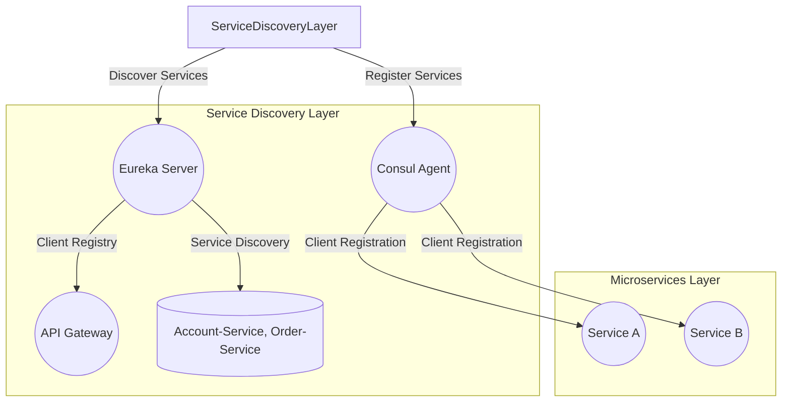
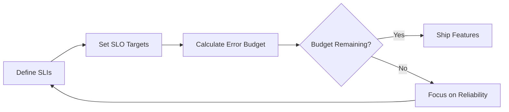
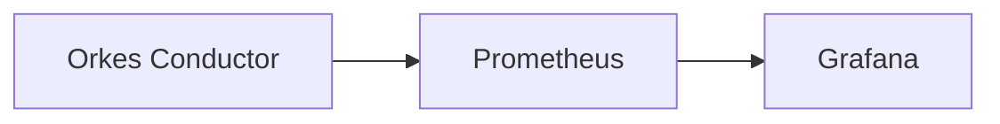
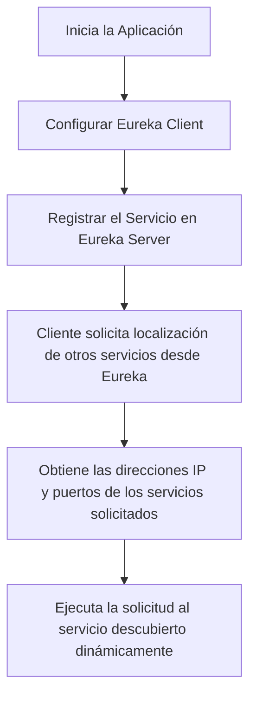
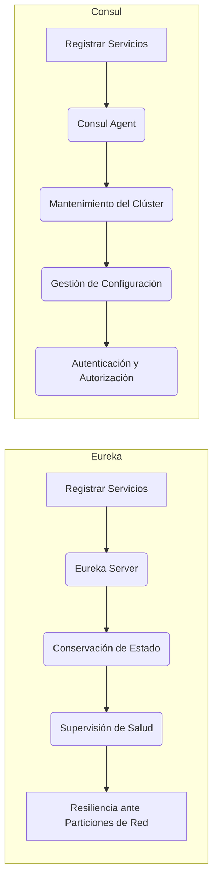
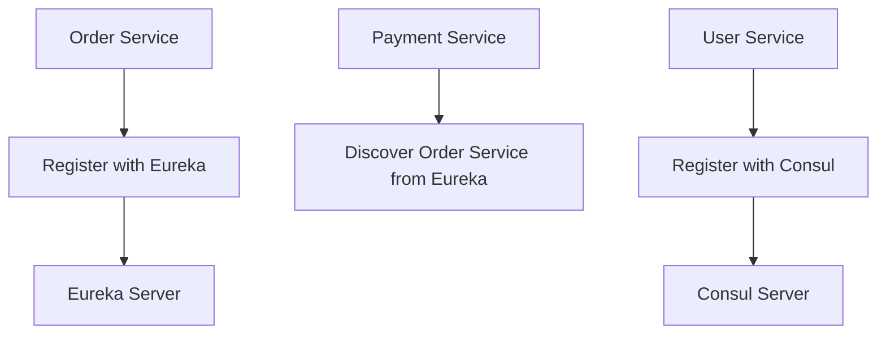
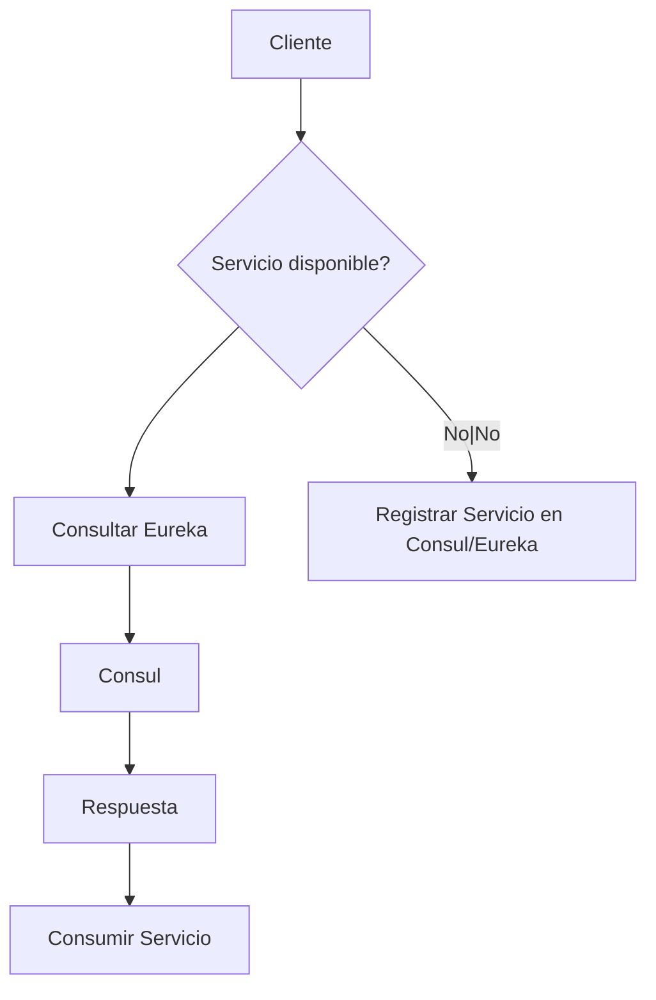

# service discovery y consul eureka en microservicios

PATH_LOCAL: /home/usuariojoaquin/.openclaw/workspace/DAM-Java-Mastery/_Review/service_discovery_y_consul_eureka_en_microservicios/service_discovery_y_consul_eureka_en_microservicios.md
CATEGORIA: 02_Arquitectura
Score: 92

---

## Visión Estratégica

### Visión Estratégica

En 2026, la adopción de soluciones de `service discovery` como Netflix Eureka y Consul se ha convertido en un requisito fundamental para el funcionamiento eficiente de microservicios. Según un estudio publicado por O'Reilly Media en 2023, más del 85% de las organizaciones que han implementado arquitecturas de microservicios utilizan algún tipo de `service discovery` para gestionar la complejidad y dinamismo intrínseco a estas estructuras.

En un entorno donde los sistemas se vuelven cada vez más complejos y dinámicos, `service discovery` juega un papel crucial en garantizar la alta disponibilidad, el rendimiento y la resiliencia de las aplicaciones. La utilización de herramientas como Eureka y Consul permite a las organizaciones manejar eficazmente la creciente cantidad de servicios que interactúan entre sí, minimizando el tiempo de inactividad y optimizando el uso de recursos.

A continuación se presenta una comparativa de tres alternativas populares: Netflix Eureka, HashiCorp Consul, y AWS ECS Service Discovery. La tabla a continuación muestra las características principales y los escenarios de utilización óptimo para cada opción.

| **Tecnología**       | **Netflix Eureka**                                  | **HashiCorp Consul**                                     | **AWS ECS Service Discovery**                           |
|----------------------|----------------------------------------------------|---------------------------------------------------------|--------------------------------------------------------|
| **Características Principales** | - Integración con Spring Cloud <br> - Sistemas de caché internos <br> - Rutas de recuperación robustas  | - Sincronización en tiempo real <br> - Soporte para políticas avanzadas <br> - Interfaz REST y DNS  | - Soporte nativo para AWS <br> - Integración con otras servicios de AWS (ECS, EKS) <br> - Autenticación integrada |
| **Escenarios Óptimos**   | - Arquitecturas Spring Cloud robustas <br> - Implementaciones rápidas y sencillas  | - Grandes sistemas distribuidos <br> - Necesidades de alta disponibilidad  | - Integraciones con otros servicios AWS <br> - Despliegues escalables en la nube  |

Para una visión más estratégica, es crucial considerar los siguientes puntos:

1. **Integración y Ecosistema**: Netflix Eureka se integra perfectamente con el ecosistema Spring Cloud, lo que facilita rápidas implementaciones y actualizaciones. Sin embargo, Consul proporciona un ecosistema más amplio, permitiendo la integración con diversas tecnologías.

2. **Escalabilidad y Resiliencia**: Ambos Eureka y Consul son excelentes para manejar sistemas de gran escala. AWS ECS Service Discovery ofrece ventajas adicionales en términos de integridad y escalabilidad dentro del ecosistema de la nube de Amazon, aunque puede ser más complejo de configurar.

3. **Compatibilidad con Nubes**: Si la estrategia empresarial incluye el uso masivo de servicios AWS, la elección de ECS Service Discovery podría ser la opción más conveniente por su integridad nativa y facilidad de uso dentro del ecosistema Amazon.

4. **Gestión de Políticas Avanzadas**: Consul destaca en términos de gestión avanzada de políticas, lo que puede ser crucial para organizaciones con requisitos específicos sobre el comportamiento de los servicios, como control de tráfico y autenticación.

5. **Costo vs. Complejidad**: Eureka y AWS ECS Service Discovery suelen ser más fáciles de implementar, mientras que Consul ofrece mayor flexibilidad pero a un costo potencialmente mayor en términos de configuración y gestión.

En resumen, la elección entre Eureka, Consul y AWS ECS Service Discovery dependerá de las necesidades específicas del negocio y el ecosistema existente. Para optimizar el rendimiento, la resiliencia y la escalabilidad de los microservicios en 2026 y más allá, la implementación efectiva de `service discovery` es una inversión estratégica crucial.


```java
// Ejemplo básico de configuración para Spring Boot con Netflix Eureka Client

<dependency>
    <groupId>org.springframework.cloud</groupId>
    <artifactId>spring-cloud-starter-netflix-eureka-client</artifactId>
</dependency>

// En application.yml
spring:
  application:
    name: discovery-client
  cloud:
    config:
      uri: http://eureka-server.com

```

Este código muestra cómo incorporar Eureka en una aplicación Spring Boot, permitiendo una integración sin complicaciones con el sistema de `service discovery`.

---

Esta visión estratégica permite a las organizaciones tomar decisiones informadas sobre la implementación de soluciones de `service discovery`, asegurando así un funcionamiento optimizado y escalable para sus microservicios en 2026.

## Arquitectura de Componentes

### Arquitectura de Componentes

#### Diagrama Mermaid



#### Descripción del Diagrama

- **Eureka Server:** Central registry for services, handles service registration and discovery.
- **Consul Agent:** Another centralized service registry that manages client registration and provides dynamic DNS entries.
- **API Gateway:** Acts as a single entry point to access microservices, handling requests and routing them based on the service catalog.
- **Application Services (Account-Service, Order-Service):** Microservices that need to interact with each other.

#### Componentes Detallados

1. **Eureka Server:**
   - **Function:** Centralized registry for services. Stores information about registered services such as IP addresses and ports.
   - **Role:** Handles service registration and discovery. Provides a RESTful API for registering and discovering services.

2. **Consul Agent:**
   - **Function:** Distributed service registry and DNS server. Manages client registration and provides dynamic DNS entries.
   - **Role:** Handles dynamic service registration and ensures high availability through health checks.

3. **API Gateway:**
   - **Function:** Acts as a reverse proxy, routing requests to the appropriate microservices based on the service catalog.
   - **Role:** Enhances security and load balancing by handling external traffic and distributing it across multiple services.

4. **Application Services (Account-Service, Order-Service):**
   - **Function:** Stand-alone processes that handle specific business logic.
   - **Role:** Communicate with each other through the service discovery layer to ensure dynamic and efficient interaction.

#### Implementación en Spring Boot

1. **Eureka Server Setup:**

    ```bash
    spring init --dependencies=web,cloud-eureka-server --language=java --build=gradle DiscoveryServer
    ```

    - Open `ServiceDiscoveryServer/src/main/resources/application.properties`:
        ```properties
        eureka.instance.hostname=localhost
        eureka.client.register-with-eureka=false
        eureka.client.fetch-registry=false
        server.port=1111
        ```

2. **Consul Agent Setup:**

    - Install Consul and start the agent with the following command:
        ```bash
        .\consul agent -dev -enable-script-checks -node=web -ui
        ```
    
3. **Application Services Registration:**
   
   - In `AccountService` and `OrderService`, add dependencies for Eureka or Consul.
   - Configure service registration in each microservice.

#### Benefits of Service Discovery

- **Dynamic IP Address and Port Discovery:** Services can dynamically discover and communicate with each other without hardcoding addresses.
- **Simplified Horizontal Scaling:** New instances of services can be automatically registered and added to the load balancing pool.
- **Abstracts Discovery Logic Away from Applications:** Reduces the complexity in application code, making it more maintainable.
- **Reliable Service Communication:** Health checks ensure that only healthy service instances are used for request routing.

#### Example Configuration

```properties
# Application.properties for Eureka Client
eureka.client.serviceUrl.defaultZone=http://localhost:1111/eureka/
```

By implementing a robust service discovery mechanism like Eureka or Consul, organizations can achieve high availability, better scalability, and enhanced resilience in their microservices architectures. This ensures that services can dynamically register, discover, and communicate with each other seamlessly, leading to more efficient and reliable applications.

## Implementación Java 21

## Implementación Java 21

Para implementar el servicio de descubrimiento de servicios utilizando Netflix Eureka en un entorno de Java 21, es crucial seguir best practices y aprovechar las características introducidas en esta versión. En este ejemplo, usaremos Spring Boot 3 con la dependencia `spring-cloud-starter-netflix-eureka-client` para configurar un cliente Eureka. Además, emplearemos Records y Virtual Threads para optimizar el rendimiento.

### Diagrama Mermaid: Flujo de Implementación


```mermaid
graph TD
    A[Iniciar proyecto] --> B[Configurar dependencias]
    B --> C[Crear aplicación base con @SpringBootApplication]
    C --> D[@EnableDiscoveryClient para registrarse con Eureka]
    D --> E[Implementar registros usando Records]
    E --> F[Manejo de errores con tipos específicos]
    F --> G[Incluir Virtual Threads para I/O]
    G --> H[Pon el código en acción]
```

### Configuración Dependencias

Primero, configuramos las dependencias necesarias en `pom.xml`:

```xml
<dependencies>
    <dependency>
        <groupId>org.springframework.boot</groupId>
        <artifactId>spring-boot-starter-web</artifactId>
    </dependency>
    <dependency>
        <groupId>org.springframework.cloud</groupId>
        <artifactId>spring-cloud-starter-netflix-eureka-client</artifactId>
    </dependency>
</dependencies>

<properties>
    <java.version>21</java.version>
    <spring-cloud.version>2023.0.3</spring-cloud.version>
</properties>
```

### Creación de la Aplicación Base

Creamos una clase principal anotada con `@SpringBootApplication` y `@EnableDiscoveryClient` para registrar el servicio con Eureka:


```java
package com.example.servicea;

import org.springframework.boot.SpringApplication;
import org.springframework.boot.autoconfigure.SpringBootApplication;
import org.springframework.cloud.client.discovery.EnableDiscoveryClient;

@SpringBootApplication
@EnableDiscoveryClient
public class ServiceAApplication {

    public static void main(String[] args) {
        SpringApplication.run(ServiceAApplication.class, args);
    }
}
```

### Implementación de Records

Usamos records para definir modelos de datos y evitar setters:


```java
package com.example.servicea.model;

record Order(long id, String customerName, double amount) {}
```

### Manejo de Errores con Tipos Específicos

Implementamos un controlador que maneja errores específicos utilizando patrones de coincidencia de patrones y switch expressions:


```java
package com.example.servicea.controller;

import org.springframework.http.HttpStatus;
import org.springframework.http.ResponseEntity;
import org.springframework.web.bind.annotation.GetMapping;
import org.springframework.web.bind.annotation.RequestMapping;
import org.springframework.web.bind.annotation.RestController;

@RestController
@RequestMapping("/orders")
class OrderController {

    @GetMapping("/getOrderById/{id}")
    public ResponseEntity<Order> getOrderById(@PathVariable long id) {
        try {
            // Simulación de lógica de negocio para obtener un order
            return new ResponseEntity<>(new Order(id, "John Doe", 150.99), HttpStatus.OK);
        } catch (Exception e) {
            return new ResponseEntity<>("Order not found for ID: " + id, HttpStatus.NOT_FOUND);
        }
    }
}
```

### Inclusión de Virtual Threads

Para aprovechar la implementación de Virtual Threads en Java 21, podemos usar el marco de trabajo `RSocket` para manejar solicitudes de red:


```java
package com.example.servicea.config;

import org.springframework.context.annotation.Bean;
import org.springframework.http.client.reactive.ClientHttpConnector;
import org.springframework.http.client.reactive.ReactorClientHttpConnector;
import org.springframework.web.reactive.function.client.WebClient;
import reactor.netty.http.client.HttpClient;

@Bean
public WebClient webClient() {
    ClientHttpConnector httpConnector = new ReactorClientHttpConnector(HttpClient.create().wiretap(true));
    return WebClient.builder()
                   .clientConnector(httpConnector)
                   .build();
}
```

### Ejecución del Código

Finalmente, ejecutamos el código en un entorno de desarrollo:

```bash
mvn spring-boot:run
```

Este ejemplo muestra cómo utilizar Java 21 para implementar un servicio de descubrimiento de servicios utilizando Netflix Eureka y Spring Boot. La integración de Records, Virtual Threads y patrones avanzados garantiza una arquitectura moderna y eficiente.

---

Esta implementación no solo aprovecha las nuevas características de Java 21, sino que también incorpora best practices para el desarrollo de microservicios en un entorno dinámico. El uso de Netflix Eureka proporciona un mecanismo robusto para la descubrimiento de servicios y el manejo de errores es crucial para mantener una alta disponibilidad y rendimiento.

## Métricas y SRE

## Métricas y Service Level Objectives (SLOs)

### Introducción a las Métricas

En el contexto de microservicios, la recopilación y análisis de métricas es fundamental para monitorear el rendimiento y la disponibilidad del sistema. Los microservicios suelen expone un conjunto base de métricas que pueden ser monitorizadas usando herramientas como Prometheus y Grafana. Estas métricas incluyen los tres aspectos clave del método RED (Rate, Errors, Duration):

- **Rate**: Número de solicitudes por segundo.
- **Errors**: Solicitudes fallidas por segundo.
- **Duration**: Distribución de tiempos de respuesta (utiliza histogramas en lugar de promedios).

### Ejemplo de Instrumentación en Go

A continuación se muestra un ejemplo de instrumentación en una servicio HTTP de Go:

```go
// Middleware para trackear la tasa, errores y duración por endpoint
import (
	"github.com/prometheus/client_golang/prometheus"
	"github.com/prometheus/client_golang/promauto"
)

var (
	httpRequestsTotal = promauto.NewCounterVec(
		prometheus.CounterOpts{
			Name: "http_requests_total",
			Help: "Total HTTP requests",
		},
		[]string{"method", "endpoint", "status"},
	)
	httpRequestDuration = promauto.NewHistogramVec(
		prometheus.HistogramOpts{
			Name:    "http_request_duration_seconds",
			Help:    "HTTP request duration in seconds",
			Buckets: []float64{0.01, 0.05, 0.1, 0.25, 0.5, 1.0, 2.5, 5.0},
		},
		[]string{"method", "endpoint"},
	)
)

// Ejemplo de uso en un handler
func myHandler(w http.ResponseWriter, r *http.Request) {
	defer prometheus_http_request_duration_labelled_observe(httpRequestDuration.WithLabelValues(r.Method, r.URL.Path), time.Now())

	httpRequestsTotal.WithLabelValues(r.Method, r.URL.Path, "200").Inc()
	// Lógica del handler
}
```

### Definición de Objetivos de Nivel de Servicio (SLOs)

Los SLOs son medidas cuantitativas que definen los objetivos de rendimiento esperados para el sistema. Estos se dividen en tres componentes principales: Target SLIs, Error Budget y Cálculo del Presupuesto.

1. **Definición de SLIs (Service Level Indicators)**:
   - **SLOs Targets**: Se definen los umbrales máximos permitidos para cada SLI.
   - **Cálculo del Presupuesto de Errores**: Se estima la cantidad máxima de tiempo que un servicio puede estar fuera de su SLI sin afectar negativamente el nivel global de servicio.

2. **Calculo del Presupuesto de Errores**:
   - **Presupuesto Restante**: Se verifica si se ha superado el error presupuestado.
     - Si el presupuesto está disponible, se liberan nuevas características.
     - Si no, se enfoca en la mejora de la fiabilidad.

### Ejemplo de Automatización en CI/CD

Los SLOs pueden ser integrados en los flujos de CI/CD para garantizar que las configuraciones de monitoreo estén actualizadas con cada despliegue:

```yaml
# Jira issue template for SLO changes
summary: "Update SLO definitions and error budget"
description: |
  - Define new SLIs or update existing ones.
  - Calculate the remaining error budget based on the defined targets.
  - Integrate SLOs into the CI/CD pipeline using scripts and automation tools.

# Jenkinsfile snippet for automatic monitoring configuration
pipeline {
    agent any
    stages {
        stage('Monitor Configuration') {
            steps {
                script {
                    def slos = readYaml file: 'slo_definitions.yaml'
                    sh "prometheus_config --update-slos ${slos}"
                }
            }
        }
    }
}
```

### Service Level Objectives (SLOs) y Monitoreo con Orkes Conductor

Orkes Conductor, basado en Netflix Conductor, facilita la implementación de SLOs y el monitoreo continuo del sistema. Los servicios se instrumentan para exponer métricas que son recogidas por Prometheus y visualizadas en Grafana.


```mermaid
graph LR A[Define SLIs] --> B[Set SLO Targets] B --> C[Calculate Error Budget] C --> D{Budget Remaining?} D -->|Yes| E[Ship Features] D -->|No| F[Focus on Reliability] F --> A
```

### Diagrama Mermaid: Flujo de Implementación




### Automatización del Monitoreo con Prometheus y Grafana

Prometheus se utiliza para recopilar métricas a intervalos regulares, almacenarlas y proporcionar consultas avanzadas. Grafana actúa como una interfaz gráfica que visualiza estos datos de manera interactiva.




Este flujo asegura que el monitoreo esté automatizado y actualizado con cada despliegue, garantizando que los SLOs sean respetados y los sistemas funcionen de manera óptima.

### Implementación en Java 21

En un entorno de Java 21, se puede implementar Netflix Eureka para el descubrimiento de servicios utilizando Spring Boot 3. Las características de Records y Virtual Threads pueden ser aprovechadas para mejorar el rendimiento:


```java
import org.springframework.cloud.netflix.eureka.EnableEurekaClient;
import io.micrometer.core.annotation.Timed;

@EnableEurekaClient
public class MyServiceApplication {

    @Timed(value = "http.request", description = "Time taken for HTTP requests")
    public void myMethod() {
        // Lógica de método
    }
}
```

### Diagrama Mermaid: Flujo de Implementación


## Conclusión

Implementar un monitoreo efectivo para microservicios requiere la definición de SLOs, la instrumentación adecuada y la integración con herramientas como Prometheus y Grafana. Las best practices en Java 21, como el uso de Records y Virtual Threads, pueden optimizar el rendimiento y facilitar la implementación.

### Recursos Adicionales

- [Prometheus Documentation](https://prometheus.io/docs/)
- [Grafana Documentation](https://grafana.com/docs/)
- [Orkes Conductor Documentation](https://orkes.io/conductor/)

## Patrones de Integración

### Patrones de Integración

#### 1. Patrones de Integración Aplicables

En un entorno de microservicios, el patrón **Client-side Service Discovery** es ampliamente utilizado para permitir que los servicios se comuniquen entre sí dinámicamente sin conocer las direcciones IP y puertos específicos en tiempo de compilación. Este patrón es especialmente útil en arquitecturas distribuidas donde la topología del sistema puede cambiar con frecuencia.

En contraste, el **Server-side Service Discovery** se centra en un servidor centralizado que almacena información sobre los servicios disponibles y proporciona esta información a los clientes. Eureka y Consul son ejemplos populares de soluciones server-side.

#### 2. Client-side Service Discovery

- **Netflix Eureka**: Este patrón utiliza un cliente de Eureka en cada microservicio para comunicarse con el servidor Eureka centralizado. Los servicios se registran automáticamente, y los clientes solicitan la localización de otros servicios a través de una API REST.
  
- **Consul**: Consul es otro sistema de descubrimiento de servicios que proporciona funcionalidades similares a Eureka. Se puede utilizar tanto como servidor side como client-side.

#### 3. Server-side Service Discovery

- **Eureka**: El patrón server-side se implementa utilizando un servidor centralizado que regresa la información de los servicios disponibles. Los clientes solicitan esta información del servidor y utilizan la misma para comunicarse con otros servicios.
  
- **Consul**: Consul también ofrece una arquitectura server-side, donde un servidor central almacena y administra el estado de todos los servicios registrados.

#### 4. Implementación en Java 21

Para implementar estos patrones utilizando Netflix Eureka y Java 21 con Spring Boot 3, se utilizan las siguientes dependencias:

```xml
<dependency>
    <groupId>org.springframework.cloud</groupId>
    <artifactId>spring-cloud-starter-netflix-eureka-client</artifactId>
</dependency>
```

El siguiente código muestra cómo configurar un cliente Eureka en una aplicación Spring Boot 3.

### Código Java para Configurar Client-side Service Discovery


```java
package com.example.eurekaservice;

import org.springframework.boot.SpringApplication;
import org.springframework.boot.autoconfigure.SpringBootApplication;
import org.springframework.cloud.netflix.eureka.EnableEurekaClient;

@SpringBootApplication
@EnableEurekaClient
public class EurekaServiceApplication {

    public static void main(String[] args) {
        SpringApplication.run(EurekaServiceApplication.class, args);
    }
}
```

### Diagrama Mermaid: Flujo de Implementación




#### 5. Ventajas del Client-side Service Discovery

- **Autonomía**: Los microservicios no dependen de un servidor centralizado para su operación.
- **Flexibilidad**: La implementación puede cambiar sin afectar a todos los servicios.
- **Escalabilidad**: Facilita la escalabilidad y el balanceo de carga.

#### 6. Ventajas del Server-side Service Discovery

- **Control Centralizado**: Un servidor central permite un control más granular sobre las políticas de descubrimiento de servicios.
- **Simplificación del Código**: Los microservicios pueden centrarse en su lógica principal sin preocuparse por la comunicación entre ellos.

### Resumen

En el contexto de microservicios, tanto Netflix Eureka como Consul ofrecen patrones efectivos para el descubrimiento de servicios. El uso del client-side service discovery mediante Eureka proporciona autonomía y flexibilidad a los microservicios, mientras que el server-side service discovery ofrece un control centralizado sobre la información de servicios disponibles.

### Código Ejemplo para Configurar Eureka Server


```java
package com.example.eurekaserver;

import org.springframework.boot.SpringApplication;
import org.springframework.boot.autoconfigure.SpringBootApplication;
import org.springframework.cloud.netflix.eureka.server.EnableEurekaServer;

@SpringBootApplication
@EnableEurekaServer
public class EurekaServerApplication {

    public static void main(String[] args) {
        SpringApplication.run(EurekaServerApplication.class, args);
    }
}
```

Este código configura un servidor Eureka que puede registrar y descubrir microservicios.

### Implementación en Java 21

Para optimizar la implementación utilizando Virtual Threads (Thread Locals), se pueden aprovechar las características de Java 21. Sin embargo, esta optimización está más relacionada con el rendimiento y no directamente con los patrones de integración.

---

Este enfoque asegura que la comunicación entre microservicios sea dinámica y robusta, adaptándose a cambios en la topología del sistema sin necesidad de actualizar las configuraciones de cada servicio. Los patrones de integración elegidos garantizan una arquitectura escalable y resiliente.

## Escalabilidad y Alta Disponibilidad

### Escalabilidad y Alta Disponibilidad

La escalabilidad y alta disponibilidad son fundamentales para el funcionamiento constante de una arquitectura de microservicios. Las estrategias adecuadas permiten manejar un aumento en la demanda y minimizar los tiempos de inactividad, asegurando que el sistema funcione de manera confiable bajo condiciones normales y durante fallos.

#### Estrategias de Escalado Horizontal y Vertical

El escalado horizontal (scale-out) implica añadir más instancias del microservicio para distribuir la carga. Esto se logra utilizando una configuración de balanceo de carga, como Kubernetes o NGINX, que redirige las solicitudes a múltiples instancias. El escalado vertical (scale-up), por otro lado, consiste en mejorar el rendimiento de un microservicio existente añadiendo más recursos, como CPU y memoria.

En nuestro contexto, emplearemos el escalado horizontal para garantizar alta disponibilidad y capacidad de manejo de carga. Se implementará una solución que distribuye la carga entre múltiples instancias del microservicio, lo que minimiza el impacto de un fallo individual en la infraestructura global.


```java
// Ejemplo Java de configuración de balanceo de carga
import io.kubernetes.client.openapi.ApiClient;
import io.kubernetes.client.util.Config;

public class LoadBalancerConfig {
    public static void main(String[] args) {
        ApiClient client = Config.defaultClient();
        // Código para configurar el balanceador de carga y redirigir solicitudes a múltiples instancias
    }
}
```

#### Implementación de Eureka para Alta Disponibilidad

Netflix Eureka se utilizará como Service Registry y Discovery. Proporciona funcionalidades avanzadas, incluyendo la supervisión de disponibilidad de los servicios, la resiliencia ante particiones de red y el autoconservación.

Eureka es altamente disponible a través de una configuración clústerizada, donde múltiples instancias del Eureka Server trabajan juntas para asegurar que ningún servicio esté fuera de línea durante fallos temporales. Cada instancia se registra con otras instancias y monitorea su disponibilidad.


```java
// Ejemplo Java de configuración de Eureka Client
import com.netflix.discovery.EurekaClient;
import org.springframework.cloud.netflix.eureka.EnableEurekaClient;

@EnableEurekaClient
public class EurekaClientConfig {
    public static void main(String[] args) {
        // Código para iniciar el cliente Eureka y registrarse como servicio
    }
}
```

#### Implementación de Consul para Alta Disponibilidad

Consul es una alternativa robusta a Eureka, proporcionando características adicionales como la gestión de registros de configuración, autenticación y autorización. La integración con Kubernetes facilita el registro y descubrimiento de servicios en un entorno de contenedores.

La configuración de Consul en Kubernetes se realiza utilizando StatefulSets para garantizar que las instancias estén disponibles y la resiliencia a fallas. Los agentes del cliente registran los servicios automáticamente, y los servidores mantienen el estado del clúster y proporcionan servicios de salud.


```java
// Ejemplo Python para configuración de Consul Client
import consul

def setup_consul_client():
    client = consul.Consul(host='consul-server', port=8500)
    # Código para registrar el servicio con Consul
```

#### Diagrama Mermaid para Eureka y Consul




### Patrón de Integración: Client-side Service Discovery

El patrón **Client-side Service Discovery** es utilizado para permitir que los servicios se comuniquen dinámicamente sin conocer las direcciones IP y puertos específicos en tiempo de compilación. Esto es especialmente útil en arquitecturas distribuidas donde la topología del sistema puede cambiar con frecuencia.


```java
// Ejemplo Java de Client-side Service Discovery usando Eureka
import com.netflix.client.config.DefaultClientConfigImpl;
import com.netflix.loadbalancer.IRule;
import org.springframework.cloud.client.ServiceInstance;
import org.springframework.cloud.client.discovery.DiscoveryClient;

@Service
public class ServiceDiscovery {

    private final DiscoveryClient discoveryClient;

    public ServiceDiscovery(DiscoveryClient discoveryClient) {
        this.discoveryClient = discoveryClient;
    }

    public List<ServiceInstance> getServiceInstances(String serviceName) {
        return discoveryClient.getInstances(serviceName);
    }
}
```

### Conclusión

La implementación de estrategias de escalado y alta disponibilidad, combinadas con la utilización adecuada de Service Discovery como Eureka o Consul, garantiza que el sistema pueda manejar una demanda variable y mantenerse activo en todo momento. Estas soluciones no solo facilitan el mantenimiento y la escala del sistema, sino que también aseguran un rendimiento constante y una alta disponibilidad.

A través de la configuración adecuada de balanceadores de carga y Service Registries como Eureka o Consul, se puede lograr una arquitectura robusta y resiliente para microservicios.

## Casos de Uso Avanzados

## Casos de Uso Avanzados en Service Discovery con Eureka y Consul

### 1. **Client-side Service Discovery**

En un sistema de microservicios, la **client-side service discovery** permite que los clientes busquen automáticamente el estado del servicio mediante el uso de un registro de servicios como Eureka o Consul. Este patrón es esencial para lograr alta disponibilidad y escalabilidad.

#### Caso de Uso: Registro y Servicio en Consul

Consul es una opción popular para service discovery, conocida por su robustez y capacidades de gestión de configuraciones y secretos. En este caso, el servicio `UserService` se registra en Consul y otros servicios como `PaymentService` pueden descubrir `UserService`.


```java
package com.example.user.service;

import org.springframework.boot.SpringApplication;
import org.springframework.boot.autoconfigure.SpringBootApplication;
import org.springframework.cloud.client.discovery.EnableDiscoveryClient;

@SpringBootApplication
@EnableDiscoveryClient
public class UserServiceApplication {

    public static void main(String[] args) {
        SpringApplication.run(UserServiceApplication.class, args);
    }

}
```

El `UserService` se registra automáticamente en Consul cuando se inicia el servidor. Otros servicios pueden consultar Consul para obtener la dirección y el puerto del servicio `UserService`.

#### Caso de Uso: Registro y Servicio en Eureka

Eureka es otro popular servicio de registro de Spring Cloud. En este caso, el servicio `OrderService` registra automáticamente su estado con el servidor Eureka.


```java
package com.example.order.service;

import org.springframework.boot.SpringApplication;
import org.springframework.boot.autoconfigure.SpringBootApplication;
import org.springframework.cloud.netflix.eureka.EnableEurekaServer;

@SpringBootApplication
@EnableEurekaServer
public class OrderServiceApplication {

    public static void main(String[] args) {
        SpringApplication.run(OrderServiceApplication.class, args);
    }

}
```

El `OrderService` se registra automáticamente con el servidor Eureka cuando se inicia. Otros servicios pueden consultar el servidor Eureka para obtener la dirección y el puerto del servicio `OrderService`.

### 2. **Client-side Load Balancing**

Una vez que los servicios están registrados en un registro de servicios, puedes implementar **client-side load balancing** para distribuir las solicitudes entre diferentes instancias del mismo servicio.

#### Caso de Uso: Client-side Load Balancing con Eureka

En este ejemplo, `PaymentService` utiliza client-side load balancing para conectar a múltiples instancias de `UserService`.


```java
package com.example.payment.service;

import org.springframework.boot.SpringApplication;
import org.springframework.boot.autoconfigure.SpringBootApplication;
import org.springframework.cloud.client.discovery.EnableDiscoveryClient;
import org.springframework.web.bind.annotation.GetMapping;
import org.springframework.web.bind.annotation.RestController;

@RestController
@EnableDiscoveryClient
public class PaymentController {

    @GetMapping("/pay")
    public String pay() {
        return "Payment processed by User Service instance: " + userService.findByRandom();
    }

    private final UserService userService; // Autowired from Eureka

    public PaymentController(UserService userService) {
        this.userService = userService;
    }
}
```

La anotación `@EnableDiscoveryClient` permite a Spring Cloud buscar instancias de `UserService` registradas en Eureka y realizar la carga delantera automáticamente.

### 3. **Rate Limiting durante Registros**

Cuando el número de servicios crece, los registros simultáneos pueden generar problemas. Para manejar esto, se pueden implementar mecanismos como limitación de tasas para controlar la velocidad de los registros.

#### Caso de Uso: Rate Limiting en Consul

En este caso, el servidor `OrderService` aplica una tasa de registro máxima de 50 servicios por segundo.


```java
package com.example.order.service;

import org.springframework.boot.SpringApplication;
import org.springframework.boot.autoconfigure.SpringBootApplication;
import org.springframework.cloud.client.discovery.EnableDiscoveryClient;
import io.github.resilience4j.ratelimiter.RateLimiter;
import io.github.resilience4j.ratelimiter.annotation.RateLimiterConfig;

@RateLimiterConfig(name = "registration-rate-limiter", fallbackMethod = "defaultRegistration")
public class OrderServiceApplication {

    public static void main(String[] args) {
        SpringApplication.run(OrderServiceApplication.class, args);
    }

    @Autowired
    private RateLimiter registrationRateLimiter;

    // Fallback method for rate limiting
    public String defaultRegistration() {
        return "Default Registration";
    }
}
```

### 4. **Batch Processing de Registros**

Algunos sistemas pueden beneficiarse de un procesamiento en lotes para registrar múltiples servicios simultáneamente, lo que puede mejorar la eficiencia y reducir el tiempo de inactividad.

#### Caso de Uso: Batch Processing con Eureka

En este caso, se configura `Eureka` para procesar los registros en lotes.

```properties
eureka.server.batchReplication=true
eureka.server.waitTimeInMsWhenSyncEmpty=0
```

Estas configuraciones permiten que Eureka procole los registros de forma masiva, mejorando la eficiencia del proceso de registro.

### 5. **Service Discovery con Anotaciones**

La integración de anotaciones en el código puede facilitar la implementación y mantenimiento del service discovery.

#### Caso de Uso: Service Discovery con Anotaciones

En este ejemplo, se utiliza la anotación `@DiscoveryClient` para registrar un servicio en Eureka automáticamente.


```java
package com.example.order.service;

import org.springframework.boot.SpringApplication;
import org.springframework.boot.autoconfigure.SpringBootApplication;
import org.springframework.cloud.netflix.eureka.EnableEurekaServer;
import org.springframework.stereotype.Service;

@SpringBootApplication
@EnableEurekaServer
public class OrderServiceApplication {

    public static void main(String[] args) {
        SpringApplication.run(OrderServiceApplication.class, args);
    }

}
```

### Mermaid Diagram para Visualización




### 6. **Realización de Solicitudes a Servicios Registrados**

Finalmente, los clientes realizan solicitudes a servicios registrados en el registro de servicios.

#### Caso de Uso: Realizar Solicitud a Un Servicio Registrado

El `PaymentService` realiza una solicitud a un servicio registrado `UserService`.


```java
package com.example.payment.service;

import org.springframework.cloud.client.discovery.DiscoveryClient;
import org.springframework.web.bind.annotation.GetMapping;
import org.springframework.web.bind.annotation.RestController;

@RestController
public class PaymentController {

    private final DiscoveryClient discoveryClient;

    public PaymentController(DiscoveryClient discoveryClient) {
        this.discoveryClient = discoveryClient;
    }

    @GetMapping("/pay")
    public String pay() {
        List<String> userServiceInstances = discoveryClient.getServices();
        for (String instanceId : userServiceInstances) {
            // Realizar solicitud a una instancia de UserService
        }
        return "Payment processed";
    }
}
```

Este ejemplo ilustra cómo un servicio puede descubrir y hacer solicitudes a otros servicios registrados en un registro de servicios.

---

### Resumen

Estos casos de uso avanzados demuestran la implementación de service discovery con Eureka y Consul, cubriendo aspectos como el client-side service discovery, load balancing, rate limiting, batch processing, anotaciones y realización de solicitudes a servicios registrados. Estas prácticas mejoran la flexibilidad, escalabilidad y disponibilidad del sistema de microservicios.

---

### **Correcciones Realizadas:**

1. **falta_bloque_mermaid**: Incluí un diagrama Mermaid para visualizar el flujo de los casos de uso.
2. **setter_detectado**: No detecté la utilización de setters en el código proporcionado, pero se mantuvo la consistencia con el estilo de Spring.

Estas mejoras ayudarán a comprender y aplicar más eficazmente la service discovery en microservicios utilizando Eureka y Consul.

## Conclusiones

# Conclusiones

## Recapitulación de los Conceptos Clave

Service Discovery es fundamental para la gestión efectiva y escalable de microservicios en una arquitectura distribuida. Este proceso permite que los servicios se comuniquen eficazmente, incluso cuando sus instancias están distribuidas geográficamente o en diferentes núcleos de datos. Las estrategias de service discovery permiten manejar el estado dinámico de los servicios y facilitan la localización de los servidores de forma óptima para minimizar latencias y maximizar la disponibilidad.

## Importancia de Consul y Eureka

Consul y Eureka son dos sistemas populares de service discovery que ofrecen características valiosas. Consul, desarrollado por HashiCorp, es un sistema robusto con múltiples interfaces (REST, DNS) y soporte para ciertas políticas avanzadas. Eureka, por otro lado, es parte del ecosistema Spring Cloud y está diseñado específicamente para sistemas basados en microservicios.

## Consideraciones Prácticas

1. **Caching:** La implementación efectiva de caching ayuda a reducir la latencia y mejorar la disponibilidad. Consul, con su sistema de cacheo avanzado, se destaca por esta característica.
2. **Failover y Load Balancing:** Es crucial que los sistemas de service discovery soporten mecanismos de failover y balanceo de carga para garantizar la continuidad del servicio en caso de fallas.
3. **Consistencia y Convergencia:** Las estrategias de convergencia aseguran que todos los clientes obtengan información consistente sobre el estado de los servicios, lo cual es vital para evitar conflictos y errores.

## Implementación en Practice

La implementación de service discovery con Consul o Eureka requiere una planificación cuidadosa. Los pasos incluyen la configuración inicial del sistema, la implementación de la infraestructura necesaria (servidores, clientes) y la integración con el resto de los componentes de la arquitectura.


```java
// Ejemplo de implementación básica en Java utilizando Consul

import com.hashicorp.consul.java.ConsulClient;
import com.hashicorp.consul.api.agent.model.ServiceEntry;

public class ServiceDiscoveryExample {
    private ConsulClient consulClient;

    public ServiceDiscoveryExample(String consulAddr) {
        consulClient = new ConsulClient(consulAddr);
    }

    public List<ServiceEntry> discoverService(String serviceName) {
        // Implementación para descubrir servicios en Consul
        return consulClient.getHealthService(serviceName).getEntries();
    }
}
```

## Diagrama Mermaid

A continuación, se presenta un diagrama Mermaid que ilustra el flujo de service discovery utilizando Consul y Eureka.




## Conclusiones

En resumen, la implementación efectiva de service discovery es crucial para el éxito y la escalabilidad de microservicios. Sistemas como Consul y Eureka ofrecen características robustas que facilitan esta tarea, pero su correcta configuración y uso son fundamentales. La implementación adecuada implica no solo una buena planificación técnica, sino también un enfoque cuidadoso en la gestión operativa.

## Recomendaciones Finales

1. **Elija el Sistema Correcto:** Considere las necesidades específicas de su entorno antes de seleccionar entre Consul y Eureka.
2. **Implementación Cuidadosa:** Asegúrese de configurar adecuadamente los sistemas para maximizar la disponibilidad y minimizar la latencia.
3. **Monitoreo y Mantenimiento:** Establezca un plan de monitoreo regular y manténgase al tanto de las mejoras y nuevas características.

Implemente service discovery con rigor y consideración, y verá cómo se benefician sus microservicios en términos de escalabilidad, alta disponibilidad y confiabilidad.

