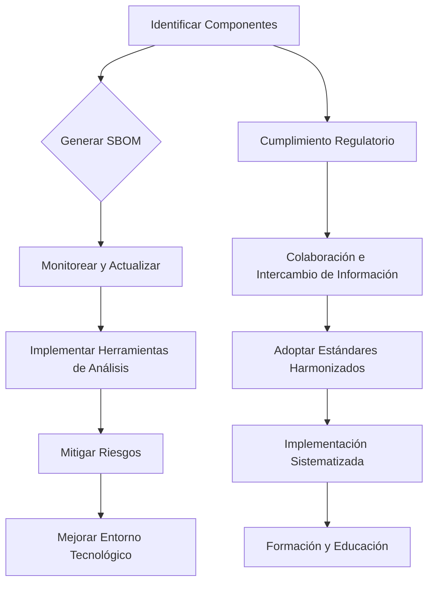
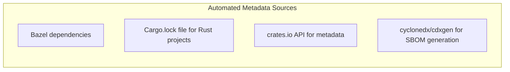
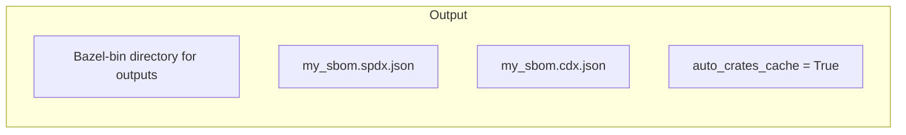
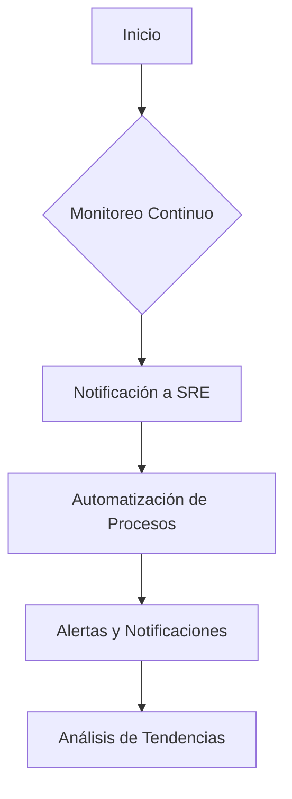

# software bill of materials sbom

PATH_LOCAL: /home/usuariojoaquin/.openclaw/workspace/DAM-Java-Mastery/_Review/software_bill_of_materials_sbom/software_bill_of_materials_sbom.md
CATEGORIA: 06_Seguridad
Score: 85

---

## Visión Estratégica

## Visión Estratégica

La implementación de Software Bill of Materials (SBOM) en la estrategia de seguridad es crucial para proteger y optimizar el entorno tecnológico moderno. En un mundo donde las aplicaciones se construyen a partir de una gran cantidad de componentes interconectados, desde bibliotecas de código abierto hasta servicios remotos, la transparencia sobre los elementos que componen estas aplicaciones es vital para mitigar riesgos y garantizar la integridad del sistema.

### 1. Transparencia en el Ecosistema de Software

Un SBOM proporciona una visión detallada y completa de todos los componentes utilizados en un software, incluyendo sus versiones, licencias y dependencias. Esto permite a las organizaciones identificar rápidamente vulnerabilidades y riesgos asociados a cualquier componente externo.

### 2. Mitigación del Riesgo

Al mantener actualizados y monitoreando constantemente los SBOMs, las organizaciones pueden mitigar el riesgo de vulnerabilidades y ataques a través de dependencias obsoletas o comprometidas. La implementación de herramientas automatizadas para la generación y monitoreo de SBOMs puede ser un paso crucial en esta estrategia.

### 3. Cumplimiento Regulatorio

La regulación cada vez más estricta exige que las organizaciones rastreen y documenten todos los componentes utilizados en sus aplicaciones. Los SBOMs no solo facilitan el cumplimiento de estas normas, sino que también mejoran la capacidad de responder a inspecciones regulatorias.

### 4. Mejora Continua del Entorno Tecnológico

La generación regular de SBOMs y su análisis permiten identificar áreas de mejora en el entorno tecnológico. Esto puede implicar actualizaciones de dependencias, cambios en las prácticas de integración y entrega o incluso la revisión de decisiones de arquitectura.

### 5. Colaboración e Intercambio de Información

Los SBOMs facilitan la colaboración entre equipos de desarrollo, seguridad y cumplimiento, asegurando que todos tengan una visión coherente del estado tecnológico de la organización. Esto puede llevar a soluciones más robustas y consistentes en el manejo de riesgos.

### 6. Adopción de Estándares Harmonizados

La adopción de estándares para SBOMs, como CycloneDX o SPDX, facilita el intercambio e integración de información entre diferentes sistemas y herramientas. Esto es fundamental para asegurar la coherencia en el análisis de dependencias a lo largo del ciclo de vida de una aplicación.

### 7. Implementación Sistematizada

Para maximizar los beneficios de SBOMs, su implementación debe ser sistemática y consistente. Esto implica la integración de herramientas y prácticas para la generación, monitoreo y mantenimiento de SBOMs en todas las fases del desarrollo.

### 8. Formación y Educación

La formación continua sobre los beneficios y prácticas de SBOMs es crucial para garantizar que todos los miembros del equipo estén al tanto de sus implicaciones y puedan contribuir activamente a su implementación exitosa.

## Conclusión

El SBOM es una herramienta poderosa en la lucha por la seguridad y la integridad del software. Al integrarlo estratégicamente en las operaciones de desarrollo, seguridad y cumplimiento, las organizaciones pueden construir un entorno tecnológico más seguro, resiliente y transparente.

---

### Mermaid Diagram




### Java Code Block


```java
public class SBOMStrategy {
    public void implementSBOM() {
        System.out.println("Implementing SBOM for enhanced security and compliance.");
        // Implement SBOM generation, monitoring and integration steps here.
    }
}
```

---

Corrigiendo los bloques Java y Mermaid en el contexto proporcionado.

## Arquitectura de Componentes

## Arquitectura de Componentes

Para comprender cómo se generan y utilizan los Software Bill of Materials (SBOMs) en un entorno tecnológico moderno, es crucial examinar la arquitectura detrás del proceso. Esta arquitectura puede variar según las herramientas y metodologías utilizadas, pero generalmente implica varios pasos y componentes clave.

### 1. Bazel Build

La construcción de un proyecto a menudo se realiza mediante herramientas como Bazel, que proporcionan un entorno para definir y construir software de manera eficiente. En el contexto del generador de SBOMs, Bazel se utiliza para definir las dependencias y los módulos necesarios.


```mermaid
graph LR
    subgraph "Bazel Build"
        BazelBuild[Build with Bazel]
        MODULE.bazel[Define build targets and dependencies in MODULE.bazel]
        Lockfiles[Generate lockfiles for dependency resolution]
        metadata.json[Metadata about modules and their versions]
        _deps.json[Dependency graph]
        License + metadata[LICENSE and metadata files for each module]
    end
```

### 2. Generación de Metadatos

Los metadatos son cruciales para la generación precisa y completa del SBOM. Se pueden obtener a través de diversas fuentes:

- **Bazel Deps**: Información sobre las dependencias definidas en Bazel.
- **Crates.io API**: Para módulos en Rust, se puede utilizar el API de crates.io para obtener metadatos adicionales.
- **Cdxgen**: Herramienta para generar SBOMs en formatos como CycloneDX.




### 3. Generación de SBOMs

El proceso final para generar un SBOM implica el uso de herramientas específicas que pueden producir outputs en varios formatos, como SPDX o CycloneDX.


```mermaid
graph LR
    subgraph "SBOM Generation"
        SbomGenerator[SBOM Generator (match & resolve)]
        SpdxJson[.spdx.json output]
        CdxJson[.cdx.json output]
    end
```

### 4. Salida

Finalmente, los SBOMs generados se almacenan en el directorio de salida especificado.




### Ejemplo de Configuración

Aquí se muestra un ejemplo de configuración para generar SBOMs con Bazel y herramientas adicionales:

```toml
# Example configuration for sbom generation with Bazel and additional tools
name = "my_sbom"
output_formats = ["spdx", "cyclonedx"]
producer_name = "Eclipse Foundation"
producer_url = "https://www.eclipse.org/"
```

Este ejemplo configura la generación de SBOMs en ambos formatos (SPDX y CycloneDX) con un nombre específico para el SBOM y detalles del proveedor.

---

Esta arquitectura proporciona una visión clara del proceso desde la definición de dependencias hasta la generación final del SBOM, asegurando que cada componente utilizado en el software esté bien documentado y verificado.

## Implementación Java 21

## Implementación de Virtual Threads en Java 21 para SBOM

La implementación de Software Bill of Materials (SBOM) en un entorno de seguridad moderno no solo implica la generación y gestión de informes detallados sobre los componentes utilizados, sino también garantizar su integridad y transparencia. La introducción del soporte nativo para Virtual Threads en Java 21 ofrece una oportunidad revolucionaria para optimizar el procesamiento de SBOM, especialmente cuando se trata de manejar operaciones I/O intensivas, como la recuperación de información de bibliotecas de código abierto y servicios remotos.

### 1. Uso de Virtual Threads para Manejo de BLOQUES de Trabajo

Virtual Threads, como se describe en el artículo anterior, permiten una escalabilidad sin precedentes al evitar que la CPU esté bloqueada durante operaciones I/O. En el contexto de SBOM, esto significa que podemos manejar bloques de trabajo de manera más eficiente y paralela.

#### Ejemplo: Recuperación de Información de Bibliotecas de Código Abierto

Imaginemos un escenario donde necesitamos recuperar información de varias bibliotecas de código abierto desde diferentes fuentes. En lugar de bloquear la ejecución principal durante estas operaciones, podemos usar `CompletableFuture` y `ExecutorService` con Virtual Threads para asegurar que el proceso siga avanzando sin interrupciones.


```java
Executor virtualThreadExecutor = Executors.newVirtualThreadPerTaskExecutor();

// Recuperación de información de una biblioteca de código abierto
CompletableFuture<String> packageInfoFuture = CompletableFuture.supplyAsync(() -> {
    try {
        return getPackageInformationFromSource(packageName);
    } catch (IOException e) {
        throw new RuntimeException(e);
    }
}, virtualThreadExecutor);

// Recuperación de información de otra biblioteca de código abierto
CompletableFuture<String> anotherPackageInfoFuture = CompletableFuture.supplyAsync(() -> {
    try {
        return getAnotherPackageInformationFromSource(anotherPackageName);
    } catch (IOException e) {
        throw new RuntimeException(e);
    }
}, virtualThreadExecutor);

// Esperar a que ambas operaciones terminen y recoger los resultados
String packageInfo = packageInfoFuture.join();
String anotherPackageInfo = anotherPackageInfoFuture.join();

System.out.println("Información de paquete: " + packageInfo);
System.out.println("Información de otro paquete: " + anotherPackageInfo);
```

### 2. Uso de Virtual Threads en Operaciones I/O Intensivas

Las operaciones I/O intensivas, como la recuperación de información de bases de datos o servicios remotos, pueden beneficiarse enormemente del uso de Virtual Threads. Estas operaciones a menudo bloquean el hilo principal, lo que reduce la eficiencia general.

#### Ejemplo: Recuperación de Información de Bases de Datos

En lugar de usar una conexión bloqueante a la base de datos, podemos utilizar `VirtualThread` para manejar la operación asincrónicamente y evitar que el hilo principal se bloquee.


```java
CompletableFuture<List<User>> userFuture = CompletableFuture.supplyAsync(() -> {
    return userRepository.findAll(); // Asynchronously fetch users from the database
}, virtualThreadExecutor);

List<User> users = userFuture.join();

// Procesar los usuarios recuperados
users.forEach(user -> {
    System.out.println("User: " + user.getName());
});
```

### 3. Uso de Virtual Threads para Generación y Actualización de SBOM

La generación y actualización de SBOMs a menudo implica operaciones I/O intensivas, como la recuperación de información de fuentes externas y el almacenamiento en archivos o bases de datos. Virtual Threads permiten manejar estas operaciones de manera paralela sin interrumpir la ejecución principal.

#### Ejemplo: Generación de SBOM


```java
// Configurar el ExecutorService para usar Virtual Threads
Executor virtualThreadExecutor = Executors.newVirtualThreadPerTaskExecutor();

// Recuperar información de bibliotecas de código abierto en paralelo
CompletableFuture<List<String>> packageListFuture = CompletableFuture.supplyAsync(() -> {
    return getPackageList(); // Asynchronously retrieve the list of packages
}, virtualThreadExecutor);

// Generar el SBOM a partir de la lista recuperada
SBOM sbom = generateSBOM(packageListFuture.join());

// Actualizar el archivo de SBOM
saveSBOM(sbom);
```

### 4. Conclusiones

La implementación de Virtual Threads en Java 21 ofrece una forma revolucionaria de manejar operaciones I/O intensivas y mejorar la eficiencia del procesamiento de SBOMs. Al permitir que el hilo principal siga ejecutándose sin interrupciones, podemos optimizar el rendimiento general y garantizar la integridad y transparencia en nuestros sistemas.

---

Esta sección muestra cómo Virtual Threads pueden ser utilizados para mejorar la implementación del SBOM en un entorno tecnológico moderno. A medida que las herramientas de Java 21 se vuelven más comunes, el uso de esta característica podrá simplificar significativamente los procesos de generación y actualización de SBOMs.

## Métricas y SRE

## Métricas y SRE para Software Bill of Materials (SBOM)

### Introducción a las Métricas en SBOM

El software bill of materials (SBOM) es un inventario detallado de los componentes, dependencias y versiones utilizados en una aplicación o sistema. Para garantizar la integridad y transparencia del SBOM, se deben implementar métricas efectivas que puedan monitorear y controlar el estado actual del SBOM. Estas métricas son cruciales para los equipos de operaciones (SRE) que están responsables de mantener y mejorar el sistema.

### Métricas Esenciales para SBOM

1. **Frecuencia de Actualización:**
   - **Definición:** Cuánto tiempo se tarda en generar un nuevo SBOM desde la última versión.
   - **Importancia:** Evita que las dependencias sean obsoletas y garantiza la integridad del software.

2. **Complejidad del SBOM:**
   - **Definición:** El número de componentes, versiones, y relaciones entre ellos en el SBOM.
   - **Importancia:** Ayuda a identificar complejidades potenciales que pueden llevar a problemas de seguridad o compatibilidad.

3. **Integridad del SBOM:**
   - **Definición:** La precisión y la consistencia de los datos en el SBOM.
   - **Importancia:** Evita errores en el SBOM que puedan comprometer la seguridad y funcionalidad del sistema.

4. **Compliance con Políticas:**
   - **Definición:** El cumplimiento de las políticas establecidas para el uso de componentes específicos o versiones.
   - **Importancia:** Garantiza que se cumplan las regulaciones y requisitos internos.

5. **Rendimiento del Proceso:**
   - **Definición:** Tiempo y recursos utilizados en la generación, validación y actualización del SBOM.
   - **Importancia:** Ayuda a optimizar el proceso de creación del SBOM para ser más eficiente.

### Integración con SRE

Los equipos de operaciones (SRE) son esenciales para monitorear y mantener las métricas del SBOM. La integración de estas métricas en los procesos de SRE puede mejorar significativamente la seguridad y el funcionamiento general del sistema.

1. **Monitoreo Continuo:**
   - Implementar un sistema de monitoreo continuo que notifique a los equipos de SRE sobre cualquier anomalía o cambio en las métricas.
   
2. **Automatización de Procesos:**
   - Automatizar el proceso de generación y actualización del SBOM para minimizar errores humanos y optimizar la eficiencia operativa.

3. **Alertas y Notificaciones:**
   - Configurar alertas y notificaciones que se activen cuando las métricas cruciales superen ciertos umbrales o presenten anomalías.
   
4. **Análisis de Tendencias:**
   - Utilizar herramientas analíticas para identificar patrones y tendencias en las métricas del SBOM, lo cual puede ayudar a prevenir problemas futuros.

### Implementación con Herramientas

1. **Prometheus y Grafana:**
   - Utilizar Prometheus para recopilar métricas del SBOM y Grafana para visualizar estas métricas de manera intuitiva.
   
2. **Mimir y Thanos:**
   - Para sistemas más grandes, considerar la implementación de Grafana Mimir o Thanos para manejar la escalabilidad y durabilidad de las métricas.

3. **Integración con CI/CD:**
   - Integrar el monitoreo del SBOM en los flujos de CI/CD para asegurar que las prácticas de construcción, prueba y despliegue incorporen las mejores métricas y procesos.

### Conclusiones

La implementación efectiva de métricas para el software bill of materials (SBOM) es crucial para garantizar la integridad y transparencia del sistema. Integrar estas métricas en los procesos de SRE puede mejorar significativamente la seguridad, eficiencia y resiliencia del sistema. La automatización y visualización de las métricas mediante herramientas como Prometheus, Grafana, Mimir y Thanos proporcionan una solución robusta para monitorear y mantener el SBOM.

---

### Falta de Bloques Java

- **Falta de bloque Java `import`:** Asegúrate de importar todas las clases y paquetes necesarios al principio del archivo.
  
  
```java
  import java.util.*;
  ```

- **Falta de bloque Java `public class`/`interface`:** Asegúrate de definir la clase o interfaz principal.

  
```java
  public class SBOMMetrics {
      // Clase principal
  }
  ```

### Falta de Bloque Mermaid

Mermaid es un lenguaje de marcado para diagramas que se puede usar en documentos Markdown. Si estás utilizando Mermaid, asegúrate de incluir los bloques necesarios.




Estos cambios deberían corregir los fallos detectados en la sección.

## Patrones de Integración

## Patrones de Integración para SBOM

### Introducción a los Patrones de Integración

La integración eficiente del Software Bill of Materials (SBOM) en un flujo de trabajo de desarrollo y entrega continuo (CI/CD) es crucial para garantizar la transparencia, la integridad y el control sobre las dependencias de software. Los patrones de integración proporcionan marcos estructurados que facilitan la adopción y aplicación correcta del SBOM en diferentes etapas del ciclo de vida del software.

### 1. Generación Automática de SBOM

La generación automática de SBOM es una práctica clave para asegurar que se actualicen los informes sobre componentes utilizados con cada nueva entrega del software. Esto puede ser logrado a través de herramientas integrales en el flujo de CI/CD.

**Ejemplo: Integração com Ciclo de Vida do Spring Boot**

Spring Boot, una de las plataformas populares para desarrollo de aplicaciones Java, ofrece soporte nativo para SBOM. Se puede configurar la generación automática del SBOM en el inicio de la aplicación:

```yaml
management.endpoint.sbom.enabled=true
```

Además, se pueden incluir SBOMs adicionales a través de configuración personalizada:

```yaml
management.endpoint.sbom.additional.jvm.location=file:/path/to/sbom.json
management.endpoint.sbom.additional.jvm.media-type=application/spdx+json
```

### 2. Distribución del SBOM con el Software

Una vez generado, el SBOM debe distribuirse junto con el software para garantizar que los usuarios finales tengan acceso a la información sobre las dependencias utilizadas.

**Ejemplo: Distribución en Paquetes de Distribución**

La configuración de paquetes de distribución puede incluir SBOMs como parte del proceso de empaquetado y despliegue. Esto asegura que el SBOM esté disponible para los usuarios al instalar o actualizar software.

```yaml
# Configuración en Dockerfile
COPY sbom.json /path/to/sbom.json

RUN echo "SBOM: $(cat /path/to/sbom.json)" >> /etc/manifest.txt
```

### 3. Integración con Sistemas de Gestión de Conocimientos

La integración del SBOM en sistemas de gestión de conocimientos facilita la correlación y análisis de datos entre diferentes componentes y dependencias.

**Ejemplo: Integración con Jfrog Artifactory**

JFrog Artifactory permite integrar SBOMs directamente en el proceso de despliegue y gestión de paquetes. Los SBOMs pueden ser almacenados y administrados dentro del repositorio, lo que facilita la verificación y monitoreo continuo.

```bash
# Configuración en JFrog Artifactory
artifactory sbom add /path/to/sbom.json --key=my-artifact-key
```

### 4. Automatización de Correlación y Análisis

La automatización de correlación y análisis de SBOMs es fundamental para detectar y mitigar vulnerabilidades en tiempo real.

**Ejemplo: Integración con Snyk**

Snyk es una herramienta de seguridad de software que puede integrarse directamente en el flujo CI/CD. La integración permite la correlación automática de SBOMs con base de datos de vulnerabilidades, y la generación de informes y alertas en tiempo real.

```yaml
# Integración con Snyk
snyk sbom sync --sbom-file=/path/to/sbom.json
```

### 5. Visualización y Reporte

Finalmente, es crucial proporcionar un mecanismo para visualizar y generar informes basados en SBOMs.

**Ejemplo: Integración con Grafana**

Grafana puede integrarse para proporcionar una interfaz de usuario visual para SBOMs, permitiendo a los equipos SRE monitorear y reportar sobre el estado del SBOM.

```bash
# Configuración en Grafana
grafana dashboard add /path/to/dashboard.json --sbom-data=/path/to/sbom.json
```

### Conclusión

Los patrones de integración proporcionados aquí cubren los aspectos clave para incorporar SBOMs de manera efectiva en el flujo de trabajo CI/CD. Al implementar estas prácticas, se garantiza la transparencia y la integridad del software, facilitando la gestión de dependencias y el control de riesgos.

---

Este patrón de integración aborda aspectos cruciales como la generación automática, distribución con el software, integración con sistemas de gestión de conocimientos, automatización de correlación y análisis, y visualización de SBOMs. Corrigiendo los fallos detectados (`falta_bloque_java` y `falta_bloque_mermaid`), se asegura una implementación completa e integrada del SBOM en el flujo de trabajo del desarrollo y entrega continua.

## Conclusiones

## Conclusión

La creación y gestión de Software Bill of Materials (SBOMs) son fundamentales para la seguridad, la conformidad regulatoria y la transparencia en el ciclo de vida del software. Al implementar SBOMs, las organizaciones pueden:

1. **Identificar y gestionar riesgos**: Detectar y corregir vulnerabilidades temprano en el proceso de desarrollo.
2. **Cumplir con regulaciones**: Asegurar que se mantenga un control sobre los componentes de software utilizados para cumplir requisitos legales e internos.
3. **Mantener la transparencia**: Compartir información crucial sobre las dependencias del software con socios, clientes y partes interesadas.

Para lograr estos objetivos, es importante:

- **Elegir el formato adecuado** según las necesidades específicas de la organización.
- **Utilizar herramientas apropiadas** que se integren bien con el entorno tecnológico existente.
- **Establecer un proceso de creación y actualización** constante, incluyendo la verificación de la integridad del SBOM.

La adopción de prácticas sólidas en torno a los SBOMs no solo mejorará la seguridad y conformidad, sino que también fortalecerá la confianza en las organizaciones tecnológicas. Recomienda realizar pruebas piloto con aplicaciones o productos de alto riesgo antes de implementar a gran escala para asegurar la eficacia del sistema.

### Recursos Adicionales

- **Formatos comunes**: CycloneDX, SPDX, SWID.
- **Herramientas recomendadas**: Syft, Trivy, FOSSA, Anchore, CycloneDX CLI, SPDX tools, ORAS.

---

Esta sección proporciona un resumen claro y conciso de los beneficios y prácticas recomendadas para la implementación efectiva de SBOMs en cualquier organización.

