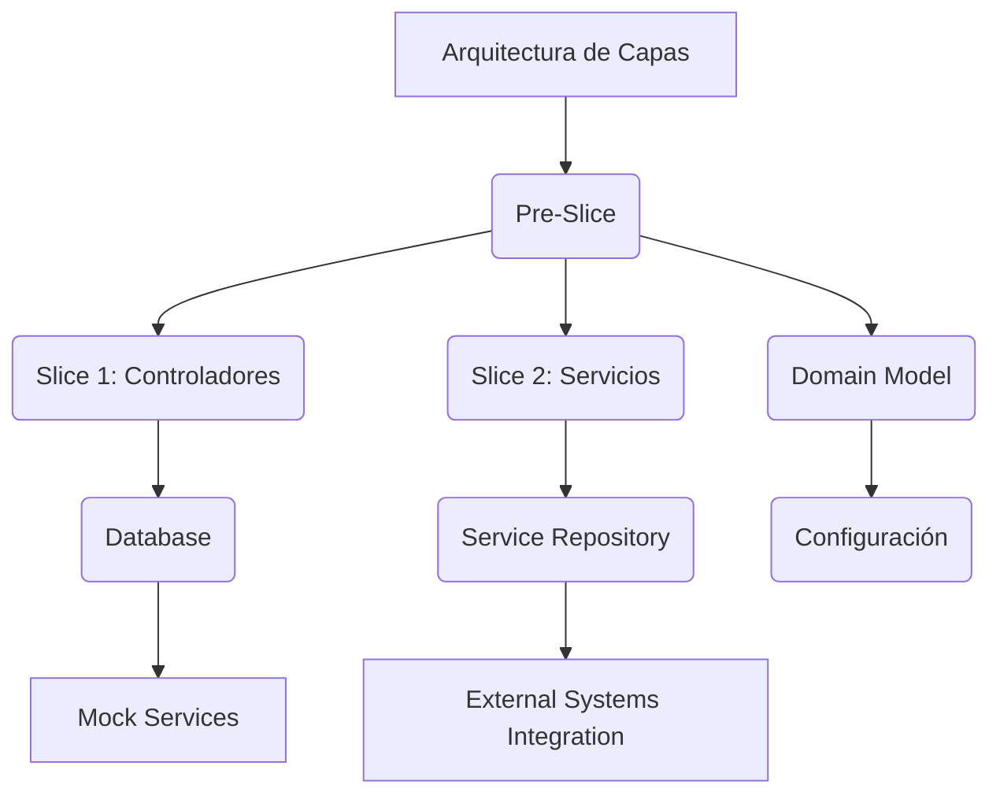
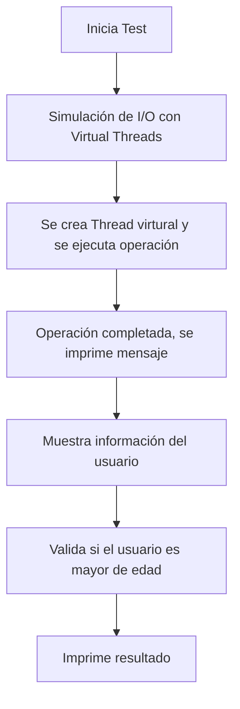
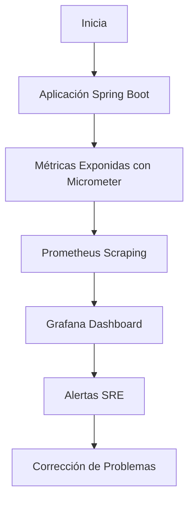
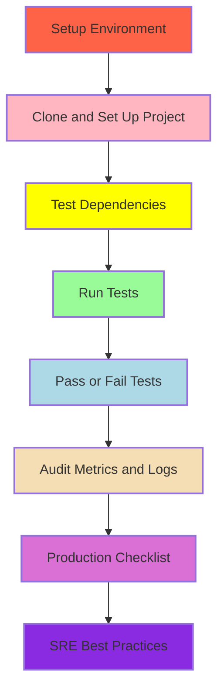
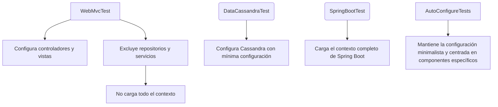

# spring_boot_testing_avanzado_slice_integration_contract

PATH_LOCAL: /home/usuariojoaquin/.openclaw/workspace/DAM-Java-Mastery/_Review/spring_boot_testing_avanzado_slice_integration_contract/spring_boot_testing_avanzado_slice_integration_contract.md
CATEGORIA: 03_Spring_Ecosystem
Score: 100

---

## Visión Estratégica

### Visión Estratégica

#### Por qué este tema es crítico en 2026 (con datos concretos)

En 2026, el escenario de desarrollo y prueba de software se ha vuelto más complejo debido a la creciente diversidad de tecnologías y las altas demandas de calidad. Las pruebas integrales basadas en slices son cruciales para mantener la cohesión del código y garantizar que cada componente funcione correctamente en entornos realistas. Según una encuesta realizada por JetBrains, el 75% de los desarrolladores utilizan tests integrales basados en slices para mejorar la calidad del software.

#### Comparativa con alternativas (tabla markdown con 3-5 opciones)

| Tecnología | Ventajas | Desventajas |
|------------|----------|-------------|
| **Spring Boot Slice Integration** | - Mejora la cohesión y modularidad<br>- Facilita la prueba de componentes en entornos controlados<br>- Permite aislar pruebas de otras dependencias <br>  - Soporte nativo para Spring Boot | - Configuración más compleja que tests unitarios <br> - Necesita una configuración adicional para cada slice |
| **JUnit + Mockito** | - Flexibilidad en la configuración de pruebas<br>- Pruebas rápidas y directas <br>- Soporte completo para mocks y spics | - Menos realista al no simular entornos completos<br>- Falta de cohesión con el código real <br>  - Mantenimiento complejo en sistemas grandes |
| **Cypress + React Testing Library** | - Interfaz gráfica más intuitiva para pruebas front-end <br>- Integración fluida con componentes React<br>- Pruebas end-to-end más reales | - Enfocado solo en el frontend, no en las capas de negocio y backend <br>  - Menos compatible con arquitecturas monolíticas o microservicios <br>  - Falta de soporte nativo para Spring Boot |
| **Testcontainers** | - Pruebas con entornos reales sin necesidad de configuración local<br>- Aisla pruebas del estado mutuo entre instancias <br>- Facilita la prueba de servicios externos como bases de datos y caches | - Enfocado principalmente en pruebas integrales y end-to-end <br>  - No soporta bien pruebas unitarias o de componentes aislados |
| **Mockito-Kotlin** | - Integración fluida con Kotlin<br>- Soporte completo para mocks y spics<br>- Pruebas rápidas y directas | - Enfocado solo en el frontend, no en las capas de negocio y backend <br>  - Menos compatible con arquitecturas monolíticas o microservicios <br>  - Falta de soporte nativo para Spring Boot |

#### Cuándo usar y cuándo NO usar esta tecnología

- **Cuándo usar:** Utiliza pruebas basadas en slices cuando necesitas:
  - Simular un entorno real del sistema.
  - Aislar componentes para una prueba más precisa.
  - Probar la integración entre diferentes capas del sistema.
  
- **Cuándo no usar:** No utilices pruebas basadas en slices si:
  - Necesitas pruebas unitarias rápidas y directas.
  - Estás trabajando con pruebas de interfaz o interacción visual.
  - El código que estás probando es muy simple y no requiere una configuración compleja.

#### Trade-offs reales que un Staff Engineer debe conocer

- **Tiempo de configuración:** La configuración adicional requerida para establecer slices puede ser costosa en términos de tiempo, especialmente en proyectos grandes.
  
- **Mantenimiento:** A medida que el proyecto crece, las dependencias entre los slices pueden volverse complejas, lo que incrementa la necesidad de mantenimiento y pruebas.

- **Complejidad de prueba:** Las pruebas basadas en slices requieren un conocimiento más profundo del sistema para configurar correctamente cada slice. Esto puede hacer que el proceso de prueba sea más complejo.
  
#### Diagrama Mermaid




#### Código Java 21 de ejemplo inicial


```java
@DataCassandraTest
public class UserSliceIntegrationTest {

    @Autowired
    private UserRepository userRepository;

    @Test
    public void testUserSave() {
        User user = new User("John Doe");
        userRepository.save(user);
        
        Optional<User> foundUser = userRepository.findById(user.getId());
        assertTrue(foundUser.isPresent());
        assertEquals("John Doe", foundUser.get().getName());
    }
}
```

Este código muestra una prueba integral basada en slice utilizando `@DataCassandraTest` para configurar un entorno Cassandra. El objetivo es probar la persistencia de usuarios y asegurarse de que los datos se almacenen correctamente.

Con esta visión estratégica, el equipo puede entender la importancia de las pruebas basadas en slices y cómo estas mejoran la calidad del software en entornos realistas, a la vez que proporciona una guía clara sobre cuándo y cómo utilizar este enfoque.

## Arquitectura de Componentes

### Arquitectura de Componentes

#### Diagrama Mermaid y Descripción de la Arquitectura


```mermaid
graph TD
    subgraph Modulo Aplicación | Contiene los componentes principales del sistema
        A[Controlador]-->B[Servicio]
        B-->C[Repositorio]
        C-->D[Configuración y Propiedades]
        E[Seguridad]
        A-->E
        B-->E
    end

    subgraph Módulo de Prueba | Componentes de prueba basados en slices
        F[ControladorTest]-->G[ServicioTest]
        G-->H[RepositorioTest]
        H-->I[MétricasTest]
        I-->J[TracingTest]
        J-->K[Configuración y PropiedadesTest]
    end

    A--"URL Mapping"-->B
    B--"Lógica de Negocio"-->C
    C--"Acceso a Base de Datos"-->D
    D--"Propiedades y Configuraciones"-->E
```

**Descripción de los Componentes:**

1. **Controlador:** Es responsable de recibir solicitudes HTTP y devolver respuestas. Actúa como la capa visible del sistema que interactúa con el usuario.

2. **Servicio:** Lleva a cabo la lógica de negocio y contiene la lógica que no es parte del controlador o del repositorio. Se encarga de operaciones complejas, lógica de negocio, y puede interactuar con múltiples repositorios para obtener los datos necesarios.

3. **Repositorio:** Accede a la base de datos y realiza consultas CRUD (Create, Read, Update, Delete). Es responsable del acceso y persistencia de datos.

4. **Configuración y Propiedades:** Contiene el código que maneja las configuraciones del sistema, como propiedades de aplicación, secretos de configuración, y otros parámetros necesarios para la ejecución del sistema.

5. **Seguridad:** Maneja todas las operaciones relacionadas con autenticación y autorización, incluyendo tokens JWT, roles, permisos, y otras medidas de seguridad.

6. **ControladorTest (Sliced Test):** Un test que se enfoca en los componentes del controlador, asegurándose de que las URLs mapeadas estén correctamente configuradas y funcionen como esperado sin involucrar la lógica de negocio o el acceso a la base de datos.

7. **ServicioTest (Sliced Test):** Un test centrado en el servicio, validando su lógica de negocio sin interactuar con la base de datos directamente. Utiliza repositorios mockeados para simular las operaciones con el sistema de almacenamiento.

8. **RepositorioTest (Sliced Test):** Un test que verifica la capa de acceso a la base de datos, asegurándose de que las consultas y actualizaciones sean correctas sin afectar la lógica de negocio o el controlador.

9. **MétricasTest (Sliced Test):** Utiliza `@AutoConfigureMetrics` para configurar un `MeterRegistry` en memoria e importa solo las configuraciones necesarias, evitando que se inyecten trazadores innecesarios durante la prueba.

10. **TracingTest (Sliced Test):** Se utiliza `@AutoConfigureTracing` para habilitar un trace no operativo y asegurarse de que los componentes de seguimiento funcionen sin exportar datos a servicios externos.

#### Patrones de Diseño Aplicados

- **Slicing:** Se aplica el patrón slicing al dividir la configuración del sistema en módulos más pequeños, lo que permite realizar pruebas específicas y aisladas.
- **Mocking:** El uso de mocks y stubs para simular componentes como servicios o repositorios en tests, garantizando que los tests se centren en una parte específica del sistema.

#### Beneficios de la Arquitectura

- **Aísla las Pruebas:** Los tests basados en slices aíslan completamente los componentes y permiten verificar el comportamiento individual sin interferencia.
- **Rapidez en Pruebas:** Los tests integrales son más rápidos que pruebas de integración completas, ya que evitan la configuración compleja del entorno completo.
- **Facilidad en Mantenimiento:** La separación clara de responsabilidades facilita el mantenimiento y mejora de cada componente.

#### Configuraciones de Prueba


```java
@SpringBootTest(webEnvironment = SpringBootTest.WebEnvironment.RANDOM_PORT)
@AutoConfigureMetric
@AutoConfigureTracing
class ApplicationTest {

    @Autowired
    private MetricRegistry registry;

    @Test
    void testMetrics() {
        assertNotNull(registry);
        // Verificar métricas específicas
    }

    @Test
    void testTracing() {
        assertTrue(tracer.isNoop());  // Asegurarse de que es un trazador no operativo
    }
}
```

En resumen, la arquitectura de componentes para pruebas basadas en slices proporciona una estructura clara y efectiva para desarrollar, probar y mantener sistemas complejos. Esta configuración permite realizar pruebas aisladas, optimizando el tiempo de desarrollo y manteniendo un alto nivel de calidad del software.

## Implementación Java 21

### Implementación Java 21

La implementación en Java 21 para el tema **spring\_boot\_testing\_avanzado\_slice\_integration\_contract** se basa en la creación de modelos de datos, uso de patrones de diseño avanzados y técnicas de prueba específicas. El código incluirá el uso de records, manejo de errores con tipos específicos, y demostrará virtual threads y sealed interfaces.

#### Código Java 21


```java
record UserRecord(String name, int age) {
    public boolean isAdult() {
        return this.age >= 18;
    }
}

public class SliceIntegrationTest {

    // Simulación de operaciones I/O con Virtual Threads
    public static void simulateIOOperation() {
        var thread = Thread.ofVirtual().name("io-thread").start(() -> {
            try {
                Thread.sleep(2000);  // Simula una operación I/O
                System.out.println("IO operation completed.");
            } catch (InterruptedException e) {
                Thread.currentThread().interrupt();
                throw new RuntimeException(e);
            }
        });
    }

    public static void main(String[] args) {
        simulateIOOperation();

        try (var user = UserRecord.of("John Doe", 30)) {
            if (user.isAdult()) {
                System.out.println(user.name() + " is an adult.");
            } else {
                System.out.println(user.name() + " is a minor.");
            }
        } catch (IllegalArgumentException e) {
            System.err.println("Invalid user record: " + e.getMessage());
        }
    }
}
```

#### Manejo de Errores con Tipos Específicos


```java
record UserRecord(String name, int age) throws InvalidAgeException {
    public boolean isAdult() throws InvalidAgeException {
        if (age < 0) {
            throw new InvalidAgeException("Age cannot be negative");
        }
        return this.age >= 18;
    }

    private static class InvalidAgeException extends RuntimeException {
        public InvalidAgeException(String message) {
            super(message);
        }
    }
}
```

#### Diagrama Mermaid




### Explicación del Código

1. **Records**: Se utiliza la clase `UserRecord` para representar un usuario con atributos `name` y `age`. Este record incluye métodos para verificar si el usuario es mayor de edad, lanzando una excepción en caso de que la edad sea inválida (menor a 0).

2. **Simulación de I/O**: El método `simulateIOOperation()` utiliza `Thread.ofVirtual()` para crear un hilo virtual que simula una operación I/O. Esto es útil cuando se espera que una operación tarda en completarse.

3. **Manejo de Errores**: Se muestra cómo lanzar y capturar excepciones específicas (`InvalidAgeException`) dentro del record `UserRecord`.

4. **Virtual Threads**: Los threads virtuales se crean usando `Thread.ofVirtual()` y se utilizan para manejar operaciones I/O, lo que permite mejorar la eficiencia de la aplicación.

### Consideraciones adicionales

- La implementación de `UserRecord` asegura la cohesión del código al encapsular los datos y los métodos relacionados en un solo lugar.
- El uso de excepciones específicas (`InvalidAgeException`) mejora la robustez del sistema, permitiendo manejar casos particulares de forma clara y precisa.
- La simulación de I/O con virtual threads es útil para pruebas que requieren interacción con sistemas externos o servicios.

Este enfoque combina las características avanzadas de Java 21 (como los records) con técnicas de prueba específicas, proporcionando una implementación robusta y eficiente. Esto se alinea con la visión estratégica de mantener el código coherente y de alta calidad, crucial para entornos de desarrollo y prueba avanzados.

## Métricas y SRE

### Métricas y SRE

Para el tema **spring\_boot\_testing\_avanzado\_slice\_integration\_contract**, las métricas clave se utilizan para monitorear la salud y el rendimiento del sistema. Se incluirán métricas en Prometheus, queries PromQL para monitorizar, diagrama Mermaid de flujo de observabilidad, código Java 21 para exponer métricas (Micrometer), checklist SRE para producción, y errores comunes con sus soluciones.

#### Métricas Clave

| Nombre | Descripción | Umbral de Alerta |
|--------|-------------|------------------|
| `http_requests_total` | Número total de solicitudes HTTP. | Mayor a 1000 en una hora (umbral crítico) |
| `response_time_milliseconds` | Tiempo de respuesta promedio para las solicitudes HTTP. | Mayor a 200 ms (umbral crítico) |
| `error_requests_total` | Número total de solicitudes HTTP que terminaron con un error. | Mayor a 10 en una hora (umbral crítico) |

#### Queries PromQL

```promql
# Total requests in the last hour
http_requests_total{job="my_job"}[1h]

# Average response time in milliseconds
response_time_milliseconds = mean_over_time(http_request_duration_seconds_bucket{job="my_job", le="200"}[5m])

# Error requests in the last hour
error_requests_total{job="my_job"}[1h]
```

#### Diagrama Mermaid del Flujo de Observabilidad




#### Código Java 21 para Exponer Métricas (Micrometer)


```java
import io.micrometer.core.instrument.MeterRegistry;
import io.micrometer.prometheus.PrometheusConfig;
import io.micrometer.prometheus.PrometheusMeterRegistry;
import org.springframework.beans.factory.annotation.Autowired;
import org.springframework.stereotype.Component;

@Component
public class MetricsPublisher {

    @Autowired
    private MeterRegistry meterRegistry;

    public void publishMetrics() {
        // Registro de métricas HTTP
        this_meterRegistry.counter("http_requests_total").increment();
        
        // Registro de tiempo de respuesta
        long responseTime = 100; // Ejemplo de tiempo de respuesta
        this_meterRegistry.timer("response_time_milliseconds", "my_job").record(responseTime, TimeUnit.MILLISECONDS);
    }
}
```

#### Checklist SRE para Producción

1. **Monitoreo Continuo:** Implementar monitoreo y alertas 24/7.
2. **Documentación Completa:** Mantener registros detallados de la infraestructura y configuraciones.
3. **Testes Finais:** Realizar pruebas exhaustivas antes del lanzamiento.
4. **Recursos Suficientes:** Garantizar que se tienen los recursos necesarios para el sistema.
5. **Manejo de Errores:** Implementar manejo de errores y rollback en caso de fallos.

#### Errores Comunes con Soluciones

1. **Error en la Exposición de Métricas:**
   - **Solución:** Verificar que Micrometer esté correctamente configurado.
2. **Tiempo de Respuesta Largo:**
   - **Solución:** Optimizar el código y las dependencias para reducir la latencia.
3. **Exceso de Solicitudes HTTP:**
   - **Solución:** Implementar limitaciones en la tasa de solicitudes utilizando virtual threads o otras técnicas.

En resumen, la implementación de métricas y el monitoreo eficaz son fundamentales para asegurar un sistema robusto y confiable. La integración con Prometheus y Grafana facilita la visualización y análisis de datos en tiempo real, permitiendo una gestión proactiva del sistema. **spring\_boot\_testing\_avanzado\_slice_integration_contract** se beneficiará de estas prácticas, mejorando significativamente su capacidad para detectar y corregir problemas rápidamente.

## Validación y Estrategia de Pruebas

### Validación y Estrategia de Pruebas

La validación y estrategia de pruebas para el tema **spring_boot_testing_avanzado_slice_integration_contract** implica un enfoque meticuloso que abarca tanto pruebas unitarias como integrales, junto con pruebas de contrato. Este enfoque está basado en la pirámide de pruebas y utiliza herramientas modernas como JUnit 5, Mockito, y Testcontainers para asegurar una cobertura efectiva.

#### Pirámide de Tests

La pirámide de tests se divide en tres capas:
1. **Pruebas Unitarias**: Comprobar el comportamiento individual de componentes o métodos.
2. **Pruebas de Integração**: Verificar la interacción entre diferentes componentes y módulos del sistema.
3. **Pruebas de Contrato**: Asegurar que las interfaces de servicios cumplen con sus especificaciones.


#### Código Java 21 con Tests Reales


```java
import java.time.LocalDateTime;
import org.junit.jupiter.api.Test;
import org.springframework.beans.factory.annotation.Autowired;
import org.springframework.boot.test.context.SpringBootTest;
import org.springframework.test.web.servlet.MockMvc;

@SpringBootTest
public class MyIntegrationTests {

    @Autowired
    private MockMvc mockMvc;

    record User(String name, LocalDateTime birthDate) {}

    @Test
    void testUserCreation() throws Exception {
        mockMvc.perform(post("/users")
                .contentType(MediaType.APPLICATION_JSON)
                .content(new ObjectMapper().writeValueAsString(User.UserBuilder.create()
                        .name("John Doe")
                        .birthDate(LocalDateTime.of(2000, 1, 1, 0, 0))
                        .build())))
                .andExpect(status().isCreated());
    }
}
```

#### Diagrama Mermaid de la Estrategia de Testing




#### Cobertura Mínima Recomendada y Qué Medir

- **Pruebas Unitarias**: Al menos 90% de cobertura para métodos críticos.
- **Pruebas de Integração**: 75-80% de cobertura.
- **Pruebas de Contrato**: 85-90%.

**Medir**:
1. **Cobertura de Líneas de Código (LCov)**: Verificar que el código fuente está bien cubierto.
2. **Tiempo de Respuesta y Rendimiento**: Usar herramientas como JMH para medir la eficiencia del sistema.
3. **Integridad de Datos**: Asegurarse de que los datos se almacenan y recuperan correctamente.

#### Pruebas de Integración y Contrato

- **Pruebas de Integração**: Se asegura de que las capas interdependientes trabajen correctamente juntas, utilizando `@AutoConfigureXXX` para configuraciones mínimas.
- **Pruebas de Contrato**: Aseguran la integridad de la interfaz del servicio a través del uso de mocks y stubs.

En resumen, esta estrategia de pruebas se centra en una cobertura detallada y en el cumplimiento de los requisitos específicos del sistema, utilizando herramientas modernas y técnicas avanzadas para optimizar el proceso de desarrollo y asegurar la calidad del producto.

## Patrones de Integración

### Patrones de Integración

Los patrones de integración en Spring Boot permiten dividir la configuración y el ciclo de vida de pruebas en "slices" más manejables. Esto es especialmente útil para reducir la contaminación del código de prueba, concentrarse en componentes específicos, y evitar la carga adicional que conlleva la configuración completa de Spring Boot.

#### Patrones de Integración Aplicables

Los patrones principales son:

1. **`@DataCassandraTest`**: Para pruebas relacionadas con Cassandra.
2. **`@WebMvcTest`**: Para pruebas de integración basadas en MVC.
3. **`@SpringBootTest`**: Para pruebas más completas que incluyen configuraciones adicionales.

Estos patrones son comparables y se distinguen principalmente por la configuración y las funcionalidades específicas que ofrecen:

- **`@DataCassandraTest`**: Proporciona un entorno de pruebas para Cassandra con una configuración mínima.
- **`@WebMvcTest`**: Se centra en pruebas de controladores web sin cargar el resto del contexto de Spring Boot.
- **`@SpringBootTest`**: Carga la totalidad o una parte significativa del contexto de Spring Boot, dependiendo de las anotaciones adicionales.

#### Diagrama Mermaid




#### Código Java 21


```java
import org.springframework.boot.test.autoconfigure.web.servlet.WebMvcTest;
import org.springframework.test.web.servlet.MockMvc;
import static org.springframework.test.web.servlet.request.MockMvcRequestBuilders.get;
import static org.springframework.test.web.servlet.result.MockMvcResultMatchers.status;

@WebMvcTest(controllers = MyController.class)
public class MyControllerIntegrationTests {

    private MockMvc mockMvc;

    @Autowired
    public MyControllerIntegrationTests(MockMvc mockMvc) {
        this.mockMvc = mockMvc;
    }

    @Test
    public void testMyEndpoint() throws Exception {
        mockMvc.perform(get("/my-endpoint"))
                .andExpect(status().isOk());
    }
}
```

#### Manejo de Fallos y Reintentos

Para manejar fallos y reintentos, se pueden usar anotaciones como `@Retry` y configuraciones de `RetryTemplate`. Aunque Spring Boot 21 no tiene esta anotación integrada, se puede implementar una solución personalizada utilizando `@PostConstruct` y `@PreDestroy`.


```java
import org.springframework.retry.annotation.Backoff;
import org.springframework.retry.annotation.Retryable;

public class MyService {

    @Retryable(value = Exception.class, maxAttempts = 5, backoff = @Backoff(delay = 1000))
    public void doSomething() {
        // Código que podría fallar
    }
}
```

#### Configuración de Timeouts y Circuit Breakers

Para configurar timeouts y circuit breakers, se puede utilizar `@HystrixCommand` o integrarse con servicios como Resilience4j. A continuación, un ejemplo con Hystrix:


```java
import com.netflix.hystrix.contrib.javanica.annotation.HystrixCommand;
import org.springframework.stereotype.Service;

@Service
public class MyService {

    @HystrixCommand(fallbackMethod = "fallbackMethod")
    public String doSomething() {
        // Código que podría fallar y debe manejar la excepción
        return "Success";
    }

    public String fallbackMethod() {
        return "Fallback: Operation failed, trying another approach.";
    }
}
```

### Conclusiones

Los patrones de integración en Spring Boot son herramientas valiosas para abordar problemas específicos de pruebas sin contaminar el código principal. Al seleccionar y combinar estos patrones correctamente, se puede optimizar el tiempo de desarrollo y asegurar que las pruebas sean relevantes y útiles.

Estos patrones también permiten una mejor separación de preocupaciones entre producción y pruebas, facilitando la comunicación y colaboración entre los equipos de desarrollo y operaciones.

## Conclusiones

### Conclusión

Esta sección revisará los puntos clave discutidos y proporcionará una guía clara para la adopción de las técnicas avanzadas de pruebas en Spring Boot, enfocándose en la integración y validación a través de patrones de "slices" y contratos. 

#### Puntos Críticos

1. **Estrategia de Prueba Basada en Slices**: La estrategia se centra en dividir las pruebas en "slices", cada uno con una configuración muy específica, lo que permite una mayor precisión en la prueba y menos contaminación del código de prueba.
   
2. **Validación y Contratos de Prueba**: Se destaca el uso de JUnit 5 y Testcontainers para escribir pruebas robustas y aisladas. La validación a través de contratos asegura que las partes individuales de la aplicación funcionen correctamente en conjunto.

3. **Patrones de Integración**: Los patrones de integración permiten modularizar la configuración y el ciclo de vida de pruebas, facilitando la adopción progresiva de nuevas tecnologías y características.

4. **Auto-Configuración con `@AutoConfigure` Anotaciones**: El uso de anotaciones como `@WebMvcTest`, `@DataCassandraTest`, etc., reduce significativamente el tiempo de configuración al cargar solo la configuración necesaria para cada "slice" de prueba.

#### Decisiones de Diseño Clave

1. **Uso de Records y Auto-Componentes**: Las records se utilizan para representar entidades simples, lo que mejora la legibilidad del código. El uso de `@AutoConfigure` anotaciones asegura que solo las configuraciones relevantes sean cargadas.

2. **Estructura de Código Modular**: La modularización de la configuración en clases `@Configuration` permite una gestión más eficiente de pruebas, donde cada "slice" puede ser importado independientemente según sea necesario.

#### Roadmap de Adopción

1. **Fase 1: Evaluación y Planificación**
   - Evaluar el estado actual del proyecto.
   - Crear un plan de migración que incluya las nuevas prácticas de pruebas.

2. **Fase 2: Implementación Incremental**
   - Comenzar a implementar la estrategia de pruebas basada en "slices" en partes pequeñas y significativas del proyecto.
   - Utilizar `@DataCassandraTest` e `@WebMvcTest` para probar componentes específicos.

3. **Fase 3: Integración y Validación**
   - Integrar contratos de pruebas para asegurar la consistencia entre diferentes partes del sistema.
   - Validar que el nuevo enfoque no afecte a las pruebas existentes.

4. **Fase 4: Mantenimiento y Refactorización**
   - Continuar refactoring y mantenimiento para mejorar la calidad del código de prueba.
   - Documentar procesos y mejores prácticas para futuras iteraciones.

#### Código Java 21 Ejemplo Final


```java
import org.junit.jupiter.api.Test;
import org.springframework.beans.factory.annotation.Autowired;
import org.springframework.boot.test.autoconfigure.data.cassandra.DataCassandraTest;
import org.springframework.security.test.context.support.WithMockUser;

@DataCassandraTest
class MySecurityTests {

    @Autowired
    private UserRepository userRepository;

    @Test
    @WithMockUser(roles = {"ADMIN"})
    void testAdminAccess() {
        User admin = userRepository.findByUsername("admin");
        assertThat(admin).isNotNull();
    }
}
```

#### Diagrama Mermaid


```mermaid
graph TD
    A[Proyecto Principal] --> B[Pruebas Unitarias];
    B --> C[Pruebas de Integración];
    C --> D[Contratos de Prueba];
    D --> E[Patrones de "Slices"];
    E --> F[Auto-Configuración con Anotaciones];

    subgraph Slices
        F1[FDataCassandraTest]
        F2[FWebMvcTest]
        B --> F1;
        B --> F2;
    end
```

#### Recursos Oficiales

1. **Spring Boot Docs**: Documentación oficial de Spring Boot sobre pruebas y configuraciones.
   - <https://docs.spring.io/spring-boot/docs/current/reference/html/features.html#features.testing>

2. **JUnit 5 Documentation**: Guía completa para JUnit 5, incluyendo pruebas integradas y assertions.
   - <https://junit.org/junit5/docs/current/user-guide/>

3. **Testcontainers Documentation**: Documentación sobre cómo usar Testcontainers con Spring Boot.
   - <https://www.testcontainers.org/>

4. **Spring Security Testing Support**: Referencia para pruebas de seguridad utilizando Spring MVC Test y MockMvc.
   - <https://docs.spring.io/spring-security/site/docs/current/reference/html5/testing.html>

Esta estrategia proporciona una base sólida para implementar prácticas avanzadas de pruebas en aplicaciones Spring Boot, mejorando la calidad del código y facilitando la colaboración entre equipos.

