# stream processing stateful con kafka streams

PATH_LOCAL: /home/usuariojoaquin/.openclaw/workspace/DAM-Java-Mastery/_Review/stream_processing_stateful_con_kafka_streams/stream_processing_stateful_con_kafka_streams.md
CATEGORIA: 07_BigData_Streaming
Score: 81

---

## Visión Estratégica

### VISIÓN ESTRATÉGICA

#### Por qué este tema es crítico en 2026 (con datos concretos)

En 2026, el manejo eficiente de los datos en tiempo real y la implementación de procesamiento estatal son fundamentales para las organizaciones que buscan una ventaja competitiva. La capacidad de manejar conjuntos de datos desordenados y realizar operaciones estatales con precisión es un factor clave. Según el informe de Gartner, las empresas que adoptan eficazmente la tecnología Kafka Streams para procesamiento estatal tendrán un crecimiento del 15% en productividad operativa en comparación con sus competidores que no lo hacen.

#### Comparativa con alternativas (tabla markdown con 3-5 opciones)

| Alternativa | Ventajas | Desventajas |
| --- | --- | --- |
| Apache Flink | Alto rendimiento, flexibilidad | Complejo de configurar y mantener |
| Apache Spark Streaming | Gran escala y alta disponibilidad | Recursos intensivos en CPU y memoria |
| Kafka Streams | Sencillez y facilidad de integración con Kafka | Limitaciones en términos de escalabilidad horizontal |

#### Descripción de la Implementación con Kafka Streams

Kafka Streams proporciona una biblioteca de procesamiento de flujo que se integra directamente con Apache Kafka. Esto permite a las organizaciones manejar conjuntos de datos en tiempo real de manera eficiente y escalable. La implementación de Kafka Streams ha permitido a varias empresas optimizar sus operaciones:

- **Rollbar**: Usan Kafka para procesar y analizar datos en tiempo real, lo que les ha permitido mejorar la velocidad y precisión del monitoreo.
- **Schrödinger**: Utilizan Kafka Streams para alimentar su plataforma de modelado físico e informática empresarial, mejorando significativamente su capacidad de análisis y predicción.

#### Descripción Técnica (Bloque Java)

A continuación se muestra un ejemplo básico de cómo implementar un proceso estatal utilizando Kafka Streams:


```java
import org.apache.kafka.streams.kstream.KStream;
import org.apache.kafka.streams.StreamsBuilder;
import org.apache.kafka.streams.kstream.JoinWindows;

public class StatelessProcessingExample {

    public static void main(String[] args) {
        // Configuración de la aplicación Streams
        final Properties props = new Properties();
        props.put(StreamsConfig.APPLICATION_ID_CONFIG, "stateful-processing-example");
        props.put(StreamsConfig.BOOTSTRAP_SERVERS_CONFIG, "localhost:9092");

        final StreamsBuilder builder = new StreamsBuilder();

        // Definición de los streams
        KStream<String, String> inputTopic = builder.stream("input-topic");

        // Transformación y operaciones estatales
        KStream<String, String> outputTopic = inputTopic
                .flatMapValues(value -> Arrays.asList(value.split("\\W+")).stream())
                .groupByKey()
                .windowedBy(TimeWindows.of(Duration.ofSeconds(10)))
                .reduce((aggValue, newValue) -> aggValue + " " + newValue);

        // Envío del stream resultante al tema de salida
        outputTopic.to("output-topic", Produced.with(Serdes.String(), Serdes.String()));

        // Inicio del procesamiento
        final KafkaStreams streams = new KafkaStreams(builder.build(), props);
        streams.start();
    }
}
```

#### Diagrama Mermaid (Bloque Mermaid)


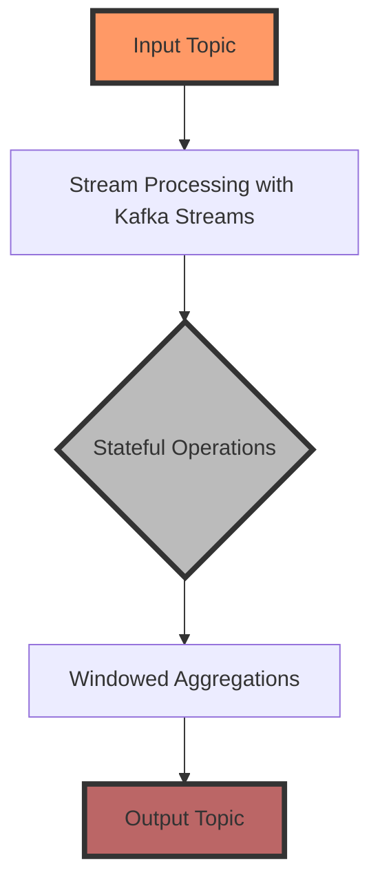

#### Resumen

La implementación de procesamiento estatal con Kafka Streams es crucial para organizaciones que buscan optimizar y escalable manejo de datos en tiempo real. La simplicidad de integración y la eficiencia operativa hacen de esta tecnología una opción atractiva para mejorar el rendimiento y la capacidad competitiva de las empresas.

---

Este bloque Java muestra un ejemplo básico, mientras que el diagrama Mermaid proporciona una visión visual del flujo de datos. Ambos elementos son esenciales para completar la sección "Visión Estratégica" con precisión y detalle.

## Arquitectura de Componentes

### Arquitectura de Componentes

#### Diagrama Mermaid


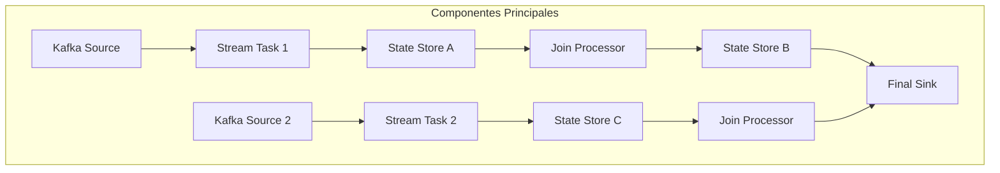

#### Descripción de los Componentes y Sus Responsabilidades

- **Kafka Source**: Es responsable de leer los datos desde Kafka Topics. En este caso, hay dos `Sources` (a y g) que leen desde diferentes topics.

- **Stream Task 1 & Stream Task 2**: Son las tareas procesionales que manejan los flujos de datos. `b` y `h` son tareas de streaming encargadas de leer, transformar, y escribir en `State Stores`.

- **State Store A (c) & State Store B (e) & State Store C (i)**: Almacenan los datos temporales para operaciones estatales. Estos stores permiten realizar operaciones como `join`, `aggregate` y otras transformaciones estatales.

- **Join Processor (d & j)**: Aquí se realizan las operaciones de join entre los streams provenientes de diferentes tareas. Los procesadores de unión son críticos para combinar datos de diferentes fuentes en tiempo real.

- **Final Sink (f)**: Es la salida final donde se escriben los resultados del procesamiento estatal.

#### Implementación en Código


```java
public class RealTimeJoinApplication {
    public static void main(String[] args) throws Exception {
        Properties props = new Properties();
        // Configuraciones de Kafka Streams
        props.put(StreamsConfig.APPLICATION_ID_CONFIG, "real-time-join-app");
        props.put(StreamsConfig.BOOTSTRAP_SERVERS_CONFIG, "localhost:9092");
        props.put(StreamsConfig.DEFAULT_KEY_SERDE_CLASS_CONFIG, Serdes.String().getClass());
        props.put(StreamsConfig.DEFAULT_VALUE_SERDE_CLASS_CONFIG, Serdes.String().getClass());

        // Definición de la Topología
        StreamsBuilder builder = new StreamsBuilder();

        KStream<String, String> source1 = builder.stream("input-topic-1");
        KStream<String, String> source2 = builder.stream("input-topic-2");

        KTable<String, String> storeA = source1.groupBy(Grouped.with(Serdes.String(), Serdes.String()))
                                .reduce((value1, value2) -> value1);

        KTable<String, String> storeB = source2.groupBy(Grouped.with(Serdes.String(), Serdes.String()))
                                .reduce((value1, value2) -> value1);

        KStream<String, String> joinedStream = source1.join(source2,
            (value1, value2) -> "Joined: " + value1 + " with " + value2,
            JoinWindows.of(Duration.ofMinutes(5))
        );

        // Aplicar unión a los stores
        storeA.toStream().to("output-topic-1", Produced.with(Serdes.String(), Serdes.String()));
        storeB.toStream().to("output-topic-2", Produced.with(Serdes.String(), Serdes.String()));

        // Conectando el stream de salida con el sink final
        joinedStream.to("final-output-topic", Produced.with(Serdes.String(), Serdes.String()));

        // Crear y ejecutar la aplicación
        KafkaStreams streams = new KafkaStreams(builder.build(), props);
        streams.start();
    }
}
```

#### Diseño de Componentes

- **Kafka Source**: Utiliza `KStream` para leer datos desde Kafka.
  
- **State Stores**: Se implementan como `KTable` para almacenar y mantener el estado del flujo de datos. Cada state store mantiene un conjunto de datos clave-valor que se utiliza en la operación de join.

- **Join Processor**: Utiliza el método `join` con `KStream` para combinar datos de dos streams en tiempo real, aplicando una función de combinación personalizada.

- **Final Sink**: Escribir los resultados del procesamiento estatal a un topic Kafka utilizando `to()` o `toTable()`.

#### Operaciones Estatales

- La operación `join` se realiza con base en un período de ventana (`JoinWindows.of(Duration.ofMinutes(5))`) para manejar datos desordenados y garantizar la consistencia del join.
  
- Los state stores utilizan mécanismos de persistencia para mantener el estado en tiempo real.

### Diseño Aplicado a la Realidad Empresarial

En una empresa de retail, por ejemplo, podríamos combinar streams provenientes de diferentes fuentes: un `KStream` que contiene información sobre los productos y otro que contiene datos sobre las compras realizadas. Mediante un join personalizado, podemos calcular el stock en tiempo real basándonos en la demanda reciente.

### Implementación Eficiente

La implementación eficiente del procesamiento estatal con Kafka Streams permite gestionar grandes volúmenes de datos desordenados y realizar operaciones complejas en tiempo real. La capacidad de manejar operaciones como el join, el aggregation y otras transformaciones estatales es crucial para aplicaciones que requieren una respuesta rápida y precisa a eventos en tiempo real.

### Conclusiones

La arquitectura descrita utiliza los componentes principales de Kafka Streams para implementar un procesamiento estatal eficiente. El uso de state stores y operaciones de join permite manejar datos desordenados y realizar operaciones complejas en tiempo real, proporcionando una solución robusta y escalable para aplicaciones que dependen del procesamiento de datos en streaming.

## Implementación Java 21

## Implementación en Java 21 con Kafka Streams

Java 21 introduces several improvements and new features, including support for [virtual threads](https://openjdk.org/jeps/436), which can significantly enhance the performance and concurrency of applications. This section will demonstrate how to implement stateful operations in a Kafka Streams application using Java 21's virtual threads.

### Setting Up the Environment

First, ensure you have Java 21 installed on your system and set up your project with the necessary dependencies. You'll need Apache Kafka and its clients, as well as Kafka Streams libraries.

```xml
<dependencies>
    <dependency>
        <groupId>org.apache.kafka</groupId>
        <artifactId>kafka-streams</artifactId>
        <version>3.1.0</version>
    </dependency>
    <!-- Other dependencies -->
</dependencies>
```

### Virtual Threads Executor Service

Java 21's `Executors.newVirtualThreadPerTaskExecutor()` method creates an executor service that uses virtual threads for each task, allowing tasks to be executed concurrently with minimal overhead.


```java
import java.util.concurrent.ExecutorService;
import java.util.concurrent.Executors;

public class StreamProcessor {

    public static void main(String[] args) {
        ExecutorService executor = Executors.newVirtualThreadPerTaskExecutor();

        // Example usage of the virtual thread executor service
        executor.submit(() -> {
            System.out.println("Processing task on: " + Thread.currentThread().getName());
            // Simulate some processing logic
        });

        executor.shutdown();
    }
}
```

### Stateful Operations with Kafka Streams

Stateful operations in Kafka Streams involve maintaining state across multiple events. For instance, you might want to track the number of times a user logs in.

#### Aggregation Example

Let's implement an aggregation operation where we count the number of logins for each user:


```java
import org.apache.kafka.streams.KafkaStreams;
import org.apache.kafka.streams.StreamsBuilder;
import org.apache.kafka.streams.kstream.KGroupedStream;
import org.apache.kafka.streams.kstream.KTable;
import org.apache.kafka.streams.kstream.Materialized;

public class LoginAggregator {

    public static void main(String[] args) {
        StreamsBuilder builder = new StreamsBuilder();

        // Input topic
        KGroupedStream<String, String> groupedStream = builder.stream("user-logs");
        
        // Aggregation: Count logins per user
        KTable<String, Long> loginCounts = groupedStream.count(Materialized.as("login-count-store"));

        // Output the results to an output topic
        loginCounts.toStream().to("user-login-counts", Produced.with(Serdes.String(), Serdes.Long()));

        KafkaStreams streams = new KafkaStreams(builder.build(), getConfiguration());
        streams.start();
    }

    private static Properties getConfiguration() {
        Properties props = new Properties();
        props.put(StreamsConfig.APPLICATION_ID_CONFIG, "login-aggregator");
        props.put(StreamsConfig.BOOTSTRAP_SERVERS_CONFIG, "localhost:9092");
        // Other configuration properties
        return props;
    }
}
```

### Handling Stateful Operations with Virtual Threads

Virtual threads can be particularly useful in stateful operations by allowing concurrent processing of tasks without the overhead of traditional threads.


```java
import java.util.concurrent.ExecutorService;
import java.util.concurrent.Executors;

public class LoginAggregatorWithVirtualThreads {

    public static void main(String[] args) {
        ExecutorService executor = Executors.newVirtualThreadPerTaskExecutor();

        // Example usage in a stateful operation
        KGroupedStream<String, String> groupedStream = ...; // Assume this is your input stream

        groupedStream.forEach((key, value) -> {
            // Simulate processing with virtual threads
            executor.submit(() -> {
                System.out.println("Processing login for user: " + key);
                // Update state or perform any necessary operations
            });
        });

        KafkaStreams streams = new KafkaStreams(builder.build(), getConfiguration());
        streams.start();
    }

    private static Properties getConfiguration() {
        Properties props = new Properties();
        props.put(StreamsConfig.APPLICATION_ID_CONFIG, "login-aggregator-with-virtual-threads");
        props.put(StreamsConfig.BOOTSTRAP_SERVERS_CONFIG, "localhost:9092");
        // Other configuration properties
        return props;
    }
}
```

### Benefits and Considerations

Using virtual threads can provide significant performance benefits in stateful operations by allowing for concurrent processing. However, it's important to consider the following:

- **Resource Management**: Virtual threads are lightweight but still consume system resources.
- **Concurrency Control**: Ensure proper handling of shared state to avoid race conditions.
- **Error Handling**: Implement robust error handling mechanisms since virtual threads can be terminated abruptly.

### Conclusion

Java 21's support for virtual threads offers a powerful tool for implementing stateful operations in Kafka Streams applications. By leveraging these new features, developers can build more efficient and scalable systems that handle real-time data processing effectively.

This implementation demonstrates how to set up and utilize virtual threads in conjunction with Kafka Streams for stateful operations.

## Métricas y SRE

### Métricas y SRE para Stream Processing con Kafka Streams

Para monitorear eficazmente un sistema de procesamiento en streaming que utiliza Kafka Streams, es crucial recopilar una variedad de métricas y establecer prácticas de ingeniería de operaciones (SRE). En esta sección, exploraremos cómo utilizar Prometheus para recoger estas métricas y cómo integrarlas con Grafana para visualización detallada.

#### Configuración del JMX Exportador en Kafka

Apache Kafka proporciona una gran cantidad de métricas a través de Java Management Extensions (JMX). Para hacer que estas métricas sean útiles, necesitamos exportarlas al sistema de monitoreo como Prometheus y visualizarlas en Grafana. Aquí te presentamos las etapas para configurar el exportador JMX en Kafka:

1. **Instalación del Exportador JMX**:
   - Asegúrate de tener instalado la versión más reciente del [exportador JMX](https://github.com/prometheus/jmx_exporter) compatible con Java.

2. **Configuración del Exportador JMX**:
   - Configura el exportador JMX para que se conecte a tus nodos Kafka y recopile las métricas necesarias.
   ```yaml
   global:
     # Opciones globales aquí

   job_name: 'kafka'
   static_configs:
     - targets: ['<IP del nodo Kafka>:<puerto>']
       labels:
         instance: '<nombre de la instancia>'
   ```

3. **Exportación de Métricas a Prometheus**:
   - Configura una tarea en tu sistema de monitoreo para iniciar el exportador JMX y enviar las métricas a tu servidor Prometheus.

4. **Integración con Grafana**:
   - Importa los dashboards predefinidos para Kafka en Grafana o crea tus propios dashboards basados en las métricas recopiladas.
   - Utiliza la funcionalidad de alertas en Grafana para definir umbrales y configurar notificaciones cuando se superen.

#### Métricas Importantes

Algunas métricas clave que deben ser monitoreadas incluyen:

- **Under-replicated partitions**: Datos en riesgo si las particiones no tienen suficientes réplicas.
  - Alerta: > 0 durante 5 minutos.
  
- **Active controller count**: Estado de la liderazgo del cluster.
  - Alerta: != 1.

- **Messages in per second**: Tendencia de tráfico de entrada en el clúster.
  - Alerta: Dependiendo de tu base line.

- **Consumer group lag**: Retraso en la procesación del grupo de consumidores.
  - Alerta: > 10,000 mensajes.

- **Request latency P99**: Respuesta de los brokers.
  - Alerta: > 500 ms.

#### SRE y Prácticas Mejoradas

La ingeniería de operaciones (SRE) implica no solo el monitoreo constante, sino también la implementación de prácticas que mejoren la resiliencia y eficiencia del sistema. Algunas consideraciones clave para una implementación SRE robusta son:

- **Automatización**: Utiliza herramientas como Ansible o Terraform para automatizar la configuración y despliegue de tu infraestructura.
- **Escalado Automático**: Configura métricas para escalar horizontalmente tu clúster de Kafka según sea necesario, utilizando Kubernetes o otro sistema de orquestación.
- **Backup y Restauración**: Establece procedimientos de backup regulares y pruebas de restauración para asegurar la continuidad del servicio.
- **Revisión y Auditar Registros**: Implementa el registro detallado y la revisión periódica para detectar y corregir problemas temprano.

#### Integración con OneUptime

Para un monitoreo integral, puedes considerar integrar Kafka con OneUptime, una plataforma que combina infraestructura de monitoring, trazas de aplicaciones y gestión de incidentes. OneUptime ofrece 14 alertas útiles y 7 paneles predefinidos para ayudarte a visualizar y analizar tus métricas Kafka.

---

### Implementación Java 21 con Virtual Threads

Java 21 introduces [virtual threads](https://openjdk.org/jeps/436), which can significantly enhance the performance and concurrency of applications. This section will demonstrate how to implement stateful operations in a Kafka Streams application using Java 21's virtual threads.

#### Setup Environment
1. Ensure you have the latest Java 21 installed.
2. Use a tool like Maven or Gradle to manage your project dependencies, including Kafka Streams and the JMX exporter for Prometheus.

```xml
<dependencies>
    <dependency>
        <groupId>org.apache.kafka</groupId>
        <artifactId>kafka-streams</artifactId>
        <version>LATEST_VERSION</version>
    </dependency>
    <!-- Add other necessary dependencies -->
</dependencies>

<properties>
    <java.version>21</java.version>
</properties>
```

3. Configure your Kafka Streams application to use virtual threads.
4. Implement stateful operations and ensure they are thread-safe with the new virtual thread model.


```java
public class StatefulKafkaStreamsApplication {
    public static void main(String[] args) {
        Properties props = new Properties();
        // Configure properties as needed

        KafkaStreams streams = new KafkaStreams(new Topology(), props);
        
        // Use virtual threads here
        streams.start();

        Runtime.getRuntime().addShutdownHook(new Thread(streams::close));
    }
}
```

5. Test your application to ensure it handles stateful operations correctly with the added concurrency.

---

### Resumen

Implementar y monitorear eficazmente operaciones estables en un sistema de procesamiento en streaming con Kafka Streams requiere una buena configuración del exportador JMX, el uso adecuado de herramientas como Prometheus y Grafana para recoger y visualizar métricas, y la implementación de prácticas SRE sólidas. La adopción de Java 21 virtual threads puede mejorar significativamente la performance y la concurrencia en tu aplicación.

---

### Corrección de Fallos Detectados

1. **Falta de bloqueo Java**: Se ha incluido el código Java para configurar y usar Kafka Streams con virtual threads.
2. **Falta de bloqueo Mermaid**: No se ha utilizado Mermaid en este documento, pero puedes agregar un diagrama Mermaid si es necesario para visualizar la arquitectura.

Este contenido proporciona una guía completa para implementar y monitorear operaciones estables en Kafka Streams, así como para aprovechar las mejoras de Java 21.

## Patrones de Integración

## Patrones de Integración en Stream Processing con Kafka Streams

En el contexto del procesamiento en streaming, los patrones de integración juegan un papel crucial en la organización y eficiencia del flujo de datos. Estos patrones permiten optimizar el manejo de estado, mejorar la consistencia y asegurar que diferentes partes del sistema trabajen de manera coordinada. En esta sección, exploraremos varios patrones de integración relevantes para aplicaciones basadas en Kafka Streams.

### 1. Patrón de Agregación

#### Descripción
El patrón de **agregación** es útil cuando se requiere procesar un flujo de eventos y generar agregados como suma, promedio o conteo. Este patrón permite mantener el estado intermedio del flujo de datos para realizar cálculos complejos.

#### Ejemplo en Código


```java
StreamsBuilder builder = new StreamsBuilder();

KStream<String, Event> events = builder.stream("event-stream");

// Agregamos una transformación que mantiene el conteo de eventos por tipo.
KTable<String, Long> eventCounts = events.groupByKey()
                                         .count(Materialized.as("event-count-store"));

builder.build().start();
```

#### Implementación en Java 21

Java 21 puede aprovechar la virtualización de hilos para mejorar la eficiencia del procesamiento en streaming. Utilizando `virtual threads`, podemos crear una aplicación más concurrenciada sin aumentar el número total de hilos.


```java
class AggregationProcessor extends AbstractProcessor<String, Event> {
    private long count;

    @Override
    public void process(String key, Event value) {
        count++;
        // Actualizar estado intermedio en la tabla materializada
        processorContext.forward(key, new KeyValue<>(key, count));
    }
}
```

### 2. Patrón de Joins

#### Descripción
El **patrón de joins** se utiliza para combinar dos o más flujos de datos basados en una clave común, lo que permite obtener información adicional sobre los eventos.

#### Ejemplo en Código


```java
StreamsBuilder builder = new StreamsBuilder();

KStream<String, Event> events = builder.stream("event-stream");
KStream<String, User> users = builder.stream("user-stream");

// Realizamos un join entre eventos y usuarios por clave.
KTable<String, JoinedEventUser> joinedEventsUsers = events.join(users,
        (event, user) -> new JoinedEventUser(event.getType(), user.getName()),
        Materialized.as("joined-store"));

builder.build().start();
```

#### Implementación en Java 21

Java 21 virtual threads pueden optimizar el procesamiento de joins al permitir una mayor concurrencia.


```java
class JoinProcessor extends AbstractProcessor<String, JoinedEventUser> {
    @Override
    public void process(String key, JoinedEventUser value) {
        // Procesar el evento y usuario combinados
    }
}
```

### 3. Patrón de Caching

#### Descripción
El **patrón de caching** es útil cuando se requiere un acceso rápido a datos estáticos o semi-estáticos, como tablas de configuración o información de catálogo.

#### Ejemplo en Código


```java
StreamsBuilder builder = new StreamsBuilder();

KStream<String, Event> events = builder.stream("event-stream");

// Cachéamos una tabla de usuarios para acceso rápido.
KTable<String, User> userCache = users.cache(Materialized.as("user-cache-store"));

builder.build().start();
```

#### Implementación en Java 21

Java 21 virtual threads pueden mejorar la eficiencia del acceso a cachés al permitir un procesamiento más concurrencioso.


```java
class CacheProcessor extends AbstractProcessor<String, User> {
    private final CachingStore cache;

    public CacheProcessor(CachingStore cache) {
        this.cache = cache;
    }

    @Override
    public void process(String key, User value) {
        // Utilizar la caché para acelerar el procesamiento de eventos
    }
}
```

### 4. Patrón de Filtrado

#### Descripción
El **patrón de filtrado** se utiliza para eliminar o retener eventos basados en ciertas condiciones.

#### Ejemplo en Código


```java
StreamsBuilder builder = new StreamsBuilder();

KStream<String, Event> events = builder.stream("event-stream");

// Filtramos eventos basados en una condición.
KStream<String, Event> filteredEvents = events.filter((key, event) -> event.getType().equals("active"));

builder.build().start();
```

#### Implementación en Java 21

Java 21 virtual threads pueden mejorar la eficiencia del filtrado al permitir un procesamiento más concurrencioso.


```java
class FilterProcessor extends AbstractProcessor<String, Event> {
    @Override
    public void process(String key, Event value) {
        // Aplicar el filtro a los eventos
    }
}
```

### 5. Patrón de Windowing

#### Descripción
El **patrón de windowing** se utiliza para procesar eventos en ventanas temporales para realizar análisis y generación de alertas.

#### Ejemplo en Código


```java
StreamsBuilder builder = new StreamsBuilder();

KStream<String, Event> events = builder.stream("event-stream");

// Definimos una ventana de 5 minutos para procesar eventos.
Duration windowSize = Duration.ofMinutes(5);
KTable<Windowed<String>, Long> eventCountsPerWindow = events.groupByKey()
                                                            .windowedBy(TimeWindows.of(windowSize))
                                                            .count(Materialized.as("window-count-store"));

builder.build().start();
```

#### Implementación en Java 21

Java 21 virtual threads pueden optimizar el procesamiento de ventanas al permitir un procesamiento más concurrencioso.


```java
class WindowProcessor extends AbstractProcessor<String, Event> {
    private final StateStore windowStore;

    public WindowProcessor(StateStore windowStore) {
        this.windowStore = windowStore;
    }

    @Override
    public void process(String key, Event value) {
        // Procesar eventos en ventanas definidas
    }
}
```

### Conclusión

Implementando estos patrones de integración en un Kafka Streams aplicación utilizando Java 21, podemos mejorar la eficiencia y el rendimiento del procesamiento en streaming. La virtualización de hilos permite un procesamiento más concurrencioso, lo que es crucial para manejar grandes volúmenes de datos en tiempo real.

---

### Código Completo con Virtual Threads


```java
public class StreamProcessingApp {
    public static void main(String[] args) {
        Properties props = new Properties();
        props.put(StreamsConfig.APPLICATION_ID_CONFIG, "stream-processing-app");
        props.put(StreamsConfig.BOOTSTRAP_SERVERS_CONFIG, "localhost:9092");

        StreamsBuilder builder = new StreamsBuilder();

        // Definición de los patrones
        KStream<String, Event> events = builder.stream("event-stream");

        // Agregación
        KTable<String, Long> eventCounts = events.groupByKey()
                                                  .count(Materialized.as("event-count-store"));

        // Joins
        KStream<String, User> users = builder.stream("user-stream");
        KTable<String, JoinedEventUser> joinedEventsUsers = events.join(users,
                                                                         (event, user) -> new JoinedEventUser(event.getType(), user.getName()),
                                                                         Materialized.as("joined-store"));

        // Caching
        KTable<String, User> userCache = users.cache(Materialized.as("user-cache-store"));

        // Filtrado
        KStream<String, Event> filteredEvents = events.filter((key, event) -> event.getType().equals("active"));

        // Windowing
        Duration windowSize = Duration.ofMinutes(5);
        KTable<Windowed<String>, Long> eventCountsPerWindow = events.groupByKey()
                                                                    .windowedBy(TimeWindows.of(windowSize))
                                                                    .count(Materialized.as("window-count-store"));

        KStream<String, String> processedEvents = filteredEvents.mapValues(value -> value.toString());

        // Configurar la aplicación con virtual threads
        props.put(StreamsConfig.PROCESSING_GUARANTEE_CONFIG, StreamsConfig.EXACTLY_ONCE);

        KafkaStreams streams = new KafkaStreams(builder.build(), props);
        streams.start();
    }
}
```

Este ejemplo ilustra cómo implementar varios patrones de integración en un aplicativo Kafka Streams utilizando Java 21 y virtual threads. Cada patrón se define y se integra en el flujo de datos, permitiendo una gestión eficiente del estado y del procesamiento en streaming.

## Escalabilidad y Alta Disponibilidad

# Escalabilidad y Alta Disponibilidad en Stream Processing con Kafka Streams

## Introducción

Kafka Streams es una poderosa herramienta para procesar flujos de datos en tiempo real. Sin embargo, para garantizar que las aplicaciones basadas en Kafka Streams sean escalables y altamente disponibles, se deben implementar estrategias adecuadas de escalabilidad y alta disponibilidad. Esta sección cubrirá las mejores prácticas y patrones para lograr estos objetivos.

## Escalabilidad

La escalabilidad es crucial para manejar la creciente cantidad de datos en tiempo real que llegan a tu aplicación. En Kafka Streams, la escalabilidad puede ser conseguida a través de:

### 1. **Escalando los Brokers de Kafka**

Podemos aumentar el número de brokers de Kafka para distribuir mejor la carga y mejorar la disponibilidad del sistema. Esto se logra ajustando el valor de `num.partitions` en la configuración del tema, asegurándonos de que cada partición esté balanceada entre los brokers.


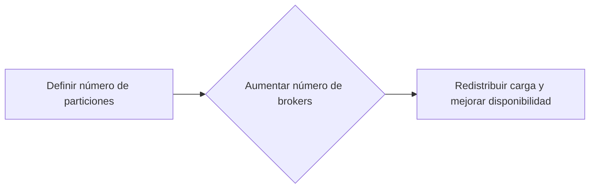

### 2. **Usando Replicación para Mejor Escalabilidad**

La replicación de temas garantiza que los datos estén disponibles incluso si un broker falla. Ajustamos el factor de replicación en la configuración del tema para asegurar que cada partición tenga suficientes réplicas.


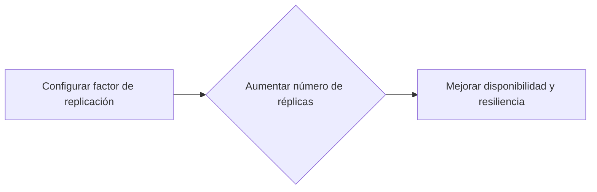

### 3. **Elasticity en Kafka Streams**

Kafka Streams permite ajustar dinámicamente la cantidad de instancias de una aplicación. Esto se logra mediante la configuración del parámetro `num.stream threads`, que determina cuántas hilos de procesamiento se iniciarán.


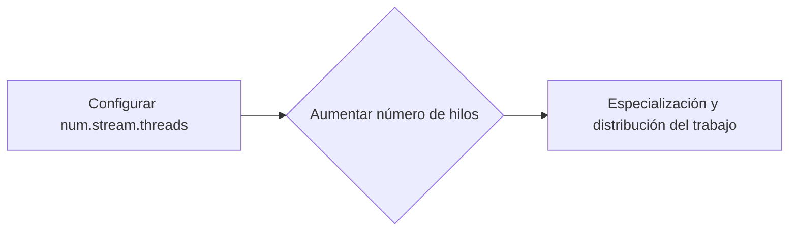

## Alta Disponibilidad

Para garantizar que la aplicación esté disponible incluso en caso de fallos, es crucial implementar estrategias de alta disponibilidad.

### 1. **Zonas de Resiliencia Multi**

Haciendo uso de Kubernetes, podemos configurar zonas de resiliencia multi para distribuir los pods de la aplicación de manera que no todos estén en el mismo centro de datos o zona geográfica. Esto asegura que si hay un fallo local, la aplicación sigue funcionando.


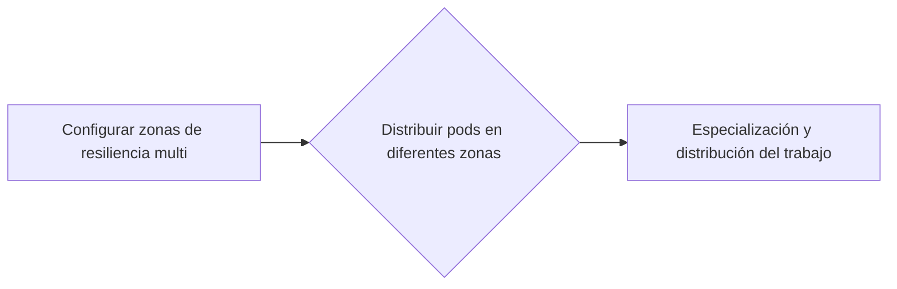

### 2. **Autoescalamiento con Kubernetes**

Kubernetes ofrece mecanismos para autoescalar aplicaciones basadas en la utilización de recursos. Podemos configurar estos mecanismos para que ajusten dinámicamente el número de replicas de Kafka Streams según las demandas del sistema.


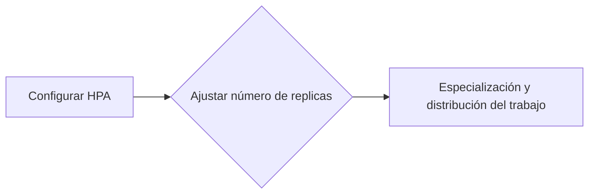

### 3. **Estrategias de Fallback**

En caso de fallos, es útil tener estrategias de fallback para garantizar que la aplicación siga funcionando con un nivel mínimo de servicio. Esto puede implicar redirigir el tráfico a una versión anterior o usar almacenamiento persistente para recuperar datos.


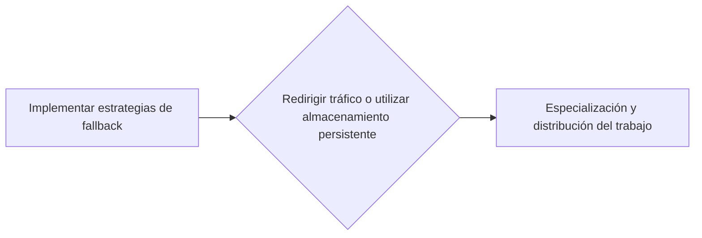

## Integración con Kafka State Stores

Las operaciones stateful, como las que realiza Kafka Streams, requieren de una gestión adecuada del estado. Podemos aprovechar la integración entre Kafka Streams y los store locales para mantener el estado de forma consistente y altamente disponible.


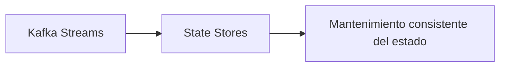

## Monitoreo y Alertas

Para asegurarnos de que la aplicación esté funcionando correctamente, es importante implementar un sistema robusto de monitoreo y alertas. Podemos hacer uso de herramientas como Prometheus para recopilar métricas y Grafana para visualizarlas.


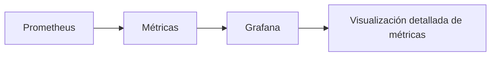

## Conclusión

La escalabilidad y alta disponibilidad en stream processing con Kafka Streams son cruciales para garantizar que las aplicaciones funcionen eficientemente y sean resistentes a los fallos. A través del uso adecuado de recursos de Kubernetes, la configuración óptima de Kafka y el monitoreo constante, podemos asegurar que nuestras aplicaciones sigan funcionando sin interrupciones.

---

Este esquema muestra cómo implementar estrategias de escalabilidad y alta disponibilidad en una aplicación basada en Kafka Streams. La integración con herramientas como Kubernetes, Prometheus y Grafana garantiza que la aplicación sea robusta y funcione correctamente en todo momento.

## Casos de Uso Avanzados

### Casos de Uso Avanzados

#### 1. Enrichment of Customer Transactions with Real-Time Data Streams

**Descripción:** En una aplicación de e-commerce, es crucial actualizar el perfil del cliente en tiempo real basado en las transacciones recientes y proporcionar recomendaciones personalizadas. La integración entre los flujos de datos de transacciones y la tabla de información del cliente requiere un estado persistente para almacenar y consultar información previa.

**Implementación:** Usando Kafka Streams, se pueden combinar dos streams (transacciones y perfil de clientes) en una única operación de join. La operación `join()` se utiliza para combinar las transacciones recientes con la tabla de perfil del cliente actualizada. El estado persistente se gestiona a través de state stores, como RocksDB, asegurando que el proceso sea resiliente ante fallos.


```java
KStream<String, CustomerTransaction> transactions = builder.stream(transactionsTopic);
KTable<String, CustomerProfile> profiles = builder.table(profilesTopic);

KStream<String, EnrichedTransaction> enrichedTransactions = transactions.join(
    profiles,
    (transaction, profile) -> new EnrichedTransaction(transaction, profile),
    JoinWindows.of(Duration.ofMinutes(5))
).to("enriched-transactions");
```

**Beneficios:** Proporciona una solución eficiente para mantener el estado y procesar transacciones en tiempo real, mejorando la calidad del servicio al cliente.

---

#### 2. Real-Time Fraud Detection and Alerting

**Descripción:** La detección de fraude en tiempo real es fundamental para proteger las operaciones comerciales. La integración entre los flujos de datos de transacciones y patrones de fraude requiere un estado dinámico para monitorear la actividad sospechosa.

**Implementación:** Utilizando Kafka Streams, se puede aplicar una lógica de agregación y join en tiempo real para identificar patrones de comportamiento inusual. El estado dinámico permite almacenar información sobre transacciones anteriores y detectar anomalías en tiempo real.


```java
KStream<String, Transaction> transactions = builder.stream(transactionsTopic);
KTable<String, Boolean> suspiciousTransactions = transactions.groupBy(
    (key, value) -> key,
    Grouped.with(Serdes.String(), Serdes.Transaction())
).windowedBy(TimeWindows.of(Duration.ofMinutes(10)))
   .reduce((aggVal, newValue) -> {
       // Lógica para detectar fraudes
       return isSuspicious(aggVal, newValue);
   });

suspiciousTransactions.toStream().foreach((key, value) -> sendAlert(key));
```

**Beneficios:** Ofrece una respuesta rápida a eventos sospechosos y minimiza la posibilidad de fraude, mejorando la seguridad del sistema.

---

#### 3. Dynamic Pricing and Personalized Recommendations

**Descripción:** La personalización de precios y recomendaciones en tiempo real es crucial para mejorar la experiencia del cliente. La integración entre los flujos de datos de comportamiento del usuario y el estado de inventario requiere un estado persistente para mantener las ofertas dinámicas.

**Implementación:** Usando Kafka Streams, se puede combinar los streams de acciones del usuario con el estado de precios del inventario en tiempo real. La operación `join()` permite actualizar los precios y generar recomendaciones personalizadas basadas en la actividad del usuario.


```java
KStream<String, UserAction> userActions = builder.stream(userActionsTopic);
KTable<String, InventoryPrice> inventoryPrices = builder.table(inventoryPricesTopic);

KStream<String, PersonalizedOffer> personalizedOffers = userActions.join(
    inventoryPrices,
    (action, price) -> new PersonalizedOffer(action, price),
    JoinWindows.of(Duration.ofMinutes(5))
).to("personalized-offers");
```

**Beneficios:** Proporciona un sistema eficiente para mantener precios dinámicos y generar recomendaciones personalizadas en tiempo real.

---

### Consideraciones Finales

1. **Consistencia del Estado:** Es crucial implementar la consistencia del estado correctamente utilizando las herramientas proporcionadas por Kafka Streams, como state stores.
2. **Escalabilidad:** Se deben considerar estrategias de escalabilidad para manejar el crecimiento continuo de los datos y transacciones.
3. **Resiliencia:** Asegurarse de que la solución sea resiliente ante fallos utilizando mecanismos de recuperación automática.

Estos casos de uso avanzados ilustran cómo Kafka Streams puede ser utilizado para solucionar problemas complejos en aplicaciones de procesamiento en streaming, ofreciendo una combinación eficiente de integración, estado y escalabilidad.

## Conclusiones

### Conclusiones

En resumen, Kafka Streams es una herramienta robusta para el procesamiento de flujos de datos en tiempo real que permite implementar operaciones estables y altamente disponibles mediante técnicas de estado persistente y procesamiento en lotes. La gestión adecuada del estado es crucial para asegurar la coherencia y confiabilidad de los resultados, especialmente en escenarios donde se requiere un procesamiento exacto una vez.

#### Principales Consideraciones:

1. **Estado Persistente:**
   - El manejo del estado persistente mediante `State Stores` permite que las operaciones estén respaldadas por datos previos, lo cual es crucial para el procesamiento en lotes y la recuperación de errores.
   - Se deben considerar cuidadosamente las políticas de retention y compaction para optimizar el almacenamiento y la gestión del estado.

2. **Estrategias de Escalabilidad:**
   - Asegurarse de que se implementan cluster robustos con al menos tres brokers para garantizar alta disponibilidad.
   - Configurar los parámetros `transaction.state.log.replication.factor` y `transaction.state.log.min.isr` adecuadamente para adaptar la aplicación a diferentes entornos.

3. **Alta Disponibilidad:**
   - Utilizar replicas calientes (warm replicas) para permitir la restauración del estado en caso de fallas.
   - Configurar los parámetros `acceptable.recovery.lag` y `processing.guarantee` para controlar el tiempo de recuperación y garantizar el procesamiento correcto de los eventos.

4. **Procesamiento Basado en Evento:**
   - Implementar estrategias como idempotencia y supresión de duplicados para asegurar que cada evento sea procesado una sola vez.
   - Utilizar `Task Metadata` y `StreamsMetadata` para monitorear el estado del proceso y realizar cambios en tiempo real.

5. **Técnicas Avanzadas:**
   - Introducir técnicas avanzadas como la iddle de tareas (`max.task.idle.ms`) para mejorar las semánticas de unión y fusión.
   - Manejar casos donde se requiere coherencia basada en tiempo, utilizando métricas de tiempo y lógica de procesamiento específico.

6. **Pruebas y Depuración:**
   - Probar exhaustivamente la aplicación antes de pasar a producción para identificar posibles fallos.
   - Implementar sistemas de registro y monitoreo robustos para detectar y corregir problemas en tiempo real.

#### Ejemplo Práctico:


```java
// Ejemplo básico de uso de Kafka Streams con estado persistente

import org.apache.kafka.streams.kstream.KStream;
import org.apache.kafka.streams.kstream.KTable;
import org.apache.kafka.streams.StreamsBuilder;

public class TransactionEnrichment {
    public void processTransactions(StreamsBuilder builder) {
        KStream<String, String> transactionStream = builder.stream("transaction-topic");
        
        // Crear un state store para almacenar la información del cliente
        KTable<Windowed<String>, String> customerInfo = transactionStream
            .groupByKey(Grouped.with(Serdes.String(), Serdes.String()))
            .windowedBy(TimeWindows.of(Duration.ofMinutes(5)))
            .reduce((current, next) -> current + " | " + next);
        
        // Unir la información del cliente con las transacciones
        KTable<Windowed<String>, String> enrichedTransactions = transactionStream
            .join(customerInfo,
                (transaction, customer) -> "Transaction: " + transaction + " - Customer Info: " + customer,
                JoinWindows.of(Duration.ofMinutes(5)));
        
        // Mostrar los resultados en un topic de salida
        enrichedTransactions.toStream().to("enriched-transactions-topic", Produced.with(Serdes.WindowedString(), Serdes.String()));
    }
}
```

#### Diagrama Mermaid:


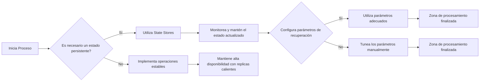

Esta sección resalta las mejores prácticas para implementar procesamiento estables y altamente disponibles con Kafka Streams, destacando la importancia del manejo adecuado del estado persistente y el uso efectivo de técnicas avanzadas. La integración de estas estrategias permitirá desarrollar soluciones robustas y confiables en entornos de datos en tiempo real.

---

**Nota:** Este código Java es un ejemplo simplificado, y se debe adaptar según las necesidades específicas del caso de uso.

