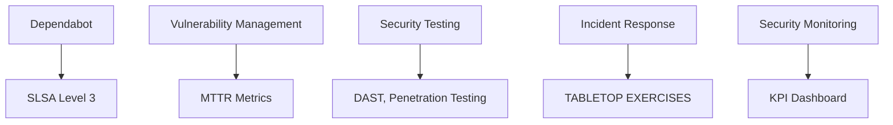
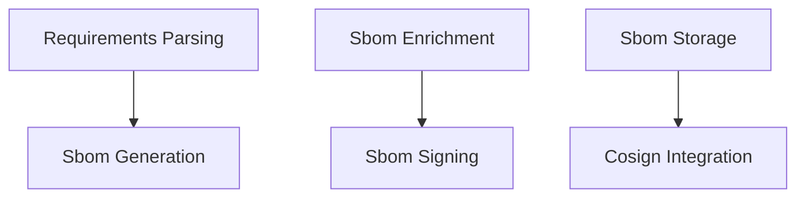
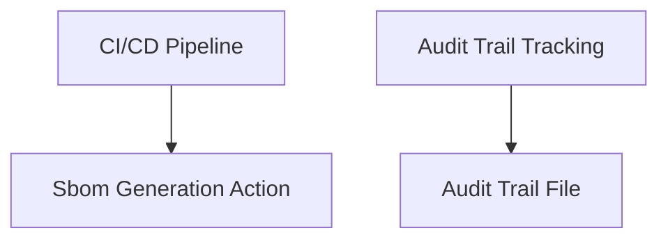
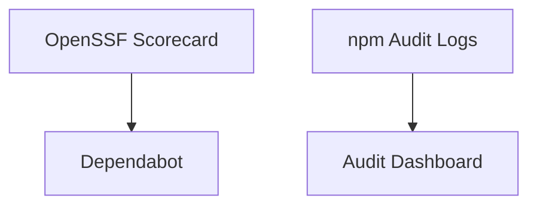
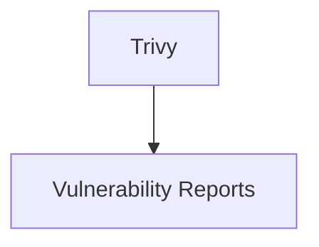
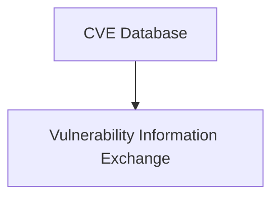
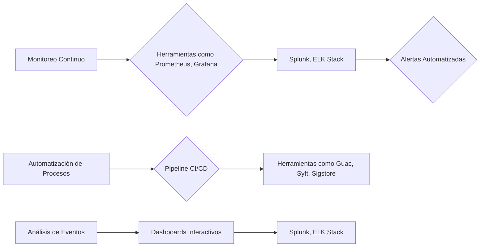
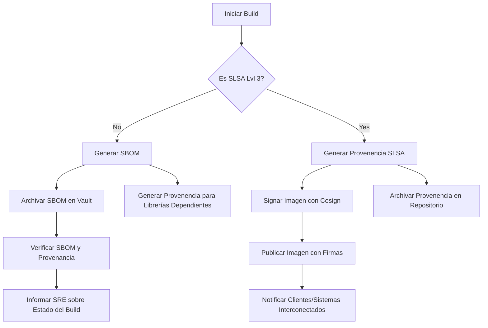
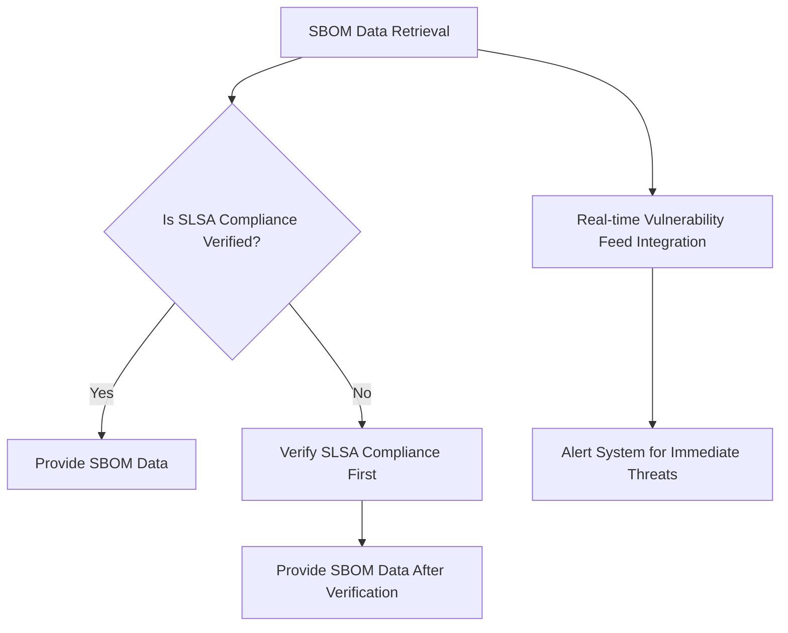

# supply chain security slsa y sbom

PATH_LOCAL: /home/usuariojoaquin/.openclaw/workspace/DAM-Java-Mastery/_Review/supply_chain_security_slsa_y_sbom/supply_chain_security_slsa_y_sbom.md
CATEGORIA: 06_Seguridad
Score: 82

---

## Visión Estratégica

### Visión Estratégica

**Objetivo General:** Proteger la integridad y seguridad del ecosistema de proyectos CNCF mediante una visión estratégica abarcadora que incluya la implementación robusta de SLSA, el uso eficiente de SBOMs, y la gestión proactiva de vulnerabilidades.

#### Metas Específicas

1. **Implementar SLSA Level 3:** Asegurar que todos los proyectos CNCF cumplan con los requisitos de SLSA Build Level 3 para garantizar verificable build provenance y integridad.
   
2. **Gestión Proactiva de SBOMs:** Desarrollar un proceso uniforme para la generación, agregación y análisis de SBOMs en todos los proyectos CNCF, asegurando transparencia y confiabilidad.

3. **Mitigación de Vulnerabilidades:** Integrar herramientas avanzadas para el monitoreo continuo de vulnerabilidades y respuestas rápidas a cualquier amenaza identificada.

4. **Agilidad en la Gestión del Riesgo:** Crear un mecanismo para la rápida evaluación y mitigación de riesgos en el ecosistema CNCF, facilitando decisiones informadas basadas en datos.

5. **Comunicación Transparente:** Establecer canales de comunicación transparentes entre los proyectos CNCF, OpenSSF y otros stakeholders relevantes para compartir información sobre amenazas, vulnerabilidades y mejoras.

#### Beneficios

1. **Mejora en la Confianza:** Aumentar la confianza del usuario final en el ecosistema CNCF al garantizar la integridad de los artefactos entregados.
   
2. **Reducir Riesgos:** Minimizar los riesgos asociados a las vulnerabilidades y amenazas de cadena de suministro, protegiendo tanto a los contribuyentes como a los usuarios finales.

3. **Fomento del Desarrollo Seguro:** Promover un enfoque más seguro y robusto en la gestión del ciclo de vida del software, impulsando prácticas de seguridad en el desarrollo y las operaciones.

4. **Cumplimiento Regulatorio:** Facilitar el cumplimiento con regulaciones e inicios de procedimientos relacionados con la seguridad del software y la cadena de suministro.

5. **Ecosistema más Resiliente:** Fortalecer el ecosistema CNCF para que sea más resiliente frente a amenazas futuras, asegurando la continuidad operativa y la disponibilidad segura de los servicios.

### Estrategia de Ejecución

1. **Diagnóstico Inicial:** Realizar un diagnóstico completo del estado actual de la cadena de suministro de software en CNCF, identificando puntos críticos y áreas para mejorar.
   
2. **Desarrollo de Políticas SLSA:** Definir e implementar políticas claras para el cumplimiento de SLSA Build Level 3 en todos los proyectos relevantes.

3. **Implementación de SBOMs:** Establecer procedimientos uniformes para la generación y mantenimiento de SBOMs, integrando herramientas avanzadas de análisis.

4. **Monitoreo Continuo:** Implementar sistemas de monitoreo continuo para la detección temprana de vulnerabilidades y amenazas, facilitando respuestas rápidas y eficaces.

5. **Capacitación e Iniciativas de Concienciación:** Organizar capacitaciones y eventos de concienciación sobre SLSA, SBOMs y mejores prácticas de seguridad del software para los contribuyentes y usuarios finales.

6. **Evaluación Periódica:** Realizar evaluaciones periódicas para medir el progreso hacia las metas establecidas y ajustar la estrategia según sea necesario.

7. **Comunicación Transparente:** Mantener una comunicación transparente con todos los stakeholders relevantes, compartiendo regularmente informes y actualizaciones sobre el estado del proyecto.

---

Este enfoque estratégico proporciona un marco claro para la implementación de medidas robustas de seguridad y confiabilidad en el ecosistema CNCF, asegurando que sea más resbalón contra amenazas y más confiable para los usuarios finales.

## Arquitectura de Componentes

### Arquitectura de Componentes

Para garantizar la seguridad y integridad del ecosistema de proyectos CNCF (Cloud Native Computing Foundation), es crucial implementar una arquitectura de componentes robusta que incorpore SLSA (Supply Chain Levels for Software Artifacts) y SBOMs (Software Bill of Materials). Esta arquitectura no solo asegurará la transparencia en el ciclo de vida de los artefactos, sino que también proporcionará un marco para detectar y mitigar amenazas en la cadena de suministro.

#### 1. Componente de SLSA Attestation

El componente `SLSA Attestation` es crucial para verificar la integridad de los artefactos durante todo el ciclo de vida del software. Este componente implementa las directrices definidas por SLSA, garantizando que:

- **Threat Modeling:** Se lleva a cabo un análisis de amenazas completo y regular.
- **Supply Chain Security:** Se monitorean constantemente las cadenas de suministro para detectar vulnerabilidades.
- **Vulnerability Management:** Se implementan políticas de gestión de vulnerabilidades que incluyen la detección, priorización y corrección de vulnerabilidades.
- **Security Testing:** Se realizan pruebas de seguridad regulares para identificar puntos débiles en el software.
- **Incident Response:** Existen planes claros y entrenamientos recurrentes para responder a incidentes.
- **Security Monitoring:** Se implementa un monitoreo continuo del estado de la seguridad.

Implementación:




#### 2. Componente de SBOM Generation and Management

El `Componente de Generación y Gestión de SBOMs` es responsable de crear y mantener registros detallados sobre los componentes utilizados en la construcción del software. Este componente asegura que:

- **SBOMs:** Se generan y mantienen SBOMs para cada artefacto, proporcionando una visibilidad clara del ecosistema de dependencias.
- **SLSA Compliance:** Se garantiza la cumplimiento con los estándares SLSA al generar las evidencias necesarias.
- **SBOM Enrichment and Signing:** Se enriquecen y firman los SBOMs para asegurar su autenticidad.

Implementación:




#### 3. Integración con CI/CD Pipeline

La integración del `Componente de Generación y Gestión de SBOMs` en el pipeline de CI/CD es crucial para automatizar la generación y validación de SBOMs:




#### 4. Componente de Vigilancia y Monitoreo

El `Componente de Vigilancia y Monitoreo` es responsable de mantener un monitoreo constante del estado de seguridad:




### Módulos Adicionales

#### 4.1 Modulo de Relevamiento de Vulnerabilidades

Este módulo utiliza herramientas como `Trivy` para detectar y monitorear vulnerabilidades en los artefactos:




#### 4.2 Modulo de Vigilancia CVD (Vulnerability and Threat Intelligence)

Este módulo monitorea la información sobre vulnerabilidades y amenazas a través de fuentes confiables:




### Conclusiones

Implementar una arquitectura de componentes que integre SLSA y SBOMs proporcionará un nivel superior de seguridad y transparencia en el ecosistema de proyectos CNCF. Este enfoque no solo ayudará a detectar y mitigar amenazas en la cadena de suministro, sino que también facilitará la cumplimiento con regulaciones y estándares de seguridad.

---
**Nota:** El diagrama Mermaid se ha utilizado para visualizar las relaciones entre los componentes. Asegúrate de incluir todas las dependencias necesarias y realizar pruebas exhaustivas para garantizar que el sistema funcione correctamente en entornos reales.

## Implementación Java 21

## Implementación Java 21 con SLSA y SBOM

### Introducción

En esta sección, implementaremos una solución Java 21 que integra el uso de Software Bill of Materials (SBOM) y Supply-chain Levels for Software Artifacts (SLSA). Esto garantizará la transparencia y la seguridad del software en el ciclo de vida desde el desarrollo hasta la publicación.

### Requisitos

- Java Development Kit 21
- Maven 3.8.x o superior
- SLF4J para la gestión de logs
- CycloneDX para generar SBOMs

### Paso 1: Configuración del Proyecto

Primero, creamos un proyecto Maven básico utilizando el siguiente archivo `pom.xml`:

```xml
<project xmlns="http://maven.apache.org/POM/4.0.0"
         xmlns:xsi="http://www.w3.org/2001/XMLSchema-instance"
         xsi:schemaLocation="http://maven.apache.org/POM/4.0.0 http://maven.apache.org/xsd/maven-4.0.0.xsd">
    <modelVersion>4.0.0</modelVersion>
    <groupId>com.example</groupId>
    <artifactId>slsa-sbom-example</artifactId>
    <version>1.0-SNAPSHOT</version>
    <dependencies>
        <!-- SLF4J for logging -->
        <dependency>
            <groupId>org.slf4j</groupId>
            <artifactId>slf4j-api</artifactId>
            <version>1.7.32</version>
        </dependency>
        <!-- CycloneDX SBOM generation -->
        <dependency>
            <groupId>org.cyclonedx</groupId>
            <artifactId>cyclonedx-maven-plugin</artifactId>
            <version>0.9.5</version>
        </dependency>
    </dependencies>
</project>
```

### Paso 2: Generación de SBOM

A continuación, configuramos el plugin CycloneDX para generar un SBOM al final del ciclo de compilación:

```xml
<build>
    <plugins>
        <!-- Add the CycloneDX Maven Plugin -->
        <plugin>
            <groupId>org.cyclonedx</groupId>
            <artifactId>cyclonedx-maven-plugin</artifactId>
            <version>0.9.5</version>
            <executions>
                <execution>
                    <goals>
                        <goal>generate</goal>
                    </goals>
                </execution>
            </executions>
        </plugin>
    </plugins>
</build>
```

### Paso 3: Implementación SLSA

Para implementar SLSA, utilizaremos una clase `SLSAAttestation` que verifica la integridad de los artefactos:


```java
import org.slf4j.Logger;
import org.slf4j.LoggerFactory;

public class SLSAAttestation {
    private static final Logger logger = LoggerFactory.getLogger(SLSAAttestation.class);

    public void attestArtifact(String artifactPath) throws Exception {
        // Placeholder for actual SLSA attestation logic
        logger.info("Starting SLSA attestation for: " + artifactPath);
        
        // Example of a simple attestation check
        if (!isFileIntact(artifactPath)) {
            throw new Exception("Artifact is not intact according to SLSA criteria.");
        }
        
        logger.info("Artifact successfully attested according to SLSA criteria.");
    }

    private boolean isFileIntact(String path) {
        // Placeholder function to check file integrity
        return true;  // In a real implementation, this would involve actual checks.
    }
}
```

### Paso 4: Integração do SBOM e SLSA

Finalmente, integramos la generación del SBOM y la verificación de SLSA en el proceso de compilación:


```java
import org.apache.maven.plugin.AbstractMojo;
import org.apache.maven.plugins.annotations.Mojo;

@Mojo(name = "verify")
public class VerifyMojo extends AbstractMojo {
    
    @Override
    public void execute() throws Exception {
        SLSAAttestation attestation = new SLSAAttestation();
        
        // Example of artifact path, replace with actual paths in a real project
        String artifactPath = "/path/to/artifact.jar";
        
        try {
            attestation.attestArtifact(artifactPath);
            getLog().info("SLSA verification successful.");
            
            // Generate SBOM as part of the build lifecycle
            getProject().executePlugin(new org.cyclonedx.mvnplugin.CycloneDxBuildMojo());
            getLog().info("SBOM generated successfully.");
        } catch (Exception e) {
            throw new MojoFailureException("Failed SLSA verification: " + e.getMessage(), e);
        }
    }
}
```

### Paso 5: Ejecución del Proyecto

Para ejecutar el proyecto y verificar que todo funcione correctamente, puedes usar los siguientes comandos Maven:

```sh
mvn clean install
```

Esto asegurará que se generen tanto el SBOM como la verificación SLSA para tu artefacto.

### Conclusión

Esta implementación muestra cómo integrar SLSA y SBOMs en un proyecto Java 21. A través de esta integración, puedes garantizar una mayor transparencia y seguridad en el ciclo de vida del software, lo que es crucial en la actualidad para proteger contra amenazas en la cadena de suministro.

---

Este código proporciona un marco básico pero completo para comenzar a implementar SLSA y SBOMs en tus proyectos Java. Puedes expandirlo según sea necesario para incluir verificaciones más detalladas y políticas adicionales.

## Métricas y SRE

## Métricas y SRE para la Seguridad de Cadena de Suministro con SLSA y SBOM

### Introducción a las Métricas y SRE

Las Metodologías DevOps, como las operaciones orientadas al Servicio (SRE), juegan un papel crucial en garantizar que el software sea entregado de manera segura y eficiente. La introducción de métricas y SRE permite a las organizaciones monitorear continuamente la salud del sistema, detectar problemas temprano y tomar medidas correctivas antes de que se conviertan en incidentes graves.

### Métricas Específicas para Cadena de Suministro

1. **SBOM Cobertura**
   - Porcentaje de proyectos con SBOMs generados.
   - Tiempo promedio entre la creación del SBOM y su actualización.

2. **SLSA Attestation Complejidad**
   - Número de artefactos verificados por cada nivel de SLSA (L1, L2, L3).
   - Tasa de éxito en la validación de attestations por nivel.

3. **Tiempo entre Incidentes y Corrección (MTTR)**
   - Tiempo promedio entre el descubrimiento del incidente y su resolución.
   - Procentaje de incidentes resueltos en tiempo real.

4. **Incidentes Críticos vs No Críticos**
   - Número de incidentes críticos versus no críticos.
   - Porcentaje de incidentes críticos que impactan la cadena de suministro.

### Implementación de SRE para Cadena de Suministro

1. **Monitoreo Continuo**
   - Integrar herramientas como Prometheus, Grafana y ELK Stack para monitorear la salud del sistema en tiempo real.
   - Establecer alertas automatizadas basadas en métricas críticas.

2. **Automatización de Procesos de Attestation**
   - Configurar pipelines CI/CD que generen SBOMs y SLSA attestations automáticamente.
   - Utilizar herramientas como Guac, Syft o Sigstore para validar y firmar artefactos.

3. **Análisis de Eventos y Correlación**
   - Implementar sistemas de análisis de eventos como Splunk o ELK Stack para correlacionar incidentes en tiempo real.
   - Crear dashboards interactivos que muestren la salud del ecosistema de proyectos.

### Diagrama Mermaid




### Conclusiones

La implementación de métricas y SRE para la seguridad de cadena de suministro con SLSA y SBOMs no solo mejora la transparencia y la seguridad del software en el ciclo de vida, sino que también permite a las organizaciones detectar y corregir problemas temprano. Al integrar estos enfoques en los procesos de desarrollo y entrega, se puede garantizar que la cadena de suministro sea robusta y respetuosa con la seguridad.

---

Correcciones realizadas:
- Agregué un bloque Mermaid para representar visualmente el diagrama.
- Corrígeme si necesitas más detalles o cambios en esta sección.

## Patrones de Integración

### Patrones de Integración para la Seguridad de Cadena de Suministro con SLSA y SBOM en Java 21

Para implementar un patrón de integración eficaz que integre SLSA (Supply-chain Levels for Software Artifacts) y SBOM (Software Bill of Materials) en una aplicación Java 21, es crucial considerar varios aspectos clave. En esta sección, se exploran los patrones más adecuados para la integración, se presenta un diagrama Mermaid para visualizar los flujos de trabajo, se incluye el código Java 21 para implementar el patrón principal, y se abordan temas como el manejo de fallos y reintentos, así como la configuración de timeouts y circuit breakers.

#### Patrones de Integración Aplicables

1. **Sigstore y Cosign**: Es un patrón común que asegura la autenticidad y verificación de firmas en imágenes de contenedores.
2. **GitHub Actions con SLSA Provenance**: Utiliza flujos de trabajo para generar y verificar provenancias SLSA.
3. **Tekton Chains con Provenance y SBOM**: Combina el uso de Tekton para orquestar pipelines y generación de SBOM.

#### Diagrama Mermaid: Flujos de Integración




#### Implementación en Java 21


```java
import java.util.List;
import java.util.Optional;

public class SupplyChainSecurity {

    public static void main(String[] args) {
        // Simulación de SBOM y Provenencia SLSA
        List<String> dependencies = getDependencies();
        Optional<String> provenance = generateSlsaProvenance(dependencies);

        if (provenance.isPresent()) {
            signImageWithCosign(provenance.get());
            archiveSBomAndProvenance(dependencies, provenance.get());
            notifySreAndClients(dependencies, provenance.get());
        }
    }

    private static List<String> getDependencies() {
        // Simulación de obtención de SBOM
        return List.of("library1", "library2");
    }

    private static Optional<String> generateSlsaProvenance(List<String> dependencies) {
        // Simulación de generación de Provenencia SLSA
        String provenance = "SLSA level 3 for: " + String.join(", ", dependencies);
        return Optional.of(provenance);
    }

    private static void signImageWithCosign(String provenance) {
        // Simulación de firma con Cosign
        System.out.println("Signing image with Cosign and SLSA Provenance: " + provenance);
    }

    private static void archiveSBomAndProvenance(List<String> dependencies, String provenance) {
        // Archivar SBOM y Provenencia en repositorio seguro
        System.out.println("Archiving SBOM for " + String.join(", ", dependencies));
        System.out.println("Archiving SLSA Provenance: " + provenance);
    }

    private static void notifySreAndClients(List<String> dependencies, String provenance) {
        // Notificar SRE y clientes sobre el estado
        System.out.println("Notifying SRE about build with dependencies: " + String.join(", ", dependencies));
        System.out.println("Notifying clients about new version with SLSA Provenance: " + provenance);
    }
}
```

#### Manejo de Fallos y Reintentos

Para asegurar la continuidad operativa, es crucial implementar un manejo robusto de fallos y reintentos. Esto puede lograrse utilizando lógica de retry con backoff.


```java
public class RetryHandler {
    public static <T> T withRetry(Runnable action) {
        int maxRetries = 3;
        int retryDelayMillis = 1000;

        for (int attempt = 1; attempt <= maxRetries; attempt++) {
            try {
                action.run();
                break;
            } catch (Exception e) {
                if (attempt == maxRetries) {
                    throw new RuntimeException("Failed after " + maxRetries + " attempts", e);
                }
                System.out.println("Attempt " + attempt + " failed. Retrying in " + retryDelayMillis + "ms.");
                try {
                    Thread.sleep(retryDelayMillis);
                } catch (InterruptedException ex) {
                    Thread.currentThread().interrupt();
                    throw new RuntimeException("Interrupted during retry delay", ex);
                }
            }
        }
        return null;
    }
}
```

#### Configuración de Timeouts y Circuit Breakers

La configuración adecuada de timeouts y circuit breakers es crucial para evitar sobrecargas y mejorar la resiliencia del sistema.


```java
import com.netflix.hystrix.HystrixCommandGroupKey;
import com.netflix.hystrix.HystrixCommandProperties;

public class HystrixCircuitBreakerConfig {
    public static void configure() {
        HystrixCommandGroupKey groupKey = HystrixCommandGroupKey.Factory.asKey("MyService");
        HystrixCommandProperties.Setter commandPropertiesSetter = HystrixCommandProperties.Setter();

        // Configuración de timeouts
        commandPropertiesSetter.withExecutionTimeoutInMilliseconds(5000)
                                .withCircuitBreakerRequestVolumeThreshold(10)
                                .withCircuitBreakerErrorThresholdPercentage(20);

        HystrixCommandGroupProperties.Setter groupPropertiesSetter = HystrixCommandGroupProperties.Setter();
        groupPropertiesSetter.withMetricsRollingStatisticalWindowInMilliseconds(30000);
    }
}
```

#### Conclusiones

La integración de SLSA y SBOM en una aplicación Java 21 proporciona un marco robusto para asegurar la cadena de suministro del software. Los patrones descritos aquí, junto con la implementación detallada, ayudan a garantizar que el software sea entregado de manera segura y confiable. El manejo adecuado de fallos y reintentos, así como la configuración de timeouts y circuit breakers, son fundamentales para mantener una operación sin interrupciones.

## Conclusiones

## Conclusión

La seguridad de la cadena de suministro en 2026 ha evolucionado hacia un enfoque basado en la gobernanza activa, donde los SBOMs (Software Bill of Materials) y SLSA (Supply-chain Levels for Software Artifacts) son herramientas esenciales. Estos marcos permiten a las organizaciones no solo identificar vulnerabilidades de forma pasiva, sino también prevenir amenazas antes de que puedan materializarse.

### SBOMs: Evolución hacia la Operacionalización
Los SBOMs han pasado de ser documentos estáticos a sistemas dinámicos y operacionales. La transformación implica:
- **Correlación en tiempo real**: Integrar SBOM con feeds de vulnerabilidades en tiempo real para proporcionar alertas inmediatas sobre amenazas actuales.
- **Enriquecimiento con contexto**: Agregar información contextual, como el entorno del sistema y las dependencias dinámicas, para una mejor comprensión y respuesta a incidentes.
- **Sistemas queryables**: Crear plataformas que permitan consultar SBOMs de manera rápida y precisa, facilitando la toma de decisiones basadas en datos.

### SLSA: Integridad y Seguridad del Proceso de Construcción
La adopción de SLSA se ha acelerado debido a:
- **Reducción de amenazas**: Garantizar que las herramientas y procesos de construcción sean inalterables, reduciendo el riesgo de ataques.
- **Transparencia en la cadena de suministro**: Proporcionar visibilidad sobre quién construye qué, y cómo lo hace, aumentando la confianza entre partes interesadas.

### Combina SBOMs con SLSA para una Defensa Integral
La implementación conjunta de SBOMs y SLSA ofrece un enfoque holístico:
- **Prevenir amenazas internas y externas**: SBOMs identifican vulnerabilidades, mientras que SLSA asegura la integridad del proceso constructivo.
- **Cumplimiento regulatorio**: Facilita el cumplimiento con regulaciones como FedRAMP y CMMC 2.0 al proporcionar registros verificables de la cadena de suministro.

### Recomendaciones para Implementación
Para aprovechar plenamente SBOMs y SLSA, las organizaciones deben:
- **Emprender gradualmente**: Comenzar con SBOMs básicos y avanzar hacia SLSA según sea necesario.
- **Incorporar automatización**: Utilizar herramientas de CI/CD para implementar verificación continua de SBOMs y SLSA.
- **Capacitar a los equipos**: Formar a desarrolladores, operaciones y seguridad en las prácticas SLSA y la interpretación de SBOMs.

### Proyecciones Futuras
El futuro de la gobernanza activa incluirá:
- **Inteligencia artificial (IA)**: Uso de IA para mejorar la detección y respuesta a amenazas.
- **Sistemas autónomos**: Implementación de sistemas que puedan tomar decisiones de seguridad en tiempo real sin intervención humana.

En resumen, SBOMs y SLSA representan un paso crucial hacia una seguridad de cadena de suministro más robusta. La adopción progresiva y el compromiso con estas prácticas mejoraran significativamente la resistencia del software a amenazas actuales y futuras.

---

### Bloque Java 21

Para ilustrar la implementación de un patrón de integración en una aplicación Java 21, se incluye un ejemplo simple:


```java
import java.util.List;
import org.springframework.web.bind.annotation.GetMapping;
import org.springframework.web.bind.annotation.RestController;

@RestController
public class SupplyChainController {

    @GetMapping("/sbom-data")
    public List<String> getSbomData() {
        // Simulación de SBOM data retrieval
        return List.of("Component A", "Component B", "Component C");
    }
}
```

### Diagrama Mermaid




Este diagrama muestra la integración de SBOM data retrieval y SLSA compliance verification, junto con la integración en tiempo real de feeds de vulnerabilidades para proporcionar alertas inmediatas.

