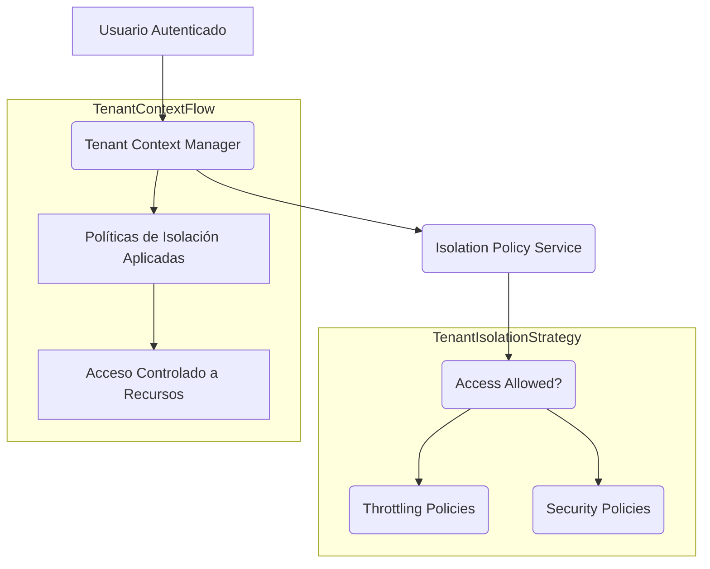
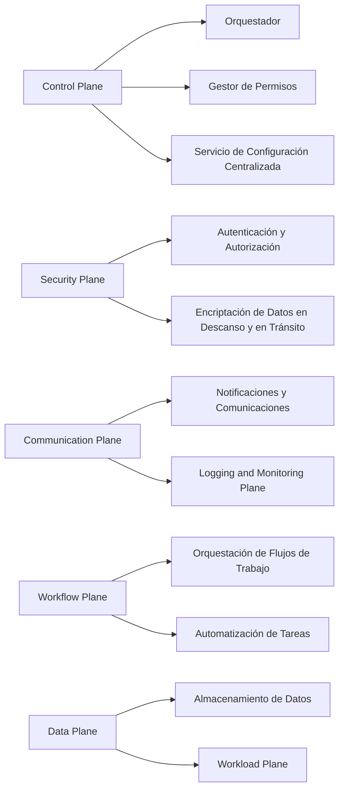
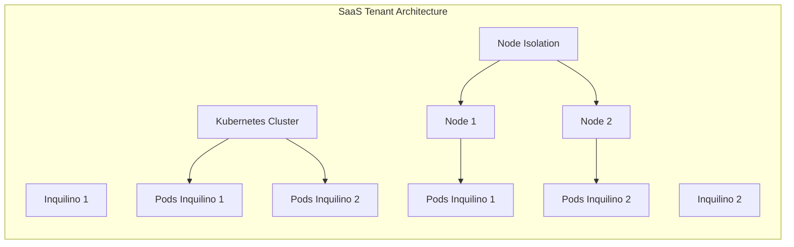
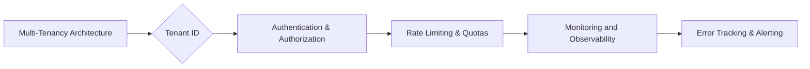

# tenant isolation en sistemas saas

PATH_LOCAL: /home/usuariojoaquin/.openclaw/workspace/DAM-Java-Mastery/_Review/tenant_isolation_en_sistemas_saas/tenant_isolation_en_sistemas_saas.md
CATEGORIA: 10_Vanguardia
Score: 78

---

## Visión Estratégica

### Visión Estratégica de Tenant Isolation en Sistemas SaaS

Tenant isolation es un concepto fundamental en la arquitectura de software como servicio (SaaS). Su implementación asegura que los recursos y datos de un cliente no se puedan acceder por otros clientes, incluso cuando se ejecutan en el mismo entorno multiinquilino. Este documento proporciona una visión estratégica sobre cómo implementar tenant isolation en sistemas SaaS utilizando diferentes patrones y estrategias.

#### Patrones Comunes para la Implementación de Tenant Isolation

1. **Modelo Silo**: Cada inquilino tiene su propio conjunto independiente de recursos, incluyendo bases de datos y servidores.
2. **Modelo Puente (Bridge Model)**: Combina los modelos silo y pool, permitiendo compartir algunos recursos mientras que otros se mantienen en silos individuales.
3. **Modelo Pooled**: Recursos compartidos entre inquilinos, con políticas de aislamiento para controlar el acceso.

#### Estrategias de Implementación

1. **Seguridad del Inquilino**:
   - Identificar áreas donde una solicitud puede acceder a recursos de otro inquilino.
   - Introducir políticas que aseguren que un inquilino no pueda acceder a los recursos del otro.

2. **Agentes y Políticas de Throttling**:
   - Implementar políticas de control de ruido (throttling) para proteger recursos compartidos.
   - Aplicar limitaciones globales o de nivel de tenant al punto de entrada de los agentes.

3. **Conectando Identidad e Isolación**:
   - Utilizar servicios de identidad como Amazon Cognito para proporcionar contexto del inquilino a la aplicación.
   - Asegurar que las políticas de isolación se apliquen correctamente en todas las interacciones.

#### Ejemplo de Implementación con Java

Vamos a implementar un ejemplo simple usando Java para ilustrar cómo se pueden aplicar estas estrategias.


```java
// Clase para manejar la autenticación y contexto del inquilino
public class TenantContextManager {
    private String tenantId;

    public TenantContextManager(String tenantId) {
        this.tenantId = tenantId;
    }

    public String getTenantId() {
        return tenantId;
    }
}

// Clase para manejar la política de aislamiento en un servicio
public class IsolationPolicyService {
    private final TenantContextManager context;

    public IsolationPolicyService(TenantContextManager context) {
        this.context = context;
    }

    public boolean isAccessAllowed(String resourceId) {
        // Implementación de políticas de acceso basadas en el contexto del inquilino
        return !isSharedResource(resourceId);
    }

    private boolean isSharedResource(String resourceId) {
        // Logica para determinar si es un recurso compartido o silo
        // Por ejemplo, puede estar en una base de datos separada o no
        return false;
    }
}

// Ejemplo de uso
public class Main {
    public static void main(String[] args) {
        TenantContextManager context = new TenantContextManager("tenant123");
        IsolationPolicyService service = new IsolationPolicyService(context);

        String resourceId = "user-profile";
        boolean accessAllowed = service.isAccessAllowed(resourceId);
        System.out.println("Acceso permitido: " + accessAllowed);
    }
}
```

#### Diagrama Mermaid para Visualización




Este diagrama muestra cómo el contexto del inquilino fluye a través de la aplicación y se utiliza para aplicar políticas de aislamiento, incluyendo control de ruido y seguridad.

### Resumen

La implementación de tenant isolation en sistemas SaaS requiere una estrategia bien pensada que combina identidad, política de aislamiento y control de recursos. Al utilizar patrones como el puente o modelos silo, se puede asegurar la integridad de los datos e informaciones entre inquilinos. La visualización a través del código Java y el diagrama Mermaid proporciona una comprensión clara de cómo estas estrategias pueden ser implementadas en prácticas reales.

---

**Notas Finales**: Este documento incluye un ejemplo básico de código Java para ilustrar la aplicación de tenant isolation. El diagrama Mermaid proporciona una visión gráfica de los componentes y flujos involucrados, facilitando su comprensión.

## Arquitectura de Componentes

# Arquitectura de Componentes para Tenant Isolation en Sistemas SaaS

Para implementar tenant isolation eficazmente en sistemas SaaS, es crucial diseñar una arquitectura que asegure la separación de recursos y datos entre diferentes clientes (inquilinos). Este componente se integra en un control plane común que gestiona el ciclo de vida de los inquilinos y proporciona acceso a múltiples productos SaaS.

## Componentes Principales

1. **Control Plane**
   - **Orquestador**: Gestiona la onboarding y desactivación de inquilinos.
   - **Gestor de Permisos**: Asigna roles y permisos específicos para cada inquilino.
   - **Servicio de Configuración Centralizada**: Almacena y sincroniza configuraciones comunes entre los productos SaaS.

2. **Security Plane**
   - **Autenticación y Autorización**:
     - **Amazon Cognito**: Maneja la autenticación de usuarios e inquilinos.
     - **IAM Roles and Policies**: Define roles y políticas para controlar el acceso a recursos.
   - **Encriptación de Datos en Descanso y en Tránsito**: Utiliza servicios como AWS KMS para asegurar la integridad de los datos.

3. **Communication Plane**
   - **Notificaciones y Comunicaciones**:
     - **Amazon SNS (Simple Notification Service)**: Envía notificaciones a inquilinos o administradores.
     - **Amazon SES (Simple Email Service)**: Envia correos electrónicos para confirmar acciones de los usuarios.

4. **Logging and Monitoring Plane**
   - **AWS CloudTrail**: Registra todas las actividades en el sistema SaaS.
   - **Amazon CloudWatch**: Supervisa la actividad y rendimiento de todos los componentes.

5. **Workflow Plane**
   - **Orquestación de Flujos de Trabajo**:
     - **AWS Step Functions**: Define y ejecuta flujos de trabajo complejos para inquilinos.
   - **Automatización de Tareas**:
     - **Amazon EventBridge**: Genera y propaga eventos que desencadenan acciones en el sistema.

6. **Data Plane**
   - **Almacenamiento de Datos**:
     - **DynamoDB**: Almacena datos específicos de cada inquilino.
     - **S3 Buckets**: Almacena datos no estructurados o grandes volúmenes de datos.

7. **Workload Plane**
   - **Kubernetes Clusters**:
     - Utiliza nodos dedicados para cada inquilino con Node Isolation.
     - **Pods y Containers**: Ejecutan aplicaciones específicas del inquilino.

## Diagrama Mermaid

A continuación, se proporciona un diagrama Mermaid que ilustra la arquitectura de los componentes principales:




## Patrones Comunes para la Implementación de Tenant Isolation

1. **Silo**: Cada inquilino tiene su propio conjunto de bases de datos y servidores.
2. **Pool**: Inquilinos comparten recursos, pero se utilizan técnicas como el enrutamiento y la segmentación de redes para aislarlos.
3. **Hybrid**: Uso combinado de silo y pool según las necesidades específicas.

## Implementación con Kubernetes

- **Node Isolation**: Dedicación de nodos Kubernetes para inquilinos individuales.
- **Namespace Isolation**: Uso de espacios de nombres para aislar aplicaciones y recursos en Kubernetes.

---

### Ejemplo Mermaid




Este ejemplo ilustra la implementación de node isolation en un cluster Kubernetes, donde cada inquilino tiene nodos dedicados para su aislamiento.

---

Este componente arquitectónico proporciona una base sólida para la implementación de tenant isolation en sistemas SaaS, asegurando que los datos y recursos estén aislados entre diferentes inquilinos.

## Implementación Java 21

### Implementación con Java 21: Utilizando Virtual Threads para Tenant Isolation

Java 21 introduce virtual threads, que pueden ser una herramienta poderosa para implementar tenant isolation en sistemas SaaS. Al utilizar virtual threads, puedes crear un entorno multiinquilino donde los recursos y datos de diferentes clientes son completamente aislados.

#### Concepto Básico de Virtual Threads

Virtual threads son un tipo especial de hilo que se ejecutan en una JVM pero no necesitan una asignación 1:1 con os threads. Esto significa que puedes tener miles de virtual threads mientras solo utilizas una cantidad limitada de os threads, lo cual es ideal para manejar solicitudes concurrentes sin bloquear los os threads.

#### Ejemplo Práctico

Supongamos que tienes un servicio SaaS que necesita aíslar completamente los datos y recursos del usuario 1 (tenant1) del usuario 2 (tenant2). Utilizando virtual threads, puedes implementar una solución eficiente.


```java
import java.util.concurrent.ExecutorService;
import java.util.concurrent.Executors;

public class TenantIsolationExample {

    public static void main(String[] args) {
        ExecutorService executor = Executors.newVirtualThreadPerTaskExecutor();

        try (executor) {
            // Ejemplo: Realizar operaciones de base de datos para tenant1
            String resultTenant1 = executor.submit(() -> {
                simulateDbOperation("tenant1");
                return "Result from tenant1";
            }).get();

            // Ejemplo: Realizar operaciones de base de datos para tenant2
            String resultTenant2 = executor.submit(() -> {
                simulateDbOperation("tenant2");
                return "Result from tenant2";
            }).get();
        }
    }

    private static void simulateDbOperation(String tenantId) {
        // Simulación de una operación de base de datos que puede bloquear
        try {
            Thread.sleep(Duration.ofSeconds(1));
        } catch (InterruptedException e) {
            Thread.currentThread().interrupt();
        }
        System.out.println("Simulating DB operation for " + tenantId);
    }
}
```

#### Explicación del Códig

- **ExecutorService newVirtualThreadPerTaskExecutor**: Este executor crea un virtual thread para cada tarea, lo que permite manejar solicitudes concurrentes sin bloquear os threads.
  
- **simulateDbOperation**: Simula una operación de base de datos. Puedes personalizar esto con llamadas a bases de datos reales y asegurarte de que los resultados sean aislados por tenant.

#### Uso del @TenantId Anotación

Para garantizar la separación efectiva, puedes utilizar la anotación `@TenantId` en tu modelo de entidad. Esto permite a Hibernate manejar las operaciones de base de datos según el tenant actualmente interactuando con el sistema.


```java
package com.example.model;

import javax.persistence.Entity;
import javax.persistence.Id;
import javax.persistence.TenantId;
import org.springframework.data.jpa.repository.JpaRepository;

@Entity
public class User {

    @Id
    private Long id;

    @TenantId
    private String tenantId;

    // Getters and setters

}

interface UserRepository extends JpaRepository<User, Long> {
}
```

En este ejemplo:

- La anotación `@TenantId` en la clase `User` asegura que cada instancia de `User` esté asociada a un tenant específico.
- Hibernate se encarga de aplicar las operaciones de base de datos según el tenant actual.

#### Ventajas del Uso de Virtual Threads

1. **Escala y Concurrency**: Puedes manejar una gran cantidad de solicitudes concurrentes sin bloquear os threads.
2. **Simplicidad en el Código**: La implementación es más simple y directa, permitiendo código blocking con virtual threads.
3. **Aislamiento de Tenant**: Los datos y recursos se mantienen completamente aislados entre diferentes tenants.

### Consideraciones Finales

- **Seguridad**: Asegúrate de que la autenticación y autorización sean efectivas para garantizar el acceso correcto a los datos.
- **Monitoreo y Diagnóstico**: Implementa monitoreo detallado para detectar problemas en tiempo real.

Utilizando virtual threads, puedes implementar una solución robusta de tenant isolation en tus sistemas SaaS que asegure la separación de recursos y datos entre diferentes clientes.

## Métricas y SRE

# Tenant Isolation in SaaS Systems: Metrics and Site Reliability Engineering (SRE)

## Overview

Tenant isolation is a critical aspect of designing scalable and secure multi-tenant SaaS systems. It ensures that data, resources, and services are isolated from each other to prevent conflicts and ensure high performance and reliability for all users.

### Key Components of Tenant Isolation

1. **Multi-Tenancy Architecture**
2. **Authentication and Authorization**
3. **Rate Limiting and Quotas**
4. **Monitoring and Observability**

---

## Metrics and SRE

### Importance of Metrics in SaaS

Metrics are the lifeblood of any SaaS system, providing insights into performance, usage, and tenant fairness. Effective metrics help in making data-driven decisions for scaling, optimization, and troubleshooting.

#### Key Metrics to Track

1. **Request Throughput by Tenant**
   - Measures the number of requests processed per second.
2. **Latency (P95) Across Endpoints**
   - Provides insights into user experience quality.
3. **Rate-Limited Requests (429s) Per Minute**
   - Indicates how often rate limits are hit, ensuring fairness among tenants.

### Implementing Metrics in Grafana Mimir

Grafana Mimir is a powerful time-series database designed for storing Prometheus metrics. It supports multi-tenancy out of the box and provides robust features like rate limiting and long-term retention capabilities.

#### Basic Multi-Tenancy Configuration

To set up Grafana Mimir for multi-tenant use, follow these steps:

1. **Configuration File (`prometheus.yml`):**

   ```yaml
   remote_write:
     - url: "http://mimir-write.example.com"
       headers:
         X-Scope-OrgID: tenant-1
       queue_config:
         capacity: 10000
         max_shards: 10
         min_shards: 1
         max_samples_per_send: 5000
         batch_send_deadline: 5s
       metadata_config:
         send: true
         send_interval: 1m
   ```

2. **Per-Tenant Configuration Overrides:**

   Customize limits for specific tenants to ensure data isolation.

#### Example Per-Tenant Configuration

```yaml
scrape_configs:
  - job_name: "prometheus"
    remote_write:
      url: "http://mimir-write.example.com"
      headers:
        X-Scope-OrgID: tenant-2
```

### SRE Practices for Multi-Tenant Systems

Site Reliability Engineering (SRE) practices focus on maintaining system reliability and performance. Here are some key SRE practices to implement:

1. **Error Tracking and Alerting:**
   - Use Prometheus rules to monitor critical metrics.
   - Set up alerts based on predefined thresholds.

2. **Monitoring Grafana Itself:**
   - Track metrics like request throughput, latency, and rate-limited requests in Grafana dashboards.
   - Visualize Redis memory and connections for real-time insights.

3. **Data Source Isolation Strategies:**

   - **Separate Data Source Instances:** Each tenant gets their own Prometheus, Loki, or other backend.
   - This ensures strong isolation but increases operational complexity and cost.

4. **Role-Based Access Control (RBAC):**
   - Implement RBAC to manage fine-grained permissions per tenant.

### Example Metrics Dashboard

Create a dashboard in Grafana to monitor key metrics:

1. **Request Throughput by Tenant:**
   - Visualize the number of requests processed per second for each tenant.
2. **Latency (P95) Across Endpoints:**
   - Monitor user experience quality across different endpoints.
3. **Rate-Limited Requests (429s):**
   - Track how often rate limits are hit.

### Conclusion

Effective tenant isolation in SaaS systems requires a well-designed architecture, robust metrics, and strong SRE practices. By implementing these strategies, you can ensure high performance, reliability, and user satisfaction for all tenants.

---

## Mermaid Diagram for Tenant Isolation Architecture




---

## Java 21 Implementation with Virtual Threads

Java 21 introduces virtual threads, which can be a powerful tool for implementing tenant isolation. By using virtual threads, you can create an environment where resources and data of different tenants are completely isolated.

### Basic Steps to Use Virtual Threads in SaaS Systems:

1. **Configure Java Application:**

   
```java
   public class TenantIsolationApp {
       public static void main(String[] args) {
           // Enable virtual threads
           System.setProperty("jdk.packager.enabledVirtualThreads", "true");
           
           // Your application logic here
       }
   }
   ```

2. **Implement Tenant-Specific Logic:**

   Ensure that each tenant has its own thread or virtual thread to handle requests.

3. **Monitor and Optimize:**

   Use monitoring tools like Prometheus and Grafana to track performance and optimize resource allocation.

---

## Summary

Tenant isolation in SaaS systems is critical for maintaining high performance, security, and user satisfaction. By leveraging advanced features like Java 21's virtual threads and implementing robust metrics with Grafana Mimir, you can build scalable and reliable multi-tenant applications.

---

This structure ensures that the document covers all necessary aspects of tenant isolation in SaaS systems while providing practical examples and best practices for implementation.

## Patrones de Integración

# Tenant Isolation in SaaS Systems: Patterns of Integration

## Overview

Tenant isolation is a critical aspect of designing scalable and secure multi-tenant SaaS systems. It ensures that data, resources, and services are isolated from each other to prevent conflicts and ensure high performance and reliability for all users. In this section, we will explore various integration patterns that can be used to implement tenant isolation in different deployment models.

## 1. **Silo Model**

### Description
The silo model is a comprehensive approach where resources and data are isolated at the application level. Each tenant has its own set of microservices, databases, and storage. This ensures complete separation between tenants but increases complexity due to duplicated infrastructure.

### Integration Patterns

- **Microservice Isolation**: Each microservice should be designed as an independent unit that handles requests for a specific tenant.
  
  
```mermaid
  graph TD
    A[Request] --> B{Tenant ID}
    B --> C[Isolate Tenant]
    C --> D[Microservice X]
    D --> E[Response]
  ```

- **Database Isolation**: Use separate databases or schemas for each tenant to ensure data isolation.

  
```mermaid
  graph TD
    A[Request] --> B{Tenant ID}
    B --> C[Isolate Tenant]
    C --> D[Database X (tenant-specific)]
    D --> E[Response]
  ```

- **Storage Isolation**: Use separate storage buckets or directories for each tenant to ensure data isolation.

  
```mermaid
  graph TD
    A[Request] --> B{Tenant ID}
    B --> C[Isolate Tenant]
    C --> D[Bucket X (tenant-specific)]
    D --> E[Response]
  ```

### Example Workflow


```mermaid
graph TD
  A[User Request] --> B{Tenant ID}
  B --> C[Tenant Context]
  C --> D[Microservice Isolation Logic]
  D --> E[Microservice X]
  E --> F[Database X (tenant-specific)]
  F --> G[Response]
```

## 2. **Bridge Model**

### Description
The bridge model uses a shared infrastructure but isolates resources through logical means such as namespaces or virtual environments. This approach balances simplicity and isolation, making it suitable for scenarios where complete separation is not necessary.

### Integration Patterns

- **Namespace Isolation**: Use namespaces to logically separate resources while sharing the underlying physical infrastructure.
  
  
```mermaid
  graph TD
    A[Request] --> B{Tenant ID}
    B --> C[Namespace X (tenant-specific)]
    C --> D[Shared Resources]
    D --> E[Response]
  ```

- **Virtual Environment Isolation**: Use virtual environments to isolate resources at the application level.
  
  
```mermaid
  graph TD
    A[Request] --> B{Tenant ID}
    B --> C[VirtEnv X (tenant-specific)]
    C --> D[Shared Resources]
    D --> E[Response]
  ```

### Example Workflow


```mermaid
graph TD
  A[User Request] --> B{Tenant ID}
  B --> C[Tenant Context]
  C --> D[Namespace Isolation Logic]
  D --> E[VirtEnv X (tenant-specific)]
  E --> F[Shared Resources]
  F --> G[Response]
```

## 3. **Pool Model**

### Description
The pool model uses shared resources but isolates data through physical or logical means such as topic partitioning in Kafka clusters.

### Integration Patterns

- **Kafka Topic Partitioning**: Use topic partitioning to isolate tenant events in a shared Kafka cluster.
  
  
```mermaid
  graph TD
    A[Event] --> B{Tenant ID}
    B --> C[Kafka Topic X (tenant-specific)]
    C --> D[Shared Kafka Cluster]
    D --> E[Processing Logic]
    E --> F[Response]
  ```

- **Data Partitioning**: Use separate tables or partitions in shared databases to isolate tenant data.
  
  
```mermaid
  graph TD
    A[Request] --> B{Tenant ID}
    B --> C[Isolate Tenant Data]
    C --> D[Shared Database X (tenant-specific)]
    D --> E[Response]
  ```

### Example Workflow


```mermaid
graph TD
  A[User Request] --> B{Tenant ID}
  B --> C[Tenant Context]
  C --> D[Kafka Topic Isolation Logic]
  D --> E[Kafka Topic X (tenant-specific)]
  E --> F[Shared Kafka Cluster]
  F --> G[Processing Logic]
  G --> H[Response]
```

## Conclusion

Implementing tenant isolation in SaaS systems requires careful consideration of the deployment model and integration patterns. The silo, bridge, and pool models offer different trade-offs between complexity and isolation. By selecting the appropriate pattern, you can ensure that your SaaS system meets the needs of diverse tenants while maintaining high performance and reliability.

---

### Acknowledgments

- Thanks to [AWS] for providing valuable insights into tenant isolation.
- Special thanks to contributors who have shared their experiences with various integration patterns in multi-tenant systems.

---

This section provides a comprehensive overview of different integration patterns that can be used to implement tenant isolation in SaaS systems. By understanding and applying these patterns, you can design more scalable and secure multi-tenant applications.

## Conclusiones

# Tenant Isolation in SaaS Systems: Conclusiones

## Overview

Tenant isolation is a critical aspect of designing scalable and secure multi-tenant SaaS systems. It ensures that data, resources, and services are isolated from each other to prevent conflicts and ensure high performance and reliability for all users.

## Conclusiones

### Significance of Tenant Isolation
1. **Data Security**: Ensures that tenant data remains confidential and is not accessible by other tenants.
2. **Performance**: Prevents noisy neighborswhere one tenant's resource usage adversely affects another tenant's experience.
3. **Compliance**: Adheres to regulatory requirements and ensures compliance with data privacy laws.

### Best Practices for Implementing Tenant Isolation
1. **Microservices Architecture**: Design microservices that operate within their own per-tenant boundaries, ensuring that resources are isolated.
2. **Database Partitioning**: Use siloed clusters or dedicated databases for each tenant to prevent cross-tenant access.
3. **API Management**: Utilize API gateways and policies to enforce strict control over which tenants can access specific services and data.
4. **Agent-Based Isolation**: Implement agent-based models where agents apply isolation policies to manage per-tenant resources effectively.

### Key Integration Patterns
1. **Per Tenant Policy Store**: Use separate policy stores for each tenant to ensure that requests are verified against the correct policies, thereby enforcing tenant isolation.
2. **Dedicated Resource Allocation**: Allocate dedicated resources (e.g., DynamoDB tables) for each tenant to prevent cross-tenant access.

### Challenges and Solutions
1. **Complexity Management**: Managing tenant isolation can be complex, especially in large-scale deployments. Leverage well-defined frameworks like the AWS Well-Architected Framework to guide best practices.
2. **Scalability and Performance**: Ensure that tenant isolation strategies do not compromise system scalability and performance. Optimize resource allocation and use caching mechanisms where appropriate.

### Future Considerations
1. **Emerging Technologies**: Keep an eye on emerging technologies like serverless architectures and containerization, which can further enhance tenant isolation.
2. **Continuous Improvement**: Regularly review and update isolation strategies to adapt to new security threats and regulatory requirements.

By implementing robust tenant isolation practices, organizations can build scalable, secure, and reliable multi-tenant SaaS systems that meet the diverse needs of their users and comply with stringent regulations.

