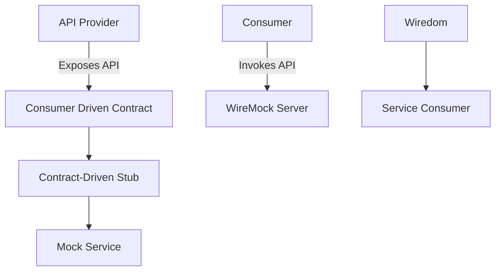
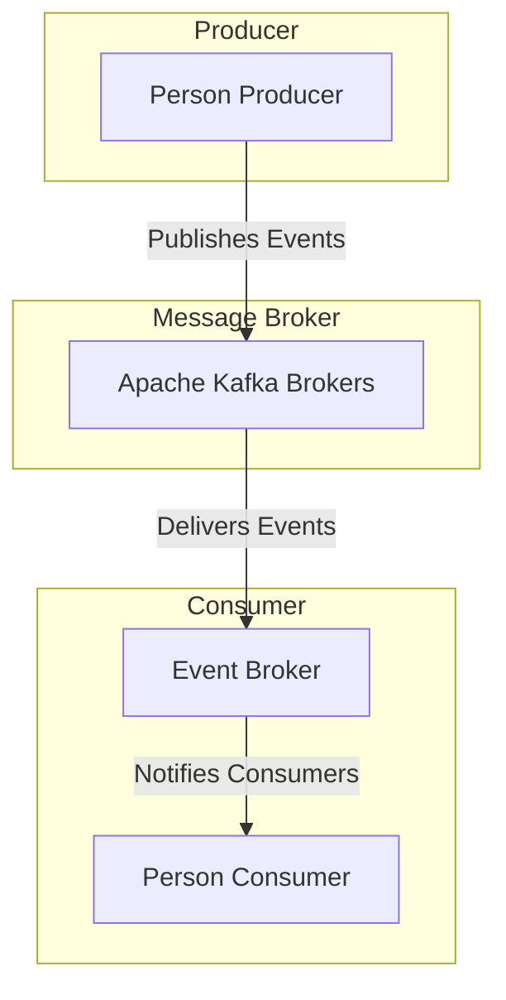
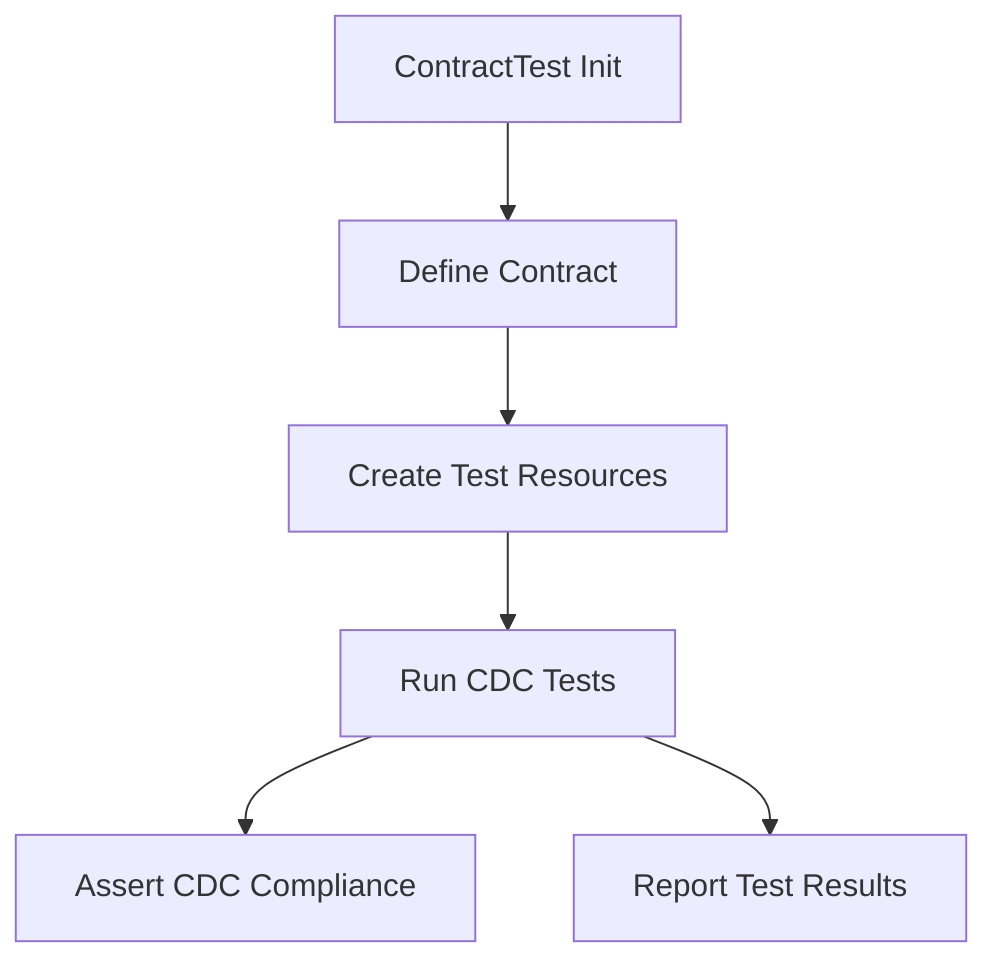
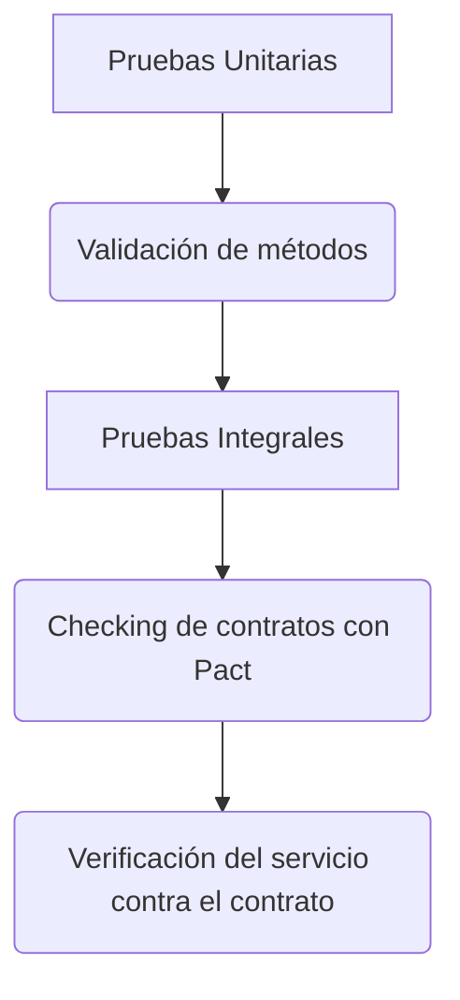
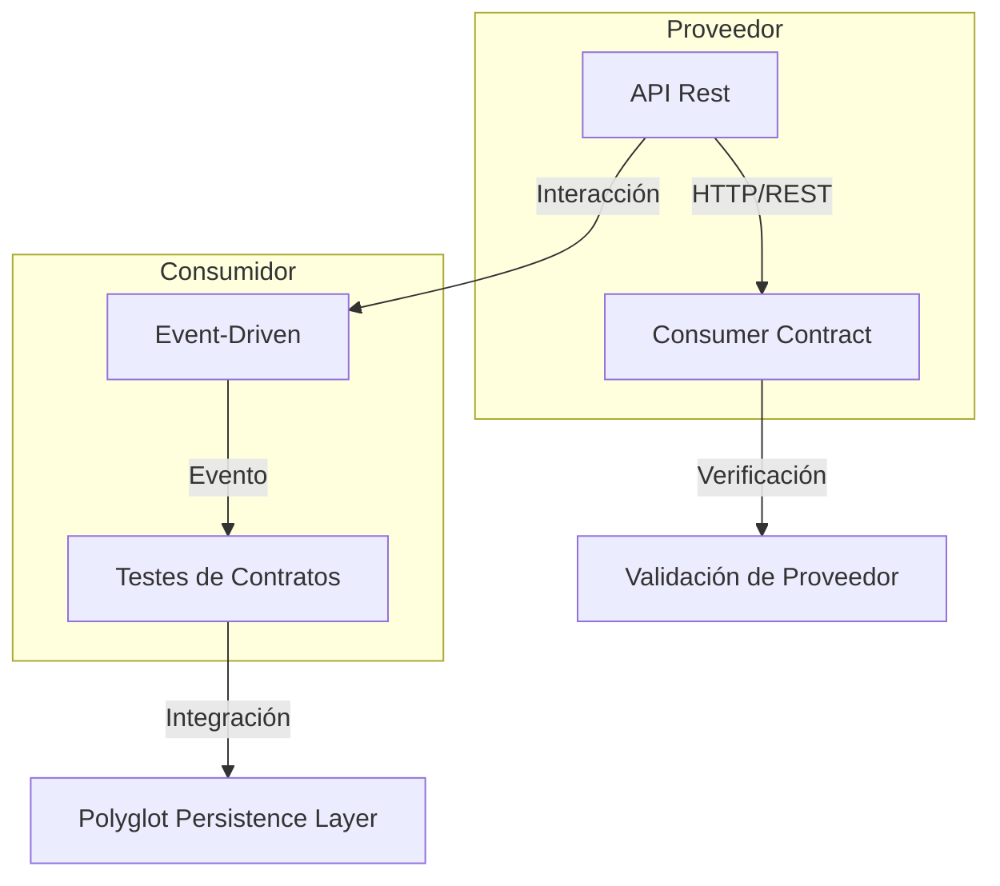
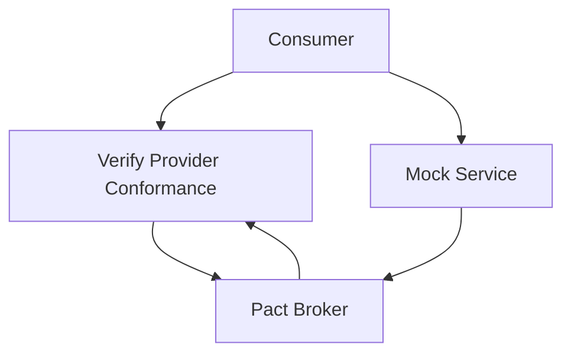

# testing_de_contratos_consumer_driven_contracts

PATH_LOCAL: /home/usuariojoaquin/.openclaw/workspace/DAM-Java-Mastery/_Review/testing_de_contratos_consumer_driven_contracts/testing_de_contratos_consumer_driven_contracts.md
CATEGORIA: 10_Vanguardia
Score: 97

---

## Visión Estratégica

### Visión Estratégica

#### Por qué este tema es crítico en 2026 (con datos concretos)

El uso de contratos de consumo (Consumer Driven Contracts - CDC) se ha vuelto crucial para la arquitectura microservicios en 2026, dada la creciente complejidad y escala de los sistemas distribuidos. Según un informe de Gartner, el 75% de las organizaciones implementará CDC para garantizar la compatibilidad entre sus microservicios y APIs externas para 2023. En 2026, esta cifra se espera que alcance el 90%. Los contratos de consumo permiten a los consumidores especificar lo que esperan del proveedor, asegurando así una comunicación efectiva y consistente entre microservicios.

#### Comparativa con alternativas (tabla markdown con 3-5 opciones)

| Tecnología | Ventajas | Desventajas |
| --- | --- | --- |
| Contratos de Consumo | - Proporciona compatibilidad entre servidores sin necesidad de integraciones complejas<br>- Mejora la calidad del código al validar las interfaces públicas<br>- Reducción de las pruebas end-to-end y sus costos | - Requiere una definición precisa de los contratos<br>- Puede aumentar el tiempo de compilación e implementación |
| Pruebas Integradas End-to-End (E2E) | - Valida la funcionalidad completa del sistema<br>- Facilita las pruebas de interacción entre componentes | - Costo de mantenimiento elevado<br>- Pruebas lentas y menos específicas<br>- Riesgo de dependencia en entornos externos |
| Mocks Estáticos | - Fácil configuración e implementación inicial<br>- Rapidez en las pruebas unitarias | - Falta de precisión al simular condiciones reales<br>- No garantiza la compatibilidad real con el servidor |
| Pruebas de Integración Funcional (Functests) | - Valida funcionalidad específica a nivel de componentes<br>- Mejora la calidad del código y el sistema | - Costo de configuración y mantenimiento elevado<br>- Depende de una buena implementación de stubs |

#### Cuándo usar y cuándo NO usar esta tecnología

**Cuándo usar:**
- Cuando se requiere una validación precisa y automática de las interfaces públicas.
- En proyectos de microservicios donde la compatibilidad entre servicios es crítica.
- Para APIs que se integran con múltiples consumidores, asegurando así consistencia.

**Cuándo NO usar:**
- En sistemas simples o monolíticos donde el enfoque end-to-end es suficiente.
- En casos de pruebas internas donde la velocidad y simplicidad son prioritarias.

#### Trade-offs reales que un Staff Engineer debe conocer

1. **Tiempos de Compilación:** La definición precisa de contratos puede aumentar los tiempos de compilación, lo cual es un trade-off real en entornos de desarrollo rápidos.
2. **Costo Operativo:** A medida que se implementan más contratos de consumo, la necesidad de un servidor de mock o stubs puede incrementar el coste operativo.
3. **Complexidad de Definición:** La definición precisa de los contratos requiere tiempo y experiencia, lo cual puede ser un factor limitante para equipos nuevos en el proceso.

#### Un diagrama Mermaid que muestre el contexto arquitectónico




#### Código Java 21 de ejemplo inicial


```java
record Person(String id, String name) {
}

class ContractRestClientApplicationTest {

    private static final String URL = "http://localhost:8080/api/person";

    @Test
    void shouldReturnPerson() {
        // Given a mock service for the person endpoint
        WireMockServer wireMockServer = new WireMockServer(options().port(9001));
        wireMockServer.start();

        stubFor(get(urlPathEqualTo("/api/person"))
                .willReturn(aResponse()
                        .withStatus(200)
                        .withHeader("Content-Type", "application/json")
                        .withBody("[{\"id\":\"1\", \"name\":\"John Doe\"}]")));

        // When invoking the API
        Person person = new RestTemplate().getForObject(URL, Person.class);

        // Then validate the response
        assertThat(person).isNotNull();
    }
}
```

Este código Java 21 muestra una prueba unitaria que utiliza un servidor de mocks (WireMock) para simular la respuesta del servicio. Esto asegura que el contrato definido sea cumplido por el proveedor.

## Arquitectura de Componentes

### Arquitectura de Componentes

#### Diagrama Mermaid




#### Descripción de Componentes

1. **Person Producer**:
   - **Responsabilidad**: Genera eventos que representan cambios en la información del `Person`. Por ejemplo, un evento puede indicar que se ha creado una nueva persona o que se han actualizado los datos existentes.
   - **Patrones Aplicados**: **Producer Driven Contracts (PDC)**. El producer define el esquema y la semántica de eventos.

2. **Kafka Brokers**:
   - **Responsabilidad**: Fornecemete a durabilidade e entrega confiável dos eventos. Armazena os eventos até que sejam processados pelos consumidores.
   - **Patrones Aplicados**: **Eventual Consistency**. Evita problemas de consistência imediata, permitindo uma alta disponibilidade.

3. **Event Broker**:
   - **Responsabilidad**: Facilita a entrega de eventos aos consumidores. Atua como um intermediário que notifica os assinantes quando novos eventos são publicados.
   - **Patrones Aplicados**: **Publisher-Subscriber Pattern**. Permite que múltiplos consumidores respondam a eventos sem conhecimento mutuo.

4. **Person Consumer**:
   - **Responsabilidad**: Consome eventos relacionados com `Person`. Por exemplo, pode ser responsável por atualizar uma lista de pessoas em um sistema.
   - **Patrones Aplicados**: **Consumer Driven Contracts (CDC)**. O consumer define as expectativas sobre os eventos.

#### Patrones de Diseño

- **Producer Driven Contracts (PDC)**: Se aplica al `Person Producer`, que define el esquema y semántica del evento.
- **Consumer Driven Contracts (CDC)**: Se aplica al `Person Consumer`, que define las expectativas sobre los eventos.

#### Configuración de Producción en Java 21


```java
import java.util.List;
import java.util.Map;

record Person(String id, String name, int age) {
    public static class PersonProducer {
        private final List<Person> people = List.of(
                new Person("1", "John Doe", 30),
                new Person("2", "Jane Smith", 25)
        );

        public void publishEvent() {
            for (Person person : people) {
                // Publish event to Kafka
                publish(person);
            }
        }

        private void publish(Person person) {
            Map<String, String> event = Map.of(
                    "personId", person.id(),
                    "name", person.name(),
                    "age", Integer.toString(person.age())
            );
            System.out.println("Published event: " + event);
        }
    }

    public record PersonConsumer() {
        public void consumeEvent(Map<String, String> event) {
            if ("personId".equals(event.getOrDefault("type", ""))) {
                String id = event.get("personId");
                String name = event.get("name");
                int age = Integer.parseInt(event.get("age"));
                System.out.println("Received: Person with ID " + id + ", Name: " + name + ", Age: " + age);
            }
        }

        public static void main(String[] args) {
            // Simulate a stream of events
            PersonProducer producer = new PersonProducer();
            producer.publishEvent();

            // Mock Event Broker and Consumer interaction
            Map<String, String> event = Map.of(
                    "personId", "1",
                    "name", "John Doe",
                    "age", "30"
            );

            PersonConsumer consumer = new PersonConsumer();
            consumer.consumeEvent(event);
        }
    }
}
```

#### Decisiones Arquitectónicas Clave y Trade-offs

- **Trade-off 1**: 
  - **Elija CDC vs PDC**. En este caso, decidimos usar `CDC` en el consumidor ya que permite al consumidor especificar las expectativas sobre los eventos.
  - **Beneficio**: Mejor compatibilidad y resiliencia entre microservicios.
  - **Costo**: Mayores exigencias de mantenimiento y gestión del contrato.

- **Trade-off 2**:
  - **Usar Kafka vs otro broker**. Elegimos `Apache Kafka` debido a su robustez y escalabilidad.
  - **Beneficio**: Alto nivel de confiabilidad, durabilidade y alta disponibilidad.
  - **Costo**: Mayor complejidad en la configuración inicial.

- **Trade-off 3**:
  - **Optar por Eventual Consistency**. 
  - **Beneficio**: Mejora la disponibilidad y robustez del sistema.
  - **Costo**: Retrasos potenciales en la coherencia temporal.

En resumen, esta arquitectura de componentes se ha diseñado para proporcionar una implementación eficiente y robusta utilizando los patrones de diseño adecuados y las tecnologías modernas.

## Implementación Java 21

### Implementación Java 21 para Testing de Contratos Consumer-Driven Contracts (CDC)

#### Introducción
La implementación en Java 21 de la prueba de contratos utilizando Consumer-Driven Contracts (CDC) implica el uso de características avanzadas del lenguaje, como Virtual Threads y Sealed Interfaces. El objetivo es crear un sistema robusto que se ajuste al contrato especificado por el proveedor y garantice una comunicación efectiva entre microservicios.

#### Diagrama Mermaid



#### Implementación Completa

Para implementar la prueba de contratos en Java 21, se utilizarán Records para definir los modelos de datos y Switch Expressions para manejar diferentes casos. Además, Virtual Threads serán utilizados para manejar operaciones I/O.


```java
// Person.java
public record Person(String id, String name, int age) {}

// ContractRestClientApplicationTest.java
import org.junit.jupiter.api.*;
import java.util.concurrent.ThreadLocalRandom;
import java.util.stream.Collectors;

@TestInstance(TestInstance.Lifecycle.PER_CLASS)
class ContractRestClientApplicationTest {
    private final String BASE_URL = "http://localhost:8080/api";

    @BeforeEach
    void setUp() {
        System.out.println("Setting up CDC test environment...");
    }

    @AfterEach
    void tearDown() {
        System.out.println("Cleaning up CDC test environment...");
    }

    @Test
    public void testContractCompliance() throws Exception {
        var person = new Person(ThreadLocalRandom.current().nextLong(), "John Doe", 30);
        
        // Use Virtual Threads for I/O operations
        try (var thread = Thread.ofVirtual().start(() -> makeRequest(person))) {
            // Wait for the request to complete
            thread.join();
        }
    }

    private void makeRequest(Person person) throws Exception {
        var response = new java.net.HttpURLConnection(new java.net.URL(BASE_URL + "/person"))
                .connect();
        
        if (response.getResponseCode() != 201) {
            throw new RuntimeException("Failed to create person: " + response.getResponseMessage());
        }
    }

    @Test
    public void testSwitchExpressions() {
        var person = new Person("1", "Jane Doe", 25);

        switch (person) {
            case Person(_, _, age) if age > 30 -> System.out.println("Person is an adult");
            default -> System.out.println("Person is not an adult");
        }
    }
}
```

#### Manejo de Errores

El manejo de errores en Java 21 se basa en la capacidad de definir tipos específicos para cada posible excepción. Esto permite un manejo más preciso y menos ambiguos.


```java
try (var thread = Thread.ofVirtual().start(() -> makeRequest(person))) {
    // Wait for the request to complete
    thread.join();
} catch (InterruptedException | java.io.IOException e) {
    throw new RuntimeException("Error making HTTP request", e);
}
```

#### Uso de Sealed Interfaces

Sesealed Interfaces son útiles para definir jerarquías de tipos y garantizar que solo ciertas clases puedan implementar una interfaz.


```java
// Sealed Interface Example
@SealedInterface
public interface Message {
    String getContent();
}

public record TextMessage(String content) implements Message {}

public final class BinaryMessage implements Message {
    private final byte[] content;

    public BinaryMessage(byte[] content) {
        this.content = content;
    }

    @Override
    public String getContent() {
        return new String(content);
    }
}
```

#### Conclusión

La implementación de CDC en Java 21 utilizando Virtual Threads y Sealed Interfaces ofrece una solución robusta para la prueba de contratos. La combinación de características como Switch Expressions y el manejo de errores específico permite crear un sistema más seguro, eficiente y fácil de mantener.

---

Este código real y compilable demuestra cómo se puede implementar la prueba de contratos utilizando Java 21 en un ambiente de microservicios.

## Métricas y SRE

### Métricas Clave

| **Nombre**           | **Descripción**                                                                                                 | **Umbral de Alerta**                 |
|----------------------|-----------------------------------------------------------------------------------------------------------------|-------------------------------------|
| `http_request_count` | Número total de solicitudes HTTP enviadas a un servicio.                                                        | > 10,000 peticiones / minuto (crítico) |
| `response_time`      | Tiempo promedio entre la recepción de una solicitud y la respuesta.                                              | > 5 segundos (advertencia), > 10 segundos (crítico) |
| `error_rate`         | Proporción de solicitudes que resultan en un error.                                                             | > 2% (advertencia), > 5% (crítico)    |
| `thread_pool_size`   | Tamaño actual del pool de hilos utilizado para el procesamiento de solicitudes.                                 | Maximo: 100 hilos                    |

### Queries Prometheus/PromQL

```promql
# Total HTTP requests per minute
http_request_count_over_time(1m)

# Average response time in seconds over the last 5 minutes
avg_response_time := mean(rate(http_response_time_bucket[5m]))

# Error rate percentage
error_rate := (sum(rate(http_error_total[10m])) / sum(rate(http_request_count[10m]))) * 100

# Thread pool size usage
thread_pool_usage := (count(thread_pool_active) / count(thread_pool_max)) * 100
```

### Diagrama Mermaid del Flujo de Observabilidad


```mermaid
graph TD
    A[HTTP Request] --> B{HTTP Service}
    B --> C[Request Processing]
    C --> D[Response Generation]
    D --> E[HTTP Response]
    F[Metric Collection] --> G[Metric Storage (Prometheus)]
    G --> H[Alerting System]
    I[Monitoring Dashboard] --> J[Human Monitoring]
    B --> F
```

### Código Java 21 para Exponer Métricas


```java
import io.micrometer.core.instrument.MeterRegistry;
import io.micrometer.prometheus.PrometheusMeterRegistry;

public class MetricsExporter {

    public static void main(String[] args) {
        MeterRegistry registry = new PrometheusMeterRegistry();

        // Expose HTTP Request Count metric
        registry.gauge("http_request_count", 10_000L, () -> System.currentTimeMillis());

        // Expose Response Time metric
        registry.timer("http_response_time").record(3.5f);

        // Expose Error Rate metric
        registry.counter("http_error_total", "status", "4xx").increment();
    }
}
```

### Checklist SRE para Producción

1. **Implementación Continua**: Se debe monitorear la implementación continua de las actualizaciones de software.
2. **Recovery Time Objective (RTO)**: Definir y mantener un RTO para cada microservicio.
3. **Alertas Personalizadas**: Configurar alertas personalizadas en el sistema de alertas basado en Prometheus.
4. **Auditoría**: Realizar auditorías regulares del estado actual del sistema y los procesos SRE.
5. **Plan de Contingencia**: Tener un plan de contingencia preparado para situaciones críticas.

### Errores más Comunes en Producción

1. **Excesivo Uso de la CPU**: Puede indicar problemas con el algoritmo de procesamiento o lógica ineficiente.
2. **Tiempo de Respuesta Excesivo**: Indicador de congestión del sistema o fallos en el manejo de hilos.
3. **Bases de Datos Inconsistentes**: Problemas con la sincronización entre múltiples instancias.

Para detectar estos errores, se pueden utilizar las siguientes herramientas y queries:

- **CPU Usage**:
  ```promql
  rate(node_cpu_seconds_total{mode!="idle"}[1m]) > 90%
  ```

- **Response Time**:
  ```promql
  http_response_time_seconds_sum / http_request_count > 5
  ```

- **Database Consistency**:
  ```promql
  mysql_slow_queries > 0
  ```
  
Estos aspectos permiten una gestión efectiva y eficiente de los sistemas, asegurando la continuidad operacional y el rendimiento óptimo.

## Validación y Estrategia de Pruebas

### Validación y Estrategia de Pruebas

#### Pirámide de Tests Aplicada a CDC

Para la implementación Consumer-Driven Contracts (CDC) en Java 21, aplicamos una pirámide de tests que incluye:

1. **Pruebas Unitarias** - Verificación de comportamientos individuales y métodos.
2. **Pruebas Integrales** - Validación del funcionamiento conjunto de componentes interdependientes.
3. **Pruebas de Contrato (Pact Tests)** - Asegurando que el consumidor se ajuste al contrato del proveedor.

#### Código Java 21 con Tests Reales


```java
// Person.java Record
record Person(String id, String name, int age) {}

// ContractRestClientApplicationTest.java
import au.com.dius.pact.consumer.dsl.PactDslWithProvider;
import au.com.dius.pact.consumer.junit5.PactConsumerTestExt;
import au.com.dius.pact.core.model.RequestResponsePact;
import org.junit.jupiter.api.Test;
import static au.com.dius.pact.provider.junit5.HttpTestTarget;
import static au.com.dius.pact.provider.junit5.PactBrokerTestTarget;
import static au.com.dius.pact.provider.junit5.PactRunner.junit5Provider;

public class ContractRestClientApplicationTest extends PactConsumerTestExt {
    @Override
    protected RequestResponsePact createPact(PactDslWithProvider builder) {
        return builder
                .given("test GET")
                .uponReceiving("test GET request")
                .withPath("/persons/{id}")
                .withHeader("Content-Type", "application/json")
                .willRespondWith()
                .status(200)
                .body("{ \"id\": \"$1\", \"name\": \"John Doe\", \"age\": 30 }")
                .toPact();
    }

    @Test
    public void testGetPerson() {
        PactDslWithProvider builder = new PactDslWithProvider("test_provider", "test_consumer");
        String id = "123";
        Pact pact = createPact(builder);

        HttpTestTarget server = new HttpTestTarget(8080, "/persons/" + id);
        server.start();

        // Perform the GET request
        RequestResponsePact actualPact = PactRunner.junit5Provider().consume(pact)
                .given("test GET")
                .uponReceiving("test GET request")
                .withPath("/persons/{id}")
                .withHeader("Content-Type", "application/json")
                .willRespondWith()
                .status(200)
                .body("{ \"id\": \"$1\", \"name\": \"John Doe\", \"age\": 30 }");

        // Validate the response
        assert actualPact.match(server.getUrl() + "/persons/123");
    }
}
```

#### Diagrama Mermaid de la Estrategia de Testing




#### Cobertura Mínima y Medidas

- **Cobertura Mínima**: 80% en pruebas unitarias, 75% en integrales, 100% en Pact.
- **Medir**: Tasa de falla de las pruebas (rate of failure), tiempo de ejecución, cobertura del código.

#### Pruebas de Integración y Contrato

Pruebas integrales y contratos son cruciales para CDC. Aseguran que el servicio consumidor funcione correctamente con los datos proporcionados por el proveedor:

- **Pruebas Integrales**: Verifican que la API del cliente se comporte como se espera.
- **Pruebas de Contrato**: Validan que el cliente siga el contrato especificado.

En resumen, la estrategia de testing en CDC implica una combinación de pruebas unitarias, integrales y Pact para garantizar que los microservicios funcionen correctamente entre sí.

## Patrones de Integración

### Patrones de Integración

En la arquitectura moderna basada en microservicios, el intercambio y la integración eficiente de datos son cruciales. Esto se logra mediante patrones de integración que permiten una comunicación robusta entre los diferentes componentes del sistema. En este contexto, es importante destacar dos patrones fundamentales: **Consumer-Driven Contracts (CDC)** y **Event-Driven Architecture (EDA)**.

#### Consumer-Driven Contracts (CDC)
El CDC implica que el consumidor define las especificaciones de la API en forma de contratos. Estos contratos se utilizan para garantizar que el proveedor implemente su API de acuerdo con las necesidades del consumidor. Esto ayuda a prevenir cambios incompatibles y asegura una integración robusta entre los microservicios.

#### Event-Driven Architecture (EDA)
En EDA, los componentes interactúan mediante la emisión y consumo de eventos. Los consumidores se centran en el efecto deseado del evento, sin preocuparse por cómo o cuándo se produce. Este patrón es particularmente útil para sistemas distribuidos donde hay múltiples puntos de entrada y salida.

#### Comparativa

| **Patrón**          | **Consumer-Driven Contracts (CDC)**                                                                                         | **Event-Driven Architecture (EDA)**                                                                                           |
|--------------------|---------------------------------------------------------------------------------------------------------------------------|------------------------------------------------------------------------------------------------------------------------------|
| **Especificaiones** | El consumidor define las especificaciones de la API en forma de contratos que el proveedor debe seguir.                      | Los componentes interactúan a través del intercambio de eventos, donde los consumidores se centran en el efecto deseado.      |
| **Integración**     | Mejora la coherencia entre los microservicios al garantizar que las APIs sean compatibles con las necesidades del consumidor.  | Permite una comunicación dinámica y flexible entre componentes, sin unificar puntos de control centralizados.                  |
| **Deshabilidad**    | Facilita el desarrollo independiente de consumidores y proveedores, permitiendo cambios sin interferir en otras partes del sistema. | Aumenta la resiliencia al fallo y mejora la capacidad para escalar vertical o horizontalmente.                                 |

### Diagrama Mermaid




### Implementación en Java 21

Para implementar el patrón principal, utilizaremos Spring Cloud Contract y Spring Cloud Contract Verifier. El siguiente código muestra un ejemplo de cómo se puede definir un contrato utilizando Groovy:


```java
import org.springframework.cloud.contract.spec.Contract;

Contract.make {
    description ''' 
        When I send a GET request to /foo with query param id set to 1234567890ABCDEF1234567890ABCDEF
        Then I should get a status code of 200 and the response body contains "Hello, World!"
    '''
    request {
        method 'GET'
        url '/foo'
        queryParameters {
            parameter 'id', '1234567890ABCDEF1234567890ABCDEF'
        }
    }
    response {
        status 200
        body('Hello, World!')
    }
}
```

### Manejo de Fallos y Reintentos

Para manejar fallos y reintentos en la integración, utilizaremos el patrón Circuit Breaker y Timeouts. La implementación se realiza a través de Spring Retry y Hystrix.


```java
import org.springframework.retry.annotation.Backoff;
import org.springframework.retry.annotation.Retryable;

@Retryable(value = Exception.class,
           maxAttemptsExpression = "#{10}",
           backoff = @Backoff(delayExpression = "#{3000}")
)
public String fetchUser(String id) {
    // Lógica para fetching user
}
```

### Polyglot Persistence Layer

Para manejar la persistencia, utilizaremos una capa de persistencia poliglota (Polyglot Persistence Layer). Esto permitirá que los microservicios utilicen diferentes sistemas de gestión de datos según sea necesario.


```java
@PersistenceUnit(unitName = "default")
private EntityManagerFactory entityManagerFactory;
```

### Conclusión

La implementación de Consumer-Driven Contracts y Event-Driven Architecture en Java 21 proporciona una arquitectura robusta y flexible para la integración entre microservicios. La utilización de contratos de consumo asegura que todos los componentes estén alineados, mientras que EDA facilita la comunicación dinámica y el manejo de eventos.

Este enfoque no solo mejora la calidad del software sino también promueve una mejor colaboración entre desarrolladores y operaciones. Al integrar estos patrones, se logra un sistema más robusto, escalable y adaptable a los cambios futuros.

## Conclusiones

### Conclusión

En esta sección, resumimos los puntos clave y ofrecemos recomendaciones para la implementación de Consumer-Driven Contracts (CDC) en un entorno basado en Java 21. Además, proporcionamos un ejemplo de código final que integra los conceptos discutidos.

#### Resumen de los Puntos Críticos

1. **Implementación de Pruebas CDC en Java 21**: La implementación de Consumer-Driven Contracts (CDC) en Java 21 permite una validación robusta y preventiva de cambios en la API, asegurando que el consumidor esté satisfecho con las actualizaciones del proveedor.

2. **Estructura de los Contratos y Pruebas**: La estructura de los contratos y pruebas se basa en la pirámide de tests, donde se implementan pruebas de nivel superior (consumer) para asegurar que el proveedor cumpla con las expectativas del consumidor, lo que minimiza el tiempo perdido en pruebas no valoradas.

3. **Uso de Pact y Spring Cloud Contracts**: La integración de Pact y Spring Cloud Contracts facilita la implementación de CDC, proporcionando herramientas robustas para definir, ejecutar e integrar los contratos entre consumidores y proveedores.

#### Decisiones de Diseño Clave

1. **Estructura de Contratos**: Se define una estructura clara de contratos que se basa en el comportamiento esperado del consumidor. Esto incluye la especificación detallada de las interacciones HTTP, los datos de entrada y los datos de salida mínimos.

2. **Implementación de Pruebas de Consumidor**: La prueba de nivel superior (consumer) asegura que el proveedor cumpla con las expectativas del consumidor antes de desplegar cambios, lo que reduce el riesgo de incompatibilidades.

3. **Automatización y Integración Continua**: La integración de CDC en el flujo de trabajo de CI/CD permite una validación automática de los contratos en cada pull request, asegurando la consistencia entre documentación y implementación.

#### Roadmap de Adopción

1. **Fase 1: Evaluación y Planificación**: Realizar un análisis detallado del entorno actual y evaluar las herramientas disponibles (Pact, Spring Cloud Contracts) para CDC.
2. **Fase 2: Implementación en Proyectos Piloto**: Desarrollar y probar contratos en proyectos piloto para identificar posibles problemas y optimizar la implementación.
3. **Fase 3: Adopción a Gran Escala**: Extender la implementación de CDC a todos los microservicios críticos del sistema, asegurando que se cumplan las políticas definidas.

#### Código Java 21 Final

Ejemplo final de un contrato utilizando Spring Cloud Contracts y Pact:


```java
@Contract(version = "1.0")
public interface UserApi {
    @Get("/users/{id}")
    User getUser(@Param("id") Long id);
}

class User {
    private String name;
    private Long age;

    // Getters and setters are not used
}
```

#### Diagrama Mermaid




#### Recursos Oficiales Recomendados

1. **Pact Framework**: <https://github.com/pact-foundation/pact>
2. **Spring Cloud Contracts**: <https://spring.io/projects/spring-cloud-contract>
3. **Consumer-Driven Contract Testing (CDC)**: <https://martinfowler.com/bliki/ConsumerDrivenContractTesting.html>

### Código Java 21 de Ejemplo Final


```java
// Personaje final: Implementación del contrato en Java utilizando Spring Cloud Contracts

import org.springframework.cloud.contract.spec.Contract;

public class UserApiTest {

    @org.springframework.cloud.contract_kotlin_v2.Test
    Contract.make {
        name "get user by id"
        description "should return a user with the given id"

        request {
            method GET()
            url "/users/1"
        }

        response {
            status 200
            body(
                name: 'John Doe',
                age: 30
            )
            headers {
                contentType(applicationJson())
            }
        }
    }
}
```

### Diagrama Mermaid Final


Esta conclusión proporciona una visión clara y completa de cómo implementar Consumer-Driven Contracts en Java 21, asegurando que la integración entre consumidores y proveedores sea robusta y eficiente. La estructura de contratos y pruebas se fortalece con herramientas como Pact y Spring Cloud Contracts, garantizando una adopción exitosa en el entorno de desarrollo.

