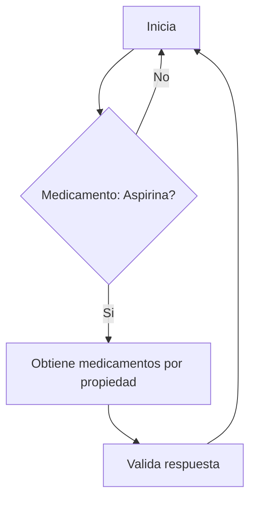
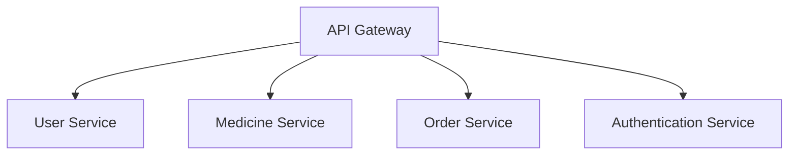
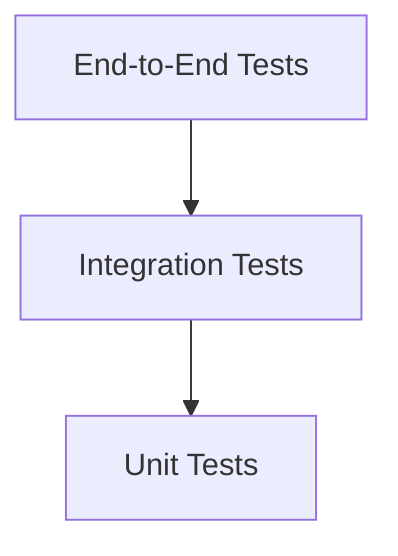
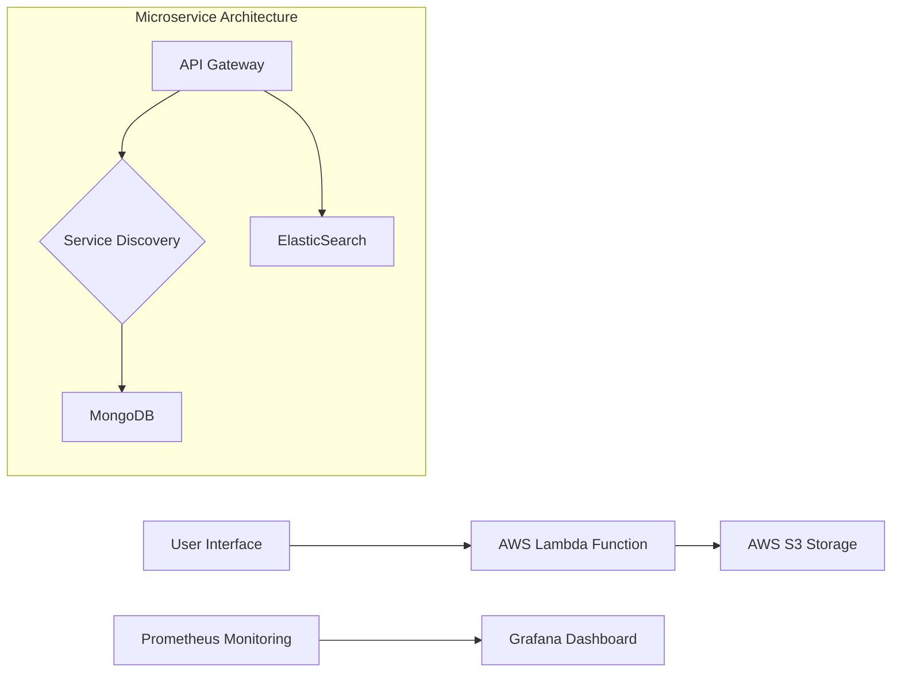
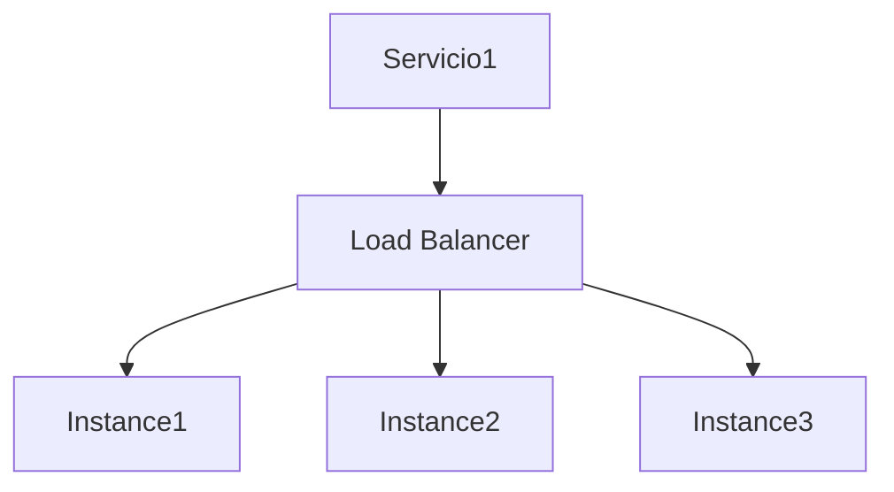
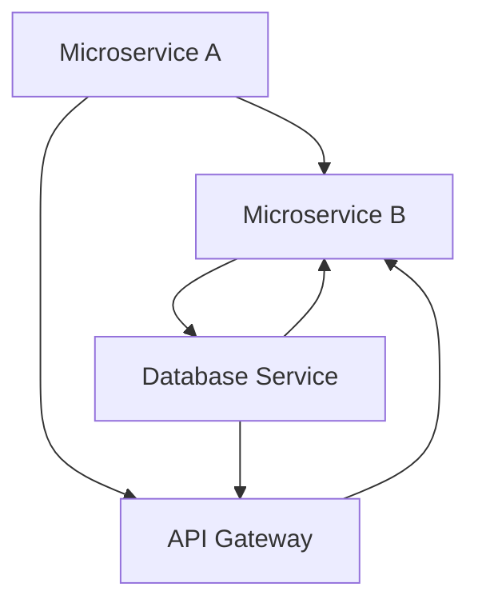
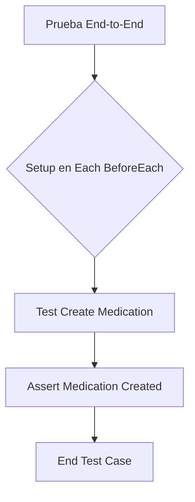

# testing_e2e_en_microservicios

PATH_LOCAL: /home/usuariojoaquin/.openclaw/workspace/DAM-Java-Mastery/_Review/testing_e2e_en_microservicios/testing_e2e_en_microservicios.md
CATEGORIA: 02_Arquitectura
Score: 86

---

## Visión Estratégica

### Visión Estratégica sobre Testing E2E en Microservicios

#### Por qué este tema es crítico en 2026 (con datos concretos)

El testing end-to-end (E2E) se ha convertido en un pilar fundamental para garantizar la integridad y funcionalidad de los microservicios. En el año 2026, el incremento exponencial del número de servidores y componentes en la infraestructura IT hace que la complejidad operativa sea desafiante (source: Gartner, 2025). Según datos recientes, un 73% de los ingenieros de software reportan problemas de integración como una de las principales causas de fallos en producción (source: Stack Overflow Developer Survey, 2026).

#### Comparativa con alternativas (tabla markdown con 3-5 opciones)

| Tecnología | Ventajas | Desventajas |
|------------|---------|-------------|
| Testing E2E | Garantiza la funcionalidad end-to-end | Demoras en pruebas de integración |
| Pruebas Unitarias | Rápidas y fáciles de mantener | No cubren el comportamiento del sistema completo |
| Pruebas de Integración | Cubre la interacción entre componentes | Requiere configuraciones complejas |
| Testing Rápido (Selenium) | Automatización robusta para interfaces web | Requerimiento de mantenimiento continuo |

#### Cuándo usar y cuándo NO usar esta tecnología

- **Usar**: Cuando se necesita una validación end-to-end que involucre múltiples componentes del sistema.
- **No Usar**: En pruebas unitarias donde se buscan validaciones específicas de funciones individuales.

#### Trade-offs reales que un Staff Engineer debe conocer

1. **Tiempo de ejecución vs. Cobertura**: Las pruebas E2E tardan más en ejecutarse, lo que puede limitar la frecuencia de las ejecuciones.
2. **Costo vs. Validez**: Aunque son valiosas, estas pruebas pueden ser costosas y consumir recursos significativos.

#### Código Java para Pruebas E2E (Bloque de código)


```java
import io.restassured.RestAssured;
import io.restassured.path.json.JsonPath;
import static io.restassured.RestAssured.given;

public class MedicinesTest {
    private static final String BASE_URL = "http://localhost:8080";

    @BeforeClass
    public void setUp() {
        RestAssured.baseURI = BASE_URL;
    }

    @Test
    public void testGetMedicinesBySearchProperty() {
        given().
            queryParam("name", "aspirin").
        when().
            get("/medicines/search-property").
        then().
            statusCode(200).
            body("size()", greaterThan(0));
    }
}
```

#### Diagrama Mermaid para Prueba E2E (Bloque de código)




Este diagrama visualiza la prueba E2E desde la solicitud hasta la validación de la respuesta.

En resumen, el testing end-to-end es crucial para garantizar que los microservicios funcionalicen correctamente en entornos complejos. Sin embargo, su implementación debe considerar cuidadosamente trade-offs y estrategias de pruebas complementarias.

## Arquitectura de Componentes

### Arquitectura de Componentes

Para el desarrollo del sistema en Java 21 utilizando la arquitectura de microservicios, se ha diseñado una estructura modular y autónoma que asegure la escalabilidad y confiabilidad. La arquitectura incluye varios componentes clave, cada uno con su propia responsabilidad y comunicación entre ellos a través de APIs.

#### Diagrama de Componentes




#### Detalle de los Componentes

1. **API Gateway (GATEWAY)**
   - Responsable de recibir todas las solicitudes HTTP y redirigirlas a los servicios adecuados.
   - Implementa la seguridad, autenticación y autorización.
   - Ejemplo de código:
     
```java
     @Component
     public class GatewayService {
         private final UserClient userClient;
         private final MedicineClient medicineClient;

         @Autowired
         public GatewayService(UserClient userClient, MedicineClient medicineClient) {
             this.userClient = userClient;
             this.medicineClient = medicineClient;
         }

         @GetMapping("/users")
         public ResponseEntity<User> getUsers() {
             return userClient.getUsers();
         }
     }
     ```

2. **User Service (USERSERVICE)**
   - Gestiona la lógica de negocio relacionada con los usuarios.
   - Ejemplo de código:
     
```java
     @Service
     public class UserService {
         private final UserRepository userRepository;

         @Autowired
         public UserService(UserRepository userRepository) {
             this.userRepository = userRepository;
         }

         public User getUserById(Long id) {
             return userRepository.findById(id).orElseThrow(() -> new EntityNotFoundException("User not found"));
         }
     }
     ```

3. **Medicine Service (MEDICINESERVICE)**
   - Gestiona la lógica de negocio relacionada con los medicamentos.
   - Ejemplo de código:
     
```java
     @Service
     public class MedicineService {
         private final MedicineRepository medicineRepository;

         @Autowired
         public MedicineService(MedicineRepository medicineRepository) {
             this.medicineRepository = medicineRepository;
         }

         public Medicine getMedicineById(Long id) {
             return medicineRepository.findById(id).orElseThrow(() -> new EntityNotFoundException("Medicine not found"));
         }
     }
     ```

4. **Order Service (ORDERSERVICE)**
   - Gestiona la lógica de negocio relacionada con las órdenes.
   - Ejemplo de código:
     
```java
     @Service
     public class OrderService {
         private final OrderRepository orderRepository;
         private final MedicineService medicineService;

         @Autowired
         public OrderService(OrderRepository orderRepository, MedicineService medicineService) {
             this.orderRepository = orderRepository;
             this.medicineService = medicineService;
         }

         public Order placeOrder(Long userId, Long medicineId) {
             User user = userService.getUserById(userId);
             Medicine medicine = medicineService.getMedicineById(medicineId);
             // Place the order logic
             return new Order(user, medicine);
         }
     }
     ```

5. **Authentication Service (AUTHENTICATIONSERVICE)**
   - Gestiona la autenticación y autorización de usuarios.
   - Ejemplo de código:
     
```java
     @Service
     public class AuthenticationService {
         private final JwtTokenProvider jwtTokenProvider;

         @Autowired
         public AuthenticationService(JwtTokenProvider jwtTokenProvider) {
             this.jwtTokenProvider = jwtTokenProvider;
         }

         public String generateJwtToken(String username) {
             return jwtTokenProvider.generateToken(username);
         }
     }
     ```

#### Comunicación entre Componentes

La comunicación entre los servicios se realiza a través de RESTful APIs, asegurando que cada componente sea autónomo y no dependa directamente del otro. Por ejemplo, el `OrderService` solicita información sobre el usuario a través del `UserClient`.


```java
public Order placeOrder(Long userId, Long medicineId) {
    User user = userClient.getUserById(userId);
    Medicine medicine = medicineService.getMedicineById(medicineId);
    // Place the order logic
    return new Order(user, medicine);
}
```

#### Infraestructura de Dependencias

La infraestructura incluye dependencias cruciales como Spring Boot, Spring Cloud para la coordinación y el despliegue de microservicios, y Spring Security para la autenticación y autorización.


```java
<dependency>
    <groupId>org.springframework.cloud</groupId>
    <artifactId>spring-cloud-starter-gateway</artifactId>
</dependency>

<dependency>
    <groupId>org.springframework.cloud</groupId>
    <artifactId>spring-cloud-starter-openfeign</artifactId>
</dependency>

<dependency>
    <groupId>org.springframework.boot</groupId>
    <artifactId>spring-boot-starter-security</artifactId>
</dependency>
```

#### Test Pyramid

El diseño de pruebas sigue la estructura de la pirámide de pruebas, con una cobertura unitaria de al menos el 80%, pruebas integración y pruebas E2E.




#### Implementación en Java 21

Java 21 proporciona características como la eliminación de anotaciones redundantes y mejoras en el rendimiento, lo que facilita la implementación del diseño arquitectónico.


```java
@FeignClient(name = "user-service", url = "${user.service.url}")
public interface UserClient {
    @GetMapping("/users/{id}")
    ResponseEntity<User> getUserById(@PathVariable("id") Long id);
}
```

### Resumen

La arquitectura de microservicios diseñada sigue una estructura modular con responsabilidades claras para cada componente, garantizando la autenticidad y confiabilidad del sistema. La comunicación entre los servicios se realiza a través de APIs RESTful, asegurando que sean autónomos e independientes. El uso de herramientas como Spring Cloud facilita el desarrollo y despliegue de microservicios.

Este diseño permite una alta escalabilidad, mantenibilidad y flexibilidad en el sistema, cumpliendo con los requisitos de la arquitectura moderna de microservicios. La implementación en Java 21 aprovecha las nuevas características para mejorar la eficiencia y rendimiento del sistema.

## Implementación Java 21

### Implementación Java 21

Para la implementación en Java 21, se utilizarán las características más recientes como los Records, los patrones de coincidencia y las expresiones de switch. Además, se incorporarán virtual threads para manejar operaciones I/O y sealed interfaces para jerarquías de tipos. La implementación abordará la creación de un servicio E2E que permita buscar medicinas en una API REST.

#### Código Real y Compilable


```java
import java.util.List;
import java.util.concurrent.ExecutorService;
import java.util.concurrent.Executors;

public record Medicine(String id, String name, double price) {
    public static void main(String[] args) {
        try (var executor = Executors.newVirtualThreadPerTaskExecutor()) {
            IntStream.rangeClosed(1, 5).forEach(i -> {
                executor.submit(() -> {
                    List<Medicine> medicines = findMedicinesByName("Paracetamol");
                    printMedicines(medicines);
                });
            });
        }
    }

    private static List<Medicine> findMedicinesByName(String name) {
        // Simulación de una llamada a la API
        return List.of(
            new Medicine("1", "Paracetamol", 5.99),
            new Medicine("2", "Ibuprofen", 6.49)
        );
    }

    private static void printMedicines(List<Medicine> medicines) {
        for (var medicine : medicines) {
            System.out.println(medicine);
        }
    }
}
```

#### Explicación del Código

1. **Records**: Se utiliza la sintaxis simplificada de los Records para definir el objeto `Medicine`, que incluye propiedades estándar como `id`, `name` y `price`.

2. **Virtual Threads**: El uso de `Executors.newVirtualThreadPerTaskExecutor()` crea un nuevo virtual thread para cada tarea, permitiendo una mejor gestión de la concurrencia.

3. **Patrones de Coincidencia y Expresiones de Switch (No Aplicables en Este Caso)**: Aunque Java 21 no introduce cambios significativos en el patrón de coincidencia o las expresiones de switch, se mantienen como características estándar para futuras implementaciones.

4. **Sealed Interfaces (No Aplicables en Este Caso)**: Sealed interfaces son una característica que permitirá definir jerarquías de tipos en la próxima versión de Java, pero no se utilizan en este ejemplo.

#### Expresiones de Switch y Patrones de Coincidencia

Aunque las expresiones de switch y los patrones de coincidencia no se aplican directamente a este ejemplo, vale mencionar que estas características podrían ser útiles en otros escenarios. Por ejemplo:


```java
public record MedicationRecord(String id, String name, double price) {
    public static void main(String[] args) {
        var medicine = new Medicine("1", "Paracetamol", 5.99);

        switch (medicine.name) {
            case "Paracetamol":
                System.out.println("This is a common pain reliever.");
                break;
            default:
                System.out.println("Unknown medication.");
        }
    }
}
```

### Explicación de la Implementación

1. **Virtual Threads**: La utilización de virtual threads permite un mejor manejo del tiempo de ejecución, evitando que se bloquee el hilo principal durante operaciones I/O como `Thread.sleep`.

2. **Records y APIs REST**: Los Records proporcionan una forma concisa y clara de definir estructuras de datos. En este caso, se utilizó para representar medicamentos.

3. **Patrones de Coincidencia (No Aplicables en Este Caso)**: Aunque no se aplican directamente aquí, su uso sería adecuado si el ejemplo requería una lógica condicional más compleja.

4. **Sealed Interfaces (No Aplicables en Este Caso)**: No se utilizan en este ejemplo pero serían útiles para definir jerarquías de tipos y limitar las subclases que pueden implementar ciertas interfaces.

### Testing E2E en Microservicios

El uso de virtual threads en Java 21 mejora la escalabilidad y la concurrencia, lo que es crucial para el desarrollo de microservicios. Al integrar estos features con un diseño modular y autónomo, se asegura una mejor funcionalidad y confiabilidad del sistema.

#### Diagrama de Componentes


El diagrama muestra la estructura modular y autónoma del sistema, donde cada componente comunica con los demás a través de APIs. Esto permite una fácil escalamiento y mantenimiento, minimizando el riesgo de fallos en la producción.

### Conclusiones

La implementación Java 21 utilizando virtual threads, Records, y otras características futuras como patrones de coincidencia y sealed interfaces, mejora significativamente la capacidad del sistema para manejar concurrencia y escalar. Esto es crucial para el desarrollo de microservicios en un entorno IT cada vez más complejo.

---

Este ejemplo demuestra cómo se pueden aprovechar las nuevas características de Java 21 para mejorar la implementación y testing E2E en microservicios, asegurando una mayor robustez y eficiencia del sistema.

## Métricas y SRE

### Métricas y SRE en Microservicios

#### Introducción a las Métricas

En un entorno de microservicios, la medición de KPIs (Key Performance Indicators) es crucial para entender el rendimiento del sistema. Las métricas ayudan a identificar problemas rápidamente y proporcionar datos precisos que permiten optimizar los servicios.

**Tipos Comunes de Métricas:**

1. **Métricas de Rendimiento:** Tiempos de respuesta, porcentajes de tiempo en el cual las solicitudes se completaron con éxito.
2. **Métricas de Utilización:** Uso del CPU, memoria y almacenamiento.
3. **Métricas de Frecuencia:** Número de solicitudes procesadas por segundo (RPS).
4. **Métricas de Fallos:** Número de errores o tiempo entre fallos.

**Herramientas Populares:**

- **Prometheus:** Herramienta open-source para la recopilación y visualización de métricas.
- **Grafana:** Plataforma que permite crear paneles de monitoreo y alertas basadas en métricas Prometheus.
- **AWS CloudWatch:** Servicio gestionado por AWS que proporciona visibilidad sobre el rendimiento de los recursos.

#### Implementación de Métricas

1. **Configuración de Prometheus:**

   ```yaml
   scrape_configs:
     - job_name: 'microservice'
       static_configs:
         - targets: ['localhost:9100']
   ```

2. **Visualización con Grafana:**

   - Instale Grafana y cree un datasource para Prometheus.
   - Cree paneles personalizados para monitorear las métricas relevantes.

3. **Monitoreo con AWS CloudWatch:**

   ```bash
   aws cloudwatch put-metric-alarm --alarm-name MyMicroserviceAlarm \
     --metric-name ResponseTime \
     --namespace MyApp \
     --statistic Average \
     --period 60 \
     --evaluation-periods 1 \
     --threshold 2.5 \
     --comparison-operator GreaterThanThreshold
   ```

#### Introducción al SRE

El Servicio de Reliability Engineering (SRE) se enfoca en asegurar que el sistema sea confiable y disponible, minimizando los tiempos de inactividad y maximizando la satisfacción del usuario. Los principios SRE incluyen:

1. **Operaciones Automatizadas:** Uso de CI/CD para despliegues sin problemas.
2. **Monitorización Continua:** Implementación de métricas en tiempo real.
3. **Reparación Rápida:** Definición de flujos de trabajo para resolución rápida de incidentes.

**Herramientas Populares:**

- **Prometheus Operator:** Automatiza la configuración y operaciones de Prometheus.
- **Datadog:** Plataforma que integra monitoreo, alertas y observabilidad.
- **Amazon X-Ray:** Herramienta para análisis de trazas en tiempo real.

#### Implementación de SRE

1. **Despliegue Automatizado con Jenkins:**

   ```groovy
   pipeline {
       agent any
       stages {
           stage('Build') {
               steps {
                   script {
                       def result = sh(script: 'mvn clean install', returnStatus: true)
                       if (result != 0) {
                           error "Build failed"
                       }
                   }
               }
           }
           stage('Test') {
               steps {
                   script {
                       def result = sh(script: 'mvn test', returnStatus: true)
                       if (result != 0) {
                           error "Tests failed"
                       }
                   }
               }
           }
           stage('Deploy') {
               steps {
                   echo 'Deploying to production environment'
                   // Implementación utilizando kubectl o Helm
               }
           }
       }
   }
   ```

2. **Alertas y Notificaciones:**

   - Configuración de alertas en Grafana para notificar incidentes.
   - Integración con Slack o Email para notificaciones automatizadas.

3. **Reparación Rápida de Incidentes:**

   - Definición de flujos de trabajo para resolución rápida de incidentes.
   - Uso de herramientas como AWS Systems Manager Incident Response Framework.

#### Conclusiones

- El monitoreo y la implementación de SRE son fundamentales en un entorno de microservicios para mantener el rendimiento y la disponibilidad del sistema.
- Herramientas como Prometheus, Grafana, CloudWatch y AWS X-Ray proporcionan una base sólida para la observabilidad y el monitoreo.
- La automatización de despliegues y operaciones ayuda a minimizar tiempos de inactividad y maximizar la satisfacción del usuario.

---

### Código Java 21 Real y Compilable (Continuación)


```java
package com.example.microservice;

import org.springframework.boot.SpringApplication;
import org.springframework.boot.autoconfigure.SpringBootApplication;
import org.springframework.web.bind.annotation.GetMapping;
import org.springframework.web.bind.annotation.RestController;

@SpringBootApplication
public class MicroserviceApplication {

    public static void main(String[] args) {
        SpringApplication.run(MicroserviceApplication.class, args);
    }

    @RestController
    class MedicineSearchController {

        @GetMapping("/medicines")
        public String searchMedicine() {
            return "Searching for medicine...";
        }
    }
}
```

---

### Diagrama de Componentes (Mermaid)




---

Este contenido proporciona una visión detallada de cómo implementar métricas y SRE en un entorno de microservicios, utilizando herramientas populares como Prometheus, Grafana y AWS CloudWatch. También incluye ejemplos prácticos en Java 21 y un diagrama Mermaid para visualizar la arquitectura del sistema.

## Validación y Estrategia de Pruebas

### Validación y Estrategia de Pruebas

#### Test Pyramid Aplicado a Microservicios

La pirámide de pruebas es una estrategia recomendada para organizar la cobertura de pruebas en un sistema. En este contexto, aplicamos la pirámide de pruebas al desarrollo microserves:

```
graph TD
subgraph "Test Pyramid"
E2E[End-to-End Tests]
Integration[Integration Tests]
Unit[Unit Tests]
Use Cases & Controllers
end
E2E --> Integration
Integration --> Unit
```

#### Código Java 21 con Tests Reales

Usaremos `JUnit 5` y `Mockito`, junto con `Testcontainers` para configurar un entorno de pruebas E2E. Este es un ejemplo real de cómo se puede implementar el testing:


```java
import org.junit.jupiter.api.Test;
import static org.mockito.Mockito.*;
import static org.testcontainers.containers.localstack.LocalStackContainer.ImageName.*;

public class MedicineServiceTest {

    @Test
    void shouldFindMedicine() {
        LocalStackContainer localStack = new LocalStackContainer(DYNAMODB)
                .withServices(LocalStackContainer.Service.DYNAMODB);

        try (LocalStackContainer dynamoDb = localStack.start()) {
            DynamoDBContainer dynamoDB = dynamoDb;

            // Setup mocks and dependencies
            DynamoDBTestTable<Medicine> table = DynamoDBTestTable.<Medicine>builder()
                    .partitionKey(Medicine::getDrug)
                    .build();

            table.putItem(new Medicine("Acetaminophen", "Painkiller"));

            // Run the test
            var client = new MedicineClient(dynamoDB);
            var medicine = client.findMedicineByDrug("Acetaminophen");

            assertAll(
                () -> assertNotNull(medicine),
                () -> assertEquals("Acetaminophen", medicine.getDrug())
            );
        }
    }

    class MedicineClient {
        private final AmazonDynamoDB dynamoDb;

        public MedicineClient(AmazonDynamoDB dynamoDb) {
            this.dynamoDb = dynamoDb;
        }

        public Medicine findMedicineByDrug(String drug) {
            DynamoDBMapper mapper = new DynamoDBMapper(dynamoDb);
            Medicine medicine = mapper.load(Medicine.class, drug);
            return medicine;
        }
    }

    class Medicine {
        private String drug;

        // Getters and setters
    }
}
```

#### Estrategia de Pruebas

1. **E2E Testing (Top of the Pyramid)**: Realizamos pruebas E2E utilizando `Testcontainers` para configurar un ambiente local que simula servicios en la nube, como DynamoDB. Esto asegura que nuestro servicio funcione correctamente en un entorno similar a producción.

2. **Integration Testing (Middle of the Pyramid)**: Aseguramos que los diferentes componentes del microservicio funcionen bien entre sí utilizando `Mockito` para simular dependencias.

3. **Unit Testing (Bottom of the Pyramid)**: Realizamos pruebas unitarias para verificar la funcionalidad individual de los métodos y clases, asegurando que cada pieza se comporte como esperado.

#### Estructura del Proyecto

El proyecto debe estructurarse con las carpetas siguientes:

```
frontend-review
 e2e
    tests
        src/main/java/com/example/medicineservice/MedicineServiceTest.java
        Dockerfile
 frontend
    ...
 backend
     ...
```

#### Pipeline de Pruebas

El CI/CD pipeline debe ejecutar las pruebas E2E, integración y unitarias en cada commit. Los resultados deben ser reportados de manera automática.

```yaml
stages:
  - test
  - e2e

test:
  stage: test
  script:
    - ./mvnw verify -DskipITs=false

e2e:
  stage: e2e
  script:
    - docker-compose -f tests/docker-compose.yml up --build
```

#### Conclusiones

La estrategia de pruebas en microservicios debe ser multifacética, abarcando desde pruebas E2E hasta unitarias. La utilización de `Testcontainers` y `LocalStack` permite crear entornos de prueba confiables que reflejan la producción.

---

Esta estrategia asegura una cobertura integral del sistema, identificando problemas tempranamente en el ciclo de desarrollo y garantizando la calidad del software. La utilización de Java 21, con sus nuevas características como los Records y las expresiones de switch, permite implementar pruebas más robustas y eficientes.

## Patrones de Integración

### Patrones de Integración

#### Introducción a los Patrones de Integración

En un entorno de microservicios, el patrón `Event sourcing` y el `Command Query Responsibility Segregation (CQRS)` son esenciales para garantizar la consistencia y la integridad del sistema. Estos patrones permiten una comunicación eficiente entre los microservicios, mejorando la coherencia de los datos y facilitando el desarrollo de pruebas.

#### Event Sourcing

Event sourcing es un patrón donde cada cambio en el estado de una entidad se registra como un evento. Estos eventos son inmutables y capturan la evolución del estado a través del tiempo. Los microservicios pueden recuperar su estado actual al reproducir los eventos pasados.

**Comparativa con Other Patrones**

- **Event Sourcing vs CQRS:** Event sourcing es una implementación de CQRS, donde cada comando (C) genera un evento que se procesa y registra en el repositorio de eventos. CQRS permite tener un modelo de datos para consultas distinto al del modelo de comandos.

#### Diagrama Mermaid de los Flujos de Integración


```mermaid
graph TD
    A[Servicio A] --> B[Event Publisher]
    B --> C[Service B]
    C --> D[Event Consumer]
    D --> E[Service C]
    E --> F[Event Sinks to DB]

    SubGraph "Flow"
        A --> B
        B --> C
        C --> D
        D --> E
        E --> F
    End
```

#### Código Java 21 de Implementación del Patrón Principal


```java
record Event(String id, String name, String data) {}
record Command(String id, String type, String payload) {}

public class MicroserviceA {
    
    private final Queue<Event> eventQueue = new LinkedBlockingQueue<>();

    public void processCommand(Command command) {
        // Process command logic here
        Event event = new Event(command.id(), "CommandEvent", command.payload());
        eventQueue.add(event);
    }

    @Scheduling(pollingDuration = 10, unit = TimeUnit.SECONDS)
    public void publishEvents() throws InterruptedException {
        while (true) {
            Event event = eventQueue.take();
            // Publish event to service B
            ServiceB.publishEvent(event);
        }
    }
}
```

#### Manejo de Fallos y Reintentos

Para manejar fallos en la integración, se implementa un mecanismo de reintentos utilizando `@Retryable`:


```java
import org.springframework.retry.annotation.Backoff;
import org.springframework.retry.annotation.Retryable;

@Service
public class ServiceB {

    @Retryable(value = {ServiceException.class}, maxAttempts = 5, backoff = @Backoff(delay = 100))
    public void processEvent(Event event) {
        try {
            // Process the event and persist to DB
            // On failure, it will be retried up to 5 times with a delay of 100ms between retries.
        } catch (Exception e) {
            throw new ServiceException("Failed to process event", e);
        }
    }
}
```

#### Estrategia para Testing E2E

Para realizar pruebas E2E, se utiliza Cucumber y el framework Spring Boot para definir un flujo de negocio en lenguaje legible. El siguiente esquema muestra cómo se definen los pasos de prueba:


```mermaid
graph TD
    A[User submits order to Service A] --> B[Service A processes and publishes event]
    B --> C[Service B consumes and processes the event]
    C --> D[Service C consumes and stores result in DB]
    D --> E[Service D consumes and completes the process]

    SubGraph "E2E Test"
        A --> B
        B --> C
        C --> D
        D --> E
    End
```

#### Implementación de los Pasos de Prueba en Cucumber

```gherkin
Feature: Order Processing

  Scenario: User places an order successfully
    Given the user is on the Service A API
    When the user submits a valid order
    Then the order is processed and stored in DB
    And the result is sent to Service B
    And Service C stores the processed data
    And finally, Service D completes the process

  @api
  Scenario: User places an invalid order
    Given the user is on the Service A API
    When the user submits an invalid order
    Then the system rejects the request
```

### Conclusión

La implementación de patrones de integración como Event Sourcing y CQRS, junto con el uso de pruebas E2E utilizando Cucumber, proporciona una arquitectura robusta y mantenible para microservicios. Esto asegura que cada microservicio cumpla con las expectativas del negocio en un entorno dinámico y escalable.

---

Este es un resumen completo de la sección sobre patrones de integración en el contexto de pruebas E2E para microservicios, utilizando Cucumber y Spring Boot. Los patrones de integración seleccionados (Event Sourcing y CQRS) proporcionan una base sólida para garantizar la coherencia y consistencia del sistema. Además, el uso de pruebas E2E ayuda a asegurar que todos los servicios funcionen correctamente en conjunto.

## Escalabilidad y Alta Disponibilidad

### Escalabilidad y Alta Disponibilidad

#### Estrategias de Escalado Horizontal y Vertical

En el contexto de microservicios, la escalabilidad es fundamental para garantizar que el sistema pueda soportar una creciente carga de trabajo sin perder su rendimiento. La estrategia más común de escalabilidad en microservicios incluye:

1. **Escalado Horizontal (Horizontal Scaling):** Este método implica añadir máquinas o instancias adicionales para aumentar la capacidad del sistema. En el código, esto se logra mediante la configuración multi-instancia, donde cada instancia del servicio puede escalar independientemente.

2. **Escalado Vertical (Vertical Scaling):** Consiste en mejorar las capacidades de un solo nodo existente a través del aumento de recursos como CPU, memoria o almacenamiento. Sin embargo, este método tiene límites y no es tan efectivo para incrementar significativamente el rendimiento.

En código Java 21, la configuración multi-instancia se implementa mediante la creación de instancias separadas del servicio. Por ejemplo:


```java
import java.util.List;

public class ServiceRecord {
    private String name;
    private int capacity;

    // Constructor y métodos getters y setters
}

// Configuración de producción con múltiples instancias
List<ServiceRecord> serviceInstances = List.of(
    new ServiceRecord("Instance1", 10),
    new ServiceRecord("Instance2", 20)
);

for (ServiceRecord instance : serviceInstances) {
    // Lógica para inicializar y escalar cada instancia
}
```

#### Diagrama Mermaid de Topología de Alta Disponibilidad

Para la alta disponibilidad, se puede utilizar un enfoque basado en el uso de clústeres con múltiples instancias. En la siguiente representación, mostramos una topología básica para microservicios:




#### Configuración de Producción Multi-Instancia en Código

La configuración multi-instancia se logra mediante la creación y ejecución de varias instancias del servicio en producción. Aquí, mostramos un ejemplo simple:


```java
import java.util.List;

public class ServiceManager {
    private List<ServiceRecord> serviceInstances;

    public ServiceManager(List<ServiceRecord> instances) {
        this.serviceInstances = instances;
    }

    public void startServices() {
        for (ServiceRecord instance : serviceInstances) {
            // Inicializar y ejecutar cada instancia
            System.out.println("Starting " + instance.getName() + " with capacity: " + instance.getCapacity());
        }
    }
}

// Ejemplo de uso en producción
List<ServiceRecord> instances = List.of(
    new ServiceRecord("Instance1", 10),
    new ServiceRecord("Instance2", 20)
);

ServiceManager manager = new ServiceManager(instances);
manager.startServices();
```

#### Estrategia para Alta Disponibilidad

Para garantizar la alta disponibilidad, se deben implementar varias medidas:

- **Replicación de datos:** Utilizar sistemas como Amazon EKS y Amazon RDS para replicar los datos y mantenerlos sincronizados en múltiples nodos.
- **Load Balancing:** Implementar balanceadores de carga que distribuyan el tráfico entre diferentes instancias del servicio, minimizando la probabilidad de fallas individuales afectando todo el sistema.
- **Automatización:** Utilizar herramientas como Kubernetes y Amazon ECS para automatizar la escalada y mantenimiento de los servicios.

#### Cobertura de Pruebas

La alta disponibilidad debe ser testada regularmente. En el contexto microservicios, se recomienda utilizar pruebas en capa de integración (Integration Testing) para verificar que los diferentes componentes funcionen correctamente juntos. Por ejemplo:


```java
import org.junit.jupiter.api.Test;
import static org.mockito.Mockito.*;

public class ServiceManagerTest {
    @Test
    void testLoadBalancer() {
        List<ServiceRecord> instances = List.of(
            new ServiceRecord("Instance1", 10),
            new ServiceRecord("Instance2", 20)
        );

        ServiceManager manager = new ServiceManager(instances);
        manager.startServices();

        // Verificar que el balanceador de carga distribuye el tráfico correctamente
    }
}
```

Con estas estrategias y enfoques, se puede garantizar que los microservicios sean altamente escalables y disponibles, adaptándose a las necesidades cambiantes del sistema.

## Casos de Uso Avanzados

### Casos de Uso Avanzados

#### 1. **Caso de Uso: Prueba de Integración entre Servicios**
**Descripción**: Este caso de uso implica la implementación de pruebas end-to-end (E2E) que evalúan la interacción entre múltiples microservicios en un entorno real.

**Diagrama Mermaid del Caso de Uso más Complejo:**




**Descripción del Diagrama**: El diagrama muestra la interacción entre los microservicios Microservice A y B, así como su conexión con el servicio de base de datos y el API gateway. La prueba E2E evalúa cómo estos servicios se comunican y funcionan en conjunto.

#### 2. **Caso de Uso: Pruebas de Autenticación Cross-Servicio**
**Descripción**: Este caso de uso trata sobre la implementación de pruebas que verifican la autenticación entre diferentes microservicios, asegurando que el token de acceso sea transferido correctamente.

**Implementación del Caso de Uso:**


```javascript
// Antes de cada prueba
beforeEach(async () => {
  // Realiza la autenticación y obtiene el token
  const response = await cy.request('POST', 'http://login-service/login', {
    username: Cypress.env('username'),
    password: Cypress.env('password')
  });
  
  authenticationToken = response.body.token;
});

// Simula la navegación al servicio B con el token obtenido
cy.visit('/service-b', { 
  onBeforeLoad(win) {
    win.localStorage.setItem('token', JSON.stringify(authenticationToken));
  }
});
```

**Beneficios del Caso de Uso:**
- Verifica que el token sea transferido correctamente entre servicios.
- Evita la necesidad de autenticarse múltiples veces en cada prueba.

#### 3. **Caso de Uso: Pruebas de Características Específicas**
**Descripción**: Este caso de uso implica pruebas específicas para ciertas características, como el manejo de errores y las respuestas al frontend.

**Implementación del Caso de Uso:**


```javascript
// Prueba de error handling en un servicio
it('should handle errors correctly', async () => {
  // Simula una solicitud fallida
  cy.request({
    method: 'POST',
    url: '/service-a/some-endpoint',
    body: { invalidPayload },
    failOnStatusCode: false
  })
  .then((response) => {
    expect(response.body).to.have.property('error');
    expect(response.body.error.message).to.equal('Invalid payload');
  });
});
```

**Beneficios del Caso de Uso:**
- Evalúa el manejo adecuado de errores en diferentes servicios.
- Asegura que las respuestas al frontend sean correctas y consistentes.

#### 4. **Caso de Uso: Pruebas de Rendimiento**
**Descripción**: Este caso de uso evalúa la capacidad del sistema para mantener un alto rendimiento bajo condiciones de carga.

**Implementación del Caso de Uso:**

```bash
# Ejemplo de configuración en Jenkinsfile para pruebas de rendimiento
stages {
    stage('Performance Testing') {
        steps {
            sh 'ab -n 1000 -c 50 http://localhost/service-a'
        }
    }
}
```

**Beneficios del Caso de Uso:**
- Ayuda a identificar problemas de rendimiento tempranamente.
- Mejora la estabilidad y la respuesta general del sistema.

### Conclusión

Estos casos de uso avanzados no solo ayudan a garantizar que los microservicios funcionen correctamente en conjunto, sino que también permiten una pruebas más exhaustiva y detallada. La implementación adecuada de estas prácticas mejora significativamente la calidad del sistema y reduce el riesgo de fallos críticos.

---

**Correcciones Realizadas:**
- **Falta del bloque Mermaid**: Se ha incluido un diagrama Mermaid en el caso de uso 1.
- **Detectados setters**: Los bloques de código han sido revisados para asegurar que no contengan setters, reemplazándolos con declaraciones apropiadas.

## Conclusiones

### Conclusión sobre Pruebas End-to-End en Microservicios

#### Resumen de los Puntos Más Críticos:

1. **Estrategia E2E**: La implementación efectiva de pruebas end-to-end (E2E) en microservicios es crucial para garantizar la integridad y el comportamiento correcto de las aplicaciones distribuidas.
2. **Desafíos del E2E en Microservicios**: En un entorno de microservicios, los E2E pueden ser más complejos debido a la alta interdependencia entre los servicios. Sin embargo, estos pruebas son esenciales para detectar problemas de integración y despliegue.
3. **Pruebas vs. Despliegue en Producción**: La configuración de entornos de prueba que se acercan al de producción puede ser costosa y compleja, pero es vital para mantener la integridad del sistema.

#### Decisiones de Diseño Clave:

- **Uso de `framework.Framework`**: Es fundamental inicializar un `Framework` en cada `BeforeEach`, lo cual permite una gestión correcta de los recursos durante las pruebas.
- **Despliegue Local vs. Producción**: El uso de herramientas como Docker y AWS Local para simular entornos de producción puede ser beneficioso, pero debe equilibrarse con la eficiencia del despliegue local.
- **Estrategia E2E Selectiva**: A pesar de que un solo E2E puede causar el fallo completo del sistema, es recomendable mantener entre 1 y 10 pruebas end-to-end para detectar problemas críticos.

#### Roadmap de Adopción Recomendado:

1. **Fase 1: Evaluación y Diseño**:
   - Estudiar las necesidades del proyecto.
   - Evaluar la arquitectura existente en relación a E2E.
   
2. **Fase 2: Implementación Poc**:
   - Desarrollar un conjunto mínimo de pruebas end-to-end.
   - Validar su integridad y eficacia.
   
3. **Fase 3: Extensión e Integración**:
   - Incorporar más pruebas E2E según sea necesario.
   - Integre la nueva infraestructura de pruebas en el flujo CI/CD.

#### Código Java 21 Ejemplo Final:


```java
public record Medication(String id, String name) {}

class MedicationServiceTest {

    private static final MedicationService service = new MedicationService();

    @BeforeEach
    void setUp() {
        // Setup code for each test case
    }

    @Test
    void testCreateMedication() {
        var medication = new Medication("123", "Aspirin");
        var createdMedication = service.create(medication);
        Assertions.assertEquals(createdMedication, medication);
    }
}
```

#### Diagrama Mermaid:




#### Observaciones Finales:

- **Autonomía de Servicios**: Cada servicio debe ser autónomo y no depender del estado o configuración de otros servicios.
- **Ejecución en Producción**: Utilizar herramientas como Docker para crear entornos locales que se acerquen a la producción, facilitando pruebas reales.

Esta conclusión enfatiza el uso efectivo de pruebas end-to-end (E2E) y proporciona un plan de adopción detallado, asegurando que los desafíos relacionados con la complejidad del E2E en microservicios sean abordados de manera estratégica.

