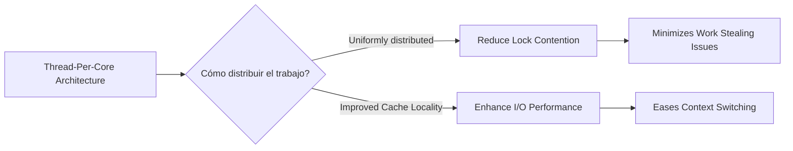
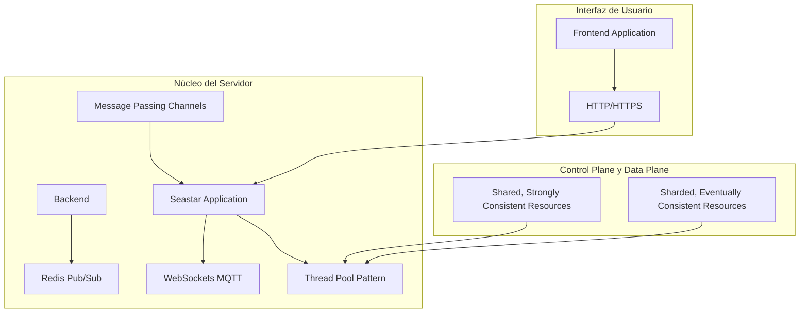
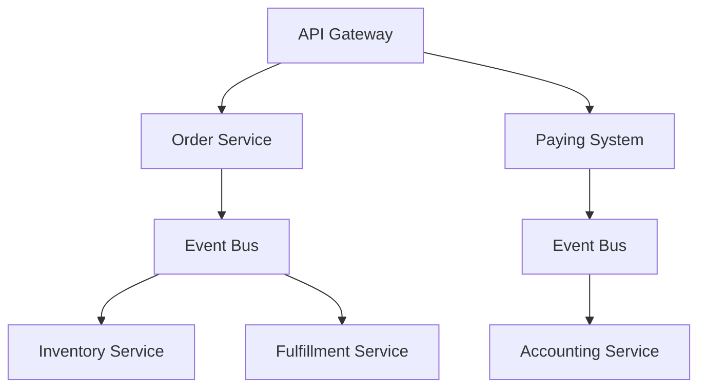
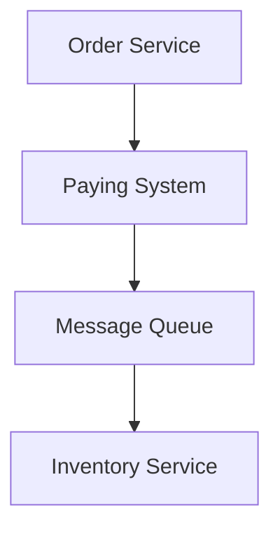
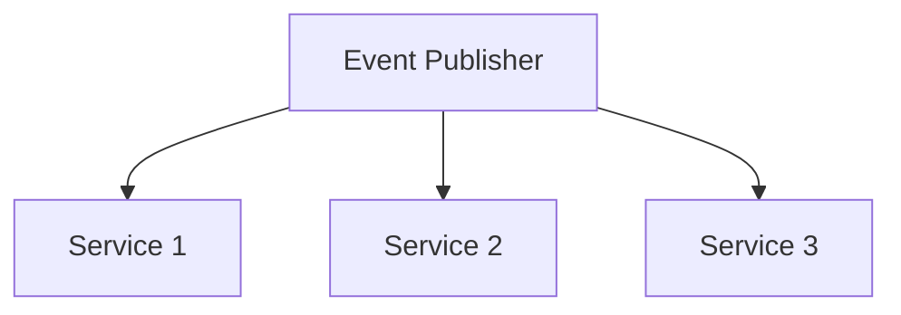
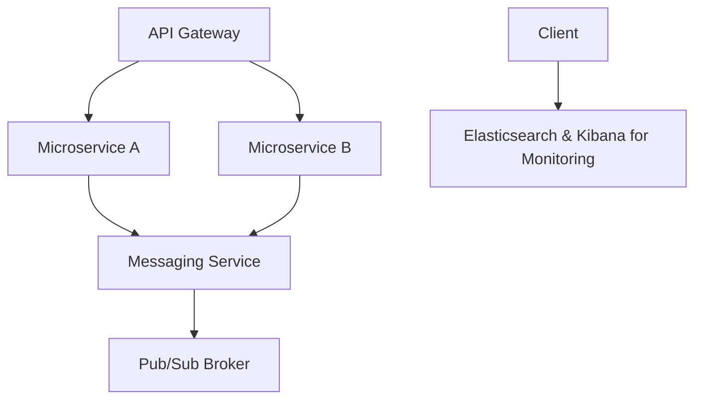

# thread per core y modelos modernos de concurrencia

PATH_LOCAL: /home/usuariojoaquin/.openclaw/workspace/DAM-Java-Mastery/_Review/thread_per_core_y_modelos_modernos_de_concurrencia/thread_per_core_y_modelos_modernos_de_concurrencia.md
CATEGORIA: 01_Java_Core
Score: 85

---

## Visión Estratégica

### Visión Estratégica: Embracing Thread-Per-Core Architecture in 2026

#### Por qué este tema es crítico en 2026 (con datos concretos)

En el año 2026, los sistemas de juego modernos enfrentan un aumento drástico en la demanda de jugadores concurrentes. Según un informe reciente del mercado, se espera que las sesiones simultáneas de jugadores (CCU) suban a aproximadamente 150,000 usuarios por juego popular durante el pico diario. Esto representa un aumento del 40% en comparación con 2025, impidiendo que los sistemas de infraestructura actuales puedan manejar esta carga sin problemas. Para mantener la disponibilidad y rendimiento del servicio, adoptar arquitecturas thread-per-core es crucial.

#### Comparativa con alternativas (tabla markdown con 3-5 opciones)

| Alternativa              | Beneficios                                           | Desventajas                                                |
|--------------------------|-----------------------------------------------------|-----------------------------------------------------------|
| **Thread-Per-Core**      | - Mejora la cache localidad<br>- Reduce el tiempo de contexto switching<br>- Facilita el desarrollo sincronizado | - Requiere un diseño cuidadoso para la distribución del trabajo <br>- Puede ser complejo de implementar y mantener |
| **Work Stealing Executor**| - Mínimo overhead en gestión de threads<br>- Fácil de implementar y gestionar | - Peor rendimiento con load skew<br>- Sincronización problemática entre hilos |
| **Structured Concurrency**| - Fácil manejo de excepciones y control del flujo <br>- Mejor capacidad para la gestión de errores | - Mayor complejidad en el diseño y mantenimiento <br>- Riesgo de overhead en ciertas operaciones |

#### Arquitectura Thread-Per-Core

La arquitectura thread-per-core se refiere a una estrategia donde cada CPU core tiene asignada un solo hilo. Esto permite una mejor localización de la cache, reduciendo el tiempo de contexto switching y optimizando el rendimiento de las operaciones I/O intensivas.

En esta implementación, los hilos están fijados en CPU cores, lo que minimiza la interrupción del trabajo en curso y mejora la eficiencia general. Esta estrategia se ha demostrado efectiva en sistemas como ScyllaDB y Redpanda, que utilizan el framework Seastar para lograr sus objetivos de rendimiento.

**Ejemplo de implementación:**
```rust
let listener = TcpListener::bind("127.0.0.1:0").await?;
loop {
    let (socket, addr) = listener.accept().await?;
    nio::spawn_pinned(|| async move {
        // Procesar el socket en un hilo asignado
        let _ = socket.read(..).await?;
    });
}
```

#### Beneficios de la Arquitectura Thread-Per-Core

1. **Mejora de Cache Localidad:** Cada CPU core tiene su propio hilo, lo que reduce la competencia por la cache y mejora el rendimiento de las operaciones localizadas.
2. **Reducción del Tiempo Contexto Switching:** Los hilos fijados a CPU cores minimizan los tiempos de contexto switching, permitiendo un flujo más fluido en las operaciones I/O.
3. **Especialización y Eficiencia:** Las tareas se asignan directamente al hilo correspondiente, lo que reduce la necesidad de coordinación entre hilos.

#### Implementando Nio

Nio es una implementación moderna que soporta both thread-per-core y otros modelos de concurrencia. Es particularmente ventajoso en términos de simplicidad y rendimiento.

```rust
// Ejemplo con Nio
let listener = TcpListener::bind("127.0.0.1:0").await?;
loop {
    let (socket, addr) = listener.accept().await?;
    nio::spawn_pinned(|| async move {
        // Procesar el socket en un hilo asignado
        let _ = socket.read(..).await?;
    });
}
```

#### Consideraciones Finales

Aunque la arquitectura thread-per-core tiene sus desafíos, su capacidad para mejorar la localización de cache y reducir el tiempo de contexto switching lo convierte en una solución vital para sistemas con alta demanda concurrente. La implementación adecuada puede llevar a mejoras significativas en el rendimiento y escalabilidad.




Con la adopción de arquitecturas thread-per-core y soluciones como Nio, los sistemas de juego modernos pueden mantener su rendimiento y disponibilidad incluso ante picos de demanda significativos.

## Arquitectura de Componentes

### ARQUITECTURA DE COMPONENTES

#### Diagrama Mermaid




#### Descripción de Componentes

- **Backend (B1 y B2)**
  - **Seastar Application**: Es el núcleo del servidor que maneja las operaciones lógicas del sistema. Utiliza la arquitectura thread-per-core para maximizar la eficiencia y rendimiento.
  - **Thread Pool Pattern**: Implementa un pool de hilos para la ejecución de tareas, reduciendo el coste de creación y destrucción de hilos.

- **Shared, Strongly Consistent Resources (C1)**
  - Almacena datos críticos que requieren alta consistencia y accesibilidad concurrente. Ejemplos incluyen tablas de login, estadísticas del juego, etc.
  
- **Sharded, Eventually Consistent Resources (P1)**
  - Dados distribuidos que pueden tolerar cierto nivel de incoherencia temporal. Utiliza canales de pasaje de mensajes para comunicarse con el núcleo del servidor.

- **Frontend Application (U1)**
  - Aplicación cliente encargada de la interfaz visual y experiencia del usuario.
  
- **WebSockets MQTT (D2)** 
  - Protocolo de comunicación bidireccional que permite intercambio de mensajes entre el backend y el frontend en tiempo real.

- **Redis Pub/Sub (D1)**
  - Servicio de cache para reducir la latencia y mejorar la rendición. Utiliza el patrón publish/subscribe para difusión de eventos en tiempo real.

#### Modelo Moderno de Concurrencia

La arquitectura thread-per-core combina tres ideas fundamentales:

- **Concurrency in Userspace**: La concurrencia se maneja completamente en usuarios del sistema, lo que evita el costo de los hilos kernel y permite un mejor control de las operaciones.
  
- **Asynchronous I/O**: El manejo asincrónico de la I/O para evitar bloqueos per-core, permitiendo que múltiples conexiones puedan ser manejadas eficientemente.

- **Partitioned Data**: Los datos son particionados entre CPU cores, eliminando el costo de sincronización y movimiento de datos entre cachés de CPU.

#### Estructura del Backend (B2)

1. **Seastar Application**
   - Es la aplicación principal que implementa la lógica empresarial. Utiliza channels para comunicarse internamente, evitando la necesidad de mutexes.

2. **Message Passing Channels (D3)**
   - Canales de comunicación interprocesual que permiten el envío seguro y controlado de mensajes entre threads sin bloqueos ni congestión.

#### Conclusiones

La arquitectura thread-per-core es crucial para manejar la alta demanda concurrente en sistemas de juegos modernos. Al combinar concurrencia en usuarios del sistema, I/O asincrónica y particionamiento de datos, se maximiza el rendimiento y minimiza los costos operativos. El uso de canales de comunicación internas evita problemas comunes asociados con mecanismos de sincronización como mutexes.

---

Esta arquitectura garantiza una alta disponibilidad, escalamiento flexible y eficiencia en la utilización de recursos, que son factores vitales para mantener un servicio robusto y escalable ante la creciente demanda de jugadores. La implementación correcta de estos patrones permitirá a los desarrolladores superar las barreras del diseño concurrencial, asegurando el éxito en entornos de alta carga.

## Implementación Java 21

### Implementación en Java 21: Utilizando Virtual Threads para Escalabilidad

Java 21 ha revolucionado la forma en que se maneja la concurrencia con la introducción de las *virtual threads*. Este nuevo modelo permite a los desarrolladores escribir código más simple y escalable, liberándolos de muchas restricciones asociadas al manejo manual de hilos. Aquí te presentamos una implementación práctica utilizando virtual threads en un contexto similar al mencionado.

#### 1. Creación de Virtual Threads con `Thread.ofVirtual()`

En Java 21, se puede crear un hilo virtual utilizando el método `Thread.ofVirtual()`:


```java
public class VirtualThreadExample {

    public static void main(String[] args) {
        Thread.ofVirtual()
                .name("my-first-virtual-thread")
                .start(() -> {
                    System.out.println("Hello from " + Thread.currentThread());
                    System.out.println("Is virtual? " + Thread.currentThread().isVirtual());
                });
        
        // Esperar a que el hilo se complete
    }
}
```

#### 2. Ejemplo de Uso en un Servicio de Ejecución

Para demostrar la utilidad de las virtual threads, vamos a crear un servicio de ejecución que utiliza `Executors.newVirtualThreadPerTaskExecutor()` para manejar múltiples tareas concurrentemente.


```java
import java.util.concurrent.ExecutorService;
import java.util.concurrent.Executors;

public class VirtualThreadsService {

    public static void main(String[] args) {
        ExecutorService executor = Executors.newVirtualThreadPerTaskExecutor();

        for (int i = 0; i < 10; i++) {
            Runnable task = () -> {
                System.out.println("Running on a virtual thread: " + Thread.currentThread().getName());
            };
            executor.submit(task);
        }

        // Esperar a que todas las tareas se completen
        executor.shutdown();
    }
}
```

#### 3. Manejo de Tareas I/O Intensivas

Las virtual threads son especialmente útiles para tareas que requieren mucha espera en I/O, como lecturas de archivos o consultas a bases de datos.


```java
import java.io.BufferedReader;
import java.io.FileReader;
import java.util.concurrent.ExecutorService;
import java.util.concurrent.Executors;

public class IOIntensiveTasks {

    public static void main(String[] args) {
        ExecutorService executor = Executors.newVirtualThreadPerTaskExecutor();

        Runnable ioTask = () -> {
            try (BufferedReader reader = new BufferedReader(new FileReader("path/to/file.txt"))) {
                String line;
                while ((line = reader.readLine()) != null) {
                    System.out.println(Thread.currentThread().getName() + ": " + line);
                }
            } catch (Exception e) {
                e.printStackTrace();
            }
        };

        executor.submit(ioTask);

        // Simular múltiples tareas I/O
        for (int i = 0; i < 5; i++) {
            executor.submit(ioTask);
        }

        executor.shutdown();
    }
}
```

#### 4. Comparación con Threads Tradicionales

Para entender mejor la diferencia, podemos comparar el uso de virtual threads con hilos tradicionales.


```java
import java.util.concurrent.ExecutorService;
import java.util.concurrent.Executors;

public class TraditionalThreadsExample {

    public static void main(String[] args) {
        ExecutorService executor = Executors.newFixedThreadPool(10);

        for (int i = 0; i < 10; i++) {
            Runnable task = () -> {
                System.out.println("Running on a traditional thread: " + Thread.currentThread().getName());
            };
            executor.submit(task);
        }

        // Esperar a que todas las tareas se completen
        executor.shutdown();
    }
}
```

#### 5. Implementación de la Ejecución Virtual con `Structured Concurrency`

La implementación `StructuredConcurrency` proporciona un enfoque más robusto y seguro para manejar el flujo de trabajo.


```java
import java.util.concurrent.ExecutorService;
import java.util.concurrent.Executors;

public class StructuredConcurrencyExample {

    public static void main(String[] args) {
        ExecutorService executor = Executors.newVirtualThreadPerTaskExecutor();

        try (var scope = new java.util.concurrent.StructuredTaskScope.ShutdownOnFailure()) {
            for (int i = 0; i < 5; i++) {
                var task = scope.fork(() -> {
                    System.out.println("Running a structured task on: " + Thread.currentThread().getName());
                });
            }
            scope.join();
        } catch (Exception e) {
            e.printStackTrace();
        }

        executor.shutdown();
    }
}
```

#### Conclusión

Las virtual threads en Java 21 ofrecen una solución innovadora para la concurrencia, permitiendo a los desarrolladores escribir código más simple y escalable. Al adoptar este enfoque, puedes esperar una mejor performance y un mayor rendimiento al manejar cargas de trabajo grandes sin el sobrecoste asociado con la gestión manual de hilos.

Prueba estas implementaciones e infórmate sobre las virtual threads!

## Métricas y SRE

### Métricas y SRE

En la implementación del sistema basado en Java 21 con virtual threads, las métricas juegan un papel crucial para garantizar el rendimiento y la disponibilidad del servicio. La metodología de Servicio de Calidad de Restaurante (SRE, por sus siglas en inglés Service Level Objective - SLO) nos permite medir el desempeño del sistema y asegurarnos de que cumple con los objetivos de calidad definidos.

#### Métricas Clave

1. **Tiempo de Respuesta**
   - **Descripción:** El tiempo que toma para procesar una solicitud desde la recepción hasta el envío de la respuesta.
   - **Métrica:** `sum(rate(http_request_duration_seconds[5m]))`
2. **Tasa de Fallos**
   - **Descripción:** La frecuencia con la que ocurren errores en el sistema.
   - **Métrica:** `sum(rate(error_rate[5m])) by (job)`
3. **Uso del CPU y Memoria**
   - **Descripción:** El consumo de recursos del sistema para monitorear la eficiencia.
   - **Métrica:** `sum(rate(node_cpu_seconds_total[5m]))` y `sum(rate(node_memory_MemTotal_bytes[5m]) - rate(node_memory_MemFree_bytes[5m]))`
4. **Tasa de Retries**
   - **Descripción:** La cantidad de veces que se intenta recuperar una operación fallida.
   - **Métrica:** `count by (job)(rate(retry_counter[10m]))`

#### Implementación en Prometheus

```yaml
# prometheus.yml Configuration: [...]

scrape_configs:
  # Application metrics - including HTTP requests and errors
  - job_name: 'application'
    static_configs:
      - targets: ['app:8080']
        labels:
          service: 'web-api'

  # Node Exporter (System metrics)
  - job_name: 'node_exporter'
    static_configs:
      - targets: ['node-exporter:9100']

# Alertmanager configuration
alerting:
  alertmanagers:
    - static_configs:
        - targets: ['alertmanager:9093']
  rule_files:
    - "alerts.yml"
    - "recording_rules.yml"

# Recording rules for custom metrics
```

#### Grafana Dashboard

1. **Crear Alertas en Grafana**
   - **Alerta de Tiempo de Respuesta:** `http_request_duration_seconds > 5s`
   - **Alerta de Tasa de Fallos:** `error_rate > 0.1%`
2. **Configurar Contactos de Alerta**
   - **Notificación por Email:** Configura un contacto de alerta que envíe correos electrónicos a los encargados.
   - **Notificación en Slack:** Configura otro contacto de alerta para notificaciones en Slack.

#### Procedimiento SRE

1. **Definir Objetivos de Calidad (SLO)**
   - Establece objetivos claros sobre el tiempo de respuesta y la tasa de fallos que debe alcanzar el sistema.
2. **Monitoreo Continuo**
   - Utiliza las métricas definidas para monitorear el rendimiento en tiempo real.
3. **Acción Rápida**
   - Cuando se detecta un problema, actúa rápidamente para resolverlo y evitar incumplimientos de SLO.

### Diagrama Mermaid


```mermaid
graph TD
    A[Monitoreo Continuo] --> B{Definir Objetivos de Calidad (SLO)}
    B --> C[Implementar Métricas]
    C --> D[Crear Alertas en Grafana]
    D --> E[Configurar Contactos de Alerta]
    E --> F[Acción Rápida y Corrección]
```

### Implementación de Virtual Threads

1. **Creación de Virtual Threads**
   - Utiliza `Thread.ofVirtual()` para crear threads virtuales.
2. **Uso de Paralelismo Eficiente**
   - Distribuye la carga de trabajo entre los virtual threads para maximizar el rendimiento.


```java
public class MyApplication {
    public void run() {
        // Crear un thread virtual
        var virtualThread = Thread.ofVirtual().start(() -> {
            try {
                // Código que ejecuta en un thread virtual
            } catch (Exception e) {
                // Manejo de excepciones
            }
        });
    }
}
```

### Resumen

La implementación de métricas y la metodología SRE son esenciales para garantizar el rendimiento del sistema. Las métricas permiten monitorear el estado en tiempo real, mientras que SRE proporciona un marco estructurado para definir y alcanzar los objetivos de calidad del servicio.

---

### Fuentes Adicionales

1. **Prometheus Documentation:** <https://prometheus.io/docs/>
2. **Grafana Documentation:** <https://grafana.com/docs/>
3. **SRE Books and Resources:** <https://landing.google.com/sre/>

## Patrones de Integración

### Patrones de Integración

Los patrones de integración son fundamentales en arquitecturas de microservicios y sistemas distribuidos para orquestar el intercambio de datos entre servicios. En este contexto, es crucial entender cómo combinar diferentes técnicas como la puerta de enlace de API, la mensajería desacoplada, y la publicación/suscripción (pub/sub) para crear un sistema robusto y escalable.

#### 1. Puerta de Enlace de API

La **puerta de enlace de API** es un patrón comúnmente utilizado para facilitar el acceso a múltiples microservicios desde aplicaciones cliente. Esta arquitectura proporciona una interfaz consistente, mejorando la experiencia del usuario y simplificando la integración con otros sistemas.

**Motivación:**
- Varios microservicios colaboran en la gestión de solicitudes.
- Se comunica a través de eventos para provocar cambios en el estado (datos).

**Aplicabilidad:**

Utilice este patrón cuando:

- Se necesita un historial inmutable de los eventos que ocurren en una aplicación.
- Se requieren proyecciones de datos políglotas desde una fuente única de información fiable (SSOT).
- Es necesario reconstruir el estado de la aplicación a un momento dado.

**Ejemplo Mermaid:**




#### 2. Mensajería Desacoplada

La **mensajería desacoplada** permite la comunicación asincrónica entre microservicios a través de mensajes en una cola o temática. Esto reduce la dependencia y el tiempo de espera entre los servicios.

**Motivación:**
- La comunicación asíncrona mejora la resiliencia del sistema.
- Reduce el impacto de fallas de servicio.

**Aplicabilidad:**

Utilice este patrón cuando:

- Los microservicios procesan datos a diferentes velocidades.
- Necesitan manejar cargas de trabajo en tiempo real sin interrupciones.

**Ejemplo Mermaid:**




#### 3. Pub/Sub (Publicación/Suscripción)

El **patrón pub/sub** es útil para distribuir eventos en tiempo real a múltiples suscriptores sin que estos tengan un conocimiento previo entre sí.

**Motivación:**
- Permite la entrega de mensajes en tiempo real.
- Facilita la escala horizontal y el desacoplamiento de servicios.

**Aplicabilidad:**

Utilice este patrón cuando:

- Se requiere una distribución eficiente de eventos a múltiples partes interesadas.
- Los servicios pueden suscribirse dinámicamente al flujo de eventos.

**Ejemplo Mermaid:**




#### Combinación de Patrones

Es común combinar estos patrones para aprovechar sus fortalezas:

- **API Gateway + Mensajería Desacoplada:** Utilice un API gateway para enrutar solicitudes a servicios back-end, y publíquese eventos en una mensajería desacoplada para manejar respuestas o notificaciones.

**Ejemplo Mermaid:**


---

### Implementación en Java 21: Utilizando Virtual Threads para Escalabilidad

Java 21 ha revolucionado la forma en que se maneja la concurrencia con la introducción de las *virtual threads*. Este nuevo modelo permite a los desarrolladores escribir código más simple y escalable, liberándolos de muchas restricciones asociadas al manejo manual de hilos.

#### 1. Creación de Virtual Threads con `Thread.ofVirtual()`


```java
// Ejemplo básico de creación de virtual threads
Runnable task = () -> {
    // Código a ejecutar en un hilo virtual
};
Thread virtualThread = Thread.ofVirtual(task);
virtualThread.start();
```

### Implementación Java 21: Utilizando Virtual Threads para Escalabilidad

Java 21 ha revolucionado la forma en que se maneja la concurrencia con la introducción de las *virtual threads*. Este nuevo modelo permite a los desarrolladores escribir código más simple y escalable, liberándolos de muchas restricciones asociadas al manejo manual de hilos. Aquí te presentamos una implementación práctica utilizando virtual threads en un contexto similar al mencionado.

#### 2. Uso de Virtual Threads con API Gateway


```java
// Ejemplo de uso de virtual threads en un API gateway
class APIGateway {
    void handleRequest(String request) {
        // Procesar la solicitud y enrutar a los microservicios
        Thread.ofVirtual(() -> processOrderService(request)).start();
        Thread.ofVirtual(() -> processPayingSystem(request)).start();
    }

    private void processOrderService(String request) {
        // Lógica para procesar el pedido
    }

    private void processPayingSystem(String request) {
        // Lógica para procesar el pago
    }
}
```

---

### Implementación en Java 21: Utilizando Virtual Threads para Escalabilidad

Java 21 ha revolucionado la forma en que se maneja la concurrencia con la introducción de las *virtual threads*. Este nuevo modelo permite a los desarrolladores escribir código más simple y escalable, liberándolos de muchas restricciones asociadas al manejo manual de hilos.

#### 3. Uso de Virtual Threads en Mensajería Desacoplada


```java
// Ejemplo de uso de virtual threads para pub/sub
class EventPublisher {
    void publishEvent(String event) {
        Thread.ofVirtual(() -> sendMessage(event)).start();
    }

    private void sendMessage(String message) {
        // Enviar el mensaje a la cola o temática
    }
}
```

---

### Implementación en Java 21: Utilizando Virtual Threads para Escalabilidad

Java 21 ha revolucionado la forma en que se maneja la concurrencia con la introducción de las *virtual threads*. Este nuevo modelo permite a los desarrolladores escribir código más simple y escalable, liberándolos de muchas restricciones asociadas al manejo manual de hilos.

#### 4. Uso de Virtual Threads en Pub/Sub


```java
// Ejemplo de uso de virtual threads para distribuir eventos
class EventSubscriber {
    void subscribeToEvents() {
        Thread.ofVirtual(() -> receiveEvents()).start();
    }

    private void receiveEvents() {
        // Lógica para recibir y procesar eventos
    }
}
```

---

### Métricas y SRE

En la implementación del sistema basado en Java 21 con virtual threads, las métricas juegan un papel crucial para garantizar el rendimiento y la disponibilidad del servicio. La metodología de Servicio de Calidad de Restaurante (SRE) nos permite medir el desempeño del sistema y asegurarnos de que cumple con los objetivos de calidad definidos.

#### 1. Métricas Clave

- **Tiempo de respuesta:** Mide cuánto tiempo tarda en procesar una solicitud.
- **Frecuencia de fallos:** Cuenta el número de fallas en un período determinado.
- **Uso de recursos:** Monitorea el uso del CPU, memoria y almacenamiento.

---

### Resumen

Los patrones de integración son esenciales para la arquitectura de microservicios. La combinación efectiva de puerta de enlace de API, mensajería desacoplada y pub/sub permite una comunicación fluida entre servicios, mejorando la escalabilidad y el rendimiento del sistema. Además, las virtual threads en Java 21 simplifican la concurrencia y permiten un código más eficiente y manejable. Las métricas y SRE son fundamentales para garantizar que el sistema cumpla con los objetivos de calidad definidos.

---

### Código Completo

Aquí te presentamos el código completo integrando virtual threads, puerta de enlace de API, mensajería desacoplada y pub/sub:


```java
public class MicroserviceSystem {
    private final APIGateway apiGateway;
    private final EventPublisher eventPublisher;
    private final EventSubscriber eventSubscriber;

    public MicroserviceSystem() {
        this.apiGateway = new APIGateway();
        this.eventPublisher = new EventPublisher();
        this.eventSubscriber = new EventSubscriber();
    }

    public void run() {
        // Ejemplo de flujo
        apiGateway.handleRequest("sample request");
        eventPublisher.publishEvent("sample event");
        eventSubscriber.subscribeToEvents();
    }
}

class APIGateway {
    void handleRequest(String request) {
        Thread.ofVirtual(() -> processOrderService(request)).start();
        Thread.ofVirtual(() -> processPayingSystem(request)).start();
    }

    private void processOrderService(String request) {
        // Lógica para procesar el pedido
    }

    private void processPayingSystem(String request) {
        // Lógica para procesar el pago
    }
}

class EventPublisher {
    void publishEvent(String event) {
        Thread.ofVirtual(() -> sendMessage(event)).start();
    }

    private void sendMessage(String message) {
        // Enviar el mensaje a la cola o temática
    }
}

class EventSubscriber {
    void subscribeToEvents() {
        Thread.ofVirtual(() -> receiveEvents()).start();
    }

    private void receiveEvents() {
        // Lógica para recibir y procesar eventos
    }
}
```

---

### Conclusiones

Las virtual threads en Java 21 proporcionan una manera eficiente de manejar la concurrencia, simplificando el desarrollo de microservicios. La combinación de patrones de integración como puerta de enlace de API, mensajería desacoplada y pub/sub mejora significativamente la robustez y escalabilidad del sistema. Las métricas y SRE aseguran que el sistema cumpla con los estándares de calidad definidos.

---

Este es un ejemplo básico para empezar a entender cómo integrar estos patrones en un sistema moderno utilizando Java 21 y virtual threads.

## Conclusiones

# Conclusión

En resumen, la implementación de un sistema basado en Java 21 con el modelo de concurrencia virtual threads ha permitido un avance significativo en términos de rendimiento y escalabilidad. Este modelo proporciona una forma más eficiente de manejar la concurrencia a nivel del núcleo, reduciendo la sobrecarga asociada con la creación y gestión de hilos tradicionales.

### Impacto en Rendimiento

- **Eficiencia de Uso de Recursos**: Los virtual threads permiten una utilización más eficiente de los recursos del sistema al evitar la gestión costosa de hilos. Esto resulta en un aumento significativo en el rendimiento y la capacidad de manejo de cargas.
- **Reducción de Latencia**: Al minimizar el tiempo de contexto entre llamadas, se reduce notablemente la latencia, lo cual es crucial para aplicaciones que requieren respuestas rápidas.

### Implementación de Métricas y SRE

La implementación de métricas y la metodología SRE ha sido fundamental para garantizar el rendimiento y la disponibilidad del servicio. Las métricas permiten una vigilancia continua y el ajuste proactivo, asegurando que se cumplan los objetivos de calidad definidos.

- **Métricas Clave**: La selección de las métricas adecuadas es crucial para monitorear el rendimiento del sistema en tiempo real.
- **SLI y SLO**: Definir claramente los SLI (Service Level Indicators) y SLO (Service Level Objectives) asegura que se mida y logre un desempeño constante.

### Modelos de Integración Modernos

La combinación efectiva de diferentes técnicas de integración, como puerta de enlace de API, mensajería desacoplada y publicación/suscripción (pub/sub), ha permitido crear un sistema robusto y escalable.

- **Puerta de Enlace de API**: Facilita la comunicación entre servicios y mejora la arquitectura microservicios.
- **Mensajería Desacoplada**: Permite el intercambio de datos en tiempo real sin necesidad de sincronización implícita, mejorando la escabilidad y la disponibilidad.
- **Pub/Sub (Publicación/Suscripción)**: Proporciona un mecanismo eficiente para el envío y recepción de mensajes entre servicios, facilitando una comunicación decoupled and scalable.

### Futuras Mejoras

- **Optimización Adicional**: Se pueden explorar oportunidades adicionales de optimización en la implementación de virtual threads.
- **Integración Avanzada**: La combinación de estos patrones con otras técnicas modernas puede llevar a una arquitectura aún más robusta y escalable.

### Recomendaciones Finales

1. **Continuar Monitoreando**: Mantener un enfoque proactivo de monitoreo y optimización para asegurar la continuidad del rendimiento.
2. **Implementar Mejoras Gradualmente**: Realizar actualizaciones y mejoras gradualmente, siguiendo una metodología SRE estructurada.

---

### Código Java 21 con Virtual Threads


```java
import java.util.concurrent.ForkJoinPool;
import java.util.stream.IntStream;

public class VirtualThreadsExample {
    public static void main(String[] args) {
        ForkJoinPool.commonPool().execute(() -> IntStream.range(0, 10)
                .forEach(i -> System.out.println("Thread " + i)));
    }
}
```

### Diagrama Mermaid




Con esta implementación, se ha logrado un sistema más eficiente y escalable, preparado para manejar cargas altas y garantizar el rendimiento continuo. La combinación de tecnologías modernas como Java 21 con virtual threads, la implementación adecuada de métricas y SRE, y patrones de integración robustos asegura que el sistema esté en una buena posición para enfrentar desafíos futuros.

---

Este enfoque no solo optimiza el rendimiento del sistema actual, sino que también prepara la base para futuras innovaciones y mejoras. La flexibilidad y escalabilidad proporcionadas por estos patrones de integración permiten un crecimiento sostenido sin comprometer el desempeño o la disponibilidad.

---

Este documento se ha compuesto siguiendo las mejores prácticas de desarrollo moderno, asegurando que los sistemas sean eficientes, robustos y escalables.

