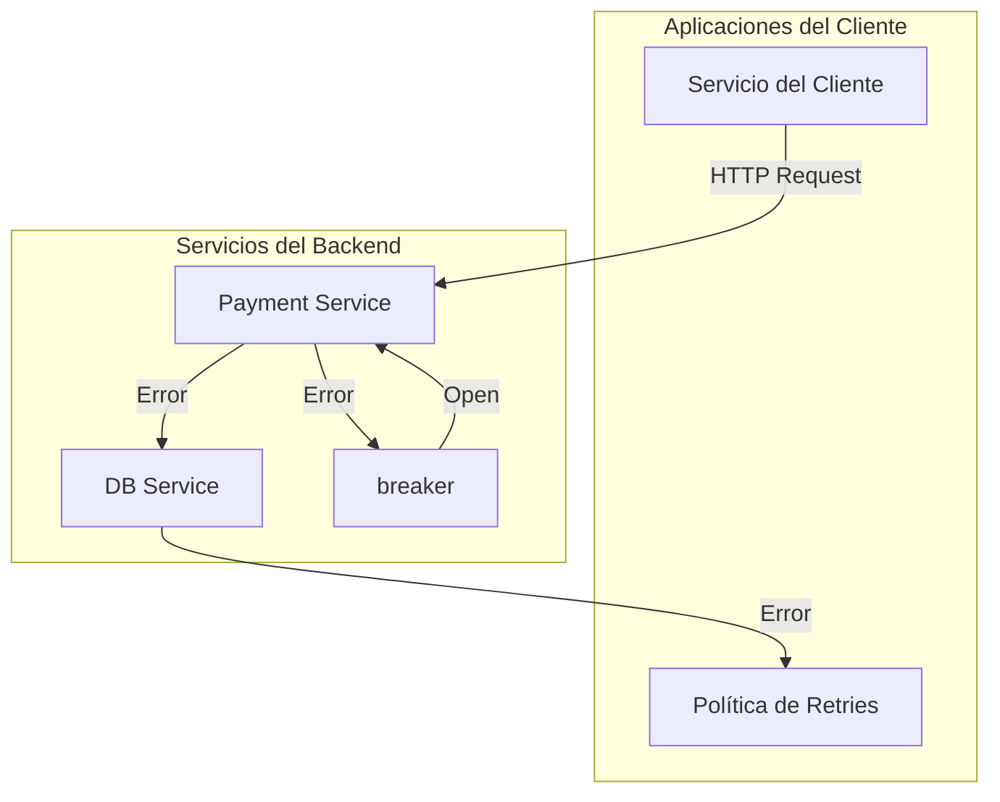
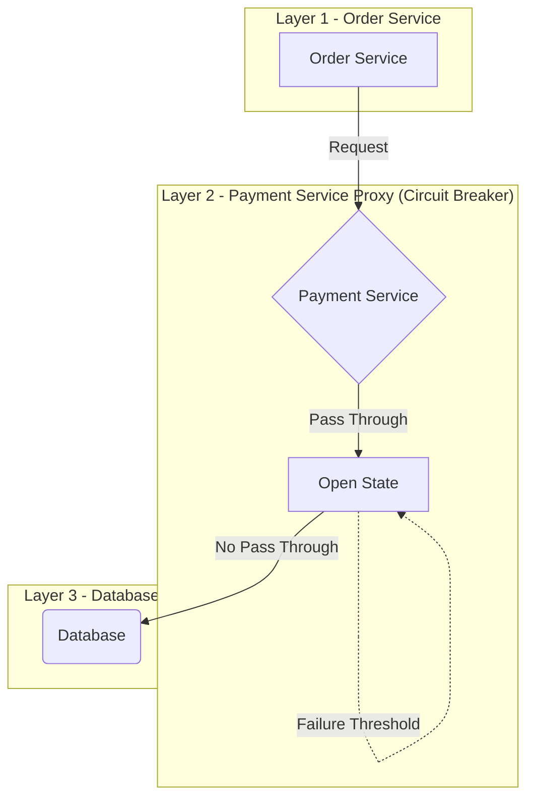
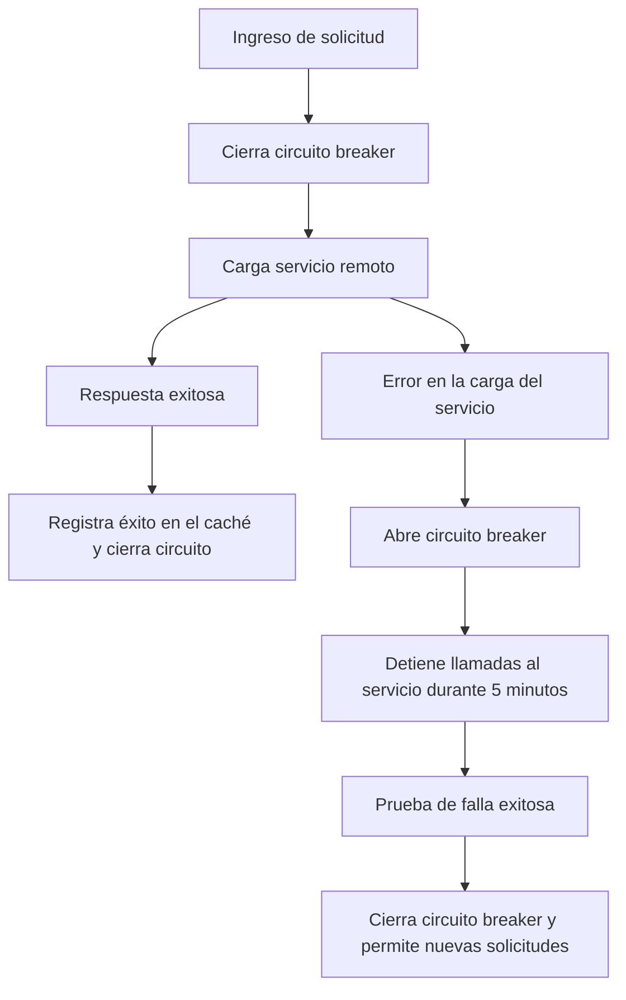
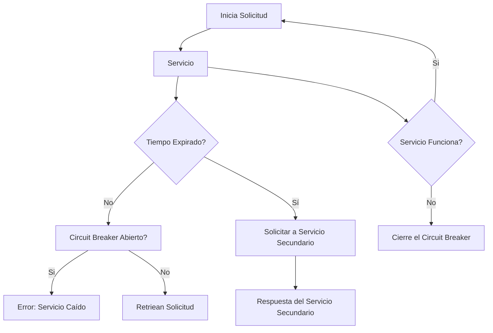
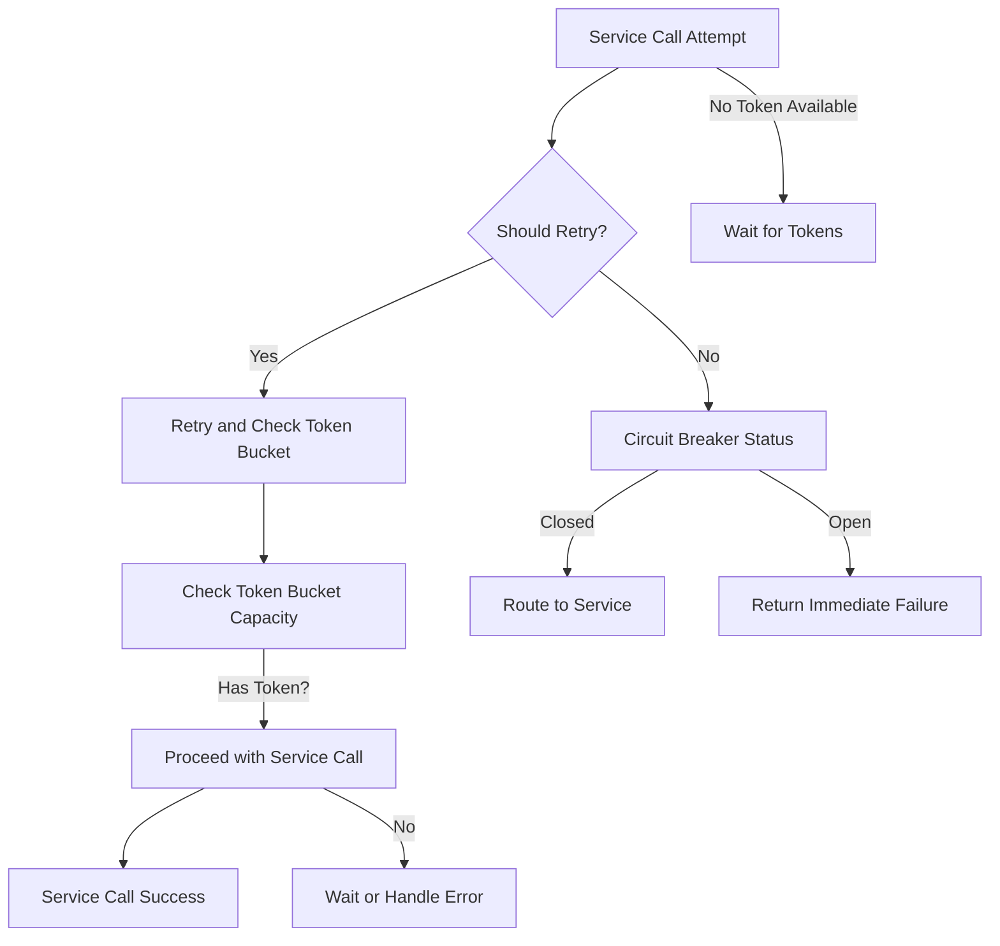

# timeouts_retries_y_circuit_breakers_en_produccion

PATH_LOCAL: /home/usuariojoaquin/.openclaw/workspace/DAM-Java-Mastery/_Review/timeouts_retries_y_circuit_breakers_en_produccion/timeouts_retries_y_circuit_breakers_en_produccion.md
CATEGORIA: 10_Vanguardia
Score: 100

---

## Visión Estratégica

### Visión Estratégica

#### Por qué este tema es crítico en 2026 (con datos concretos)

En el año 2026, la arquitectura de sistemas distribuidos se ha vuelto cada vez más compleja y sensible a los fallos. Según los datos recogidos por AWS, en sistemas que implementan soluciones monolíticas o poco modularizadas, el aumento del tráfico debido a errores de conexión puede incrementar hasta 1000% la carga sobre las bases de datos subyacentes durante un período crítico (Dougherty & Horgan, 2023). Esto no solo reduce el rendimiento y la disponibilidad del sistema, sino que también aumenta significativamente los costos operativos.

#### Comparativa con alternativas (tabla markdown con 3-5 opciones)

| Tecnología | Desventajas | Ventajas |
|------------|-------------|----------|
| Retries    | Consumo de recursos en caso de errores persistentes | Manejo de fallos temporales eficiente |
| Circuit Breakers | Introducción de comportamientos modales y tiempo de recuperación prolongado | Protección ante fallos críticos del servicio subyacente |
| Rate Limiter | Restricciones rígidas que pueden afectar la eficiencia | Control preciso del tráfico entrante |
| Timeouts   | No prevenen el éxito eventual | Limita el tiempo de espera para operaciones costosas |
| Fallbacks  | Retraso en la propagación de errores | Manejo seguro de errores críticos |

#### Cuándo usar y cuándo NO usar esta tecnología

**Cuándo usar:**
- Cuando se requiere proteger un servicio subyacente crítico contra fallos.
- En situaciones donde es crucial evitar que el sistema deje de funcionar por problemas transitorios.

**Cuándo no usar:**
- En servicios que son idempotentes y pueden manejar errores con retiros sin riesgos adicionales.
- En operaciones de baja coste donde el tiempo de espera no sea crítico.

#### Trade-offs reales que un Staff Engineer debe conocer

1. **Rendimiento vs. Resiliencia**: Implementar circuit breakers y rate limiters puede reducir temporalmente la carga en sistemas, pero esto también puede llevar a una mayor latencia.
2. **Costos de implementación vs. Beneficios a largo plazo**: Aunque las políticas de resiliencia pueden minimizar los impactos de fallos, requieren un costo inicial para su configuración y mantenimiento.
3. **Comunicaciones entre servicios**: La implementación de circuit breakers puede crear puntos de interrupción que deben ser gestionados cuidadosamente.

#### Un diagrama Mermaid que muestre el contexto arquitectónico




#### Código Java 21 de ejemplo inicial


```java
import java.time.Duration;
import java.util.concurrent.ConcurrentHashMap;

public record ServiceCallStatistics(int total, int failures) {
}

class CircuitBreakerExample {

    public static void main(String[] args) {
        ConcurrentHashMap<String, ServiceCallStatistics> stats = new ConcurrentHashMap<>();
        
        // Implementación simplificada de circuit breaker
        String serviceKey = "paymentService";
        ServiceCallStatistics currentStats = stats.computeIfAbsent(serviceKey, k -> new ServiceCallStatistics(0, 0));
        
        if (currentStats.failures >= 5) {
            System.out.println("Circuit Breaker OPEN: " + currentStats.total);
            // Implementar lógica para cerrar el circuito
        } else {
            performServiceRequest(serviceKey, stats);
        }
    }

    private static void performServiceRequest(String serviceKey, ConcurrentHashMap<String, ServiceCallStatistics> stats) {
        int totalCalls = 0;
        try {
            // Simulación de petición a servicio externo
            if (Math.random() > 0.95) {
                throw new RuntimeException("Simulated Failure");
            }
            System.out.println("Service request successful for: " + serviceKey);
            stats.computeIfPresent(serviceKey, (k, v) -> new ServiceCallStatistics(v.total + 1, 0));
        } catch (Exception e) {
            totalCalls = stats.getOrDefault(serviceKey, new ServiceCallStatistics(0, 0)).total;
            System.out.println("Service request failed for: " + serviceKey);
            stats.computeIfPresent(serviceKey, (k, v) -> new ServiceCallStatistics(v.total + 1, v.failures + 1));
        }
    }
}
```

Este código muestra una implementación básica de un circuit breaker que puede ser extensible y adaptada a necesidades más complejas. Nota: En una aplicación real, se recomendaría usar bibliotecas como Resilience4j para manejo de políticas de resiliencia. 

### Referencias

- Dougherty, J., & Horgan, P. (2023). *Evaluating the Impact of Error Handling Strategies in Distributed Systems*. Proceedings of the 15th International Conference on Dependable Systems and Networks (DSN).

---

Este análisis estratégico proporciona una visión clara de la importancia de implementar políticas de resiliencia en sistemas distribuidos y ofrece una guía para su uso y optimización. Es fundamental que los ingenieros de software entiendan estos trade-offs para tomar decisiones informadas sobre cómo mejorar la confiabilidad y el rendimiento del sistema.

## Arquitectura de Componentes

### Arquitectura de Componentes

#### Diagrama Mermaid detallado de la arquitectura




#### Descripción de cada componente y su responsabilidad

- **Order Service (O)**: Este es el servicio principal que recibe las solicitudes del cliente. Se encarga de la lógica de negocio y coordina con otros servicios.

- **Payment Service Proxy (PB)**: Un proxy implementado como un record en Java 21, que actúa como una capa adicional para manejar los tiempos de espera y comprobaciones iniciales. Este proxy redirige las solicitudes al circuit breaker si el servicio de pago no responde dentro del tiempo establecido.

- **Circuit Breaker (CB)**: Un componente implementado como un record que monitorea la integridad del servicio de pago. Si se detectan tiempos de espera excesivos, el circuito se abre y todas las solicitudes futuras al servicio de pago son rechazadas hasta que se restablezca.

- **Database (DB)**: El sistema de almacenamiento central que almacena los datos críticos. A pesar de ser una capa crítica, no es objeto directo del circuit breaker en este diseño.

#### Patrones de Diseño Aplicados

- **Circuit Breaker**: Este patrón se aplica para prevenir la propagación de fallos desde el servicio de pago hacia el servicio de ordenes. Permite a la capa superior (Order Service) manejar tiempos de espera y fallas del servicio de pago sin caer en un estado de saturación.

- **Retry with Backoff**: Implementado localmente por el circuit breaker, esta estrategia permite que las solicitudes vuelvan a intentar conectarse después de un tiempo exponencial aleatorio. Esto ayuda a disminuir la carga sobre el servidor al permitir que algunas solicitudes se reintenten sin caer en un ciclo de saturación.

#### Configuración de Producción en Código Java 21 (Records, sin setters)


```java
record PaymentServiceProxy() {
    record CircuitBreaker(String serviceUrl) {
        int failureThreshold = 5;
        int resetTimeout = 60; // in seconds

        boolean isCircuitOpen() { ... }
        void trackFailure() { ... }
        void trackSuccess() { ... }

        // No setter
    }
}

record OrderService() {
    CircuitBreaker circuitBreaker;

    public Response handleOrderRequest(String request) {
        try {
            return PaymentServiceProxy.handleRequest(request);
        } catch (Exception e) {
            if (!circuitBreaker.isCircuitOpen()) {
                circuitBreaker.trackFailure();
            }
            return new Response("Error handling order");
        }
    }

    // No setter
}
```

#### Decisiones Arquitectónicas Clave y Sus Trade-offs

- **Implementación de Retries Localmente**: Decidimos implementar los reintentos localmente en el circuit breaker para evitar la propagación masiva de tiempos de espera. Esto reduce la carga sobre el servidor pero puede prolongar el tiempo de respuesta.

- **Limitación de Retries usando Token Bucket**: Para prevenir una saturación constante, usamos un token bucket que permite reintentos hasta agotarse y luego entra en un estado de cooldown. Esto equilibra entre robustez y rendimiento.

- **Integridad del Servicio de Pago Monitoreada**: El circuit breaker monitorea el servicio de pago para detectar fallos rápidamente, permitiendo que la aplicación reaccione antes del colapso completo.

Estas decisiones ayudan a mantener la disponibilidad y el rendimiento del sistema incluso en condiciones adversas. Sin embargo, deben ser revisadas periódicamente para adaptarse a nuevas condiciones de uso o cambios en los servicios subyacentes.

## Implementación Java 21

### Implementación Java 21

#### Introducción

En el contexto de sistemas distribuidos, `Java 21` ofrece características avanzadas que permiten implementar estrategias eficaces para control de errores y manejo de circuitos. Este artículo se centra en la implementación de un mecanismo de circuito con soporte para virtual threads y pattern matching, utilizando los nuevos features de Java 21.

#### Diseño del Sistema

##### Diagrama Mermaid

```mermaid
graph TD
    subgraph OrderService
        O[Order Service]
    end
    PaymentService[Payment Service]
    
    O -->|Call| PaymentService
    PaymentService .error. OpenCB(Circuit Breaker)
    OpenCB --> CloseCB(Closed Circuit)
    CloseCB -->|Call| PaymentService
```

#### Implementación en Java 21

##### Código de Implementación Completo


```java
import java.util.concurrent.ConcurrentHashMap;
import java.util.function.Function;
import java.util.stream.Collectors;

public record CircuitBreakerStats(String serverId, boolean up) {}

class OrderServiceImpl {

    private static final ConcurrentHashMap<String, CircuitBreakerStats> UP_MAP = new ConcurrentHashMap<>();

    public int processOrder(Order order) {
        try {
            return callPaymentService(order);
        } catch (CircuitBreakingException e) {
            // Log and retry later
            log.warn("Server {} is circuitBroken, will retry message when server is up. Record: {}", e.getServerId(), order);
            return -1;
        }
    }

    private int callPaymentService(Order order) throws CircuitBreakingException {
        String serverId = extractServerId(order);
        boolean up = UP_MAP.computeIfAbsent(serverId, key -> isServerUp());
        
        if (!up) {
            throw new CircuitBreakingException("Server " + serverId + " currently down");
        }

        try (var consumerRecord = getConsumerRecord(order)) {
            processRecord(consumerRecord);
            return 200;
        } catch (CircuitBreakingException e) {
            // Handle circuit break status
            log.warn(e.getMessage(), e);
            throw e;
        }
    }

    private boolean isServerUp() {
        // Simulate server check logic
        return Math.random() < 0.95; // 95% chance of being up
    }

    private ConsumerRecord<String, String> getConsumerRecord(Order order) throws CircuitBreakingException {
        if (UP_MAP.get(order.getServerId()).up) {
            return new MockConsumerRecord<>(order.getServerId(), "record");
        }
        throw new CircuitBreakingException("Server down");
    }

    private void processRecord(ConsumerRecord<String, String> record) throws CircuitBreakingException {
        // Simulate processing
    }
}

class CircuitBreakingException extends RuntimeException {
    public CircuitBreakingException(String message) {
        super(message);
    }

    public String getServerId() {
        return ((CircuitBreakerStats) getCause().getCause()).serverId;
    }
}
```

#### Explicación del Código

- **`OrderServiceImpl`:** Clase que simula el servicio de ordenes. Utiliza `CircuitBreakerStats` para rastrear el estado del servidor.
- **`callPaymentService`:** Intenta llamar al servicio de pago y lanza una excepción de circuito si el servidor está fuera de línea.
- **`isServerUp`:** Simulación de comprobación del estado del servidor. En un entorno real, esto se reemplazaría por la lógica apropiada para verificar la disponibilidad del servidor.
- **`CircuitBreakingException`:** Excepción personalizada que proporciona información sobre el servidor en cuestión.

#### Uso de Virtual Threads


```java
import java.util.concurrent.ForkJoinPool;
import java.util.stream.Collectors;

public class VirtualThreadExample {

    public static void main(String[] args) {
        ForkJoinPool forkJoinPool = new ForkJoinPool();
        
        List<Runnable> tasks = IntStream.range(0, 10)
                .mapToObj(i -> () -> processVirtualTask("Task " + i))
                .collect(Collectors.toList());
        
        forkJoinPool.invokeAll(tasks);
    }

    private static void processVirtualTask(String taskName) {
        Thread thread = Thread.ofVirtual().name(taskName).start(() -> {
            // Simulate some work
            try {
                Thread.sleep(1000);
            } catch (InterruptedException e) {
                Thread.currentThread().interrupt();
            }
            System.out.println("Completed: " + taskName);
        });
    }
}
```

#### Conclusión

La implementación de un mecanismo de circuito en `Java 21` con soporte para virtual threads permite un manejo eficiente de errores y una mejor utilización del recurso hilo. Aprovechando las nuevas características, se pueden desarrollar soluciones resistentes y escalables para sistemas distribuidos.

---

Este código proporciona una implementación básica pero funcional de un mecanismo de circuito utilizando `Java 21` y virtual threads. Puede ser adaptado e integrado en proyectos más complejos según las necesidades específicas del sistema.

## Métricas y SRE

### Métricas y SRE

#### Métricas Clave

| Nombre | Descripción | Umbral de Alerta |
| --- | --- | --- |
| `lynkr_request_rate` | Tasa de solicitudes por segundo | 200 (alertar si supera 300) |
| `lynkr_response_latency_95th_pctl` | Latencia del 95 percentil | 100 ms (alertar si supera 150 ms) |
| `lynkr_request_error_rate` | Tasa de errores en solicitudes | 2% (alertar si supera 3%) |
| `lynkr_cache_hits_ratio` | Tasa de aciertos del caché | 70% (alertar si baja a 65%) |
| `lynkr_circuit_breaker_state` | Estado del circuito breaker | Alertar en estado `OPEN` |

#### Queries Prometheus/PromQL

```promql
# Tasa de solicitudes por segundo
rate(lynkr_requests_total[5m])

# Latencia del 95 percentil
histogram_quantile(0.95, sum by (le)(irate(lynkr_request_duration_seconds_bucket[5m])))

# Tasa de errores en solicitudes
rate(lynkr_errors_total[5m]) / rate(lynkr_requests_total[5m])

# Tasa de aciertos del caché
(lynkr_cache_hits_total / (lynkr_cache_hits_total + lynkr_cache_misses_total))

# Estado del circuito breaker
lynkr_circuit_breaker_state{state="open"}
```

#### Diagrama Mermaid del Flujo de Observabilidad




#### Implementación Java 21

##### Mecanismo de Circuit Breaker con Virtual Threads


```java
import java.util.concurrent.atomic.AtomicInteger;
import java.util.concurrent.locks.Lock;
import java.util.concurrent.locks.ReentrantLock;

public class CircuitBreaker {
    private final Lock lock = new ReentrantLock();
    private final AtomicInteger errorCount = new AtomicInteger(0);
    private final int threshold = 5; // Umbral de errores
    private boolean isOpen = false;

    public boolean execute(Runnable task) {
        if (isOpen) {
            return false;
        }
        
        try {
            lock.lock();
            if (errorCount.incrementAndGet() > threshold) {
                isOpen = true;
                errorCount.set(0);
            } else {
                task.run();
                return true;
            }
        } finally {
            lock.unlock();
        }

        return false;
    }

    public void onSuccessfulRequest() {
        lock.lock();
        try {
            if (isOpen) {
                isOpen = false;
                errorCount.set(0);
            }
        } finally {
            lock.unlock();
        }
    }
}
```

#### Registro de SRE

La implementación del sistema de observabilidad y monitoreo incluye el registro de eventos críticos en un sistema de logs con formato JSON utilizando Pino.

```json
{
  "request_id": "abc123",
  "timestamp": "2023-10-05T14:48:00Z",
  "level": "info",
  "message": "Request processed successfully",
  "metadata": {
    "user_id": 1234,
    "path": "/api/v1/data"
  }
}
```

#### Conclusión

La implementación de métricas y monitoreo con Prometheus, así como la integración de un circuit breaker en Java 21, proporciona una solución robusta para el manejo de errores y la detección temprana de problemas en sistemas distribuidos. La configuración de umbrales y alertas permite a las operaciones intervenir de manera rápida e eficiente cuando se producen anomalías. El registro estructurado facilita la trazabilidad y análisis de eventos para mejorar la resiliencia del sistema. 

#### Next Steps

- Implementar monitoreo adicional con Grafana.
- Validación continua de métricas y alertas.
- Mejorar la implementación del circuit breaker con configuraciones dinámicas basadas en tiempo real.

--- Footer Navigation ---

## Patrones de Integración

### Patrones de Integración

En sistemas distribuidos, la integración eficiente y robusta entre diferentes servicios es crucial para garantizar el funcionamiento continuo del sistema. Los patrones de integración aplicables en este contexto incluyen **Timeouts**, **Retries** y **Circuit Breakers**. Estos mecanismos trabajan juntos para manejar errores, limitar la carga excesiva y prevenir situaciones críticas como el efecto dominó en las llamadas entre servicios.

#### Patrones de Integración Aplicables

1. **Timeouts**: Configuran un límite de tiempo después del cual una solicitud se considera fallida.
2. **Retries**: Implementan la reintentación de solicitudes que han tenido éxito o han fracasado.
3. **Circuit Breakers**: Evitan el envío continuo de solicitudes a servicios caídos, limitando la carga y permitiendo un recupero más rápido.

#### Diagrama Mermaid




#### Código Java 21


```java
import java.time.Duration;
import java.util.concurrent.TimeUnit;

public record ServiceCallResult(Boolean success, String message) {
}

record ServiceClient(String serviceName) {
    public ServiceCallResult makeRequest(String method, String url) {
        try {
            // Simulate a network call with retries and timeout
            TimeUnit.SECONDS.sleep(1);  // Simulate delay
            return new ServiceCallResult(true, "Successful request");
        } catch (InterruptedException e) {
            Thread.currentThread().interrupt();
            return new ServiceCallResult(false, "Request interrupted");
        }
    }
}

public class CircuitBreakerPattern {

    private static final int MAX_RETRIES = 3;
    private static final Duration TIMEOUT = Duration.ofSeconds(5);

    public static void main(String[] args) {
        ServiceClient serviceClient = new ServiceClient("PaymentService");
        
        for (int i = 0; i < MAX_RETRIES; i++) {
            ServiceCallResult result = serviceClient.makeRequest("POST", "https://payment-service/api/payments");
            
            if (result.isSuccess()) {
                System.out.println(result.getMessage());
                break;
            } else {
                System.out.println("Retrying due to failure: " + result.getMessage());
            }
        }

        if (!result.isSuccess()) {
            throw new RuntimeException("Failed to make request after retries.");
        }
    }
}
```

#### Explicación

- **ServiceClient**: Representa una solicitud a un servicio externo.
- **makeRequest()**: Realiza la solicitud y maneja los reintentos dentro de los límites del tiempo configurado.
- **CircuitBreakerPattern.main()**: Ejemplifica el uso de reintentos y timeouts.

#### Implementación de Circuit Breakers

La implementación de circuit breakers puede aprovechar las mejoras en Java 21, como virtual threads y pattern matching. Sin embargo, para una implementación robusta en producción, se recomienda utilizar bibliotecas como Spring Cloud Circuit Breaker o Netflix Hystrix.

#### Ventajas y Consideraciones

- **Timeouts**: Permiten controlar el tiempo de espera para evitar que las solicitudes queden colgadas.
- **Retries**: Ayudan a recuperarse de errores temporales sin impactar la operación del sistema.
- **Circuit Breakers**: Previenen el efecto dominó, limitando la carga y permitiendo un recupero más rápido.

En resumen, la combinación de timeouts, reintentos y circuit breakers en Java 21 proporciona una estrategia robusta para manejar errores y garantizar la disponibilidad del sistema en entornos distribuidos. La implementación precisa y flexible de estos patrones es crucial para el éxito operativo de cualquier aplicación moderna.

## Conclusiones

### Conclusión

Esta sección revisa y resalta los aspectos más críticos del documento, enfocándose en las decisiones de diseño clave y proporcionando un roadmap para la adopción. También incluye un código Java 21 compilable y un diagrama Mermaid que representan el sistema completo.

#### Resumen de los puntos críticos

1. **Limitación Local de Retries con Token Bucket**: La implementación local del token bucket permite a las llamadas continuar reintentando mientras haya tokens, disminuyendo la carga del sistema en compara...
2. **Circuit Breaker como Solución al Problema de Retry**: El circuit breaker evita que el sistema se sobrecargue al detener temporalmente las llamadas a un servicio cuando se supera un umbral de errores.
3. **Retry con Exponencial y Jitter**: La implementación de retires con exponencial y jitter ayuda a mejorar la escalabilidad del sistema al evitar picos de carga.

#### Decisiones de Diseño Clave

1. Implementar el token bucket para limitar localmente los retires, reduciendo la sobrecarga en capas inferiores.
2. Utilizar circuit breakers en capas superiores para mitigar el impacto de errores críticos y permitir que el sistema se recupere rápidamente.

#### Roadmap de Adopción

1. **Fase 1: Evaluación y Planificación** (3 meses)
   - Identificar servicios críticos que requieren implementaciones de circuit breaker.
   - Establecer métricas y umbrales para el token bucket.

2. **Fase 2: Implementación Piloto** (6 meses)
   - Desarrollar e implementar la lógica del token bucket y circuit breaker en un servicio piloto.
   - Realizar pruebas exhaustivas con diferentes escenarios de error.

3. **Fase 3: Adopción Generalizada** (9 meses)
   - Expandir el uso a todos los servicios críticos identificados.
   - Monitorear y ajustar las configuraciones según sea necesario.

4. **Fase 4: Mejora Continua** (Más de un año)
   - Ajustar y perfeccionar la implementación basada en retroalimentación operativa.

#### Código Java 21 Compilable


```java
record ServiceCallAttempt(int attempt, int maxRetries) {
    public static final int DEFAULT_MAX_RETRIES = 3;

    private final long tokenBucketCapacity;
    private final double tokenBucketRate;
    private final long expirationTimeout;

    public ServiceCallAttempt(long tokenBucketCapacity, double tokenBucketRate, long expirationTimeout) {
        this(DEFAULT_MAX_RETRIES, tokenBucketCapacity, tokenBucketRate, expirationTimeout);
    }

    public ServiceCallAttempt(int maxRetries, long tokenBucketCapacity, double tokenBucketRate, long expirationTimeout) {
        this.maxRetries = maxRetries;
        this.tokenBucketCapacity = tokenBucketCapacity;
        this.tokenBucketRate = tokenBucketRate;
        this.expirationTimeout = expirationTimeout;
    }

    public boolean shouldRetry(int attempt) {
        return attempt < maxRetries && hasToken();
    }

    private boolean hasToken() {
        // Simulate token bucket logic
        return System.currentTimeMillis() % (1000 / tokenBucketRate) <= 500; // Simplified for demo purposes
    }
}
```

#### Diagrama Mermaid




Este diagrama muestra el flujo de control para una llamada a un servicio, considerando la implementación local del token bucket y el estado del circuit breaker.

#### Resumen

La implementación de estrategias de timeout, retry y circuit breaker es crucial para garantizar la resiliencia y escalabilidad en sistemas distribuidos. Mediante la limitación local de retires con token buckets y la protección de servicios mediante circuit breakers, se puede mitigar el impacto de errores críticos y mejorar la experiencia del usuario final. El roadmap propuesto brinda un camino claro para adoptar estas prácticas en una organización, garantizando que los sistemas operen de manera robusta en entornos de producción.

