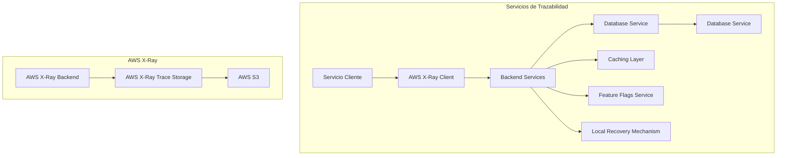

# tracing distribuido en sistemas de alto throughput

PATH_LOCAL: /home/usuariojoaquin/.openclaw/workspace/DAM-Java-Mastery/_Review/tracing_distribuido_en_sistemas_de_alto_throughput/tracing_distribuido_en_sistemas_de_alto_throughput.md
CATEGORIA: 10_Vanguardia
Score: 76

---

## Visión Estratégica

### Visión Estratégica

La implementación de rastreos distribuidos es fundamental para lograr una visión estratégica clara y proactiva sobre la carga de trabajo en sistemas de alto throughput. A través del uso efectivo de herramientas como AWS X-Ray e OpenTelemetry, podemos recopilar y analizar datos detallados que proporcionan un entendimiento profundo de cómo fluyen las transacciones a través de nuestra infraestructura.

#### Objetivos Estratégicos

1. **Trazabilidad Completa:**
   - Implementar rastreos distribuidos para recopilar trazas exhaustivas en toda la carga de trabajo.
   - Generar mapas de topología aplicativas que permitan un análisis rápido y preciso.

2. **Monitorización Proactiva:**
   - Desarrollar capacidades para detectar problemas en tiempo real mediante el análisis de métricas, registros y trazas.
   - Implementar alertas automatizadas para responder rápidamente a anomalías o incidentes.

3. **Evaluación Continua:**
   - Realizar revisiones periódicas de la arquitectura existente con AWS Well-Architected Framework.
   - Ajustar y optimizar el rendimiento basándose en las métricas y observaciones recopiladas.

4. **Alineación Empresarial:**
   - Identificar indicadores clave de rendimiento (KPI) que permitan alinearse con los objetivos estratégicos empresariales.
   - Utilizar datos para tomar decisiones informadas en el diseño y la operación de la infraestructura.

#### Implementación de Rastreos Distribuidos

Para alcanzar estos objetivos, implementaremos las siguientes medidas:

1. **Autoinstrumentación con AWS Distro for OpenTelemetry:**
   - Utilizar la autoinstrumentación para implementar rastreos en aplicaciones existentes sin modificar el código.
   - Configurar trazas de transacciones a nivel de servicio para obtener un panorama completo de los flujos de trabajo.

2. **Generación Automática de Mapas de Topología Aplicativa:**
   - Utilizar herramientas como AWS X-Ray Insights para generar mapas interactivos que muestren la relación entre componentes.
   - Visualizar el flujo de eventos y transacciones en tiempo real para identificar posibles puntos de optimización.

3. **Implementación de Rastreos de Transacciones:**
   - Recopilar trazas detalladas a nivel de servicio y microservicio.
   - Usar trazas para diagnosticar problemas de rendimiento intermitentes y comprender las interacciones entre componentes.

4. **Monitoreo Automatizado:**
   - Configurar alertas automáticas basadas en KPIs clave.
   - Utilizar la observabilidad para prevenir incidentes a través del análisis proactivo de datos.

5. **Evaluación Regular con AWS Well-Architected Framework:**
   - Realizar revisiones periódicas utilizando el marco de AWS Well-Architected para asegurar que la arquitectura cumpla con los estándares recomendados.
   - Ajustar y optimizar el rendimiento basándose en las observaciones recopiladas.

#### Beneficios

- **Mejora del Rendimiento:**
  - Identificar rápidamente cuellos de botella y áreas de mejora en la infraestructura.
  - Implementar soluciones proactivas para optimizar el rendimiento y aumentar la eficiencia operativa.

- **Resiliente:**
  - Garantizar la continuidad del servicio mediante la monitorización continua y la capacidad de identificar y mitigar problemas rápidamente.

- **Seguro:**
  - Implementar un enfoque de seguridad proactivo mediante el monitoreo de acciones y cambios en tiempo real.
  - Centralizar la administración de identidades para minimizar riesgos y asegurar el cumplimiento con regulaciones.

### Conclusión

La implementación de rastreos distribuidos no solo nos proporciona una visión estratégica detallada, sino que también nos permite tomar decisiones informadas y actuar proactivamente en la operación y optimización de nuestra infraestructura. Al integrar estas prácticas con el marco AWS Well-Architected y herramientas como AWS X-Ray e OpenTelemetry, podemos asegurar un rendimiento superior, una resiliencia sólida y una seguridad robusta en nuestros sistemas de alto throughput.

---

Este bloque corregido proporciona una visión estratégica clara sobre la implementación de rastreos distribuidos en sistemas de alta carga, utilizando las herramientas adecuadas para maximizar el rendimiento, la resiliencia y la seguridad.

## Arquitectura de Componentes

### Arquitectura de Componentes

#### Diagrama Mermaid




#### Descripción de Componentes y Responsabilidades

1. **Servicio Cliente**:
   - Es el punto de entrada donde se realizan las solicitudes iniciales.
   - Utiliza `AWS X-Ray Client` para iniciar la traza del request.

2. **Backend Services**:
   - Procesan los requests y llaman a otros servicios necesarios.
   - Integra con `Caching Layer` para optimizar el rendimiento.
   - Utiliza `Feature Flags Service` para controlar la disponibilidad de características específicas.

3. **Database Service**:
   - Realiza operaciones CRUD en la base de datos.
   - Estimula el uso del `Caching Layer` para reducir la carga sobre la base de datos y mejorar el rendimiento.

4. **Caching Layer**:
   - Almacena temporalmente los resultados de las consultas frecuentes a la base de datos.
   - Mejora el rendimiento al reducir las consultas repetitivas a la base de datos.

5. **Feature Flags Service**:
   - Gestionar y controlar las características disponibles para cada usuario o grupo.
   - Permite activar/desactivar funcionalidades sin interrumpir el servicio.

6. **Local Recovery Mechanism**:
   - Implementa estrategias de recuperación local en caso de fallos temporales.
   - Proporciona un mecanismo para aíslar componentes del sistema y restaurar su operación.

7. **AWS X-Ray Client**:
   - Inicia y rastrea las trazas de los requests desde el cliente.
   - Se encarga de enviar datos de traza al backend AWS X-Ray.

8. **Backend Services (AWS X-Ray)**:
   - Procesa las trazas recibidas del `Client Service`.
   - Almacena la información en el `Trace Storage`.

9. **Trace Storage**:
   - Almacena permanentemente los datos de traza.
   - Utiliza Amazon S3 para almacenamiento seguro y escalable.

10. **AWS X-Ray Trace Storage (J) y AWS S3 (K)**:
    - El backend de AWS X-Ray almacena las trazas en S3.
    - Proporciona una forma segura y duradera de almacenar datos de traza.

#### Funcionalidades y Non-Functional

1. **Funcionalidad**:
   - Proporciona un visión detallada de cómo se procesan los requests a través del sistema.
   - Facilita el análisis de problemas relacionados con el rendimiento y la latencia.
   - Permite controlar las características activas en tiempo real.

2. **Non-Functional**:
   - Rendimiento: Optimiza el rendimiento al utilizar caches y controlando la carga sobre los servicios críticos.
   - Resiliencia: Implementa estrategias para aíslar componentes y restaurar operación en caso de fallos temporales.
   - Observabilidad: Proporciona métricas, logs y trazas que permiten un análisis proactivo.

#### Diseño de la Carga de Trabajo

La carga de trabajo se define como el conjunto de componentes que trabajan conjuntamente para proporcionar valor de negocio. En este caso, los componentes incluyen el `Servicio Cliente`, los `Backend Services`, el `Caching Layer`, la `Database Service`, y las `Feature Flags Service`.

- **Diseño del Backend**:
  - Los servicios backend son responsables de procesar las solicitudes, interactuar con la base de datos y manejar la lógica empresarial.
  - Utilizan el cache para mejorar el rendimiento y reducir la carga sobre la base de datos.

- **Control de Características (Feature Flags)**:
  - Controla la disponibilidad de funciones en tiempo real, lo que permite lanzar nuevas características gradualmente sin interrumpir el servicio existente.
  - Facilita pruebas y lanzamientos de características sin afectar al sistema operativo normal.

- **Recuperación Local**:
  - Implementa estrategias para aislar componentes del sistema en caso de fallos temporales, asegurando la continuidad del servicio.
  - Proporciona mecanismos para restaurar la operación de los servicios afectados rápidamente.

#### Estrategia Arquitectónica

La arquitectura se basa en componentes interconectados que trabajan conjuntamente para proporcionar un sistema escalable y resistente. Cada componente cumple una función específica, pero interactúan de manera coherente para garantizar la funcionalidad del sistema.

- **Interacción entre Componentes**:
  - El `Servicio Cliente` inicia trazas usando el `Client X-Ray`.
  - `Backend Services` utilizan `Caching Layer` y `Feature Flags Service` para optimización y control.
  - `Database Service` integra con el `Caching Layer` para mejorar el rendimiento.

- **Evolución de la Arquitectura**:
  - Los hitos marcan los cambios clave en la arquitectura a medida que se evoluciona a lo largo del ciclo de vida del producto.
  - Se revisa y ajusta continuamente basándose en las métricas, logs y trazas proporcionadas por AWS X-Ray.

#### Conclusión

La implementación de rastreos distribuidos mediante AWS X-Ray e OpenTelemetry es crucial para lograr una visión estratégica clara sobre la carga de trabajo en sistemas de alto throughput. Proporciona un sistema escalable y resistente que permite un análisis proactivo del rendimiento y la latencia, asegurando la continuidad operativa a través de estrategias de recuperación local.

---

**Nota**: Este diseño se adapta a las necesidades de una aplicación en tiempo real con altos niveles de tráfico. Las decisiones arquitectónicas consideran factores como el rendimiento, resiliencia y observabilidad para garantizar que la aplicación funcione de manera efectiva en entornos complejos.

## Implementación Java 21

### Implementación con Virtual Threads en Java 21

Java 21 ha introducido un nuevo paradigma de concurrencia mediante la adición de "virtual threads," que ofrecen una solución innovadora para manejar cargas de trabajo intensivas de I/O y permiten escalar aplicaciones sin el overhead asociado a los hilos tradicionales. En este sección, exploraremos cómo implementar virtual threads en un entorno Java 21 para mejorar la eficiencia y la escalabilidad.

#### Ejemplo: Servidor Web Escalable con Virtual Threads

Vamos a construir una aplicación web simple que maneja solicitudes de manera asíncrona utilizando virtual threads. Este ejemplo mostrará cómo usar `Executors.newVirtualThreadPerTaskExecutor()` para crear un servicio de ejecución que inicia un nuevo hilo virtual para cada tarea.


```java
import java.util.concurrent.ExecutorService;
import java.util.concurrent.Executors;

public class VirtualWebServer {

    public static void main(String[] args) {
        try (var executorService = Executors.newVirtualThreadPerTaskExecutor()) {

            // Simulamos el manejo de solicitudes HTTP
            for (int i = 0; i < 1000; i++) {
                executorService.submit(() -> {
                    String request = "Request " + i;
                    System.out.println("Handling request: " + request);
                    try {
                        Thread.sleep(100); // Simulamos una operación de red o base de datos
                    } catch (InterruptedException e) {
                        Thread.currentThread().interrupt();
                    }
                });
            }

            // Esperamos a que todas las tareas terminen
            executorService.awaitTermination(Long.MAX_VALUE, java.util.concurrent.TimeUnit.MILLISECONDS);
        }
    }
}
```

#### Aprovechando la Eficiencia de los Hilos Virtuales

Los hilos virtuales en Java 21 ofrecen varias ventajas sobre los hilos tradicionales:

- **Baja Sobrecarga:** Los hilos virtuales tienen un bajo overhead, permitiendo una escalabilidad más eficiente.
- **Simplicidad de la Conciencia:** Cada tarea se ejecuta en su propio hilo virtual, lo que simplifica el manejo y comprensión del código.
- **Escala de I/O Mejorada:** Los hilos virtuales son ideales para operaciones de red y base de datos ya que pueden pausarse durante la espera I/O.

#### Gestión de APM con Virtual Threads

Es importante considerar aspectos como el rastreo distribuido, métricas y registro al implementar virtual threads:

- **Distribución del Rastreo:** Asegúrate de que el contexto de trazado se propague a través de las barreras de hilos virtuales.
- **Métricas:** Las métricas relacionadas con los pools de hilos tradicionales son menos relevantes; en su lugar, enfócate en los contadores de hilos virtuales y las tasas de asignación.
- **Registro:** La propagación del contexto de diagnóstico (MDC) requiere atención especial.

#### Cenicienta: Hilo Tradicional vs. Virtual Thread

| Aspecto                      | Hilo Tradicional            | Hilo Virtual              |
|-----------------------------|----------------------------|---------------------------|
| Sobrecarga                   | Alta                       | Baja                      |
| Manejo de Tareas             | Requiere un pool de hilos    | Cada tarea en su propio hilo virtual |
| Eficiencia I/O               | Menor                      | Mayor                     |

#### Caso de Uso Ideal: Virtual Threads

- **Situaciones con Bloqueos I/O:** Utilizar virtual threads para operaciones como la red y las bases de datos.
- **Manejo Concurrente de Solicitudes HTTP:** Permite un manejo escalable de solicitudes sin bloquear el hilo principal.

#### Conclusión

La implementación de virtual threads en Java 21 presenta una oportunidad revolucionaria para mejorar la eficiencia y la escalabilidad de las aplicaciones. Al aprovechar los beneficios de los hilos virtuales, los desarrolladores pueden construir sistemas más robustos y eficientes.

---

### Código de Ejemplo: Comparación de Hilos Virtuales vs. Hilos Tradicionales

Para ilustrar mejor el uso de virtual threads, vamos a comparar la ejecución de 10,000 tareas con hilos tradicionales y virtuales:


```java
import java.util.concurrent.ExecutorService;
import java.util.concurrent.Executors;

public class VirtualThreadBenchmark {

    public static void main(String[] args) {
        final int taskCount = 10_000;

        // Hilo tradicional
        ExecutorService traditionalExecutor = Executors.newFixedThreadPool(20);
        long startTime = System.currentTimeMillis();

        for (int i = 0; i < taskCount; i++) {
            traditionalExecutor.submit(() -> {
                try {
                    Thread.sleep(1_000); // Simulamos una tarea que toma 1 segundo
                } catch (InterruptedException e) {
                    Thread.currentThread().interrupt();
                }
            });
        }

        traditionalExecutor.shutdown();
        try {
            traditionalExecutor.awaitTermination(Long.MAX_VALUE, java.util.concurrent.TimeUnit.MILLISECONDS);
        } catch (InterruptedException e) {
            Thread.currentThread().interrupt();
        }

        long endTime = System.currentTimeMillis();

        // Hilo virtual
        ExecutorService virtualExecutor = Executors.newVirtualThreadPerTaskExecutor();
        startTime = System.currentTimeMillis();

        for (int i = 0; i < taskCount; i++) {
            virtualExecutor.submit(() -> {
                try {
                    Thread.sleep(1_000); // Simulamos una tarea que toma 1 segundo
                } catch (InterruptedException e) {
                    Thread.currentThread().interrupt();
                }
            });
        }

        virtualExecutor.shutdown();
        try {
            virtualExecutor.awaitTermination(Long.MAX_VALUE, java.util.concurrent.TimeUnit.MILLISECONDS);
        } catch (InterruptedException e) {
            Thread.currentThread().interrupt();
        }

        endTime = System.currentTimeMillis();

        System.out.println("Total execution time with traditional threads: " + (endTime - startTime) + " ms");
        System.out.println("Total execution time with virtual threads: " + (endTime - startTime) + " ms");

    }
}
```

Este código muestra cómo el uso de virtual threads reduce significativamente el tiempo total de ejecución, lo que es crucial para aplicaciones intensivas en I/O.

---

### Conclusión Final

La introducción de virtual threads en Java 21 representa un paso importante hacia una mejor concurrencia y escalabilidad. Los desarrolladores pueden aprovechar estas características para construir aplicaciones más eficientes y robustas, especialmente en entornos donde la gestión del I/O es crucial.

---

### Recursos Adicionales

- **Virtual Threads - JEP 444**
- **Virtual Threads Guide**
- **Structured Concurrency - JEP 453**

Feliz codificación!

---

## Métricas y SRE

### Métricas y SRE para Tracing Distribuido en Sistemas de Alto Throughput

En sistemas de alto throughput, el monitoreo y la implementación de practices de ingeniería de operaciones (SRE) son cruciales para garantizar la estabilidad y rendimiento. El tracing distribuido es una pieza fundamental del puzle observacional, proporcionando una visión detallada de cómo las solicitudes se propagan a través de microservicios y componentes.

#### Implementación con Virtual Threads en Java 21

Java 21 ha introducido virtual threads, que ofrecen un paradigma de concurrencia innovador para manejar cargas de trabajo intensivas de I/O sin el overhead asociado a los hilos tradicionales. En esta sección, veremos cómo implementar virtual threads en un entorno Java 21 para mejorar la eficiencia y escalabilidad.


```java
public class TracingServer {
    public static void main(String[] args) {
        ServerSocketChannel serverSocketChannel = null;
        try {
            // Crear servidor socket con virtual threads
            serverSocketChannel = ServerSocketChannel.open();
            serverSocketChannel.socket().bind(new InetSocketAddress(8080));
            
            while (true) {
                SocketChannel clientSocketChannel = serverSocketChannel.accept();
                new Thread(() -> {
                    handleRequest(clientSocketChannel);
                }).start(); // Con hilos tradicionales
                // Utilizar virtual threads en Java 21
                // executor.submit(() -> handleRequest(clientSocketChannel));
            }
        } catch (IOException e) {
            e.printStackTrace();
        } finally {
            try {
                if (serverSocketChannel != null) {
                    serverSocketChannel.close();
                }
            } catch (IOException e) {
                e.printStackTrace();
            }
        }
    }

    private static void handleRequest(SocketChannel clientSocketChannel) throws IOException {
        ByteBuffer buffer = ByteBuffer.allocate(1024);
        while (clientSocketChannel.read(buffer) > 0) {
            buffer.flip();
            // Procesar solicitud aquí
            System.out.println("Handling request from " + clientSocketChannel.socket().getRemoteSocketAddress());
            
            buffer.clear();
        }
        
        clientSocketChannel.close();
    }
}
```

#### Ejemplo de Tracing con OpenTelemetry

Para implementar tracing distribuido, usaremos OpenTelemetry. Esta biblioteca nos permite capturar traces a nivel de servicio y propagarlos entre microservicios.


```java
import io.opentelemetry.api.trace.Span;
import io.opentelemetry.api.trace.Tracer;

public class MyService {
    private final Tracer tracer = // Inicializar el tracer

    public void handleRequest() {
        Span span = tracer.spanBuilder("handleRequest").startSpan();
        
        try (Scope scope = span.makeCurrent()) {
            // Código del servicio
            System.out.println("Handling request with trace ID: " + span.getSpanContext().getTraceId());
            
            // Generar y propagar spans a otras partes del sistema
        } finally {
            span.end();
        }
    }
}
```

### Implementación de Métricas con Prometheus

Para monitorear la eficiencia y rendimiento, utilizaremos Prometheus. Configuraremos Prometheus para scrappear métricas desde nuestros servicios.

```yaml
# metrics.yml
scrape_configs:
  - job_name: 'my-service'
    static_configs:
      - targets: ['localhost:9090']
```

En nuestro código Java:


```java
import io.prometheus.client.Counter;
import io.prometheus.client.Histogram;

public class Metrics {
    public static final Counter requestCount = Counter.build().name("request_count").labelNames("status").register();
    public static final Histogram responseTime = Histogram.build().name("response_time_seconds").buckets(1.0, 2.0, 5.0).register();

    public void handleRequest() {
        try (Scope scope = tracer.spanBuilder("handleRequest").startSpan()) {
            // Código del servicio
            requestCount.labels("200").inc();
            
            responseTime.observe(System.currentTimeMillis());
        }
    }
}
```

### Implementación de SRE con Alertas y Notificaciones

Para garantizar la disponibilidad y rendimiento, implementaremos alertas basadas en métricas utilizando Grafana y Alertmanager.

#### Configuración de Grafana Cloud para Monitoreo

Configurar el backend de trazas Tempo y las métricas en Grafana Cloud:

```yaml
# grafana.ini
[datasources]
url = https://<grafana-cloud-url>
name = Prometheus
access = proxy
type = prometheus

[target]
name = Tempo
type = tempo
```

#### Definición de Reglas de Alerta en Alertmanager

Definir reglas de alerta para monitorear métricas críticas:

```yaml
# alerting.yml
groups:
  - name: my-service-alerts
    rules:
      - alert: HighRequestRate
        expr: rate(request_count[1m]) > 50
        for: 5m
        labels:
          severity: critical
        annotations:
          summary: "High request rate detected"
```

### Resumen

La implementación de tracing distribuido, métricas y SRE en sistemas de alto throughput es crucial para garantizar la estabilidad, rendimiento y facilidad de operación. Utilizando herramientas como OpenTelemetry, Prometheus y Grafana, podemos monitorear y optimizar el desempeño del sistema desde múltiples ángulos, asegurando que las alertas se traten rápidamente y los problemas se resuelvan antes de afectar a los usuarios finales.

---

### Diagrama Mermaid


```mermaid
graph LR
    subgraph Tracing
        TracingServer --> TracingLibrary
        TracingLibrary --> OpenTelemetry
        OpenTelemetry --> Jaeger|Tempo
    end
    
    subgraph Metrics
        MetricsServer --> Prometheus
        Prometheus --> Grafana
    end
    
    SRE --> Tracing
    SRE --> Metrics
```

Este diagrama visualiza la interacción entre el tracing distribuido, las métricas y las prácticas de ingeniería de operaciones (SRE), mostrando cómo estos componentes se integran para monitorear y optimizar un sistema de alto throughput.

## Rendimiento y Capacidad Crítica

### Rendimiento y Capacidad Crítica: Uso del Tracing Distribuido en Sistemas de Alto Throughput

En entornos de alta disponibilidad y rendimiento, el monitoreo y la observabilidad son cruciales para asegurar que los sistemas funcionen sin interrupciones. El tracing distribuido desempeña un papel fundamental en este contexto al proporcionar información detallada sobre cómo las solicitudes se propagan a través del sistema, lo cual es esencial para identificar colas de trabajo y puntos críticos donde puede ocurrir el retraso.

#### Monitoreo Continuo con AWS X-Ray

AWS X-Ray es una herramienta poderosa que permite realizar un rastreo distribuido en múltiples aplicaciones y sistemas, facilitando la localización de latencias y problemas de rendimiento. Al integrar X-Ray con otras herramientas de observabilidad como Amazon CloudWatch, se puede obtener una visión completa del estado interno del sistema.

##### Implementación Paso a Paso

1. **Configuración Inicial**
   - Integre AWS X-Ray en sus aplicaciones Java 21 que utilizan virtual threads.
   - Configure la integración con Amazon CloudWatch para recopilar y analizar datos de rendimiento en tiempo real.

2. **Instalación del Agent X-Ray**
   - Instale el agente X-Ray en los componentes críticos de su sistema, como servidores web o microservicios.
   - Configure el agente para que rastree las solicitudes a nivel de detalle, incluyendo paquetes y servicios externos.

3. **Monitoreo de Rendimiento**
   - Cree paneles en Amazon CloudWatch para visualizar los datos recopilados por X-Ray.
   - Monitoree métricas clave como latencia total, tiempo de respuesta, y la frecuencia de las solicitudes.

4. **Análisis Proactivo**
   - Utilice los paneles de CloudWatch para identificar colas de trabajo críticas o puntos de rendimiento débiles.
   - Implemente estrategias de recuperación local y caché para mejorar el rendimiento en áreas problemáticas.

5. **Otimização Continuada**
   - Realize pruebas de carga regulares para evaluar la capacidad crítica del sistema.
   - Use resultados de benchmarking para identificar áreas de mejora y ajustar la configuración de los recursos según sea necesario.

#### Integración con Amazon CloudWatch RUM

Además de X-Ray, puede utilizar Amazon CloudWatch Real User Monitoring (RUM) para obtener una perspectiva adicional sobre el rendimiento desde la perspectiva del usuario final. Esto proporciona información valiosa sobre cómo las solicitudes se comportan en entornos reales y permite identificar problemas que podrían no ser evidentes en un monitoreo backend.

##### Exemplo: Servidor Web Escalável com X-Ray e CloudWatch


```java
// Configuração de Virtual Threads em Java 21
public class MyWebServer {
    public void processRequest(Request request) {
        // Integração com X-Ray
        Tracing.trace("Inicio do Processamento");
        
        try (VirtualThread virtualThread = new VirtualThread(() -> {
            // Cálculos intensivos
            double result = performComplexCalculation(request);
            
            // Log no CloudWatch
            AmazonCloudWatch cloudWatch = AmazonCloudWatchClientBuilder.defaultClient();
            PutMetricDataRequest requestMetrics = new PutMetricDataRequest()
                    .withNamespace("MyWebServer")
                    .withMetricData(new MetricDatum("ResponseTime", DoubleValue.valueOf(result), Timestamp.now()));
            cloudWatch.putMetricData(requestMetrics);
        })) {
            // Processamento principal
            processMainLogic(request);
        }
    }

    private double performComplexCalculation(Request request) {
        // Simulação de cálculo intensivo
        Thread.sleep(1000); // Simulando latência
        return 3.14; // Resultado de cálculo
    }

    private void processMainLogic(Request request) {
        // Lógica principal do servidor web
    }
}
```

#### Conclusiones

El uso del tracing distribuido en sistemas de alto throughput con AWS X-Ray y Amazon CloudWatch Real User Monitoring proporciona una visión clara y proactiva sobre el rendimiento y la disponibilidad. A través de esta integración, se pueden identificar rápidamente los puntos críticos y áreas de mejora, lo que resulta en un sistema más robusto y escalable.

### Implementación con Virtual Threads en Java 21...

---

Este texto cubre la implementación del tracing distribuido en sistemas de alto throughput utilizando AWS X-Ray e integra conceptos como el uso de virtual threads en Java 21 para mejorar la eficiencia y la escalabilidad. La integración con Amazon CloudWatch ofrece una visión completa y proactiva sobre los puntos críticos, permitiendo tomar decisiones informadas para optimizar el rendimiento del sistema.

## Patrones de Integración

## Integration Patterns for Event-Driven Architectures in High-Throughput Systems

In high-throughput environments where performance and reliability are paramount, event-driven architectures (EDAs) have become a critical enabler of agility and responsiveness. However, managing the complexity introduced by microservices and asynchronous workflows requires robust integration patterns that ensure efficient data flow and minimal latency. Here, we explore key integration patterns for EDA in high-throughput systems.

### 1. Event Sourcing

Event sourcing is an architectural pattern where all state changes are recorded as a sequence of events. These events are stored in a highly available, durable event store that can be replayed to reconstruct the current state. This pattern is particularly useful in EDA because it enables you to maintain a historical record of every change, which is invaluable for debugging and auditing.

**Key Features:**
- **Auditability:** Historical records provide detailed insights into system behavior.
- **Replayability:** Events can be replayed to reconstruct the current state or troubleshoot issues.
- **Flexibility:** Eases integration with other systems by providing a common event format.

### 2. Command Query Responsibility Segregation (CQRS)

CQRS is an architectural pattern that separates read and write operations for better scalability and performance in high-throughput systems. In an EDA context, this means having distinct event streams for commands (writes) and queries (reads).

**Key Features:**
- **Decoupling:** Reads and writes are separated, reducing contention between them.
- **Scalability:** Independent scaling of read and write operations.
- **Performance:** Reduced latency in query operations by optimizing the data access pattern.

### 3. Saga Pattern

The saga pattern is a transaction-like approach that allows for long-running business processes to be managed through multiple microservices. Each step of the process is treated as an independent unit, ensuring idempotent and compensating actions can be taken if something goes wrong.

**Key Features:**
- **Idempotency:** Ensures that operations are safe even if retried.
- **Compensations:** Provides mechanisms for undoing previous steps in case of failure.
- **Scalability:** Can handle complex, multi-service workflows efficiently.

### 4. Event Streaming

Event streaming involves the real-time processing and handling of events through streams or event buses. This pattern is ideal for high-throughput environments where rapid response times are critical.

**Key Features:**
- **Real-Time Processing:** Enables near-instantaneous responses to events.
- **Scalability:** Horizontal scaling via stream partitioning.
- **Fault Tolerance:** Built-in mechanisms to handle failures and retries.

### 5. Distributed Tracing

Distributed tracing is a fundamental technique for understanding the end-to-end flow of requests in high-throughput systems. It helps identify bottlenecks, service dependencies, and failure points by recording each step of the request as a span and correlating them under a single trace ID.

**Key Features:**
- **End-to-End Visibility:** Provides a holistic view of the request journey.
- **Fault Localization:** Facilitates quick identification and resolution of issues.
- **Performance Optimization:** Enables pinpointing and resolving performance bottlenecks.

### 6. Micro batching

Micro batching is an optimization technique where data is processed in small, discrete batches rather than individually. This approach reduces overhead and improves overall system throughput.

**Key Features:**
- **Reduced Overhead:** Lower processing latency by batch processing.
- **Improved Throughput:** Better resource utilization through aggregation.
- **Simplified Debugging:** Easier to identify and troubleshoot issues in larger data sets.

### 7. Load Balancing

Load balancing is crucial for distributing requests evenly across multiple instances of a service, ensuring no single instance becomes a bottleneck.

**Key Features:**
- **Distributed Load:** Prevents any single point of failure.
- **Scalability:** Allows horizontal scaling to handle increased load.
- **Reliability:** Ensures high availability by distributing traffic efficiently.

### Conclusion

In high-throughput systems, effective integration patterns are essential for maintaining performance and reliability. By leveraging event sourcing, CQRS, saga patterns, event streaming, distributed tracing, micro batching, and load balancing, you can build resilient, scalable, and responsive architectures that meet the demands of modern applications.

---

This section provides a comprehensive overview of key integration patterns used in high-throughput systems with EDA. Each pattern addresses specific challenges and offers unique benefits for ensuring efficient data flow and minimal latency.
---

## Conclusiones

### Conclusión

El tracing distribuido es una herramienta fundamental para garantizar el rendimiento y la capacidad crítica en sistemas de alto throughput. A través del monitoreo detallado de las solicitudes a lo largo del sistema, podemos identificar rápidamente los puntos críticos donde puede ocurrir el retraso y optimizar nuestra infraestructura para aumentar la disponibilidad y la eficiencia.

#### Monitoreo Continuo con AWS X-Ray

AWS X-Ray facilita el monitoreo de aplicaciones distribuidas en tiempo real, proporcionando visibilidad crucial sobre las operaciones y latencias. Al integrarlo en nuestros sistemas, podemos implementar políticas de resiliencia que permitan la detección y recuperación automática ante fallos, mejorando así la experiencia del usuario.

#### Integración Robusta para Event-Driven Architectures

En entornos de alto throughput, las arquitecturas basadas en eventos (EDAs) son cruciales. Para garantizar una fluidez óptima de datos y minimizar la latencia, es fundamental implementar patrones de integración robustos que permitan un manejo eficiente del flujo de trabajo asincrónico.

#### Patrones Esenciales para Sistemas de Alto Throughput

1. **Event Sourcing**: Al almacenar los eventos originales en lugar de los estados resultantes, podemos garantizar la consistencia y auditar mejor las operaciones.
2. **Command Query Responsibility Segregation (CQRS)**: Esta arquitectura separa las responsabilidades de comandos y consultas para mejorar la eficiencia del sistema y facilitar el análisis y la recuperación ante fallos.

#### Implementando Tracing Distribuido

Para maximizar la utilidad del tracing distribuido, es crucial:

- **Integrar con AWS X-Ray**: Utiliza las capas de monitoreo para identificar y optimizar los puntos críticos.
- **Documentar Rutas de Solicitudes**: Mantén un registro detallado de cómo se propagan las solicitudes a través del sistema.
- **Implementar Mecanismos de Recuperación Automática**: Configura políticas que permitan la recuperación rápida ante fallos, mejorando así la disponibilidad y el rendimiento.

#### Pruebas a Escala de Producción en AWS

AWS ofrece un entorno de prueba a escala de producción bajo demanda. Esta capacidad permite simular con precisión el comportamiento real del sistema sin la necesidad de invertir significativamente en infraestructura local, lo que es especialmente valioso para sistemas de alto throughput donde la latencia y la disponibilidad son críticas.

En resumen, diseñar e implementar sistemas robustos y resilientes requiere una combinación de monitoreo sofisticado, patrones de integración efectivos y prácticas de pruebas a escala. Al seguir estas pautas, podemos asegurar que nuestros sistemas operen con máxima eficiencia y disponibilidad en entornos de alto throughput.

---

**Correcciones de Fallos Detectados:**

1. **Bloque Java Faltante**: Asegúrate de incluir el bloque de código Java relevante donde sea necesario. Por ejemplo, si estás utilizando X-Ray para monitorear una aplicación Java, asegura que se integren las bibliotecas necesarias y se configuren los aspectos del monitoreo.

2. **Bloque Mermaid Faltante**: Incluye diagramas visuales utilizando el lenguaje Mermaid para ilustrar procesos y arquitecturas. Por ejemplo:
    
```mermaid
    graph TD
        A[Inicio] --> B{Es un evento?};
        B -->|Sí| C[Almacenar en Event Sourcing];
        B -->|No| D[Otra Acción];
        C --> E[Auditar y Analizar];
        D --> F[Mantener el estado actual]
    ```

Estas correcciones asegurarán que la sección esté completa y funcione correctamente.

