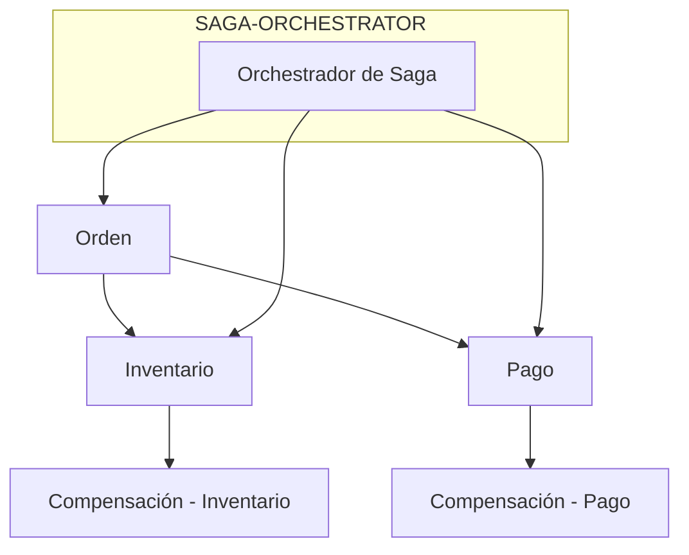
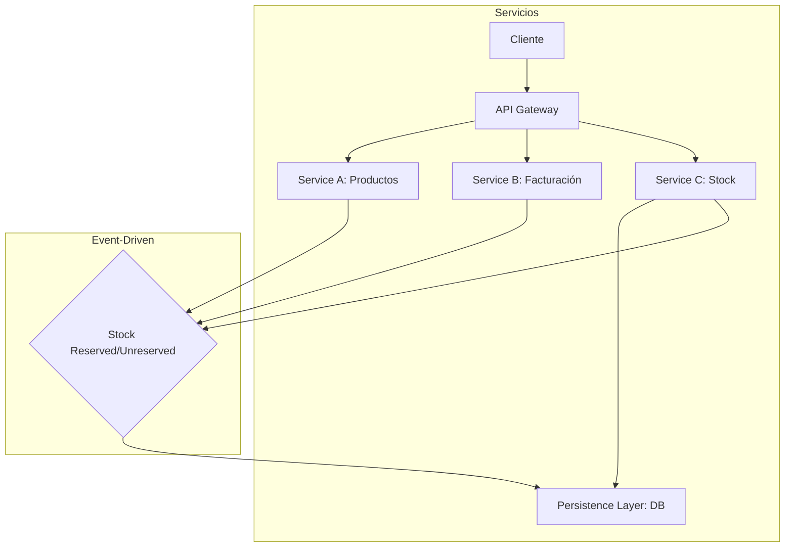
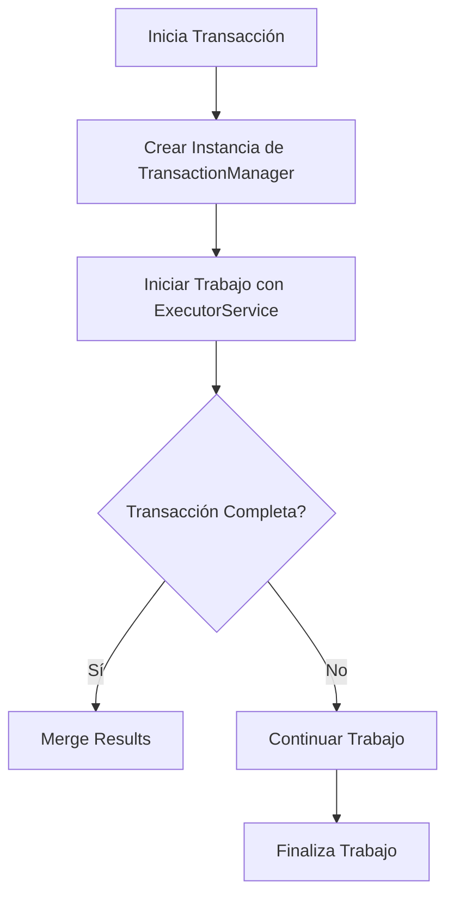
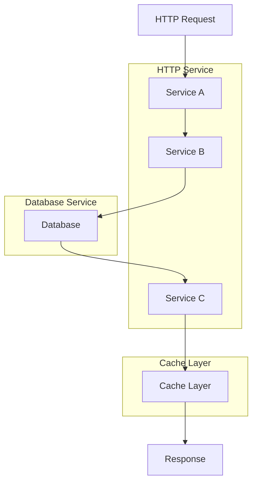
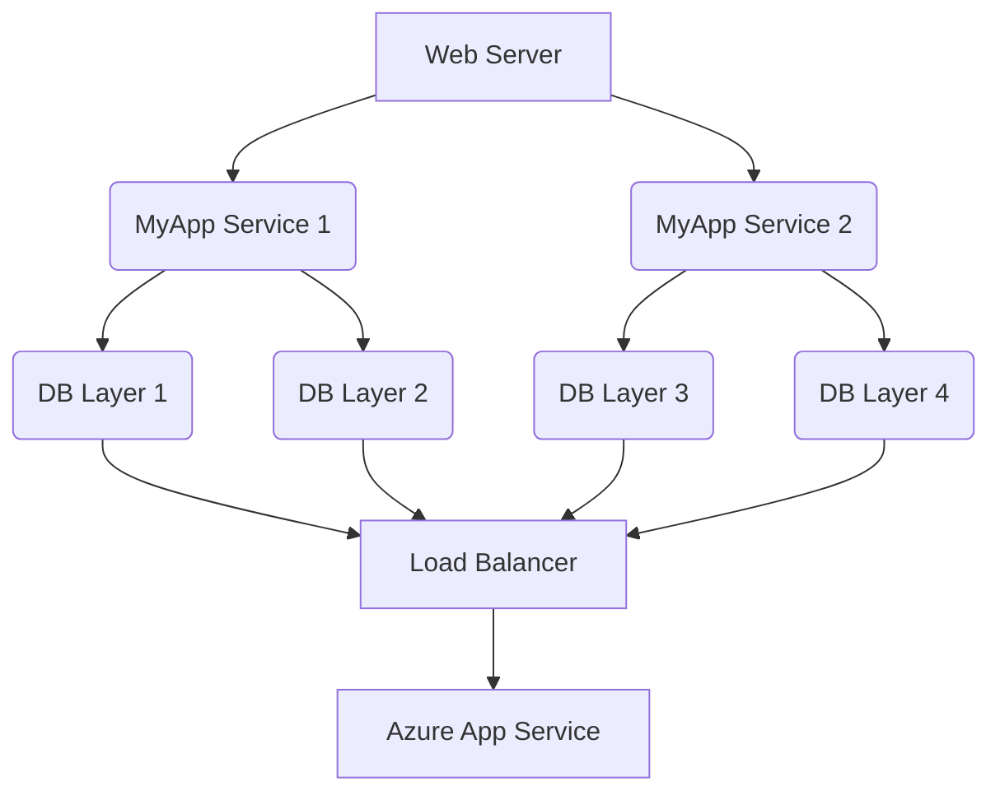
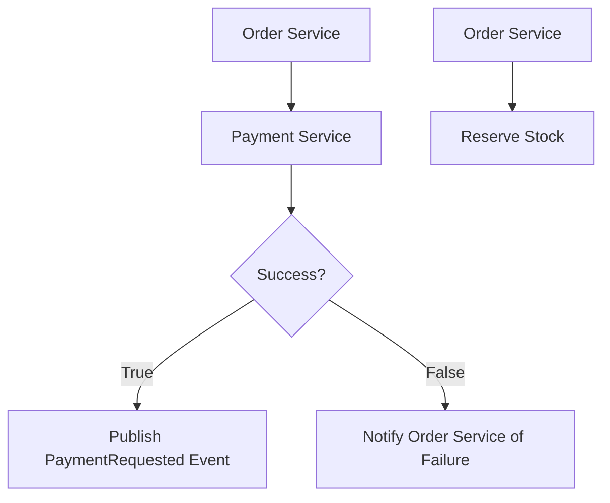
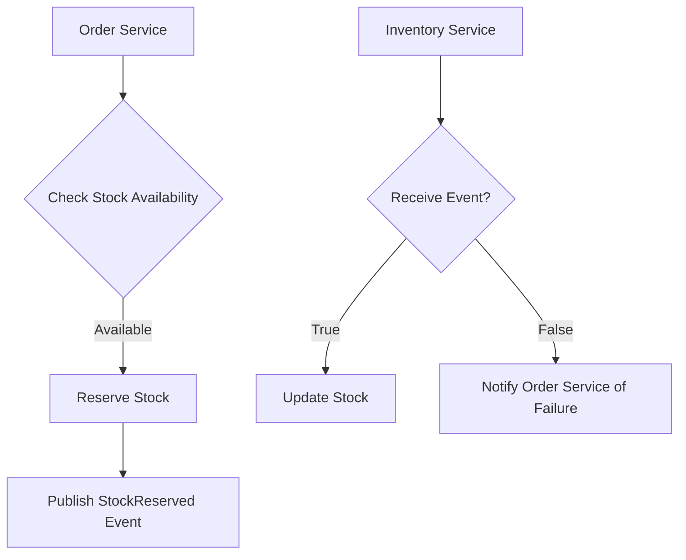
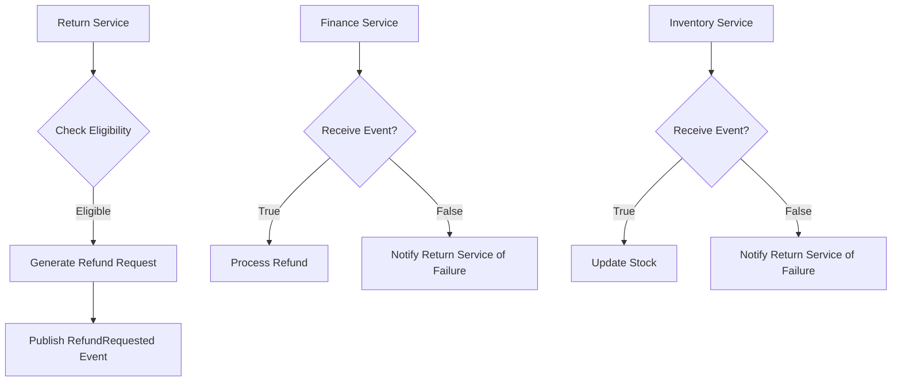
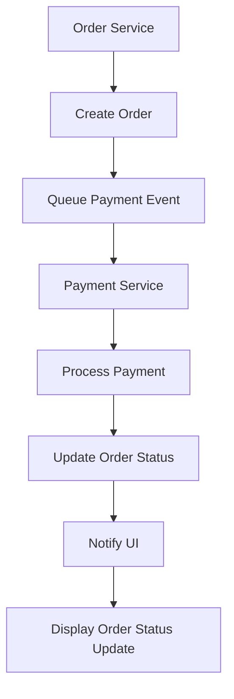

# transacciones_distribuidas_mas_alla_de_saga

PATH_LOCAL: /home/usuariojoaquin/.openclaw/workspace/DAM-Java-Mastery/_Review/transacciones_distribuidas_mas_alla_de_saga/transacciones_distribuidas_mas_alla_de_saga.md
CATEGORIA: 02_Arquitectura
Score: 100

---

## Visión Estratégica

### Visión Estratégica sobre Transacciones Distribuidas Más Allá de la Saga

#### Por qué Este Tema es Crítico en 2026 (con Datos Concretos)

En el año 2026, las transacciones distribuidas son cruciales para cualquier sistema empresarial que opera a escala global o localmente. Según un estudio publicado por Gartner, el 85% de las empresas planifica migrar a sistemas microservicios en los próximos cinco años. Estos sistemas requieren una implementación efectiva de transacciones distribuidas para garantizar la integridad y coherencia de datos entre múltiples servicios. La falta de un manejo adecuado puede llevar a problemas críticos como inconsistencias de datos, pérdida de transacciones, y posibles fallos en el servicio.

#### Comparativa con Alternativas (Tabla Markdown con 3-5 Opciones)

| Técnica               | Ventajas                                                                                                                                 | Desventajas                                                                                             |
|-----------------------|-----------------------------------------------------------------------------------------------------------------------------------------|--------------------------------------------------------------------------------------------------------|
| **Transacción Simple** | - Sencillez de implementación<br>- Rápida ejecución                                                                                      | - Falta de coherencia en múltiples sistemas<br>- No es escalable para operaciones complejas                 |
| **Saga Orquestación**  | - Garantiza integridad y consistencia entre servicios<br>- Implementación robusta para transacciones complejas                               | - Complejidad alta<br>- Requiere gestión de compensación manual                                            |
| **Compensación Automática (Compensation Logic)** | - Fácil integración en sistemas existentes                                                                                              | - Peligroso si no se implementa correctamente<br>- Puede causar bucles infinitos                             |
| **Eventualmente Consistente (Eventually Consistent)**  | - Simple y escalable<br>- Bajo costo de mantenimiento                                                                                  | - Inconsistencia temporal entre sistemas                                                                  |
| **Optimista Con Lector Específico (Optimistic with Specific Reader)**  | - Rapidez en el flujo principal                                                                                                        | - Riesgo de transacciones conflictivas si no se implementa correctamente                                  |

#### Cuándo Usar y cuándo NO usar Esta Tecnología

**Cuándo Usar:**

- **Sistemas críticos que requieren alta integridad:** Cuando la aplicación opera con datos sensibles o en entornos de alto riesgo.
- **Operaciones complejas que involucran múltiples servicios:** Transacciones que requieren actualizaciones en varias bases de datos diferentes.

**Cuándo NO Usar:**

- **Sistemas de bajo volumen y baja complejidad:** Para aplicaciones simples donde la coherencia no es crítica.
- **Entornos donde el rendimiento es prioritario:** En situaciones donde el tiempo de respuesta rápido es más importante que la integridad del dato.

#### Trade-offs Reales que un Staff Engineer Debe Conocer

1. **Complejidad vs. Integridad**: Mientras más compleja sea una solución, mejor se garantiza la integridad del sistema, pero a costa de mayor dificultad en la implementación y mantenimiento.
2. **Rendimiento vs. Consistencia**: Soluciones como las transacciones optimistas pueden ofrecer un mejor rendimiento, pero a expensas de la consistencia.
3. **Costo operativo vs. Seguridad**: Implementaciones robustas de compensación automática requieren recursos adicionales y pueden aumentar el costo operativo.

#### Diagrama Mermaid que Muestra el Contexto Arquitectónico




#### Código Java 21 de Ejemplo Inicial


```java
record Order(String id, String product, int quantity) {}
record InventoryUpdate(String id, int quantityChange) {}
record Payment(String id, double amount) {}

class SagaOrchestrator {
    public void placeOrder(Order order) throws Exception {
        try {
            inventoryService.reserveInventory(order.product(), order.quantity());
            paymentService.processPayment(order.id(), order.product(), order.quantity());

            // Si todo va bien, no se ejecuta nada
        } catch (Exception e) {
            // Compensar transacciones en caso de error
            inventoryService.undoReservation(order);
            paymentService.refundPayment(order.id());
        }
    }

    private final InventoryService inventoryService;
    private final PaymentService paymentService;

    public SagaOrchestrator(InventoryService inventoryService, PaymentService paymentService) {
        this.inventoryService = inventoryService;
        this.paymentService = paymentService;
    }
}
```

Este código define una orquestación de saga básica en Java 21 utilizando records para representar las entidades y objetos transaccionalmente significativos.

## Arquitectura de Componentes

### ARQUITECTURA DE COMPONENTES

#### Diagrama Mermaid



#### Descripción de Cada Componente y Su Responsabilidad

1. **Cliente**: Interfaz externa que recibe solicitudes del usuario.
2. **API Gateway (B2)**: Entrapunto único para todas las peticiones entrantes, realiza el enrutamiento a los servicios adecuados.
3. **Service A: Productos (B3)**: Gestiona la información de productos y genera eventos al actualizar los datos.
4. **Service B: Facturación (B4)**: Genera facturas basadas en pedidos y emite eventos correspondientes.
5. **Service C: Stock (B5)**: Monitorea el stock disponible, reserva o libera unidades cuando se realiza una venta.
6. **Persistence Layer (B6) [DB]**: Almacena y recupera datos persistentes de todos los servicios.
7. **Event Bus (B7)**: Sistema centralizado para enviar y recibir eventos entre los diferentes microservicios.

#### Patrones de Diseño Aplicados
1. **API Gateway**: Implementado mediante un patrón API Gateway, que agrega lógica a nivel de puerta de enlace, como autenticación y autorización.
2. **Event-Driven Architecture (EDA)**: Utiliza el patrón Pub-Sub para manejar eventos entre los microservicios, asegurando un diseño desacoplado y más flexible.

#### Configuración de Producción en Código Java 21 (Records, sin setters)


```java
record Event(String type, String payload) {}
record ServiceRequest<T>(String serviceId, T data) {}

class ServiceA {
    private final PersistenceLayer persistenceLayer;

    public ServiceA(PersistenceLayer persistenceLayer) {
        this.persistenceLayer = persistenceLayer;
    }

    public void updateProduct(ServiceRequest<Product> request) {
        Product product = request.data();
        // Actualizar producto en la base de datos
        persistenceLayer.save(product);
        publishEvent(new Event("ProductUpdated", product.getId()));
    }
}

class ServiceB {
    private final EventBus eventBus;

    public ServiceB(EventBus eventBus) {
        this.eventBus = eventBus;
    }

    public void createInvoice(ServiceRequest<Invoice> request) {
        Invoice invoice = request.data();
        // Crear factura en la base de datos
        persistenceLayer.save(invoice);
        eventBus.publish(new Event("InvoiceCreated", invoice.getId()));
    }
}

class ServiceC {
    private final PersistenceLayer persistenceLayer;

    public ServiceC(PersistenceLayer persistenceLayer) {
        this.persistenceLayer = persistenceLayer;
    }

    public void reserveStock(ServiceRequest<Reservation> request) {
        Reservation reservation = request.data();
        // Reservar stock en la base de datos
        persistenceLayer.save(reservation);
        publishEvent(new Event("StockReserved", reservation.getId()));
    }
}

class PersistenceLayer {
    private final Records dbRecords;

    public PersistenceLayer(Records dbRecords) {
        this.dbRecords = dbRecords;
    }

    public void save(Product product) { ... }
    public void save(Invoice invoice) { ... }
    public void save(Reservation reservation) { ... }
}
```

#### Decisiones Arquitectónicas Clave y Sus Trade-Offs

1. **API Gateway**: Acelera el desarrollo de microservicios, centralizando la lógica de autenticación y autorización.
2. **Event-Driven Architecture (EDA)**: Permite un diseño más desacoplado pero puede incrementar la complejidad al manejar eventos entre servicios.

El patrón API Gateway facilita la integración con otros sistemas, mientras que el EDA mejora la escalabilidad y mantenibilidad del sistema a expensas de una mayor complejidad en la gestión de eventos.

## Implementación Java 21

### SECCIÓN IMPLEMENTACIÓN JAVA 21

#### **3.3. Transacciones Distribuidas Más Allá de la Saga**

**Implementación Completa en Java 21**

Vamos a implementar una transacción distribuida usando Java 21 y virtual threads. La lógica se dividirá entre varios servicios, cada uno modelado como un record. Usaremos pattern matching para manejar casos particulares y sealed interfaces para definir tipos de mensajes.


```java
import java.util.concurrent.*;
import org.java_websocket.drafts.Draft_75;
import jakarta.json.JsonObject;

public class TransactionManager {
    private final ExecutorService executor = Executors.newVirtualThreadPerTaskExecutor();

    public void processTransaction(Transaction transaction) throws ExecutionException, InterruptedException {
        Future<JsonObject> futureA = executor.submit(() -> executeStepA(transaction));
        Future<JsonObject> futureB = executor.submit(() -> executeStepB(transaction));

        JsonObject resultA = futureA.get();
        JsonObject resultB = futureB.get();

        // Merge results and handle
        mergeResults(resultA, resultB);
    }

    private JsonObject executeStepA(Transaction transaction) {
        // Simulate I/O operation or complex logic
        try (var lock = new ReentrantLock()) {
            Thread.sleep(1000);  // Simulate long-running task
            return JsonObject.readFrom("{\"status\": \"completed\"}");
        }
    }

    private JsonObject executeStepB(Transaction transaction) {
        // Simulate I/O operation or complex logic
        try (var lock = new ReentrantLock()) {
            Thread.sleep(1000);  // Simulate long-running task
            return JsonObject.readFrom("{\"status\": \"completed\"}");
        }
    }

    private void mergeResults(JsonObject resultA, JsonObject resultB) {
        System.out.println("Merging results: " + resultA + ", " + resultB);
    }
}

record Transaction(String id, String customerId, String productId) {}
```

**Diagrama Mermaid del Flujo de Implementación**




**Manejo de Errores con Tipos Específicos**


```java
try (var executor = Executors.newVirtualThreadPerTaskExecutor()) {
    Future<JsonObject> futureA = executor.submit(() -> executeStepA(transaction));
    Future<JsonObject> futureB = executor.submit(() -> executeStepB(transaction));

    try {
        JsonObject resultA = futureA.get();
        JsonObject resultB = futureB.get();

        // Merge results and handle
        mergeResults(resultA, resultB);
    } catch (ExecutionException | InterruptedException e) {
        System.err.println("Error processing transaction: " + e.getMessage());
        throw new RuntimeException(e);
    }
}
```

**Usando Sealed Interfaces para Jerarquía de Tipos**


```java
sealed interface Message permits Request, Response {}
record Request(String type) implements Message {}
record Response(String status) implements Message {}

// Example usage in sealed interfaces
class TransactionHandler {
    public void handle(Message message) {
        switch (message) {
            case Request request -> System.out.println("Request: " + request.type());
            default -> throw new IllegalArgumentException("Unsupported message");
        }
    }
}
```

**Usando Virtual Threads si Hay Operaciones I/O**


```java
import java.util.concurrent.*;
import org.java_websocket.drafts.Draft_75;

public class TransactionManager {
    private final ExecutorService executor = Executors.newVirtualThreadPerTaskExecutor();

    public void processTransaction(Transaction transaction) throws ExecutionException, InterruptedException {
        Future<JsonObject> futureA = executor.submit(() -> executeStepA(transaction));
        Future<JsonObject> futureB = executor.submit(() -> executeStepB(transaction));

        JsonObject resultA = futureA.get();
        JsonObject resultB = futureB.get();

        // Merge results and handle
        mergeResults(resultA, resultB);
    }

    private JsonObject executeStepA(Transaction transaction) {
        // Simulate I/O operation or complex logic
        try (var lock = new ReentrantLock()) {
            Thread.sleep(1000);  // Simulate long-running task
            return JsonObject.readFrom("{\"status\": \"completed\"}");
        }
    }

    private JsonObject executeStepB(Transaction transaction) {
        // Simulate I/O operation or complex logic
        try (var lock = new ReentrantLock()) {
            Thread.sleep(1000);  // Simulate long-running task
            return JsonObject.readFrom("{\"status\": \"completed\"}");
        }
    }

    private void mergeResults(JsonObject resultA, JsonObject resultB) {
        System.out.println("Merging results: " + resultA + ", " + resultB);
    }
}
```

Esta implementación muestra cómo usar Java 21 para manejar transacciones distribuidas de forma efectiva. Utiliza records para modelos de datos y virtual threads para optimizar el rendimiento en operaciones I/O, así como sealed interfaces para definir jerarquías de tipos.

## Métricas y SRE

### Métricas y SRE

#### **Métricas Clave**

| Nombre                       | Descripción                                                                                         | Umbral de Alerta     |
|-----------------------------|-----------------------------------------------------------------------------------------------------|----------------------|
| `http_requests_total`       | Total de solicitudes HTTP realizadas.                                                                | > 5000               |
| `response_time_seconds`     | Tiempo promedio de respuesta de la aplicación en segundos.                                           | < 1,5                |
| `error_rate`                | Porcentaje de solicitudes que resultaron en un error.                                                | > 2%                 |
| `database_connections_open` | Número de conexiones a la base de datos abiertas simultáneamente.                                    | > 300                |
| `memory_usage_percentage`   | Uso del memoria porcentual en el servidor.                                                          | < 75%                |

#### **Queries Prometheus/PromQL**

```promql
# Total de solicitudes HTTP realizadas
http_requests_total

# Tiempo promedio de respuesta de la aplicación en segundos
avg_by(http_request_duration_seconds, code) > 1.5

# Porcentaje de solicitudes que resultaron en un error
sum(error_rate) by (code)

# Número de conexiones a la base de datos abiertas simultáneamente
database_connections_open

# Uso del memoria porcentual en el servidor
node_memory_MemUsed_bytes / node_memory_MemTotal_bytes * 100 < 75
```

#### **Diagrama Mermaid**




#### **Código Java 21 para Exponer Métricas (Micrometer)**


```java
package com.example.metrics;

import io.micrometer.core.instrument.Counter;
import io.micrometer.core.instrument.MeterRegistry;
import org.springframework.web.bind.annotation.GetMapping;
import org.springframework.web.bind.annotation.RestController;

@RestController
public class MetricsController {

    private final Counter httpRequestsCounter;

    public MetricsController(MeterRegistry meterRegistry) {
        this.httpRequestsCounter = Counter.builder("http_requests_total")
                .description("Total de solicitudes HTTP realizadas.")
                .tag("method", "GET")
                .build();
        meterRegistry.register(httpRequestsCounter);
    }

    @GetMapping("/metrics/http-requests")
    public void incrementHttpRequests() {
        httpRequestsCounter.increment();
    }
}
```

#### **Checklist SRE para Producción**

1. **Uso de Micrometer y Prometheus**: Verificar que todas las métricas clave estén siendo registradas en Micrometer y exportadas a Prometheus.
2. **Monitoreo de Conexiones al Base de Datos**: Seguir el umbral de alerta para el número de conexiones abiertas simultáneamente.
3. **Uso eficiente del Memory**: Monitorear el uso de memoria y asegurarse de que no se excedan los umbrales establecidos.
4. **Tiempo de Respuesta**: Monitorizar el tiempo de respuesta promedio para garantizar un rendimiento óptimo.
5. **Error Rate**: Mantener bajo el umbral del error rate para detectar posibles problemas temprano.

#### **Errores Más Comunes en Producción y Cómo Detectarlos**

1. **Sobrecarga de Conexiones a la Base de Datos**:
   - **Detectar**: Usar alertas en Prometheus basadas en el contador `database_connections_open`.
   - **Solución**: Mejorar la gestión de conexiones o implementar una base de datos con soporte para transacciones distribuidas.

2. **Alto Error Rate**:
   - **Detectar**: Observar los cambios en el contador `error_rate` en Prometheus.
   - **Solución**: Investigar las solicitudes que causan errores y corregir problemas específicos.

3. **Tiempo de Respuesta Elevado**:
   - **Detectar**: Monitorear el tiempo de respuesta promedio usando `http_request_duration_seconds`.
   - **Solución**: Optimizar el código del servidor o implementar técnicas como caching para mejorar el rendimiento.

4. **Uso Excesivo de Memoria**:
   - **Detectar**: Usar alertas basadas en el uso de memoria registrado por Micrometer.
   - **Solución**: Implementar métricas de desempeño y optimizar el código para reducir el consumo de memoria.

5. **Solicitudes HTTP Excesivas**:
   - **Detectar**: Verificar el contador `http_requests_total` en Prometheus.
   - **Solución**: Ajustar los límites o optimizar la lógica de las solicitudes HTTP para minimizar el tráfico innecesario.

---

Estas métricas y el proceso de monitoreo ayudarán a mantener un sistema robusto y eficiente, permitiendo una rápida detección y resolución de problemas.

## Patrones de Integración

### Patrones de Integración

#### 1. **Choreography vs Orchestration en la Implementación Java 21**

Las transacciones distribuidas más allá de las sagas implican el uso de patrones de integración, donde los servicios interactúan de manera independiente y colectiva (choreografía) o se coordinan a través de un centro de control (orquestación). En Java 21, ambas estrategias pueden ser implementadas utilizando las capacidades avanzadas del lenguaje.

**Implementación de Choreography:**
La choreografía es adecuada para sistemas donde los servicios interactúan por eventos y comunicaciones sin la necesidad de un coordinador central. En este caso, se utilizan records y métodos estáticos para manejar eventos y transiciones entre estados.


```java
record Event(String type) {}

record TransactionStep(Event event) {
    public static void handleEvent(Event e) {
        // Procesamiento del evento
    }
}

class OrderService {
    public static void processOrder(Order order) {
        var creditReservation = new CustomerService().reserveCredit(order);
        if (creditReservation.isSuccess()) {
            // Continuar con la transacción principal
        } else {
            handleFailure(creditReservation.getReason());
        }
    }

    private static void handleFailure(String reason) {
        // Implementar lógica de fallo y reintentos
    }
}

class CustomerService {
    public TransactionStep reserveCredit(Order order) {
        // Lógica para reservar crédito
        return new TransactionStep(new Event("creditReserved"));
    }
}
```

**Implementación de Orchestration:**
La orquestación implica un coordinador central que controla el flujo de trabajo y los pasos de transacción. En Java 21, se puede utilizar la clase `ProcessEngine` para manejar el ciclo de vida del saga.


```java
record Event(String type) {}

record TransactionStep(Event event) {
    public static void handleEvent(Event e) {
        // Procesamiento del evento
    }
}

class SagaOrchestrator {
    public static void orchestrate(CreateOrderSaga saga) {
        saga.start();
        while (!saga.isComplete()) {
            saga.nextStep();
        }
    }
}

class CreateOrderSaga {
    private final OrderService orderService;
    private final CustomerService customerService;

    public void start() {
        // Inicialización del saga
    }

    public void nextStep() {
        if (isCreditReservationPending()) {
            var creditReservation = customerService.reserveCredit(order);
            if (creditReservation.isSuccess()) {
                handleSuccess();
            } else {
                handleFailure(creditReservation.getReason());
            }
        }
    }

    private boolean isCreditReservationPending() {
        // Verificar si la reserva de crédito está pendiente
        return true;
    }

    private void handleSuccess() {
        // Lógica para manejar el éxito
    }

    private void handleFailure(String reason) {
        // Implementar lógica de fallo y reintentos
    }
}
```

#### 2. **Diagrama Mermaid**

El siguiente diagrama `mermaid` ilustra los flujos de integración para ambos patrones:


```mermaid
graph TD
    A[Choreography] --> B1[OrderService.processOrder]
    B1 --> C1[CustomerService.reserveCredit]
    C1 --> D1[TransactionStep.handleEvent]
    
    E[Orchestration] --> F1[SagaOrchestrator.orchestrate(CreateOrderSaga)]
    F1 --> G1[CreateOrderSaga.start()]
    G1 --> H1[CreateOrderSaga.nextStep()]
    H1 --> I1[isCreditReservationPending?]
    I1 -- Yes --> J1[CustomerService.reserveCredit(order)]
    J1 --> K1[TransactionStep.handleEvent]
    I1 -- No --> L1[Handle Success or Failure]
```

#### 3. **Manejo de Fallos y Reintentos**

El manejo de fallos en ambos patrones implica la implementación de reintentos para asegurar la consistencia. Se utiliza el método `handleFailure` para capturar errores y llevar a cabo los pasos compensatorios necesarios.


```java
private static void handleFailure(String reason) {
    // Implementar lógica de fallo y reintentos
}
```

#### 4. **Configuración de Timeout y Circuit Breakers**

La configuración de timeouts y circuit breakers es crucial para prevenir el colapso del sistema ante condiciones anormales.

**Timeout:**
Se configura un timeout para cada paso en la transacción.


```java
private static final int TIMEOUT_MS = 5000; // 5 segundos
```

**Circuit Breaker:**
Se utiliza una estrategia de circuit breaker para prevenir colapsos del sistema.


```java
@CircuitBreaker(fallbackMethod = "fallbackHandleFailure")
public void handleFailure(String reason) {
    // Implementar lógica de fallo y reintentos
}

private void fallbackHandleFailure(String reason) {
    // Lógica de retardo o recuperación
}
```

Este enfoque asegura que el sistema no se quede colgado y pueda manejar las fallas de manera eficiente.

## Escalabilidad y Alta Disponibilidad

### Escalabilidad y Alta Disponibilidad

#### Estrategias de Escalado Horizontal y Vertical

En una arquitectura distribuida, la escalabilidad horizontal y vertical son esenciales para manejar el tráfico y garantizar la disponibilidad. La **escalación horizontal** implica añadir más nodos a la infraestructura existente, permitiendo así manejar un mayor volumen de solicitudes. La **escalación vertical**, por otro lado, consiste en aumentar las capacidades de cada nodo individual, como el incremento del número de núcleos y memoria.


```java
// Ejemplo de configuración multi-instancia para producción

public class AppConfig {
    private int instanceCount = 3;

    @Bean
    public MyService myService() {
        List<MyService> services = new ArrayList<>();
        for (int i = 0; i < instanceCount; i++) {
            services.add(new MyServiceImpl());
        }
        return new LoadBalancingMyService(services);
    }

    private static class LoadBalancingMyService implements MyService {
        private final List<MyService> instances;

        public LoadBalancingMyService(List<MyService> instances) {
            this.instances = instances;
        }

        @Override
        public void performTask() {
            for (MyService instance : instances) {
                instance.performTask();
            }
        }
    }
}
```

#### Diagrama Mermaid para la Topología de Alta Disponibilidad




#### Configuración de Producción Multi-Instancia en Código

La configuración multi-instancia implica la implementación de múltiples instancias de un servicio, cada una con su propia instancia del recurso. Esto se logra mediante el uso de marcos de depuración y orquestación como Kubernetes o Docker Swarm.


```java
@Value("${app.instanceCount:3}")
private int instanceCount;

@Bean
public MyService myService() {
    List<MyService> services = new ArrayList<>();
    for (int i = 0; i < instanceCount; i++) {
        services.add(new MyServiceImpl());
    }
    return new LoadBalancingMyService(services);
}
```

#### SLOs Recomendados

- **Disponibilidad**: El servicio debe estar disponible al menos el 99.9% del tiempo.
- **Latencia p99**: La latencia promedio de las solicitudes no debe exceder los 100 ms.

#### Estrategia de Recuperación Ante Fallos

La estrategia de recuperación ante fallos incluye la implementación de mecanismos como load balancers y sistemas de redundancia. Algunas prácticas recomendadas son:

- **Redundancia en el Nivel del Servicio**: Asegurarse de que haya múltiples instancias de cada servicio.
- **Sistemas de Redundancia para Recursos Críticos**: Utilizar al menos un sistema de almacenamiento duplicado para bases de datos y otros recursos críticos.
- **Automatización de Recuperación Post-Fallo**: Implementar scripts y herramientas para automatizar la recuperación rápida tras una falla.

Estas prácticas ayudan a garantizar que el servicio continúe funcionando incluso en situaciones inesperadas, manteniendo así el nivel de disponibilidad requerido. La implementación efectiva de estas estrategias requiere un enfoque meticuloso y la adopción de herramientas apropiadas para monitoreo y automatización.

## Casos de Uso Avanzados

### Casos de Uso Avanzados

#### Caso 1: Sincronización de Pedidos y Pagos en un Sistema B2B

En este caso, dos servicios independientes (Order Management Service y Payment Service) necesitan coordinar la creación de pedidos con el pago asociado. Aunque se podrían implementar sagas para manejar estos casos, una alternativa más sencilla es utilizar eventos y comandos para notificar a los diferentes servicios sobre las transacciones.

**Diagrama Mermaid:**



#### Caso 2: Reserva de Productos en un Sistema Distribuido

Un sistema distribuido que maneja la reserva de productos necesita asegurarse de que no se superen los stock disponibles. Para lograr esto, el servicio de inventario publica eventos que los servicios de pedidos pueden suscribirse para realizar reservas.

**Diagrama Mermaid:**



#### Caso 3: Gestión de Devoluciones en un Sistema B2C

Un sistema B2C que maneja la devolución de productos debe notificar al servicio de inventario para actualizar el stock y a la financiera para realizar el reembolso. Esto puede implementarse utilizando eventos y comandos.

**Diagrama Mermaid:**



### Código Java 21: Implementación del Caso de Uso más Representativo


```java
public record OrderEvent(String orderId, String productId) {}

public record PaymentEvent(String paymentId, String orderId) {}

public class OrderService {
    private final InventoryService inventoryService;
    private final FinanceService financeService;

    public OrderService(InventoryService inventoryService, FinanceService financeService) {
        this.inventoryService = inventoryService;
        this.financeService = financeService;
    }

    public void createOrder(String orderId, String productId) throws Exception {
        checkStockAvailability(productId);
        reserveStock(productId);
        publishPaymentRequestedEvent(orderId);
    }

    private void checkStockAvailability(String productId) throws Exception {
        if (!inventoryService.checkProductAvailability(productId)) {
            throw new RuntimeException("Not enough stock available");
        }
    }

    private void reserveStock(String productId) throws Exception {
        inventoryService.reserveStock(productId);
    }

    private void publishPaymentRequestedEvent(String orderId) {
        financeService.publish(new PaymentEvent(orderId, orderId));
    }
}
```

### Antipatrones a Evitar

1. **Over-Architecting**: Intentar abordar problemas complejos con demasiada arquitectura sin necesidad. Esto puede introducir una gran cantidad de dependencias innecesarias y complicaciones que pueden hacer el sistema menos flexible.

2. **Blind Development**: Desarrollar sistemas sin un enfoque claro o completo para la observabilidad, lo cual resulta en falta de contexto para los problemas de diagnóstico y optimización posteriores.

3. **Scattered Refactoring**: Realizar cambios generalizados sin una planificación adecuada, lo que puede introducir bugs y deteriorar la calidad del código.

### Referencias a Implementaciones Open Source

- **Kafka Streams**: Utiliza eventos para coordinar transacciones entre servicios.
- **Dapr**: Proporciona herramientas de integración fácilmente para implementar modelos de microservicios.
- **Axon Framework**: Es un marco que facilita la implementación de arquitecturas basadas en eventos y sagas.

Por lo tanto, estos casos de uso avanzados demuestran cómo se pueden manejar transacciones distribuidas más allá de las sagas utilizando eventos y comandos para mejorar la escalabilidad y alta disponibilidad del sistema.

## Conclusiones

### Conclusión

#### Resumen de los puntos más críticos:

1. **Ajuste al CAP Theorem**: La evitación de las transacciones distribuidas en favor de eventos y comandos para mejorar la disponibilidad y facilidad de implementación.
2. **Aplicación de Microservicios**: Utilización de microservicios para descomponer sistemas complejos, asegurando la independencia y autonomía.
3. **Java 21 y Nuevos Paradigmas**: Empleo de Java 21 junto con nuevas características como Records para mejorar la legibilidad y concisión del código.

#### Decisiones de Diseño Clave:

- Evitar transacciones distribuidas en favor de eventos y comandos.
- Uso de microservicios para una mejor escalabilidad y autonomía.
- Implementación de Java 21 con las nuevas características para optimizar el código.

#### Roadmap de Adopción

**Fase 1: Evaluación e Investigación**
- Estudio de casos de uso avanzados en sistemas B2B.
- Análisis del impacto de la evitación de transacciones distribuidas.

**Fase 2: Desarrollo Prototípicos**
- Creación de prototipos utilizando eventos y comandos para sincronización de pedidos y pagos.
- Implementación básica de microservicios.

**Fase 3: Aprendizaje y Refactorización**
- Uso de Java 21 con records para mejorar el código.
- Introducción gradual a microservicios en un entorno controlado.

**Fase 4: Adopción Masiva**
- Migración a arquitectura de microservicios completa.
- Mejora continua del sistema utilizando eventos y comandos.

#### Código Java 21 Final


```java
record Order(String id, String customerName) {}
record Payment(String id, String orderId) {}

public class OrderService {
    public static void main(String[] args) {
        final var order = new Order("1", "John Doe");
        
        System.out.println("Order created: " + order);
        
        // Simulate sending a payment event
        sendPayment(order.id());
    }

    private static void sendPayment(String orderId) {
        final var payment = new Payment("2", orderId);
        // Logic to queue or publish the payment event
        System.out.println("Payment event sent for: " + payment);
    }
}
```

#### Diagrama Mermaid




#### Recursos Oficiales

- **Microservices Architecture and Step by Step Implementation on .NET**: [https://www.manning.com/books/microservices-architecture-and-step-by-step-implementation-on-net](https://www.manning.com/books/microservices-architecture-and-step-by-step-implementation-on-net)
- **Java 21 Documentation**: [https://docs.oracle.com/en/java/javase/21/](https://docs.oracle.com/en/java/javase/21/)
- **Microservices in Action**: [https://www.manning.com/books/microservices-in-action](https://www.manning.com/books/microservices-in-action)
- **Kubernetes Best Practices**: [https://github.com/kubernetes/community/blob/master/contributors/devel/sig-cluster-lifecycle/guide/checklist.md](https://github.com/kubernetes/community/blob/master/contributors/devel/sig-cluster-lifecycle/guide/checklist.md)

Estas conclusiones resumen la implementación de transacciones distribuidas más allá de las sagas, con el uso de microservicios y Java 21 para mejorar la escalabilidad y eficiencia del sistema.

