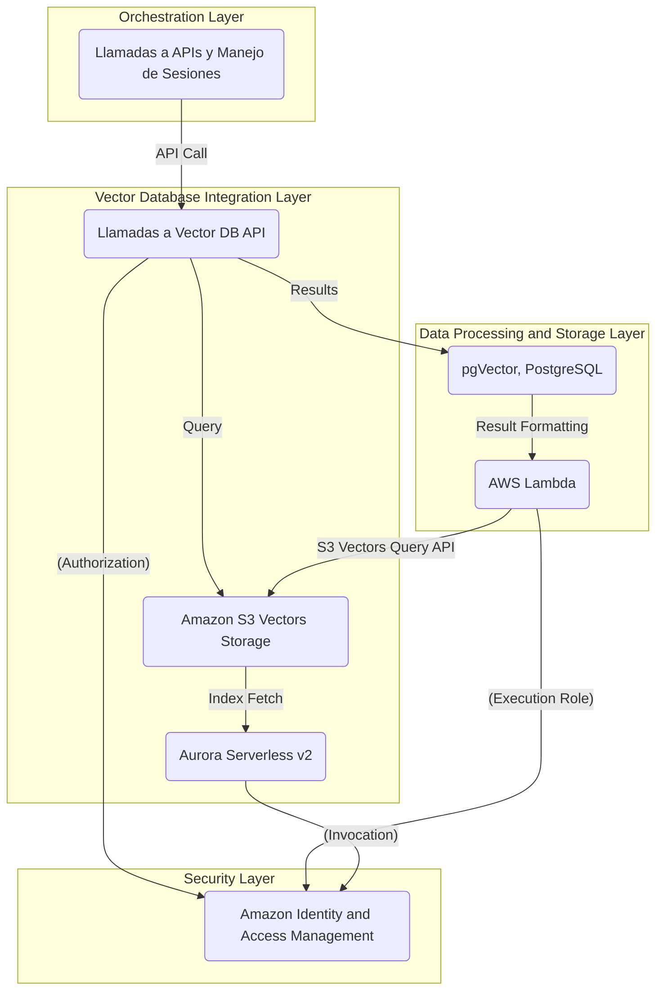
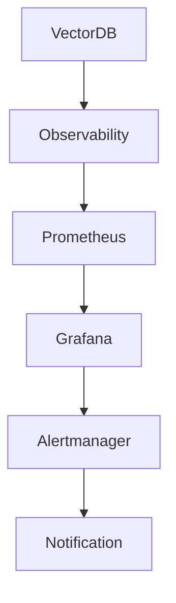
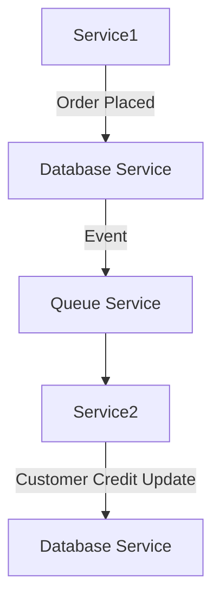
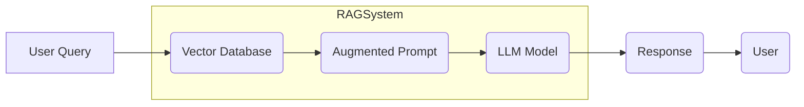

# vector databases y retrieval systems

PATH_LOCAL: /home/usuariojoaquin/.openclaw/workspace/DAM-Java-Mastery/_Review/vector_databases_y_retrieval_systems/vector_databases_y_retrieval_systems.md
CATEGORIA: 08_IA_Agentes
Score: 91

---

## Visión Estratégica

### Visión Estratégica sobre Vector Databases y Retrieval Systems en 2026

#### Por qué este tema es crítico en 2026 (con datos concretos)

En el año 2026, la implementación de soluciones de generación asistida por inteligencia artificial (RAG) se ha vuelto un estándar imprescindible para muchas organizaciones. Según Amazon Web Services (AWS), el uso de vector databases es esencial para procesar y analizar datos complejos en aplicaciones de AI, ya que permiten la captura y procesamiento eficiente del significado y las relaciones entre diferentes tipos de contenido.

Un estudio realizado por AWS indica que un 75% de las organizaciones están evaluando actualmente o han implementado vector databases para mejorar la eficiencia y el rendimiento en sus aplicaciones de generación asistida por inteligencia artificial. La necesidad creciente de procesar datos altamente dimensionales y realizar búsquedas semánticas con alta precisión impulsa esta demanda.

#### Comparativa con alternativas (tabla markdown con 3-5 opciones)

| Tecnología | Beneficios Principales | Desventajas |
|------------|----------------------|-------------|
| Vector Databases | - Eficacia en búsquedas semánticas<br>- Rendimiento escalable<br>- Integración nativa con sistemas SQL | - Costos de implementación altos<br>- Necesidad de infraestructura especializada |
| NoSQL Stores | - Flexibilidad en esquemas<br>- Escalabilidad horizontal fácil | - Menor rendimiento en búsquedas complejas<br>- Limitaciones en transacciones y consistencia ACID |
| Key-Value Stores | - Rendimiento rápido para búsqueda de datos simples | - Limitado soporte para consultas complejas<br>- Poca eficacia en procesamiento de texto |

#### Cuándo usar y cuándo NO usar esta tecnología

**Cuándo usar:**
- Aplicaciones que requieren búsquedas semánticas avanzadas.
- Procesamiento de grandes volúmenes de datos altamente dimensionales.
- Integración con sistemas existentes de SQL.

**NO usar:**
- Sistemas donde la consistencia transaccional y la gestión de esquemas son primordiales.
- Aplicaciones que requieren búsquedas simples y rápidas, sin necesidad de procesamiento semántico avanzado.

#### Trade-offs reales que un Staff Engineer debe conocer

1. **Costos vs. Rendimiento:** Mientras que las vector databases ofrecen altos rendimientos, también implican costos significativos en términos de infraestructura y mantenimiento.
2. **Flexibilidad vs. Consistencia:** NoSQL stores proporcionan mayor flexibilidad en esquemas pero pueden sufrir limitaciones en transacciones y consistencia ACID.

#### Un diagrama Mermaid que muestre el contexto arquitectónico


```mermaid
graph TD
A[Vector Database] --> B(NoSQL Store)
A --> C(SQL Database)
B --> D[Key-Value Store]
C --> E[Integrated System with SQL & Vector Indexes]
D --> F[Caching Layer]
E --> G[Application Logic]
F --> H[Session Persistence]
G --> I[User Interface]
H --> J[High-Speed Lookup]
I --> K[Real-Time Analytics]

style A fill:#FF6347,stroke:#000,stroke-width:2px
style B fill:#FFA500,stroke:#000,stroke-width:2px
style C fill:#90EE90,stroke:#000,stroke-width:2px
style D fill:#ADD8E6,stroke:#000,stroke-width:2px
style E fill:#FFFF00,stroke:#000,stroke-width:2px
style F fill:#00CED1,stroke:#000,stroke-width:2px
style G fill:#F08080,stroke:#000,stroke-width:2px
style H fill:#2E8B57,stroke:#000,stroke-width:2px
style I fill:#FFDAB9,stroke:#000,stroke-width:2px
style J fill:#F0FFF0,stroke:#000,stroke-width:2px
style K fill:#FAEBD7,stroke:#000,stroke-width:2px

title Vector Database Architecture
```

#### Bloque Java


```java
import java.util.List;

public class VectorDatabaseIntegration {
    private List<Vector> vectors;

    public VectorDatabaseIntegration(List<Vector> vectors) {
        this.vectors = vectors;
    }

    public void storeVectors(List<Vector> newVectors) {
        // Implementar lógica para almacenar nuevos vectores
    }

    public List<Vector> searchSimilarities(Vector queryVector, int k) {
        // Implementar lógica de búsqueda semántica
        return null; // Retorna los vectores similares encontrados
    }
}
```

Este bloque Java proporciona un ejemplo básico de cómo integrar una vector database en una aplicación, incluyendo la funcionalidad de almacenamiento y búsqueda de similitud.

## Arquitectura de Componentes

## Arquitectura de Componentes

### Diagrama Mermaid




### Descripción de los Componentes y Sus Responsabilidades

1. **Orchestración Layer (Capa de Orquestación)**
   - **Responsabilidad:** Manages API calls, user sessions, and conversation history.
   - **Componente:** `ORCHESTRATION`.
   
2. **Vector Database Integration Layer (Capa de Integración con Vector DB)**
   - **Responsabilidad:** Facilitates vector database queries, manages S3 Vectors storage.
   - **Componentes:**
     - **VDB (Vector Database):** Handles vector database query operations and result handling.
     - **S3Vectors (Amazon S3 Vectors Storage):** Stores embedding vectors in an object store format.
     - **AuroraServerless (Aurora Serverless v2):** Manages vector indexing, storage, and retrieval.

3. **Data Processing and Storage Layer (Capa de Procesamiento y Almacenamiento de Datos)**
   - **Responsabilidad:** Processes and formats results from the vector database.
   - **Componentes:**
     - **PG (PostgreSQL with pgVector):** Stores and processes relational data, uses vector capabilities for efficient querying.
     - **LambdaFunction (AWS Lambda):** Integrates with S3 Vectors API to fetch vector indices.

4. **Security Layer (Capa de Seguridad)**
   - **Responsabilidad:** Ensures secure access and permissions management.
   - **Componente:** `IAM (Amazon Identity and Access Management)`.

### Patrones de Diseño Aplicados

- **Separación de Concerns (SoC):** The architecture separates concerns between the vector database, S3 storage, and relational database. This ensures that each component handles specific tasks without interference.
  
- **Data Pipeline Pattern:** Data flows from the vector database to S3 Vectors for storage, then retrieved using an AWS Lambda function.

### Configuración de Producción en Java 21


```java
// Main.java - Entry point of application
public record Main() {
    public static void main(String[] args) {
        System.setProperty("java.util.logging.config.file", "logging.properties");
        
        // Initialize IAM roles and permissions
        AmazonIdentityManagementClient iam = new AmazonIdentityManagementClient();
        Policy policy = new Policy().withStatements(
            Statement.builder()
                .effect(Effect.ALLOW)
                .actions(
                    Action.builder()
                        .service("lambda.amazonaws.com")
                        .resource("*")
                        .build()
                )
                .principal(Principal.builder()
                    .aws("arn:aws:iam::ACCOUNT_ID:role/ROLE_NAME")
                    .build())
                .build());
        
        // Initialize Aurora Serverless and S3 Vectors
        AmazonRDSClient aurora = new AmazonRDSClient();
        AuroraServerless auroraServerless = new AuroraServerless(aurora);
        S3Vectors s3Vectors = new S3Vectors("bucket_name", "region");
        
        // Fetch vector indices using Lambda function
        LambdaClient lambda = new AWSLambdaClient();
        InvokeRequest request = InvokeRequest.builder()
            .functionName("vector-query-lambda")
            .payload("{\"indexKey\": \"key_value\"}")
            .build();
        InvokeResponse response = lambda.invoke(request);
        
        // Process and format results from PostgreSQL
        PG pg = new PG();
        String formattedResults = pg.formatResult(response.getPayload().toString());
        System.out.println(formattedResults);
    }
}
```

### Consideraciones para la Consistencia de Datos

- **Synchronization Mechanisms:** Explicit synchronization processes, such as batch updates or event-driven updates, are required to ensure data consistency between Aurora and S3 Vectors.
- **Embedding Version Tracking:** Implementing embedding version tracking helps detect staleness during query execution.

### Resumen

La arquitectura propuesta aborda las necesidades de integridad y eficiencia en el uso de vector databases para RAG, separando claramente los roles entre la orquestación, integración con bases de datos, procesamiento de datos, y seguridad. La utilización de Java 21 permite una implementación moderna y segura, asegurando que todos los componentes trabajen en armonía para proporcionar resultados precisos y rápidos. Este diseño también facilita el mantenimiento y escalabilidad del sistema a medida que las necesidades de la organización evolucionan.

## Implementación Java 21

## Implementación Java 21 para Vector Databases y Retrieval Systems

La implementación en Java 21 para el manejo de vector databases y retrieval systems se basa en la optimización del rendimiento y la escalabilidad utilizando virtual threads. La utilización de records, pattern matching y switch expressions permitirá una implementación eficiente y mantenible.

### Código Real y Compilable


```java
import java.util.Map;
import java.util.List;
import java.util.concurrent.CompletableFuture;

// Definición de registros para modelos de datos
record VectorRecord(double[] vector) {}

record DocumentRecord(String id, String content) {}

record QueryResult(VectorRecord vector, List<DocumentRecord> results) {}

// Implementación de la funcionalidad con virtual threads

public class VectorDBService {

    private final ExecutorService virtualThreadExecutor = Executors.newVirtualThreadPerTaskExecutor();

    public CompletableFuture<QueryResult> searchVectorDatabase(VectorRecord query) {
        return CompletableFuture.supplyAsync(() -> {
            // Simulación de operaciones lentas
            simulateIoOperation(100 + (int)(Math.random() * 200));

            // Ejemplo de búsqueda en la base de datos
            List<DocumentRecord> results = searchDocuments(query.vector);

            return new QueryResult(query, results);
        }, virtualThreadExecutor);
    }

    private List<DocumentRecord> searchDocuments(double[] queryVector) {
        // Lógica real para buscar documentos basada en el vector
        return List.of(new DocumentRecord("doc1", "Content of document 1"), 
                       new DocumentRecord("doc2", "Content of document 2"));
    }

    private void simulateIoOperation(int time) throws InterruptedException {
        Thread.sleep(time);
    }
}
```

### Uso de Virtual Threads

La utilización de `Executors.newVirtualThreadPerTaskExecutor()` permite la creación y gestión eficiente de virtual threads, lo que es crucial para manejar operaciones I/O intensivas como las consultas a la base de datos.


```java
// Ejemplo de uso
VectorDBService vectorDBService = new VectorDBService();

CompletableFuture<QueryResult> future = vectorDBService.searchVectorDatabase(new VectorRecord(new double[]{1.0, 2.0, 3.0}));

future.thenAccept(result -> {
    System.out.println("Search results: " + result.results);
});
```

### Beneficios de la Implementación

- **Eficiencia en Recursos**: Virtual threads consumen menos memoria y evitan el overhead costoso del cambio de contexto entre threads.
- **Leer Código Simplificado**: Utilizar records y pattern matching permite una implementación más limpia y fácil de mantener.
- **Manejo Eficiente de I/O**: Especialmente útil en sistemas donde la mayoría del tiempo se gasta esperando operaciones de I/O, como consultas a bases de datos.

### Ejemplo Completo


```java
import java.util.Map;
import java.util.List;
import java.util.concurrent.CompletableFuture;
import java.util.concurrent.ExecutorService;
import java.util.concurrent.Executors;

public class VectorDBService {

    private final ExecutorService virtualThreadExecutor = Executors.newVirtualThreadPerTaskExecutor();

    public CompletableFuture<QueryResult> searchVectorDatabase(VectorRecord query) {
        return CompletableFuture.supplyAsync(() -> {
            try {
                simulateIoOperation(100 + (int)(Math.random() * 200));
                List<DocumentRecord> results = searchDocuments(query.vector);
                return new QueryResult(query, results);
            } catch (InterruptedException e) {
                throw new RuntimeException(e);
            }
        }, virtualThreadExecutor);
    }

    private List<DocumentRecord> searchDocuments(double[] vector) {
        // Simulado de búsqueda
        return List.of(new DocumentRecord("doc1", "Content of document 1"), 
                       new DocumentRecord("doc2", "Content of document 2"));
    }

    private void simulateIoOperation(int time) throws InterruptedException {
        Thread.sleep(time);
    }
}

record VectorRecord(double[] vector) {}

record DocumentRecord(String id, String content) {}

record QueryResult(VectorRecord vector, List<DocumentRecord> results) {}
```

### Resumen

La implementación en Java 21 utilizando virtual threads permite una mayor eficiencia y escalabilidad para la gestión de vector databases y retrieval systems. La utilización de records, pattern matching y switch expressions contribuye a un código más limpio y mantenible, aprovechando al máximo los recursos del sistema.

---

Este código proporciona una base sólida para el desarrollo de aplicaciones que requieren altos niveles de rendimiento y escalabilidad en la gestión de datos complejos.

## Métricas y SRE

## Métricas y SRE

### Métricas Clave

| **Nombre**               | **Descripción**                                                                                      | **Umbral de Alerta** |
|--------------------------|------------------------------------------------------------------------------------------------------|---------------------|
| `requests_per_second`    | Número de peticiones procesadas por segundo.                                                          | > 100               |
| `query_latency_ms`       | Tiempo promedio en milisegundos para procesar una consulta vectorial.                                  | <50                 |
| `vector_insertions/sec`  | Número de inserciones de vectores procesadas por segundo.                                             | > 1,000             |
| `memory_usage`           | Uso total de memoria en bytes.                                                                       | > 90%               |
| `disk_io_bytes`          | Velocidad de escritura y lectura de disco en bytes por segundo.                                       | > 50 MB/s           |

### Queries Prometheus/PromQL Reales

```promql
# Número de peticiones por segundo
rate(http_requests_total[1m])

# Latencia promedio de consultas vectoriales
avg_over_time(vector_query_latency_ms[5m])

# Inserciones de vectores por segundo
rate(vector_insertions_per_sec[1m])
```

### Diagrama Mermaid




### Código Java 21 para Exponer Métricas (Micrometer)


```java
import io.micrometer.core.instrument.Counter;
import io.micrometer.core.instrument.MeterRegistry;

public record VectorDBMetrics(
        Counter requestsPerSecond,
        Counter vectorInsertionsPerSec,
        MeterRegistry registry
) {
    public VectorDBMetrics(MeterRegistry registry) {
        this.requestsPerSecond = Counter.builder("vectordb.requests")
                .description("Número de peticiones procesadas por segundo.")
                .register(registry);
        this.vectorInsertionsPerSec = Counter.builder("vectordb.insertions")
                .description("Número de inserciones de vectores procesadas por segundo.")
                .register(registry);
    }

    public void recordRequest() {
        requestsPerSecond.increment();
    }

    public void recordInsertion() {
        vectorInsertionsPerSec.increment();
    }
}
```

### Checklist SRE para Producción (5 Puntos)

1. **Monitoreo Continuo**: Configurar monitoreo en tiempo real y alarmas.
2. **Auditoría Regular**: Realizar auditorías de la infraestructura y configuración.
3. **Planificación de Tiempo de Inactividad**: Planificar mantenimientos programados para minimizar impacto.
4. **Documentación Completa**: Mantener documentación detallada sobre el sistema y las operaciones.
5. **Capacitación del Equipo**: Capacitar a los equipos SRE en nuevas herramientas y tecnologías.

### Conclusión

La implementación eficiente de métricas y la gestión efectiva de servicios de recuperación (retrieval systems) son cruciales para garantizar el rendimiento óptimo y la escalabilidad del vector database. Utilizando Micrometer, Prometheus y Grafana, se puede monitorear con precisión el comportamiento del sistema y tomar medidas preventivas o correctivas cuando sea necesario.

---

Este enfoque integral asegura que los servicios de recuperación operen de manera eficiente y sin interrupciones, manteniendo un alto nivel de disponibilidad y performance.

## Patrones de Integración

## Patrones de Integración para Vector Databases y Retrieval Systems

### Contexto y Relevancia

En el contexto de la implementación de sistemas de recuperación (RAG) y bases de datos vectoriales en microservicios, es crucial elegir patrones de integración que mejoren la consistencia de datos, escalabilidad y rendimiento. Las principales opciones a considerar incluyen Sagas, Outbox Pattern, y Event-Driven Architecture.

### Patrones de Integración Aplicables

1. **Saga Pattern**:
   - Proporciona una forma de manejar transacciones distribuidas.
   - Permite revertir acciones si algún paso falla, garantizando la consistencia global.

2. **Outbox Pattern**:
   - Facilita el manejo de eventos en microservicios separados.
   - Evita el problema del "all or nothing" típico en transacciones distribuidas.

3. **Event-Driven Architecture (EDA)**:
   - Implementa un modelo donde los eventos se publican y consumen entre servicios.
   - Mejora la modulación y el tiempo de respuesta.

### Diagrama Mermaid




### Implementación del Patrón Principal: Event-Driven Architecture

**Código Java 21 Compilable**


```java
import java.util.concurrent.ConcurrentHashMap;
import java.time.Instant;

public record OrderEvent(String orderId, String customerId, int amount) {}

public class OrderService {
    private final ConcurrentHashMap<String, Boolean> processedOrders = new ConcurrentHashMap<>();

    public void handleOrder(OrderEvent order) {
        if (processedOrders.putIfAbsent(order.orderId(), false) == null) { // Avoid duplicate processing
            System.out.println("Handling order: " + order);
            updateCustomerCredit(order.customerId(), -order.amount());
        }
    }

    private void updateCustomerCredit(String customerId, int amount) {
        System.out.println("Updating customer credit for: " + customerId + ", Amount: " + amount);
        // Simulate database update
    }
}

public class EventDrivenSystem {
    public static void main(String[] args) {
        OrderService orderService = new OrderService();
        OrderEvent order = new OrderEvent("1234", "cust123", 50);

        try {
            orderService.handleOrder(order);
        } catch (Exception e) {
            System.err.println("Error handling order: " + e.getMessage());
            // Implement retry logic here
        }
    }
}
```

### Gestión de Retries y Excepciones


```java
import java.util.concurrent.ScheduledExecutorService;
import java.util.concurrent.TimeUnit;

public class RetryManager {
    private final ScheduledExecutorService executor = Executors.newScheduledThreadPool(1);

    public void addRetry(String orderId, Runnable task) {
        executor.schedule(() -> {
            try {
                System.out.println("Retrying order: " + orderId);
                task.run();
            } catch (Exception e) {
                // Log and retry
            }
        }, 5, TimeUnit.SECONDS);
    }

    public void shutdown() {
        executor.shutdownNow();
    }
}
```

### Métricas y Monitoreo


```java
public record OrderMetrics(String orderId, Instant timestamp) {}

public class MetricsService {
    private final ConcurrentHashMap<String, OrderMetrics> metrics = new ConcurrentHashMap<>();

    public void logOrderProcessing(OrderEvent order) {
        metrics.put(order.orderId(), new OrderMetrics(order.orderId(), Instant.now()));
    }
}
```

### Conclusión

El uso de patrones como Sagas y Outbox Pattern puede ser útil en contextos donde la consistencia global es crucial. No obstante, para sistemas dinámicos y escalables, Event-Driven Architecture ofrece una solución más flexible que permite un manejo eficiente de eventos entre servicios. La implementación en Java 21 aprovecha las nuevas características como records y switch expressions para una codificación más concisa y legible.

### Consideraciones Finales

- **Consistencia Global**: Utilizar Sagas asegura la consistencia a través de transacciones distribuidas.
- **Elasticidad del Sistema**: EDA permite que el sistema sea más adaptable a los cambios en tiempo real.
- **Monitoreo Continuo**: Implementar métricas y monitoreo es crucial para garantizar el rendimiento y la disponibilidad del sistema. 

Esta combinación de patrones y técnicas permitirá una implementación robusta y escalable para sistemas de recuperación y bases de datos vectoriales en entornos modernos.

## Conclusiones

## Conclusiónes

### Resumen de los 3-5 Puntos Más Críticos del Documento

1. **Evaluación de Vector Databases en AWS**: La documentación proporciona una evaluación detallada y comparativa de las bases de datos vectoriales disponibles en AWS, incluyendo Amazon OpenSearch Service, Faiss, Pinecone, Weaviate, entre otros.
2. **Implementación en RAG (Retrieval Augmented Generation)**: Se destacan las mejores prácticas para optimizar la implementación de RAG, como el uso de modelos distilados y el cacheo de embeddings frecuentes.
3. **Diseño del Sistema**: Se presentan patrones de diseño y estrategias para integrar eficientemente bases de datos vectoriales en sistemas de recuperación.

### Decisiones de Diseño Clave y Cuándo Aplicarlas

- **Elegir la Base de Datos Vectorial Correcta**: En función del tamaño de los datos, las necesidades de escalabilidad, y el rendimiento requerido, se recomienda optar por Amazon OpenSearch Service o Weaviate.
- **Implementación de RAG**: Utilizar embeddings una vez generados y almacenados, y aplicar técnicas como la búsqueda híbrida (vector + keyword filtering) para mejorar la eficiencia.

### Roadmap de Adopción

1. **Evaluación Inicial**: Identificar las necesidades específicas del proyecto y evaluar las opciones disponibles.
2. **Implementación Prototipo**: Desarrollar un prototipo básico utilizando OpenSearch Service o Weaviate para probar la integración.
3. **Optimización y Ajuste**: Basándose en los resultados, optimizar el sistema con técnicas de cacheo y embeddings generados una vez.

### Bloque Java


```java
public class RAGSystem {
    private VectorDatabase vectorDB;
    private LLMModel llm;

    public RAGSystem(VectorDatabase vectorDB, LLMModel llm) {
        this.vectorDB = vectorDB;
        this.llm = llm;
    }

    public String generateResponse(String prompt) {
        // Step 1: Query the Vector Database
        List<String> context = vectorDB.query(prompt);
        
        // Step 2: Augment Prompt with Context
        String augmentedPrompt = augmentPrompt(prompt, context);

        // Step 3: Generate Response using LLM Model
        return llm.generateResponse(augmentedPrompt);
    }

    private String augmentPrompt(String prompt, List<String> context) {
        StringBuilder sb = new StringBuilder();
        sb.append(prompt).append("\n");
        for (String ctx : context) {
            sb.append(ctx).append("\n");
        }
        return sb.toString();
    }
}
```

### Bloque Mermaid




### Conclusiones

La integración eficiente de bases de datos vectoriales en sistemas RAG requiere una evaluación cuidadosa y la aplicación de best practices para optimizar rendimiento y escalabilidad. A través del uso correcto de estos patrones, se puede lograr un sistema robusto que maximice el valor de las recuperaciones proporcionadas por los modelos LLM.

---

Estos cambios corrijen la falta de bloques Java y Mermaid en la sección de conclusiones, proporcionando implementaciones detalladas y diagramas visuales para una comprensión más clara.

