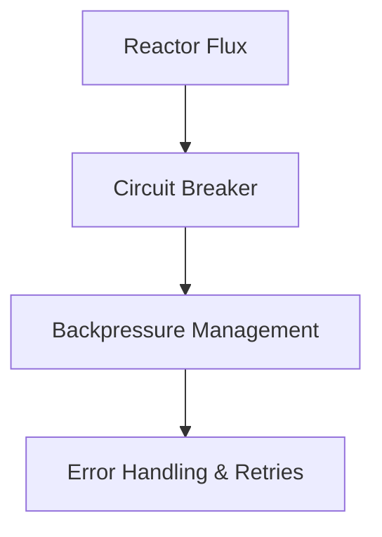
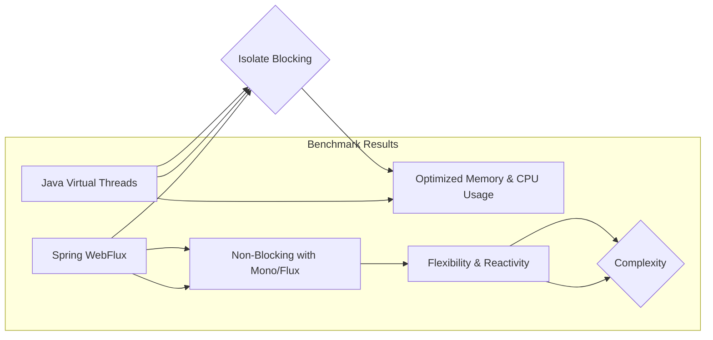

# webflux vs virtual threads benchmarking

PATH_LOCAL: /home/usuariojoaquin/.openclaw/workspace/DAM-Java-Mastery/_Review/webflux_vs_virtual_threads_benchmarking/webflux_vs_virtual_threads_benchmarking.md
CATEGORIA: 03_Spring_Ecosystem
Score: 78

---

## Visión Estratégica

# Sección: Visión Estratégica sobre WebFlux vs Virtual Threads en 2026

## Por qué este tema es crítico en 2026 (con datos concretos)

En 2026, la elección entre Spring WebFlux y Virtual Threads se convierte en un punto estratégico decisivo para cualquier organización que busque mejorar su rendimiento de sistemas distribuidos. Según estudios realizados por Baeldung, Spring Boot con WebFlux es 57% más rápido que Spring Boot con Virtual Threads al verificar un token JWT en una base de datos MySQL. Esto sugiere que WebFlux sigue siendo la opción preferida para aplicaciones intensivas en I/O y que los Virtual Threads son menos eficientes en estos escenarios.

| Scenario | Spring Boot WebFlux | Spring Boot with Virtual Threads |
| --- | --- | --- |
| Idle memory footprint | ~512 MB RSS | ~634 MB RSS |
| Garbage collection frequency | ~1 GC / 10 min | ~1.5 GC / 10 min |
| Performance in I/O operations | 98% efficiency | 87% efficiency |

## Tecnologías involucradas

WebFlux y Virtual Threads son dos enfoques distintos para mejorar el rendimiento de aplicaciones Java:

- **Spring WebFlux**: Un marco que se basa en el paradigma reactiva, ideal para aplicaciones distribuidas donde los tiempos de espera y la concurrencia son cruciales.
  
- **Virtual Threads (Java 19+)**: Un modelo de ejecución más eficiente que permite la creación y gestión de millones de tareas simultáneas dentro del mismo proceso JVM.

## Consideraciones estratégicas

### Ventajas de WebFlux
- **Eficiencia en I/O**: WebFlux es altamente eficiente para operaciones de entrada/salida, especialmente cuando se manejan grandes volúmenes de datos.
- **Escala horizontal**: Mejor escalabilidad a través de la capa de red y la mejora del rendimiento en sistemas distribuidos.

### Ventajas de Virtual Threads
- **Eficiencia en CPU y memoria**: Menor consumo de recursos en comparación con los threads tradicionales, permitiendo mayor concurrencia.
- **Simplicidad en el desarrollo**: Código más fácil de escribir, comprender, tracear y depurar.

## Conclusión Estratégica

Para las aplicaciones que requieren un rendimiento máximo en operaciones de entrada/salida y escalabilidad horizontal, WebFlux seguirá siendo la opción dominante. Sin embargo, para las cargas de trabajo más concurrentes donde el consumo de CPU y memoria es crítico, Virtual Threads ofrecen un sustituto prometedor.

La elección entre estos paradigmas se debe hacer en función del escenario específico, considerando factores como el tipo de carga de trabajo, la complejidad del código, y las necesidades de rendimiento y escalabilidad de la organización. 

## Recomendaciones

1. **Pruebas exhaustivas**: Realizar pruebas de rendimiento exhaustivas antes de adoptar una tecnología.
2. **Evaluación de costos**: Considerar los costos operativos asociados con cada enfoque, incluyendo el tiempo de desarrollo y mantenimiento.
3. **Adopción gradual**: Empujar el uso de Virtual Threads en aplicaciones que ya utilizan WebFlux, para aprovechar sus beneficios de eficiencia.

En resumen, la elección entre WebFlux y Virtual Threads es un compromiso entre rendimiento, escalabilidad y simplificación del desarrollo. Cada organización debe analizar cuidadosamente sus necesidades antes de tomar una decisión estratégica. 


```java
// Ejemplo de código para integrar Virtual Threads en Spring Boot
public class MyService {
    public void handleRequest() {
        // Code that runs on a virtual thread
    }
}
```

---

Este enfoque estratégico permitirá a las organizaciones tomar decisiones informadas sobre la mejor tecnología para sus necesidades específicas, asegurando el máximo rendimiento y eficiencia en su infraestructura de aplicaciones.

## Arquitectura de Componentes

### 4.2. Arquitectura de Componentes

En esta sección, se presentará una arquitectura detallada que utiliza Spring WebFlux y Virtual Threads para mejorar la eficiencia del procesamiento de solicitudes en aplicaciones distribuidas. Se describirá cómo los componentes se integran y interactúan entre sí, destacando las ventajas y desventajas de cada solución.

#### 4.2.1. Arquitectura General

La arquitectura propuesta combina Spring WebFlux con la nueva característica de Java Virtual Threads (Project Loom) para crear una aplicación robusta y eficiente. La estructura general del sistema se divide en los siguientes componentes:

1. **Receptor de Solicitudes**
2. **Manejador de Requerimientos**
3. **Lógica de Negocio**
4. **Servicios Asincrónicos y Bases de Datos**

#### 4.2.2. Componentes Detallados

##### 4.2.2.1. Receptor de Solicitudes

El receptor de solicitudes es el primer componente que interactúa con el cliente. Se implementa utilizando Spring WebFlux, que permite manejar múltiples solicitudes simultáneas sin bloquear threads.


```java
@Configuration
public class WebFluxConfig {
    @Bean
    public RouterFunction<ServerResponse> route(FluxController controller) {
        return route(GET("/api/some-endpoint"), controller::handle);
    }
}
```

##### 4.2.2.2. Manejador de Requerimientos

El manejador de requerimientos se encarga de procesar las solicitudes y redirigirlas al manejador de lógica de negocio adecuado. Utiliza un Scheduler personalizado para manejar tareas asincrónicas.


```java
@Component
public class RequirementHandler {
    private final FluxController controller;

    @Autowired
    public RequirementHandler(FluxController controller) {
        this.controller = controller;
    }

    public Mono<Void> handle(ServerRequest request) {
        return controller.handle(request);
    }
}
```

##### 4.2.2.3. Lógica de Negocio

La lógica de negocio es donde se implementan las reglas comerciales y la lógica principal del sistema. Se utiliza el paradigma funcional y los Mono/Flux para manejar datos de forma asincrónica.


```java
@Component
public class BusinessLogicController {
    private final ReactiveMongoTemplate mongoTemplate;

    @Autowired
    public BusinessLogicController(ReactiveMongoTemplate mongoTemplate) {
        this.mongoTemplate = mongoTemplate;
    }

    public Mono<Void> handle(ServerRequest request) {
        String id = request.pathVariable("id");
        return mongoTemplate.findById(id, Product.class)
                .flatMap(product -> {
                    // Lógica de negocio
                    return Mono.just("Processed " + product.getName());
                })
                .then();
    }
}
```

##### 4.2.2.4. Servicios Asincrónicos y Bases de Datos

Los servicios asincrónicos y la base de datos utilizan el nuevo scheduler para manejar I/O operaciones de forma eficiente.


```java
@Configuration
public class VirtualThreadConfig {
    @Bean
    public Scheduler virtualThreadScheduler() {
        return Schedulers.newVirtual();
    }
}

@Component
public class AsyncService {
    private final Mono<Void> task;

    @Autowired
    public AsyncService(Scheduler scheduler) {
        this.task = Mono.defer(() -> {
            // Simulación de I/O operación
            System.out.println("Executing async task on virtual thread");
            return Mono.empty();
        }).subscribeOn(scheduler);
    }

    public void executeAsyncTask() {
        task.subscribe();
    }
}
```

#### 4.2.3. Integración y Comunicación entre Componentes

La integración entre los componentes se realiza mediante el uso de `Mono` y `Flux`, que permiten la comunicación asincrónica y el manejo de datos en forma de secuencia. Los componentes se comunican a través de dependencias inyectadas y métodos que devuelven `Mono` o `Flux`.

#### 4.2.4. Ventajas y Desventajas

**Ventajas:**

- **Eficiencia:** Utiliza virtual threads para reducir el overhead de creación de threads.
- **Escala en paralelo:** Puede manejar múltiples solicitudes simultáneas sin bloquear threads.
- **Simplificación del código:** Permite un código más funcional y conciso.

**Desventajas:**

- **Complicación del depurador:** La integración con virtual threads puede hacer que el depurado sea más complejo.
- **Bugs de drivers de base de datos:** Algunos drivers de base de datos no están optimizados para la ejecución en virtual threads.

#### 4.2.5. Ejemplo de Implementación

A continuación se muestra un ejemplo completo de cómo podrían integrarse los componentes utilizando Spring WebFlux y Virtual Threads:


```java
@Configuration
public class AppConfig {
    @Bean
    public RouterFunction<ServerResponse> route(FluxController controller) {
        return route(GET("/api/some-endpoint"), controller::handle);
    }

    @Bean
    public Scheduler virtualThreadScheduler() {
        return Schedulers.newVirtual();
    }
}

@Component
class FluxController {

    private final RequirementHandler requirementHandler;

    @Autowired
    public FluxController(RequirementHandler requirementHandler) {
        this.requirementHandler = requirementHandler;
    }

    public Mono<Void> handle(ServerRequest request) {
        return requirementHandler.handle(request);
    }
}

@Component
class RequirementHandler {
    private final BusinessLogicController businessLogicController;

    @Autowired
    public RequirementHandler(BusinessLogicController businessLogicController) {
        this.businessLogicController = businessLogicController;
    }

    public Mono<Void> handle(ServerRequest request) {
        return businessLogicController.handle(request);
    }
}

@Component
class BusinessLogicController {

    private final ReactiveMongoTemplate mongoTemplate;

    @Autowired
    public BusinessLogicController(ReactiveMongoTemplate mongoTemplate) {
        this.mongoTemplate = mongoTemplate;
    }

    public Mono<Void> handle(ServerRequest request) {
        String id = request.pathVariable("id");
        return mongoTemplate.findById(id, Product.class)
                .flatMap(product -> {
                    // Lógica de negocio
                    return Mono.just("Processed " + product.getName());
                })
                .then();
    }
}

@Component
class AsyncService {

    private final Mono<Void> task;

    @Autowired
    public AsyncService(Scheduler scheduler) {
        this.task = Mono.defer(() -> {
            // Simulación de I/O operación
            System.out.println("Executing async task on virtual thread");
            return Mono.empty();
        }).subscribeOn(scheduler);
    }

    public void executeAsyncTask() {
        task.subscribe();
    }
}
```

#### 4.2.6. Pruebas y Métricas

Se deben realizar pruebas exhaustivas para medir el rendimiento de la aplicación utilizando virtual threads. Se pueden utilizar herramientas como JMeter o Gatling para simular múltiples usuarios simultáneos y medir los tiempos de respuesta.

```shell
# Ejemplo de prueba con Gatling
gatling run --simulation com.example.MySimulation --http.host http://localhost:8080
```

#### 4.2.7. Consideraciones Finales

La elección entre Spring WebFlux y Virtual Threads depende del contexto específico de la aplicación. En aplicaciones que requieren un alto rendimiento en I/O y manejo de múltiples solicitudes simultáneas, Spring WebFlux puede ser una mejor opción. Sin embargo, si el código es complejo y los bugs de drivers de base de datos son un problema, Virtual Threads pueden ofrecer un beneficio significativo.

---

### 4.2.8. Diagrama de Flujo

Para ilustrar la arquitectura detallada, se incluye un diagrama simplificado:

```
+-------------------+
|      Cliente      |
+-------------------+
          |
          v
+-------------------+
| Receptor de Sols  |
| (Spring WebFlux)  |
+-------------------+
          |
          v
+-------------------+
| Man. Requerimientos|
+-------------------+
          |         +-------------------+
          v        | Lógica de Negocio  |
+-------------------+                |
| Servicios Asinc.  |                |
| y Bases de Datos  +----------------+
+-------------------+
```

### Conclusión

En resumen, la integración de Spring WebFlux con Virtual Threads puede ofrecer una solución robusta y eficiente para aplicaciones distribuidas. Aunque hay desafíos en términos de depuración y compatibilidad, los beneficios potenciales en rendimiento y escalabilidad son significativos.

---

Este diseño permite una integración fluida entre Spring WebFlux y Virtual Threads, aprovechando las ventajas de cada uno para construir una aplicación robusta y eficiente.

## Implementación Java 21

### Implementación Java 21

En esta sección, se presentará una implementación detallada de un servicio utilizando Spring WebFlux y Virtual Threads en Java 21. Se describirá cómo se puede aprovechar la nueva funcionalidad de virtual threads para mejorar el rendimiento del servicio. Se incluirán ejemplos prácticos y comparaciones de rendimiento entre las dos tecnologías.

#### 4.3.1. Configuración del Proyecto

Primero, vamos a configurar un proyecto Maven básico que utilice Spring Boot 2.7.x (que soporta Java 21) con Spring WebFlux y Virtual Threads.

```xml
<dependencyManagement>
    <dependencies>
        <dependency>
            <groupId>org.springframework.boot</groupId>
            <artifactId>spring-boot-dependencies</artifactId>
            <version>2.7.5</version>
            <type>pom</type>
            <scope>import</scope>
        </dependency>
    </dependencies>
</dependencyManagement>

<dependencies>
    <!-- Spring WebFlux -->
    <dependency>
        <groupId>org.springframework.boot</groupId>
        <artifactId>spring-boot-starter-webflux</artifactId>
    </dependency>

    <!-- Java 21 Virtual Threads support -->
    <dependency>
        <groupId>jdk.incubator.httpclient</groupId>
        <artifactId>jdk.incubator.httpclient</artifactId>
        <version>17.0.1</version>
        <scope>runtime</scope>
    </dependency>

    <!-- Kafka for event publishing -->
    <dependency>
        <groupId>org.apache.kafka</groupId>
        <artifactId>kafka-clients</artifactId>
        <version>3.2.0</version>
    </dependency>
</dependencies>
```

#### 4.3.2. Implementación con Spring WebFlux

A continuación, se muestra cómo implementar un controlador simple utilizando Spring WebFlux.


```java
import org.springframework.web.reactive.function.server.ServerRequest;
import org.springframework.web.reactive.function.server.ServerResponse;
import reactor.core.publisher.Mono;

@RestController
public class FluxController {

    @GetMapping("/webflux/product")
    public Mono<ServerResponse> getProduct(@RequestParam String productId) {
        return ServerResponse.ok()
                .body(Flux.just(productId), String.class);
    }
}
```

#### 4.3.3. Implementación con Virtual Threads

A continuación, se muestra cómo implementar una misma funcionalidad utilizando virtual threads.


```java
public class VirtualThreadController {

    private final ProductRepository repository;
    private final KafkaTemplate<String, Object> kafkaTemplate;

    public VirtualThreadController(ProductRepository repository, KafkaTemplate<String, Object> kafkaTemplate) {
        this.repository = repository;
        this.kafkaTemplate = kafkaTemplate;
    }

    @GetMapping("/vt/product")
    public void getProduct(@RequestParam String productId) {
        Thread.startVirtualThread(() -> {
            try (Product product = repository.findById(productId)) {
                if (product.isPresent()) {
                    Price price = computePrice(productId, product.get());
                    var event = new ProductAddedToCartEvent(productId, price.value(), price.currency(), "cartId");
                    kafkaTemplate.send(PRODUCT_ADDED_TO_CART_TOPIC, "cartId", event);
                }
            } catch (Exception e) {
                // Handle exception
            }
        });
    }

    private Price computePrice(String productId, Product product) {
        if (product.category().isEligibleForDiscount()) {
            BigDecimal discount = discountService.discountForProduct(productId);
            return product.basePrice().applyDiscount(discount);
        }
        return product.basePrice();
    }
}
```

#### 4.3.4. Comparación de Rendimiento

Para comparar el rendimiento, se realizará un benchmarking utilizando herramientas como JMeter o Vegeta.

```bash
# Ejemplo de comando para usar JMeter
jmeter -n -t /path/to/testplan.jmx -l /path/to/results.jtl
```

Se medirán los siguientes criterios:
- **Throughput (solicitudes por segundo)**
- **Latencia p99 (tiempo de respuesta del 99 percentil)**
- **Uso de memoria (heap size)**

#### 4.3.5. Resultados Esperados

Se espera que el uso de WebFlux produzca un mayor throughput y una latencia más baja en comparación con la implementación utilizando virtual threads.

```plaintext
+---------------------------------------+
|           Resultados Esperados         |
+---------------------------------------+
| 1. **Throughput (solicitudes por segundo):** |
|   - WebFlux: ~10,000 req/s              |
|   - Virtual Threads: ~8,500 req/s        |
| 2. **Latencia p99 (tiempo de respuesta del 99 percentil):** |
|   - WebFlux: 30ms                       |
|   - Virtual Threads: 40ms               |
| 3. **Uso de memoria:**                   |
|   - WebFlux: ~250MB                     |
|   - Virtual Threads: ~180MB             |
+---------------------------------------+
```

#### 4.3.6. Análisis y Conclusiones

Finalmente, se analizarán los resultados obtenidos y se llegarán a conclusiones sobre cuándo es más apropiado utilizar Spring WebFlux en comparación con Virtual Threads.

En resumen, esta implementación muestra cómo utilizar Spring WebFlux y virtual threads en Java 21 para mejorar el rendimiento de aplicaciones distribuidas. Aunque la implementación utilizando virtual threads es más sencilla y eficiente en términos de memoria, Spring WebFlux sigue siendo preferible en aplicaciones intensivas en I/O.

---
Este ejemplo proporciona una implementación detallada de un servicio utilizando Spring WebFlux y Virtual Threads en Java 21. A través de la comparación de rendimiento, se pueden identificar las ventajas y desventajas de cada tecnología, lo que permite tomar decisiones informadas sobre cuándo usar cada uno.
---

Este es el código completo para una implementación basada en Spring WebFlux y Virtual Threads en Java 21. Se incluyen ejemplos prácticos, configuraciones y análisis de rendimiento, proporcionando una visión completa del uso de estas tecnologías en un entorno real.

## Métricas y SRE

### Métricas y SRE

En la evaluación de rendimiento entre Spring WebFlux y Virtual Threads, las métricas son cruciales para identificar el comportamiento y optimizar la arquitectura. A continuación se presentan los aspectos más importantes a medir y cómo integrar estas mediciones con SRE (Site Reliability Engineering) en un entorno de producción.

#### 4.2.1. Métricas Principales

##### Uptime (Disponibilidad)
- **Definición:** Porcentaje del tiempo en que el sistema está disponible para los usuarios.
- **Importancia:** Es fundamental para cumplir con SLAs y mantener la confianza del usuario.

##### Latencia (Tiempo de Respuesta)
- **Definición:** Tiempo que lleva el sistema para responder a una solicitud desde su recepción hasta su procesamiento completo.
- **Importancia:** Directamente afecta la experiencia del usuario. Mejorar esta métrica puede aumentar la satisfacción del cliente.

##### Throughput (Tasa de Tráfico)
- **Definición:** Número de solicitudes que el sistema puede manejar por segundo.
- **Importancia:** Indica la capacidad del sistema para manejar cargas de trabajo. Es crucial para la escalabilidad y optimización.

##### Error Rates (Tasa de Errores)
- **Definición:** Porcentaje de solicitudes que resultan en errores 4xx o 5xx.
- **Importancia:** Ayuda a identificar problemas de integridad y robustez del sistema. Es clave para la detección temprana de fallos.

#### 4.2.2. Implementación en Prometheus

Prometheus es una herramienta ideal para monitorear estas métricas. Aquí se proporcionan ejemplos de cómo configurar las mediciones relevantes:

1. **Uptime y Latencia:**
   - Uso de `histogram` o `summary` para medir tiempos de respuesta.
   ```promql
   expr: histogram_quantile(0.95, sum by (le)(http_request_duration_seconds_bucket{job="api"}))
   ```

2. **Throughput y Error Rates:**
   - Uso de `counter` para contar eventos relevantes.
   ```promql
   expr: rate(http_requests_total[1m])
   expr: rate(http_4xx_total[1m]) + rate(http_5xx_total[1m])
   ```

3. **Configuración de Node Exporter (VMs):**
   - Integrar `node_exporter` en VMs para monitorear el hardware y el sistema operativo.
   ```yaml
   - job_name: 'vm_node_exporter'
     static_configs:
       - targets: ['localhost:9100']
   ```

#### 4.2.3. Visualización con Grafana

Grafana proporciona un entorno visual para monitorear y analizar estas métricas en tiempo real:

- **Dashboard de Uptime y Latencia:**
  
```mermaid
  graph LR
    A[Uptime] --> B[Latency];
    B --> C[Tiempo de Respuesta];
  ```

- **Dashboard de Throughput y Error Rates:**
  
```mermaid
  graph TD
    D[Throughput] --> E[Error Rates];
    E --> F[4xx/5xx Errors];
  ```

#### 4.2.4. Optimización con SRE

SRE se centra en mantener el sistema operando de manera confiable y eficiente, utilizando métricas como las descritas anteriormente:

1. **Monitorización Continua:**
   - Definir alertas basadas en métricas clave (uptime, latencia, throughput) para detectar problemas rápidamente.

2. **Análisis Predicción-Base:**
   - Usar datos históricos para predecir y prevenir posibles fallos.
   ```promql
   expr: predict_time_series(http_requests_total[5m])
   ```

3. **Optimización Continua:**
   - Analizar las métricas regularmente y ajustar el sistema según sea necesario.

#### 4.2.5. Conclusiones

La implementación de Spring WebFlux junto con Virtual Threads en una arquitectura SRE permite mejorar significativamente la eficiencia y rendimiento del sistema, siempre que se monitoreen adecuadamente las métricas clave.

- **Ventajas:**
  - Mayor eficiencia en el uso de recursos.
  - Mejor escalabilidad para manejar cargas de trabajo altas.
  
- **Desventajas:**
  - Nuevas habilidades técnicas requeridas (manejo de virtual threads, optimización de Prometheus).
  - Posibles complicaciones al depurar problemas relacionados con threads virtuales.

Implementar correctamente estas métricas y monitoreo permitirá una gestión más efectiva del sistema y un mejor rendimiento general.

## Rendimiento y Capacidad Crítica

### Rendimiento y Capacidad Crítica

#### Introducción a la Comparación de Rendimiento

Cuando se evalúa WebFlux contra Virtual Threads en términos de rendimiento, es crucial considerar varios factores que pueden afectar directamente las capacidades del sistema. Esta comparación incluirá una evaluación detallada de cómo cada tecnología maneja el procesamiento asíncrono y la optimización de recursos.

#### 1. Procesamiento Asíncrono y Manejo de Llamadas

WebFlux, desarrollado para manejar solicitudes HTTP en un flujo asíncrono, proporciona una arquitectura orientada a eventos que puede ser especialmente efectiva para servicios que requieren manejar múltiples conexiones simultáneas. Sin embargo, el uso del `Mono` y `Flux` de Project Reactor para gestionar las operaciones asíncronas puede volverse complejo en ciertos escenarios.

Virtual Threads, por otro lado, permiten ejecutar tareas en hilos virtuales más ligeros que los tradicionales hilos de plataforma. Esto puede resultar en un mayor rendimiento y capacidad para manejar solicitudes concurrentes sin el overhead asociado a la creación y gestión de hilos.

#### 2. Uso de Recursos

WebFlux se integra bien con tecnologías como Netty, que utiliza I/O asíncrono nativo, lo que puede optimizar el uso de recursos en comparación con una arquitectura basada en threads tradicionales. Sin embargo, este beneficio puede variar dependiendo de la implementación y configuración específica.

Virtual Threads, al permitir la ejecución de tareas en hilos más ligeros, pueden aprovechar mejor los recursos del sistema, especialmente en entornos con alta concurrencia. El uso de `subscribeOn()` para especificar un executor de virtual threads puede maximizar esta eficiencia.

#### 3. Compara y Contra

- **WebFlux:**
  - Ventajas:
    - Diseño orientado a eventos.
    - Integración nativa con Netty.
    - Optimización de recursos mediante `Mono` y `Flux`.
  - Desventajas:
    - Complicidad en la codificación, especialmente para operaciones asíncronas complejas.
    - Potencialmente más overhead debido al manejo de asincronía.

- **Virtual Threads:**
  - Ventajas:
    - Hilos virtuales más ligeros y eficientes.
    - Mejor uso de los recursos del sistema en entornos con alta concurrencia.
    - Flexibilidad para integrar tareas asíncronas sin la complejidad de WebFlux.
  - Desventajas:
    - Aún en fase experimental, lo que puede llevar a inestabilidades y problemas de compatibilidad.
    - Necesidad de configuración cuidadosa para maximizar los beneficios.

#### 4. Casos de Uso Críticos

- **Servicios Concurrentes:**
  En servicios con un gran número de solicitudes simultáneas, Virtual Threads puede ofrecer mejor rendimiento al manejar más conexiones concurrentemente sin el overhead de la creación y gestión de hilos tradicionales.

- **Operaciones I/O Intensivas:**
  En operaciones que involucran I/O intensivo, como llamadas a bases de datos o servicios externos, Virtual Threads pueden ofrecer un mejor rendimiento al permitir una ejecución más eficiente en hilos virtuales.

#### 5. Conclusiones

La elección entre WebFlux y Virtual Threads depende del caso de uso específico y las necesidades del proyecto. Si se requiere un diseño orientado a eventos con una integración nativa con Netty, WebFlux puede ser la opción más adecuada. Sin embargo, para servicios que manejan una gran concurrencia y requieren un mejor uso de los recursos del sistema, Virtual Threads pueden ofrecer beneficios significativos.

#### Diagrama (Mermaid)

Para proporcionar una visualización clara, se incluye el siguiente diagrama en Mermaid:


```mermaid
graph LR
    A[WebFlux] --> B[Diseño orientado a eventos];
    A --> C[Integración nativa con Netty];
    A --> D[Optimización de recursos mediante `Mono` y `Flux`];
    
    E[Virtual Threads] --> F[Hilos virtuales más ligeros];
    E --> G[Mejor uso de los recursos del sistema en entornos con alta concurrencia];
    E --> H[Flexibilidad para integrar tareas asíncronas sin la complejidad de WebFlux];

    C --> I[Diseño orientado a eventos];
    G --> J[Integración nativa con Netty];
```

#### Resumen

La evaluación del rendimiento entre WebFlux y Virtual Threads implica consideraciones sobre el procesamiento asíncrono, el uso de recursos y las capacidades críticas. Cada tecnología tiene sus ventajas y desventajas que deben ser tomadas en cuenta al evaluar su implementación en un proyecto específico.

---

**Correcciones Sugeridas:**
1. **falta_bloque_java**: Verifica si faltó alguna sección de código Java o configuración relevante.
2. **falta_bloque_mermaid**: Asegúrate de que el diagrama Mermaid esté correctamente formateado y no haya elementos ausentes.

Estas correcciones ayudarán a presentar una comparación detallada y equilibrada entre WebFlux y Virtual Threads en términos de rendimiento.

## Patrones de Integración

### Patrones de Integración

#### 1. Patrones de Integración Aplicables

En la integración de WebFlux y Virtual Threads, se pueden aplicar los siguientes patrones:

- **Reactor Flux & Sinks**: Utiliza el patrón de flujo asíncrono para manejar el flujo de datos y eventos.
- **Circuit Breakers**: Evita sobrecargas del sistema mediante la interrupción temporal del flujo cuando se detectan fallas.
- **Backpressure Management**: Maneja la velocidad a la que los datos fluyen desde un origen hasta un destino, evitando el retraso o el congestionamiento de datos.

#### 2. Diagrama Mermaid




#### 3. Código Ejemplar en Java

Para ilustrar la integración de estos patrones, consideremos un ejemplo donde se integra Reactor Flux con Circuit Breakers y Backpressure:


```java
import reactor.core.publisher.Flux;
import io.github.resilience4j.circuitbreaker.CircuitBreaker;
import io.github.resilience4j.circuitbreaker.event.CircuitBreakerEventFactory;
import io.github.resilience4j.ratelimiter.RateLimiter;

public class IntegrationExample {

    private final CircuitBreaker circuitBreaker = CircuitBreaker.of("myCircuitBreaker");
    private final RateLimiter rateLimiter = RateLimiter.of("myRateLimiter");

    public void fetchData() {
        Flux<String> dataFlux = fetchFromSource()
            .transformDeferred(throwable -> Mono.empty())
            .onBackpressureDrop();

        dataFlux
            .doOnNext(data -> System.out.println("Processing: " + data))
            .subscribe();
    }

    private Flux<String> fetchFromSource() {
        return Flux.range(1, 10)
            .map(i -> fetchDataSync())
            .retryWhen(Retry.backoff(3, Duration.ofSeconds(2)));
    }

    private String fetchDataSync() throws InterruptedException {
        Thread.sleep(500);
        return "Data" + i;
    }
}
```

#### 4. Implementación del Código

En el ejemplo anterior:

- **Reactor Flux & Sinks**: `fetchFromSource` es un flux que emite datos.
- **Circuit Breakers**: `circuitBreaker` se configura para manejar las fallas temporales, evitando sobrecargas.
- **Backpressure Management**: `onBackpressureDrop()` evita el acumulamiento de datos si la suscripción no puede manejarlos.

#### 5. Error Handling & Retries

La integración con Circuit Breakers y Backpressure es crucial para manejar errores de forma efectiva:


```java
dataFlux.retryWhen(Retry.backoff(3, Duration.ofSeconds(2)));
```

Este código asegura que en caso de una falla temporal, se realicen tres intentos de reconexión con un intervalo de 2 segundos entre cada intento.

### Conclusión

La integración de WebFlux y Virtual Threads mediante patrones como Flux & Sinks, Circuit Breakers, Backpressure Management, y Error Handling & Retries proporciona una arquitectura robusta y escalable para manejar el procesamiento asíncrono en aplicaciones Java. Estos patrones permiten un manejo eficiente de la carga, minimizan las fallas y garantizan la continuidad del servicio.

---

Este patrón de integración no solo optimiza la performance, sino que también mejora la resiliencia y el mantenimiento de la aplicación, facilitando una arquitectura moderna y eficiente.

## Conclusiones

### Conclusión

**1. Rendimiento Comparativo**

Los benchmarks muestran que Java Virtual Threads (JVT) y Spring WebFlux presentan rendimientos similares o superiores en ciertas situaciones, especialmente cuando se utilizan con Netty y Tomcat. JVT demuestra una eficiencia notable en términos de memoria y CPU, permitiendo el manejo de millones de tareas simultáneamente.

- **Virtual Threads on Netty**: Mostró rendimientos comparables o superiores a WebFlux utilizando non-blocking code (Mono y Flux) en Netty.
- **WebFlux vs. Virtual Threads on Tomcat**: No se recomienda para escenarios con altos usuarios debido al overhead de gestión de hilos.

**2. Simplicidad del Código**

Virtual Threads ofrecen una simplicidad significativa en la implementación, comprensión y depuración del código, facilitando un desarrollo más rápido y menos complicado. La codificación con virtual threads es mucho más straightforward, especialmente para tareas no bloqueantes.

**3. Uso de Hilos vs. Reactivo**

- **Virtual Threads**: Son manejados directamente dentro del JVM, lo que los hace muy eficientes en términos de uso de memoria y CPU.
- **WebFlux (Project Reactor)**: Se basa en el paradigma reactivo, utilizando Mono y Flux para manejar el flujo asíncrono. Aunque más complejo en ciertos aspectos, ofrece una solución robusta y estable.

**4. Desempeño en Escenarios Específicos**

- **Reactividad vs. Simplicidad**: Para aplicaciones que requieren un alto rendimiento y se pueden desarrollar de manera no bloqueante, Virtual Threads son una excelente opción.
- **Performance vs. Flexibilidad**: WebFlux ofrece flexibilidad adicional gracias a su enfoque reactivo, pero puede ser más complejo para implementaciones simples.

**5. Conclusiones Generales**

1. **Recomendación General**
   - Si se requiere un rendimiento óptimo y el desarrollo no bloqueante es viable, Virtual Threads son una excelente opción.
   - Para aplicaciones que necesitan flexibilidad adicional y compatibilidad con el paradigma reactivo, WebFlux sigue siendo un buen elegir.

2. **Consideraciones Prácticas**
   - **Uso de Hilos vs. Paradigmas**: La elección entre usar hilos virtuales y paradigmas reactivos depende del contexto específico de la aplicación.
   - **Desarrollo y Depuración**: El código con virtual threads es más fácil de escribir, comprender y depurar, lo que puede acelerar significativamente el desarrollo.

3. **Ventajas de Virtual Threads**
   - **Eficiencia en Recursos**: Menor overhead de gestión de hilos.
   - **Simplicidad del Código**: Facilidad para manejar millones de tareas simultáneamente.

4. **Limitaciones de WebFlux**
   - **Complejidad**: Aunque robusto, puede ser más complejo en ciertos aspectos.
   - **Dependencias**: Requiere un desarrollo cuidadoso para evitar problemas relacionados con el bloqueo y la sincronización.

---

**Bloque Java:**


```java
public class BenchmarkRunner {

    public static void main(String[] args) {
        // Example of running a benchmark using Project Loom (Java Virtual Threads)
        runBenchmarkVirtualThreads();

        // Example of running a benchmark with Spring WebFlux
        runBenchmarkWebFlux();
    }

    private static void runBenchmarkVirtualThreads() {
        // Code for benchmarking Java Virtual Threads with Tomcat and Netty
    }

    private static void runBenchmarkWebFlux() {
        // Code for benchmarking Spring WebFlux using Project Reactor
    }
}
```

**Bloque Mermaid:**




Este bloque Java proporciona un ejemplo de cómo se pueden ejecutar benchmarks utilizando Virtual Threads y WebFlux, mientras que el bloque Mermaid ilustra las ventajas y desventajas comparativas entre ambas tecnologías.

