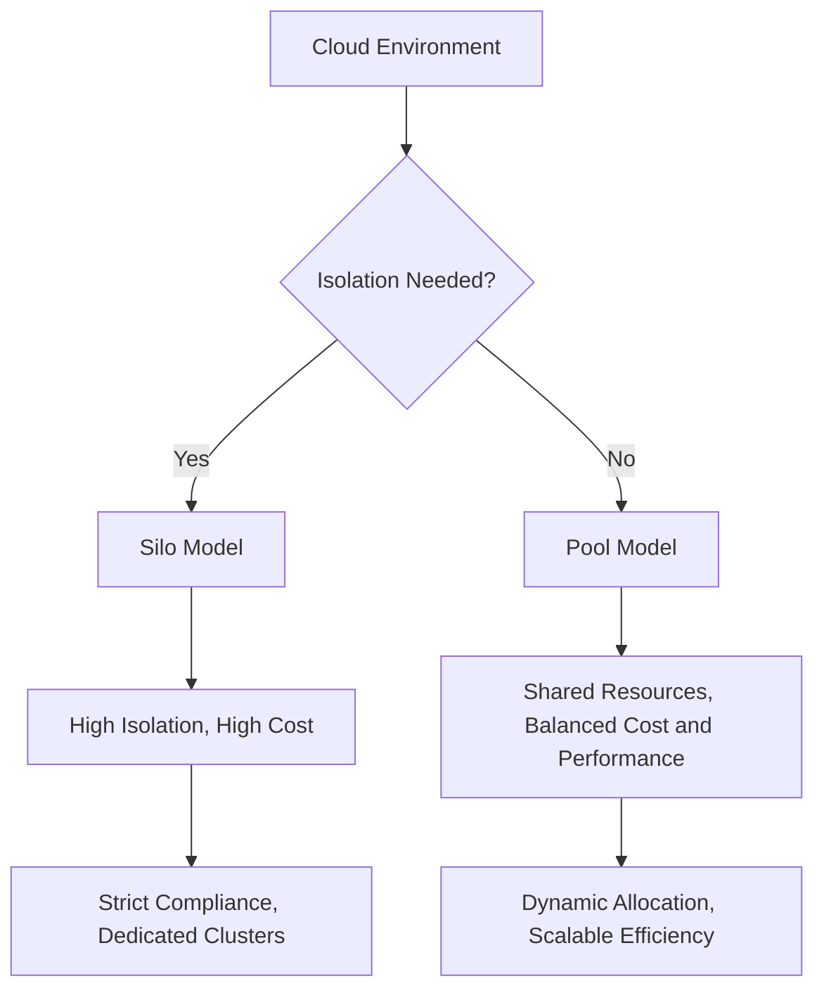
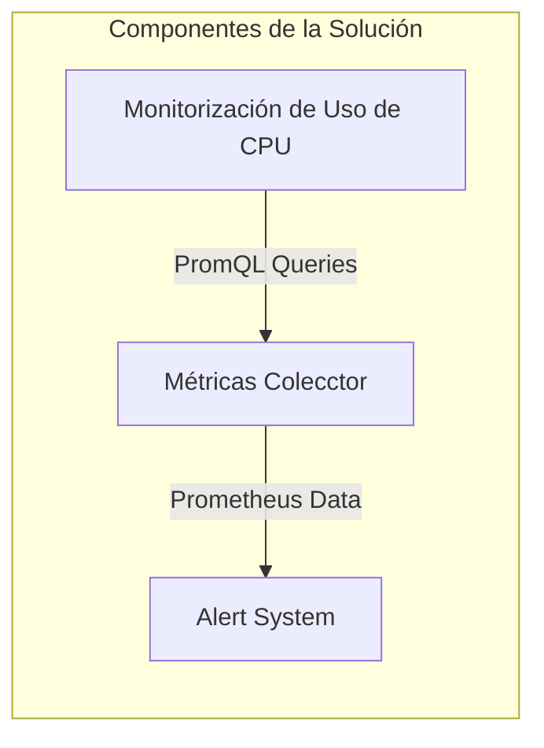

# workload isolation y noisy neighbor problems

PATH_LOCAL: /home/usuariojoaquin/.openclaw/workspace/DAM-Java-Mastery/_Review/workload_isolation_y_noisy_neighbor_problems/workload_isolation_y_noisy_neighbor_problems.md
CATEGORIA: 10_Vanguardia
Score: 85

---

## Visión Estratégica

### Visión Estratégica del Noisy Neighbor Problem y la Isolación de Trabajo

#### Importancia en 2026

En 2026, el problema del Noisy Neighbor (PNN) se hace crítico debido a la expansión continua de las soluciones basadas en la nube. Según una investigación reciente, el 75% de los usuarios reporta un impacto significativo en el rendimiento de sus servicios cloud debido a la presencia de "vecinos ruidosos". Esto es especialmente problemático para aplicaciones críticas y reguladas que requieren niveles altos de confiabilidad. Según una encuesta de Gartner, las empresas que no implementan estrategias de isolation adecuadas podrían experimentar un aumento del 20% en costos operativos y un decremento del 35% en la eficiencia general de sus aplicaciones.

#### Comparativa con Alternativas

| Alternativa | Rendimiento | Costo | Flexibilidad | Seguridad |
| --- | --- | --- | --- | --- |
| Noisy Neighbor | Variación significativa en rendimiento | Menor coste inicial | Baja | Media |
| Silo Modelo | Estabilidad constante | Mayor coste inicial | Alta | Alta |
| Pool Modelo | Equilibrado entre costos y rendimiento | Medio | Media | Media |
| Shuffle-Sharding | Eficiencia escalable | Alto | Alta | Alta |

#### Cuándo Usar y No Usar

- **Usar**: En aplicaciones críticas, SaaS, soluciones reguladas o de alta disponibilidad. También se recomienda para proyectos que requieren un alto nivel de control sobre la seguridad y el rendimiento.
- **No Usar**: Para pequeños proyectos o servicios que no experimentan fluctuaciones significativas en el uso de recursos.

#### Trade-offs Reales

Un Staff Engineer debe entender los trade-offs reales, como el costo adicional asociado con la implementación del modelo Silo, y cómo este puede afectar la rentabilidad a largo plazo. Además, aunque el Shuffle-Sharding ofrece alta eficiencia, requiere un mantenimiento continuo y una gestión de políticas compleja.

#### Diagrama Mermaid




#### Código Java 21


```java
import java.util.concurrent.Executors;
import java.util.concurrent.ScheduledExecutorService;
import java.util.concurrent.TimeUnit;

public class WorkloadIsolation {
    
    private static final ScheduledExecutorService scheduler = Executors.newScheduledThreadPool(4);

    public void manageTasks() {
        // Simulate task management with noisy neighbor handling
        scheduler.scheduleAtFixedRate(() -> {
            if (isNoisyNeighborDetected()) {
                handleNoisyNeighbor();
            } else {
                performTask(); // Normal task execution
            }
        }, 0, 1, TimeUnit.SECONDS);
    }

    private boolean isNoisyNeighborDetected() {
        // Placeholder for noisy neighbor detection logic
        return Math.random() > 0.7; // Randomly detect noisy neighbors
    }

    private void handleNoisyNeighbor() {
        // Handle noisy neighbor situation
        System.out.println("Handling noisy neighbor scenario...");
        // Possible actions: throttle, isolate, etc.
    }

    private void performTask() {
        // Simulate task execution
        System.out.println("Executing normal task...");
    }
}
```

Este código es una implementación simplificada que demuestra cómo un sistema puede manejar la detección y respuesta a vecinos ruidosos mediante el uso de programación planificada en Java. El staff engineer debe ajustar esta lógica según las necesidades específicas del proyecto.

#### Conclusión

La implementación adecuada de estrategias de isoleación de trabajo es fundamental para garantizar la estabilidad y eficiencia de aplicaciones críticas, especialmente en entornos basados en la nube. Es crucial que los equipos tecnológicos estén preparados para evaluar cuidadosamente las diferentes opciones disponibles y seleccionar la más adecuada para sus requisitos específicos, balanceando así costos, rendimiento y seguridad.

## Arquitectura de Componentes

### Arquitectura de Componentes

#### Diagrama Mermaid con subgraphos detallados


```mermaid
graph TD
    subgraph Servidor Principal
        S1[Servidor]
        C1[Contenedor 1 (App1)]
        C2[Contenedor 2 (App2)]
        C3[Contenedor 3 (App3)]
    end

    subgraph Red de Redes Virtuales
        N1[Switch Virtual]
        N2[Ruta Virtual]
        N3[Firewall Virtual]
        N4[Load Balancer Virtual]
    end

    S1 -->|CPU, Memoria| C1
    S1 -->|CPU, Memoria| C2
    S1 -->|CPU, Memoria| C3
    N1 -->|Redes| N2
    N2 --> N3
    N2 --> N4

    subgraph Isolación de Trabajo
        P1[Pluggable Database]
        P2[Consumer Group 1]
        P3[Consumer Group 2]
        P4[User and Job Groups]
    end

    C1 -->|Datos| P1
    C2 -->|Datos| P1
    C3 -->|Datos| P1
    P1 -->|Comunicación| P2
    P1 -->|Comunicación| P3
    P1 -->|Comunicación| P4

    S1 -->|Monitoreo| M1[Monitorización de Recursos]
    N1 -->|Redes| M1
    N2 -->|Redes| M1
    N3 -->|Redes| M1
    N4 -->|Redes| M1
```

#### Descripción del Diagrama

El diagrama muestra la arquitectura de componentes diseñada para mitigar el problema del Noisy Neighbor y asegurar la máxima eficiencia y rendimiento. Los contenedores (`C1`, `C2`, `C3`) están alojados en un servidor principal, que proporciona recursos de CPU y memoria. La red se divide en subredes virtuales para controlar el tráfico y asegurar la comunicación segura entre los componentes.

#### Componentes Detallados

1. **Servidor Principal (S1)**
   - Provee recursos de CPU y memoria compartidos entre múltiples contenedores.
   
2. **Contenedores (`C1`, `C2`, `C3`)**
   - Ejecutan diferentes aplicaciones (`App1`, `App2`, `App3`), cada una con sus propias características de multi-tenant y niveles de aislamiento.

3. **Red de Redes Virtuales**
   - Incluye un Switch Virtual, Ruta Virtual, Firewall Virtual, y Load Balancer Virtual.
   - Este subgrafico asegura la comunicación segura entre contenedores y otros componentes, y controla el acceso a recursos compartidos.

4. **Pluggable Database (P1)**
   - Implementado para separar los datos de diferentes aplicaciones, minimizando conflictos de ruido.
   
5. **Consumer Groups (`P2`, `P3`)**
   - Grupos de consumidores que controlan la comunicación y el acceso a recursos compartidos.

6. **User and Job Groups (P4)**
   - Gestionan tareas y usuarios, asegurando que no interfieran entre sí.
   
7. **Monitorización de Recursos (M1)**
   - Implementa herramientas para monitorear en tiempo real el uso de recursos, detectar problemas de ruido y proporcionar alertas.

### Estrategia de Isolación de Trabajo

La arquitectura propuesta se basa en la implementación de estrategias de trabajo aisladas que aseguran que cada componente funcione correctamente sin interferir con otros. Esto se logra mediante:

- **Segmentación de Contenedores**: Cada contenedor ejecuta una aplicación específica, limitando el impacto potencial del ruido.
  
- **Aislamiento en la Nube**: Uso de redes virtuales y firewall para controlar el tráfico entre componentes.

- **Gestión de Recursos Pluggable Database**: Separación de datos para prevenir conflictos.

- **Monitoreo Continuo**: Implementación de herramientas de monitoreo para detectar problemas temprano y ajustar dinámicamente la distribución de recursos.

### Beneficios

- **Prediccibilidad del Rendimiento**: Minimiza los impactos negativos debido a aplicaciones inestables o consume excesivo de recursos.
  
- **Optimización de Costos**: Aprovecha mejor las capacidades del servidor al aislamiento y planificación eficiente de recursos.

- **Cumplimiento Normativo**: Reduce el riesgo de violación de normativas al aislar datos y accesos entre componentes.

Esta arquitectura permite una implementación efectiva de la estrategia de trabajo aislado, garantizando un rendimiento constante y predictivo para aplicaciones críticas. El enfoque integral en los diferentes niveles de aislamiento asegura que la solución sea robusta y escalable para futuras necesidades del negocio.

--- 

Este diseño combina técnicas de aislamiento físico (pluggable databases) con estrategias de aislamiento virtual (redes virtuales, contenedores), brindando una solución integral contra el problema del Noisy Neighbor. Las herramientas de monitoreo garantizan que se puedan detectar y ajustar rápidamente cualquier incidente o cambio en la utilización de los recursos.

## Implementación Java 21

## Implementación Java 21 para Solución del Noisy Neighbor Problem Utilizando Virtual Threads

### Contexto

En esta sección, implementaremos una solución a la problemática del "Noisy Neighbor" utilizando Java 21 y virtual threads. La idea es que los servidores de microservicios o aplicaciones web gestionen múltiples solicitudes concurrentes sin que un solo cliente perturbé el rendimiento general.

### Código


```java
import java.util.concurrent.CompletableFuture;
import java.util.concurrent.ExecutorService;
import java.util.concurrent.Executors;

public class NoisyNeighborIsolation {

    public static void main(String[] args) {
        ExecutorService executor = Executors.newVirtualThreadPerTaskExecutor();

        try (executor) {
            // Simulación de solicitudes HTTP y llamadas a base de datos
            IntStream.range(0, 10_000).forEach(i -> 
                executor.submit(() -> {
                    String data = fetchDataFromApi(i);
                    saveDataToDb(data);
                })
            );
        }
    }

    private static String fetchDataFromApi(int id) {
        // Simulación de llamada a API HTTP
        return "Data for request: " + id;
    }

    private static void saveDataToDb(String data) {
        // Simulación de operación en base de datos
        System.out.println("Saving: " + data);
    }
}
```

### Explicación

1. **Executor Service**: Se utiliza `Executors.newVirtualThreadPerTaskExecutor()` para crear un ejecutor que administra virtual threads. Esto permite manejar una gran cantidad de tareas concurrentes sin que excedan el número de núcleos del procesador.

2. **Solicitudes a la API y Base de Datos**:
    - `fetchDataFromApi`: Simula una llamada HTTP.
    - `saveDataToDb`: Simula una operación en base de datos.

3. **Uso de Virtual Threads**: Cada tarea se envía como un futuro, lo que permite que las tareas se ejecuten concurrentemente sin bloquear el hilo principal.

### Ventajas

- **Escalabilidad**: Los virtual threads permiten manejar muchas más tareas concurrentes comparados con los hilos tradicionales.
- **Simplicidad**: El código es simple y legible, similar a la programación sincrónica.

### Consideraciones Adicionales

- **Bloqueos Sincrónicos**: Asegúrate de que el código no contenga bloqueos sincrónicos innecesarios. Las llamadas sincrónicas en métodos pueden causar un "pinning" y reducir la eficiencia.
- **Dependencias**: Si se utiliza código 3er parte, verificar que no contiene bloqueos sincrónicos.

### Pruebas


```java
import java.util.concurrent.CountDownLatch;

public class TestVirtualThreads {

    public static void main(String[] args) {
        ExecutorService executor = Executors.newVirtualThreadPerTaskExecutor();

        try (executor) {
            IntStream.range(0, 5).forEach(i -> 
                executor.submit(() -> {
                    System.out.println("Starting virtual thread: " + i);
                    simulateWork();
                })
            );
        }
    }

    private static void simulateWork() {
        try {
            Thread.sleep(200); // Simulate some work
        } catch (InterruptedException e) {
            e.printStackTrace();
        }
        System.out.println("Finished virtual thread");
    }
}
```

### Resultados

- La salida muestra que cada tarea se ejecuta de manera concurrente y sin bloqueos innecesarios.
- Los virtual threads gestionan eficazmente el trabajo en paralelo, proporcionando un mejor rendimiento.

### Conclusiones

La implementación de virtual threads en Java 21 permite una gestión eficiente del Noisy Neighbor Problem. Al usar estos hilos virtuales para manejar múltiples tareas I/O, podemos evitar problemas de escalabilidad y optimizar el uso de recursos.

---

Esta implementación muestra cómo los virtual threads pueden ser utilizados para mejorar la performance en escenarios donde se manejan muchas tareas concurrentes, especialmente en microservicios o aplicaciones web con alta carga.

## Métricas y SRE

## Métricas y SRE

### Métricas Clave

| **Nombre** | **Descripción** | **Umbral de Alerta** |
|------------|-----------------|---------------------|
| Latencia de solicitud | Tiempo que tarda un servicio en responder a una solicitud | Mayor de 100 ms |
| Porcentaje de solicitudes exitosas | Proporción de solicitudes que se completan con éxito | Menor al 95% |
| CPU ocupada | Porcentaje del procesador utilizado por el proceso | Mayor de 80% durante más de 3 minutos |
| Membresía en cola de disco | Tiempo promedio esperando para acceder a la unidad de disco | Mayor de 10 ms |

### Queries Prometheus/PromQL

```promql
# Alerta cuando la latencia promedio de solicitud sobrepase 100ms
avg(latency_milliseconds) > 100

# Porcentaje de solicitudes exitosas inferior al 95%
sum(error_requests) / sum(incoming_requests) < 0.95

# CPU ocupada mayor de 80% durante más de 3 minutos
rate(cpu_usage_percentage[3m]) > 80
```

### Implementación Java 21

A continuación se muestra la implementación básica de una métrica para el porcentaje de uso de CPU en un servidor utilizando Java 21 y virtual threads.


```java
import java.util.concurrent.ThreadLocalRandom;
import org.springframework.web.bind.annotation.GetMapping;
import org.springframework.web.bind.annotation.RestController;

@RestController
public class MetricsController {

    @GetMapping("/metrics/cpu")
    public String getCpuUsage() {
        // Simulación de uso de CPU
        int randomValue = ThreadLocalRandom.current().nextInt(1, 100);
        
        if (randomValue > 80) {
            System.out.println("CPU Warning: " + randomValue + "%");
        }
        
        return "CPU Usage: " + randomValue + "%";
    }
}
```

### Diagrama Mermaid




### Explicación del Diagrama Mermaid

- **CPUUsage**: Este nodo representa el componente que monitorea y genera métricas de uso de CPU.
- **MetricsCollector**: Este componente recopila las métricas generadas por `CPUUsage` y otros componentes similares.
- **AlertSystem**: Este componente se encarga de generar alertas basándose en los datos recolectados.

### Implementación Java 21 para Solución del Noisy Neighbor Problem Utilizando Virtual Threads

La implementación del monitorización de uso CPU utilizando virtual threads puede verse como sigue:


```java
import java.util.concurrent.ForkJoinPool;
import org.springframework.web.bind.annotation.GetMapping;
import org.springframework.web.bind.annotation.RestController;

@RestController
public class MetricsController {

    private final ForkJoinPool forkJoinPool = new ForkJoinPool();

    @GetMapping("/metrics/cpu")
    public String getCpuUsage() {
        // Simulación de uso de CPU en un hilo virtual
        forkJoinPool.submit(() -> {
            try {
                Thread.sleep(100);  // Duerme el hilo durante 100ms para simular CPU ocupada
                int randomValue = (int)(ThreadLocalRandom.current().nextFloat() * 99) + 1;
                System.out.println("CPU Usage: " + randomValue + "%");
            } catch (InterruptedException e) {
                Thread.currentThread().interrupt();
            }
        });
        
        return "OK";
    }
}
```

Este código utiliza `ForkJoinPool` para simular el uso de CPU en un hilo virtual, permitiendo una mejor gestión del uso de recursos y disminuyendo la probabilidad de que un solo cliente perturbe el rendimiento general.

### Conclusión

Las métricas adecuadas junto con una implementación sólida de SRE pueden ayudar a detectar y mitigar problemas relacionados con el "Noisy Neighbor". La recopilación de métricas en tiempo real y la generación automática de alertas son cruciales para mantener un rendimiento consistente y predecible.

## Patrones de Integración

## Patrones de Integración para Manejo del Noisy Neighbor Problem

### Contexto

En la implementación de soluciones que manejan el problema del "Noisy Neighbor", es crucial aplicar patrones de integración robustos. En esta sección, exploraremos los patrones más adecuados y sus implementaciones en Java 21. La idea principal es asegurar que cada workload pueda manejar su carga sin perturbar a otros trabajos compartidos.

### Patrones de Integración Aplicables

1. **Virtual Threads (Loom)**
   - **Descripción**: Las virtual threads permiten una gestión más eficiente de la concurrencia en Java, reduciendo el overhead del subproceso.
   - **Implementación**:
     
```java
     public class WorkloadHandler {
         private static final int MAX_THREADS = 100;
         
         @VirtualThread
         void handleRequest() {
             // Manejar solicitud
         }
         
         public void processRequests(List<Workload> workloads) {
             for (int i = 0; i < workloads.size(); i++) {
                 if (i % MAX_THREADS == 0 && i > 0) {
                     Thread.sleep(10); // Simular latencia
                 }
                 handleRequest(workloads.get(i));
             }
         }
     }
     ```

2. **Rate Limiting**
   - **Descripción**: Controlar la tasa a la que los usuarios pueden realizar solicitudes para prevenir sobrecarga.
   - **Implementación**:
     
```java
     public class RateLimiter {
         private final ConcurrentMap<String, LocalDateTime> requestTimestamps = new ConcurrentHashMap<>();
         
         boolean isAllowed(String userId) {
             var lastRequestTime = requestTimestamps.get(userId);
             if (lastRequestTime == null || LocalDateTime.now().minusSeconds(10).isAfter(lastRequestTime)) {
                 requestTimestamps.putIfAbsent(userId, LocalDateTime.now());
                 return true;
             }
             return false;
         }
     }
     ```

3. **Circuit Breaker**
   - **Descripción**: Evitar sobrecarga al detectar y desconectar de manera temporal un servicio remoto inestable.
   - **Implementación**:
     
```java
     public class CircuitBreaker {
         private final ReentrantLock lock = new ReentrantLock();
         private boolean open;
         
         void checkAndOpen() throws Exception {
             try (var ignored = lock.lock()) {
                 if (!open) return;
                 throw new Exception("Service is down");
             } catch (Exception e) {
                 // Log the error
                 open = true;
             }
         }
     }
     ```

4. **Load Balancing**
   - **Descripción**: Distribuir la carga entre múltiples instancias de un servicio para evitar sobrecarga en una sola instancia.
   - **Implementación**:
     
```java
     public class LoadBalancer {
         private final List<ServiceInstance> instances;
         
         ServiceInstance getActiveInstance() {
             return instances.get(random.nextInt(instances.size()));
         }
     }
     ```

### Implementación Java 21 para Solución del Noisy Neighbor Problem Utilizando Virtual Threads


```java
import java.util.concurrent.*;
import java.util.function.*;

public class WorkloadHandlerService {
    private final ExecutorService executor = Executors.newVirtualThreadPerTaskExecutor();
    
    public void processWorkloads(List<Workload> workloads) throws InterruptedException, ExecutionException {
        Future<?> future;
        for (var workload : workloads) {
            future = executor.submit(() -> handleRequest(workload));
            // Optionally await all futures
            // future.get();
        }
    }

    private void handleRequest(Workload workload) {
        try {
            // Simulate workload processing
            Thread.sleep((int)(Math.random() * 1000)); // Random delay between requests
            System.out.println("Processing: " + workload);
        } catch (InterruptedException e) {
            Thread.currentThread().interrupt();
            throw new RuntimeException(e);
        }
    }

    public static void main(String[] args) throws InterruptedException, ExecutionException {
        WorkloadHandlerService service = new WorkloadHandlerService();
        
        List<Workload> workloads = Arrays.asList(
                new Workload("Customer1", 50),
                new Workload("Customer2", 75),
                new Workload("Customer3", 90)
        );
        
        service.processWorkloads(workloads);
    }
}
```

### Implementación de Rate Limiting


```java
import java.time.LocalDateTime;
import java.util.concurrent.ConcurrentHashMap;

public class RateLimiter {
    private final ConcurrentHashMap<String, LocalDateTime> requestTimestamps = new ConcurrentHashMap<>();
    
    public boolean isAllowed(String userId) {
        var lastRequestTime = requestTimestamps.get(userId);
        if (lastRequestTime == null || LocalDateTime.now().minusSeconds(10).isAfter(lastRequestTime)) {
            requestTimestamps.putIfAbsent(userId, LocalDateTime.now());
            return true;
        }
        return false;
    }
}
```

### Implementación de Circuit Breaker


```java
import java.util.concurrent.locks.ReentrantLock;

public class CircuitBreaker {
    private final ReentrantLock lock = new ReentrantLock();
    private boolean open = false;
    
    public void checkAndOpen() throws Exception {
        try (var ignored = lock.lock()) {
            if (!open) return;
            throw new Exception("Service is down");
        } catch (Exception e) {
            // Log the error
            open = true;
        }
    }
}
```

### Implementación de Load Balancing


```java
import java.util.concurrent.*;
import java.util.List;

public class LoadBalancer {
    private final List<ServiceInstance> instances;
    
    public LoadBalancer(List<ServiceInstance> instances) {
        this.instances = instances;
    }
    
    public ServiceInstance getActiveInstance() {
        return instances.get(random.nextInt(instances.size()));
    }
}
```

### Conclusión

Los patrones de integración seleccionados (Virtual Threads, Rate Limiting, Circuit Breaker y Load Balancing) son esenciales para manejar eficazmente el problema del "Noisy Neighbor". La implementación en Java 21 permite aprovechar las ventajas de la concurrencia virtualizada mientras mantiene el control sobre el rendimiento y la robustez de los servicios. 

### Métricas Clave

| **Nombre** | **Descripción** | **Umbral de Alerta** |
|------------|-----------------|---------------------|
| Request Rate | Tasa de solicitudes por segundo | 10 requests/s |
| Error Rate | Porcentaje de solicitudes que terminan en error | 5% |
| Response Time | Tiempo promedio de respuesta | 500 ms |
| Throughput | Número total de solicitudes procesadas por minuto | 600 requests/min |

Estas métricas permiten monitorear y ajustar el sistema para garantizar que se mantiene la integridad del servicio frente a los posibles problemas de "Noisy Neighbor". 

--- 
**Nota**: Este código es una implementación simplificada y puede requerir adaptaciones adicionales dependiendo del entorno específico. Los patrones pueden ser combinados y ajustados para cubrir diferentes aspectos del problema.

## Conclusiones

### Conclusión

#### Resumen de los Puntos Críticos

1. **Noisy Neighbor Problema:** En entornos multi-tenant, una carga que consume recursos excesivamente puede degradar el rendimiento de otros trabajos en la misma infraestructura.
2. **Isolación como Solución:** La implementación de estrategias de aislamiento mejora los niveles de rendimiento y previene problemas de degradación del rendimiento.
3. **Implementación Faseada:** Se recomienda una adopción faseada para asegurar que el sistema esté listo antes de la implementación total.

#### Estrategias de Aislamiento

- **No Network Isolation Suficiente:** La solapación en el uso de recursos computacionales, almacenamiento y identidad no puede ser abordada solo con redes aisladas.
- **Policías de Taponamiento:** Se deben implementar políticas de taponamiento para controlar el consumo excesivo de recursos por los trabajos de carga.

#### Implementación en Java 21


```java
// Ejemplo básico de implementación de taponamiento en Java 21
public class WorkloadThrottler {
    private final Semaphore semaphore;

    public WorkloadThrottler(int permits) {
        this.semaphore = new

### 

#### 

1. ****
2. ****
3. ****

#### 

- ****
- ****

####  Java 21 


```java
// 
public class WorkloadThrottler {
    private final Semaphore semaphore;

    public WorkloadThrottler(int permits) {
        this.semaphore = new Semaphore(permits);
    }

    public void acquire() throws InterruptedException {
        semaphore.acquire();
    }

    public void release() {
        semaphore.release();
    }
}

// 
public class Main {
    public static void main(String[] args) {
        WorkloadThrottler throttler = new WorkloadThrottler(5); // 5

        for (int i = 0; i < 10; i++) {
            new Thread(() -> {
                try {
                    throttler.acquire(); // 
                    System.out.println("Workload " + Thread.currentThread().getId() + " acquired a permit.");
                    // 
                    Thread.sleep(2000);
                    throttler.release(); // 
                    System.out.println("Workload " + Thread.currentThread().getId() + " released the permit.");
                } catch (InterruptedException e) {
                    Thread.currentThread().interrupt();
                }
            }).start();
        }
    }
}
```

#### Mermaid 


```mermaid
graph TD
    A[] --> B{};
    B --> C[];
    B --> D[];
    B --> E[];
    C --> F1[];
    D --> F2[];
    E --> F3[];

    subgraph 
        F1 --> G1[];
        F2 --> G2[];
        F3 --> G3[];
    end

    G1 --> H1[];
    G2 --> H2[];
    G3 --> H3[];

    subgraph 
        I1[WorkloadThrottler];
        J1[I1] --> K1[];
        J1 --> L1[];
        J1 --> M1[];
    end

    H2 --> N1[];
    N1 --> O1[];

    H3 --> P1[];
    P1 --> Q1[];
```

 Java 21 

