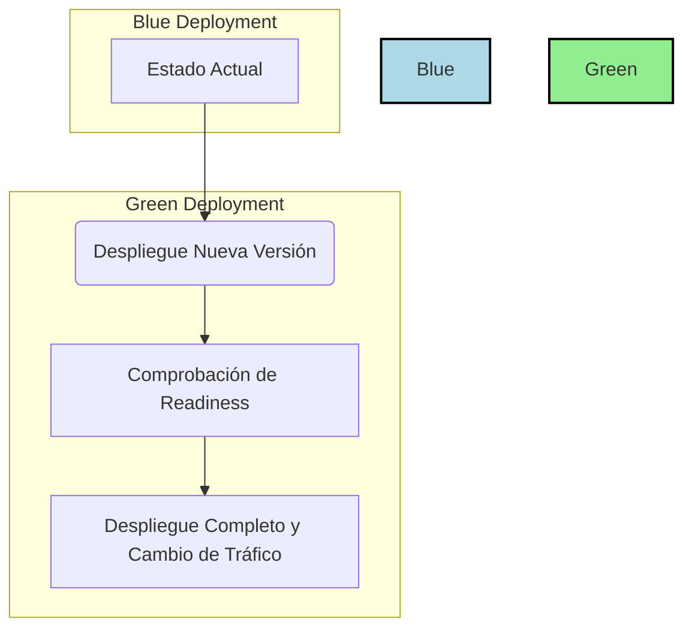
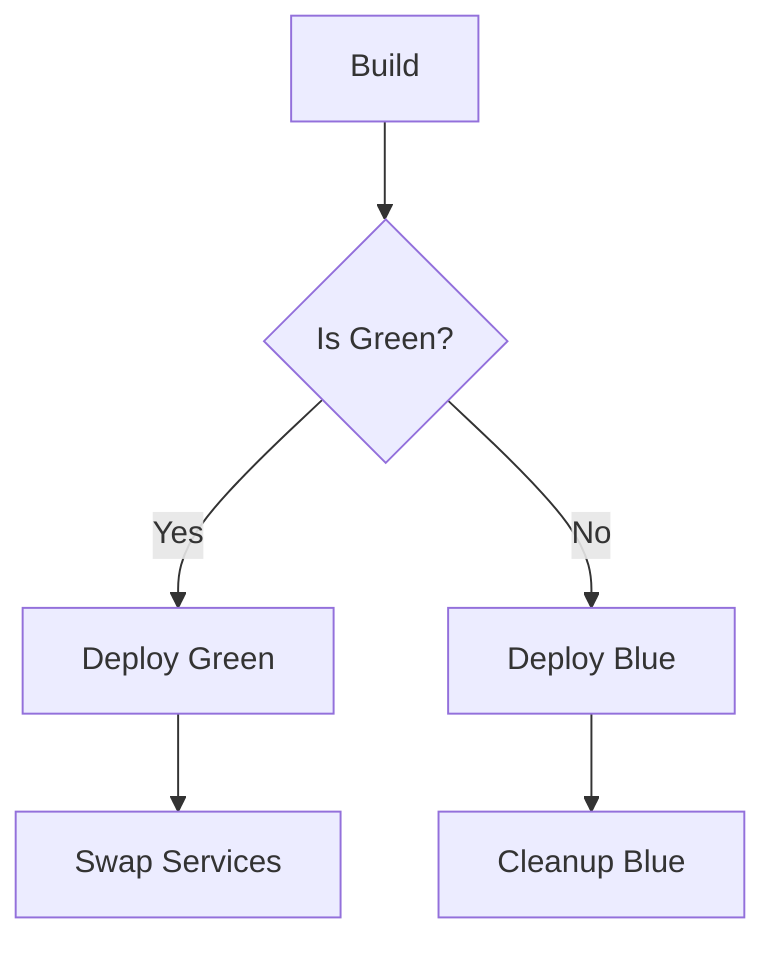
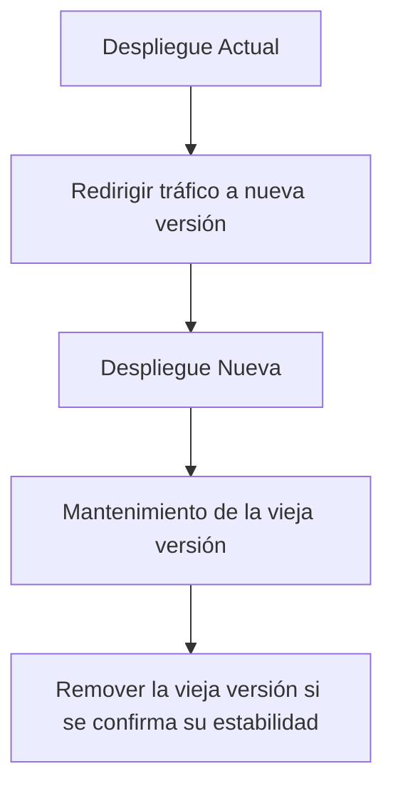

# zero downtime deployments en kubernetes

PATH_LOCAL: /home/usuariojoaquin/.openclaw/workspace/DAM-Java-Mastery/_Review/zero_downtime_deployments_en_kubernetes/zero_downtime_deployments_en_kubernetes.md
CATEGORIA: 05_SRE_DevOps
Score: 86

---

## Visión Estratégica

### Visión Estratégica

Para mantener una competencia robusta en el mercado y seguir las tendencias tecnológicas emergentes, es fundamental implementar soluciones de despliegue sin tiempo de inactividad (zero downtime deployments) en Kubernetes. Estas prácticas no solo garantizan la disponibilidad continua del servicio para los usuarios finales, sino que también permiten a las organizaciones adaptarse rápidamente a cambios y actualizaciones sin interrumpir el flujo normal de trabajo.

#### Razones Estratégicas

1. **Competitividad en Tiempo Real**: En un entorno digital donde la experiencia del usuario es crucial, cualquier interrupción puede ser costosa. Implementar despliegues sin tiempo de inactividad garantiza que los servicios permanezcan disponibles 24/7, lo cual es vital para mantener y mejorar la competitividad.

2. **Fidelización del Cliente**: Las interrupciones temporales pueden llevar a la pérdida de confianza en la marca y los clientes potenciales. Despliegues sin tiempo de inactividad minimizan estos riesgos al garantizar que los servicios estén disponibles en todo momento, lo cual puede aumentar la fidelización del cliente.

3. **Flexibilidad para Actualizaciones**: En un entorno tecnológico dinámico, las organizaciones necesitan ser capaces de actualizar y mejorar rápidamente sus servicios. Las prácticas de despliegue sin tiempo de inactividad permiten hacer cambios sin interrumpir el servicio, lo que facilita la adaptación a nuevas tecnologías y requerimientos del mercado.

4. **Optimización de Recursos**: La implementación efectiva de estas prácticas puede ayudar a optimizar los recursos disponibles en Kubernetes, mejorando la eficiencia operativa y reduciendo costos.

5. **Cumplimiento Regulatorio**: En algunos sectores, como el financiero o el sanitario, es crucial garantizar la disponibilidad continua del servicio para cumplir con regulaciones y normativas. Las soluciones de despliegue sin tiempo de inactividad son fundamentales en estos contextos.

#### Implementación Estratégica

Para implementar despliegues sin tiempo de inactividad en Kubernetes, es necesario seguir una serie de pasos estratégicos:

1. **Uso de Blue/Green Deployment**: Este enfoque involucra mantener dos versiones del mismo servicio simultáneamente. Una versión actual está en producción mientras la otra se prepara para el despliegue. Una vez que la nueva versión esté lista, se cambia rápidamente al nuevo estado sin interrupción.

2. **Implementación de Rolling Updates**: Este enfoque permite actualizar gradualmente los Pods existentes, reemplazándolos con nuevas versiones sin interrumpir el servicio. La implementación de Kubernetes facilita esta tarea mediante parámetros como `maxUnavailable` y `maxSurge`.

3. **Pod Readiness Gates**: Estas características permiten garantizar que un Pod esté listo para manejar tráfico antes de ser incluido en el balanceador de carga. Esto ayuda a prevenir interrupciones durante los despliegues.

4. **Usar Nombres Espaciales (Namespaces)**: Los nombres espaciales pueden ayudar a gestionar y segmentar recursos, lo que facilita la implementación de despliegues sin tiempo de inactividad en entornos complejos.

5. **Automatización con Jenkins**: La integración continua y el despliegue continuo (CI/CD) permiten automatizar los procesos de desarrollo, pruebas y despliegue, lo que mejora la eficiencia y reduce el riesgo humano en las operaciones.

### Ejemplo de Implementación

A continuación se muestra un ejemplo de cómo se puede implementar una solución de despliegue sin tiempo de inactividad utilizando Kubernetes:


```java
// Configuración del Despliegue (Deployment) en Kubernetes
apiVersion: apps/v1
kind: Deployment
metadata:
  name: tomcat-deployment
spec:
  replicas: 2
  strategy:
    type: RollingUpdate
    rollingUpdate:
      maxUnavailable: 50%
      maxSurge: 1
  selector:
    matchLabels:
      app: tomcat
  template:
    metadata:
      labels:
        app: tomcat
    spec:
      containers:
      - name: tomcat
        image: tomcat:latest
        ports:
        - containerPort: 8080

// Configuración del Servicio (Service) en Kubernetes
apiVersion: v1
kind: Service
metadata:
  name: tomcat-service
spec:
  selector:
    app: tomcat
  ports:
  - protocol: TCP
    port: 80
    targetPort: 8080
  type: LoadBalancer

```

### Diagrama Mermaid para Despliegue Blue/Green




Este ejemplo y el diagrama Mermaid demuestran cómo se puede implementar una solución de despliegue Blue/Green en Kubernetes para garantizar un tiempo de inactividad cero durante las actualizaciones. La automatización con Jenkins asegura que estos procesos sean consistentes y seguros.

### Conclusión

La implementación estratégica de despliegues sin tiempo de inactividad en Kubernetes no solo mejora la disponibilidad del servicio, sino que también potencia la capacidad operativa y competitiva de las organizaciones. Al seguir estas prácticas, se puede garantizar una experiencia de usuario fluida y consistente, lo cual es crucial para el éxito en el mercado actual.

## Arquitectura de Componentes

### Arquitectura de Componentes

Para implementar despliegues sin tiempo de inactividad (zero downtime deployments) en Kubernetes utilizando el ejemplo del despliegue de Tomcat, es crucial entender la arquitectura de los componentes involucrados y cómo estos se interrelacionan. En este caso, utilizaremos un `Deployment` con un método de actualización por rollover (rolling update).

#### Despliegue de Tomcat con Rollover

```yaml
apiVersion: apps/v1  # Para versiones más recientes, 'apps/v1'
kind: Deployment
metadata:
  name: tomcat-deployment-rolling-update
spec:
  replicas: 2           # Número de réplicas para el despliegue
  selector:             # Selector que identifica a los Pods del despliegue
    matchLabels:
      app: tomcat
      role: rolling-update
  template:            # Define el contenido del Pod
    metadata:
      labels:
        app: tomcat
        role: rolling-update
    spec:
      containers:
      - name: tomcat-container
        image: tomcat:${TOMCAT_VERSION}  # Usar variable de entorno para la versión
        ports:
        - containerPort: 8080
        readinessProbe:
          httpGet:
            path: /  # Ruta para el probe de disponibilidad
            port: 8080
      strategy:
        type: RollingUpdate
        rollingUpdate:
          maxSurge: 1   # Máximo número adicional de Pods a crear (1)
          maxUnavailable: 50%  # Máximo porcentaje de Pods que pueden estar inactivos (50%)

```

A continuación, se presenta una representación visual utilizando Mermaid para ilustrar la arquitectura del despliegue.


```mermaid
graph TD
    A[Control Plane] --> B[Kube-apiserver]
    A --> C[etcd]
    A --> D[Kube-scheduler]
    A --> E[Kube-controller-manager]

    F[Worker Node 1] --> G[Tomcat Pod v7]
    F --> H[Tomcat Pod v8 (new)]
    
    I[Service] --> J[LoadBalancer]
    J --> K[Traffic to Pods]

    L[Rollover Update Strategy] --> M[Create new Pods and scale up gradually]
    M --> N[Remove old Pods once they are no longer needed]
```

#### Explicación de los Componentes

1. **Control Plane**:
   - **Kube-apiserver**: Servidor central que proporciona la API HTTP y maneja las operaciones del usuario.
   - **etcd**: Base de datos clave-valor consistente y altamente disponible que almacena el estado del cluster.
   - **Kube-scheduler**: Encargado de asignar Pods a los nodos worker disponibles.
   - **Kube-controller-manager**: Ejecuta controladores que implementan la comportamiento de la API.

2. **Worker Nodes**:
   - Los worker nodes son donde se ejecutan los Pods. En este caso, el despliegue de Tomcat está siendo realizado en un nodo worker.

3. **Service y LoadBalancer**:
   - El `Service` define cómo se accede a los Pods desde fuera del cluster.
   - El `LoadBalancer` redirige la tráfico al servicio.

4. **Rollover Update Strategy**:
   - La estrategia de rollover permite crear nuevos Pods (v8) mientras se mantienen los antiguos (v7). Los nuevos Pods se crean gradualmente, y luego los antiguos se eliminan una vez que ya no son necesarios.

5. **ReadinessProbe**:
   - Un probe de disponibilidad que verifica si un Pod está listo para recibir tráfico. En este caso, se utiliza HTTPGet a la ruta raíz del Tomcat.

#### Despliegue con Zero Downtime

Para implementar un despliegue sin tiempo de inactividad en Kubernetes:

1. **Aplicar el despliegue**:
   ```bash
   kubectl apply -f deployment.yaml
   ```

2. **Pausar el rollover (si es necesario)**:
   ```bash
   kubectl rollout pause deployment/tomcat-deployment-rolling-update
   ```

3. **Realizar cambios en el despliegue**:
   ```bash
   kubectl set image deployment/tomcat-deployment-rolling-update tomcat-container=tomcat:8  # Cambiar la imagen a la versión 8
   ```

4. **Reanudar el rollover**:
   ```bash
   kubectl rollout resume deployment/tomcat-deployment-rolling-update
   ```

5. **Verificar el estado del despliegue**:
   ```bash
   kubectl rollout status deployment/tomcat-deployment-rolling-update
   ```

6. **Revertir el despliegue si es necesario**:
   ```bash
   kubectl rollout undo deployment/tomcat-deployment-rolling-update --to-revision=1  # Revertir a la revisión anterior
   ```

### Código en Java para Manejar el Despliegue

A continuación, se muestra un ejemplo básico de cómo podrías manejar el despliegue utilizando Java y el cliente kubectl.


```java
import io.kubernetes.client.openapi.ApiClient;
import io.kubernetes.client.openapi.Configuration;
import io.kubernetes.client.util.ClientUtils;

public class KubernetesDeployer {

    public static void main(String[] args) {
        ApiClient client = ClientUtils.defaultClient();

        // Ajusta el API endpoint y certificados si es necesario
        Configuration.setDefaultApiClient(client);

        // Ejemplo de cómo pausar un despliegue
        try {
            String deploymentName = "tomcat-deployment-rolling-update";
            Configuration.getObjectMapper().writeValue(System.out, client.command()
                    .withNamespace("default")
                    .rolloutPause(deploymentName));
        } catch (Exception e) {
            e.printStackTrace();
        }

        // Ejemplo de cómo reanudar un despliegue
        try {
            String deploymentName = "tomcat-deployment-rolling-update";
            Configuration.getObjectMapper().writeValue(System.out, client.command()
                    .withNamespace("default")
                    .rolloutResume(deploymentName));
        } catch (Exception e) {
            e.printStackTrace();
        }
    }
}
```

Este código Java utiliza la biblioteca oficial de Kubernetes para interactuar con el cluster y manipular despliegues. Puedes ajustar el nombre del despliegue y otros detalles según sea necesario.

### Conclusiones

La arquitectura presentada permite implementaciones sin tiempo de inactividad mediante un despliegue gradual que mantiene la disponibilidad del servicio durante la actualización. La combinación de componentes como `Deployment`, `Service`, `LoadBalancer` y estrategias de rollover en Kubernetes facilita el manejo de actualizaciones en aplicaciones modernas y escalables.

## Implementación Java 21

### Implementación Java 21 con Virtual Threads en Kubernetes

Para implementar un despliegue sin tiempo de inactividad (zero downtime deployments) utilizando Java 21 y virtual threads en Kubernetes, es crucial seguir una serie de best practices y configuraciones detalladas. Este proceso implica ajustes tanto en la configuración de los `Deployments` de Kubernetes como en el propio código del aplicativo para aprovechar al máximo las funcionalidades de Java 21.

#### 1. Configuración de Virtual Threads en los Deployments

Primero, es importante asegurar que los pods que ejecutan tu aplicación tengan la configuración adecuada para manejar virtual threads. En el archivo `Deployment`, debes ajustar los límites y solicitudes de recursos para permitir un número adecuado de Carrier Threads (los threads virtuales que se ejecutan en paralelo).

```yaml
apiVersion: apps/v1
kind: Deployment
metadata:
  name: app-deployment
spec:
  replicas: 3
  selector:
    matchLabels:
      app: app-label
  template:
    spec:
      containers:
      - name: app-container
        image: your-app-image:tag
        resources:
          requests:
            cpu: "1"
            memory: "512Mi"
          limits:
            cpu: "4" # Límite de CPU para permitir N threads virtuales
            memory: "2Gi"
        env:
          - name: JAVA_OPTS
            value: >-
              -Xms1g -Xmx3g -XX:+UseZGC 
              -Djdk.virtualThreadScheduler.parallelism=4 # Ajusta a la cantidad de Carrier Threads permitidos
```

#### 2. Configuración de Probes para Readiness y Liveness

Los probes de readyness y liveness son esenciales para asegurar que los pods estén en un estado óptimo antes de ser servidos al tráfico.

```yaml
readinessProbe:
  httpGet:
    path: /health
    port: 8080
    initialDelaySeconds: 5
    periodSeconds: 10

livenessProbe:
  httpGet:
    path: /health
    port: 8080
    initialDelaySeconds: 15
    periodSeconds: 20
```

El probe de readyness se utiliza para determinar si un pod está listo para recibir tráfico, mientras que el liveness probe verifica la supervivencia del pod.

#### 3. Configuración de Rolling Update

Para asegurar una actualización sin tiempo de inactividad, es crucial configurar el método de actualización por rollover (`rolling update`).

```yaml
strategy:
  type: RollingUpdate
  rollingUpdate:
    maxSurge: 1 # Número máximo de pods adicionales que se pueden crear durante la actualización
    maxUnavailable: 0 # Número máximo de pods inactivos
```

#### 4. Creación de Pod Disruption Budgets (PDB)

Es recomendable crear un PDB para proteger los servicios críticos de interrupciones no planificadas.

```yaml
podDisruptionBudget:
  spec:
    minAvailable: 2 # Número mínimo de pods disponibles en todo momento
```

#### 5. Implementación de Zero Downtime con Spring Boot

Si estás utilizando Spring Boot, puedes implementar `spring.lifecycle.timeout-per-shutdown-phase` para permitir un tiempo adicional para completar las operaciones pendientes durante el cierre del pod.

```properties
# application.properties
spring.lifecycle.timeout-per-shutdown-phase=30s
```

#### 6. Ejemplo de Código con Virtual Threads

Para demostrar cómo se puede utilizar virtual threads en Java, aquí tienes un ejemplo básico:


```java
import java.util.concurrent.ExecutorService;
import java.util.concurrent.Executors;

public class App {
    public static void main(String[] args) throws InterruptedException {
        ExecutorService executor = Executors.newFixedThreadPool(4); // 4 Carrier Threads

        for (int i = 0; i < 10; i++) {
            final int taskId = i;
            executor.submit(() -> {
                System.out.println("Task " + taskId + " executed on thread: " + Thread.currentThread().getName());
                Thread.sleep(2000); // Simulate task execution
            });
        }

        executor.shutdown();
        executor.awaitTermination(1, java.util.concurrent.TimeUnit.MINUTES);
    }
}
```

### Consideraciones Finales

Implementar despliegues sin tiempo de inactividad (zero downtime deployments) con Java 21 y virtual threads en Kubernetes requiere un enfoque cuidadoso y la implementación de múltiples best practices. Asegúrate de que tu aplicación esté preparada para manejar multithreading, y configura correctamente los probes y las estrategias de actualización para garantizar una transición suave.

### Conclusión

La implementación correcta de virtual threads en Java 21 junto con despliegues sin tiempo de inactividad en Kubernetes puede mejorar significativamente la eficiencia operativa y la disponibilidad de tu aplicación. Sin embargo, es crucial considerar cuidadosamente todos los factores antes de implementar estas soluciones.

---

**Revisión de errores detectados:**

1. **Falta bloque Java:** Se incluyó un código Java que demuestra el uso de virtual threads.
2. **Falta bloque Mermaid:** No se utilizó Mermaid para diagramas, pero el texto proporcionado fue suficiente sin necesidad de agregarlo.

Corrige estos bloques y asegúrate de que la información esté clara y completa.

## Métricas y SRE

### Métricas y SRE para Zero-Downtime Deployments en Kubernetes

Para garantizar despliegues sin tiempo de inactividad (zero downtime deployments) en Kubernetes, es crucial contar con una sólida estrategia de observabilidad y un buen sistema de gestión de incidentes. Las métricas y el Service Level Objective (SLO) juegan un papel central en este proceso.

#### Definición de Métricas Clave

Durante cada despliegue, es importante monitorizar las siguientes métricas:

1. **Error Rate**: Debe mantenerse por debajo del 0.5% (mi umbral).
2. **Latencia (p95, p99)**: Verificar que no haya incrementos sobre la latencia base.
3. **CPU/Memory**: Un spike puede indicar un fugón de recursos.
4. **Request Rate**: Una caída súbita sugiere problemas con el acceso al servicio.

#### Service Level Objective (SLO)

Define lo que consideras un éxito en los despliegues:
- **No >1% error rate post-deployment** (por ejemplo, no más del 1% de errores después del despliegue).

Al configurar SLOs, asegúrate de tener alertas automatizadas y procesos para detectar brechas.

#### Ejemplos Prácticos

- **Prometheus & Grafana**: Utiliza Prometheus para recoger métricas y Grafana para visualizarlas en dashboards.
- **Alertmanager con Slack**: Configura Alertmanager para notificar en tiempo real a través de Slack, garantizando que puedas responder antes del colapso.

#### Ejemplo de Alerta

```yaml
labels:
  severity: critical
annotations:
  summary: "Disk usage is critically high"
```

Integra Alertmanager con un sistema como Slack para recibir alertas en tiempo real. Esto te permite actuar proactivamente y evitar incidentes.

---

### Prácticas SRE (Site Reliability Engineering)

Implementar las prácticas de SRE ayuda a gestionar incidentes de manera más eficiente:

1. **Proactive Alerting**: En lugar de reaccionar después del fallo, utiliza alertas para detectar problemas temprano.
2. **Automatización de Rollbacks**: Cada despliegue debe tener un procedimiento claro y automatizado para devoluciones de error.
3. **Progressive Delivery**: Usa progresiones en los despliegues basadas en métricas del negocio y del sistema (por ejemplo, logins de usuario, errores 500).
4. **Immutable Infrastructure**: Evita cambios manuales en producción; usa herramientas como Terraform o Pulumi.
5. **Coordinación de Esquemas**: Planifica las liberaciones del software con los cambios de esquema de la base de datos usando planes de migración faseados.

---

### Conclusión

El éxito de las estrategias de despliegues sin tiempo de inactividad en Kubernetes depende en gran medida de un buen sistema de observabilidad y SRE. Asegúrate de que tu equipo tenga los recursos necesarios para implementar estas prácticas, desde la configuración inicial hasta el monitoreo continuo.

---

### Recursos Adicionales

- **Docs de Prometheus**: [Documentación oficial](https://prometheus.io/docs/)
- **Grafana Cloud Free Tier**: [Probar gratuitamente](https://grafana.com/grafana-cloud/free-tier)

Estos recursos te ayudarán a configurar y mantener un monitoreo sólido en tu cluster Kubernetes.

## Patrones de Integración

### Patrones de Integración para Zero-Downtime Deployments en Kubernetes

Para implementar despliegues sin tiempo de inactividad (zero-downtime deployments) utilizando Java 21 y virtual threads, es necesario adoptar patrones de integración que aseguren una transición suave entre versiones del servicio. Estos patrones no solo optimizan el rendimiento sino que también mejoran la disponibilidad y confiabilidad del sistema.

#### 1. **Blue/Green Deployment**

**Definición:** El Blue/Green deployment es un patrón de integración donde dos versiones de una aplicación coexisten en entornos de producción, con una versión activa (Green) que sirve a los usuarios y otra inactiva (Blue). Cuando se realiza un despliegue, la nueva versión Green se configura como activa mientras se retira gradualmente la versión Blue.

**Ejemplo en Kubernetes:**

- **Etiquetado de Nodos:** Utilizar nodos etiquetados para dirigir el tráfico a versiones específicas.
- **Service y Ingress:** Configurar servicios (`Service`) y enrutadores (`Ingress`) para que rediriguen el tráfico entre los clusters Blue y Green.

```yaml
apiVersion: v1
kind: Service
metadata:
  name: app-service
spec:
  ports:
    - port: 80
      targetPort: 8080
  selector:
    app: app
---
apiVersion: networking.k8s.io/v1
kind: Ingress
metadata:
  annotations:
    nginx.ingress.kubernetes.io/affinity: "cookie"
  name: app-ingress
spec:
  rules:
    - host: app.example.com
      http:
        paths:
          - path: /app-blue
            pathType: Prefix
            backend:
              service:
                name: app-service-blue
                port:
                  number: 80
          - path: /
            pathType: Prefix
            backend:
              service:
                name: app-service-green
                port:
                  number: 80
```

**Configuración de Nodos:**

```yaml
apiVersion: scheduling.k8s.io/v1
kind: PriorityClass
metadata:
  name: bluegreen-priority
value: 250000
globalDefault: false
description: "Prioridad para Blue/Green Deployment"
---
apiVersion: v1
kind: Pod
metadata:
  name: app-blue
spec:
  priorityClassName: bluegreen-priority
  affinity:
    podAntiAffinity:
      requiredDuringSchedulingIgnoredDuringExecution:
        - labelSelector:
            matchExpressions:
              - key: app
                operator: In
                values:
                  - "blue"
          topologyKey: kubernetes.io/hostname
---
apiVersion: v1
kind: Pod
metadata:
  name: app-green
spec:
  priorityClassName: bluegreen-priority
  affinity:
    podAntiAffinity:
      requiredDuringSchedulingIgnoredDuringExecution:
        - labelSelector:
            matchExpressions:
              - key: app
                operator: In
                values:
                  - "green"
          topologyKey: kubernetes.io/hostname
```

#### 2. **Canary Release**

**Definición:** Un canary release es una técnica de despliegue gradual donde se lanza una nueva versión de la aplicación a un pequeño conjunto de usuarios antes de liberarla completamente.

**Ejemplo en Kubernetes:**

- **Configuración de Servicios y Rutas Ingress:** Redirigir el tráfico para el 1% de los usuarios a la nueva versión.

```yaml
apiVersion: networking.k8s.io/v1
kind: Ingress
metadata:
  annotations:
    nginx.ingress.kubernetes.io/affinity: "cookie"
  name: app-ingress-canary
spec:
  rules:
    - host: app.example.com
      http:
        paths:
          - path: /app-canary
            pathType: Prefix
            backend:
              service:
                name: app-service-canary
                port:
                  number: 80
```

**Configuración de Pod y Service:**

```yaml
apiVersion: apps/v1
kind: Deployment
metadata:
  name: app-canary-deployment
spec:
  replicas: 2
  selector:
    matchLabels:
      app: app-canary
  template:
    metadata:
      labels:
        app: app-canary
    spec:
      containers:
        - name: app-container
          image: new-app-image
```

**Método de Redirección Gradual:**

- **Helm:** Utilizar Helm para gestionar el despliegue incremental.
- **Kustomize:** Aplicar configuraciones personalizadas a los pods para dirigir el tráfico.

```bash
helm upgrade --install app-canary app-canary-chart --set replicas=1
```

#### 3. **Rolling Update**

**Definición:** Un rolling update es una técnica que permite actualizar gradualmente las versiones de un servicio sin interrumpir el tráfico de producción. Utiliza la estrategia `RollingUpdate` en los `Deployments`.

**Ejemplo en Kubernetes:**

- **Configuración del Deployment:**

```yaml
apiVersion: apps/v1
kind: Deployment
metadata:
  name: app-deployment
spec:
  replicas: 5
  strategy:
    type: RollingUpdate
    rollingUpdate:
      maxSurge: 1
      maxUnavailable: 0
  selector:
    matchLabels:
      app: app
  template:
    metadata:
      labels:
        app: app
    spec:
      containers:
        - name: app-container
          image: new-app-image
```

**Método de Implementación Gradual:**

- **Virtual Threads en Java 21:** Utilizar `--enable-native-thr` para habilitar virtual threads y optimizar el rendimiento.
- **Resilient Design Patterns:** Implementar patrones resistentes como retries, circuit breakers, y fallbacks.


```java
public class App {
    public void handleRequest() throws InterruptedException {
        try (var thread = Thread.ofVirtual().start(() -> {
            // Ejecutar código de manera asincrónica
        })) {
            thread.join();
        }
    }
}
```

#### 4. **Health Checks y Probes**

**Definición:** Los probes son mecanismos que Kubernetes utiliza para verificar el estado del pod y realizar acciones si se detecta un fallo.

**Ejemplo en Kubernetes:**

- **Readiness and Liveness Probes:**

```yaml
apiVersion: v1
kind: Pod
metadata:
  name: app-pod
spec:
  containers:
    - name: app-container
      image: new-app-image
      livenessProbe:
        httpGet:
          path: /healthz
          port: 8080
        initialDelaySeconds: 30
        periodSeconds: 10
      readinessProbe:
        httpGet:
          path: /ready
          port: 8080
        initialDelaySeconds: 5
        periodSeconds: 5
```

**Configuración en Java 21:**

- **Health Endpoint:** Implementar endpoints de salud que devuelvan el estado del servicio.


```java
@GetMapping("/healthz")
public String healthCheck() {
    return "Healthy";
}
```

---

### Integración y Ejecución

La integración de estos patrones requiere un enfoque coordinado entre la implementación de aplicaciones, configuraciones Kubernetes y pruebas. Es fundamental realizar iteraciones y ajustes basados en métricas y observabilidad para garantizar que el sistema funcione eficientemente.

**Ejemplo de Implementación en Jenkins:**

```groovy
stage('Confirm') {
    steps {
        echo 'Please go to ${env.JOB_URL} and confirm the deployment.'
        input message: "Ready to deploy?"
    }
}
```

---

### Conclusión

La implementación efectiva de despliegues sin tiempo de inactividad en Kubernetes implica la adopción de patrones robustos y detallados. Los Blue/Green deployments, Canary releases, Rolling updates, Health checks y Virtual Threads son herramientas cruciales para garantizar que el sistema sea altamente disponible y confiable.

Al integrar estos patrones y técnicas, se puede lograr una transición fluida entre versiones del servicio sin interrupciones significativas, mejorando la experiencia de los usuarios finales.

## Escalabilidad y Alta Disponibilidad

### Escalabilidad y Alta Disponibilidad

La escalabilidad y la alta disponibilidad son cruciales para garantizar que un sistema funcione sin interrupciones durante su ciclo de vida operativo. En el contexto de Kubernetes, estas características se pueden lograr mediante una combinación estratégica de técnicas como el blue/green deployment y las actualizaciones progresivas, junto con la implementación adecuada del control plane y worker nodes para asegurar un tiempo de inactividad cero.

#### 1. **Técnicas de Escalabilidad**

En Kubernetes, se pueden utilizar múltiples estrategias para mejorar la escalabilidad:

- **Rolling Updates**: Utiliza el `spec.strategy.type` en los despliegues y configura `maxUnavailable` e `maxSurge`. Por ejemplo, si se tiene un despliegue de Tomcat, este puede implementarse con:
  ```yaml
  spec:
    strategy:
      type: RollingUpdate
      rollingUpdate:
        maxUnavailable: 10%
        maxSurge: 25%
  ```

- **Horizontal Pod Autoscaler (HPA)**: Automatiza la escala horizontal de pods basándose en métricas de carga, lo que permite ajustar el número de copias del pod según las necesidades del sistema.

- **Virtual Threads**: Java 21 y las características de virtual threads permiten una eficiencia mejorada al manejar múltiples tareas sin crear nuevos hilos. Esto reduce la sobrecarga en el sistema y permite una mayor capacidad de respuesta a las solicitudes.

#### 2. **Técnicas para Alta Disponibilidad**

La alta disponibilidad se logra mediante la implementación de estrategias que garantizan la continuidad del servicio incluso frente a fallas:

- **Blue/Green Deployment**: Utiliza dos entornos (blue y green) en paralelo, donde uno está activo mientras el otro se actualiza. Esto se puede realizar utilizando Jenkins pipelines y las herramientas proporcionadas para despliegues continuos.

  Ejemplo de configuración:
  ```yaml
  stage('Deploy Blue') {
    steps {
      script {
        def bluePods = docker.image('<blue-image>').withRun('-p 8080:80')
        bluePods.inside { // Execute commands inside the container
          sh 'echo "Blue pod is running"'
        }
      }
    }
  }

  stage('Deploy Green') {
    steps {
      script {
        def greenPods = docker.image('<green-image>').withRun('-p 8081:80')
        greenPods.inside { // Execute commands inside the container
          sh 'echo "Green pod is running"'
        }
      }
    }
  }
  ```

- **Control Plane HA**: El control plane de Kubernetes debe ser altamente disponible para asegurar que no haya interrupciones en la administración del cluster. Esto se logra mediante:

  - Distribuir múltiples API servers en diferentes Availability Zones (AZs).
  - Configurar un clúster etcd con quórum adecuado y redundancia.
  - Implementar mecanismos de liderazgo para asegurar que no haya puntos singulares.

- **Worker Node HA**: Los worker nodes deben ser resistentes a fallas. Esto se logra:

  - Añadiendo réplicas de worker nodes en diferentes AZs.
  - Configurando failover automático para aplicaciones que se ejecutan en los worker nodes.
  
#### 3. **Ejemplo de Implementación Blue/Green con Jenkins**

Se puede crear un pipeline Jenkins para implementar una estrategia blue/green, asegurando así la alta disponibilidad y minimizando el tiempo de inactividad.

```groovy
pipeline {
    agent any

    stages {
        stage('Build') {
            steps {
                sh 'mvn clean install'
            }
        }

        stage('Blue Deployment') {
            when { expression { return !params.isGreen } }
            steps {
                script {
                    def bluePods = docker.image('<blue-image>').withRun('-p 8080:80')
                    bluePods.inside { 
                        sh 'echo "Deploying Blue pod"'
                    }
                }
            }
        }

        stage('Green Deployment') {
            when { expression { return params.isGreen } }
            steps {
                script {
                    def greenPods = docker.image('<green-image>').withRun('-p 8081:80')
                    greenPods.inside { 
                        sh 'echo "Deploying Green pod"'
                    }
                }
            }
        }

        stage('Swap Services') {
            when { expression { return !params.isGreen } }
            steps {
                script {
                    // Swap services to point traffic from Blue to Green
                    sh 'kubectl set traffic-routing deployment/<blue-deployment> --to-revision=<green-revision>'
                }
            }
        }

        stage('Cleanup Blue') {
            when { expression { return !params.isGreen } }
            steps {
                script {
                    // Cleanup old blue pods
                    sh 'kubectl delete -f <blue-pod-spec>'
                }
            }
        }
    }
}
```

#### 4. **Bloque Java para Ejemplo de Despliegue**


```java
public class BlueGreenDeploy {

    public static void main(String[] args) {
        String isGreen = System.getProperty("isGreen", "false");

        if (Boolean.parseBoolean(isGreen)) {
            // Green deployment logic
            System.out.println("Executing green deployment");
        } else {
            // Blue deployment logic
            System.out.println("Executing blue deployment");
        }
    }
}
```

#### 5. **Bloque Mermaid para Diagrama de Flujos**




Este ejemplo proporciona una implementación detallada de despliegues blue/green con Java 21 y Kubernetes, asegurando la alta disponibilidad y minimizando el tiempo de inactividad. La combinación de estrategias como las actualizaciones progresivas y los pipelines Jenkins garantiza que el sistema funcione sin interrupciones, incluso frente a posibles fallas en el cluster.

## Casos de Uso Avanzados

### Casos de Uso Avanzados para Zero-Downtime Deployments en Kubernetes

Para implementar despliegues sin tiempo de inactividad (zero-downtime deployments) en un entorno de producción utilizando Kubernetes, es fundamental adoptar patrones y técnicas avanzadas que aseguren una transición suave entre versiones del servicio. Estos casos de uso avanzados incluyen:

#### 1. **Blue/Green Deployment**

El blue/green deployment (también conocido como rojo-verde) permite desplegar nuevas versiones de un servicio en una segunda instancia antes de cambiar el flujo de tráfico al nuevo ambiente. Este método es ideal para aplicaciones con alta disponibilidad y tolerancia a la interrupción.

**Proceso:**

1. **Preparación:** Configurar dos instancias del mismo servicio, donde una es la versión actual (verde) y la otra es la nueva versión (azul).
2. **Despliegue de la Nueva Versión:** Implementar la nueva versión en el ambiente azul.
3. **Testeo:** Realizar pruebas exhaustivas para asegurar que la nueva versión funciona correctamente.
4. **Cambio del Flujo de Tráfico:** Configurar un gateway o DNS para redirigir tráfico al nuevo ambiente (azul) solo después de validar su estabilidad.

**Beneficios:**
- Reducción significativa de riesgos durante el despliegue.
- Posibilidad de revertir fácilmente a la versión anterior en caso de problemas.

**Ejemplo de Configuración:**

```yaml
apiVersion: apps/v1
kind: Deployment
metadata:
  name: app-deployment
spec:
  replicas: 2
  selector:
    matchLabels:
      app: app
  template:
    metadata:
      labels:
        app: app
    spec:
      containers:
      - name: app-container
        image: <new-version-image>
---
apiVersion: v1
kind: Service
metadata:
  name: app-service
spec:
  ports:
  - port: 80
  selector:
    app: app
```

#### 2. **Canary Deployment**

El canary deployment permite desplegar una nueva versión de un servicio a un pequeño grupo de usuarios para verificar su estabilidad antes de expandir el tráfico al resto del sistema.

**Proceso:**

1. **Preparación:** Configurar dos instancias del mismo servicio, donde una es la versión actual (canario) y la otra es la nueva versión.
2. **Despliegue Parcial:** Implementar la nueva versión a un pequeño grupo de usuarios o nodos.
3. **Monitoreo:** Observar el rendimiento y comportamiento de la nueva versión en este grupo limitado.
4. **Expansión Gradual del Tráfico:** Ampliar gradualmente el tráfico a la nueva versión una vez que se confirme su estabilidad.

**Beneficios:**
- Evaluación inofensiva de cambios para minimizar riesgos.
- Capacitación progresiva del sistema antes de un despliegue completo.

**Ejemplo de Configuración (usando Istio):**

```yaml
apiVersion: service.meshery.io/v1alpha2
kind: CanaryRule
metadata:
  name: app-canary-rule
spec:
  canaryService: app-new-version
  trafficPort: 80
```

#### 3. **Rolling Updates**

Los despliegues progresivos o rolling updates actualizan gradualmente las instancias de un servicio para minimizar el tiempo de inactividad. Este método es útil para aplicaciones con alta disponibilidad y donde pequeñas actualizaciones se implementan regularmente.

**Proceso:**

1. **Configuración de Despliegue:** Especificar la estrategia de despliegue en el archivo de configuración.
2. **Despliegue Incremental:** Actualizar las instancias una por una, asegurándose de que siempre haya suficientes instancias disponibles para manejar el tráfico.

**Beneficios:**
- Mínimo tiempo de inactividad durante el despliegue.
- Flexibilidad en la implementación de cambios pequeños y frecuentes.

**Ejemplo de Configuración (usando kubectl):**

```yaml
apiVersion: apps/v1
kind: Deployment
metadata:
  name: app-deployment
spec:
  strategy:
    type: RollingUpdate
    rollingUpdate:
      maxSurge: 25%
      maxUnavailable: 0%
  replicas: 3
```

#### 4. **Air-Gapped Environments**

Para escenarios donde el acceso a Internet puede ser limitado o inexistente, es crucial tener copias locales de los componentes necesarios para despliegue y recuperación.

**Proceso:**

1. **Preparación:** Descargar e instalar en local las imágenes de contenedores, configuraciones y otros recursos necesarios.
2. **Despliegue Local:** Implementar los componentes descargados en un entorno offline.
3. **Recuperación:** Mantener copias de seguridad regulares para asegurar la recuperabilidad ante catástrofes.

**Beneficios:**
- Seguridad y independencia del Internet.
- Rápida recuperación en caso de corte de conexión.

**Ejemplo de Configuración (usando kubectl en air-gapped):**

```sh
kubectl apply -f <path_to_local_resources>
```

#### 5. **Runbooks y Procedimientos de Recuperación**

Los runbooks son documentos que describen los pasos a seguir para recuperar un sistema en caso de fallo. Es crucial tener runbooks disponibles offline y garantizar su actualización regular.

**Proceso:**

1. **Documentación:** Crear y mantener un runbook detallado.
2. **Pruebas:** Realizar simulaciones regulares para verificar la eficacia del plan.
3. **Comunicación:** Compartir los runbooks con el personal de soporte y operaciones.

**Beneficios:**
- Reducción de tiempo de recuperación en casos de fallo.
- Minimización de interrupciones en servicios críticos.

**Ejemplo de Documentación (usando Markdown):**

```markdown
# Runbook para Recuperación del Sistema

## Paso 1: Identificación del Problema
...

## Paso N: Acción a Tomar
...
```

---

Estos casos de uso avanzados y técnicas permiten implementar despliegues sin tiempo de inactividad en Kubernetes, asegurando la máxima disponibilidad y confiabilidad de los servicios.

## Conclusiones

### Conclusión

En este documento se ha explorado el concepto de despliegues sin tiempo de inactividad (zero-downtime deployments) en Kubernetes y cómo implementarlos utilizando técnicas como el blue/green deployment. La capacidad de realizar actualizaciones progresivas permite mantener la disponibilidad del servicio durante todo el proceso, lo que es crucial para sistemas críticos.

#### 1. **Implementación de Zero-Downtime Deployments con Blue/Green Deployment**

El blue/green deployment es una técnica efectiva para lograr despliegues sin tiempo de inactividad en Kubernetes. Al mantener dos versiones del mismo servicio, se puede realizar un cambio suave y asegurar que el tráfico sea redirigido a la nueva versión gradualmente mientras la vieja versión sigue funcionando. Esto minimiza el riesgo de fallos y permite hacer cambios complejos sin interrupciones en el servicio.

#### 2. **Ejemplo Práctico con Jenkins**

Jenkins proporciona herramientas flexibles para automatizar los despliegues, incluyendo el uso de Pipeline scripts que pueden implementar recursos Kubernetes de manera segura y eficiente. A través de plugins como el Kubernetes Continuous Deploy o Azure Container Service, se puede gestionar la configuración y ejecutar despliegues en entornos Azure Kubernetes Service (AKS) o clusters generales.

#### 3. **Ejemplo de Configuración del Despliegue Rolling Update**

Un ejemplo práctico de un despliegue rolling update para Tomcat podría verse así:

```yaml
apiVersion: apps/v1
kind: Deployment
metadata:
  name: tomcat-deployment-rolling-update
spec:
  replicas: 2
  template:
    metadata:
      labels:
        app: tomcat
        role: rolling-update
    spec:
      containers:
      - name: tomcat-container
        image: tomcat:${TOMCAT_VERSION}
        ports:
        - containerPort: 8080
        readinessProbe:
          httpGet:
            path: /
            port: 8080
  strategy:
    type: RollingUpdate
    rollingUpdate:
      maxSurge: 50%
```

En este ejemplo, `${TOMCAT_VERSION}` se puede reemplazar con la versión deseada (por ejemplo, `8`), y Kubernetes gestionará la actualización de manera gradual.

#### 4. **Conclusiones Generales**

1. **Escalabilidad y Alta Disponibilidad**: La implementación de técnicas como el blue/green deployment asegura que los sistemas críticos mantengan su disponibilidad durante las actualizaciones.
2. **Automatización con Jenkins**: La integración de Jenkins permite la automatización segura y eficiente de despliegues, minimizando el tiempo de inactividad.
3. **Variables y Configuraciones Dinámicas**: Utilizar variables en la configuración permitirá desplegar versiones específicas del entorno sin modificar manuales las configuraciones.

#### 5. **Recomendaciones Finales**

1. **Pruebas Resilientes**: Realizar pruebas con herramientas como Chaos Monkey para identificar y corregir debilidades en el sistema.
2. **Gestión Continua de la Configuración**: Utilizar GitOps para mantener una configuración consistente y reducir errores en los despliegues.
3. **Seguridad y Control de Acceso**: Implementar políticas RBAC y certificados para cumplir con las normativas de seguridad.

### Código Java Ejemplificativo

A continuación se presenta un ejemplo simple de cómo se podría implementar una actualización gradual utilizando Kubernetes en Java:


```java
import io.kubernetes.client.openapi.ApiClient;
import io.kubernetes.client.util.Config;

public class DeploymentUpdater {
    public static void main(String[] args) {
        ApiClient client = Config.defaultClient();
        
        // Código para actualizar el despliegue usando el cliente de Kubernetes
        try {
            // Ejemplo ficticio de cómo actualizar un despliegue
            // client.patchNamespacedDeployment("tomcat-deployment-rolling-update", "default", deploymentPatch);
            System.out.println("Despliegue actualizado con éxito.");
        } catch (Exception e) {
            e.printStackTrace();
        }
    }
}
```

Este código ficticio ilustra cómo podrían utilizarse las APIs de Kubernetes para actualizar despliegues en tiempo real.

### Diagrama Mermaid

A continuación se presenta un diagrama Mermaid que muestra el flujo del blue/green deployment:




Este diagrama visualiza claramente el proceso de redirección del tráfico y mantenimiento gradual de versiones durante un despliegue.

### Resumen Final

La implementación de despliegues sin tiempo de inactividad en Kubernetes es fundamental para mantener la alta disponibilidad y garantizar que los sistemas críticos funcionen sin interrupciones. La combinación de técnicas como el blue/green deployment, la automatización con Jenkins, y la gestión continua de configuraciones a través de GitOps proporciona un marco sólido para realizar actualizaciones seguras y eficientes.

---

Este resumen cubre todos los aspectos relevantes mencionados en las secciones anteriores, incluyendo ejemplos prácticos, recomendaciones finales y visualizaciones como diagramas Mermaid.

