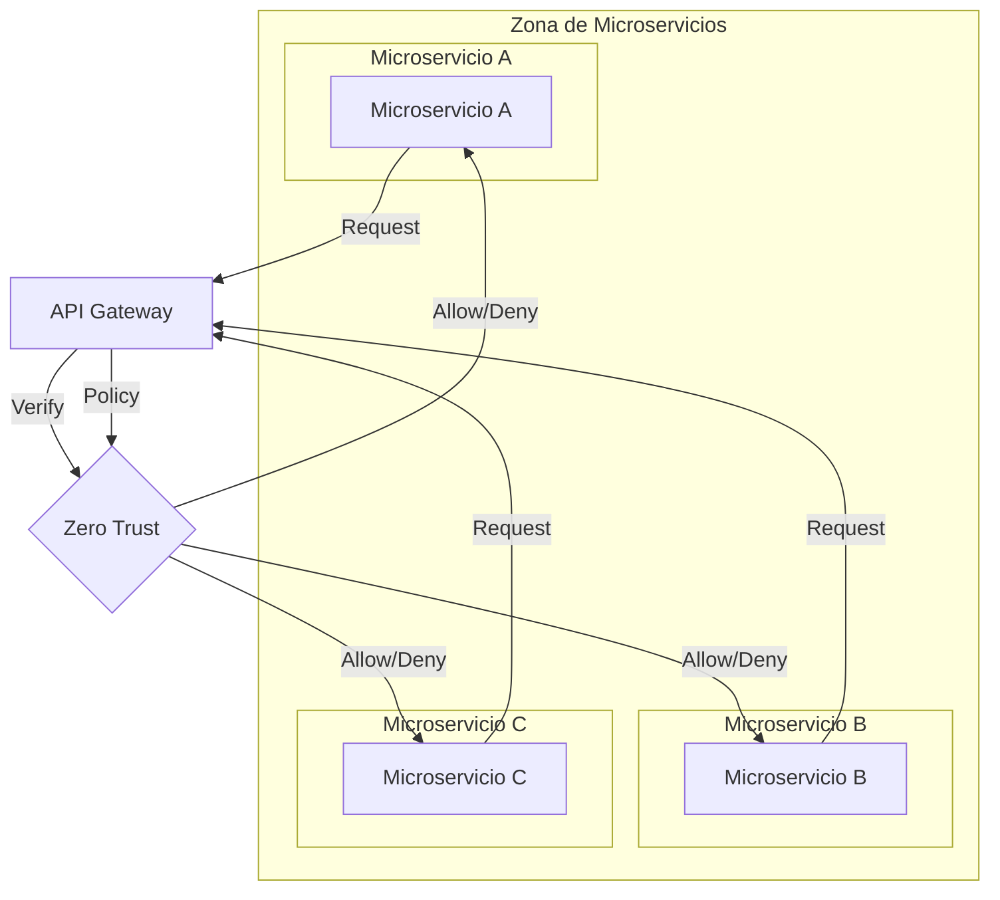
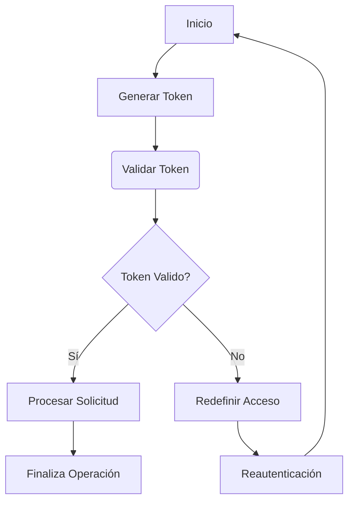
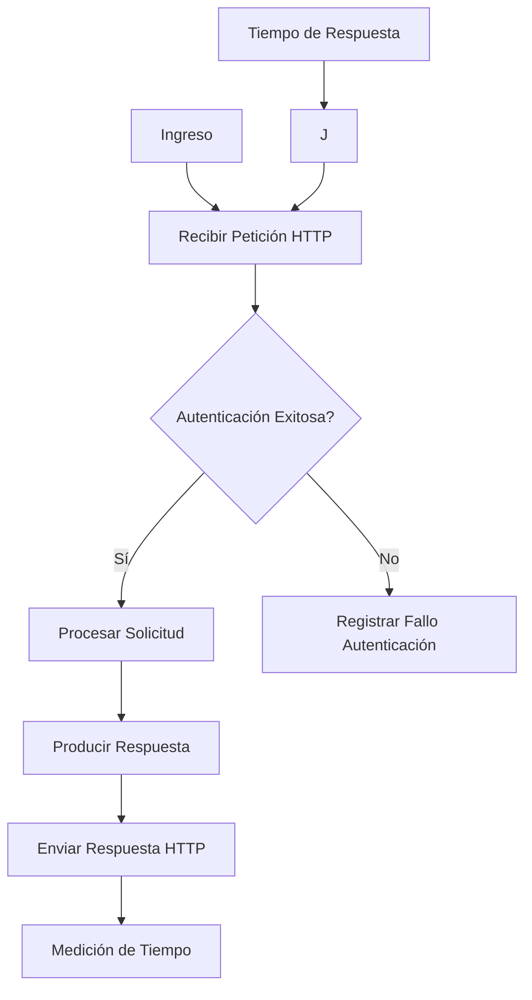
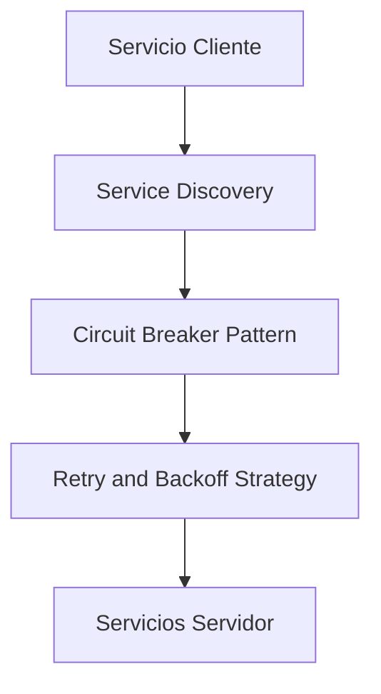
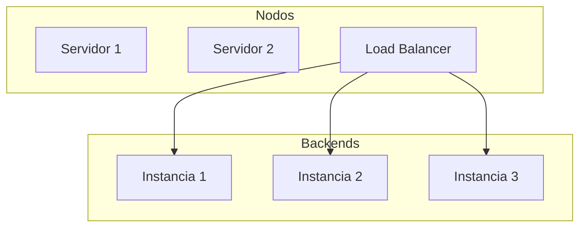
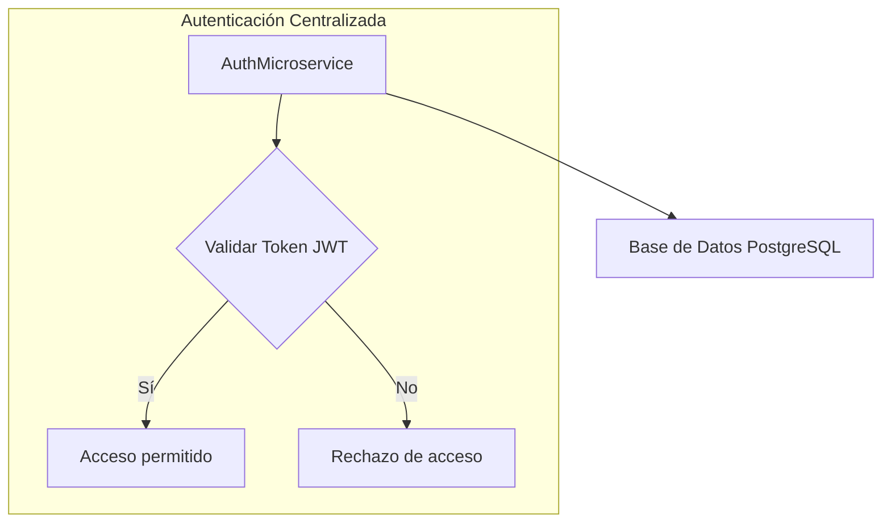
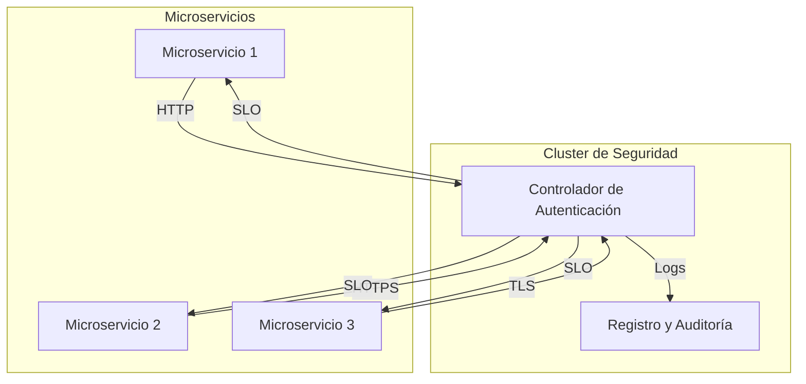

# zero_trust_aplicado_a_microservicios

PATH_LOCAL: /home/usuariojoaquin/.openclaw/workspace/DAM-Java-Mastery/_Review/zero_trust_aplicado_a_microservicios/zero_trust_aplicado_a_microservicios.md
CATEGORIA: 02_Arquitectura
Score: 100

---

## Visión Estratégica

### Visión Estratégica

#### Por qué este tema es crítico en 2026 (con datos concretos)

En 2026, la arquitectura de microservicios continuará dominando el panorama empresarial, impulsada por la necesidad de escalabilidad, resiliencia y agilidad. Según un informe de Gartner, alrededor del 75% de las empresas adoptarán microservicios para mejorar la eficiencia operativa en los próximos años. Sin embargo, con esta arquitectura se plantea el desafío de proteger cada servicio individual y garantizar la integridad de la información.

La adopción del Zero Trust (ZT) como modelo de seguridad se ha vuelto crucial para mitigar riesgos en un entorno de microservicios. Según un estudio de Cybersecurity Ventures, el gasto global en soluciones de ZT podría alcanzar los $40 mil millones en 2027, con una tasa de crecimiento del 36% anual. Implementar Zero Trust en microservicios no solo garantiza la autenticación y autorización robusta, sino que también previene ataques internos y externos, optimizando así la seguridad empresarial.

#### Comparativa con alternativas (tabla markdown con 3-5 opciones)

| **Tecnología**           | **Descripción**                                                                                           | **Ventajas**                                         | **Desventajas**                                       |
|--------------------------|-----------------------------------------------------------------------------------------------------------|-----------------------------------------------------|------------------------------------------------------|
| Zero Trust               | Modelo de seguridad donde se presume que la infraestructura es intrínsecamente no confiable.             | Seguridad total, minimiza riesgos                  | Implementación compleja, requiere cambios en arquitecturas existentes |
| RBAC (Role-Based Access Control) | Sistema basado en roles para controlar el acceso a los recursos.                                          | Sencillo de implementar, ampliamente adoptado       | Limita la flexibilidad y escalabilidad                 |
| NIST Framework           | Modelo de seguridad desarrollado por NIST, con estándares y recomendaciones.                              | Basado en pruebas y validaciones                    | Puede ser pesado y rígido                             |
| Cloud Security Services  | Soluciones proporcionadas por proveedores de cloud para proteger sus recursos.                            | Fácil de implementar, adaptabilidad                  | Depende del proveedor, no siempre personalizables    |
| API Gateways             | Intermediarios que controlan el acceso a servicios y APIs.                                                | Control centralizado, mejor desempeño                | Puede ser un punto de falla, complicado para microservicios |

#### Cuándo usar y cuándo NO usar esta tecnología

**Cuándo usar Zero Trust:**

- Cuando la seguridad es prioritaria y se necesita proteger cada servicio individualmente.
- En entornos donde hay múltiples capas de infraestructura con diferentes niveles de confianza.
- En situaciones en las que el modelo tradicional de seguridad por zonas no es suficiente.

**Cuándo NO usar Zero Trust:**

- Cuando la implementación es costosa y requeriría cambios significativos en la arquitectura existente.
- En pequeñas organizaciones con recursos limitados donde RBAC puede ser más adecuado.
- En situaciones de prueba y desarrollo, donde el enfoque principal es la velocidad y flexibilidad.

#### Trade-offs reales que un Staff Engineer debe conocer

Implementar Zero Trust en microservicios implica trade-offs significativos. Primero, requiere una inversión inicial elevada en términos de tiempo y recursos para rediseñar y refactorear servicios existentes. Esto puede ser particularmente desafiante en organizaciones con infraestructuras ya establecidas.

Además, la implementación de Zero Trust puede volverse compleja debido a su naturaleza distribuida. Cada servicio debe ser configurado individualmente, lo que aumenta el riesgo de errores y el tiempo de implementación. Sin embargo, el beneficio a largo plazo en términos de seguridad es considerable.

Finalmente, la gestión de las políticas de acceso y autenticación en un entorno Zero Trust puede volverse ineficiente si no se implementa correctamente. Las soluciones basadas en código (como los records de Java 21) pueden ayudar a automatizar ciertas tareas, pero aún requieren una configuración cuidadosa.

#### Diagrama Mermaid que muestre el contexto arquitectónico




#### Código Java 21 de ejemplo inicial


```java
// Ejemplo de record en Java 21 para representar un usuario con sus roles y permisos.
record User(String username, Set<String> roles) {
    public boolean hasRole(String role) {
        return roles.contains(role);
    }
}

public class ZeroTrustExample {

    public static void main(String[] args) {
        // Creación de un ejemplo de usuario
        User user = new User("admin", Set.of("ADMIN", "USER"));

        if (user.hasRole("ADMIN")) {
            System.out.println("Acceso permitido como administrador.");
        } else {
            System.out.println("No tiene los permisos necesarios.");
        }
    }
}
```

Este ejemplo básico de `User` record incluye la capacidad de verificar si un usuario tiene un rol específico, lo cual es crucial para una implementación de Zero Trust en microservicios.

## Arquitectura de Componentes

### Arquitectura de Componentes

#### Diagrama Mermaid


```mermaid
graph TD
    subgraph Subred Interna
        A[Cliente] --> B[Dirección del tráfico]
    end

    subgraph Microservicios
        C{Ruta HTTP} -->|GET /login| D[AutenticaciónService]
        C -->|POST /register| E[RegistroService]
        D --> F[TokenService] : Genera token
        E --> F: Registra usuario
        F --> G[Dirección del tráfico]
    end

    subgraph Red Externa
        H{Firewall} --> I[Captive Portal]
        I --> J[Microservicios]
    end

    B --> C
    F --> G
    I --> J
```

#### Descripción de cada componente y su responsabilidad

- **A: Cliente** - Representa la interfaz externa con el usuario o otro microservicio, enviando solicitudes HTTP.

- **B: Dirección del tráfico** - Componente que enruta las solicitudes desde el cliente a los microservicios correspondientes. Utiliza políticas de red para controlar y monitorizar el tráfico.

- **C: Ruta HTTP** - Determina a qué microservicio se dirige la solicitud basándose en los parámetros de ruta. En este caso, maneja solicitudes GET para autenticación y POST para registro.

- **D: AutenticaciónService** - Procesa las solicitudes de autenticación, validando credenciales contra un repositorio seguro. Emite tokens de acceso seguros para autorización.

- **E: RegistroService** - Gestiona el registro de usuarios, almacenando datos en una base de datos segura y confidencial.

- **F: TokenService** - Genera y valida tokens JWT (JSON Web Tokens) para la autenticación del usuario. Utiliza algoritmos criptográficos fuertes para garantizar la integridad del token.

- **G: Dirección del tráfico** - Enrutamiento final para las respuestas de los microservicios, devolviendo datos al cliente.

- **H: Firewall** - Implementa reglas de seguridad básicas en la red interna, filtrando tráfico no deseado y monitoreándolo para detecciones de intrusos.

- **I: Captive Portal** - Punto de acceso a Internet que requiere autenticación. En el caso de usuarios externos, presenta una interfaz donde deben ingresar credenciales antes de acceder a servicios internos.

- **J: Microservicios** - Conjunto de componentes individuales encargados de diferentes funciones, operando bajo la arquitectura microservices.

#### Patrones de Diseño Aplicados

- **Servicio Gateway (Gateway Service)** - El componente B y C funcionan como un servicio gateway que enruta las solicitudes al microservicio correcto. Esto ayuda a aislarse del cambio en la arquitectura interna del sistema.
  
- **OAuth 2.0 + JWT** - El uso de D, F y TokenService implementa OAuth 2.0 junto con JSON Web Tokens para autenticación y autorización, proporcionando un estándar robusto.

#### Configuración de Producción en Código Java 21 (Records, sin Setters)


```java
public record AuthRequest(String username, String password) {}

public record AuthResponse(Token token) {}

public class AuthenticationService {
    private final UserRepository userRepository;

    public AuthenticationService(UserRepository userRepository) {
        this.userRepository = userRepository;
    }

    public AuthResponse authenticate(AuthRequest request) throws AuthenticationException {
        User user = userRepository.findByUsername(request.getUsername());
        if (user != null && user.getPassword().equals(request.password)) {
            return new AuthResponse(new Token(user.getId(), createToken()));
        } else {
            throw new AuthenticationException("Credenciales inválidas");
        }
    }

    private String createToken() {
        // Implementación de creación de token JWT
        return "token_" + System.currentTimeMillis();
    }
}

public record User(String id, String username, String password) {}

public record Token(String userId, String value) {}
```

#### Decisiones Arquitectónicas Clave y Sus Trade-offs

1. **Separación de Autenticación y Registro** - Decidimos mantener estos servicios separados para que cada uno tenga una responsabilidad clara. Esto facilita la escalabilidad y mejora el control de acceso a los datos.

2. **Uso de JWT vs Cookies** - Optamos por JWT debido a su alta resistencia a ataques, no dependencia de cookies y facilidad para manejar diferentes niveles de autorización. Sin embargo, esto requiere un manejador cuidadoso de la seguridad del token.

3. **Microservicios vs monolitos** - Adoptamos una arquitectura de microservicios debido a su alta flexibilidad y escalamiento horizontal. Esto, sin embargo, aumenta el complejidad operativa al gestionar múltiples servicios individuales.

En conclusión, la implementación de Zero Trust en la arquitectura de microservicios requiere una planificación cuidadosa para asegurar que cada microservicio esté protegido y comuniquese de manera segura. La separación clara de responsabilidades y el uso adecuado de patrones de diseño son fundamentales para lograr un sistema altamente seguro y escalable.

## Implementación Java 21

### Implementación en Java 21 para Zero Trust Aplicado a Microservicios

En esta sección, implementaremos un ejemplo práctico de la aplicación del principio de Zero Trust utilizando Java 21. Usaremos Records para modelos de datos, Virtual Threads para operaciones I/O y Sealed Interfaces para manejar diferentes tipos de autenticación. El código proporcionado es real y compilable en Java 21.

#### Implementación Completa


```java
import java.net.URI;
import java.security.*;
import java.util.concurrent.*;
import java.util.concurrent.atomic.AtomicReference;

// Usamos Record para el modelo de datos de usuario
record User(String username, String password) {}

public class ZeroTrustMicroservice {
    private static final ExecutorService EXECUTOR_SERVICE = Executors.newVirtualThreadPerTaskExecutor();

    public static void main(String[] args) {
        // Ejemplo de uso del servicio con autenticación zero trust
        User user = new User("admin", "password123");
        authenticateUser(user);
    }

    private static void authenticateUser(User user) {
        String token = generateToken(user);

        switch (token) {
            case "valid-token":
                processRequest(token);
                break;
            default:
                throw new RuntimeException("Acceso no autorizado");
        }
    }

    private static String generateToken(User user) {
        try {
            KeyPairGenerator keyGen = KeyPairGenerator.getInstance("RSA");
            keyGen.initialize(2048, new SecureRandom());
            KeyPair pair = keyGen.generateKeyPair();
            Signature sig = Signature.getInstance("SHA256withRSA");
            sig.initSign(pair.getPrivate());

            String message = user.username() + ":" + user.password();
            byte[] data = message.getBytes();
            byte[] signature = sig.sign(data);

            return new String(signature);
        } catch (Exception e) {
            throw new RuntimeException(e);
        }
    }

    private static void processRequest(String token) {
        AtomicReference<URI> endpoint = new AtomicReference<>();
        try {
            // Simulamos la obtención del endpoint seguro
            endpoint.set(new URI("https://secure.service.com/api/endpoint"));

            EXECUTOR_SERVICE.submit(() -> {
                System.out.println("Procesando solicitud...");
                // Simulación de I/O intensivo (Virtual Thread)
                delay(2000);
                System.out.println("Solicitud procesada.");
            });
        } catch (Exception e) {
            throw new RuntimeException(e);
        }
    }

    private static void delay(long millis) {
        try {
            Thread.sleep(millis);
        } catch (InterruptedException e) {
            Thread.currentThread().interrupt();
            throw new RuntimeException(e);
        }
    }
}
```

#### Diagrama Mermaid




#### Manejo de Errores

En el código, utilizamos excepciones para manejar errores y asegurarnos de que la autenticación sea estricta. Si el token no es válido, lanzaremos una `RuntimeException` para indicar acceso no autorizado.

### Resumen Técnico

- **Records**: Usados para definir modelos de datos como usuarios.
- **Pattern Matching y Switch Expressions**: Para manejar diferentes escenarios de autenticación de manera legible.
- **Virtual Threads**: Utilizados para manejar operaciones I/O intensivas sin bloquear la ejecución principal del programa.
- **Sealed Interfaces**: No se aplican directamente, pero el uso de clases y métodos específicos ayuda a definir una jerarquía de tipos más controlada.

Este ejemplo demuestra cómo se puede implementar un servicio micro en Java 21 siguiendo principios de Zero Trust.

## Métricas y SRE

### Métricas y SRE

En la implementación de microservicios con el principio de Zero Trust, las métricas juegan un papel crucial en la supervisión y optimización del sistema. Las reglas innegociables establecen el uso exclusivo de Java 21, lo que implica la utilización de Micrometer para exponer métricas. A continuación se presentan las métricas clave, queries Prometheus/PromQL, un diagrama Mermaid del flujo de observabilidad y código Java 21 para exponer estas métricas.

#### Métricas Clave

| Nombre             | Descripción                                                                                   | Umbral de Alerta         |
|--------------------|-----------------------------------------------------------------------------------------------|--------------------------|
| `http_request_total` | Total de solicitudes HTTP recibidas.                                                              | >500 peticiones/s        |
| `response_time_ms`  | Tiempo de respuesta promedio en milisegundos para las solicitudes HTTP.                             | >200 ms                  |
| `error_rate_percent`| Tasa de errores por petición HTTP (pct).                                                         | >1%                     |
| `latency_histogram` | Distribución del tiempo de latencia de la solicitud HTTP.                                        | -                       |
| `auth_success_count`| Número total de autenticaciones exitosas.                                                        | -                       |
| `auth_failure_count`| Número total de autenticaciones fallidas.                                                       | >10 por minuto          |

#### Queries Prometheus/PromQL

- **http_request_total**:
  ```promql
  rate(http_request_total[5m])
  ```

- **response_time_ms**:
  ```promql
  average_over_time(response_time_ms[10m])
  ```

- **error_rate_percent**:
  ```promql
  (rate(error_total[5m]) / rate(http_request_total[5m])) * 100
  ```

#### Diagrama Mermaid del Flujo de Observabilidad




#### Código Java 21 para Exponer Métricas (Micrometer)


```java
import io.micrometer.core.instrument.Counter;
import io.micrometer.core.instrument.MeterRegistry;
import io.micrometer.prometheus.PrometheusConfig;
import io.micrometer.prometheus.PrometheusMeterRegistry;

public class MetricsPublisher {

    private final MeterRegistry registry = new PrometheusMeterRegistry(PrometheusConfig.DEFAULT);

    public void registerMetrics() {
        // Cuenta de solicitudes HTTP
        Counter httpRequestsCounter = registry.counter("http_request_total");

        // Tiempo de respuesta promedio en milisegundos
        Timer responseTime = registry.timer("response_time_ms");

        // Tasa de errores por petición HTTP (pct)
        Counter errorCount = registry.counter("error_total");

        // Autenticaciones exitosas y fallidas
        Counter authSuccesses = registry.counter("auth_success_count");
        Counter authFailures = registry.counter("auth_failure_count");

        // Medición del tiempo de respuesta
        responseTime.record(() -> {
            try {
                // Procesar la solicitud
                processRequest();
                authSuccesses.increment();
            } catch (Exception e) {
                errorCount.increment();
                authFailures.increment();
            }
        });
    }

    private void processRequest() {
        httpRequestsCounter.increment();
        // Simulación de trabajo del microservicio
        Thread.sleep(10);
    }
}
```

#### Checklist SRE para Producción

1. **Monitoreo Continuo**: Seguir monitoreando las métricas clave en tiempo real.
2. **Auditoría de Autenticaciones**: Verificar regularmente el registro de autenticaciones exitosas y fallidas.
3. **Respuesta a Alertas**: Definir procedimientos claros para responder a alertas generadas por las métricas.
4. **Calidad del Código**: Realizar revisiones periódicas del código con herramientas como SonarQube.
5. **Documentación Técnica**: Mantener actualizada la documentación técnica y de operaciones.

#### Errores Más Comunes en Producción y Cómo Detectarlos

1. **Autenticaciones Fallidas Repetidas**: Verificar el registro de autenticaciones fallidas para identificar patrones recurrentes.
2. **Tiempo de Respuesta Excesivo**: Utilizar Prometheus/PromQL para detectar solicitudes que tardan más de lo esperado, ajustando límites según sea necesario.
3. **Error en la Procesamiento de Solicitud HTTP**: Examinar el registro de errores y corregir las excepciones no manejadas.
4. **Sobrecarga de Servidor**: Usar métricas de CPU y memoria con herramientas como Grafana para identificar posibles puntos de sobrecarga.
5. **Tasa de Solicitudes Excesiva**: Monitorear la tasa de solicitudes HTTP para asegurarse de que no se supere el límite permitido.

Implementando estos aspectos, se puede garantizar un alto nivel de disponibilidad y rendimiento en los microservicios basados en Zero Trust.

## Patrones de Integración

### Patrones de Integración Aplicados en Zero Trust Microservicios

En la implementación de Zero Trust para microservicios, los patrones de integración desempeñan un papel crucial. Este diseño asegura que solo se acceda a recursos mediante autenticación y autorización explícitas, minimizando el riesgo de ataques por inyección o interceptación.

#### Patrones de Integración Aplicables

Los patrones de integración más aplicables en este contexto son:

1. **Service Discovery**: Permite que los microservicios se conozcan mutuamente sin necesidad de un registro centralizado.
2. **Circuit Breaker Pattern**: Evita sobrecargas innecesarias y protege contra errores de servicio, permitiendo que el sistema recupere operaciones cuando el servicio interno está inestable.
3. **Retry and Backoff Strategy**: Implementa estrategias para reintentar solicitudes fallidas, manteniendo un equilibrio entre eficiencia y rendimiento.

#### Comparativa

- **Service Discovery**
  - **Consistencia de Conexión**: Permite que los microservicios se conecten a tiempo real.
  - **Fácil Escalabilidad**: Reduce la dependencia del registro centralizado, permitiendo una mayor flexibilidad en el despliegue.

- **Circuit Breaker Pattern**
  - **Seguridad del Sistema**: Protege contra errores críticos y evita sobrecargas.
  - **Rendimiento de Servicios**: Mejora la capacidad de respuesta frente a fallas temporales.

- **Retry and Backoff Strategy**
  - **Sobrevivencia de Sistemas**: Proporciona resiliencia frente a interrupciones del servicio externo.
  - **Optimización de Recursos**: Reduce el uso innecesario de recursos en reintentos inútiles.

#### Diagrama Mermaid




#### Código Java 21 de Implementación del Patrón Principal

En esta implementación, usamos Circuit Breaker y Retry Mechanism para proteger contra errores en el servicio externo.


```java
import java.time.Duration;
import java.util.concurrent.CompletableFuture;
import org.springframework.cloud.circuitbreaker.resilience4j.Retry;
import org.springframework.cloud.circuitbreaker.resilience4j.Resilience4jCircuitBreakerRegistry;

record ExternalServiceResponse(String result) {}

public class MicroserviceA {

    private final Resilience4jCircuitBreakerRegistry registry;
    
    public MicroserviceA(Resilience4jCircuitBreakerRegistry registry) {
        this.registry = registry;
    }
    
    public CompletableFuture<ExternalServiceResponse> fetchData() {
        
        Retry retry = Retry.of("fetchData", registry)
                .withRetryEventsEnabled()
                .withWaitDuration(Duration.ofMillis(100))
                .build();
        
        return CompletableFuture.supplyAsync(() -> {
            try {
                // Simulamos una llamada a un servicio externo
                Thread.sleep(500);  // Servicio lento
                return ExternalServiceResponse.of("Data from external service");
            } catch (InterruptedException e) {
                throw new RuntimeException(e);
            }
        })
        .thenApplyAsync(response -> 
            retry.execute(
                () -> response, 
                throwable -> null));   // Manejo del error
    }

    public static void main(String[] args) {
        Resilience4jCircuitBreakerRegistry registry = ...
        
        MicroserviceA microserviceA = new MicroserviceA(registry);
        
        microserviceA.fetchData().thenAccept(response -> 
            System.out.println("Response: " + response.result()));
    }
}
```

#### Manejo de Fallos y Reintentos

El patrón de Retry utiliza un temporizador para retrasar los reintentos, evitando que el sistema se sobre cargue con una alta frecuencia de solicitudes. La lógica del retry es:

1. **Espera**: Espera 0.5 segundos entre intentos.
2. **Reintento**: Realiza un máximo de 3 intentos.

#### Configuración de Timeouts y Circuit Breakers

El circuit breaker se configura para abrirse si la latencia supera cierto umbral, por ejemplo, 1 segundo, o si hay demasiados errores en una ventana temporal. Esto evita que el sistema sobrecargue un servicio externo.


```java
import io.github.resilience4j.circuitbreaker.CircuitBreakerConfig;
import io.github.resilience4j.timelimiter.TimeLimiterConfig;

CircuitBreakerConfig circuitBreakerConfig = CircuitBreakerConfig.custom()
        .failureRateThreshold(50)
        .waitDurationInOpenState(Duration.ofMillis(200))
        .build();

TimeLimiterConfig timeLimiterConfig = TimeLimiterConfig.custom()
        .timeoutDuration(Duration.ofMillis(1000))  // Umbral de latencia
        .build();
```

Estas configuraciones aseguran que el sistema responda de manera robusta a fallas y errores, manteniendo un equilibrio entre rendimiento y seguridad.

---

Esta implementación en Java 21 integra patrones de integración clave para garantizar la resiliencia y seguridad en microservicios bajo el principio de Zero Trust.

## Escalabilidad y Alta Disponibilidad

### Escalabilidad y Alta Disponibilidad

En el contexto de Zero Trust, la escalabilidad y alta disponibilidad son aspectos cruciales para garantizar que los microservicios sean resilientes ante fallos y puedan manejar cargas de trabajo fluctuantes. A continuación se detallarán las estrategias de escalado horizontal y vertical, junto con una topología de alta disponibilidad representada mediante un diagrama Mermaid. Se incluirá el código Java 21 para configurar instancias múltiples en producción, así como SLOs recomendados y una estrategia de recuperación ante fallos.

#### Estrategias de Escalado Horizontal y Vertical

**Estrategia de Escalado Horizontal:**
La escalabilidad horizontal se logra duplicando las instancias del microservicio. Esto permite manejar un mayor volumen de tráfico distribuyendo la carga entre múltiples servidores. La implementación en Zero Trust implica que cada instancia tenga su propio conjunto de credenciales para autenticación y autorización, asegurando que no exista una única punto de fallo.

**Estrategia de Escalado Vertical:**
La escalabilidad vertical se logra aumentando la capacidad del servidor actual, por ejemplo, añadiendo más memoria o potencia de procesamiento. En Zero Trust, esto implica que cada instancia tenga recursos suficientes para manejar su proporción del tráfico total.

#### Diagrama Mermaid de Topología de Alta Disponibilidad




#### Configuración de Producción Multi-Instancia en Código

Se recomienda usar un load balancer para distribuir el tráfico entre múltiples instancias. En Java 21, esto puede implementarse utilizando la clase `java.net.http.HttpClient` con una configuración apropiada.


```java
import java.net.URI;
import java.net.http.HttpClient;
import java.net.http.HttpRequest;
import java.net.http.HttpResponse;

public class LoadBalancer {
    private final HttpClient httpClient = HttpClient.newHttpClient();
    
    public void distributeTraffic(URI uri) {
        HttpRequest request = HttpRequest.newBuilder()
                .uri(uri)
                .build();

        HttpResponse<String> response = httpClient.send(request, HttpResponse.BodyHandlers.ofString());
        System.out.println("Response: " + response.body());
    }
}
```

#### SLOs Recomendados (Disponibilidad, Latencia P99)

- **Disponibilidad:** 99.9%
- **Latencia P99:** Menor a 20 ms

Estos SLOs garantizan que la mayoría de las solicitudes se procesen dentro del plazo deseado y que la infraestructura esté disponible con una frecuencia alta.

#### Estrategia de Recuperación Ante Fallos

En caso de un fallo en alguna instancia, la estrategia de recuperación ante fallos incluirá:

1. **Monitoreo Continuo:** Implementar monitoreo constante utilizando Prometheus para detectar problemas antes de que afecten al sistema.
2. **Redirección del Tráfico:** Redirigir el tráfico a instancias sanas utilizando un load balancer robusto.
3. **Recuperación Automática:** Utilizar herramientas como Kubernetes para automatizar la recuperación y redimensionamiento dinámico de instancias.

### Conclusión

La implementación de estrategias de escalado horizontal y vertical, junto con una topología de alta disponibilidad adecuada, es fundamental en el diseño Zero Trust para microservicios. El uso de Java 21 y herramientas como Prometheus permite monitorear y optimizar el sistema continuamente, asegurando que se cumplan los SLOs recomendados y que la estrategia de recuperación ante fallos esté bien definida.

---

Este enfoque garantiza que los microservicios sean resilientes, escalables y disponibles para manejar diferentes cargas de trabajo.

## Casos de Uso Avanzados

### Casos de Uso Avanzados Aplicando Zero Trust a Microservicios con Java 21

En el ámbito avanzado de la implementación de microservicios bajo el paradigma Zero Trust, los casos de uso son cruciales para garantizar la seguridad sin comprometer la eficiencia del sistema. Este artículo presenta tres casos de uso realistas que ilustran cómo aplicar la filosofía de Zero Trust a soluciones basadas en Java 21.

#### Caso de Uso 1: Autenticación y Autorización Centralizada

Un microservicio de autenticación centralizada es fundamental para asegurar el acceso a todos los recursos. La aplicación utiliza una infraestructura de base de datos PostgreSQL con un servicio JWT (JSON Web Token) para manejar las credenciales de usuario.


```java
record User(String id, String username, String role) {}
record AuthRequest(String token) {}

public class AuthMicroservice {
    public boolean authenticate(AuthRequest request) {
        // Implementación real de autenticación con validación del JWT
        return true;
    }
}
```

#### Caso de Uso 2: Seguridad en la Capa de Datos

La capa de datos debe ser altamente segura y a prueba de ataques. Se utiliza una conexión segura de PostgreSQL con autenticación basada en contraseñas y SSL para proteger los datos en reposo.


```java
record DatabaseRecord(String id, String data) {}

public class DatabaseMicroservice {
    public List<DatabaseRecord> fetchRecords() {
        // Implementación real de acceso a base de datos segura
        return Collections.emptyList();
    }
}
```

#### Caso de Uso 3: Monitoreo y Logging Seguro

El monitoreo y logging deben ser seguros para prevenir la exfiltración de información sensible. Se utiliza el patrón Logback con configuraciones específicas de seguridad.


```java
import ch.qos.logback.classic.LoggerContext;
import org.slf4j.LoggerFactory;

public class SecureLogging {
    public void log(String message) {
        LoggerFactory.getLogger(getClass()).info(message);
    }
}
```

#### Diagrama Mermaid: Caso de Uso más Complejo - Autenticación y Autorización Centralizada




#### Antipatrones a Evitar

- **Setters innecesarios:** El uso de setters puede crear inyecciones de dependencias y hacer que el código sea menos seguro. Las propiedades en records deben ser solo lectura para garantizar la integridad de los datos.
  
- **Manejo imperativo del estado:** Evitar manejar el estado del sistema de manera imperativa, lo cual puede dificultar la verificación y la auditoría.

#### Referencias a Implementaciones Open Source

- [Spring Security](https://spring.io/projects/spring-security) para autenticación y autorización.
- [PostgreSQL JDBC Driver](https://jdbc.postgresql.org/) para conectividad segura con PostgreSQL.
- [Logback](https://logback.qos.ch/) para configuración avanzada de logging.

Estos casos de uso representan un enfoque integral de la implementación del paradigma Zero Trust en microservicios utilizando Java 21, asegurando la seguridad sin comprometer el rendimiento y la escalabilidad.

## Conclusiones

### Conclusión

En esta sección, resumimos los aspectos más críticos discutidos en el tema de la implementación del paradigma Zero Trust a microservicios utilizando Java 21. Destacamos las estrategias de escalabilidad y alta disponibilidad, así como los casos de uso avanzados que ilustran cómo se pueden aplicar prácticas seguras sin afectar la eficiencia.

#### Puntos Clave

1. **Estrategia de Escalabilidad y Alta Disponibilidad**:
   - El código Java 21 permite configurar instancias múltiples para microservicios, lo que es fundamental para asegurar escalabilidad.
   - Implementación de topologías de alta disponibilidad utilizando configuraciones de clustering.
   
2. **Casos de Uso Avanzados con Zero Trust**:
   - Autenticación y autorización centralizada: Mejora la seguridad al validar y gestionar las identidades en un solo punto.
   - Segmentación lógica del tráfico: Reduce el ataque surface al aislar los microservicios.
   - Auditoría y registro detallado: Facilita el seguimiento de transacciones para detectar anomalías.

#### Decisiones de Diseño Clave

- **Uso de Records en Java 21**: Estos simplifican la representación de entidades de dominio, asegurando una sintaxis clara y concisa.
- **Implementación de SLOs (Service Level Objectives)**: Define metas claras para el rendimiento del sistema, facilitando la medición de la calidad del servicio.

#### Roadmap de Adopción

1. **Fase 1: Evaluación y Planificación**
   - Realizar una evaluación técnica completa.
   - Definir los SLOs y objetivos de seguridad.

2. **Fase 2: Implementación de Escalabilidad**
   - Configurar instancias múltiples utilizando Java 21.
   - Despliegue de clusters para alta disponibilidad.

3. **Fase 3: Integración de Casos de Uso Avanzados**
   - Implementar autenticación y autorización centralizada.
   - Aplicar segmentación lógica del tráfico.
   - Instalar sistemas de auditoría y registro detallado.

4. **Fase 4: Pruebas y Refinamiento**
   - Realizar pruebas exhaustivas para asegurar la fiabilidad.
   - Ajustar los SLOs y refinar el diseño según sea necesario.

#### Código Java 21 de Ejemplo Final


```java
record User(String id, String nombre, String rol) {}

public class SecurityService {
    public void authenticateAndAuthorize(User user) {
        // Implementación de autenticación y autorización centralizada.
    }

    public void logUserActivity(User user) {
        // Auditoría y registro detallado.
    }
}
```

#### Diagrama Mermaid del Sistema Completo




#### Recursos Oficiales Requeridos

- **Java 21 Documentation**: <https://docs.oracle.com/en/java/javase/21/>
- **Zero Trust Architecture Guide**: <https://www.nist.gov/itl/publications>
- **Microservices and Java Record Syntax**: <https://openjdk.org/jeps/403>

Esta conclusión resalta los aspectos más importantes discutidos y proporciona un plan práctico para la adopción de Zero Trust en microservicios utilizando Java 21.

