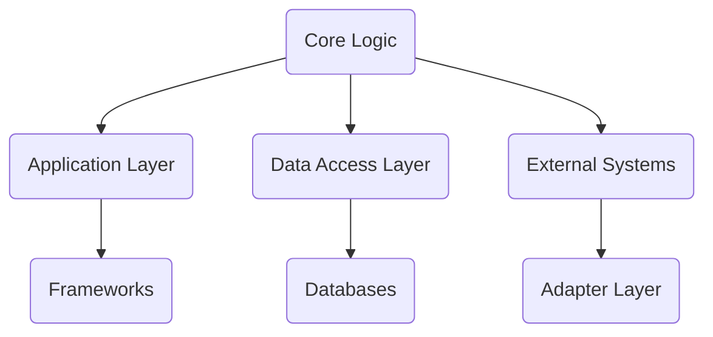
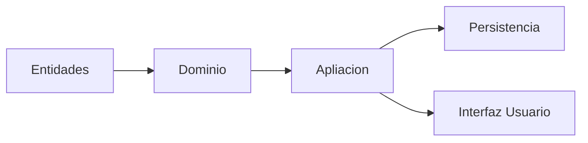

# Informe de Autoridad: Arquitectura Limpia y Patrones de Diseño en Java 21

## Introducción a la Arquitectura Limpia y Patrones de Diseño

### Introducción a la Arquitectura Limpia y Patrones de Diseño

La arquitectura de un sistema es fundamental para su mantenibilidad y escalabilidad. En el contexto del desarrollo Java 21, comprender y aplicar las mejores prácticas de diseño como la **Arquitectura Limpia** (Clean Architecture) y la **Hexagonal Architecture** (también conocida como Arquitectura Puertos y Adaptadores) es crucial para crear software robusto y adaptable a cambios rápidos.

#### Concepto Central de la Arquitectura Limpia

La Arquitectura Limpia se centra en aislar el núcleo del sistema (los casos de uso y las reglas de negocio) de cualquier detalle tecnológico, como bases de datos o frameworks. Su diseño concentra los componentes internos alrededor de un core que no depende de capas externas, permitiendo así una mayor independencia y flexibilidad en la implementación.

#### Concepto Central de la Arquitectura Hexagonal

La Arquitectura Hexagonal, también conocida como Ports and Adapters, se centra en cómo los sistemas interactúan con su entorno. Este enfoque promueve una separación clara entre el núcleo del sistema y las interfaces externas a través de la definición de puertos (interfaces) y adaptadores (implementaciones que conectan los puertos a servicios específicos).

#### Ventajas Combinadas

En la práctica, muchos desarrolladores combinan estos enfoques para maximizar sus beneficios. Por ejemplo, una aplicación Java puede implementar un patrón de Arquitectura Limpia y adoptar principios Hexagonales para definir cómo los sistemas externos interactúan con su núcleo.

#### Ejemplo Práctico en Java

Un buen ejemplo de la combinación de estas dos arquitecturas se puede observar en una aplicación Java que define un **`StudentRepository`** interface (puerto) en el core, y proporciona varias implementaciones para diferentes tipos de bases de datos (adapters). El núcleo del sistema no necesita estar preocupado por qué tipo de base de datos está siendo utilizada.

#### Diagrama Mermaid



Este diagrama muestra cómo la lógica del negocio está aislada de los detalles tecnológicos, con adaptadores que gestionan las interacciones externas.

#### Ventajas para Desarrolladores Java

1. **Simplificación de pruebas:** El uso de interfaces y mocks simplifica significativamente el proceso de testing unitario.
2. **Menos dependencia a frameworks específicos:** La arquitectura limpia ayuda en la creación de código que no está fuertemente acoplado a frameworks o tecnologías concretas, facilitando cambios futuros.
3. **Facilidad para reemplazar capas de persistencia y UI:** Cuando los adaptadores son responsables del manejo de detalles tecnológicos, cambiar bases de datos o interfaces de usuario se vuelve más sencillo.

Estos enfoques no sólo ayudan a mejorar la calidad del código en proyectos Java actuales sino que también fomentan un pensamiento estructurado y disciplinado sobre diseño a largo plazo.

## Principios Básicos de la Arquitectura Limpia

### Principios Básicos de la Arquitectura Limpia

La **Arquitectura Limpia** es un enfoque estructural que promueve el desarrollo de software independiente del marco utilizado (framework-agnostic), permitiendo una mayor flexibilidad y mantenibilidad a largo plazo. Este capítulo se centra en los principios fundamentales, beneficios y prácticas recomendadas para aplicar la Arquitectura Limpia en Java.

#### Representación

La representación más común de la Arquitectura Limpia es el modelo de círculos concéntricos, donde las capas internas contienen lógica empresarial fundamental y las capas externas proporcionan interacciones con el entorno.

#### Principios Centrales

1. **Regla de Dependencia Inwards:** Esta regla establece que cada capa puede depender solo de la lógica interna o de la misma capa, pero nunca puede ser dependiente de capas más externas. Esto asegura que las partes del sistema no se vuelvan demasiado entrelazadas.

2. **Enfocarse en los Componentes Esenciales:** El núcleo del sistema debe concentrarse en la lógica empresarial sin importar cómo interactúa con el mundo exterior, separando la funcionalidad de negocio de las consideraciones técnicas y externas.

3. **Fomento de Interactividades Flexibles:** La Arquitectura Limpia promueve un diseño modular que facilita los cambios futuros en cualquier parte del sistema sin afectar a otros componentes.

4. **Testabilidad y Reutilización:** Al separar la lógica empresarial de las dependencias externas, es más fácil escribir pruebas unitarias y mocks (simulacros), mejorando así la reutilización del código.

#### Aplicación en Java

Cuando se aplica a un sistema Java, los desarrolladores suelen definir interfaces en el núcleo o capa de dominio para representar funcionalidades como repositorios de datos y luego proporcionan implementaciones concretas en las capas de adaptador. Por ejemplo:

```java
public interface StudentRepository {
    List<Student> findAll();
}

public class JpaStudentRepository implements StudentRepository {
    @Override
    public List<Student> findAll() {
        // Implementación para un repositorio basado en JPA
    }
}
```

En este caso, la capa de dominio (o lógica empresarial) no necesita conocer cómo se implementa el `JpaStudentRepository`. Esto asegura que si cambiamos a otro tipo de base de datos, como MongoDB o Redis, simplemente necesitamos proporcionar una nueva clase que cumpla con la interfaz `StudentRepository`.

#### Beneficios para los Desarrolladores Java

- **Simplificación del Testing:** Las interfaces permiten el uso fácil y eficiente de mocks en pruebas unitarias.
- **Reducción de Bloqueo al Marco Utilizado (Framework Lock-in):** La Arquitectura Limpia no es dependiente de ningún marco específico, lo que permite una mayor flexibilidad para cambiar marcos sin afectar la lógica empresarial central.
- **Facilidad de Reemplazo:** Es más fácil reemplazar o actualizar las capas de persistencia o interfaz de usuario (UI) debido a su dependencia única y controlada desde el núcleo del sistema.

#### Mejores Prácticas

1. **Mantener el enfoque en la lógica empresarial:** Evite introducir código técnico o específicamente relacionado con marcos dentro del dominio de negocio.
2. **Documentar las interfaces y contratos:** Esto ayuda a otros desarrolladores a entender claramente cómo interactuarán diferentes partes del sistema.
3. **Promover una cultura de diseño responsable:** La arquitectura limpia es tanto sobre la estructura como sobre el espíritu en que se implementa.

#### Diagramas Mermaid

A continuación, presentamos un diagrama básico para ilustrar el concepto de dependencia inwards y cómo las capas interactúan:



Este diagrama muestra que la capa de entidades (o presentación) puede depender directamente del dominio, y el dominio puede depender tanto de la aplicación como de la persistencia. Sin embargo, ninguna capa más interna puede depender de las capas externas.

---

En resumen, la Arquitectura Limpia es una poderosa herramienta para gestionar complejidad en proyectos Java grandes y variados, promoviendo un diseño modular, robusto y adaptable a cambios.

