# Informe de Autoridad: Seguridad Avanzada en Microservicios 2026

## Introducción a la Seguridad Avanzada en Microservicios

### Introducción a la Seguridad Avanzada en Microservicios

La seguridad de microservicios es un conjunto complejo de prácticas, herramientas y decisiones arquitectónicas diseñadas para proteger individuos microservicios y su comunicación. En este manual, exploraremos cómo estructurar eficazmente las microaplicaciones para minimizar riesgos y maximizar la seguridad en el ecosistema digital actual.

#### 1) Domain-Driven Design (DDD) y Bounded Contexts

**Concepto**: El diseño basado en dominios (Domain-Driven Design, DDD) es un marco de trabajo que enfoca los sistemas en problemas reales. Al organizar microservicios alrededor de modelos de dominio claros, se reducen las uniones innecesarias y cada servicio tiene una responsabilidad bien definida.

**Implicaciones para la Seguridad**: En este contexto, un **Bounded Context** es un límite conceptual que define el ámbito en el que ciertos términos del lenguaje de dominio tienen significado. Al establecer estos contextos claros, se minimizan las interacciones innecesarias entre los microservicios y se facilita la seguridad a nivel de servicio.

**Ejemplo de Código**:

```java
// Ejemplo de definición de un Bounded Context en Java utilizando Spring Cloud (Contexto de Cuentas)
@Configuration
public class AccountsApiConfiguration {
    @Bean
    public RestTemplate restTemplate() {
        return new RestTemplate();
    }
    
    @Bean
    public AccountService accountService(RestTemplate restTemplate) {
        return new AccountService(restTemplate);
    }

    // Definición del servicio de cuentas dentro del contexto acotado.
}
```

#### 2) Diseño de Servicios Granular y Propósito

**Concepto**: Cada microservicio debe ser lo suficientemente granular para manejar una funcionalidad específica, minimizando la interacción innecesaria con otros servicios. Esto no solo facilita la seguridad a nivel individual sino que también mejora la escalabilidad y el mantenimiento del sistema.

**Ejemplo de Código**: 

```java
// Ejemplo de un servicio micro de Java utilizando Spring Cloud para manejar transacciones bancarias.
@Service
public class BankingTransactionService {
    @Autowired
    private TransactionRepository transactionRepository;

    public void createTransaction(Transaction transaction) {
        // Lógica de creación de transacción.
    }

    public List<Transaction> getTransactionsByUserId(String userId) {
        return transactionRepository.findByUserId(userId);
    }
}
```

#### 3) Arquitectura y Diseño del Equipo

**Concepto**: La estructura del equipo es tan importante como la arquitectura de los servicios. Un enfoque recomendado es el **Team Topologies**, donde cada equipo tiene una responsabilidad clara y trabaja de manera ágil.

**Ejemplo Diagrama Mermaid**:

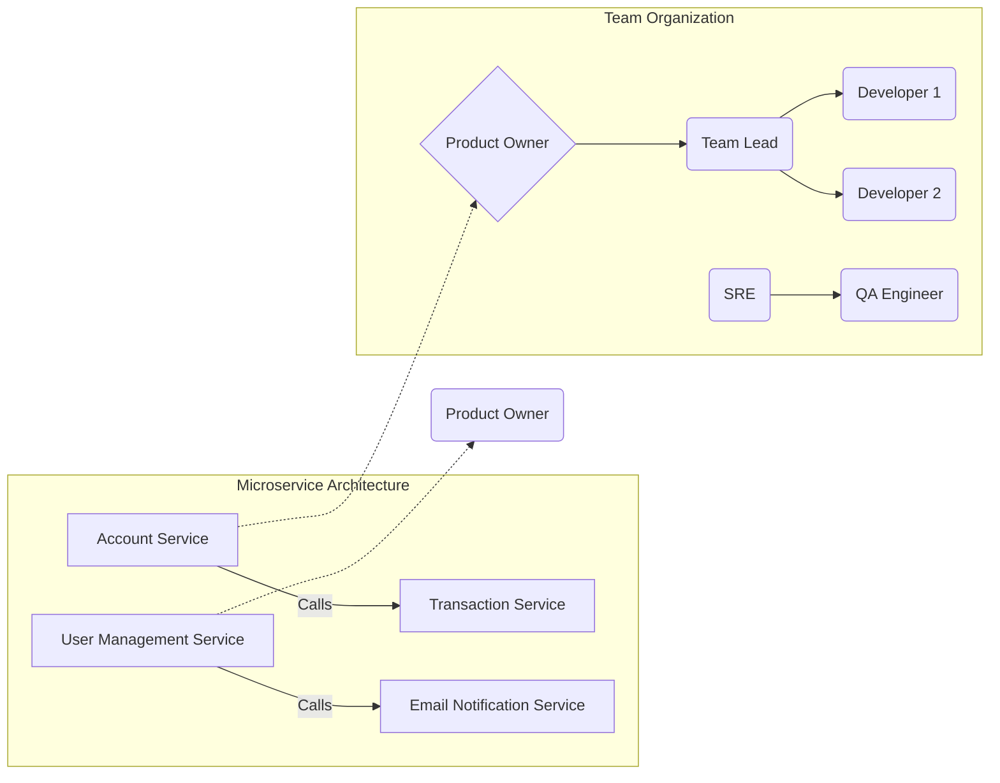

#### 4) Seguridad y Desarrollo de Microservicios

**Concepto**: La seguridad en el desarrollo de microservicios implica la implementación de prácticas como DevSecOps, donde la seguridad se integra desde los primeros estadios del ciclo de vida del software.

**Principios Clave**: 

- **API Gateway Protection**: Utilizar un gateway para controlar y auditar el acceso a los microservicios.
- **Secure Coding Practices**: Adoptar prácticas de codificación segura para minimizar vulnerabilidades desde la raíz.
- **Supply Chain Security**: Proteger la cadena de suministro del software contra amenazas como inyecciones de código malicioso durante el proceso de entrega continua.

**Ejemplo de Código con API Gateway en Java (Spring Cloud)**:

```java
@Configuration
@EnableZuulProxy
public class ZuulConfig {
    @Bean
    public RouteLocator customRouteLocator(RouteLocatorBuilder builder) {
        return builder.routes()
                .route("accountService", r -> r.path("/api/account/**")
                        .uri("http://localhost:8081"))
                .build();
    }
}
```

#### 5) Evaluación Continua y Monitoreo

**Concepto**: La evaluación continua es crucial para la seguridad de los microservicios. Implementar un sistema robusto de monitoreo en tiempo real puede ayudar a detectar amenazas potenciales antes de que puedan causar daño.

**Prácticas Recomendadas**:

- **Continuous Verification**: Utilizar herramientas como OWASP ZAP para verificar continuamente la seguridad de las API.
- **Logging and Monitoring**: Mantener un registro detallado y monitorizar activamente el comportamiento del sistema en busca de actividades sospechosas.

En conclusión, la seguridad avanzada en microservicios es una disciplina que requiere un enfoque integral. Desde la planificación arquitectónica hasta las prácticas de codificación segura y monitoreo continuo, cada elemento juega un papel vital en asegurar el ecosistema digital.

---
Este capítulo proporciona los fundamentos necesarios para implementar una seguridad sólida en microservicios, preparando a los ingenieros de alto nivel (Staff Engineer) para abordar desafíos complejos en este campo.

## El Escenario Cibernético del Futuro (2026)

### El Escenario Cibernético del Futuro (2026)

En 2026, el mundo de la tecnología y las amenazas cibernéticas evolucionará significativamente. Las organizaciones se enfrentarán a nuevos desafíos en la seguridad de microservicios debido al aumento de la complejidad operativa y la diversificación tecnológica. El siguiente segmento del manual 'Seguridad Avanzada en Microservicios 2026' se centra en cómo las tendencias emergentes, los mejores prácticos actuales y las soluciones innovadoras pueden ayudar a proteger microservicios y arquitecturas basadas en ellos.

#### 1) Domain-Driven Design (DDD) y Contextos Acotados

La seguridad de los microservicios comienza con una arquitectura sólida y la planificación cuidadosa del diseño. La adopción de un DDD adecuado es fundamental para organizar los microservicios alrededor de modelos dominio claros, reduciendo el acoplamiento innecesario entre ellos.

**Ejemplo Técnico:**
```java
public interface ServiceRepository {
    void add(Service service);
    Service findById(String id);
}

@Service("UserService")
public class UserService implements ServiceRepository {
    private final UserRepository userRepository;

    public UserService(UserRepository userRepository) {
        this.userRepository = userRepository;
    }

    @Override
    public void add(Service service) {
        if (service instanceof User user) {
            userRepository.save(user);
        }
    }

    @Override
    public Service findById(String id) {
        return userRepository.findById(id).orElse(null);
    }
}
```

#### 2) Diseño de Servicios Granular y Propósito

Desarrolla microservicios que sean lo suficientemente pequeños para manejar solo una o dos responsabilidades. Esto facilita la implementación de controles de seguridad precisos a nivel de servicio, minimizando el riesgo inherente.

**Diagrama Mermaid:**
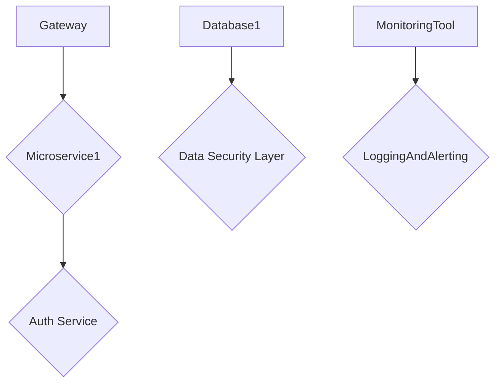

#### 3) Enfoque de Defensa en Capas

El enfoque multi-capas es crucial para la seguridad efectiva. Combina API gateways, DevSecOps, mTLS y monitoreo continuo.

**Ejemplo Técnico:**
```java
public class SecurityLayer {
    private final String apiKey;
    
    public SecurityLayer(String apiKey) { this.apiKey = apiKey; }
    
    @PreAuthorize("hasAuthority('SCOPE_read')")
    public ResponseEntity<?> secureEndpoint(@RequestHeader(value="Authorization") String authorization){
        // Verificar la autenticidad y autorización
        if (isValidApiKey(authorization)) {
            return new ResponseEntity<>(HttpStatus.OK);
        } else {
            throw new UnauthorizedAccessException();
        }
    }

    private boolean isValidApiKey(String apiKey) { /* Lógica para validar el API key */ }
}
```

#### 4) Seguridad de Cadena de Suministro

Con la adopción creciente de tecnologías como Kubernetes y Docker, es fundamental garantizar que las imágenes de contenedor estén libres de riesgos. Utiliza herramientas de seguridad para escáneres de imágenes antes de su implementación.

#### 5) Verificación Continua y Pruebas Automatizadas

Implementa pruebas unitarias y integración continua (CI/CD) para garantizar que la seguridad no se convierta en un obstáculo durante el desarrollo. Las herramientas como SonarQube pueden ser útiles para detectar vulnerabilidades antes de la implementación.

**Diagrama Mermaid:**
```mermaid
graph TD;
    A[Code Commit] --> B{SonarQube Scan}
    B --> C{Build]
    C --> D[Deploy to Test Env]
    D --> E{Manual Testing]
    E --> F{Automated Security Checks]
    F --> G[Release to Prod]
```

#### 6) Monitoreo y Respuesta a Incidentes

Desarrolla una cultura de monitoreo activo y rápida respuesta ante amenazas. Usa herramientas de observabilidad para detectar anomalías, como cambios inesperados en el tráfico o fallas de servicio.

**Ejemplo Técnico:**
```java
@Scheduled(fixedRate = 60000)
public void monitorHealth() {
    List<Service> services = serviceRepository.findAll();
    for (Service service : services) {
        if (!service.isHealthy()) {
            sendAlert(service.getName());
        }
    }
}
```

### Conclusion

El futuro de la seguridad en microservicios es un espacio dinámico donde las organizaciones deben adaptarse constantemente a nuevos desafíos. Al adoptar prácticas sólidas y tecnologías avanzadas, podemos garantizar sistemas más seguros y resilientes para enfrentar los retos emergentes del panorama cibernético.

---

Este segmento proporciona una base sólida para abordar las complejidades de la seguridad en microservicios desde un punto de vista técnico avanzado.

## Fundamentos de Arquitectura Orientada a Dominios y Bounded Contexts

### 1) Fundamentos de Arquitectura Orientada a Dominios y Bounded Contexts

La arquitectura orientada a dominios (DDD, por sus siglas en inglés) es un enfoque que se basa en la idea de organizar los sistemas alrededor del lenguaje del negocio. El concepto de Bounded Context es clave para la implementación exitosa del DDD. Un Bounded Context define el límite dentro del cual una parte específica del modelo de dominio tiene relevancia y coherencia, aislándose de otras partes del sistema que pueden tener modelos de dominio diferentes.

#### 1.1) Definición y Propósito

Un **Bounded Context** en DDD es una definición explícita de un límite conceptual dentro del cual un modelo de dominio particular tiene relevancia y coherencia. En la práctica, este concepto se traduce en microservicios bien definidos que tienen responsabilidades claras y no se superponen entre sí. Cada Bounded Context tiene sus propias reglas de negocio y lógica de dominio sin considerar cómo interactúan con otros contextos.

#### 1.2) Aplicación en Microservicios

La aplicación del DDD a la arquitectura microservicio resulta en servicios que son responsables de una parte específica del modelo de dominio. Esto no solo simplifica el diseño, sino que también facilita la implementación de prácticas seguras y robustas. Cada microservicio tiene un contexto acotado donde puede aplicar reglas de seguridad específicas sin tener en cuenta los problemas de otros servicios.

#### 1.3) Ejemplo Técnico

Para ilustrar cómo funciona el DDD en la práctica, consideremos una aplicación que proporciona funciones básicas para usuarios y productos. Podríamos tener dos microservicios: `UserService` y `ProductService`.

```java
public class UserService {
    public UserDTO getUserById(String userId) {
        // Lógica de obtención del usuario por ID
    }
    
    public List<UserDTO> getUsersByRole(String role) {
        // Lógica para obtener usuarios según rol
    }
}

public class ProductService {
    public ProductDTO getProductById(String productId) {
        // Lógica de obtención del producto por ID
    }

    public List<ProductDTO> getProductsByName(String productName) {
        // Lógica para buscar productos por nombre
    }
}
```

#### 1.4) Diagrama de Bounded Contexts

Usando Mermaid, podemos crear un diagrama que muestra cómo los servicios interactúan dentro del contexto acotado.

```mermaid
graph LR;
    A[UserService] -->|Obtener Usuarios| B[API Gateway];
    C[ProductService] -->|Obtener Productos| D[API Gateway];

    subgraph ContextoAcotadoA
        UserService -- Servicio de Usuario --> API Gateway
    end

    subgraph ContextoAcotadoB
        ProductService -- Servicio de Producto --> API Gateway
    end
    
    B --- E[Backend Services];
    D --- F[Database];
```

### 2) Diseño Detallado y Propósito del Microservicio

Un diseño microservicio detallado no solo tiene un impacto directo en la funcionalidad, sino que también implica consideraciones significativas para la seguridad. Cada servicio debe ser lo suficientemente grande como para tener una responsabilidad definida pero pequeño o granular para minimizar las interacciones internas innecesarias y mantener el mantenimiento simple.

#### 2.1) Granularidad del Diseño

La granularidad en el diseño de microservicios es crucial para evitar problemas de seguridad. Un servicio demasiado grande puede tener un alto nivel de cohesión, lo que hace que sea más difícil implementar controles de acceso y otras medidas de seguridad adecuadas.

#### 2.2) Ejemplo Técnico

Supongamos que tenemos un microservicio `OrderService` responsable del flujo completo del pedido desde la creación hasta el envío. Este servicio podría tener lógica relacionada con la autenticación, la validación de pagos, y las operaciones de inventario.

Sin embargo, esta abstracción podría ser riesgosa si un exploit en una parte del código afecta a todas sus funcionalidades. Dividiendo `OrderService` en servicios más pequeños, como `OrderCreationService`, `PaymentValidationService`, y `InventoryManagementService`, podemos limitar los daños potenciales.

```java
public class OrderCreationService {
    public void createOrder(OrderDTO order) {
        // Lógica para la creación del pedido
    }
}

public class PaymentValidationService {
    public boolean validatePayment(String orderId, String paymentMethod) {
        // Lógica de validación de pago
    }
}
```

### Conclusión

La implementación correcta de DDD y Bounded Contexts en microservicios es crucial para la seguridad del sistema. No solo permite un diseño más claro y manejable, sino que también facilita la aplicación de controles de seguridad específicos a cada servicio, reduciendo así el riesgo general del sistema.

Por último, es importante recordar que la seguridad en microservicios debe ser integral y considerada desde el inicio del desarrollo hasta su implementación continua. Al aplicar principios sólidos como DDD y Bounded Contexts, podemos asegurar que nuestro diseño de microservicios no solo sea eficiente sino también seguro.

## Diseño Granular y Propósito de Servicios: Mejores Prácticas

### Diseño Granular y Propósito de Servicios: Mejores Prácticas

La seguridad avanzada en microservicios depende en gran medida del diseño y la organización de los servicios individuales. Un diseño bien pensado puede no solo mejorar la seguridad, sino también aumentar la eficiencia operativa y facilitar la escalabilidad.

#### 1) Diseño Granular:

El principio básico para un diseño seguro y efectivo es minimizar la superficie de ataque al dividir las funcionalidades del sistema en servicios pequeños y específicos. Esto no solo reduce el riesgo, sino que también simplifica la gestión y actualización individual.

**Ejemplo técnico:**

Supongamos que estamos diseñando un servicio micro para manejar la autenticación y autorización. Este servicio debería tener las siguientes características:

- **Responsabilidad Clara:** Debe gestionar únicamente los procesos de inicio de sesión, registro y verificación del token.
  
- **Límites Bien Definidos:** El servicio no debe incluir funcionalidades adicionales como el manejo del perfil del usuario u otras tareas.

Puedes representar este diseño utilizando Mermaid Diagrams:

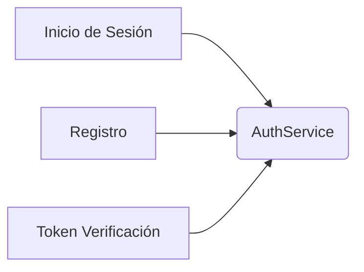

#### 2) Propósito del Diseño de Servicios:

Asegurarse de que cada servicio tenga un propósito claro y definido ayuda a mantener la integridad estructural y funcional del sistema. Un servicio debe ser capaz de operar en silos y no depender demasiado de otros servicios para cumplir su objetivo.

**Ejemplo Práctico:**

Consideremos un sistema microservicios que gestiona pedidos en línea:

- **OrderService:** Se encarga exclusivamente del ciclo de vida de los pedidos, desde la creación hasta el procesamiento y la cancelación.
  
- **PaymentService:** Responsable solo por los aspectos financieros del pedido.

Esto asegura que ambos servicios operan de manera autónoma pero colaborativa para proporcionar un servicio integral al cliente.

**Diagrama Mermaid:**

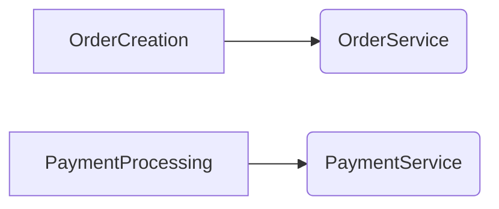

#### 3) Prácticas Recomendadas:

- **Seguridad Integrada:** Incorporar prácticas de seguridad desde el inicio del desarrollo. Esto incluye la incorporación de pruebas de seguridad como parte del flujo CI/CD.
  
- **Autenticación y Autorización:** Utilizar protocolos estándar para autenticación (OAuth2, JWT) y asegurar que cada servicio tenga control propio sobre los permisos necesarios.

- **Micro Frontends:** Considerar la implementación de micro frontends donde cada frontend se comunique directamente con servicios específicos a través del API Gateway. Esto mejora la seguridad al dividir las responsabilidades entre diferentes equipos y tecnologías.

#### 4) Implementaciones Técnicas:

Utilizar frameworks como Spring Cloud para Java o Kubernetes para manejar los desafíos de orquestación, puede proporcionar un soporte sólido a estos principios. Además, herramientas como Istio pueden ayudar en la implementación del mTLS y otras medidas de seguridad.

**Ejemplo de Implementación:**

```java
// Ejemplo básico de Spring Cloud Security para autenticación JWT

@EnableWebSecurity
public class WebSecurityConfig extends WebSecurityConfigurerAdapter {
    @Override
    protected void configure(HttpSecurity http) throws Exception {
        http.csrf().disable()
            .authorizeRequests()
                .antMatchers("/api/public/**").permitAll() // Públicas
                .anyRequest().authenticated(); // Autenticación requerida para rutas privadas

        JwtAuthenticationTokenFilter jwtAuthenticationTokenFilter = new JwtAuthenticationTokenFilter();
        http.addFilterBefore(jwtAuthenticationTokenFilter, UsernamePasswordAuthenticationFilter.class);
    }
}
```

Implementar estos principios y prácticas puede mejorar significativamente la robustez y seguridad de los microservicios en un entorno empresarial moderno.

## Microseguridad en Arquitecturas Microservicios

### Microseguridad en Arquitecturas de Microservicios

La seguridad en arquitecturas basadas en microservicios es crucial para asegurar la integridad y confidencialidad de los datos, así como mantener el funcionamiento continuo de los servicios. En este capítulo del manual 'Seguridad Avanzada en Microservicios 2026', abordaremos estrategias técnicas clave que permiten implementar una microseguridad robusta.

#### 1) Diseño Orientado al Dominio (DDD) y Contextos Acotados

El diseño orientado al dominio (DDD) es fundamental para definir arquitecturas de microservicios que sean coherentes y mantenibles. Al organizar los microservicios en torno a modelos de dominio claros, se puede reducir la acoplamiento innecesario entre servicios. Cada servicio debe tener una responsabilidad bien definida que le permita funcionar de manera independiente y segura.

**Ejemplo:**

```java
public class OrderService {
    private final UserRepository userRepository;
    private final ProductService productService;

    public OrderService(UserRepository userRepository, ProductService productService) {
        this.userRepository = userRepository;
        this.productService = productService;
    }

    // Métodos relacionados con el pedido aquí...
}
```

#### 2) Diseño de Servicios Granular y Propósito

Cada microservicio debe tener una responsabilidad única que se alinee directamente con los requisitos del negocio. Esto permite encapsular la lógica en un servicio específico, lo cual facilita su seguridad.

**Diagrama Mermaid:**

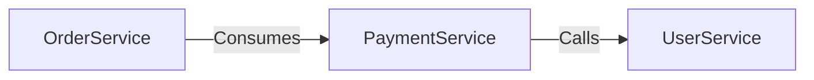

#### 3) Protección de APIs y Enrutamiento Seguro

El uso de un gateway API es crucial para proteger los puntos de entrada a tus servicios. Este componente puede implementar autenticación, autorización y filtrado de tráfico no deseado.

**Ejemplo de configuración Spring Cloud Gateway:**

```yaml
spring:
  cloud:
    gateway:
      routes:
        - id: order_route
          uri: lb://ORDER-SERVICE
          predicates:
            - Path=/orders/**
          filters:
            - TokenRelay=enabled
```

#### 4) Múltiples Capas de Defensa y Monitoreo Continuo

Implementar un enfoque basado en capas (Layered Security) ayuda a proteger los microservicios desde varios puntos. Esto incluye:

- **Autenticación:** Use OAuth2, JWT o OpenID Connect para validar identidades.
- **Autorización:** Mantenga permisos y roles definidos claramente.
- **Cifrado de Tráfico:** Utilice TLS (o mTLS en el caso del servicio mesh) para cifrar toda la comunicación entre los servicios.

**Ejemplo de configuración de Enrutamiento seguro con Spring Cloud Gateway:**

```java
@Bean
public SecurityWebFilterChain springSecurityFilterChain(ServerHttpSecurity http) {
    return http.authorizeExchange()
            .pathMatchers("/orders/**").hasRole("USER")
            .anyExchange().permitAll()
            .and()
            .csrf().disable() // desactivar CSRF en la API Gateway
            .httpBasic().disable()
            .formLogin().disable()
            .build();
}
```

#### 5) Integridad y Seguridad del Código Fuente

Adopte prácticas de codificación segura, como inyección de dependencias, manejo adecuado de excepciones y evitación de ataques de tipo SQL Injection. Utilice herramientas estáticas de análisis de código para detectar posibles vulnerabilidades.

#### 6) Seguridad del Ciclo de Vida (Supply Chain Security)

Proteger la cadena de suministro asegura que el código utilizado en los microservicios no sea comprometido por inyecciones o manipulaciones. Esto implica verificar la integridad y autenticidad de las dependencias de terceros.

**Ejemplo de configuración de BOM (Bill of Materials) con Spring Boot:**

```yaml
dependencymanagement:
  imports:
    - maven {groupId: io.spring.platform, artifactId: spring-platform-dependencies, version: PLATFORM_VERSION}
```

#### Conclusión

La microseguridad es un aspecto crítico del desarrollo de arquitecturas basadas en microservicios. Al seguir las pautas descritas anteriormente y utilizar herramientas modernas y metodologías como DDD, se puede crear una infraestructura robusta que garantiza la seguridad y el rendimiento óptimos.

### Referencias

- Spring Cloud Gateway Documentation
- OWASP Top 10 for API Security
- Domain-Driven Design: Tackling Complexity in the Heart of Software by Eric Evans

## Por Qué la Seguridad de los Microservicios es Crucial

### Por Qué la Seguridad de los Microservicios es Crucial

La seguridad en el entorno de microservicios se vuelve cada vez más crucial a medida que las organizaciones continúan fragmentando sus aplicaciones y sistemas para mejorar la escalabilidad, flexibilidad y mantenimiento. Sin embargo, este aumento en la complejidad también introduce nuevos desafíos en términos de seguridad. Los microservicios operan en un entorno altamente conectado donde cada servicio intercambia datos con otros servicios a través de múltiples canales. Esto no solo aumenta la superficie de ataque potencial sino que también hace más difícil rastrear y mitigar los riesgos.

#### 1) Domain-Driven Design (DDD) y Bounded Contexts

Un diseño basado en el DDD es crucial para asegurar microservicios eficaces. Los servicios deben estar organizados alrededor de modelos de dominio claros que limiten la acoplamiento innecesario. Cada servicio debe tener una responsabilidad bien definida, lo cual facilita su seguridad, pruebas y evolución independientes. Esto asegura una arquitectura robusta con un menor riesgo operativo.

**Ejemplo en código:**

```java
public class UserService {
    private UserRepository userRepository;
    
    public UserService(UserRepository userRepository) {
        this.userRepository = userRepository;
    }

    public User getUserById(String id) {
        return userRepository.findById(id);
    }
}
```

#### 2) Diseño de Servicios Granulares y Propósito

Cada microservicio debe cumplir un único propósito funcional. Un diseño cohesivo asegura que cada servicio se pueda mantener, probar y actualizar de manera independiente. Esto es vital para evitar problemas que podrían propagarse a otros servicios debido a la complejidad innecesaria.

**Ejemplo en Mermaid Diagram:**

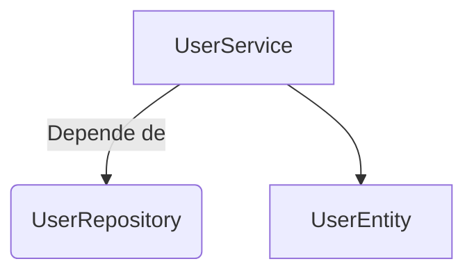

#### 3) Comunicación Segura y Gestión de Autorización

La comunicación entre los servicios debe ser segura, lo que significa cifrado a través del uso de TLS/SSL. Además, la autenticación y autorización deben manejarse adecuadamente para limitar el acceso a recursos específicos según las necesidades del usuario.

**Ejemplo en código:**

```java
public class SecurityConfig {
    @Bean
    public HttpSecurity httpSecurity() throws Exception {
        return http -> http.csrf().disable()
                .authorizeRequests(authorize -> authorize.antMatchers("/api/public/**").permitAll()
                        .antMatchers("/api/private/**").hasRole("USER"))
                .httpBasic(Customizer.withDefaults());
    }
}
```

#### 4) Seguridad de la Cadena de Suministro

La seguridad en el ciclo completo del desarrollo, incluyendo desde el inicio hasta la producción, es vital. Esto implica la vigilancia constante de las dependencias externas y la implementación de controles para prevenir inyecciones de código malicioso.

**Ejemplo en Mermaid Diagram:**

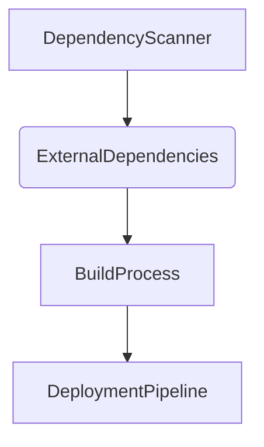

#### 5) Monitoreo y Respuesta Continua a Amenazas

La seguridad es un objetivo dinámico que requiere vigilancia continua. Implementar sistemas de monitoreo en tiempo real, junto con capacidades de respuesta rápida, asegura que cualquier amenaza potencial se pueda detectar y mitigar rápidamente.

**Ejemplo en código:**

```java
public class SecurityEvent {
    private String eventTimestamp;
    private String eventType;
    private String userId;

    // Getters and setters...
}

@RestController
class EventController {

    @PostMapping("/events")
    public ResponseEntity<String> logSecurityEvent(@RequestBody SecurityEvent securityEvent) {
        // Logica para manejar el evento de seguridad.
        
        return ResponseEntity.ok("Security event logged successfully.");
    }
}
```

### Conclusión

La arquitectura de microservicios presenta una serie de desafíos únicos en términos de seguridad. Sin embargo, mediante la implementación de prácticas sólidas como DDD y el diseño de servicios bien delimitados, se pueden mitigar muchos de estos riesgos. Asegurar un ambiente seguro para los microservicios no solo mejora la confiabilidad del sistema sino que también facilita su evolución continua sin comprometer la seguridad.

## Transformación Cibernética: Caso de Estudio de Veritis

### Sección Técnica: Transformación Cibernética: Caso de Estudio de Veritis

#### Introducción

El caso de estudio de Veritis ilustra cómo una empresa puede implementar un enfoque cibernético robusto para proteger su arquitectura basada en microservicios. En este capítulo, exploraremos la estrategia y las técnicas empleadas por Veritis para ayudar a un plataforma fitness y wellness a fortalecer sus defensas cibernéticas.

#### 1) Domain-Driven Design (DDD) y Bounded Contexts

La organización de microservicios alrededor de modelos de dominio claros reduce el acoplamiento innecesario. En DDD, un contexto acotado define claramente los límites de responsabilidad dentro del sistema, permitiendo la independencia en la evolución y mantenimiento.

#### 2) Diseño de Servicios Granular y Propósito

Cada microservicio debe tener una responsabilidad bien definida. Esto no sólo facilita el desarrollo y pruebas unitarias, sino que también mejora la seguridad al minimizar las superficies de ataque entre servicios.

### Implementación Técnica: Caso Veritis

#### Estrategia General

Veritis implementó un enfoque basado en capas que incluye:

1. **API Gateway**: Utilizado para controlar el acceso a los microservicios, garantizando la seguridad y autorización correcta de las solicitudes.
2. **DevSecOps Prácticas**: Integración continua y entrega (CI/CD) con pruebas de seguridad automatizadas en cada ciclo de desarrollo.
3. **Servicio Mesh con mTLS**: Encriptación del tráfico inter-servicios mediante Mutual TLS, asegurando la confidencialidad e integridad de los datos.

#### Detalles Técnicos

**API Gateway**
```java
@RestController
public class ApiGatewayController {

    @Autowired
    private AuthenticationManager authenticationManager;

    // Método para autenticar solicitudes entrantes usando JWT tokens
}
```

**DevSecOps Prácticas (Ejemplo de Integración Continua)**
- **Pipeline CI/CD**: Automatización de pruebas y despliegue.
```yaml
stages:
  - build
  - test
  - deploy

build:
  stage: build
  script:
    - mvn clean install

test:
  stage: test
  script:
    - mvn test
    - mvn dependency-check:scan
```

**Servicio Mesh con mTLS**
```yaml
kubernetesResources:
  - apiVersion: v1
    kind: ConfigMap
    metadata:
      name: istio-sidecar-injector-config
      labels:
        app.kubernetes.io/name: sidecar-injector
        heritage: "Istio"
```
**Diagrama de Arquitectura (Mermaid)**
```mermaid
graph LR;
  A[API Gateway] -->|Token Validation| B{User Request}
  B --> C[Service Mesh]
  C --> D{(Microservices)}
  C --> E{Database Layer}

subgraph Microservices
    F[MicroserviceA] --> G[Auth Service]
    H[MicroserviceB] --> I{Business Logic Service}
end

subgraph Security Layers
    A -->|Audit Log| J[Audit Server]
    D --> K[Security Context]
    E --> L[Crypto Service]
end
```

#### Resultados y Beneficios

Veritis logró:

- **Fortalecimiento de la seguridad**: Implementación exitosa del enfoque cibernético, con un fuerte sistema de protección contra amenazas.
- **Cumplimiento normativo**: El cliente pudo mantenerse alineado con estándares como PCI DSS y HIPAA.
- **Mejora operacional**: Los microservicios se volvieron más eficientes y fáciles de gestionar.

### Conclusión

Este caso de estudio demuestra cómo una combinación estratégica de arquitectura orientada a servicios, implementaciones técnicas avanzadas y prácticas de seguridad robustas pueden transformar la postura cibernética de una organización. La adopción de estas medidas ha permitido no sólo proteger mejor los datos del usuario, sino también garantizar el cumplimiento normativo y mejorar las operaciones en general.

---

Este capítulo proporciona un panorama completo de cómo Veritis abordó los desafíos de seguridad en la arquitectura basada en microservicios, ofreciendo una guía valiosa para otros profesionales de TI que buscan fortalecer sus sistemas.

## 10 Estrategias para una Arquitectura Microservicios Robusta y Mantenible

### 10 Estrategias para una Arquitectura Microservicios Robusta y Mantenible

#### Introducción

La seguridad avanzada en microservicios comienza con bases arquitectónicas sólidas y diseños cuidadosamente pensados. Un mal planeamiento de los límites del servicio y las estructuras de equipo puede introducir riesgos ocultos tanto operativos como de seguridad. Este capítulo proporciona 10 estrategias clave para diseñar una arquitectura microservicios robusta y mantenible que asegure la integridad, confidencialidad y disponibilidad de los sistemas.

---

### Estrategia 1: Dominio-Directed Design (DDD) y Contextos Acotados

Organiza tus microservicios en torno a modelos de dominios claros para reducir la acoplamiento innecesario. Cada servicio debe tener una responsabilidad bien definida, lo que facilita su seguridad, prueba e evolución independientes. Implementar DDD y contextos acotados asegura que los servicios sean coherentes en términos de lógica de negocio.

**Diagrama Mermaid**
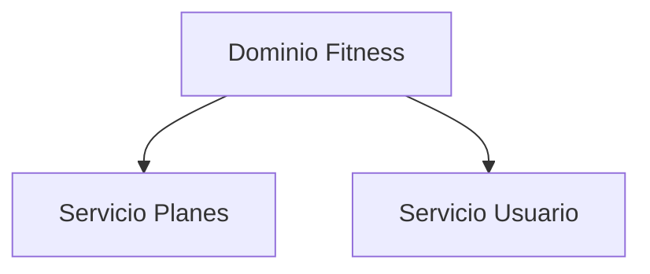

---

### Estrategia 2: Diseño de Servicios Granular y Propósito

Descompón tus servicios en unidades funcionales pequeñas pero autocontenidas. Esto no solo facilita la seguridad y escalabilidad, sino que también mejora el despliegue y mantenimiento de los cambios.

**Código Ejemplo**
```java
@Service
public class MembershipService {
    public void renewMembership(String userId) { ... }
}
```

---

### Estrategia 3: Implementación de JWT para Autenticación

Usa tokens JSON Web Token (JWT) para autenticar y autorizar solicitudes a tus microservicios. Los JWT proporcionan un mecanismo sencillo pero seguro para validar la identidad del usuario sin necesidad de almacenamiento en caché.

**Código Ejemplo**
```java
public class JwtAuthenticationFilter extends OncePerRequestFilter {
    @Override
    protected void doFilterInternal(HttpServletRequest request, HttpServletResponse response, FilterChain filterChain) throws ServletException, IOException {
        final String header = request.getHeader("Authorization");
        if (header == null || !header.startsWith("Bearer ")) {
            filterChain.doFilter(request, response);
            return;
        }
        try {
            final Claims claims = Jwts.parserBuilder()
                    .setSigningKey(SECRET_KEY)
                    .build()
                    .parseClaimsJws(header.split(" ")[1])
                    .getBody();
            SecurityContextHolder.getContext().setAuthentication(new JwtAuthentication(claims));
            filterChain.doFilter(request, response);
        } catch (JwtException e) {
            logger.error("Invalid JWT token: {}", e.getMessage());
            response.setStatus(HttpServletResponse.SC_UNAUTHORIZED);
            try {
                PrintWriter writer = response.getWriter();
                writer.print(new ObjectMapper().writeValueAsString(new AuthResponse(false, "JWT Token is invalid")));
                writer.flush();
            } catch (IOException ex) {
                throw new RuntimeException(ex);
            }
        }
    }
}
```

---

### Estrategia 4: Uso de API Gateway

Utiliza un API Gateway como punto único de entrada para tus microservicios. Esto proporciona control centralizado sobre cómo se accede a los servicios y permite la implementación de políticas de seguridad uniformes.

**Diagrama Mermaid**
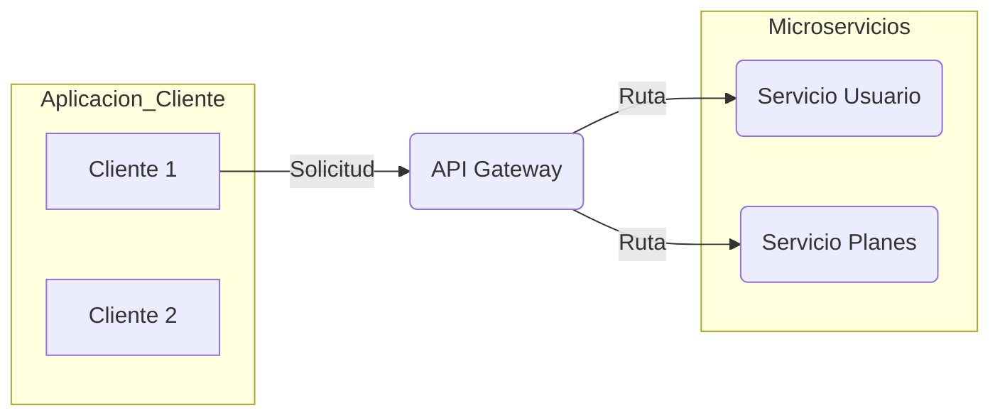

---

### Estrategia 5: Encriptación de Datos en Tránsito y Repositorio

Asegura los datos transmitidos entre servicios mediante el uso de HTTPS y TLS. Además, implementa la encriptación de datos en repositorio para proteger información sensible.

**Código Ejemplo**
```java
@Bean
public RsaKeyProperties rsaKey() {
    return new RsaKeyProperties()
            .privateLocation("keys/private.pem")
            .publicLocation("keys/public.pem");
}
```

---

### Estrategia 6: Implementación de Auditoría y Monitoreo Continuo

Establece un sistema de auditoría que registra todas las interacciones con los servicios. Además, utiliza herramientas de monitoreo en tiempo real para detectar anomalías rápidamente.

**Código Ejemplo**
```java
public class AuditService {
    private static final Logger logger = LoggerFactory.getLogger(AuditService.class);

    public void audit(String action, String resource) {
        logger.info("Usuario {} realizó la acción {} sobre el recurso {}", getCurrentUser(), action, resource);
    }

    private String getCurrentUser() {
        Authentication authentication = SecurityContextHolder.getContext().getAuthentication();
        return authentication != null ? authentication.getName() : "Anónimo";
    }
}
```

---

### Estrategia 7: Uso de DevSecOps Prácticas

Integra prácticas seguras en cada fase del ciclo de vida de desarrollo para garantizar que las preocupaciones de seguridad no se posterguen hasta la etapa final.

**Diagrama Mermaid**
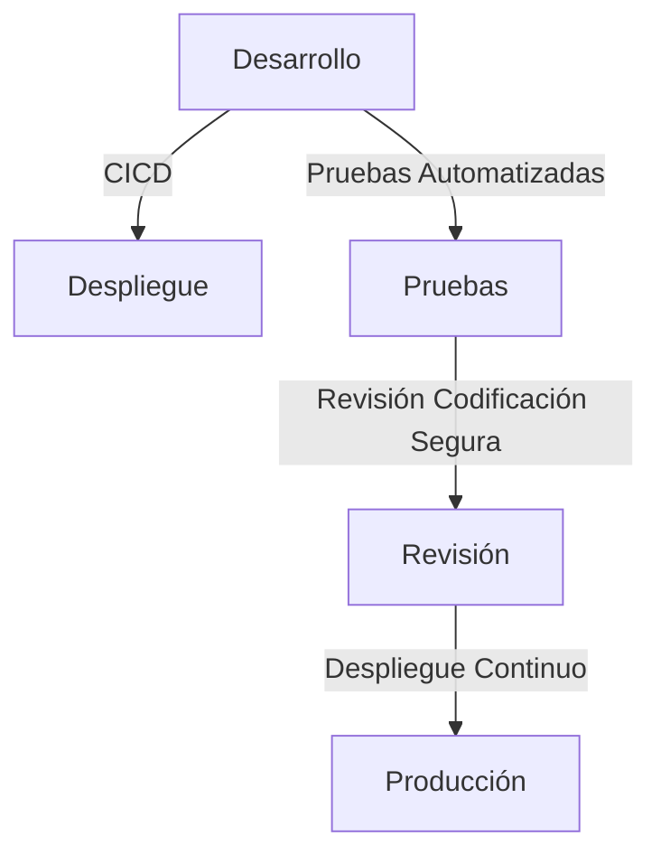

---

### Estrategia 8: Implementación de Control de Acceso Basado en Rol (RBAC)

Asegúrate de que los usuarios solo puedan acceder a los recursos necesarios mediante la implementación de RBAC. Esto reduce significativamente el riesgo de exponer información sensible.

**Código Ejemplo**
```java
@PreAuthorize("hasRole('USER')")
public void getUser() { ... }
```

---

### Estrategia 9: Implementación de Autenticación Multi-Factor (MFA)

Agrega una capa adicional de seguridad al requerir la autenticación MFA para los usuarios con acceso a recursos críticos.

**Código Ejemplo**
```java
@Service
public class TwoFactorAuthenticationService {
    public void authenticateUser(String userId, String token) { ... }
}
```

---

### Estrategia 10: Mantenimiento de la Actualización y Validación Continua

Mantén tus servicios actualizados con las últimas versiones del software y librerías para protegerlos contra vulnerabilidades conocidas. Además, valida regularmente tu infraestructura para asegurar que sigue cumpliendo los estándares de seguridad.

**Diagrama Mermaid**
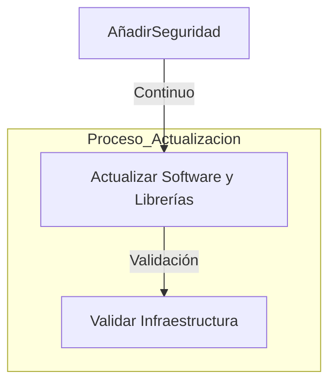

---

### Conclusión

Implementar estas estrategias no solo fortalecerá la seguridad de tu arquitectura microservicios, sino que también mejorará su mantenibilidad y escalabilidad. Al adoptar prácticas sólidas desde el inicio, podrás enfrentar los desafíos futuros con confianza y eficacia.

---

Estas estrategias ofrecen una base sólida para diseñar e implementar microservicios seguros y robustos en cualquier entorno de desarrollo.

## Event Storming Workshops: Identificar Barreras Naturales y Dominios

### 1) Domain-Driven Design (DDD) and Bounded Contexts

In the context of microservices architecture, implementing a robust security framework begins with an understanding of Domain-Driven Design (DDD). DDD emphasizes modeling software around business domains to provide clear boundaries for responsibilities. When applying this concept to microservices, it leads to the creation of bounded contexts—each representing a domain or subdomain within your application.

**Key Elements:**

1. **Ubiquitous Language**: A shared language used by developers and business experts that avoids ambiguous terms.
2. **Bounded Contexts**: Clear definitions of boundaries where one model applies.
3. **Context Mapping**: Diagramming the relationships between bounded contexts to ensure clear communication and integration paths.

**Example Code (Java) for a Bounded Context:**

```java
public interface PaymentService {
    PaymentResponse processPayment(PaymentRequest paymentRequest);
}
```

**Mermaid Diagram:**
```mermaid
graph TD;
    subgraph UserManagementContext
        User [User]
        Profile [Profile]
    end

    subgraph OrderContext
        Order [Order]
        Address [Address]
    end
    
    subgraph PaymentContext
        PaymentService [Payment Service]
        PaymentResponse [Payment Response]
        PaymentRequest [Payment Request]
    end

    User -->|Creates| Profile
    Profile -->|Belongs to| User
    Order -->|Includes| Address
    PaymentService -.->|Calls| PaymentRequest
    PaymentService -.-|Returns| PaymentResponse
```

### 2) Granular and Purposeful Service Design

To design secure microservices, aim for fine-grained services that are narrowly focused on specific business operations. Each service should have a single responsibility to ensure modularity and reduce inter-service coupling.

**Considerations:**

- **Single Responsibility Principle (SRP)**: A microservice should handle one functionality.
- **Loose Coupling**: Services communicate through well-defined APIs, minimizing direct dependencies.
- **API Gateway**: Centralizes access control, rate limiting, and other cross-cutting concerns.

**Example Code (Java) for a Secure API Gateway:**

```java
@RestController
public class ApiGatewayController {
    @GetMapping("/secure/api")
    public ResponseEntity<String> secureApiCall(HttpServletRequest request) {
        String apiKey = request.getHeader("Authorization");
        if (!apiKeyValidationService.isValid(apiKey)) {
            return new ResponseEntity<>("Unauthorized", HttpStatus.UNAUTHORIZED);
        }
        // Proceed with the call
        return new ResponseEntity<>("Success", HttpStatus.OK);
    }

    private final ApiKeyValidationService apiKeyValidationService;
}
```

**Mermaid Diagram:**
```mermaid
graph TD;
    subgraph Microservice_A
        ServiceA [Service A]
    end

    subgraph APIGateway
        GatewayController [Gateway Controller]
    end

    Client -->|Make Request| GatewayController
    GatewayController --|Validate Token| ApiKeyValidationService
    GatewayController --|Proceed with Call| ServiceA
```

### 3) Event-Driven Architecture and Event Storming Workshops

Event storming is a powerful technique for aligning teams around business goals through collaborative session design. During an event storming workshop, participants identify events that occur within the system’s domain, commands or operations performed in response to these events, and bounded contexts where responsibilities are assigned.

**Steps:**

1. **Gather Stakeholders**: Involve all relevant team members including developers, testers, business analysts.
2. **Map Events**: List out all critical events and their sequence in a timeline format.
3. **Identify Commands**: For each event, determine the commands or operations needed to process it.
4. **Context Mapping**: Define bounded contexts and map inter-service communication paths.

**Example: Event Storming Workshop Agenda**

- **Introduction (10 minutes)**: Overview of DDD principles and workshop objectives.
- **Event Listing (20 minutes)**: Brainstorm events with post-it notes on the timeline wall.
- **Command Identification (30 minutes)**: Identify commands for each event.
- **Context Definition (40 minutes)**: Define bounded contexts, assign responsibilities.

**Mermaid Diagram Example: Event Timeline**

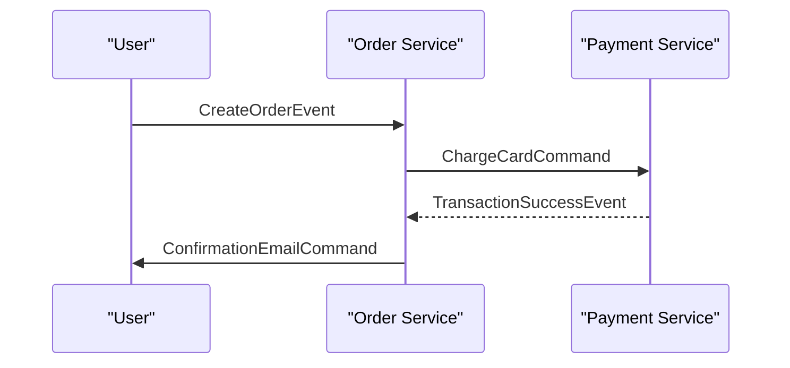

### Conclusion

Implementing microservices security requires a thorough understanding of Domain-Driven Design principles and event-driven architecture. Through event storming workshops, teams can collaboratively identify key events, commands, and bounded contexts, leading to cleaner service boundaries, more modular designs, and enhanced security posture.

By adhering to these practices, you ensure that your microservices are not only secure but also maintainable, scalable, and aligned with business objectives.

## Definición y Cartografía de Contextos Acotados (Bounded Contexts)

### Sección Técnica: Definición y Cartografía de Contextos Acotados (Bounded Contexts)

**Resumen:** La cartografía de contextos acotados es un componente fundamental en el diseño de arquitecturas basadas en microservicios. Proporciona una estructura clara para la organización del dominio, lo que resulta en servicios más seguros y mantenibles. Esta sección aborda cómo definir y mapear contextos acotados desde una perspectiva de seguridad avanzada.

#### 1) Dominios Dirigidos por Diseño (DDD) y Contextos Acotados

El diseño dirigido por el dominio (Domain-Driven Design, DDD) es un enfoque que enfatiza la importancia del dominio de negocio en el desarrollo de software. Un contexto acotado representa una frontera lógica dentro del cual las reglas y los términos están definidos claramente. Esta sección explica cómo estos conceptos mejoran la seguridad y la arquitectura en general.

- **Definición:** En DDD, un contexto acotado es un límite dentro del cual el lenguaje y los conceptos son consistes y claros. Fuera de este contexto, las reglas pueden variar.
  
- **Importancia para la Seguridad:** 
  - Alinear la seguridad con la estructura de dominio asegura que las políticas y controles estén en consonancia con el uso del sistema. 
  - Reduce los riesgos operativos al minimizar el contacto innecesario entre servicios.
  
- **Implementación:**
  - Identificar y definir claramente los límites de cada contexto acotado.
  - Establecer reglas para la comunicación entre contextos (mediante API's, eventos o mensajes).
  - Asegurarse de que las interfaces entre contextos estén bien documentadas y protegidas.

#### Diagrama Mermaid: Ejemplo de Cartografía de Contextos Acotados

```mermaid
graph TD;
    subgraph Sistema Fitness
        subgraph Servicios Cliente
            C_Registro{Registro}
            C_Autenticacion{Autenticación}
            C_Notificaciones{Notificaciones}
        end
        
        subgraph Servicios GestionDeSuscripciones
            S_Pagos(Pagos)
            S_Subscripcion(Subscripción)
            S_Reportes(Reportes)
        end

        subgraph Servicios Administrativos
            A_Perfiles(Perfiles de Usuario)
            A_Notificaciones{Notificaciones}
            A_Contenido(Crear Contenido)
        end
        
    SistemaFitness --> C_Registro
    SistemaFitness --> S_Pagos
    SistemaFitness --> A_Perfiles
    
```

#### 2) Diseño de Servicios Granular y Propósito

La seguridad en microservicios también se basa en el diseño granular y propósitivo de los servicios. Esto asegura que cada servicio tenga una responsabilidad clara y definida, minimizando las interacciones innecesarias entre ellos.

- **Principios del Diseño Propósito:**
  - Un solo responsable por contexto (SRP).
  - Minimizar la interfaz pública.
  
#### Diagrama Mermaid: Ejemplo de Límites y Comunicación Entre Contextos Acotados

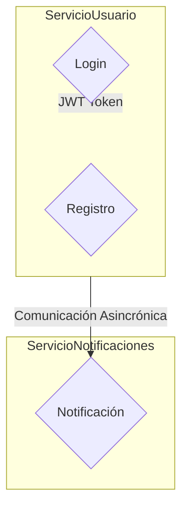

#### 3) Prácticas de Seguridad Avanzadas en Bounded Contexts

Implementar prácticas de seguridad avanzadas asegura que cada contexto acotado sea seguro y robusto frente a amenazas.

- **Control de Acceso:** Asegurar que solo los usuarios autorizados tengan acceso a las APIs y servicios.
  
- **Encriptación Interna y Externa:** Utilizar mTLS para la comunicación interna del servicio y TLS para la comunicación externa.
  
- **Auditoría:** Mantener registros detallados de todas las transacciones, para auditorías posteriores.

#### Consideraciones Finales

La cartografía de contextos acotados no solo mejora el diseño y la seguridad de los microservicios, sino que también facilita la colaboración entre equipos al proporcionar una visión clara del dominio. Implementando estas prácticas, se puede lograr un ambiente seguro donde cada componente operativo cumple con sus responsabilidades de manera autónoma.

**Recursos Adicionales:**

- **Documentos DDD:** [Enterprise Patterns](https://domainlanguage.com/wp-content/uploads/2015/04/DDD_ShortDefinition.pdf)
  
- **Prácticas DevSecOps:** Integrar seguridad en todas las etapas del ciclo de vida de desarrollo, desde la creación hasta el despliegue.

---

Esta sección técnica proporciona un fundamento sólido para diseñar y implementar contextos acotados seguros dentro de arquitecturas basadas en microservicios. Al seguir estos principios, los equipos pueden desarrollar sistemas más robustos y resilientes frente a amenazas.

## API Gateway: Un Punto Centralizado para la Gestión de Solicitud de Clientes

### API Gateway: Un Punto Centralizado para la Gestión de Solicitud de Clientes

En el mundo de los microservicios, la seguridad no puede ser un aditamento; debe integrarse en cada capa de la arquitectura. Uno de los componentes centrales en este contexto es el API Gateway, que actúa como una puerta de entrada para todas las solicitudes externas y proporciona control centralizado sobre cómo estas solicitudes son procesadas.

#### 1) Funciones del API Gateway

El API Gateway desempeña varios roles críticos:

- **Control de Acceso:** Implementar políticas de autenticación y autorización para garantizar que solo los clientes aprobados puedan acceder a los microservicios.
- **Ruteo:** Redirigir las solicitudes entrantes al servicio correcto basándose en el contrato del API Gateway con cada microservicio.
- **Militar Gradual (Rate Limiting):** Evitar sobrecargas y ataques DDoS limitando la cantidad de solicitudes que un cliente puede hacer a través del gateway.
- **Registros y Monitoreo:** Recopilar métricas en tiempo real para monitorear el rendimiento del servicio.

#### 2) Implementación Técnica

Para implementar un API Gateway, podemos usar una variedad de tecnologías. En este manual, vamos a explorar la configuración básica utilizando Ktor (un framework de Kotlin), aunque los principios se aplican a otros frameworks como Zuul o Ambassador.

```kotlin
import io.ktor.application.*
import io.ktor.auth.*
import io.ktor.features.*
import io.ktor.http.content.*
import io.ktor.routing.*

fun main(args: Array<String>) = io.ktor.server.netty.EngineMain.main(args)

@Suppress("unused") // Referenced in application.conf
fun Application.module() {
    install(Authentication) {
        basic("ktor-app-auth") {
            realm = "Ktor App"
            validate { credentials ->
                if (credentials.name == "user" && credentials.password == "password") UserIdPrincipal(credentials.name)
                else null
            }
        }
    }

    routing {
        authenticate("ktor-app-auth") {
            get("/protected") {
                call.respondText("You're authenticated", contentType = ContentType.Text.Plain)
            }
        }
        
        static("public") {
            resources()
        }
    }
}
```

#### 3) Diseño de Arquitectura

Un API Gateway no solo gestiona solicitudes entrantes, sino que también puede desempeñar un papel crucial en la seguridad y el rendimiento del sistema completo. A continuación se muestra cómo puede estar configurado en una arquitectura típica:

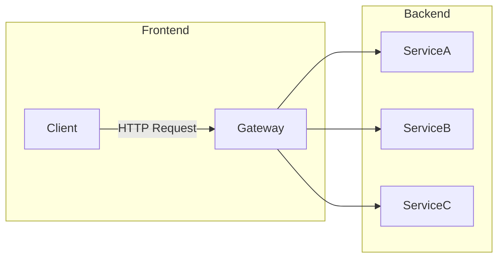

Este diseño permite que cada microservicio opere de manera aislada, lo cual es beneficioso desde un punto de vista de seguridad y escalabilidad.

#### 4) Consideraciones de Seguridad

- **Autenticación:** Es crucial implementar métodos robustos para verificar la identidad del cliente.
- **Autorización:** Determina qué recursos el usuario tiene permiso para acceder. En una arquitectura basada en microservicios, este paso debe estar integrado tanto en el API Gateway como dentro de cada servicio individual.
- **Encriptación:** Utilizar HTTPS o TLS asegura que la comunicación entre clientes y servidor esté cifrada.

#### 5) Monitoreo y Mantenimiento

El monitoreo es vital para cualquier sistema, especialmente en microservicios. Herramientas como Prometheus y Grafana pueden ser utilizadas para recopilar métricas del API Gateway, permitiendo a los administradores de sistemas identificar rápidamente problemas antes de que se conviertan en incidentes.

#### 6) Conclusión

Un bien implementado API Gateway es una pieza clave en la estrategia de seguridad y gestión del tráfico para microservicios. Proporciona control, flexibilidad y escalabilidad al mismo tiempo que asegura la protección contra amenazas externas.

## Ejemplos del Mundo Real en Arquitecturas Microservicios

### Sección Técnica: Ejemplos del Mundo Real en Arquitecturas Microservicios

La seguridad avanzada en microservicios es vital para garantizar que los sistemas basados en microservicios sean resilientes y seguros frente a amenazas. Para ilustrar cómo se pueden implementar prácticas de seguridad efectivas, presentaremos dos casos de estudio: un sistema financiero y una plataforma de e-commerce.

#### Ejemplo 1: Sistema Financiero

Un gran banco solicitó la implementación de una arquitectura microservicios para mejorar su capacidad operativa y seguridad. Al diseñar esta solución, se utilizó Domain-Driven Design (DDD) para definir claramente los límites del contexto en cada servicio, como autenticación, autorización, transacciones y informes financieros.

##### Implementación Técnica

1. **Autenticación**: Utilizamos OAuth 2.0 con tokens JWT para la autenticación de usuarios y servicios.
2. **Autorización**: Aplicamos RBAC (Role-Based Access Control) a través de una API Gateway para controlar el acceso a los microservicios basado en roles.
3. **Cifrado de Datos**: Aseguramos la comunicación entre servicios mediante mTLS (Mutual TLS) dentro del service mesh.

**Diagrama Mermaid**

```mermaid
graph LR;
    subgraph Microservice_Authentication
        Authentication --> TokenService
        TokenService --> APIGateway
    end

    subgraph Microservice_Roles
        RoleManager --> PermissionDatabase
        APIGateway --> RoleManager
    end

    subgraph Service_Mesh
        ServiceA -- TLS --> ServiceB
        ServiceB -- mTLS --> ServiceC
    end
```

##### Código Ejemplo (Java)

```java
@RestController
@RequestMapping("/api/auth")
public class AuthenticationController {
    @PostMapping("/login")
    public ResponseEntity<JwtToken> login(@RequestBody LoginRequest request) {
        // Autenticación y generación de token JWT
        return new ResponseEntity<>(new JwtToken(token), HttpStatus.OK);
    }
}
```

#### Ejemplo 2: Plataforma de E-Commerce

Una empresa de e-commerce requirió una transformación de su infraestructura para mejorar la velocidad y la seguridad. Implementamos un microservicio separado para cada funcionalidad, como carritos de compras, pagos y inventario, utilizando DDD para definir los límites del contexto.

##### Implementación Técnica

1. **API Gateway**: Se utilizó una API Gateway que actúa como entrada única y realiza el mapeo entre las solicitudes entrantes y los microservicios.
2. **Seguridad en Capa**: Cada capa de la arquitectura implementa su propio conjunto de medidas de seguridad, desde el cifrado del transporte hasta la validación del lado del cliente.

**Diagrama Mermaid**

```mermaid
graph LR;
    subgraph API_Gateway
        Gateway --> UserAPI
        Gateway --> ProductAPI
        Gateway --> CartService
    end

    subgraph Service_Mesh
        CartService -- TLS --> PaymentGateway
        PaymentGateway -- mTLS --> BankSystem
    end

    subgraph Authentication_Service
        AuthServer --> JWTToken
        JWTToken --> UserService
    end
```

##### Código Ejemplo (Java)

```java
@Service
public class ProductService {
    
    @Autowired
    private ProductRepository repository;

    public List<Product> getAllProducts() {
        // Implementación del servicio de productos con seguridad y autenticación
        return repository.findAll();
    }
}
```

### Conclusión

Estos ejemplos ilustran cómo la aplicación de principios como DDD, diseño microservicios granular y enfoques de seguridad en capas puede fortalecer significativamente las arquitecturas basadas en microservicios. La implementación efectiva de estas prácticas permite a los equipos garantizar una mayor seguridad, escalabilidad y mantenibilidad de sus sistemas.

La continua evolución del ecosistema de tecnologías y herramientas disponibles para la seguridad de microservicios exige que los ingenieros de software mantengan un enfoque dinámico y adaptativo en el diseño y desarrollo de estos sistemas.

## Mitigación de Amenazas: Marco para Identificar y Abarcar Riesgos Arquitectónicos

### Mitigación de Amenazas: Marco para Identificar y Abarcar Riesgos Arquitectónicos

La seguridad en microservicios es fundamental para proteger los servicios individuales y sus comunicaciones. Este marco proporciona directrices detalladas sobre cómo identificar y mitigar riesgos arquitectónicos específicos al diseñar y mantener un sistema de microservicios.

#### 1) Diseño-Dirigido por Dominios (DDD) y Contextos Acotados

Organizar los microservicios en torno a modelos de dominio claros es crucial para reducir el acoplamiento innecesario. Este enfoque asegura que cada servicio tenga una responsabilidad bien definida, facilitando la seguridad, pruebas y evolución independientes.

#### 2) Diseño de Servicios Granular y Propósito

El diseño granular implica dividir los microservicios de manera que tengan un único propósito funcional. Esto no solo mejora la eficiencia operativa sino también reduce la superficie de ataque, ya que cada servicio tiene menos lógica en juego.

#### 3) Implementación del Seguridad DevSecOps

Integrar prácticas de seguridad desde el principio es vital para prevenir problemas futuros. Esto incluye pruebas de seguridad continuas como parte de las pruebas automatizadas y la detección temprana de vulnerabilidades en el ciclo de desarrollo.

#### 4) Encriptación del Tráfico con mTLS

El uso de mutual TLS (mTLS) para asegurar el tráfico entre microservicios es una práctica común. mTLS proporciona un nivel adicional de seguridad al verificar la identidad mutua entre los servicios, minimizando las posibilidades de ataques man-in-the-middle.

#### 5) Autenticación Múltiple y Autorización

Implementar multifactor autenticación (MFA) para accesos a sistemas críticos mejora significativamente la seguridad. Además, utilizar roles y permisos basados en declaraciones para gestionar el acceso a los microservicios es crucial.

#### Marco de Identificación y Mitigación de Riesgos

Para identificar riesgos arquitectónicos específicos, se debe llevar a cabo una revisión detallada del diseño actual y proyectado. Esto incluye:

- **Revisión DDD**: Asegurarse que cada microservicio tenga un único dominio y contexto acotado.
- **Análisis de Flujos**: Identificar flujos críticos en los sistemas para entender dónde se pueden generar vulnerabilidades.
- **Evaluación de Código**: Realizar revisiones de código para asegurar que las prácticas de seguridad son seguidas consistentemente.

#### Mitigación de Riesgos

Una vez identificados, los riesgos deben mitigarse a través de diversas estrategias:

```mermaid
graph LR;
    A[Identificación del Riesgo] --> B{Revisión DDD};
    B --> C[Confirmar Contextos Acotados];
    B --> D[Revisar Diseños de Servicios];
    
    C --> E[Implementación de Seguridad DevSecOps];
    D --> F{Adoptar mTLS};
    F --> G[Evaluación y Configuración de mTLS];
    F --> H{Autenticación Múltiple};
    H --> I[Integración de MFA];

    E --> J{Ejecutar Pruebas Automatizadas};
    J --> K[Identificar Vulnerabilidades Tempranas];
```

#### Ejemplo Técnico: Implementación de mTLS

```java
public class MutualTlsConfig {
    @Bean
    public ServerLdapClientDetailsService serverLdapClientDetailsService(@Qualifier("ldapClientContextSource") ClientContextSource ldapClientContextSource) throws Exception {
        return new LdapClientDetailsService(ldapClientContextSource);
    }

    @Configuration
    public class TransportSecurityConfiguration {

        @Bean
        public ServletWebServerFactory servletContainer() {
            TomcatServletWebServerFactory tomcat = new TomcatServletWebServerFactory();
            tomcat.addConnectorCustomizers((TomcatConnectorCustomizer) connector -> {
                if ((connector.getProtocolHandler() instanceof AbstractHttp11Protocol<?>)) {
                    SSLHostConfigElement sslHostConfig = new DefaultSSLHostConfigElement();
                    sslHostConfig.setCertificateKeystoreFile("keystore.jks");
                    sslHostConfig.setCertificateKeyManagerPassword("password");
                    connector.addSslHostConfigs(sslHostConfig);
                }
            });
            return tomcat;
        }

    }
}
```

#### Conclusiones

Un enfoque arquitectónico sólido y bien pensado es fundamental para garantizar la seguridad de microservicios. Al seguir estas directrices, los equipos pueden minimizar riesgos operativos y mejorar significativamente el estado de seguridad general del sistema.

Este marco proporciona un camino claro hacia una implementación segura y eficiente de microservicios, asegurando que cada paso esté respaldado por prácticas probadas en la industria.

## Adoptar una Arquitectura Zero Trust

### Adoptar una Arquitectura Zero Trust

La arquitectura Zero Trust es un enfoque moderno para la seguridad de microservicios que se basa en el principio "nunca confiar, siempre verificar". Este enfoque requiere que cada entidad (usuarios, servicios y dispositivos) sea verificada antes de ser concedida acceso a los recursos del sistema. La adopción de una arquitectura Zero Trust implica un cambio significativo en cómo se implementa la seguridad tanto dentro como fuera de las fronteras del entorno de microservicios.

#### 1. **Características Clave de Zero Trust**

- **Verificación Continua**: Cada acceso a los recursos debe ser verificado y autorizado, independientemente de si el accesor es interno o externo.
- **Segmentación de Redes**: Se utiliza para aislar y proteger las diferentes partes del sistema. Esto minimiza la superficie de ataque en caso de que un intruso consiga penetrar en una parte del sistema.
- **Autenticación y Autorización Robustas**: Implementación de métodos fuertes de autenticación y autorización, incluyendo multifactor y uso de tokens JWT (JSON Web Tokens).

#### 2. **Implementación de Zero Trust en Microservicios**

Para adoptar la arquitectura Zero Trust, es esencial implementar los siguientes componentes:

- **API Gateway**: Utiliza un API gateway como punto único para todas las solicitudes entrantes y salientes. El API gateway puede ser configurado para aplicar políticas de seguridad como autenticación, autorización, cifrado (TLS), control de velocidad y limpieza del tráfico.
  
  ```java
  public class ApiGateway {
      private final AuthenticationManager authenticationManager;
      
      public void handleRequest(HttpServletRequest request) throws Exception {
          String token = request.getHeader("Authorization");
          if(token == null || !authenticationManager.authenticateToken(token)) throw new UnauthorizedException();
          
          // Procesar solicitud autenticada
      }
  }

  ```

- **Service Mesh**: Utilizar un service mesh como Istio puede ayudar a implementar la seguridad en tiempo de ejecución. Service meshes permiten implementar políticas de seguridad y observabilidad, así como gestión de tráfico entre servicios.
  
  ```yaml
  gateways:
    - name: my-api-gateway
      servers:
        - hosts: ["api.example.com"]
          port: 80

  virtualServices:
    - name: backend-service-vs
      hosts: ["backend-service.example.com"]
      http:
        - match:
            - uri:
                prefix: "/protected"
          route:
            - destination:
                host: backend-service
                port:
                  number: 9000
          corsPolicy:
            allowOrigin:
              - "http://frontend.example.com"
            allowMethods:
              - POST
              - GET

  ```

- **Seguridad del Código**: Asegúrate de que todas las aplicaciones y microservicios sigan prácticas seguras de codificación. Esto incluye no almacenar claves en el código, usar frameworks seguros, realizar comprobaciones de entrada, etc.
  
  ```java
  public void saveUser(User user) {
      if(user == null || user.getName() == null || user.getPassword() == null) throw new IllegalArgumentException();
      
      // Guardar usuario en base de datos
  }
  ```

- **Control de Acceso Baseado en Roles (RBAC)**: Implementa RBAC para limitar el acceso a los recursos según el rol del usuario.
  
  ```java
  public class AccessControl {
      private final Map<Role, Set<String>> rolesPermissions = new HashMap<>();
      
      public void checkAccess(String resource, String action) throws SecurityException {
          for(Role role : rolesPermissions.keySet()) {
              if(role.hasPermission(resource, action)) return;
              
              throw new SecurityException("No permission");
          }
      }
  }
  
  ```

#### 3. **Monitoreo y Respuesta a Incidentes**

- **Auditoría de Transacciones**: Mantener registros detallados de todas las transacciones que se realizan en el sistema, con información sobre quién hizo qué y cuándo.
- **Detección de Amenazas e IA**: Utilizar herramientas avanzadas para la detección automática de amenazas basada en machine learning. Estos sistemas pueden aprender los patrones normales del tráfico y alertar sobre cualquier anomalía.

#### 4. **Ejemplos Prácticos**

Para ilustrar cómo estos principios funcionan en práctica, consideremos un diagrama Mermaid de una arquitectura simplificada:

```mermaid
graph LR;
    A[Usuario] -- Autenticación --> B(API Gateway);
    B -- Autorización --> C(Service Mesh);
    C -- Tráfico cifrado --> D[Microservicios];
    E[Datos] --- F[Cifrado en reposo];

subgraph Sistema de Seguridad
    G[Auditoría]
    H[Detección IA]
end

D -- Logs --> G;
G -- Informe --> A;
C -- Logs --> H;
H -- Alerta --> A;
```

#### 5. **Conclusión**

Adoptar la arquitectura Zero Trust en un entorno de microservicios es crucial para mantener una postura de seguridad sólida y adaptable a los desafíos crecientes del mundo digital actual. Al implementar esta arquitectura, se puede garantizar que cada entidad dentro del sistema sea verificada antes de ser concedida acceso, minimizando así la posibilidad de ataques exitosos.

---

Este enfoque técnico proporciona una base sólida para implementar un enfoque Zero Trust efectivo en la seguridad de microservicios.

## Verificación Continua de Solicitudes de Acceso

### Sección Técnica: Verificación Continua de Solicitudes de Acceso

La verificación continua de solicitudes de acceso es una práctica crítica para garantizar que los microservicios operen en un entorno seguro y controlado. Este proceso involucra la evaluación constante y sistemática de las solicitudes que se realizan a los servicios, asegurando que solo el tráfico permitido tenga acceso. En este contexto, abordaremos cómo implementar una verificación continua utilizando principios modernos de seguridad como el enfoque sin confianza (zero trust) y tecnologías de última generación.

#### 1) Principio Sin Confianza

El principio sin confianza implica que ningún dispositivo, usuario o servicio debe ser automáticamente confiable simplemente porque se encuentra dentro del perímetro de red. Cada solicitud debe ser verificada en tiempo real antes de permitir el acceso al recurso solicitado. Esta filosofía es particularmente relevante para microservicios debido a la naturaleza dinámica y desatendida de su operación.

#### 2) Implementación Técnica

Para implementar la verificación continua, podemos utilizar tecnologías como Istio o Linkerd en combinación con una solución de autenticación centralizada (como Keycloak o OAuth2). Estas herramientas nos permiten:

- **Autenticación:** Asegúrate de que todos los usuarios y servicios que interactúan con tus microservicios estén correctamente autenticados.
- **Autorización:** Utiliza políticas detalladas para controlar qué recursos pueden ser accedidos por quiénes.
- **Auditoría:** Mantén registros exhaustivos de las solicitudes y acciones realizadas, permitiendo un seguimiento eficaz.

#### 3) Código Técnico

A continuación, proporcionamos un ejemplo en Java utilizando Spring Security para demostrar cómo implementar verificación continua. Este código ilustra la creación de un filtro personalizado que verifica cada solicitud antes de permitir el acceso a los microservicios:

```java
import org.springframework.security.web.util.matcher.RequestMatcher;

public class CustomAccessControlFilter extends OncePerRequestFilter {
    private RequestMatcher requestMatcher;
    
    public CustomAccessControlFilter(RequestMatcher requestMatcher) {
        this.requestMatcher = requestMatcher;
    }

    @Override
    protected void doFilterInternal(HttpServletRequest request, HttpServletResponse response, FilterChain filterChain)
            throws ServletException, IOException {

        if (requestMatcher.matches(request)) {
            // Verifica la autenticidad y autorización del usuario o servicio
            // Ejemplo: llamar a un método que consulta Keycloak para validar los tokens

            String token = request.getHeader("Authorization");
            
            boolean isValidToken = validateToken(token);
            if (!isValidToken) {
                response.sendError(HttpServletResponse.SC_UNAUTHORIZED, "Invalid access token.");
                return;
            }
        }

        // Si la solicitud es válida, pasála al siguiente filtro en la cadena
        filterChain.doFilter(request, response);
    }

    private boolean validateToken(String token) {
        // Implementación de validación del token
        return true;  // Retornar verdadero solo si el token es válido
    }
}
```

#### 4) Diagrama Mermaid

Un diagrama que representa la arquitectura para la verificación continua puede ser útil para visualizar cómo se implementan los conceptos descritos:

```mermaid
graph TD;
    A[Cliente] -->|Solicitud| B(Istio Gateway);
    B --> C{API Gateway};
    C --> D(Validación de Token OAuth2);
    D --> E(Service Mesh);
    E --> F(Autenticación & Autorización Microservicio);
    F --> G(Microservicios Internos);
```

#### 5) Consideraciones de Seguridad Adicionales

- **Políticas de Rol Básico:** Asegúrate que tus microservicios estén diseñados para manejar roles y permisos específicos.
- **Encriptación en Tránsito:** Utiliza TLS/SSL para todas las comunicaciones entre servicios.
- **Auditoría Inmutable:** Mantén registros inmutables de acceso y actividad para auditoría y cumplimiento.

Con estos principios, puedes implementar una verificación continua efectiva que proteja tu arquitectura de microservicios contra amenazas actuales y futuras.

## Aplicación de Microsegmentación en Redes

### Aplicación de Microsegmentación en Redes

La microsegmentación es un enfoque avanzado para la seguridad de redes y sistemas que divide las grandes superficies de ataque en segmentos más pequeños. Esta técnica es especialmente útil en arquitecturas basadas en microservicios, donde cada servicio puede requerir diferentes niveles de protección debido a sus responsabilidades y interacciones únicas.

#### 1) Concepto Básico de Microsegmentación

La microsegmentación implica dividir la red lógicamente para que cada proceso o aplicación tenga su propio segmento de seguridad. Cada segmento puede tener reglas y políticas de acceso personalizadas, lo que permite una mayor precisión en la seguridad y un mejor control sobre los flujos de tráfico entre servicios.

#### 2) Implementación en Microservicios

En el contexto de microservicios, la microsegmentación se aplica a través del uso de contenedores, máquinas virtuales o incluso instancias individuales como unidades lógicas para segmentar. Esto permite establecer reglas de seguridad detalladas y específicas para cada servicio, minimizando así los riesgos asociados con amenazas internas.

#### 3) Herramientas y Tecnologías

- **Service Mesh**: Utiliza un enfoque mTLS (mutual Transport Layer Security) para la comunicación segura entre microservicios. Además de proteger el tráfico inter-servicio, también puede proporcionar métricas detalladas sobre las operaciones del servicio.
  
- **API Gateway**: Sirve como punto único de entrada y salida para todos los microservicios, permitiendo control centralizado del acceso a servicios.

#### 4) Diseño Detallado

##### Diagrama de Microsegmentación
```mermaid
graph LR
    subgraph API Gateway
        A[Cliente]
        B(API Gateway)
    end
    
    subgraph Service Mesh
        C(Service Mesh Control Plane)
        D1{Servicio 1}
        D2{Servicio 2}
        D3{Servicio 3}
    end

    A -->|HTTPS/REST| B
    B -->|mTLS| C
    C -- mTLS --> D1, D2, D3
```

Este diagrama ilustra cómo el API Gateway actúa como un intermediario entre los clientes externos y el Service Mesh. El Service Mesh, a su vez, proporciona seguridad end-to-end utilizando mTLS para proteger la comunicación entre servicios.

##### Código de Ejemplo

A continuación se muestra un ejemplo básico en Java que demuestra cómo configurar una política de microsegmentación dentro del contexto de una aplicación basada en microservicios:

```java
public class SecurityPolicy {

    public boolean allowCommunication(String fromService, String toService) {
        // Definir reglas de comunicación entre servicios
        if ("service1".equals(fromService) && "service2".equals(toService)) {
            return true;  // Permitir solo tráfico HTTP en HTTPS.
        }
        
        return false;
    }

    public boolean authenticateRequest(String service, String requestMethod, String path) {
        // Validar el método y la ruta de solicitud
        if ("GET".equalsIgnoreCase(requestMethod) && "/api/v1/resource".equals(path)) {
            return true;  // Permite solicitudes GET a /api/v1/resource.
        }
        
        return false;
    }

}
```

Este código proporciona una base para definir reglas detalladas sobre qué servicios pueden comunicarse entre sí y cuáles deben ser las condiciones de autenticación requeridas.

#### 5) Pruebas Continuas

La implementación de microsegmentación no termina con la configuración inicial. Se requiere pruebas continuas y monitoreo activo para garantizar que las políticas siguen siendo relevantes y efectivas conforme a evolución del sistema.

### Conclusion

La microsegmentación en el contexto de redes basadas en microservicios es fundamental para proteger cada servicio individualmente, reduciendo así la exposición a amenazas internas. Implementar este método no solo mejora significativamente la seguridad, sino que también facilita la gestión y escalabilidad del sistema.

---

Este capítulo proporciona una visión detallada sobre cómo aplicar microsegmentación en redes para mejorar la seguridad de arquitecturas basadas en microservicios, ofreciendo tanto teoría como ejemplos prácticos.

## Implementación del Acceso con Privilegios Mínimos

### Implementación del Acceso con Privilegios Mínimos

En el contexto de seguridad avanzada en microservicios, la implementación del principio del privilegio mínimo (Principle of Least Privilege - PoLP) es crucial para reducir las superficies de ataque y limitar los daños potenciales que podrían resultar de una brecha. Este concepto asegura que cada ente o componente tenga solo el acceso necesario a los recursos necesarios, prestando especial atención a cómo se acceden desde fuera del sistema.

#### Arquitectura Basada en Servicios Mínimos

El objetivo principal es limitar la visibilidad y el acceso inter-servicio. Esto puede lograrse mediante la utilización de herramientas como Istio o Envoy para un control detallado sobre los flujos de tráfico entre servicios micro, garantizando que cada servicio solo tenga acceso a los datos y funcionalidades requeridas.

##### Ejemplo de Configuración con Istio

```yaml
apiVersion: security.istio.io/v1beta1
kind: AuthorizationPolicy
metadata:
  name: secure-access
spec:
  selector:
    matchLabels:
      app: my-app
  rules:
  - from:
    - source:
        principals: ["user:some-user"]
    to:
    - operation:
        methods: ["GET", "POST"]
```

#### Autenticación y Autorización

La autenticación verifica la identidad del usuario, mientras que la autorización determina qué operaciones pueden realizar en el sistema. En microservicios, estos procesos deben ser robustos para evitar excesivos permisos.

##### Implementación de OAuth2 Proxy con JWT (JSON Web Tokens)

El uso de proxies como OAuth2 puede proporcionar autenticación y autorización basada en tokens, permitiendo un control granular sobre el acceso a los servicios micro. Esto garantiza que solo las partes autorizadas puedan acceder a los recursos.

```yaml
apiVersion: extensions/v1beta1
kind: Deployment
metadata:
  name: oauth2-proxy
spec:
  replicas: 1
  template:
    metadata:
      labels:
        app: oauth2-proxy
    spec:
      containers:
      - image: quay.io/deadsnakes/oauth2_proxy:latest
        name: oauth2-proxy
        env:
        - name: OAUTH2_PROXY_PROVIDER
          value: "oidc"
        - name: OAUTH2_PROXY_CLIENT_ID
          valueFrom:
            secretKeyRef:
              name: oidc-client-id-secret
              key: client_id
        - name: OAUTH2_PROXY_CLIENT_SECRET
          valueFrom:
            secretKeyRef:
              name: oidc-client-id-secret
              key: client_secret
        - name: OAUTH2_PROXY_OIDC_ISSUER_URL
          value: "https://oidc.example.com"
```

#### Monitoreo y Auditoría

Mantener registros detallados de las actividades en el sistema es fundamental para la auditoría y el monitoreo. Esto incluye el seguimiento del acceso a los servicios, cambios en las políticas de seguridad y cualquier actividad sospechosa.

##### Configuración de Prometheus y Grafana para Monitorear Istio

Para monitorear eficazmente una implementación de Istio, es útil utilizar herramientas como Prometheus y Grafana. Estos permiten a los administradores de sistemas obtener métricas en tiempo real sobre el estado del sistema.

```mermaid
graph LR;
    A[Prometheus] -- "Collect Metrics" --> B[Istio Mixer];
    C[Grafana] -- "Visualize Data" --> D[Istio Dashboard];
```

#### Conclusiones

Implementar la seguridad basada en privilegios mínimos no solo mejora la seguridad del sistema sino que también facilita el mantenimiento y escalabilidad. Al limitar los permisos necesarios a lo mínimo, se disminuyen las posibilidades de abuso y explotación por parte de actores maliciosos.

Esta estrategia es particularmente importante en entornos microservicios donde la interacción entre servicios puede ser compleja y no deseada. Al mantener un control estricto sobre los accesos, se minimizan las vulnerabilidades que podrían permitir brechas de seguridad críticas.

## Monitoreo y Respuesta en Tiempo Real: Detección de Anomalías

### Sección Técnica: Monitoreo y Respuesta en Tiempo Real: Detección de Anomalías

**Introducción**

En el mundo de los microservicios, la detección temprana de anomalías es crucial para mantener la integridad y disponibilidad del sistema. Los monitores y sistemas de respuesta en tiempo real (RTSR) son fundamentales para detectar comportamientos anómalos antes que estos puedan causar daños significativos.

**Arquitectura para la Detección de Anomalías**

La detección de anomalías en un entorno de microservicios requiere una arquitectura robusta. Una opción es implementar una capa de observabilidad que funcione como un servicio adicional en el sistema, recopilando métricas, registros y trazas (MRT). A continuación se presenta un diagrama Mermaid que ilustra esta arquitectura:

```mermaid
graph TD;
    S1([API Gateway]) -->|Envío de solicitudes| MS1([Microservicio 1])
    S1 -->|Envío de solicitudes| MS2([Microservicio 2])
    
    MS1 -->|Métricas| O1([Observabilidad Service])
    MS2 -->|Registros y trazas| O1

    RTSR([RTSR]) -.-> O1
```

**Implementación**

La implementación de esta arquitectura implica varios pasos técnicos:

#### 1) Implementar Observabilidad

Primero, debes integrar un servicio de observabilidad que recopile MRT desde cada microservicio. Esto se puede hacer utilizando bibliotecas como `OpenTelemetry`, que proporciona instrumentación estándar para Java y otros lenguajes.

**Ejemplo con OpenTelemetry en Java:**

```java
import io.opentelemetry.api.trace.Span;
import io.opentelemetry.api.trace.Tracer;

// Configuración de Tracing (OpenTelemetry)
Tracer tracer = OpenTelemetry.getTracer("example-tracer");

Span span = tracer.spanBuilder("method-call").startSpan();
try {
    // Código del microservicio
} finally {
    span.end();
}
```

#### 2) Configurar Reglas de Detección

Después, configura reglas para detectar anomalías basadas en las métricas y trazas recopiladas. Esto se puede hacer utilizando herramientas como `Prometheus` para la alerta de métricas y `ELK Stack` (Elasticsearch, Logstash, Kibana) para el análisis de registros.

**Configuración básica con Prometheus:**

```yaml
# Alert Rules for Prometheus
groups:
- name: http_server_requests_seconds_sum_group
  rules:
  - alert: HighHTTPRequestLatency
    expr: rate(http_server_requests_seconds_sum{status="5xx"}[1m]) > 0.3
    for: 2m
    labels:
      severity: "page"
```

#### 3) Configurar Respuesta en Tiempo Real

Por último, configura el RTSR para responder a las alertas detectadas por la capa de observabilidad. Esto puede incluir acciones como reconfiguración automática del balanceador de carga, notificación al equipo de seguridad y ejecución de scripts de recuperación.

**Ejemplo de configuración en Kubernetes (uso de ConfigMap):**

```yaml
apiVersion: v1
kind: ConfigMap
metadata:
  name: real-time-response-config
data:
  alert_actions.yaml: |-
    - if: { equals: [ "$status", "Critical" ] }
      then: 
        - call: notify_security_team
          with: { team_email: "security-team@example.com" }
```

**Conclusión**

La detección temprana de anomalías y la respuesta en tiempo real son fundamentales para mantener la seguridad de un entorno microservicios. Utilizar una arquitectura bien diseñada con herramientas especializadas puede facilitar estas tareas, proporcionando insights valiosos sobre el estado del sistema y permitiendo responder rápidamente a cualquier incidente.

---

Esta sección técnica proporciona una visión detallada de cómo implementar monitoreo y respuesta en tiempo real para detectar anomalías en un entorno de microservicios.

## Seguridad de la Cadena de Suministro de Software: Prácticas Seguras

### Seguridad de la Cadena de Suministro de Software: Prácticas Seguras

La seguridad en microservicios es una prioridad crucial que abarca desde prácticas de codificación segura hasta estrategias de gestión de riesgos. En este contexto, la cadena de suministro del software incluye todos los elementos necesarios para el desarrollo y mantenimiento seguro de microservicios, desde la integración continua hasta la entrega y monitoreo en producción.

#### 1) Diseño Detallado y Propósito

Cuando se diseñan microservicios, es fundamental asegurarse que cada uno tenga un propósito claro. Los microservicios deben ser lo suficientemente grandes para tener un propósito definido pero lo suficientemente pequeños como para ser mantenidos fácilmente por equipos ágiles.

#### 2) Implementación de Código Seguro

Es imperativo incorporar la seguridad en todas las etapas del desarrollo del software. Esto implica seguir prácticas seguras de codificación y asegurarse que los errores de programación no introduzcan vulnerabilidades.

**Ejemplo de Códigos Seguros:**
```java
// Ejemplo de autenticación JWT en Java para microservicios
public String authenticate(String username, String password) {
    // Autenticar el usuario con un proveedor adecuado (LDAP, base de datos)
    if (authProvider.authenticate(username, password)) {
        User user = authProvider.getUserByUsername(username);
        return jwtTokenService.createJwt(user.getId(), user.getRoles());
    } else {
        throw new AuthenticationException("Authentication failed");
    }
}
```

#### 3) Seguridad del API Gateway

El API Gateway actúa como una capa de seguridad y enrutamiento para los microservicios. Proporciona autenticación, autorización y control del tráfico entre clientes externos y internos.

**Diagrama Mermaid:**
```mermaid
graph LR;
    A[Cliente] -->|Petición HTTP| B{API Gateway};
    subgraph ServicioInterno
        C[Servicio1]
        D[Servicio2]
    end
    B --> C;
    B --> D;
```

#### 4) Monitoreo Continuo y Seguridad de la Cadena de Suministro

Implementar un monitoreo constante para detectar posibles amenazas es crucial. Esto incluye el uso de herramientas como OWASP Dependency Check para evaluar los paquetes de terceros y asegurarse que no contienen vulnerabilidades conocidas.

**Ejemplo de Integración Continua (CI) con Dependencias Seguras:**
```yaml
# Archivo .gitlab-ci.yml en CI/CD
image:
  name: docker:latest

stages:
  - build
  - test
  - security

before_script:
  - apt-get update && apt-get install -y openjdk-11-jdk maven
  - git clone https://github.com/jeremylong/dependency-check.git /tmp/dependency-check
  - cd /tmp/dependency-check
  - mvn clean install

build:
  stage: build
  script:
    - mvn package

test:
  stage: test
  script:
    - mvn test

security:
  stage: security
  script:
    - /tmp/dependency-check/bin/dependency-check.sh --project "MicroserviceApp" --scan ./src/main/resources/lib --format HTML --out reports/
```

#### Conclusiones

La seguridad en microservicios es un viaje, no un destino. Asegurarse que todos los elementos de la cadena de suministro del software estén protegidos y actualizados contribuye a una postura segura robusta para el entorno de microservicios. Continuar monitoreando, evaluando y adaptando las prácticas de seguridad es clave para mantenerse a salvo frente a nuevas amenazas.

Implementar estas estrategias garantiza no solo la integridad del código fuente sino también la confidencialidad y disponibilidad de los datos procesados por cada microservicio.

## Alineación y Fortalecimiento de Despliegues: Codificación de Políticas como Código

### Alineación y Fortalecimiento de Despliegues: Codificación de Políticas como Código

La seguridad en microservicios requiere una integración estrecha entre la arquitectura, el desarrollo y las prácticas operativas. Una forma eficaz de lograr esto es codificando políticas de seguridad como código, lo que permite a los equipos mantener y mejorar continuamente la seguridad de sus despliegues.

#### 1) Codificación de Políticas como Código

Codificar políticas como código significa escribir las restricciones y directivas de seguridad como componentes reutilizables del sistema. Esto no solo simplifica el mantenimiento, sino que también facilita la integración continua y los cambios en tiempo real.

#### 2) Herramientas y Técnicas

**Policías y Validaciones**: Utiliza frameworks como Open Policy Agent (OPA) para definir políticas de acceso y comportamiento. OPA permite evaluar solicitudes en tiempo real contra reglas codificadas, proporcionando una forma dinámica de gestionar permisos.

```java
package main

import data.policies.microservices

deny[msg] {
  input.method == "POST"
  microservices.login(input.body["user"], input.body["password"])
}
```

**Inyección de Seguridad**: Implementa middleware y filtros de seguridad que se ejecutan antes del código principal. Esto permite abstraer las consideraciones de seguridad en capas separadas, facilitando la actualización de políticas sin alterar el flujo lógico.

#### 3) Integración Continua

Incorpora pruebas automatizadas para verificar que las nuevas implementaciones no violan los requisitos de seguridad existentes. Herramientas como SonarQube pueden analizar automáticamente códigos fuente y proporcionar informes sobre vulnerabilidades potenciales.

```mermaid
graph TD;
    A[Iniciar Proyecto] --> B{Hay Código Anterior?};
    B -->|Sí| C[Combinar Repositorios];
    C --> D[Integración Automática];
    D --> E[Testeo y Verificación];
    B -->|No| F[Escribir Pruebas];
    F --> G[Integración Automática];
    E --> H{Vulnerabilidades?};
    H -->|Sí| I[Fijar Vulnerabilidad];
    I --> J[Revisión de Seguridad];
    H -->|No| K[Habilitar Código];
```

#### 4) Ejemplos Prácticos

**Caso: Gestión de Acceso**

Suponga que necesitas implementar un sistema para controlar el acceso a los microservicios. Primero, define tus políticas:

```yaml
security:
  policies:
    - {name: "login", action: "allow", subjects: ["admin"], resources: ["api/login"]}
```

Luego, usa estos datos en tu middleware de seguridad para validar cada solicitud.

**Caso: Auditoría y Monitoreo**

Utiliza logs estructurados y herramientas como Prometheus o Grafana para analizar patrones sospechosos. Al codificar las reglas de auditoría también, puedes asegurar que todos los eventos relevantes se capturen y examinen de manera consistente.

#### 5) Consideraciones Finales

Codificar políticas como código es una estrategia poderosa para mantener la seguridad en microservicios alineada con el desarrollo. Sin embargo, requiere un cuidadoso diseño inicial y una disciplina continua para revisar y actualizar las reglas conforme cambian los requisitos de negocio y tecnológicos.

En resumen, integrar prácticas avanzadas como codificación de políticas en tu pipeline de microservicios ayuda a garantizar que la seguridad no sea un obstáculo para el desarrollo ágil. Al adoptar estas técnicas, puedes crear una base sólida para sistemas seguros y escalables.

---

Esta sección técnica proporciona una guía completa sobre cómo integrar prácticas avanzadas de codificación de políticas en el ciclo de vida del microservicio, desde la definición hasta la implementación y monitoreo.

